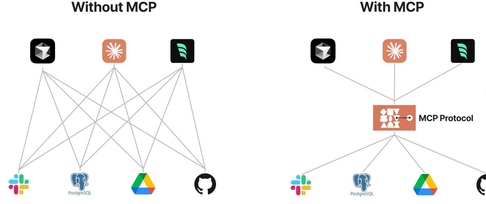

# MCP (Model Context Protocol)




### Example MCP Server Configuration
#### Github, filesystem, and browser-tools-mcp
```json
{
  "mcpServers": {
    "github.com/modelcontextprotocol/servers/tree/main/src/github": {
      "command": "node",
      "args": [
        "/Users/chenruochen/Documents/Cline/MCP/github/src/github/dist/index.js"
      ],
      "env": {
        "GITHUB_PERSONAL_ACCESS_TOKEN": "token"   
      },
      "disabled": false,
      "autoApprove": []
    },
    "filesystem": {
      "command": "npx",
      "args": [
        "-y",
        "@modelcontextprotocol/server-filesystem",
        "/Users/chenruochen/"
      ]
    },
    "browser-tools-mcp": {
      "command": "npx",
      "args": [
        "-y",
        "@agentdeskai/browser-tools-mcp@latest"
      ]
    }
  }
}
```
### Principle
- When requesting a large model, some system prompt words will be attached, including the detailed usage method of mcp, and then the user's question will be added. Next, the large model decides which mcp tool to use and how to pass the parameters
- Or use functional call when requesting a large model

[MCP Tools](https://smithery.ai/)

### Some Interesting MCP Tools

[Some Interesting MCP Tools](https://github.com/modelcontextprotocol/servers/)
