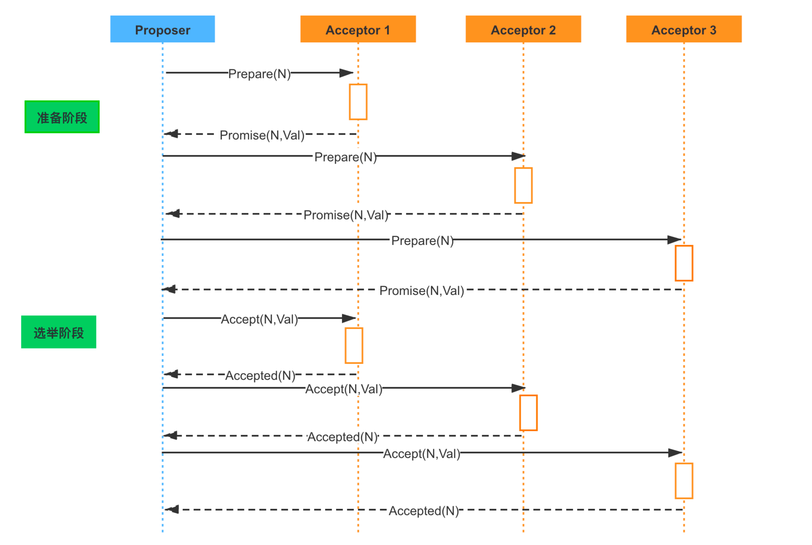

# Distributed Consistency Algorithms

## Quorum 
在 N 个副本中，一次更新成功的如果有 W 个，那么我在读取数据时是要从大于 N－W 个副本中读取，这样就能至少读到一个更新的数据了。
Quorum 是分布式系统中常用的一种机制，用来保证数据冗余和最终一致性的投票算法，在 Paxos、Raft 和 ZooKeeper 的 Zab 等算法中，都可以看到 Quorum 机制的应用。

## Paxos
- Proposer: 提出提案 (Proposal)。Proposal信息包括提案编号 (Proposal ID) 和提议的值 (Value)。
- Acceptor: 参与决策，回应Proposers的提案。在集群中，Acceptor 有 N 个，Acceptor 之间完全对等独立， Proposer 提出的 value 必须获得超过半数（N/2+1）的 Acceptor 批准后才能通过。
- Learner: 不参与决策，从Proposers/Acceptors学习最新达成一致的提案（Value）Proposer 和 Acceptor 是算法核心角色，Paxos 描述的就是在一个由多个 Proposer 和多个 Acceptor 构成的系统中，如何让多个 Acceptor 针对 Proposer 提出的多种提案达成一致的过程，而 Learner 只是“学习”最终被批准的提案。

## Zab
ZooKeeper 是通过 Zab 协议来保证分布式事务的最终一致性。Zab（ZooKeeper Atomic Broadcast，ZooKeeper 原子广播协议）支持崩溃恢复，基于该协议，ZooKeeper 实现了一种主备模式的系统架构来保持集群中各个副本之间数据一致性。

在 ZooKeeper 集群中，所有客户端的请求都是写入到 Leader 进程中的，然后，由 Leader 同步到其他
节点，称为 Follower。在集群数据同步的过程中，如果出现 Follower 节点崩溃或者 Leader 进程崩溃
时，都会通过 Zab 协议来保证数据一致性。
Zab 协议的具体实现可以分为以下两部分：
消息广播阶段
Leader 节点接受事务提交，并且将新的 Proposal 请求广播给 Follower 节点，收集各个节点的反馈，
决定是否进行 Commit，在这个过程中，也会使用前面提到的 Quorum 选举机制。
崩溃恢复阶段
如果在同步过程中出现 Leader 节点宕机，会进入崩溃恢复阶段，重新进行 Leader 选举，崩溃恢复阶
段还包含数据同步操作，同步集群中最新的数据，保持集群的数据一致性。
整个 ZooKeeper 集群的一致性保证就是在上面两个状态之前切换，当 Leader 服务正常时，就是正常
的消息广播模式；当 Leader 不可用时，则进入崩溃恢复模式，崩溃恢复阶段会进行数据同步，完成以
后，重新进入消息广播阶段。

### Raft
