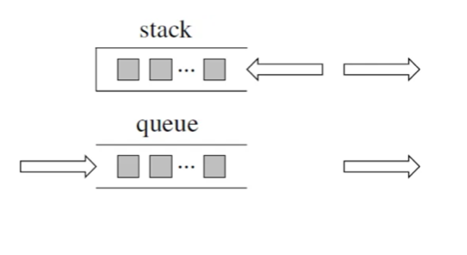

# LeetCode Summary


## Array
## HashMap
## Stack and Queue

## Binary Tree
Depth-First Traversal
Preorder Traversal (Recursive, Iterative) Left-Right
Inorder Traversal (Recursive, Iterative) Left-Middle-Right
Postorder Traversal (Recursive, Iterative) Left-Right-Middle
Breadth-First Traversal
Level Order Traversal (Iterative)
## Backtracking
The for loop can be understood as horizontal traversal, and backtracking (recursive) is vertical traversal, which fully traverses the tree. Generally, finding a leaf node is finding one of the results.
```
void backtracking(parameters) {
    if (termination condition) {
        store result;
        return;
    }

    for (selection: elements in the current layer collection (the number of children of the node in the tree is the size of the collection)) {
        process node;
        backtracking(path, selection list); // Recursive
        backtrack, undo processing results
    }
}
```

Combination problems: Find a collection of k numbers from N numbers according to certain rules
Cutting problems: How many ways are there to cut a string according to certain rules
Subset problems: How many subsets of N numbers meet the conditions
Permutation problems: How many permutations are there for N numbers according to certain rules
Chessboard problems: N queens, solving Sudoku, etc.

## Greedy
### As long as you think clearly about what the local optimum is, if you can deduce the global optimum, it's actually enough

## Dynamic Programming
### Determine the dp array (dp table) and the meaning of the index
### Determine the recursive formula
### How to initialize the dp array
### Determine the traversal order
### Example to deduce the dp array


