# AWS-SAA Udemy Class 

## IAM
IAM is the AWS Identity and Access Management service that enables you to manage users, groups, and roles in your AWS account. It is a centralized control point that manages access to your AWS resources.

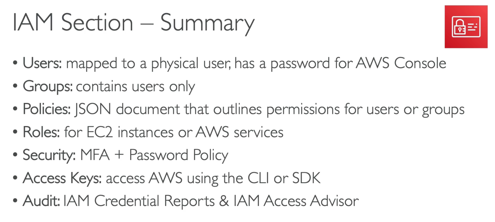

## EC2
EC2 is the AWS Elastic Compute Cloud service that provides resizable compute capacity in the AWS cloud. It enables you to launch virtual machines (VMs) in the AWS cloud, and configure them with the software you need to run your applications.
[EC2 Instance Types](https://aws.amazon.com/ec2/instance-types/)
[See al list of EC2 instances and comparisons](https://instances.vantage.sh/)

**Use IAM role for EC2 instances, and do not enter any credentials in the instance.**

### AWS EC2 Purchase Options Comparison

| **Type**                 | **Pricing**             | **Use Case** | **Key Features** | **Best For** |
|--------------------------|------------------------|-------------|------------------|--------------|
| **On-Demand Instances**  | Pay-as-you-go          | Flexible, short-term workloads | No upfront payment, scales instantly | Development, testing, unpredictable workloads |
| **Reserved Instances (RI)** | 1-3 year commitment | Steady-state workloads | Lower cost than On-Demand, reservation required | Long-term applications, databases, backend services |
| **Spot Instances**       | Up to 90% discount    | Fault-tolerant, flexible workloads | Can be interrupted by AWS if capacity is needed | Batch processing, big data, AI/ML, rendering |
| **Savings Plans**        | Flexible pricing model | Predictable usage | Commit to usage for 1-3 years, applies to various instance types | Businesses looking to save without RI complexity |
| **Dedicated Hosts**      | Physical server rental | Compliance, licensing | Dedicated server with control over placement | Enterprise compliance, bring-your-own-license (BYOL) software |
| **Capacity Reservations** | Pay for reserved capacity | High availability needs | Ensures EC2 capacity in a specific AZ | Mission-critical applications needing guaranteed availability |
| **Spot Fleet**           | Group of Spot Instances | Large-scale batch jobs | Mix of Spot and On-Demand to optimize cost | Large-scale data processing, containerized workloads |

#### **Key Takeaways**
- **On-Demand**: Best for flexible workloads without long-term commitment.
- **Reserved Instances**: Good for predictable workloads with cost savings.
- **Spot Instances**: Great for cost savings but may be interrupted.
- **Savings Plans**: Flexible alternative to RI with long-term cost savings.
- **Dedicated Hosts**: Best for compliance and special licensing needs.
- **Capacity Reservations**: Ensures EC2 capacity in specific regions.
- **Spot Fleet**: Ideal for cost-efficient, large-scale workloads.

### AWS EC2 Placement Groups Comparison

| **Placement Group Type** | **Description** | **Key Benefits** | **Best Use Cases** |
|--------------------------|----------------|------------------|--------------------|
| **Cluster Placement Group** | Instances are placed close together in a single Availability Zone (AZ). | Low-latency, high-bandwidth communication between instances. | High-performance computing (HPC), big data analytics, machine learning, real-time applications. |
| **Spread Placement Group** | Instances are placed across distinct hardware within a single or multiple AZs. | Reduces the risk of simultaneous failures, improves redundancy. | Small number of critical instances needing high availability (e.g., database clusters, application backends). |
| **Partition Placement Group** | Instances are divided into logical partitions across multiple racks in an AZ. | Fault isolation—failures in one partition do not affect others. | Large-scale distributed applications, big data workloads (e.g., Hadoop, Cassandra, Kafka). |

#### **Key Takeaways**
- **Cluster**: Best for workloads requiring **low network latency & high throughput**.
- **Spread**: Ensures **high availability** for a small number of critical instances.
- **Partition**: Provides **fault isolation** for large distributed systems.

### EC2 Hibernate

### EC2 Nitro
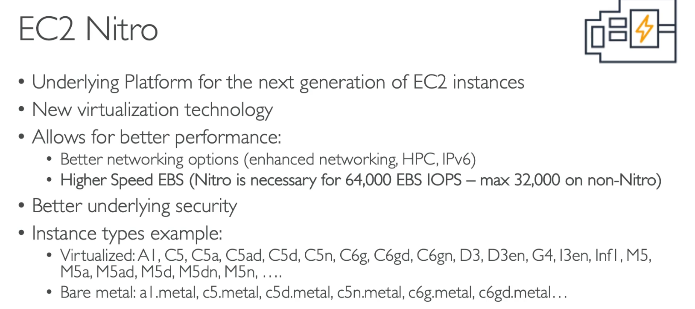

### EC2 vCPU

### EC2 Capacity Reservations

### EC2 Metadata
- EC2 Metadata provides information about the instance, such as instance ID, region, and availability zone.
- We can retrieve metadata using the following URL: `http://169.254.169.254/latest/meta-data/`

### EBS
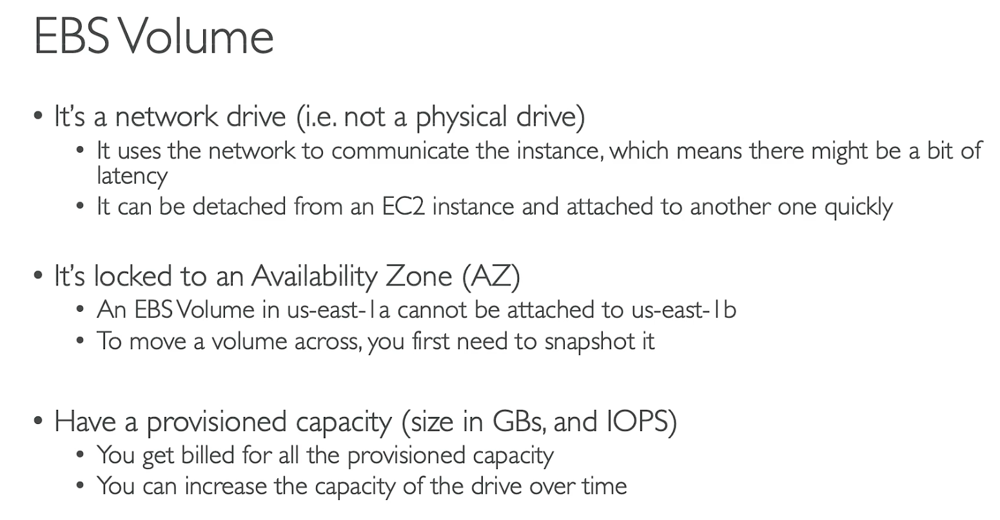

### AMI
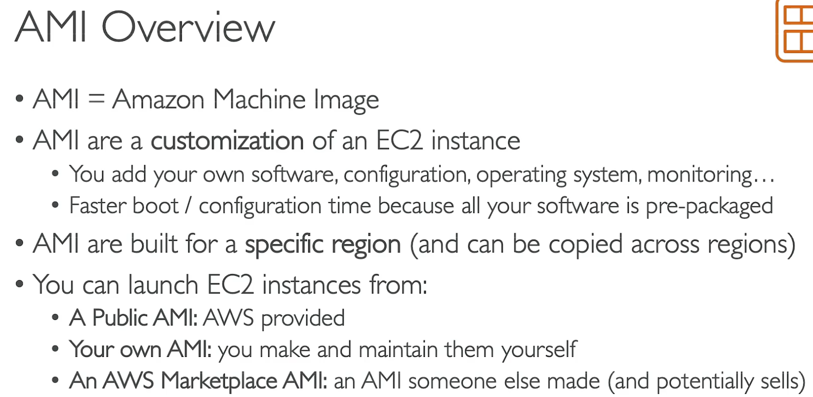

### EC2 Instance Store vs EBS
| Feature        | EC2 Instance Store | EBS (Elastic Block Store) |
|--------------|---------------|-------------------------|
| **Persistence** | ❌ Data lost when instance stops/terminates | ✅ Persistent storage |
| **Speed**      | 🚀 Directly attached, ultra-low latency | 📉 Network-attached, slightly slower |
| **Cost**       | ✅ Free (included with supported instances) | 💰 Charged separately |
| **Availability** | ❌ Limited to specific EC2 instance types | ✅ Available for all EC2 instances |
| **Snapshot Support** | ❌ No snapshot/backup support | ✅ Supports snapshots, can back up to S3 |
| **Use Cases** | **Cache, logs, temporary files** | **Databases, persistent data storage** |

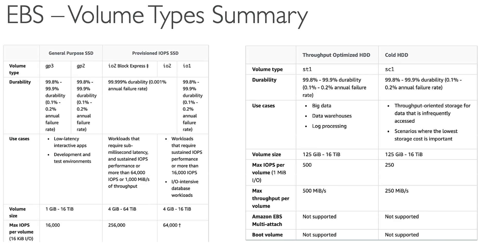
- EBS can be attached to multiple EC2 instances at the same time.

## EFS

| Feature        | EFS (Elastic File System) | EBS (Elastic Block Store) |
|---------------|--------------------------|--------------------------|
| **Storage Type** | Network File System (NFS) | Block Storage (like a hard drive) |
| **Access** | Shared across multiple EC2 instances | Attached to a single EC2 instance (except Multi-Attach) |
| **Latency** | Higher latency | Low latency, high performance |
| **Performance** | Scales automatically | Fixed size, needs manual scaling |
| **Availability** | Multi-AZ replication | Single AZ (unless backed up with snapshots) |
| **Backup** | Managed by AWS | Supports manual and automated snapshots |
| **Pricing** | More expensive | Cheaper than EFS |
| **Best for** | Shared storage, web servers, container storage, logs | Databases, application servers, high-performance workloads |

- EFS is a file system that can be mounted on multiple EC2 instances in different AZs, making it easy to share data across multiple instances.

## CLB (Classic Load Balancer)
- Deprecated.
## ALB (Application Load Balancer)
- Great fit in container-based and microservices architectures.
- Supports HTTP/2, WebSockets, and gRPC protocols.
## NLB (Network Load Balancer)
- Great for high-performance and network-intensive applications.
- Supports TCP, TLS, UDP, and WebSocket protocols.

### AWS Load Balancer Comparison: ALB vs. NLB vs. GLB

| **Load Balancer Type** | **Layer** | **Protocol** | **Key Features** | **Use Cases** |
|-----------------------|-----------|-------------|------------------|--------------|
| **ALB (Application Load Balancer)** | **Layer 7 (Application Layer)** | HTTP, HTTPS | - Routes traffic based on **URL, Host, Header** - Supports **WebSocket, gRPC** - **AWS WAF integration** | **Web applications, API gateway, microservices (ECS, EKS, Lambda)** |
| **NLB (Network Load Balancer)** | **Layer 4 (Transport Layer)** | TCP, UDP | - **Ultra-low latency** (microseconds) - **Preserves client IP** - Handles millions of connections | **Gaming, WebRTC, databases, IoT applications** |
| **GLB (Gateway Load Balancer)** | **Layer 3 or Layer 4 (Network Layer)** | TCP, UDP | - **Manages virtual appliance traffic** (e.g., firewalls, IDS/IPS) - **Traffic mirroring and network security features** | **Virtual appliances, traffic mirroring, security services, network functions** |

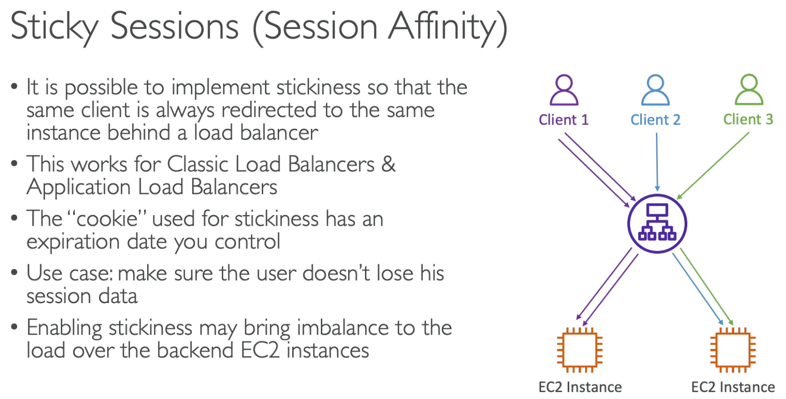
- Connection Draining (also called Deregistration Delay) is a feature in AWS Elastic Load Balancer (ELB) that ensures active requests are gracefully completed before a backend instance is removed from service.

## Auto Scaling Group (ASG)
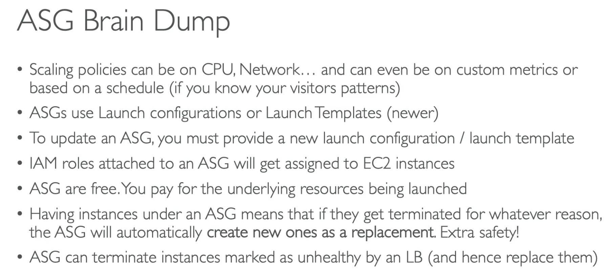
| Scaling Method         | Trigger Condition                        | Suitable Scenario |
|------------------------|-----------------------------------------|-------------------|
| **Manual Scaling**     | Manually modifying ASG configuration   | Stable workloads  |
| **Scheduled Scaling**  | Predefined time-based scaling          | Predictable traffic patterns (e.g., daily peaks) |
| **Dynamic Scaling**    | CloudWatch metrics (CPU, network, etc.) | Workloads with fluctuating demand |
| **Step Scaling**       | Threshold-based scaling steps           | Gradual load increases |
| **Target Tracking Scaling** | Maintaining a target metric (e.g., CPU at 50%) | Auto-adjusting workloads |
| **Predictive Scaling** | AI-based traffic pattern prediction    | Cyclic traffic changes (e.g., e-commerce sales) |

- After scaling happend, we are in cooldown period (default 300 seconds). During cooldown period, no new instances are added or removed. Use ready-to-use AMI to reduce the this time.

| Feature                | Launch Template                        | Launch Configuration (deprecated) |
|------------------------|--------------------------------------|----------------------|
| **Support for ASG**    | ✅ Yes                                | ✅ Yes              |
| **Multiple Versions**  | ✅ Supports multiple versions        | ❌ Only one per ASG |
| **Instance Types**     | ✅ Can specify multiple instance types | ❌ Only one instance type |
| **Spot Instances**     | ✅ Supports On-Demand & Spot Mix      | ❌ No Spot mix support |
| **IAM Instance Profile** | ✅ Yes                              | ✅ Yes              |
| **Elastic GPU & EBS Encryption** | ✅ Yes                    | ❌ No               |
| **User Data Updates**  | ✅ Can create new versions with updates | ❌ Must create a new launch config |
| **Pricing Model Support** | ✅ Supports On-Demand, Spot, Savings Plans | ❌ Limited |
| **Deprecation Status** | ✅ Recommended by AWS               | ❌ Deprecated (since 2022) |

## RDS
- Support for MySQL, PostgreSQL, MariaDB, Oracle, SQL Server, Aurora, and Aurora MySQL.

#### Why Use RDS Instead of DB on EC2?
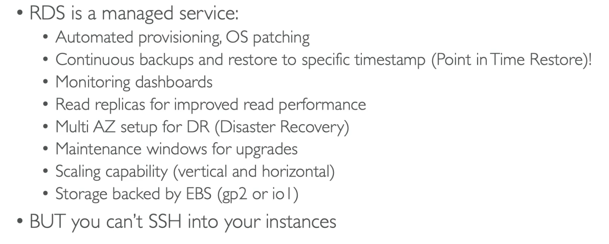

- RDS has backup, monitoring, and auto-scaling built-in.
- RDS read replicas can be used for read-only queries and for load balancing (if replica in the same AZ, no fee is charged).
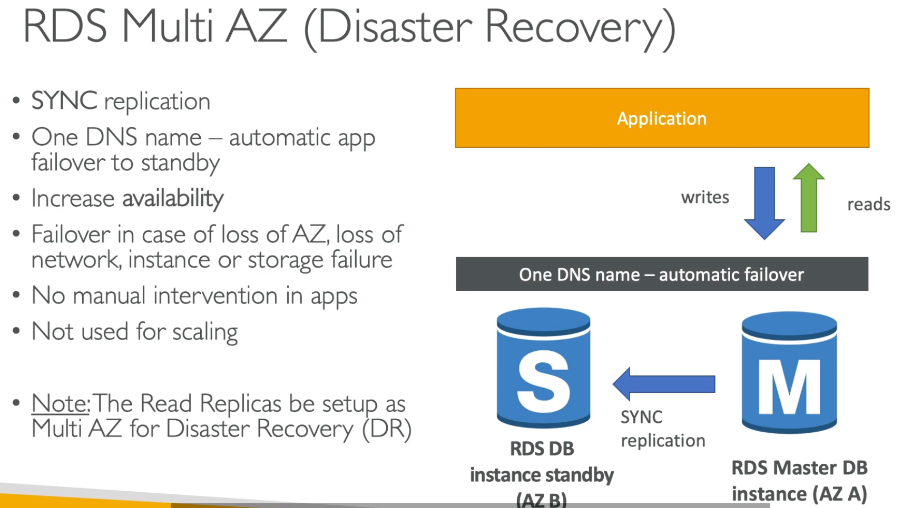

## Aurora
| Feature               | Amazon Aurora                          | Amazon RDS (MySQL, PostgreSQL, etc.) |
|-----------------------|--------------------------------------|--------------------------------------|
| **Performance**       | ⚡ Up to 5x MySQL, 3x PostgreSQL performance | Standard MySQL/PostgreSQL performance |
| **Storage Scaling**   | Auto-scaling (10GB - 128TB)         | Manual scaling (max 64TB)          |
| **Replication**       | 6 copies across 3 AZs               | 1 primary + up to 5 read replicas  |
| **Failover Time**     | Seconds (as fast as 30s)            | Minutes (manual intervention needed) |
| **Read Replicas**     | Up to 15 replicas, latency < 10ms    | Up to 5 replicas                   |
| **Multi-AZ Support**  | Built-in high availability, auto failover | Requires Multi-AZ configuration    |
| **Backup**           | Continuous automatic backups        | Manual snapshots required          |
| **Pricing**          | More expensive (usage-based pricing) | Cheaper (fixed instance pricing)   |
| **Best For**         | High performance, auto-scaling, large-scale apps | Small to medium apps, cost-sensitive projects |

| Use Case                          | Amazon Aurora | Amazon RDS |
|-----------------------------------|--------------|------------|
| High-performance, high-availability needs | ✅ | ❌ |
| Read-heavy applications (e.g., e-commerce, social media) | ✅ | ❌ |
| Small applications or budget-conscious projects | ❌ | ✅ |
| Auto-scaling storage needs | ✅ | ❌ |
| Traditional database migrations (MySQL, PostgreSQL) | ✅ | ✅ |

### Aurora Custom Endpoints
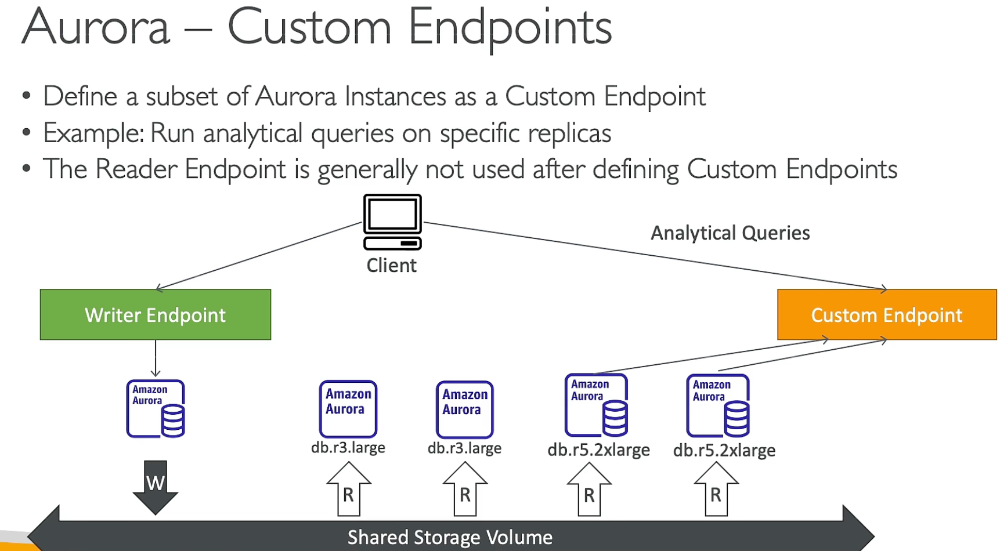
### Aurora Serverless
- Serverless Aurora is a new Aurora engine that automatically starts and scales capacity as needed, without the need to manually manage capacity.
- Serverless Aurora is ideal for infrequent, intermittent, or unpredictable workloads that can handle spikes in traffic.
### Aurora Multi-Master
- Aurora Multi-Master is a new feature that enables you to create a read-write replica in a different Availability Zone (AZ) from the primary instance.

## ElastiCache
- In-memory caching service that can be used to reduce database load and improve application performance.
 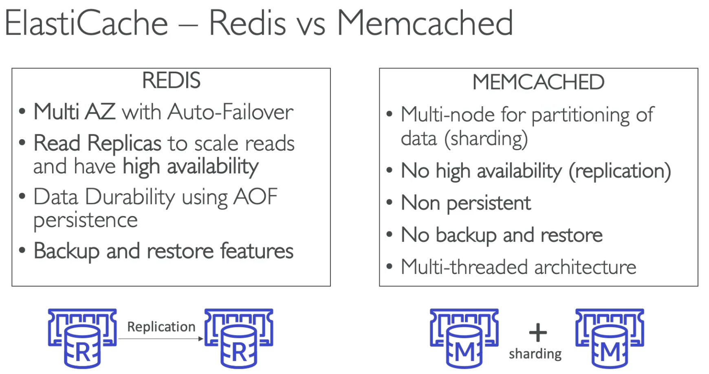

 ## Route 53
 Common Record Types:
 | Record Type  | Description |
|-------------|-------------|
| **A (Address) Record** | Maps a domain (e.g., example.com) to an IPv4 address (e.g., 192.0.2.1). |
| **AAAA Record** | Maps a domain to an IPv6 address. |
| **CNAME (Canonical Name) Record** | Maps a domain alias to another domain (e.g., www.example.com → example.com). |
| **MX (Mail Exchange) Record** | Specifies mail servers for email routing. |
| **TXT (Text) Record** | Stores arbitrary text, often used for domain verification or security (e.g., SPF, DKIM, DMARC). |
| **NS (Name Server) Record** | Defines authoritative name servers for a domain. |
| **PTR (Pointer) Record** | Maps an IP address to a domain name (reverse DNS lookup). |
| **SRV (Service) Record** | Specifies location of services (e.g., VoIP, XMPP). |
| **SPF (Sender Policy Framework) Record** | Defines mail servers allowed to send emails on behalf of the domain (deprecated, use TXT). |
| **CAA (Certificate Authority Authorization) Record** | Specifies which Certificate Authorities (CAs) can issue SSL certificates for the domain. |

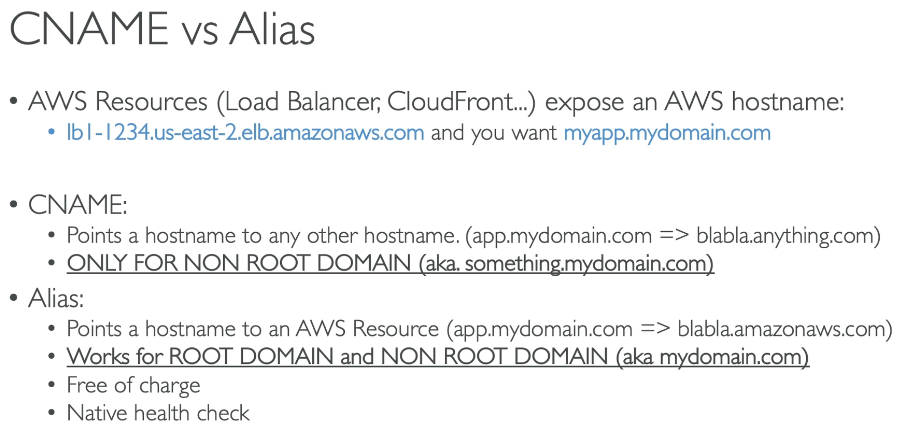

### Routing Policies
| Routing Policy          | Description |
|-------------------------|-------------|
| **Simple Routing**      | Default routing, maps a domain to a single endpoint. |
| **Weighted Routing**    | Distributes traffic across multiple resources based on assigned weights. |
| **Latency-Based Routing** | Routes users to the region with the lowest latency. |
| **Geolocation Routing** | Directs traffic based on the user's geographic location. |
| **Geoproximity Routing** | Routes users to the nearest AWS region/resource with bias control. |
| **Failover Routing**    | Redirects traffic to a backup resource if the primary fails. |
| **Multi-Value Answer**  | Returns multiple IP addresses to distribute load among resources. |

## Beanstalk
- Simplified deployment and management of web applications on AWS.
- Supports multiple programming languages and frameworks (e.g., Ruby on Rails, Node.js, Java, Python, Go).
- Supports auto-scaling, load balancing, and health monitoring.

## S3
- Objects (files) have a key, and key is the full path to the object in the bucket.

### S3 Versioning
- S3 Versioning allows you to keep multiple versions of an object in the same bucket. 

### Amazon S3 Encryption 
#### Methods Comparison

| Encryption Method  | Description | Key Management | Use Case | AWS CLI Example |
|--------------------|-------------|---------------|----------|-----------------|
| **SSE-S3** (Server-Side Encryption with S3 Managed Keys) | AWS S3 **automatically encrypts** objects with **AES-256** and manages the keys. | Managed by AWS (no user control) | Default encryption, no extra setup needed. | `aws s3 cp myfile.txt s3://mybucket/ --sse AES256` |
| **SSE-KMS** (Server-Side Encryption with AWS KMS Keys) | Uses **AWS Key Management Service (KMS)** for key storage and access control. Supports **audit logging**. | Managed in **AWS KMS**, fine-grained control | Compliance-heavy workloads needing **audit logs & access control** | `aws s3 cp myfile.txt s3://mybucket/ --sse aws:kms` |
| **SSE-C** (Server-Side Encryption with Customer-Provided Keys) | You provide the encryption key. AWS **does not store** the key. | Fully managed by the user | Full control over encryption keys (but must securely store them) | `aws s3 cp myfile.txt s3://mybucket/ --sse-c AES256 --sse-c-key "your-base64-key"` |
| **Client-Side Encryption** | Data is encrypted **before uploading to S3** using an SDK or external tools. | Fully managed by the user | When you **don’t trust AWS** to manage encryption keys. Used for **extra security layers**. | Use AWS SDK or OpenSSL: `openssl enc -aes-256-cbc -salt -in myfile.txt -out myfile.enc` |

#### S3 Encryption in Transit

| Protection Type | Description | Implementation |
|----------------|-------------|---------------|
| **HTTPS/TLS** | Encrypts data **during transmission** to/from S3. | Use `https://` for S3 API calls |
| **VPC Endpoints** | Keeps S3 traffic **inside AWS private network** instead of the public internet. | Configure **VPC endpoint** for S3 |

### S3 Bucket Policies
- Bucket policies are JSON documents that specify who can access the bucket and what actions they can perform.

### S3 CORS
- If a client does a cross-origin request on S3, we need to enable the correct CORS headers.
- Different buckets are in different origins, so we need to enable CORS for each bucket separately.

 