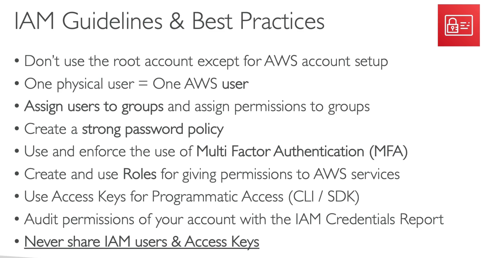
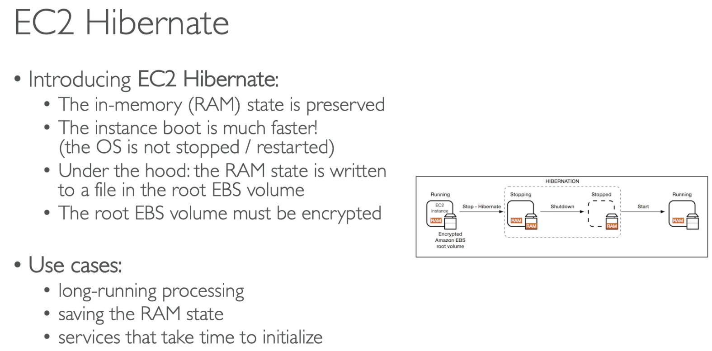
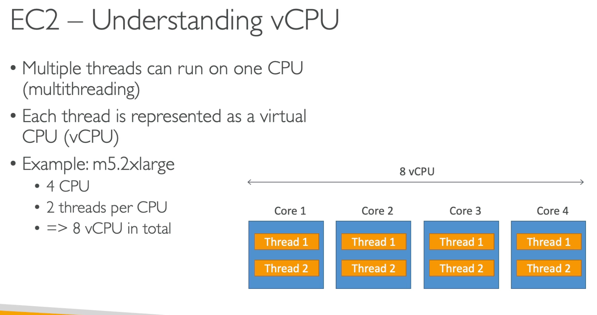
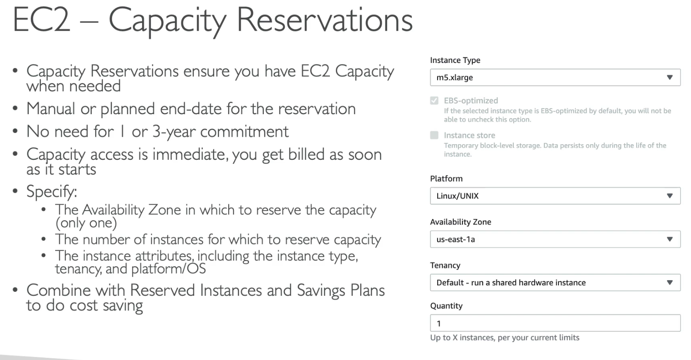

# AWS-SAA Udemy Class 

## IAM

## EC2

**Use IAM role for EC2 instances, and do not enter any credentials in the instance.**

### AWS EC2 Purchase Options Comparison

| **Type**                 | **Pricing**             | **Use Case** | **Key Features** | **Best For** |
|--------------------------|------------------------|-------------|------------------|--------------|
| **On-Demand Instances**  | Pay-as-you-go          | Flexible, short-term workloads | No upfront payment, scales instantly | Development, testing, unpredictable workloads |
| **Reserved Instances (RI)** | 1-3 year commitment | Steady-state workloads | Lower cost than On-Demand, reservation required | Long-term applications, databases, backend services |
| **Spot Instances**       | Up to 90% discount    | Fault-tolerant, flexible workloads | Can be interrupted by AWS if capacity is needed | Batch processing, big data, AI/ML, rendering |
| **Savings Plans**        | Flexible pricing model | Predictable usage | Commit to usage for 1-3 years, applies to various instance types | Businesses looking to save without RI complexity |
| **Dedicated Hosts**      | Physical server rental | Compliance, licensing | Dedicated server with control over placement | Enterprise compliance, bring-your-own-license (BYOL) software |
| **Capacity Reservations** | Pay for reserved capacity | High availability needs | Ensures EC2 capacity in a specific AZ | Mission-critical applications needing guaranteed availability |
| **Spot Fleet**           | Group of Spot Instances | Large-scale batch jobs | Mix of Spot and On-Demand to optimize cost | Large-scale data processing, containerized workloads |

#### **Key Takeaways**
- **On-Demand**: Best for flexible workloads without long-term commitment.
- **Reserved Instances**: Good for predictable workloads with cost savings.
- **Spot Instances**: Great for cost savings but may be interrupted.
- **Savings Plans**: Flexible alternative to RI with long-term cost savings.
- **Dedicated Hosts**: Best for compliance and special licensing needs.
- **Capacity Reservations**: Ensures EC2 capacity in specific regions.
- **Spot Fleet**: Ideal for cost-efficient, large-scale workloads.

### AWS EC2 Placement Groups Comparison

| **Placement Group Type** | **Description** | **Key Benefits** | **Best Use Cases** |
|--------------------------|----------------|------------------|--------------------|
| **Cluster Placement Group** | Instances are placed close together in a single Availability Zone (AZ). | Low-latency, high-bandwidth communication between instances. | High-performance computing (HPC), big data analytics, machine learning, real-time applications. |
| **Spread Placement Group** | Instances are placed across distinct hardware within a single or multiple AZs. | Reduces the risk of simultaneous failures, improves redundancy. | Small number of critical instances needing high availability (e.g., database clusters, application backends). |
| **Partition Placement Group** | Instances are divided into logical partitions across multiple racks in an AZ. | Fault isolation—failures in one partition do not affect others. | Large-scale distributed applications, big data workloads (e.g., Hadoop, Cassandra, Kafka). |

#### **Key Takeaways**
- **Cluster**: Best for workloads requiring **low network latency & high throughput**.
- **Spread**: Ensures **high availability** for a small number of critical instances.
- **Partition**: Provides **fault isolation** for large distributed systems.

### EC2 Hibernate

### EC2 Nitro

### EC2 vCPU

### EC2 Capacity Reservations

## EBS