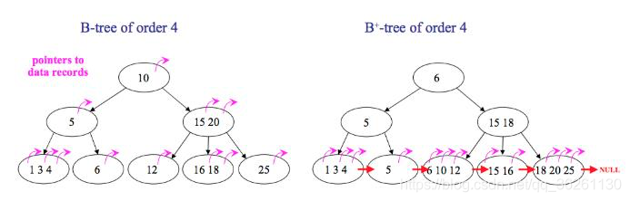

# B-Tree vs. B+ Tree in MySQL InnoDB

MySQL’s InnoDB storage engine uses **B+ Trees** as its primary data structure for indexing. B+ Trees are a modified version of B-Trees, optimized for database indexing.

---

## What is a B-Tree?

A B-Tree (Balanced Tree) is a multi-way balanced tree. Key characteristics of B-Trees include:

1. **Data Stored in Nodes**: Each node in a B-Tree stores keys and values, so data can be located in both leaf and non-leaf nodes.
2. **Multi-Branch Structure**: Each node can have multiple child nodes. The number of children depends on the degree (order) of the B-Tree.
3. **Balance**: B-Trees are balanced, meaning all leaf nodes are at the same level.
4. **Search Efficiency**: Due to its structure, B-Trees provide efficient searching, especially for small datasets.

---

## What is a B+ Tree?

A B+ Tree is an enhanced version of the B-Tree, better suited for database indexing and especially for range queries. Key characteristics of B+ Trees include:

1. **Data Only Stored in Leaf Nodes**: All actual data is stored in leaf nodes, while non-leaf nodes only contain keys. This forms a linked list of all data at the leaf level.
2. **Sequential Access**: Leaf nodes are connected by a linked list, making range queries and ordered data retrieval efficient.
3. **Non-Leaf Nodes as Indexes**: Non-leaf nodes act purely as index points, allowing for more keys at each level, reducing the tree height and increasing efficiency for large datasets.

---

## Key Differences Between B-Trees and B+ Trees

| Feature                     | B-Tree                         | B+ Tree                               |
|-----------------------------|--------------------------------|---------------------------------------|
| **Data Storage**            | Data in both leaf & non-leaf   | Data only in leaf nodes               |
| **Non-Leaf Node Data**      | Yes, stores data               | No, stores only index keys            |
| **Linked List Connection**  | None                           | Leaf nodes connected by linked list   |
| **Range Query Efficiency**  | Moderate                       | High due to linked leaf nodes         |
| **Tree Height**             | Higher due to data storage     | Lower as nodes contain only indexes   |

---

## Why InnoDB Chooses B+ Tree?

1. **Efficient Range Queries**: In databases, range queries (e.g., `BETWEEN` or sorting) are common. The linked structure of B+ Tree leaf nodes makes range queries more efficient.

2. **Reduced I/O Operations**: Since non-leaf nodes store only indexes, B+ Trees can store more index information at each level, keeping the tree height low, and reducing disk I/O.

3. **Optimized Bulk Reading**: The leaf node linked list enables sequential traversal, ideal for batch data access.

B+ Trees’ structure and linked leaf nodes make them well-suited for large-scale data with efficient range and order-based retrieval, making them a preferred choice for MySQL’s InnoDB storage engine.

