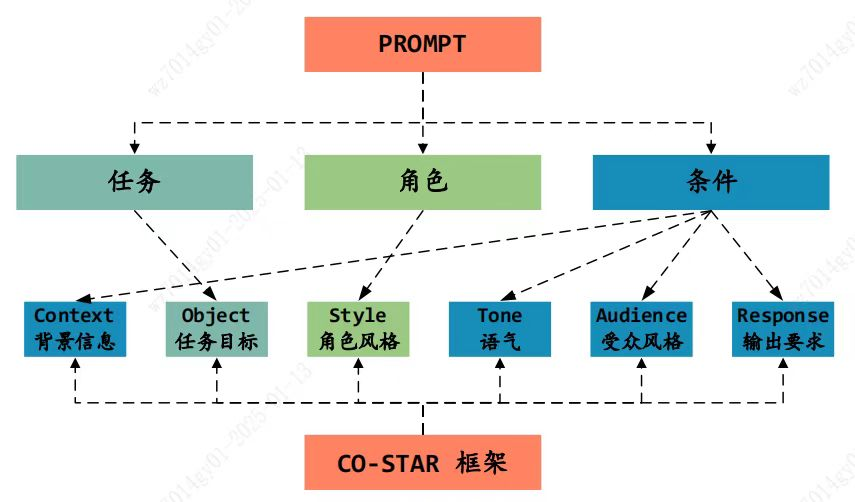

# Week 7
## Document security check API
#### Reconstruct the code to reduce the complexity and satisfy the coding standard 
#### Adjust the return format
#### Test the API in the development environment

## Auto-generation of project designing documents
#### Read prompt engineering document in CMB
#### Think how to use prompt engineering document to generate a comprehensive project designing documents

## Common notice API
#### Solve the error in production environment, try to get the configuration dynamically from either dev or prd environment

## Understand the CICD process in CMB
#### Read the cloud native managment platform book

## Tecnical points
#### 1. LLM prediction parameters
1. Temperature parameter
- The lower the temperature, the more certain about the generated result by LLM.
- For `Creating` task, the temperature should be higher.
- For `Solving` task, the temperature should be lower.
2. Top_p parameter
- Use together with temperature parameter.
- If need more accurate result, use a lower top_p value (<0.75).
- If need creative result, use a higher top_p value (>=0.75).

#### 2. Prompt 
1. CO-STAR framework

- (C) Context: Provide background information for the task to help the LLM accurately understand the specific scenario, ensuring the output is relevant to the context.
- (O) Object: Clearly define the task for the LLM, specifying the task objectives to help the LLM focus on completing the task.
- (S) Style: Specify the writing style of the LLM, which can be set to mimic a particular character's style.
- (T) Tone: Set the emotional tone of the LLM to ensure the response aligns with the desired emotional and mood tone.
- (A) Audience: Identify the target audience and customize the LLM's response characteristics for specific audiences.
- (R) Response: Specify the output format of the LLM to ensure the results can be received and easily parsed by downstream systems. Common formats include lists, JSON, Markdown, etc.

2. Zero-shot learning
- Zero-shot learning is a natural language processing technique that allows a model to perform inference on text without any fine-tuning or training on a specific task.
- It is often used in natural language understanding tasks such as sentiment analysis, named entity recognition, and question answering.
- The key idea behind zero-shot learning is to use a pre-trained model that has been trained on a large corpus of text to perform inference on text that has not been seen during training.

3. Few-shot learning
- Few-shot learning is a natural language processing technique that allows a model to perform inference on text with only a few labeled examples.
- It is often used in natural language understanding tasks such as sentiment analysis, named entity recognition, and question answering.
- The key idea behind few-shot learning is to use a pre-trained model that has been trained on a small corpus of text to perform inference on text that has not been seen during training.
- Hard to deal with complex computing and inference tasks.

4. COT (chain-of-thought)
COT is an advanced prompting strategy designed to enhance the performance of large language models on various complex reasoning tasks. Common reasoning tasks include arithmetic reasoning, common sense reasoning, and symbolic reasoning. Unlike ordinary Few-Shot which only uses ⟨input, output⟩ pairs to construct prompts, chain-of-thought prompting further integrates intermediate reasoning steps to guide the reasoning process from input to output. As an extension of contextual learning, chain-of-thought prompting transforms the original ⟨input, output⟩ mapping relationship into a ⟨input, chain-of-thought, output⟩ triplet form.

5. Other Prompting Techniques
- Clarify the task or requirement: Clearly specify the goal or task you want the generated text to achieve in the prompt, such as description, explanation, comparison, summary, etc.
Example: Please describe the history and development process of China Merchant Bank.
- Prohibitions: Specify particular topics, fields, or backgrounds in the prompt to ensure the model generates content related to them.
Example: Introduce the existing public funds in the market, but do not recommend financial products to clients.
- Specify format or structure: If you have specific text format or structure requirements, you can clearly specify them in the prompt, such as lists, paragraphs, headings, etc.
Example: Write an investment research report on Country Garden, including introduction, body, and conclusion.
- Determine tone or style: If you want the generated text to have a specific tone, style, or manner, you can express it clearly in the prompt.
Example: Introduce the current market situation to clients in a formal style.
- Specify key information or elements: Provide key information or elements in the prompt to ensure the generated text includes the required content.
Example: Provide detailed fund information, including fund manager, investment style, and investment targets.

6. RAG (Retrieval-Augmented Generation)
- RAG is a natural language generation technique that combines retrieval and generation to generate text that is relevant to the input query.
- The key idea behind RAG is to use a pre-trained model to retrieve relevant documents from a large corpus of text, and then use the retrieved documents to generate new text that is relevant to the input query.
- RAG can be used in various natural language generation tasks, such as text summarization, question answering, and dialogue generation.

7. Spring Annotation
- Do not use `new` to create Spring-managed Beans, otherwise Spring will not manage the Bean and the related Spring annotations will not take effect.