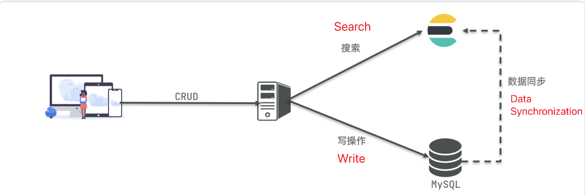

# Concepts

- **Forward Index** is the most traditional, indexing by ID. However, when searching for a term, it must first retrieve each document one by one and then check if the document contains the required term. This is a process of finding terms based on documents.
- **Inverted Index**, on the other hand, first finds the term the user wants to search for, gets the IDs of the documents containing that term, and then retrieves the documents based on those IDs. This is a process of finding documents based on terms.

### Forward Index
- **Advantages**:
  - Can create indexes for multiple fields.
  - Searching and sorting based on indexed fields is very fast.
- **Disadvantages**:
  - When searching for non-indexed fields or partial terms within indexed fields, a full table scan is required.

### Inverted Index
- **Advantages**:
  - Searching and fuzzy searching based on terms is very fast.
- **Disadvantages**:
  - Can only create indexes for terms, not for fields.
  - Cannot sort based on fields.

Elasticsearch is document-oriented storage, where data can be a single product entry in a database or an order information. Document data is serialized into JSON format and stored in Elasticsearch. Therefore, a row of data in a database is a JSON document in Elasticsearch; and the columns in each row of data are converted into fields in the JSON document.

Storing all documents in a disorganized manner is obviously very messy and inconvenient to manage. Therefore, we need to group similar types of documents together for management, which is called an index (Index).

| MySQL         | Elasticsearch  | Description                                                                 |
|---------------|----------------|-----------------------------------------------------------------------------|
| Table         | Index          | An index is a collection of documents, similar to a table in a database.    |
| Row           | Document       | A document is a piece of data, similar to a row in a database, and is in JSON format. |
| Column        | Field          | A field is a column in a JSON document, similar to a column in a database.  |
| Schema        | Mapping        | Mapping is the constraint on the documents in an index, such as field type constraints, similar to the schema of a database table. |
| SQL           | DSL            | DSL is a JSON-style request statement provided by Elasticsearch, used to operate Elasticsearch and achieve CRUD. |

- **MySQL**: Good at transactional operations, ensuring data security and consistency.
- **Elasticsearch**: Good at searching, analyzing, and computing large amounts of data.

Therefore, in enterprises, they are often used in combination:
- Write operations with high security requirements are implemented using MySQL.
- Search requirements with high performance demands are implemented using Elasticsearch.
- The two are synchronized in some way to ensure consistency.

