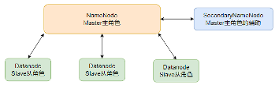
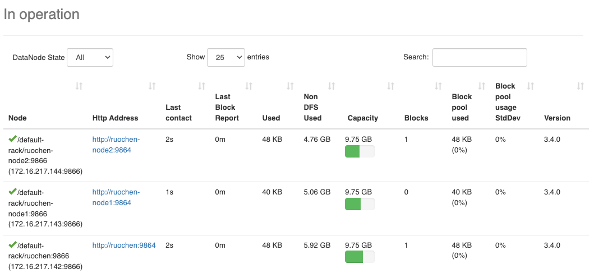
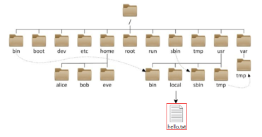

# HDFS

## HDFS Architecture
- Main Role: NameNode  
- Secondary Role: DataNode  
- Auxiliary Role: SecondaryNameNode  

**NameNode:**  
- The main role in the HDFS system, it is an independent process.  
- Responsible for managing the entire HDFS file system.  
- Responsible for managing DataNodes.  

**DataNode:**  
- The secondary role in the HDFS system, it is an independent process.  
- Primarily responsible for data storage, i.e., storing and retrieving data.  

**SecondaryNameNode:**  
- An auxiliary to the NameNode, it is an independent process.  
- Mainly helps the NameNode with metadata organization tasks.  

## Open Port 9870  

## HDFS Commands
HDFS, like the Linux system, is organized with `/` as the root directory.  

#### How to distinguish HDFS and Linux paths?  
- Linux: file:///  
- HDFS: hdfs://namenode:port/  
- For example:  
- Linux: file:///usr/local/hello.txt  
- HDFS: hdfs://node1:8020/usr/local/hello.txt  
- The protocol headers file:/// or hdfs://node1:8020/ can be omitted.  
- Parameters requiring a Linux path will automatically be recognized as file://  
- Parameters requiring an HDFS path will automatically be recognized as hdfs://  
- Unless you explicitly need to write or not write to avoid bugs, generally, you don't need to write the protocol header.

### HDFS Commands (New Version Usage), Usage: `hdfs dfs [generic options] or hadoop fs [generic options]`
#### 1. Create a directory 
`hdfs dfs -mkdir [-p] <path> ...`
- path is the directory to be created  
-  -p option behaves like Linux mkdir -p, creating parent directories along the path.  
- e.g. hdfs fs -mkdir -p /ruochen/hadoop

#### 2. View contents of a specified directory 
`hdfs dfs -ls [-h] [-R] [<path> ...] `
- path specifies the directory path  
-   -h displays file size in a human-readable format  
-   -R recursively views the specified directory and its subdirectories  

#### 3. Upload files to a specified HDFS directory 
`hdfs dfs -put [-f] [-p] <localsrc> ... <dst>`
- -f overwrites the target file (if it exists)  
-   -p preserves access and modification times, ownership, and permissions.  
-   localsrc is the local file system (on the client machine)  
-   dst is the target file system (HDFS)  
- e.g. hdfs dfs -put file:///etc/profile hdfs://ruochen:8020/ruochen/hadoop/

#### 4. View HDFS file content 
`hdfs dfs -cat <src> ...`
- hdfs dfs -cat /itcast/profile  
- For reading large files, you can use a pipe with more  
- hdfs dfs -cat `<src>` | more

#### 5. Download HDFS files to local 
`hdfs dfs -get [-f] [-p] <src> ... <localdst>`
- Downloads files to a specified directory in the local file system, localdst must be a directory  
- -f overwrites the target file (if it exists)  
- -p preserves access and modification times, ownership, and permissions.

#### 6. Copy HDFS files 
`hdfs dfs -cp [-f] <src> ... <dst>`
-f overwrites the target file (if it exists)

#### 7. Append data to an HDFS file 
`hdfs dfs -appendToFile <localsrc> ... <dst>`
- Appends the contents of all given local files to the specified dst file.  
- If dst does not exist, the file will be created.  
- If `<localSrc>` is -, input is read from standard input.

#### 8. Move HDFS data 
`hdfs dfs -mv <src> ... <dst>`
- Moves files to the specified folder  
- This command can be used to move data and rename files

#### 9. Delete HDFS data 
`hdfs dfs -rm -r [-skipTrash] URI [URI ...]`
- Deletes files or directories at the specified path  
- -skipTrash skips the trash and deletes directly  
- The trash feature is disabled by default; to enable it, configure it in core-site.xml

More Commands: [Hadoop Command](https://hadoop.apache.org/docs/r3.3.4/hadoop-project-dist/hadoop-common/FileSystemShell.html)

In Jetbrains products, plugins can be installed, among which the Big Data Tools plugin can help us easily operate HDFS, such as  
IntelliJ IDEA (Java IDE)  
PyCharm (Python IDE)  
DataGrip (SQL IDE)  
All support the Bigdata Tool plugin.

### HDFS Storage Principles
- Data stored in HDFS is distributed, meaning each server node is responsible for a part of the data.
- Data in HDFS is stored in blocks.
- The default replication factor is 3, meaning each data block has 3 replicas. This can be modified in the hdfs-site.xml file or specified when creating a file.
- The fsck command checks the replication factor of files.

### HDFS Write Process
1. The client sends a request to the NameNode.
2. The NameNode checks permissions and available space, and if conditions are met, allows writing and informs the client of the DataNode address for writing.
3. The client sends data packets to the specified DataNode.
4. The DataNode receiving the data simultaneously completes the replication of data blocks, distributing the received data to other DataNodes.
5. As shown in the diagram, DataNode1 replicates to DataNode2, then based on DataNode2, replicates to DataNode3 and DataNode4.
6. Once writing is complete, the client notifies the NameNode, and the NameNode records the metadata.
