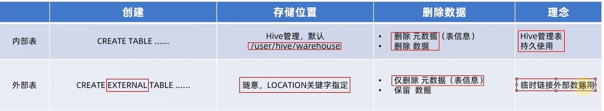
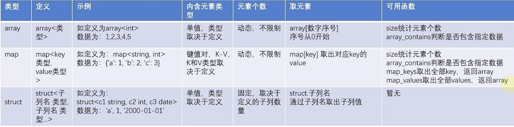

# Hive

- Hive's database is essentially a folder stored in HDFS, by default located at `hdfs://ruochen:8020/user/hive/warehouse/`

## Hive Table Types Summary

| Table Type       | Data Storage            | Deletion Behavior                     | Use Case                                    |
|-----------------|------------------------|--------------------------------------|---------------------------------------------|
| **Managed Table** | Hive warehouse         | `DROP TABLE` removes both table and data | When Hive manages the full data lifecycle |
| **External Table** | HDFS/S3/GCS            | `DROP TABLE` removes metadata only   | When multiple applications share the data  |
| **Partitioned Table** | HDFS/S3, stored by partitions | `DROP TABLE` removes table and data | Optimizing queries by partitioning on time, region, etc. |
| **Bucketed Table** | HDFS/S3, stored in buckets | `DROP TABLE` removes table and data | Improving JOIN and GROUP BY performance    |
| **Temporary Table** | Session-only memory   | Automatically removed after session ends | Temporary calculations or short-term queries |
| **ACID Table** | Hive warehouse, supports transactions | `DROP TABLE` removes table and data | When transactional updates (INSERT, UPDATE, DELETE) are needed |
| **View** | Only stores query logic | `DROP VIEW` removes view only | Simplifying complex queries or providing unified data access |
| **Temporary View** | Session-only memory | Automatically removed after session ends | Temporary query results without persistence |

### Internal vs. External Tables


- For external tables, you can create the metadata first and then load the files, or you can load the files first and then create the metadata. So the metadata and the files are independant.
- Use `create external table` to create an external table. Must use `location` to specify the file path, and can use `location` to specify the file location.

:::info
`desc formatted [table_name];` will show the table info.
`alter table [table_name] set tblproperties ('external'='true or false');` to set the table as external or internal.
:::

### Complex data types

```hive
-- array
create table test_array(name string, work_location array<string>)
row format delimited fields terminated by '\t'
collection items terminated by ',';

load data local inpath '/home/hadoop/data_for_array_type.txt' into table test_array;
select * from test_array;
select name, work_location[1] from test_array;
select name,size(test_array.work_location) from test_array;

-- map
create table test_map(id int, name string, member map<string,string>, age int)
row format delimited    fields terminated by ','
collection items terminated by "#"
map keys terminated by ':';

load data local inpath '/home/hadoop/data_for_map_type.txt' into table test_map;
select * from test_map;

-- struct
create table test_struct(id int, info struct<name:string,age:int>)
row format delimited fields terminated by "#"
collection items terminated by ":";

load data local inpath '/home/hadoop/data_for_struct_type.txt' into table test_struct;
select * from test_struct;
```

## More Hive SQL Syntax
[More about Hive SQL syntax](../../zh/posts/hive/Hive-SQL语法大全.md)
