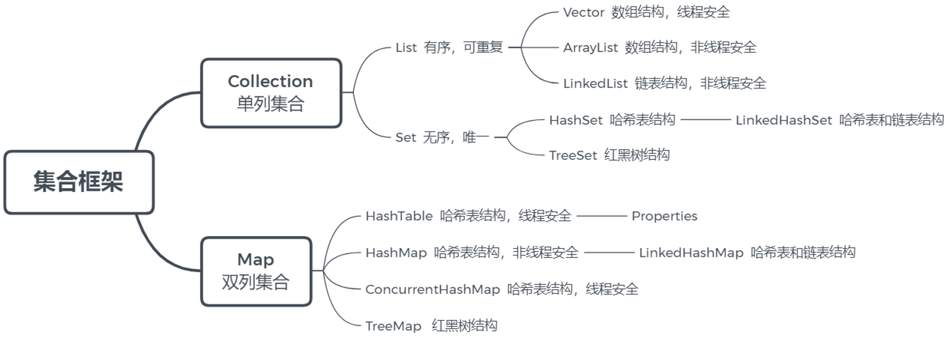

# Java Collections

## Array is a linear data structure that stores data of the same data type in contiguous memory space.

### Addressing formula arr[i] = baseAddress + i * dataTypeSize
- **baseAddress**: the starting address of the array
- **dataTypeSize**: represents the size of the element type in the array, currently the array stores int type data, dataTypeSize = 4 bytes
- **arr**: refers to the array
- **i**: refers to the index of the array

### Why does the array index start from 0? What if it starts from 1?
When accessing elements based on the array index, the index and addressing formula are used to calculate the memory corresponding to the element data. The addressing formula is: the starting address of the array + index multiplied by the size of the data type stored. If the array index starts from 1, an additional subtraction operation would be needed in the addressing formula, which adds an extra instruction for the CPU, resulting in lower performance.

### Time complexity of array operations
- **Random access** (accessing by index) O(1)
- **Unknown index access** O(n), if sorted can use binary search O(log n)
- During insertion and deletion, to ensure the continuity of the array's memory, elements need to be moved, with an average time complexity of O(n)

## What is the underlying implementation principle of ArrayList?

- **Underlying data structure**: ArrayList is implemented using a dynamic array.

- **Initial capacity**: The initial capacity of ArrayList is 0, and it will initialize to a capacity of 10 only when data is added for the first time.

- **Expansion logic**: When expanding, ArrayList increases its capacity to 1.5 times the original size, and each expansion requires copying the array.

- **Addition logic**: Ensure that the used length of the array (size) plus 1 is sufficient to store the next data. Calculate the capacity of the array; if the current used length plus 1 exceeds the current array length, call the grow method to expand (1.5 times the original). After ensuring there is space to store the new data, add the new element at the position of size. Return a boolean value indicating whether the addition was successful.

### How to convert between arrays and Lists? After converting an array to a List using Arrays.asList, if the array content is modified, will the list be affected? After converting a List to an array using toArray, if the List content is modified, will the array be affected?
To convert an array to a List, use the asList method of the java.util.Arrays utility class in the JDK. To convert a List to an array, use the toArray method of the List. The no-argument toArray method returns an Object array, and passing an initialized length array object returns that object array. After converting to a list using Arrays.asList, if the content of the array is modified, the list will be affected because it is constructed using an internal class ArrayList in the Arrays class, which wraps the provided collection, ultimately pointing to the same memory address. After converting a List to an array using toArray, if the List content is modified, the array will not be affected. When toArray is called, it performs a copy of the array, which has no relation to the original elements, so even if the List is modified later, the array remains unaffected.

## LinkedList

### Time complexity analysis of singly linked lists
Only when querying the head node does it not need to traverse the linked list, with a time complexity of O(1). Querying other nodes requires traversing the linked list, with a time complexity of O(n). Only when adding or deleting the head node does it not need to traverse the linked list, with a time complexity of O(1). Adding or deleting other nodes requires traversing the linked list to find the corresponding node before completing the addition or deletion, with a time complexity of O(n).

### Time complexity analysis of doubly linked lists
The time complexity for querying the head and tail nodes is O(1). The average query time complexity is O(n). The time complexity for finding the predecessor node of a given node is O(1). The time complexity for adding or deleting head and tail nodes is O(1). The time complexity for adding or deleting other nodes is O(n). The time complexity for adding or deleting a given node is O(1).

### Differences between ArrayList and LinkedList
#### 1. Underlying data structure
- **ArrayList** is implemented as a dynamic array.
- **LinkedList** is implemented as a doubly linked list.

#### 2. Data operation efficiency
ArrayList has a time complexity of O(1) for index-based queries (memory is contiguous, based on the addressing formula), while LinkedList does not support index-based queries. For unknown index lookups: both ArrayList and LinkedList require traversal, with a time complexity of O(n). Appending and deleting at the end of an ArrayList has a time complexity of O(1); other insertions and deletions require moving elements, with a time complexity of O(n). For LinkedList, adding or deleting head and tail nodes has a time complexity of O(1), while other operations require traversing the linked list, with a time complexity of O(n).

#### 3. Memory space usage
ArrayList is backed by an array, which is contiguous in memory, saving space. LinkedList, being a doubly linked list, requires storing data and two pointers, thus consuming more memory.

#### 4. Thread safety
Both ArrayList and LinkedList are not thread-safe. If thread safety is required, there are two options:
- Use local variables within methods, which are thread-safe.
- Use thread-safe versions of ArrayList and LinkedList.

## HashMap

### Characteristics of a red-black tree
- **Property 1**: Nodes are either red or black.
- **Property 2**: The root node is black.
- **Property 3**: Leaf nodes are all black null nodes.
- **Property 4**: Red nodes in a red-black tree have black children.
- **Property 5**: All paths from any node to leaf nodes contain the same number of black nodes.

When adding or deleting nodes, if these properties are not met, rotations occur to maintain all properties. The time complexity of a red-black tree: searching, adding, and deleting are all O(log n).

### Hash collision (refers to multiple keys mapping to the same array index)
### Chaining method
In a hash table, each index position in the array can be referred to as a bucket or slot, and each bucket (slot) corresponds to a linked list where all elements with the same hash value are placed in the corresponding linked list of that slot.

When searching for or deleting an element, we also calculate the corresponding slot using the hash function and then traverse the linked list to find or delete it. On average, the time complexity for resolving collisions using the chaining method is O(1). The hash table may degenerate into a linked list, causing the query time complexity to degrade from O(1) to O(n). Transforming the linked list in the chaining method into other efficient dynamic data structures, such as a red-black tree, can reduce the query time complexity to O(log n), which helps prevent DDoS attacks.

### Implementation principle of HashMap
The underlying data structure uses a hash table, which is an array + (linked list | red-black tree). When adding data, the key's value is calculated to determine the element's index in the array. If the key is the same, it is replaced. If different, it is stored in a linked list or red-black tree. Data retrieval is done by calculating the array index using the key's hash. Before JDK 1.8, the chaining method used an array + linked list. After JDK 1.8, it uses an array + linked list + red-black tree; if the linked list length exceeds 8 and the array length exceeds 64, it will convert from a linked list to a red-black tree.

### Specific process of HashMap put
1. Check if the key-value pair array table is null or empty; if so, execute resize() for expansion (initialization).
2. Calculate the hash value based on the key to get the array index.
3. If table[i] == null, the condition holds, directly create a new node and add it.
4. If table[i] == null does not hold:
   4.1 Check if the first element of table[i] is the same as the key; if so, directly overwrite the value.
   4.2 Check if table[i] is a treeNode, i.e., if table[i] is a red-black tree; if it is, directly insert the key-value pair into the tree.
   4.3 Traverse table[i], insert data at the end of the linked list, then check if the length of the linked list exceeds 8; if so, convert the linked list to a red-black tree and perform the insertion operation in the red-black tree. During traversal, if the key already exists, directly overwrite the value.
5. After successful insertion, check if the actual number of existing key-value pairs size exceeds the maximum capacity threshold (array length * 0.75); if so, perform expansion.

### HashMap expansion mechanism
When adding elements or initializing, the resize method needs to be called for expansion. The first time data is added, the array length is initialized to 16, and subsequent expansions occur when the expansion threshold (array length * 0.75) is reached. Each expansion doubles the previous capacity. After expansion, a new array is created, and the data from the old array needs to be moved to the new array. For nodes without hash collisions, the new array index is calculated directly using e.hash & (newCap - 1). If it is a red-black tree, the red-black tree insertion is performed. If it is a linked list, the linked list needs to be traversed, possibly splitting the linked list, checking whether (e.hash & oldCap) is 0; the element's position will either stay in the original position or move to the original position + the increased array size.
