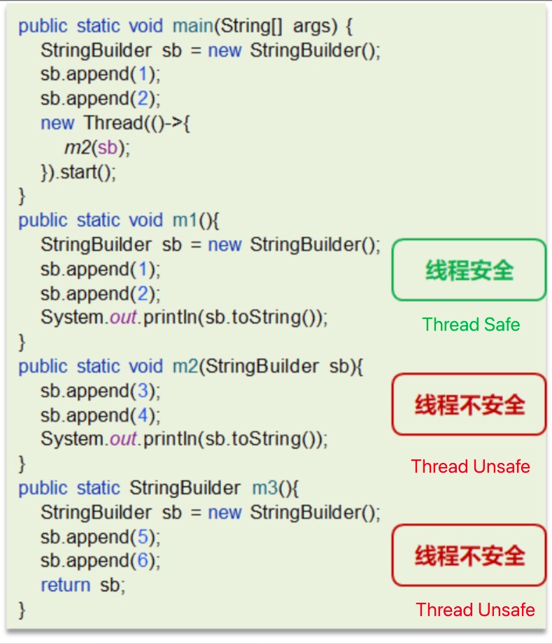

# JVM

## 1.1 What are the components of the JVM and what is the execution process?

From the diagram, we can see the main components of the JVM:
- ClassLoader
- Runtime Data Area
- Execution Engine
- Native Method Library

Execution process:
1. The ClassLoader converts Java code into bytecode.
2. The Runtime Data Area loads the bytecode into memory. The bytecode file is merely a set of instruction specifications for the JVM and cannot be directly executed by the underlying system; it requires the Execution Engine to run.
3. The Execution Engine translates the bytecode into low-level system instructions, which are then executed by the CPU. At this point, it may need to call the Native Method Library to implement the functionality of the entire program.

## 1.2 What is a program counter?
The program counter is a thread-private area that stores the line number of the bytecode being executed. It is used to record the address of the currently executing bytecode instruction.
`javap -verbose xx.class` prints the stack size, the number of local variables, and the method parameters.
The Java Virtual Machine handles multithreading by switching between threads and allocating execution time. At any given moment, a processor will only execute one thread. If the currently executing thread runs out of its allocated execution time, it will be suspended, and the processor will switch to another thread. When that thread's execution time is also exhausted, the processor will return to execute the suspended thread.
Now, the question arises: how does the current processor know where the suspended thread last executed? This is where the program counter comes in, allowing the current thread to return to the last executed line number and continue execution.
The program counter is the only area in the JVM specification that does not have a defined OutOfMemoryError (OOM) condition, so this space will not undergo garbage collection (GC).

## 1.3 What is the Java heap?
The heap is a shared area among threads, primarily used to store object instances, arrays, etc. When there is no memory space available in the heap to allocate to an instance and it cannot be expanded, an OutOfMemoryError exception is thrown.
- The young generation is divided into three parts: the Eden space and two equally sized Survivor spaces. According to the JVM's strategy, objects that survive several garbage collections in the Survivor spaces will be moved to the old generation.
- The old generation mainly stores long-lived objects, typically older objects.
- The Metaspace stores class information, static variables, constants, and compiled code.
To avoid OOM in the method area, in Java 8, the method area (Permanent Generation) on the heap was moved to local memory, creating a new space called Metaspace. This change helps to avoid OOM occurrences.
### Introduction to Metaspace
In the HotSpot JVM, the Permanent Generation (≈ Method Area) is used to store metadata about classes and methods, as well as the constant pool, such as Class and Method. Whenever a class is loaded for the first time, its metadata is placed in the Permanent Generation.
The Permanent Generation has a size limit, so if too many classes are loaded, it can lead to memory overflow, resulting in an OutOfMemoryError, necessitating tuning of the virtual machine.
Removing the Permanent Generation was an effort to merge the HotSpot JVM with the JRockit VM, as JRockit does not have a Permanent Generation and does not require configuration for it.
1) Since PermGen memory often overflows, causing OutOfMemoryError, JVM developers wanted this memory to be managed more flexibly to avoid frequent OOM occurrences.
2) Removing PermGen facilitates the integration of HotSpot JVM with JRockit VM, as JRockit does not have a Permanent Generation.
Specifically, the string constant pool in the Perm area was moved to heap memory after Java 7, and in Java 8, PermGen was replaced by Metaspace. Other contents, such as class metadata, fields, static properties, methods, constants, etc., were moved to the Metaspace area. For example, class metadata for `java/lang/Object`, static property `System.out`, integer constants, etc.
The essence of Metaspace is similar to that of the Permanent Generation, both being implementations of the method area in the JVM specification. However, the biggest difference between Metaspace and the Permanent Generation is that Metaspace is not located in the virtual machine but uses local memory. Therefore, by default, the size of Metaspace is only limited by local memory.

## 1.4 Java Virtual Machine Stacks
- The memory required for each thread during execution is called the virtual machine stack, which follows a last-in, first-out (LIFO) structure.
- Each stack consists of multiple stack frames, corresponding to the memory occupied by each method call.
- Each thread can only have one active stack frame, corresponding to the currently executing method.


### Stack Memory Overflow Situations
- Stack frames can overflow due to excessive stack frames, a typical issue being recursive calls.
```java
public static void method(){
    method();
}
```
- Stack memory can overflow due to excessively large stack frames.

## 1.5 JVM Runtime Data Area
Components include: heap, method area, stack, native method stack, and program counter.
1. The heap addresses the problem of storing object instances and is the main area managed by the garbage collector.
2. The method area can be considered a part of the heap, used to store information loaded by the virtual machine, constants, static variables, and code compiled by the just-in-time compiler.
3. The stack addresses the problem of program execution, storing stack frames, which contain local variable tables, operand stacks, dynamic links, method exits, and other information.
4. The native method stack functions similarly to the stack, executing native methods, which are interfaces for Java to call non-Java code.
5. The program counter (PC register) stores the line number of the bytecode currently being executed by the thread. The JVM works by changing the value of this counter to select the next bytecode instruction to execute.

## 1.6 Method Area
- The Method Area is a memory area shared by all threads.
- It mainly stores class information and the runtime constant pool.
- It is created when the virtual machine starts and released when the virtual machine shuts down.
- If the memory in the method area cannot satisfy allocation requests, an OutOfMemoryError: Metaspace will be thrown.

## 1.7 What are the differences between stack and heap?
1. Stack memory is generally used to store local variables and method calls, while heap memory is used to store Java objects and arrays. The heap undergoes garbage collection, while the stack does not.
2. Stack memory is thread-private, while heap memory is shared among threads.
3. The exceptions for both are different, but if either stack or heap memory is insufficient, exceptions will be thrown.
   - Insufficient stack space: `java.lang.StackOverFlowError`.
   - Insufficient heap space: `java.lang.OutOfMemoryError`.

## 2.1 What is a class loader, and what types of class loaders are there?
- Class Loader: Used to load bytecode files (.class files).
- Runtime Data Area: Used to allocate storage space.
- Execution Engine: Executes bytecode files or native methods.
- Garbage Collector: Used to reclaim garbage content in the JVM.

### Class Loader
The JVM only runs binary files, and the main function of the ClassLoader is to load bytecode files into the JVM, allowing Java programs to start. Existing class loaders are mostly subclasses of `java.lang.ClassLoader`, whose primary responsibility is to find or generate the corresponding bytecode file for the specified class, while also loading the resources required by the program.

### Types of Class Loaders
Class loaders are divided into four types based on their loading scope:
- **Bootstrap ClassLoader**: This class does not inherit from the ClassLoader class and is implemented in C++. It is used to load classes from the `JAVA_HOME/jre/lib` directory.
- **ExtClassLoader**: This class is a subclass of ClassLoader and mainly loads classes from the `JAVA_HOME/jre/lib/ext` directory.
- **AppClassLoader**: This class is a subclass of ClassLoader and is primarily used to load classes from the classPath, which includes classes written by developers.
- **Custom ClassLoader**: Developers can create custom class loaders by inheriting from ClassLoader and implementing custom loading rules.

The class loader system is not an "inheritance" system but a delegation system. Class loaders first look for classes or resources in their parent class loader; if not found, they will search locally. The motivation for this delegation behavior is to avoid loading the same class multiple times.

## 2.2 What is the parent delegation model?
When a class loader receives a request to load a class, it does not attempt to load the class itself but delegates the task to its parent class loader. This process continues recursively. If the parent class loader can complete the loading task, it returns success; only if the parent class loader cannot complete the loading task will the next level attempt to load it.

## 2.3 Why does the JVM adopt the parent delegation mechanism?
1. The parent delegation mechanism prevents a class from being loaded multiple times. Once a parent class has loaded a class, it does not need to load it again, ensuring uniqueness.
2. For security reasons, it ensures that the class library API cannot be modified.

## 2.4 What is the execution process of class loading?
The entire lifecycle of a class from loading into the virtual machine until unloading includes seven stages: loading, verification, preparation, resolution, initialization, usage, and unloading. The verification, preparation, and resolution stages are collectively referred to as linking.
1. **Loading**:
   - Obtain the binary data stream of the class using its fully qualified name.
   - Parse the binary data stream into a data structure in the method area (Java class model).
   - Create an instance of `java.lang.Class` to represent the type, serving as an access point for various data of this class in the method area.

2. **Verification**:
   Verify whether the class complies with JVM specifications and perform security checks.
   - (1) File format verification: Check if it conforms to the Class file specification.
   - (2) Metadata verification:
     - Does this class have a parent class (except for the Object class, all other classes should have a parent)?
     - Does this class extend a class that is marked as final (a final class cannot be inherited)?
     - Do the fields and methods in this class conflict with those in the parent class (final methods or fields cannot be overridden)?
   - (3) Bytecode verification:
     - The main purpose is to analyze the data flow and control flow to determine if the program semantics are legal and logical.
   - (4) Symbol reference verification: Symbol references describe the target being referenced using a set of symbols, which can be any form of literal.
     - For example: `int i = 3;` Literal: 3, Symbol reference: i.

3. **Preparation**:
   Allocate memory for class variables and set their initial values.
   - Static variables have their space allocated during the preparation phase (default values set), and assignment occurs during the initialization phase.
   - Static variables of final primitive types and string constants have their values determined and assigned during the preparation phase.
   - For static variables of final reference types, assignment will also occur during the initialization phase.

4. **Resolution**:
   Convert symbol references in the class to direct references.
   - For example, if a method calls another method, the method name can be understood as a symbol reference, while the direct reference uses a pointer to directly point to the method.

5. **Initialization**:
   Execute initialization operations for the class's static variables and static code blocks.
   - If a class is being initialized and its parent class has not yet been initialized, the parent class will be initialized first.
   - If there are multiple static variables and static code blocks, they will be executed in order from top to bottom.

6. **Usage**:
   The JVM begins executing the user's program code from the entry method.
   - Call static class member information (e.g., static fields, static methods).
   - Use the `new` keyword to create object instances.

7. **Unloading**:
   Once the user's program code has finished executing, the JVM begins destroying the created Class objects, and finally, the JVM responsible for execution exits memory.

## 3.1 Briefly describe the Java garbage collection mechanism (GC). What is GC and why is it needed?
To allow programmers to focus more on code implementation without worrying excessively about memory release, Java has an automatic garbage collection mechanism, commonly known as GC (Garbage Collection).
With garbage collection, programmers only need to concern themselves with memory allocation; the system automatically identifies when to release memory.
During garbage collection, different object reference types trigger GC at different times.
In other words, the algorithms for automatic garbage collection become very important. If the algorithms are unreasonable, leading to memory resources not being released, it can also cause memory overflow.
Other languages, such as C# and Python, also have automatic garbage collection mechanisms.

## 3.2 When can an object be garbage collected?
If one or more objects have no references pointing to them, then these objects are considered garbage and may be collected by the garbage collector.
To determine what constitutes garbage, there are two methods: the reference counting method (which cannot solve circular references and may lead to memory leaks) and the reachability analysis algorithm (commonly used).
### 3.2.1 Reachability Analysis Algorithm
Current virtual machines use the reachability analysis algorithm to determine which objects are garbage.
There exists a root node (GC Roots) that points to the next node, and from there, the next node is found, continuing downwards until all nodes have been traversed.


Nodes X and Y are collectible, but they will not be collected immediately! Objects have a method called `finalize`. When an object is marked for collection, during GC, it first checks whether the `finalize` method has been executed. If it has not been executed, this method will be called first. In this method, the current object can establish a connection with GC ROOTS. After this method completes, GC will check again if the object is reachable. If it is still unreachable, it will be collected; if it is reachable, it will not be collected.
The `finalize` method is executed only once for each object. If the first time this method is executed, the current object is associated with RC ROOTS, it will not be collected this time. When the object is marked for collection a second time, its `finalize` method will not be executed again.

## 3.3 What are the garbage collection algorithms in the JVM?
### 3.3.1 Mark-and-Sweep Algorithm
The mark-and-sweep algorithm divides garbage collection into two phases: marking and sweeping.
1. Mark the garbage identified by the reachability analysis algorithm.
2. Collect the marked objects.
The mark-and-sweep algorithm solves the circular reference problem found in the reference counting algorithm, as objects not referenced from the root node will be collected.
However, the mark-and-sweep algorithm also has drawbacks:
- It is less efficient, as both marking and sweeping require traversing all objects, and during GC, the application must be paused, which can lead to a poor experience for interactive applications.
- (Important) The memory cleared by the mark-and-sweep algorithm can be severely fragmented, as collected objects may be scattered throughout memory, resulting in non-contiguous memory.

### 3.3.2 Copying Algorithm
The core of the copying algorithm is to divide the original memory space into two halves, using only one half at a time. During garbage collection, live objects from the used memory area are copied to the unused memory area, and then the used memory area is cleared, swapping the roles of the two memory areas.
If there are many garbage objects in memory, there will be fewer objects to copy, making this method suitable and efficient; otherwise, it is not suitable.
1. Divide the memory area into two parts, operating on one at a time.
2. During garbage collection, move live objects from the used memory area to the unused memory area. Once the move is complete, clear that part of the memory area.
3. Repeat this process.
**Advantages**:
- More efficient when there are many garbage objects.
- No fragmentation in memory after cleanup.
**Disadvantages**:
- Only half of the allocated memory can be used at any one time, leading to lower memory utilization.

### 3.3.3 Mark-and-Compact Algorithm
The mark-and-compact algorithm is an optimized version of the mark-and-sweep algorithm. Like the mark-and-sweep algorithm, it starts from the root node to mark object references. However, during the cleanup phase, it does not simply clear the collectible objects; instead, it moves the live objects to one end of the memory and then clears the garbage beyond the boundary, thus solving the fragmentation problem.
1. Mark the garbage.
2. Move the objects that need to be cleared to the right, and those that do not need to be cleared to the left.
3. Clear the garbage beyond the boundary.
The advantages and disadvantages are similar to those of the mark-and-sweep algorithm, solving the fragmentation issue while adding an extra step of moving object memory locations, which can impact efficiency.
In comparison to the copying algorithm, the copying algorithm copies immediately after marking, while the mark-and-compact algorithm waits until all live objects are marked before performing the compaction.

### 3.3.4 Generational Collection Algorithm
- Minor GC (young GC) occurs in the young generation, with short pause times (STW).
- Mixed GC collects garbage from both the young generation and parts of the old generation, unique to the G1 collector.
- Full GC: A complete garbage collection of both the young and old generations, with long pause times (STW), which should be avoided whenever possible.

## 3.4 What are the differences between strong references, soft references, weak references, and phantom references?
- **Strong Reference**: An object can only be garbage collected if it is not referenced by any GC Roots.
- **Soft Reference**: An object is only collected when it is softly referenced and memory is insufficient after garbage collection.
- **Weak Reference**: An object is collected whenever it is weakly referenced, regardless of memory availability during garbage collection.
- **Phantom Reference**: Must be used in conjunction with a reference queue. When the referenced object is collected, the phantom reference is enqueued, allowing the Reference Handler thread to call methods related to the phantom reference to release direct memory.

## 4.1 Where can JVM tuning parameters be set?
When starting a Spring Boot project JAR file, parameters can typically be added directly in the Linux system to start the Spring Boot project.

## 4.2 Key JVM Optimization Parameters

### Memory Space Tuning
- Young Generation Memory
- Old Generation Memory
- Metaspace Memory Size

### Garbage Collection Parameters
- Garbage Collector Type Selection
- Heap Size Configuration

### Reference Documentation
- Official Oracle JVM Options: [Oracle JVM Options](https://www.oracle.com/java/technologies/javase/vmoptions-jsp.html)

## JVM Monitoring Tools 4.3

## Command Line Tools 4.3.1

### 4.3.1.1 `jps` (Java Process Status)
- Outputs JVM process status information
- Deprecated in favor of `jconsole`

### 4.3.1.2 `jstack`
- Retrieves thread stack information for Java processes

### 4.3.1.3 `jmap`
- Generates heap dump snapshots

### 4.3.1.4 `jhat`
- Analyzes heap dump snapshots
- Not recommended; prefer Eclipse Memory Analyzer

### 4.3.1.5 `jstat`
- JVM statistical monitoring tool
- Displays:
  * Garbage collection information
  * Class loading statistics
  * Young generation metrics

## GUI Monitoring Tools 4.3.2

### 4.3.2.1 `jconsole`
- JMX-based GUI performance monitoring tool
- Monitors:
  * JVM memory
  * Threads
  * Classes
- Launched from Java installation's `bin` directory
- Executable: `jconsole.exe`

### 4.3.2.2 `VisualVM`
- Comprehensive fault processing tool
- Capabilities:
  * Thread monitoring
  * Memory analysis
  * Method CPU time tracking
  * Heap object inspection
  * Garbage-collected object tracking
  * Reverse stack allocation view
- Launched from Java installation's `bin` directory
- Executable: `jvisualvm.exe`