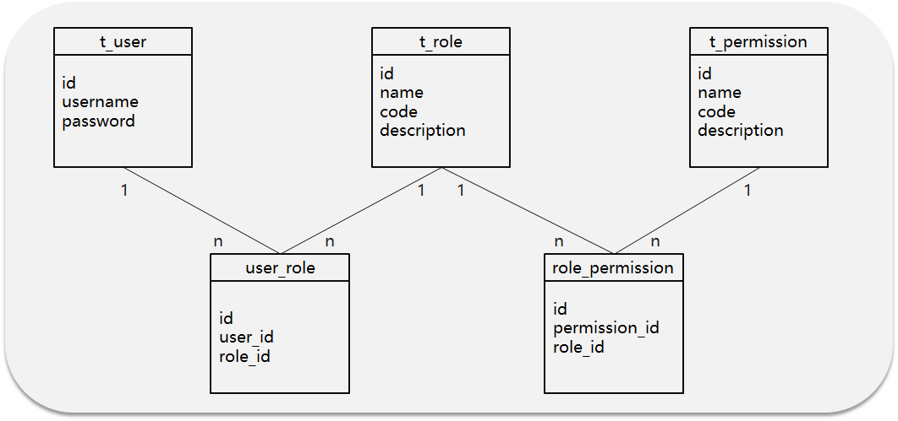

# Others

# Single Sign-On (SSO) and Authentication Guide

## 1. Single Sign-On (SSO)

### Definition
- Single Sign-On (SSO) is an authentication method 
- Allows users to access multiple systems with one set of credentials
- Providing centralized login across different applications

### SSO Implementation Approach

I. User Access to System
- User visits other systems
- Gateway checks token validity

II. Token Validation
- If token is invalid
- Returns 401 (Authentication Failed)
- Frontend redirects to login page

III. Login Process
- User sends login request
- Server returns token to browser
- Browser saves token in cookie

IV. Accessing Other Services
- All subsequent requests must carry token
- Gateway uniformly validates token
- Routes to target service

## 2. Permission Authentication

### Backend Management System Development Experience

#### RBAC Permission Model
- 5 Core Tables Relationship:
 1. User Table
 2. Role Table
 3. Permission Table
 4. User-Role Intermediate Table
 5. Role-Permission Intermediate Table

### Authorization Frameworks
- Spring Security
- Apache Shiro
