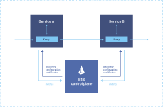

# Service Mesh

## Differences Between Service Mesh and Traditional Spring Cloud

### 1. Architecture Layer
- **Service Mesh**: Service Mesh is an infrastructure layer specifically designed to handle communication between services. It achieves this by deploying a proxy (sidecar) alongside each service instance, which manages all network traffic.
- **Spring Cloud**: Spring Cloud is a framework that provides a set of tools and libraries to simplify the development of microservice architectures. It primarily relies on the Java and Spring ecosystem, implementing service communication and management through code libraries and configurations.

### 2. Feature Implementation
- **Service Mesh**: Key features include service discovery, load balancing, fault recovery, metrics monitoring, and security. These features are implemented at the proxy layer, requiring no changes to application code.
- **Spring Cloud**: Offers similar features but requires integration and configuration within the application code. For example, using Eureka for service discovery, Ribbon for load balancing, and Hystrix for fault recovery.

### 3. Technology Stack
- **Service Mesh**: Typically used in conjunction with container orchestration systems like Kubernetes, with common implementations including Istio and Linkerd.
- **Spring Cloud**: Based on Spring Boot and Spring Framework, suitable for Java development environments.

### 4. Performance Overhead
- **Service Mesh**: Introducing a proxy layer may incur some performance overhead, but this is generally acceptable, especially in large distributed systems.
- **Spring Cloud**: Performance overhead mainly arises from the integration and configuration of various components, requiring developers to optimize at the application level.

### 5. Usability
- **Service Mesh**: Transparent to developers, with no need to modify application code, but requires operations personnel to have certain operational and configuration management skills.
- **Spring Cloud**: Developers need to understand and integrate various components, with higher code intrusiveness, but it is easier to get started for those familiar with the Spring ecosystem.

### 6. Community and Ecosystem
- **Service Mesh**: The ecosystem is rapidly evolving, with an active community, especially widely used in cloud-native and containerized applications.
- **Spring Cloud**: Has a mature community and rich ecosystem, widely used in enterprise-level Java development.

In summary, both Service Mesh and Spring Cloud have their advantages and disadvantages. The choice between them depends on the specific application scenario and the team's technology stack. Service Mesh is more suitable for cloud-native applications requiring high observability and security, while Spring Cloud is suitable for traditional Java microservice architectures.

