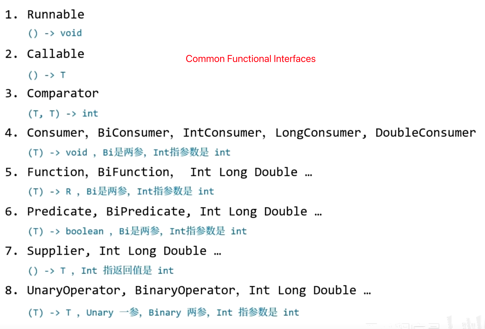

# Functional Interface and Method Reference

## Functional Interface


`Consumer<T>`: Accepts one parameter and returns no value, method signature: void accept(T t)

`Supplier<T>`: No parameters, returns a value, method signature: T get()

`Function<T, R>`: Accepts one parameter and returns a value, method signature: R apply(T t)

`Predicate<T>`: Accepts one parameter and returns a boolean value, method signature: boolean test(T t)

`Operator<T>`: Accepts two parameters and returns a value, method signature: T apply(T t1, T t2)

## Method Reference

## Six Types of Method References

### 1) ClassName::staticMethodName

* 函数对象的逻辑部分是：调用此静态方法
* 因此这个静态方法需要什么参数，函数对象也提供相应的参数即可

```java
public class Type2Test {
    public static void main(String[] args) {
        /*
            需求：挑选出所有男性学生
         */
        Stream.of(
                        new Student("张无忌", "男"),
                        new Student("周芷若", "女"),
                        new Student("宋青书", "男")
                )
                .filter(Type2Test::isMale)
                .forEach(student -> System.out.println(student));
    }

    static boolean isMale(Student student) {
        return student.sex.equals("男");
    }

    record Student(String name, String sex) {
    }
}
```

* filter 这个高阶函数接收的函数类型（Predicate）是：一个 T 类型的入参，一个 boolean 的返回值
* 因此我们只需要给它提供一个相符合的 lambda 对象即可
* isMale 这个静态方法有入参 Student 对应 T，有返回值 boolean 也能对应上，所以可以直接使用

输出

```
Student[name=张无忌, sex=男]
Student[name=宋青书, sex=男]
```

### 2）ClassName::noneStaticMethodName

* 函数对象的逻辑部分是：调用此非静态方法
* 因此这个函数对象需要提供一个额外的对象参数，以便能够调用此非静态方法
* 非静态方法的剩余参数，与函数对象的剩余参数一一对应

例1：

```java
public class Type3Test {
    public static void main(String[] args) {
        highOrder(Student::hello);
    }

    static void highOrder(Type3 lambda) {
        System.out.println(lambda.transfer(new Student("张三"), "你好"));
    }

    interface Type3 {
        String transfer(Student stu, String message);
    }

    static class Student {
        String name;

        public Student(String name) {
            this.name = name;
        }

        public String hello(String message) {
            return this.name + " say: " + message;
        }
    }
}
```

上例中函数类型的

* 参数1 对应着 hello 方法所属类型 Student
* 参数2 对应着 hello 方法自己的参数 String
* 返回值对应着 hello 方法自己的返回值 String

输出

```
张三 say: 你好
```


例2：改写之前根据性别过滤的需求

```java
public class Type2Test {
    public static void main(String[] args) {
        /*
            需求：挑选出所有男性学生
         */
        Stream.of(
                        new Student("张无忌", "男"),
                        new Student("周芷若", "女"),
                        new Student("宋青书", "男")
                )
                .filter(Student::isMale)
                .forEach(student -> System.out.println(student));
    }

    record Student(String name, String sex) {
        boolean isMale() {
            return this.sex.equals("男");
        }
    }
}
```

* filter 这个高阶函数接收的函数类型（Predicate）是：一个 T 类型的入参，一个 boolean 的返回值
  * 因此我们只需要给它提供一个相符合的 lambda 对象即可
* 它的入参1 T 对应着 isMale 非静态方法的所属类型 Student
* 它没有其它参数，isMale 方法也没有参数
* 返回值都是 boolean

输出

```
Student[name=张无忌, sex=男]
Student[name=宋青书, sex=男]
```


例3：将学生对象仅保留学生的姓名

```java
public class Type2Test {
    public static void main(String[] args) {
        Stream.of(
                        new Student("张无忌", "男"),
                        new Student("周芷若", "女"),
                        new Student("宋青书", "男")
                )
                .map(Student::name)
                .forEach(student -> System.out.println(student));
    }

    record Student(String name, String sex) {
        boolean isMale() {
            return this.sex.equals("男");
        }
    }
}
```

* map 这个高阶函数接收的函数类型是（Function）是：一个 T 类型的参数，一个 R 类型的返回值
* 它的入参1 T 对应着 name 非静态方法的所属类型 Student
* 它没有剩余参数，name 方法也没有参数
* 它的返回值 R 对应着 name 方法的返回值 String

输出

```
张无忌
周芷若
宋青书
```


### 3）Object::noneStaticMethodName

如何理解：

* 函数对象的逻辑部分是：调用此非静态方法
* 因为对象已提供，所以不必作为函数对象参数的一部分
* 非静态方法的剩余参数，与函数对象的剩余参数一一对应

```java
public class Type4Test {
    public static void main(String[] args) {
        Util util = new Util(); // 对象
        Stream.of(
                        new Student("张无忌", "男"),
                        new Student("周芷若", "女"),
                        new Student("宋青书", "男")
                )
                .filter(util::isMale)
                .map(util::getName)
                .forEach(student -> System.out.println(student));
    }

    record Student(String name, String sex) {
        boolean isMale() {
            return this.sex.equals("男");
        }
    }

    static class Util {
        boolean isMale(Student student) {
            return student.sex.equals("男");
        }
        String getName(Student student) {
            return student.name();
        }
    }
}
```

其实较为典型的一个应用就是 `System.out` 对象中的非静态方法，最后的输出可以修改为

```java
.forEach(System.out::println);
```

这是因为 

* forEach  这个高阶函数接收的函数类型（Consumer）是一个 T 类型参数，void 无返回值
* 而 System.out 对象中有非静态方法 void println(Object x) 与之一致，因此可以将此方法化为 lambda 对象给 forEach 使用


### 4）className::new

对于构造方法，也有专门的语法把它们转换为 lambda 对象

函数类型应满足

* 参数部分与构造方法参数一致
* 返回值类型与构造方法所在类一致

例如：

```java
public class Type5Test {
    static class Student {
        private final String name;
        private final int age;

        public Student() {
            this.name = "某人";
            this.age = 18;
        }

        public Student(String name) {
            this.name = name;
            this.age = 18;
        }

        public Student(String name, int age) {
            this.name = name;
            this.age = age;
        }

        @Override
        public String toString() {
            return "Student{" +
                    "name='" + name + '\'' +
                    ", age=" + age +
                    '}';
        }
    }

    interface Type51 {
        Student create();
    }

    interface Type52 {
        Student create(String name);
    }

    interface Type53 {
        Student create(String name, int age);
    }

    public static void main(String[] args) {
        hiOrder((Type51) Student::new);
        hiOrder((Type52) Student::new);
        hiOrder((Type53) Student::new);
    }

    static void hiOrder(Type51 creator) {
        System.out.println(creator.create());
    }
    static void hiOrder(Type52 creator) {
        System.out.println(creator.create("张三"));
    }

    static void hiOrder(Type53 creator) {
        System.out.println(creator.create("李四", 20));
    }
}
```


### 5）this::noneStaticMethodName

算是形式2的特例，只能用在类内部

```java
public class Type6Test {
    public static void main(String[] args) {
        Util util = new UtilExt();
        util.hiOrder(Stream.of(
                new Student("张无忌", "男"),
                new Student("周芷若", "女"),
                new Student("宋青书", "男")
        ));
    }

    record Student(String name, String sex) {

    }

    static class Util {
        boolean isMale(Student student) {
            return student.sex.equals("男");
        }

        boolean isFemale(Student student) {
            return student.sex.equals("女");
        }

        void hiOrder(Stream<Student> stream) {
            stream
                    .filter(this::isMale)
                    .forEach(System.out::println);
        }
    }
}
```


### 6）super::noneStaticMethodName

算是形式2的特例，只能用在类内部（用在要用 super 区分重载方法时）

```java
public class Type6Test {
	
    //...
    
    static class UtilExt extends Util {
        void hiOrder(Stream<Student> stream) {
            stream
                    .filter(super::isFemale)
                    .forEach(System.out::println);
        }
    }
}
```


### 7）Special Method References

函数接口和方法引用之间，可以差一个返回值，例如

```java
public class ExceptionTest {
    public static void main(String[] args) {
        Runnable task1 = ExceptionTest::print1;
        Runnable task2 = ExceptionTest::print2;
    }
    
    static void print1() {
        System.out.println("task1 running...");
    }

    static int print2() {
        System.out.println("task2 running...");
        return 1;
    }
}
```

* 可以看到 Runnable 接口不需要返回值，而实际的函数对象多出的返回值也不影响使用
