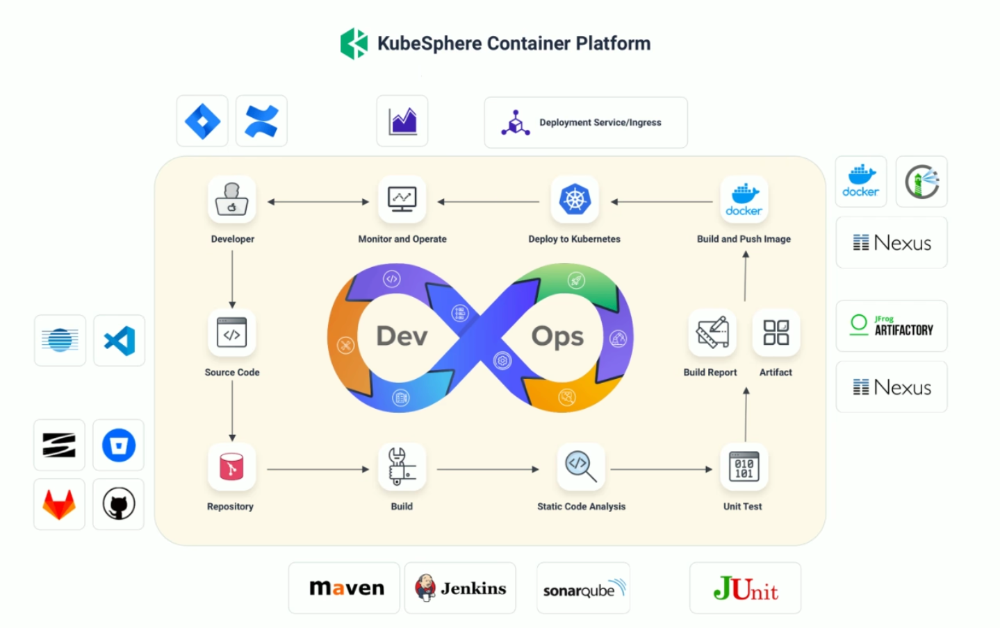
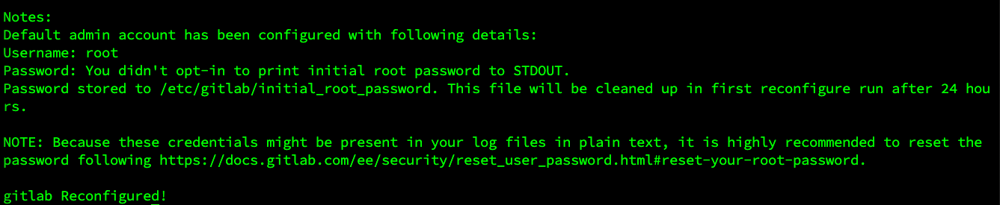

# MicroServices



## GitLab Installation and Configuration

### Download the rpm
[GitLab Installation](https://packages.gitlab.com/gitlab/gitlab-ce)

### Installation
```bash
rpm -i gitlab-ce-17.3.7-ce.0.el8.aarch64.rpm
```


### vim /etc/gitlab/gitlab.rb
### external_url: http:// ip:port
### Other config

```config
gitlab_rails['time_zone'] = 'Australia/Melbourne'
puma['worker_processes'] = 2
sidekiq['max_concurrency'] = 8
postgresql['shared_buffers'] = "128MB"
postgresql['max_worker_processes'] = 4
prometheus_monitoring['enable'] = false
```


### Reconfigure and Restart
```bash
gitlab-ctl reconfigure
cat /etc/gitlab/initial_root_password # get the initial root password
gitlab-ctl restart
```


AbBtBXkbRFl6PNOeQLMxsLHokYNHlDxDkyg18uhy7sM=


### Cannot access gitlab from the host machine but can curl from the virtual machine
To solve this, change the network adapter from NAT to Bridge and reconnect the virtual machine
Change Chrome to Safari...


