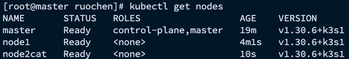

# Setting up K3s Cluster on CentOS 9

### Download mirror iso file on 'https://www.centos.org/download/', and use VMWare Fusion to set up 3 different CentOS 9.

#### This guide will walk you through setting up a K3s cluster with 1 master node and 2 worker nodes on CentOS 9. The master node's IP is `172.16.217.137`, worker nodes' IPs are `172.16.217.138` and `172.16.217.139`.

## Key Kubernetes Components

### 1. `kubeadm` - Cluster Initialization Tool
- **Purpose**: `kubeadm` is designed for setting up and configuring a Kubernetes cluster. It helps users quickly establish a standardized Kubernetes environment.
- **Functions**:
    - Initializes the main cluster components, such as the API server, scheduler, and controllers.
    - Generates configuration files and certificates, enabling secure communication within the cluster.
    - Configures network plugins for inter-Pod communication.
    - Manages node addition and removal within the cluster.
- **Use Case**: `kubeadm` is ideal for initializing and joining multiple nodes to create a production or development Kubernetes cluster.

### 2. `kubectl` - Cluster Management Tool
- **Purpose**: `kubectl` is the command-line tool for interacting with Kubernetes, allowing users to manage and operate cluster resources.
- **Functions**:
    - Manages Kubernetes resources, including creating, updating, and deleting Pods, Services, Deployments, and more.
    - Provides real-time cluster insights and retrieves node and container status information.
    - Configures and manages Kubernetes resources like scheduling, volumes, and networking.
    - Supports debugging and logging with commands to view container logs or access container shells.
- **Use Case**: `kubectl` is essential for administrators and developers for managing and controlling Kubernetes resources within a cluster.

### 3. `kubelet` - Core Node Agent
- **Purpose**: `kubelet` is a crucial component that runs on each node, responsible for managing the lifecycle of containers and Pods on that node.
- **Functions**:
    - Communicates with the Kubernetes API server to receive Pod assignments for the node.
    - Manages container lifecycle through container runtimes (e.g., Docker or containerd).
    - Regularly reports node and container status to the API server, ensuring the cluster has up-to-date resource information.
    - Oversees node health and resources, monitoring and reporting resource usage.
- **Use Case**: `kubelet` is the core process ensuring that Pods assigned to a node operate reliably, making it essential for resource scheduling and container management.

## Why using K3s?
## K3s - Lightweight Kubernetes Distribution

K3s is a simplified and lightweight distribution of Kubernetes that incorporates the core functionalities of `kubeadm`, `kubectl`, and `kubelet`. Developed for resource-constrained environments and edge computing, K3s significantly reduces the complexity of installing and maintaining a Kubernetes cluster.

### Key Benefits of K3s:
- **Integrated Core Features**: K3s includes the essential features of `kubeadm`, `kubectl`, and `kubelet`, providing a streamlined installation process.
- **Lightweight and Resource-Efficient**: Designed to run on resource-limited devices (e.g., ARM64, Raspberry Pi), K3s is ideal for edge computing, IoT, and minimal hardware environments.
- **Reduced Overhead**: With built-in networking, container runtimes, and streamlined configuration, K3s simplifies Kubernetes setup and management, making it easy to deploy clusters in constrained environments.

### Summary
- **`kubeadm`**: Initializes and configures clusters, facilitating node addition.
- **`kubectl`**: Manages and operates Kubernetes resources.
- **`kubelet`**: Manages container lifecycle on each node, ensuring Pods function correctly.

K3s integrates the essential functions of these tools, providing a lightweight and accessible Kubernetes solution suitable for environments with limited resources.


## 1. Install K3s on Master Node

### On the master node (`172.16.217.137`), run the following command to install K3s:

```bash
curl -sfL https://get.k3s.io | sh -
```

### Once K3s is installed, configure the kubeconfig file to allow access to the Kubernetes cluster from your local machine:

```bash
mkdir -p $HOME/.kube
sudo cp -i /etc/rancher/k3s/k3s.yaml $HOME/.kube/config
sudo chown $(id -u):$(id -g) $HOME/.kube/config
```

## 2. Get the K3s Join Token
### To add worker nodes to the cluster, you need the K3s join token. On the master node, run:

```bash
sudo cat /var/lib/rancher/k3s/server/node-token
```

### Copy the output token for use on the worker nodes.

## 3. Install K3s on Worker Nodes
### On each worker node (172.16.217.138 and 172.16.217.139), run the following command to install K3s and join the cluster:

### For Node1 (172.16.217.138):

```bash
curl -sfL https://get.k3s.io | K3S_URL=https://172.16.217.137:6443 K3S_TOKEN=<MASTER_NODE_TOKEN> sh -
```
### For Node2 (172.16.217.139):

```bash
curl -sfL https://get.k3s.io | K3S_URL=https://172.16.217.137:6443 K3S_TOKEN=<MASTER_NODE_TOKEN> sh -
```

### Make sure to replace <MASTER_NODE_TOKEN> with the token obtained from the master node.

## 4. Verify Cluster Status
### Back on the master node, verify that the worker nodes have successfully joined the cluster:

### kubectl get nodes
### You should see output similar to:



## Summary
### Install K3s on Master Node: Run curl -sfL https://get.k3s.io | sh - to install K3s and configure kubeconfig.
### Get the Join Token: Retrieve the token on the master node using cat /var/lib/rancher/k3s/server/node-token.
### Install K3s on Worker Nodes: Use the master node's IP and token to install K3s on worker nodes.
### Verify Cluster Status: Use kubectl get nodes to ensure all nodes are in Ready state.
### By following these steps, you will have successfully set up a K3s cluster with one master node and two worker nodes

