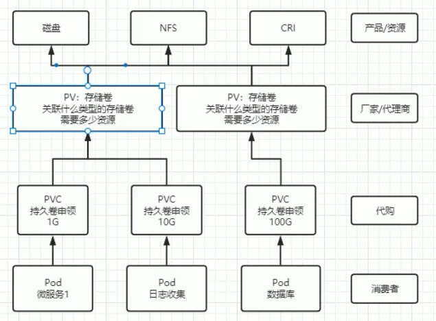
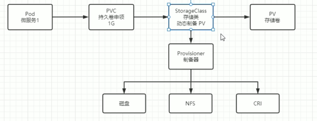

# Persist Storage

## Volumes
### HostPath allows you to mount a file or directory from the host node into a Pod. When using HostPath, the specified directory on the node serves as a persistent storage location. Even if the Pod is deleted or restarted, the data in that directory remains intact and can be reloaded, ensuring that files in the directory are not lost.
### EmptyDir is primarily used for sharing data between different containers within the same Pod. Unlike other volume types, an important distinction with EmptyDir is that the data is only accessible within the Pod it’s attached to. If the Pod is deleted, the EmptyDir volume and all its data are also deleted.

## NFS mounting
### An NFS (Network File System) volume can be mounted into your Pod. Unlike an emptyDir, which is deleted along with the Pod, the contents of an NFS volume are preserved when the Pod is deleted, with only the volume being unmounted. This means an NFS volume can be pre-populated with data, and this data can be shared between Pods.

```bash
# Install NFS
yum install nfs-utils -y

# Start NFS
systemctl start nfs-server

# Check NFS version
cat /proc/fs/nfsd/versions

# Create shared directory
mkdir -p /data/nfs
cd /data/nfs
mkdir rw
mkdir ro

# Set up shared directory export
vim /etc/exports
/home/nfs/rw 192.168.113.0/24(rw,sync,no_subtree_check,no_root_squash)
/home/nfs/ro 192.168.113.0/24(ro,sync,no_subtree_check,no_root_squash)

# Reload configuration
exportfs -f
systemctl reload nfs-server

# Install nfs-utils on other test nodes and mount for testing
mkdir -p /mnt/nfs/rw
mount -t nfs 192.168.113.121:/home/nfs/rw /mnt/nfs/rw
```

## PV and PVC

## Persistent Volume (PV):
A PV is a storage resource in the cluster that is provisioned by administrators or dynamically by storage classes. It represents an actual storage, like an NFS share, Amazon EBS volume, or other storage types. Once created, it exists independently of any Pods that use it.

### Reclaim Policies
1. **Retain**: The PV is kept and must be manually cleaned or reused after PVC deletion.
2. **Delete**: The PV and its data are deleted when the PVC is deleted.
3. **Recycle**: (Deprecated) The PV is scrubbed and made available again after PVC deletion.

### PV Configuration
```yaml
apiVersion: v1
kind: PersistentVolume
metadata:
  name: pv0001
spec:
  capacity:
    storage: 5Gi # pv 的容量
  volumeMode: Filesystem # 存储类型为文件系统
  accessModes: # 访问模式：ReadWriteOnce、ReadWriteMany、ReadOnlyMany
    - ReadWriteOnce # 可被单节点独写
  persistentVolumeReclaimPolicy: Retain # 回收策略
  storageClassName: slow # 创建 PV 的存储类名，需要与 pvc 的相同
  mountOptions: # 加载配置
    - hard
    - nfsvers=4.1
  nfs: # 连接到 nfs
    path: /data/nfs/rw/test-pv # 存储路径
    server: 172.16.217.138 # nfs 服务地址
```

### PV State
1. **Available**: PV is available and waiting for a PVC to bind.
2. **Bound**: PV is bound to a PVC and is being used.
3. **Released**: PVC is deleted, but PV is still available and not yet re-bound.
4. **Failed**: PV has encountered a failure and is no longer usable.

## Persistent Volume Claim (PVC):
A PVC is a request for storage by a user. It specifies how much storage is needed and other requirements (such as access modes). Kubernetes then matches this claim to an available PV. PVCs are bound to PVs, allowing users to abstract away storage details while accessing storage resources.

### PVC Configuration
```yaml
apiVersion: v1
kind: PersistentVolumeClaim
metadata:
  name: nfs-pvc
spec:
  accessModes:
    - ReadWriteOnce # 权限需要与对应的 pv 相同
  volumeMode: Filesystem
  resources:
    requests:
      storage: 8Gi # 资源可以小于 pv 的，但是不能大于，如果大于就会匹配不到 pv
  storageClassName: slow # 名字需要与对应的 pv 相同
#  selector: # 使用选择器选择对应的 pv
#    matchLabels:
#      release: "stable"
#    matchExpressions:
#      - {key: environment, operator: In, values: [dev]}
```

## StorageClass (SC)




