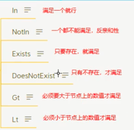

# Advanced Scheduling
::: info
In Linux, use "crontab -e" to write some expression
:::

## CronJob
### Similar as crontab in Linux
```yaml
apiVersion: batch/v1
kind: CronJob
metadata:
  name: hello
spec:
  concurrencyPolicy: Allow # 并发调度策略：Allow 允许并发调度，Forbid：不允许并发执行，Replace：如果之前的任务还没执行完，就直接执行新的，放弃上一个任务
  failedJobsHistoryLimit: 1 # 保留多少个失败的任务
  successfulJobsHistoryLimit: 3 # 保留多少个成功的任务
  suspend: false # 是否挂起任务，若为 true 则该任务不会执行
#  startingDeadlineSeconds: 30 # 间隔多长时间检测失败的任务并重新执行，时间不能小于 10
  schedule: "* * * * *" # 调度策略
  jobTemplate:
    spec:
      template:
        spec:
          containers:
          - name: hello
            image: busybox:1.28
            imagePullPolicy: IfNotPresent
            command:
            - /bin/sh
            - -c
            - date; echo Hello from the Kubernetes cluster
          restartPolicy: OnFailure
```
:::info
The schedule format * * * * * breaks down as follows:
1. First * (Minute): Runs every minute (0-59)
2. Second * (Hour): Runs every hour (0-23)
3. Third * (Day of Month): Runs every day of the month (1-31)
4. Fourth * (Month): Runs every month (1-12)
5. Fifth * (Day of Week): Runs every day of the week (0-7, where both 0 and 7 represent Sunday)
So, "* * * * *" means the job is scheduled to run every minute.
:::

## Init Container
### Before the main container starts, an InitContainer is launched to perform necessary initialization tasks. Once these tasks are completed, the main container is then started.
### Compared to postStart, InitContainer offers a few advantages:
1. Execution Order: InitContainer ensures that initialization tasks are completed before the main container’s EntryPoint is executed, whereas postStart is triggered immediately after the main container starts, so it can’t ensure tasks are completed beforehand.
2. Complexity of Initialization: While postStart is suitable for simple command executions, an InitContainer is essentially a standalone container, allowing it to perform more complex initialization tasks within a separate environment or base container if needed.

## Taint 

### Set taint on a node
```bash
kubectl taint node k8s-master key=value:NoSchedule
```

### Delete taint on a node
```bash
kubectl taint node k8s-master key=value:NoSchedule-
```

### Check taint
```bash
kubectl describe no k8s-master
```

## Impact of taint:
1. NoSchedule: Intolerable pods cannot be scheduled to the node, but existing nodes will not be evicted
2. NoExecute: Intolerable nodes will be cleared immediately. If the node is tolerable and the tolerationSeconds attribute is not configured, it can continue to run. If the tolerationSeconds: 3600 attribute is set, the pod can continue to run on the node for 3600 seconds

## Toleration
This is applied to a pod. When a pod is scheduled, if it does not have a toleration configured, it will not be scheduled onto a node that has a taint. A pod will only be scheduled onto nodes with taints if it has tolerations that match all of the node's taints.

```yaml
# Configure tolerations under the pod's spec
tolerations:
  - key: "key-of-taint"           # The key of the taint
    value: "value-of-taint"       # The value of the taint
    effect: "NoSchedule"          # The effect of the taint (e.g., NoSchedule)
    operator: "Equal"             # Indicates value must match the taint's value; can also be set to Exists, meaning only the key needs to exist, and in this case, the value can be omitted
```

## Affinity
Antonym of taint
1. NodeAffinity: Ensures a pod is scheduled on nodes with specific labels.
2. PodAffinity: Schedules a pod near other specified pods.
3. PodAntiAffinity: Schedules a pod away from other specified pods.

### Required --Must
### Request -- As possible

### Example NodeAffinity Configuration
```yaml
apiVersion: v1
kind: Pod
metadata:
  name: with-node-affinity
spec:
  affinity: # Affinity configuration
    nodeAffinity: # Node affinity settings
      requiredDuringSchedulingIgnoredDuringExecution: # Node must match the following configuration
        nodeSelectorTerms: # Selector terms
        - matchExpressions: # Matching expressions
          - key: topology.kubernetes.io/zone # The key of the label to match
            operator: In # Match type; matches any one of the following values
            values:
            - antarctica-east1 # Matching value
            - antarctica-west1 # Matching value
      preferredDuringSchedulingIgnoredDuringExecution: # Node should ideally match the following configuration
      - weight: 1 # Weight [1,100]; all node weights are accumulated, affecting priority score; higher score means higher scheduling priority
        preference:
          matchExpressions: # Matching expressions
          - key: another-node-label-key # Key of the label
            operator: In # Match type; satisfies if one matches
            values:
            - another-node-label-value # Matching value
#      - weight: 20
  containers:
  - name: with-node-affinity
    image: pause:2.0
```
### Operator Match Type



### Practices: [Assign Pods to Nodes Using Node Affinity](https://kubernetes.io/docs/tasks/configure-pod-container/assign-pods-nodes-using-node-affinity/)
