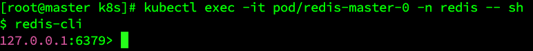

# Helm: Kubernetes Package Manager

Helm is a package manager for Kubernetes, designed to simplify the deployment and management of applications on Kubernetes clusters. Helm allows developers to package, configure, and deploy applications as reusable "charts," which are collections of YAML files that describe a related set of Kubernetes resources.

## Key Features of Helm

1. **Charts**:
    - A Helm chart is a pre-configured template of Kubernetes resources, making it easy to deploy complex applications as a single package.
    - Charts are reusable and can be customized for different environments.

2. **Templates**:
    - Helm supports templating, allowing variables in your Kubernetes configurations.
    - This feature makes it easy to customize charts for different environments, such as development, staging, and production.

3. **Version Control and Rollbacks**:
    - Helm tracks the history of releases and allows you to roll back to previous versions.
    - This simplifies upgrades and makes deployments more resilient.

4. **Repositories**:
    - Helm charts are stored in repositories, and Helm provides commands to install charts directly from a repository.
    - This makes it easy to share and distribute applications.

## Common Use Cases

- **Application Deployment**: Easily deploy applications with complex configurations and dependencies.
- **Environment-Specific Configuration**: Use templates and values to adjust configurations across different environments.
- **Upgrades and Rollbacks**: Safely upgrade and roll back applications with minimal downtime.

## Basic Commands

- `helm install <release_name> <chart_name>`: Deploy a new application using a Helm chart.
- `helm upgrade <release_name> <chart_name>`: Update an application to a new version or configuration.
- `helm rollback <release_name> <revision_number>`: Revert an application to a previous version.
- `helm list`: List all deployed releases.

Helm helps standardize and simplify Kubernetes application management, making it essential for many Kubernetes-based workflows.


## Practice: Redis Chart
```bash
helm repo add bitnami https://charts.bitnami.com/bitnami

# Search redis chart
helm search repo redis

# Check installation documentation
helm show readme bitnami/redis

helm pull bitnami/redis

tar -xvf redis-20.2.2.tgz

# Modify the configuration according to needs
vim values.yaml

# Check the version of Helm if there is an error
helm install redis ./redis -n redis

# Check all information under redis Namespace
kubectl get all -n redis

# Get into the redis master 
kubectl exec -it pod/redis-master-0 -n redis -- sh

helm upgrade [RELEASE] [CHART] [flags]
helm upgrade redis ./redis

helm rollback <RELEASE> [REVISION] [flags]

# Check history
helm history redis
# Rollback to previous version
helm rollback redis
# Rollback to pointed version
helm rollback redis 3

helm delete redis -n redis
```



