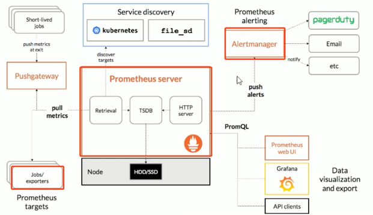

# Prometheus


1. DIY Configuration
2. [Kube-prometheus](https://github.com/prometheus-operator/kube-prometheus) (Recommended)

```bash
cd kube-prometheus
kubectl create -f manifests/setup/
kubectl create -f manifests/
kubectl get all -n monitoring
kubectl get svc -n monitoring
```

# Access via domain name (if there is no domain name, you can configure hosts on the host)
192.168.113.121 grafana.wolfcode.cn
192.168.113.121 prometheus.wolfcode.cn
192.168.113.121 alertmanager.wolfcode.cn

# Create prometheus-ingress.yaml
```yaml
apiVersion: networking.k8s.io/v1
kind: Ingress
metadata:
namespace: monitoring
name: prometheus-ingress
spec:
ingressClassName: nginx
rules:
- host: grafana.wolfcode.cn  #  Grafana 
  http:
  paths:
    - path: /
      pathType: Prefix
      backend:
      service:
      name: grafana
      port:
      number: 3000
- host: prometheus.wolfcode.cn  #  Prometheus 
  http:
  paths:
    - path: /
      pathType: Prefix
      backend:
      service:
      name: prometheus-k8s
      port:
      number: 9090
- host: alertmanager.wolfcode.cn  #  alertmanager 
  http:
  paths:
    - path: /
      pathType: Prefix
      backend:
      service:
      name: alertmanager-main
      port:
      number: 9093
```
```bash
# Create ingress
kubectl apply -f prometheus-ingress.yaml
```
