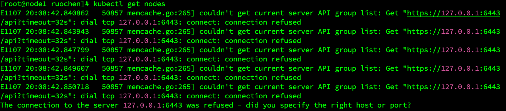
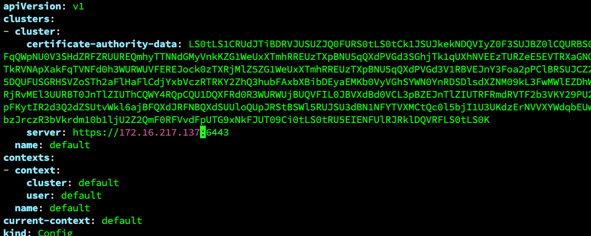
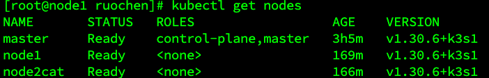

# How to Enable kubectl on Node Nodes

1. First, on the node, create the directory:
   

   ```bash
   mkdir -p /etc/kubernetes
    ```
   
2. Then, open the k3s.yaml file:
   ```bash
   cat /etc/rancher/k3s/k3s.yaml
   vi /etc/rancher/k3s/k3s.yaml
   ```
   Modify the server address from 127.0.0.1 to the VM's IP address.


3. Next, transfer the k3s.yaml file to the respective nodes:
   ```bash
   scp /etc/rancher/k3s/k3s.yaml root@172.16.217.138:/etc/kubernetes/admin.conf
   scp /etc/rancher/k3s/k3s.yaml root@172.16.217.139:/etc/kubernetes/admin.conf
   ```
4. On the node, configure the kubeconfig file by running:
   ```bash
   echo "export KUBECONFIG=/etc/kubernetes/admin.conf" >> ~/.bashrc
   source ~/.bashrc
   kubectl get nodes
   ```

