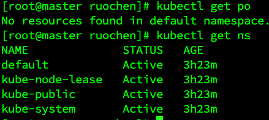
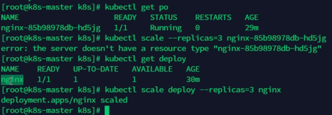

# Kubectl Basic Commands

`kubectl` is the command-line tool used to interact with Kubernetes clusters. Here are some of the most commonly used commands:

## 1. `kubectl get`
The `get` command retrieves information about resources such as pods, services, deployments, etc.

### Example:
`kubectl get po`
- If no namespace is specified, the default namespace is used.
- The following shows the `kubectl get po` output in the default namespace:
  

You can specify a namespace using the `-n` flag:
`kubectl get po -n <namespace>`

## 2. `kubectl scale`
The `scale` command allows you to scale the number of replicas for a deployment or stateful set.

### Example:
`kubectl scale --replicas=5 deployment/my-deployment`
This command scales the `my-deployment` deployment to 5 replicas. Scaling up or down can be done by adjusting the `--replicas` value.

## 3. API Versions
Kubernetes has different API versions (e.g., `beta`, `stable`). Always try to use the stable version unless you need features available in beta.

### Example of deprecated APIs:
To check the deprecation status of an API, refer to the [Kubernetes Deprecation Guide](https://kubernetes.io/zh-cn/docs/reference/using-api/deprecation-guide/).

For example, a deprecated API may look like:
`apiVersion: apps/v1beta1`  # Deprecated version

Use the stable API version instead:
`apiVersion: apps/v1`  # Stable version

## Other Useful `kubectl` Commands:
- `kubectl describe <resource>`: Get detailed information about a specific resource.
- `kubectl logs <pod>`: Fetch logs for a specific pod.
- `kubectl apply -f <file.yaml>`: Apply changes from a YAML file.

For more detailed information, refer to the official [Kubernetes kubectl reference documentation](https://kubernetes.io/docs/reference/generated/kubectl/kubectl-commands).
