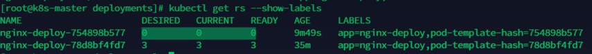

# Label,Selector,and Deployment

## Label and Selector
### Check label
```bash
kubectl get po --show-labels
NAME         READY   STATUS    RESTARTS   AGE   LABELS
nginx-demo   1/1     Running   0          23h   type=app,version=1.0.0
```

### Add label temporarily
```bash
kubectl label po nginx-demo author=richard
pod/nginx-demo labeled
nginx-demo   1/1     Running   0          23h   type=app,version=1.0.0
```

### Modify label temporarily
```bash
kubectl label po nginx-demo author=richardchen --overwrite
pod/nginx-demo labeled
```

### Use selector to check label
```bash
kubectl get po -l 'version in (1.0.0, 1.0.1)'
NAME         READY   STATUS    RESTARTS   AGE
nginx-demo   1/1     Running   0          24h
```
#### The -l flag in Kubernetes commands is used to filter resources based on label matching. The conditions following -l should be enclosed in single quotes to ensure accurate parsing, especially when multiple conditions are involved. Multiple label conditions are combined with a logical "AND" (i.e., all conditions must be true) by separating each condition with a comma.
::: info
1. Exact Match: kubectl get pods -l 'app=nginx' – selects all pods with the label app: nginx.
2. Multiple Conditions: kubectl get pods -l 'app=nginx,env=production' – selects pods labeled with both app: nginx and env: production.
3. Range Selection: kubectl get pods -l 'version in (1.0.0, 1.0.1)' – selects pods where the version label is either 1.0.0 or 1.0.1.
:::


## Deployment

### For stateless applications, it's common to create a Deployment, while for stateful applications, a StatefulSet is typically used. The Deployment object manages the ReplicaSet, which in turn manages the Pod instances. This structure creates a nested hierarchy with distinct names for each layer.

```bash
kubectl get deploy
NAME           READY   UP-TO-DATE   AVAILABLE   AGE
nginx-deploy   1/1     1            1           52s
kubectl get replicaset
NAME                      DESIRED   CURRENT   READY   AGE
nginx-deploy-5cdc97df7f   1         1         1       98s
kubectl get po
NAME                            READY   STATUS    RESTARTS   AGE
nginx-deploy-5cdc97df7f-z2htj   1/1     Running   0          2m4s
```

### Get configuration and print results by YAML format
```bash
kubectl get deploy nginx-deploy -o yaml
```

### Deployment configuration YAML
```yaml
apiVersion: apps/v1 # Specifies the API version of the Deployment object.
kind: Deployment # Declares the type of Kubernetes resource as a Deployment.
metadata:
  labels:
    app: nginx-deploy # Labels for identifying and grouping resources.
  name: nginx-deploy # The name of the Deployment.
  namespace: default # The namespace in which this Deployment will be created.
spec:
  replicas: 1 # Number of pod replicas to run.
  revisionHistoryLimit: 10 # Limits the number of old ReplicaSets to retain for rollback.
  selector:
    matchLabels:
      app: nginx-deploy # Selects pods with this label for managing updates.
  strategy:
    rollingUpdate:
      maxSurge: 25% # Allows up to 25% more pods above the desired number during an update.
      maxUnavailable: 25% # Allows up to 25% of the pods to be unavailable during an update.
    type: RollingUpdate # Specifies that updates should be done in a rolling update fashion.
  template:
    metadata:
      labels:
        app: nginx-deploy # Labels for the pod template, matching the selector.
    spec:
      containers:
      - image: nginx:latest # Specifies the container image to use.
        imagePullPolicy: Always # Ensures the image is pulled every time a pod starts.
        name: nginx # The container's name.
      restartPolicy: Always # Ensures that the container restarts if it crashes.
      terminationGracePeriodSeconds: 30 # Time in seconds given to the pod to shut down gracefully.


```

### Modify YAML configuration directly
```bash
kubectl edit deploy nginx-deploy
```
## Rolling Update
### A rolling update is triggered only when properties within the template section of the Deployment configuration file are modified. During a rolling update, a new ReplicaSet (RS) is created.
### 1. When Pod 1 in the new RS is created, the corresponding Pod 1 in the old RS is marked as expired.
### 2. This process continues iteratively for each Pod across the RSs.

### As shown in the image, once the update completes, the old RS is removed.

## Rollback
### To roll back to a specific revision, you first need to identify the desired revision.

### Use the command below to view the list of available revisions:
```bash
kubectl rollout history deployment/nginx-deploy
```
### To view details of a specific revision, use:
```bash
kubectl rollout history deployment/nginx-deploy --revision=2
```

### Once you've identified the revision to which you want to roll back, you can use the following command to roll back to the previous version:
```bash
kubectl rollout undo deployment/nginx-deploy
````
### Alternatively, to roll back to a specific revision, use:
```bash
kubectl rollout undo deployment/nginx-deploy --to-revision=x
````
### You can control how many revisions are retained by setting .spec.revisionHistoryLimit in the Deployment configuration. If set to 0, rollbacks are not permitted.


## Scaling Up and Down

### You can scale up or down using the `kubectl scale` command, or by editing the `replicas` field directly via `kubectl edit`. Both methods allow for adjusting the number of replicas.
### Scaling operations only adjust the replica count and do not modify the pod template, so no new ReplicaSets (RS) are created.

```bash
kubectl scale --replicas=6 deploy nginx-deploy
deployment.apps/nginx-deploy scaled
kubectl get deploy
NAME           READY   UP-TO-DATE   AVAILABLE   AGE
nginx-deploy   6/6     6            6           167m
```

## Pause
### Since any change to the information in the pod template triggers an update to the Deployment, frequent modifications can lead to multiple unnecessary updates. In such cases, we can pause the Deployment’s rollout to avoid intermediate updates and only execute the final update.

### To pause a Deployment's rollout, use:
```bash
kubectl rollout pause deployment <name>
```
### This stops the Deployment from updating until you choose to resume. To continue the rollout, use:
```bash
kubectl rollout resume deployment <name>
```