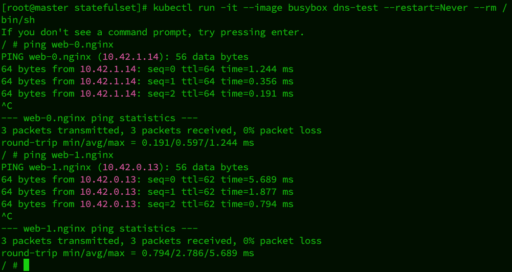

# StatefulSet
::: info
### Stateless application does not create dependencies on the local system, while stateful does.
:::

### Create new stateful set
```yaml
---
apiVersion: v1
kind: Service
metadata:
  name: nginx
  labels:
    app: nginx
spec:
  ports:
  - port: 80
    name: web
  clusterIP: None
  selector:
    app: nginx
---
apiVersion: apps/v1
kind: StatefulSet
metadata:
  name: web
spec:
  serviceName: "nginx"
  replicas: 2
  selector:
    matchLabels:
      app: nginx
  template:
    metadata:
      labels:
        app: nginx
    spec:
      containers:
      - name: nginx
        image: nginx:latest
        ports:
        - containerPort: 80
          name: web
```
```bash
kubectl create -f web.yaml
```
### Check the stateful set
```bash
kubectl get sts
kubectl get po
```

### Testing if two web services are working 



## Scaling up and down
```bash
kubectl scale sts web --replicas=5
```
#### Maintain the sequence of scaling up and down

## Canary Release
#### Minimizing issues and impacts after a project goes live involves careful planning, monitoring, and quick response strategies.
### Use edit to change the configuration of the stateful set, and modify the partition in YAML.
#### e.g. if partition: 1, all 5 web pods will be updated except web-0.

## On Delete
#### Change updateStrategy: type: OnDelete
#### Only update if the deletion is made. A new pod will be generated immediately after the deletion.


