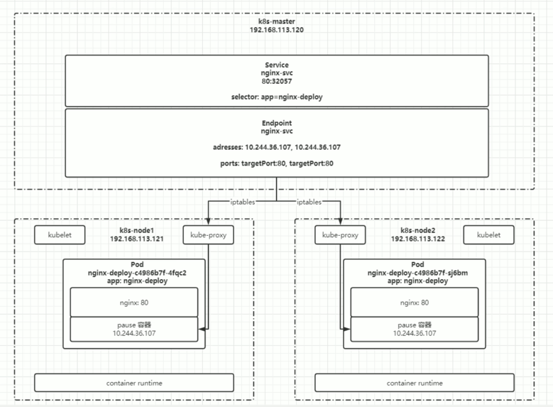
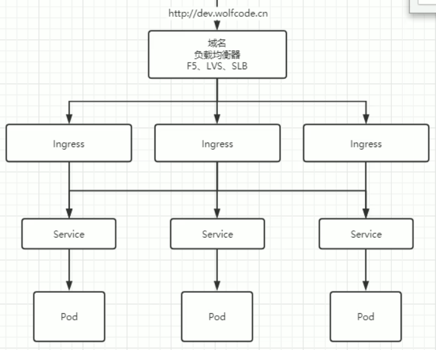

# Service and Ingress

## Service is for East-West Traffic, Ingress is for North-South Traffic

### Service is used for communication among different microservices
### Endpoints manage and maintain pointed IP


### Service Configuration
```yaml
apiVersion: v1
kind: Service
metadata:
  name: nginx-svc
  labels:
    app: nginx-svc
spec:
  ports:
    - name: http # Name of the service port configuration
      protocol: TCP # Protocol used for port binding, supports TCP, UDP, SCTP; defaults to TCP
      port: 80 # The service's port
      targetPort: 9527 # The target pod's port
    - name: https
      port: 443
      protocol: TCP
      targetPort: 443
  selector: # Select which pods the current service will match and proxy traffic to
    app: nginx

```


## Create the service
```bash
kubectl create -f nginx-svc.yaml
```

## View service information, access via service's cluster IP
```bash
kubectl get svc
```

## View pod information, access via pod's IP
```bash
kubectl get po -o wide
```

## Create other pods and access via service name (recommended)
```bash
kubectl exec -it busybox -- sh
curl http://nginx-svc
```

## By default, access within the current namespace. If you need to access a pod across namespaces, add ".namespace" after the service name
```bash
curl http://nginx-svc.default
```


## Use the service to access external services from the cluster
### Reduce redundant configurations


## Implementation Method:

### Write the service configuration file without specifying the selector property.
### Manually create the Endpoint.

### endpoint Config：
```bash
apiVersion: v1
kind: Endpoints
metadata:
labels:
app: wolfcode-svc-external # same as service
name: wolfcode-svc-external # same as service
namespace: default # same as service
subsets:
- addresses:
    - ip: <target ip> 
      ports: #  same as service
    - name: http # same as service
      port: 80
      protocol: TCP
```

### If you want to visit the domain rather than IP address
```bash
apiVersion: v1
kind: Service
metadata:
  labels:
    app: wolfcode-external-domain
  name: wolfcode-external-domain
spec:
  type: ExternalName
  externalName: www.wolfcode.cn

```

::: info
### Type
1. ClusterIP: Can only be used within the cluster. If no type is specified, it defaults to ClusterIP.
2. ExternalName: Returns a CNAME alias defined in the configuration, which can be configured as a domain name.
3. LoadBalancer: Uses the load balancer service provided by the cloud service provider.
:::


## Ingress


## Similar as NGINX, can be understood as an abstraction of NGINX (NGINX is one implementation of Ingress)
## Download ingress controller https://kubernetes.io/docs/concepts/services-networking/ingress/

### Download helm，a package manager in k8s，simliar to java/maven

```bash
helm repo add ingress-nginx https://kubernetes.github.io/ingress-nginx

helm repo list

helm search repo ingress-nginx

helm pull ingress-nginx/ingress-nginx

tar xf ingress-nginx-xxx.tgz

cd ingress-nginx
```

## Configuration of multiple name
```yaml
apiVersion: networking.k8s.io/v1
kind: Ingress
metadata:
  name: wolfcode-nginx-ingress
  annotations:
    kubernetes.io/ingress.class: "nginx"  # Specifies the ingress controller to use (nginx in this case)
    nginx.ingress.kubernetes.io/rewrite-target: /  # Rewrites the URL to the root path before forwarding to the backend service
spec:
  rules:
    - host: k8s.wolfcode.cn
      http:
        paths:
          - pathType: Prefix  # Path type for matching (Prefix matches URL paths that start with '/api')
            backend:
              service:
                name: nginx-svc
                port:
                  number: 80
            path: /api  # URL path that the rule applies to
          - pathType: Exec  # Custom path type for executing actions
            backend:
              service:
                name: nginx-svc
                port:
                  number: 80
            path: /  # URL path that the rule applies to
    - host: api.wolfcode.cn
      http:
        paths:
          - pathType: Prefix  # Path type for matching (Prefix matches URL paths that start with '/')
            backend:
              service:
                name: nginx-svc
                port:
                  number: 80
            path: /  # URL path that the rule applies to
```