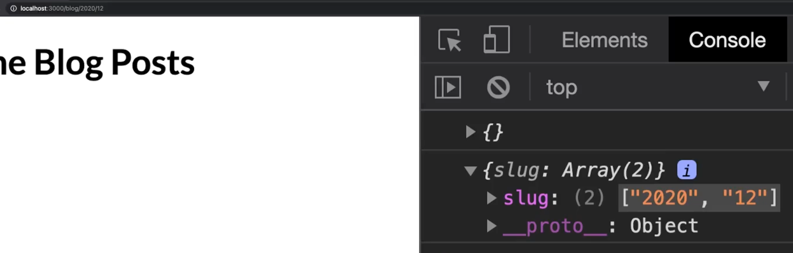

# NextJS File-Based Routing

### Terminology

- **Route Segment**: Each folder in a route represents a route segment. These segments map directly to parts of the URL path.
- **Dynamic Routes**: Using brackets `[]` around a filename allows you to match dynamic segments, enabling parameters in URLs.
- **Nested Routes**: By nesting folders inside one another, you can create nested routes that reflect deeper URL structures.
- **Special Files**: Certain filenames have special meanings in Next.js, such as `index.js`, which serves as the default page for a directory, or `[...slug].js` for catch-all routes.

## How It Works

In Next.js, when a file is added to the `pages` directory, it becomes automatically available as a route. For instance, if you add a file named `about.js` inside the `pages` directory, it will be accessible at `/about`. Similarly, placing an `index.js` file within any directory makes that directory's root accessible via its name only. The router supports nested files too; creating a nested folder structure results in similarly structured URL paths [ty-reference](7).

Dynamic routes are particularly powerful because they allow you to handle variable parts of URLs. For example, a file named `[id].js` inside a `blog` directory would match URLs like `/blog/1`, `/blog/2`, etc., where `id` acts as a parameter that can be accessed within the component using `useRouter` from `next/router`.

For more complex scenarios, Next.js also supports optional catch-all routes with `[...slug].js`, which matches all possible subpaths after the specified segment. This feature is especially useful for blogs or documentation sites where articles might have multiple levels of hierarchy [ty-reference](7).



## useRouter

```jsx

import { useRouter } from 'next/router';

function MyComponent() {
  const router = useRouter();
  
  // Access current path, query parameters, etc.
  console.log(router.pathname); // Outputs the current pathname
  console.log(router.query);    // Outputs the query parameters object

  return (
    <div>
      {/* Component content */}
    </div>
  );
}
```

### Usage of router.query

router.query is an object containing all query parameters. When the page renders initially, router.query might be empty because the client has not finished loading. To ensure correct reading of query parameters, you should wait until router.isReady becomes true, indicating that all initial loading, including parsing of query parameters, has been completed.

For dynamic routes, like defining [id].js to match paths such as /post/123, router.query.id will contain the specific ID value (e.g., 123). Similarly, if query parameters are passed through links, such as /search?term=react&sort=popular, you can access these values via router.query.term and router.query.sort.

### Defining Links

To define links that perform these client-side transitions, you typically import the `Link` component from `next/link` and wrap anchor tags (`<a>`) within it. Here’s an example demonstrating how this works:

```jsx
import Link from 'next/link';

function Home() {
  return (
    <ul>
      <li><Link href="/"><a>Home</a></Link></li>
      <li><Link href="/about"><a>About Us</a></Link></li>
      <li><Link href="/blog/hello-world"><a>Blog Post</a></Link></li>
    </ul>
  );
}

export default Home;
```

### Usage of router.push(), router.replace()
navigate to a specific route, e.g. router.push(/hello-world)
replace the current page to a specific route, e.g. router.push(/hello-world)

### Customize 404 page
create a 404.js under pages folder

### Images
Need to be stored under the public folder, will be treated statically by next.js
Non-page components should not be included under the pages folder
