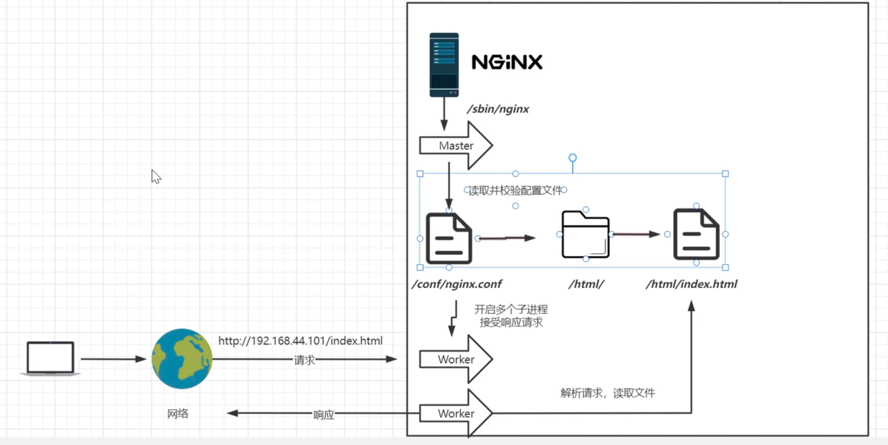

# Nginx Basic

#### Nginx starts with multiple processes
``` bash
[root@node1 nginx]# ps -ef | grep nginx
root       25420       1  0 11:39 ?        00:00:00 nginx: master process /usr/sbin/nginx
nginx      25421   25420  0 11:39 ?        00:00:00 nginx: worker process
nginx      25422   25420  0 11:39 ?        00:00:00 nginx: worker process
nginx      25423   25420  0 11:39 ?        00:00:00 nginx: worker process
nginx      25424   25420  0 11:39 ?        00:00:00 nginx: worker process
root       27519    3778  0 11:49 pts/1    00:00:00 grep --color=auto nginx
```



## NGINX Conf
#### worker_processes
worker_processes 1; The default is 1, which means one worker process is started.

#### worker_connections
worker_connections 1024; The number of connections a single worker process can accept.

#### include mime.types;
include mime.types; Include HTTP mime types.

#### default_type application/octet-stream;
default_type application/octet-stream; If the mime type does not match, the default is to use binary stream transmission.

#### sendfile on;
sendfile on; Use Linux's sendfile(socket, file, len) for efficient network transmission, which is zero-copy data transfer.

## Virtural Host Configuration
```bash
  server {
    listen 80; 监听端口号
    server_name localhost; 主机名
    location / { 匹配路径
      root html; 文件根目录
      index index.html index.htm; 默认页名称
    }
    error_page 500 502 503 504 /50x.html; 报错编码对应页面
    location = /50x.html {
      root html;
    }
  }
```
#### Virtual Host

Originally, a server could only correspond to one site. Through virtual host technology, it can be virtualized into multiple sites to provide services simultaneously.

#### Server Name Matching Rules

We need to note that server name matching follows a sequential order. Once a match is found, it will not continue to match further.

##### Exact Match

We can match multiple domain names in the same server name.

## Reverse Proxy
```bash
  location / {
    proxy_pass http://xxx.com/;
  }
```

## Load Balancing based on reverse proxy
```bash
  upstream httpd {
    server 192.168.44.102:80;
    server 192.168.43.103:80;
  }
```

## Load Balancing Algorithms
#### round_robin
By default, round-robin is used to forward requests one by one, which is suitable for stateless requests.
#### weight
Specifies the polling probability, where weight is proportional to the access ratio, used in cases where backend server performance is uneven.
```bash
  upstream httpd {
    server 127.0.0.1:8050 weight=10 down;
    server 127.0.0.1:8060 weight=1;
    server 127.0.0.1:8060 weight=1 backup;
  }
```
down: Indicates that the current server temporarily does not participate in load balancing.
weight: The default is 1. The higher the weight, the greater the load weight.
backup: Requests are sent to backup servers when all other non-backup servers are down or busy.
#### ip_hash
Distributes requests based on the client's IP address to the same server, maintaining session persistence.
#### least_conn
Distributes requests to the server with the least number of active connections.
#### url_hash
Distributes requests based on the URL accessed by the user.
#### fair
Distributes requests based on the response time of the backend servers.

## Separation of Dynamic and Static Content
Separation of dynamic and static content is only necessary when there are few static resources, which can improve the response speed of the website.
#### Configure Reverse Proxy
```bash
  location / {
    proxy_pass http://127.0.0.1:8080;
    root html;
    index index.html index.htm;
  }
```
#### add locations
```bash
  location /css {
    root /usr/local/nginx/static;
    index index.html index.htm;
  }
  location /images {
    root /usr/local/nginx/static;
    index index.html index.htm;
  }
  location /js {
    root /usr/local/nginx/static;
    index index.html index.htm;
  }
```
#### Use REGEX
- Multiple regex locations are matched in the order they are written, and once a match is successful, it will not continue to match further.
- A regular (non-regex) location will continue downwards until the highest match (longest prefix match) is found.
- When both regular and regex locations exist, if the regex match is successful, the regular match will not be executed.
- When all types of locations exist, "=" match > "^~" match > regex match > regular (longest prefix match).
```bash
  location ~*/(css|img|js) {
    root /usr/local/nginx/static;
    index index.html index.htm;
  }
```

## URL Rewrite
#### The rewrite directive is the key instruction for URL rewriting, redirecting based on the regex (regular expression) part to the replacement, ending with a flag.

#### rewrite `<regex>` `<replacement>` `[flag]`;
#### Keyword Regex Replacement Flag
Keyword: The keyword error_log cannot be changed
Regex: Perl-compatible regular expression statements for rule matching
Replacement: Replace the content matched by the regex with the replacement
Flag: Flags supported by rewrite

#### Locations for rewrite parameter tags:
server, location, if
#### Flag Descriptions:
last # After this rule is matched, continue to match new location URI rules
break # After this rule is matched, terminate immediately, and do not match any further rules
redirect # Return 302 temporary redirect, the browser address will show the redirected URL
permanent # Return 301 permanent redirect, the browser address bar will show the redirected URL
```bash
  location /old {
    rewrite ^/old(.*)$ /new$1 break;
  }
```  

To ensure that all requests pass through the gateway server, the firewalls of other servers should be enabled to prevent the servers from being exposed to the public network.
Example:
```bash
firewall-cmd --permanent --add-rich-rule=
"rule family=
"ipv4" source address=
"192.168.44.101"
port protocol=
"tcp" port=
"8080" accept"
```

## Anti-Leech
Anti-leech is a type of access control for external resources, preventing unauthorized users from illegally obtaining website content.
#### The Referer header field is a field in the HTTP request header that records the source address of the HTTP request.
The valid_referers directive can set allowed source addresses, and the directive format is as follows:
valid_referers none | blocked | server_names | strings ....;
- none, checks the case where the Referer header field does not exist.
- blocked, checks the case where the value of the Referer header field is deleted or forged by a firewall or proxy server. - In this case, the value of this header field does not start with "http://" or "https://".
- server_names, sets one or more URLs to check if the value of the Referer header field is one of these URLs.
Example：
```bash
  valid_referers 192.168.44.101;
    if ($invalid_referer) {
    return 403;
  }
```

## High Availability Configuration
Implemented using Keepalived or other tools

