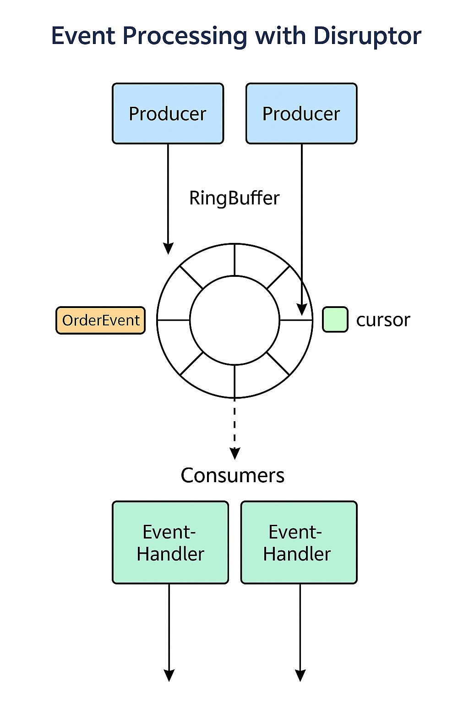

# Coin exchange project note

## Differences between Nginx and Internal Microservice Gateways
- Gateways like Nginx are known for their performance and are suitable for acting as portal gateways, serving as the global gateway for external access, positioned at the outermost layer. In contrast, gateways like Spring Cloud Gateway are more akin to business gateways, primarily used to provide services to different clients and aggregate business. Each microservice is independently deployed with a single responsibility, and when providing services externally, there needs to be something to aggregate the business.
- Gateways like Spring Cloud Gateway can implement features such as circuit breaking and retries, which Nginx does not support.

## Dimensions of Gateway Rate Limiting Rules (Spring Cloud Gateway integrated with Sentinel for rate limiting)
1. Gateway Dimension
 - Represents the rate limiting rules when the gateway accesses the service
 - Coarse granularity—global configuration
2. API Group Dimension
 - Represents the rate limiting rules when the gateway accesses the interface
 - Fine granularity—local configuration

### Native Sentinel Configuration Method—JSON
```json
[
  {
    "resource": "admin-service_router",
    "resourceMode": 0 ,
    "count": 2,
    "intervalSec": 60
  },
  {
    "resource": "admin-service-api",
    "resourceMode":"1",
    "count": 1,
    "intervalSec": 60
  }
]
```

:::info
## 配置文件说明
- GatewayFlowRule：网关限流规则，针对 API Gateway 的场景定制的限流规则，可以针对不同 route 或自定义的 API 分组进行限流，支持针对请求中的参 数、Header、来源 IP 等进行定制化的限流。
- ApiDefinition：用户自定义的 API 定义分组，可以看做是一些 URL 匹配的组合。比如我们可以定义一个 API 叫 my_api，请求 path 模式为 /foo/** -和 /baz/** 的都归到 my_api 这个 API 分组下面。限流的时候可以针对这个自定义的 API 分组维度进行限流
- 其中网关限流规则 GatewayFlowRule 的字段解释如下：
- resource：资源名称，可以是网关中的 route 名称或者用户自定义的 API 分组名称。
- resourceMode：规则是针对 API Gateway 的 route（RESOURCE_MODE_ROUTE_ID）还是用户在 Sentinel 中定义的 API 分组- （RESOURCE_MODE_CUSTOM_API_NAME），默认是 route。
- grade：限流指标维度，同限流规则的 grade 字段。
- count：限流阈值
- intervalSec：统计时间窗口，单位是秒，默认是 1 秒。
- controlBehavior：流量整形的控制效果，同限流规则的 controlBehavior 字段，目前支持快速失败和匀速排队两种模式，默认是快速失败。
- burst：应对突发请求时额外允许的请求数目。
- maxQueueingTimeoutMs：匀速排队模式下的最长排队时间，单位是毫秒，仅在匀速排队模式下生效。
- paramItem：参数限流配置。若不提供，则代表不针对参数进行限流，该网关规则将会被转换成普通流控规则；否则会转换成热点规则。其中的字段：
- parseStrategy：从请求中提取参数的策略，目前支持提取来源 IP（PARAM_PARSE_STRATEGY_CLIENT_IP）、Host（PARAM_PARSE_STRATEGY_HOST）、任意 Header（PARAM_PARSE_STRATEGY_HEADER）和任意 URL 参数（PARAM_PARSE_STRATEGY_URL_PARAM）四种模式。
- fieldName：若提取策略选择 Header 模式或 URL 参数模式，则需要指定对应的 header 名称或 URL 参数名称。
- pattern：参数值的匹配模式，只有匹配该模式的请求属性值会纳入统计和流控；若为空则统计该请求属性的所有值。（1.6.2 版本开始支持）
- matchStrategy：参数值的匹配策略，目前支持精确匹配（PARAM_MATCH_STRATEGY_EXACT）、子串匹配（PARAM_MATCH_STRATEGY_CONTAINS）和正则匹配（PARAM_MATCH_STRATEGY_REGEX）。（1.6.2 版本开始支持）
:::

### Use Nacos to persist the rules
### Use Sentinel Dashboard to manage the rules by clickings


## Token
### How to solve the high load on the authorization server
- Use JWT and store it in Redis to prevent malicious attacks

## AOP
- `RequestContextHolder`: Used to access the context information of the current request.
- `ServletRequestAttributes`: Used to get and set attributes of the Servlet request.
- `ProceedingJoinPoint`: In AOP, represents the method being executed and allows you to control the execution of the method.
- `SecurityContextHolder`: Used to store and access the security context information in Spring Security.
- `MethodSignature`: Used in AOP aspects to obtain the signature information of the proxied method.
- `Authentication`: Used in Spring Security to represent and access the authentication information of the current user.


## Difference Between `bootstrap.yml` and YAML on Nacos
`bootstrap.yml` is a special configuration file used in Spring Boot applications that is loaded before the `application.yml`. It is primarily used for setting up the environment and context in which the application runs, such as property sources, encryption, and decryption keys. Here's how it differs from YAML configurations on Nacos:
### `bootstrap.yml`
- **Bootstrap Phase**: `bootstrap.yml` is loaded early in the application startup process, before the `ApplicationContext` is created.
- **Purpose**: It is used to configure the bootstrap phase of the application, including setting up the Spring Cloud Config Server and Nacos configuration center.
- **Content**: It typically contains non-overridable properties that are essential for the application to start, such as service discovery, config server, and encryption configurations.
- **Example**:
  ```yaml
  spring:
    application:
      name: my-service
    cloud:
      nacos:
        config:
          server-addr: 127.0.0.1:8848
          file-extension: yaml
  ```
### YAML on Nacos
- **Dynamic Configuration**: YAML configurations on Nacos are dynamically managed and can be updated at runtime without restarting the application.
- **Purpose**: They are used to externalize and manage application configurations centrally, allowing for easier updates and less downtime.
- **Content**: These configurations can include any properties that are part of your `application.yml`, such as database settings, feature flags, and service-specific configurations.
- **Example**: A configuration file named `my-service.yaml` on Nacos might look like this:
  ```yaml
  server:
    port: 8080
  spring:
    datasource:
      url: jdbc:mysql://localhost:3306/mydb
      username: user
      password: pass
  ```
In summary, `bootstrap.yml` is used for the initial setup and bootstrap phase of the application, while YAML configurations on Nacos are used for dynamic, runtime configuration management.

## PatchMapping and PutMapping
- Partial Update vs. Full Update: @PatchMapping is used for partial updates of resources, while @PutMapping is used for full updates of resources.
- Request Body Content: When using @PatchMapping, the request body usually contains only the fields to be updated, whereas the request body of @PutMapping contains the complete state of the resource.
- Idempotency: The PUT method is idempotent, meaning that multiple identical requests will have the same effect. The PATCH method is usually idempotent, but its idempotency depends on the implementation details.
- In practical applications, choosing between @PatchMapping and @PutMapping depends on your specific needs and the granularity of resource updates. If you only need to update part of the resource's attributes, @PatchMapping is more appropriate; if you need to replace the entire resource, you should use @PutMapping.

## @NotNull and @NotBlank
- @NotNull: Used to ensure that a parameter is not null.
- @NotBlank: Used to ensure that a string parameter is not blank (i.e., not empty or only whitespace).
- Need to use @Validated annotation to validate the parameters on Controller.

## AutoFilledValue in Mybatis-Plus
- No need to set the value of the field in the entity class, and the value will be automatically filled by Mybatis-Plus.
```java
/**
 *字段自动填充
 */
@Component
public class AutoFiledValueHandler implements MetaObjectHandler {


    /**
     * 新增时填入值
     * @param metaObject
     */
    @Override
    public void insertFill(MetaObject metaObject) {
        Long userId = getUserId();
        /**
         * 3 种情况不填充
         * 1 值为null
         * 2 自动类型不匹配
         * 3 没有改字段
         */
        this.strictInsertFill(metaObject, "lastUpdateTime", Date.class, new Date());
        this.strictInsertFill(metaObject, "createBy", Long.class, userId); // 创建人的填充
        this.strictInsertFill(metaObject, "created", Date.class, new Date());

    }


    /**
     * 修改时填入值
     * @param metaObject
     */
    @Override
    public void updateFill(MetaObject metaObject) {
        Long userId = getUserId();
        this.strictInsertFill(metaObject, "lastUpdateTime", Date.class, new Date());
        this.strictInsertFill(metaObject, "modifyBy", Long.class, userId); // 修改人的填充

    }

    /**
     * 获取安全上下文里的用户对象 --- 主要是在线程里面获取改值
     * @return
     */
    private Long getUserId() {
        Authentication authentication = SecurityContextHolder.getContext().getAuthentication();
        Long userId = null;
        if (authentication != null) {
            String principal = authentication.getPrincipal().toString();
            userId = Long.valueOf(principal);
        }
        return userId;
    }
}

// domain example
@TableField(value = "create_by", fill = FieldFill.INSERT) // 自动填充 来自AutoFiledValueHandler
@ApiModelProperty(value="创建人")
private Long createBy;
```

## SecurityContextHolder

In Spring Security, `SecurityContextHolder.getContext().getAuthentication().getPrincipal()` is a common method used to obtain the principal of the currently authenticated user. Here is an explanation of each part:
- `SecurityContextHolder.getContext()`: Retrieves the current security context (SecurityContext), which contains the security information of the current thread, such as the authentication object (Authentication).
- `.getAuthentication()`: Obtains the current authentication object (Authentication) from the security context, which contains detailed information about the authenticated user, such as username, password, authorities, and the user principal.
- `.getPrincipal()`: Retrieves the user principal from the authentication object. Typically, this principal is a UserDetails implementation or a string, depending on your configuration. If the user is authenticated, this method usually returns an object representing the current user.
- `.toString()`: Converts the obtained user principal to a string. This usually calls the `toString()` method of the user principal object.
Here are some key points about this expression:
- If the user is not authenticated, `getAuthentication()` may return a null Authentication object, and calling `getPrincipal()` will return null, so calling the `toString()` method in this case will throw a `NullPointerException`.
- If the user is authenticated, `getPrincipal()` typically returns a `UserDetails` implementation or a custom user entity. In this case, calling `toString()` will return the string representation of that object, which is usually the fully qualified class name plus the memory address.

When using this expression, you should always ensure that the user is authenticated and handle potential null values appropriately.


## isBlank() vs. isEmpty()
In summary, the isBlank method checks if a string is empty or contains only whitespace characters, while the isEmpty method only checks if a string is null or empty (length is 0). If you want to check if a string has no useful content at all (including whitespace characters), you should use isBlank. If you only care if the string is null or empty, and do not care if it contains whitespace characters, then you should use isEmpty.

## AWS SNS (SMS service)
- No SMS template service

## Mapstruct

## Request Combination
- minimize rpc call as much as possible
- combine multiple request into one request
- use batch request to improve performance


## JetCache as distributed lock
```java

// Add a distributed lock for the operation identified by cashRechargeAuditRecord.getId().
// If the lock is successfully acquired, execute the specified business logic within 5 minutes (300 seconds).
// Otherwise, skip execution to prevent duplicate processing.

// @CreateCache(
//     name = "CASH_RECHARGE_LOCK",     // Cache name (prefix)
//     timeUnit = TimeUnit.SECONDS,     // Expiration time unit
//     expire = 100,                    // Default expiration time: 100 seconds
//     cacheType = CacheType.BOTH       // Use both local cache and remote cache (e.g., Redis)
// )

    @CreateCache(name = "CASH_RECHARGE_LOCK", timeUnit = TimeUnit.SECONDS, expire = 100, cacheType = CacheType.BOTH)
    private Cache<String, String> cache;

    cache.tryLockAndRun(cashRechargeAuditRecord.getId() + "" , 300, TimeUnit.SECONDS, () -> {
          //do something
    })
```

## Feign
```java
@FeignClient(value = "admin-bank-service", path = "/adminBanks", configuration = OAuth2FeignConfig.class)
```
When using @FeignClient in Spring Cloud, if multiple clients use the same name (or value, they are equivalent), the Spring container will consider them as the same bean, resulting in conflicts when registering multiple. Adding a contextId in the annotation resolves this issue.

## SnowFlake Config
```java
import cn.hutool.core.lang.Snowflake;
import org.springframework.beans.factory.annotation.Value;
import org.springframework.context.annotation.Bean;
import org.springframework.context.annotation.Configuration;

@Configuration
public class IdConfig {

    @Value("${snow.app.id:3}")
    private Integer appId;
    @Value("${snow.data.id:1}")
    private Integer dataId;
    @Bean
    public Snowflake snowflake() {
        return new Snowflake(appId, dataId);
    }
}
```
#### appid
Official name: usually corresponds to Snowflake's workerId (worker node ID)

Function: identifies different application instances or service nodes

Value range: typically 0~31 (5-bit binary, supporting up to 32 application instances)

Usage scenario: when your system has deployed multiple instances of the same service (e.g., microservice multi-instance deployment)

Used to distinguish different services within the same data center

#### dataid
Official name: corresponds to Snowflake's datacenterId

Function: identifies different data centers/data centers

Value range: typically 0~31 (5-bit binary, supporting up to 32 data centers)

Usage scenario: when your system is deployed across different data centers/regions

Used to avoid ID conflicts generated by different data centers


## Disruptor

### Disruptor Introduction

**Disruptor** is a high-performance concurrent framework developed by the British financial company **LMAX**, with the core goal of **efficiently transmitting messages between multiple threads**, mainly used to replace `BlockingQueue` to implement a faster producer-consumer model.

#### Core Features:

- High throughput (millions of ops/s)
- Low latency (microsecond level)
- Lock-free design (based on CAS operations)
- GC-friendly (pre-allocated memory)
- Suitable for: high-frequency trading, log systems, game server event handling, etc.

---

### RingBuffer: Disruptor's Core Component

RingBuffer is the **core data structure** of Disruptor, equivalent to a **ring buffer**, used for transmitting event data between multiple threads.

- Essentially a circular array, which wraps around to the starting point after reaching the end, and is reused cyclically.
- The ring size is usually a **power of 2**
- Each slot in the ring is called a `slot`
- Uses sequence numbers to control read and write positions
- Requires coordination of read and write order when there are multiple producers/consumers

---

### Disruptor Usage Process

#### Overview of Steps:

1. Create an event class `Event` (for data transmission)
2. Implement an event handler `EventHandler`
3. Initialize RingBuffer and Disruptor
4. Start Disruptor
5. Producer publishes events

---

### Wait Strategy

Wait strategy is used to control the behavior of consumer threads when waiting for new data.

| Strategy Type             | Description                         |
|----------------------|------------------------------|
| `BlockingWaitStrategy` | Uses locks and condition variables (safest)     |
| `BusySpinWaitStrategy` | Spin waiting (high CPU resource usage, low latency) |
| `YieldingWaitStrategy` | Uses `Thread.yield()`, suitable for low latency |
| `SleepingWaitStrategy` | Uses `Thread.sleep()`, suitable for low CPU scenarios like logging |

---

### Summary Comparison: Disruptor vs BlockingQueue

| Feature           | Disruptor                  | BlockingQueue             |
|----------------|----------------------------|---------------------------|
| Internal Structure | RingBuffer (circular array)     | Linked list/array                 |
| Concurrency Performance | Extremely high (lock-free)       | General (locked)              |
| Memory Allocation | Pre-allocated, low GC              | Dynamic allocation, easy to trigger GC       |
| Latency           | Microsecond level                     | Millisecond level                    |
| Wait Mechanism | Customizable WaitStrategy        | Fixed blocking behavior              |

---

- [Disruptor GitHub Address](https://github.com/LMAX-Exchange/disruptor)
- 
---

## TreeMap
TreeMap is a class in the Java collection framework that implements the SortedMap interface, using a red-black tree as its underlying data structure. TreeMap has the following important characteristics:

1. **Orderliness**：TreeMap sorts elements based on the natural order of the keys (keys) or by using a Comparator specified through the constructor. Elements are automatically sorted after insertion.

2. **Sorting Methods**：
   - Natural Order: If the key implements the Comparable interface, default sorting can be used
   - Custom Sorting: Custom sorting rules can be implemented by providing a Comparator

3. **Performance Features**：
   - The time complexity for search, insertion, and deletion operations is O(log n)
   - Suitable for scenarios that require key sorting
   - Slightly slower than HashMap, but maintains the order of elements

4. **Common Methods**：
   - `put(K key, V value)` - Adds a key-value pair
   - `get(Object key)` - Retrieves the value of a specified key
   - `remove(Object key)` - Removes the value of a specified key
   - `firstKey()`, `lastKey()` - Retrieves the first and last keys
   - `floorKey(K key)`, `ceilingKey(K key)` - Retrieves keys less than or equal to/greater than or equal to a specified key

5. **Applications**：
   - Mappings that require key sorting
   - Range queries (retrieving all elements within a certain range)
   - Scenarios that require the retrieval of the maximum/minimum keys

TreeMap is used to implement the order book in trading systems, ensuring that buy orders are sorted by price from highest to lowest and sell orders are sorted by price from lowest to highest, which aligns with the principle of best price priority matching in trading systems.

## CommandLineRunner in SpringBoot
`CommandLineRunner` is an interface in the Spring Boot framework that allows you to execute certain code or tasks after the Spring application has fully started, but before the application begins to receive requests.

To use `CommandLineRunner`, you need to implement this interface and override its `run` method:

```java
@Component
public class MyCommandLineRunner implements CommandLineRunner {
    
    @Override
    public void run(String... args) throws Exception {
        // The code here will be executed after the application has started
        System.out.println("Application has started, initializing...");
        // Execute initialization code...
    }
}
```

Spring Boot will automatically call the `run` method of all beans that implement the `CommandLineRunner` interface. If you have multiple `CommandLineRunner` implementations, you can use the `@Order` annotation to control their execution order.

## RocketMQ Configurations and Classes
### Yaml
```yaml
spring:
  cloud:
    stream:
      bindings:
        # Define an input channel exchange-trades-in (logical name)
        exchange-trades-in: 
          destination: exchange-trades-out   # The actual RocketMQ topic name is exchange-trades-out
          content-type: application/plain    # Message format is plain text (MIME type)

        # Define an output channel subscribe-group-out (logical name)
        subscribe-group-out: 
          destination: tio-group             # The bound RocketMQ topic is tio-group
          content-type: application/plain    # Message format is plain text
          group: order-group                 # Specify the RocketMQ consumer group name (ensuring messages are processed once by a consumer within a group)
          consumer.maxAttempts: 1            # Maximum retry count for consumer failure is 1 (default is 3)

      rocketmq:
        binder:
          name-server: rocket-server:9876    # Specify the RocketMQ NameServer address (for discovering broker)
```

### Classes

####  1. `Sink`（Message Receiving "Sink"）

> The interface class for receiving messages, bound with the `@Input` annotation, indicating the consumption of messages from a certain channel/topic.

```java
public interface MySink {
    String INPUT = "exchange-trades-in"; // Must match the logical channel name configured in YAML

    @Input(INPUT)
    SubscribableChannel input();
}
```

🧠 **Explanation**：
- `exchange-trades-in` is the logical channel name you configured in `application.yml`.
- Messages are pushed from RocketMQ to this input channel.
- You can use `@StreamListener` in a certain `@Service` to listen to this channel and process messages.

---

#### 2. `Source`（Message Sending "Source"）

> The interface class for sending messages, bound with the `@Output` annotation, indicating the sending of messages to a certain channel/topic.

```java
public interface MySource {
    String OUTPUT = "subscribe-group-out"; // Must match the logical output channel name configured in YAML

    @Output(OUTPUT)
    MessageChannel output();
}
```

🧠 **Explanation**：
- `subscribe-group-out` is the logical output channel name you configured in YAML.
- Use this channel to send messages to a certain topic in RocketMQ.

---

#### 3. `Config`（Configuration Class）

> The configuration class for registering `Sink` or `Source` interfaces as Spring Beans.

```java
@Configuration
@EnableBinding({MySink.class, MySource.class})
public class StreamConfig {
    // You can add other bean definitions if needed
}
```

🧠 **Explanation**：
- `@EnableBinding` is an annotation provided by Spring Cloud Stream, used to enable message channel binding.
- The registered `MySink` and `MySource` interfaces will be automatically recognized and correspond to the `bindings` in YAML.

---

####  4. `Listener`（Listener Class）

> The class that truly processes the received messages, listening to the channel defined by `Sink`.

```java
@Service
public class TradeListener {

    @StreamListener(MySink.INPUT)
    public void handleMessage(String message) {
        System.out.println("Received: " + message);
        // You can execute business logic here
    }
}
```

🧠 **Explanation**：
- Through the `@StreamListener` annotation, specify the channel to listen to (i.e., `MySink.INPUT`), processing messages pushed from RocketMQ.
- Message processing supports automatic deserialization, such as defining `content-type` as `application/json`, which can directly receive Java objects.

---

### 🧩 Simplified Relationship Diagram Between Components：

```
┌─────────────┐       ┌──────────────┐
│ Source Class    ├──────▶ RocketMQ Topic │
└─────┬───────┘       └────┬──────────┘
      │                    │
  send(msg)            push(msg)
      │                    │
┌─────▼──────┐       ┌─────▼────────┐
│ RocketMQ   │──────▶ Sink + Listener │
└────────────┘       └───────────────┘
```

---

### @Schedule in SpringBoot
In Spring Boot, `@Scheduled` is an annotation for **scheduling tasks**, allowing you to easily define a method to execute at a fixed time interval.

---


#### 1. Enable Task Scheduling

Add the annotation to your main class or configuration class:

```java
@SpringBootApplication
@EnableScheduling
public class YourApplication {
    public static void main(String[] args) {
        SpringApplication.run(YourApplication.class, args);
    }
}
```

---

#### 2. Use `@Scheduled` Annotation on a Method

```java
@Component
public class ScheduledTask {

    // Execute every 5 seconds
    @Scheduled(fixedRate = 5000)
    public void runEveryFiveSeconds() {
        System.out.println("Fixed rate task - " + System.currentTimeMillis());
    }

    // Delay 2 seconds before starting, then execute every 5 seconds
    @Scheduled(fixedRate = 5000, initialDelay = 2000)
    public void runWithInitialDelay() {
        System.out.println("With initial delay - " + System.currentTimeMillis());
    }

    // Execute daily at 1 AM
    @Scheduled(cron = "0 0 1 * * ?")
    public void runDailyAt1AM() {
        System.out.println("Daily task at 1 AM");
    }
}
```

---

#### Common Parameter Explanation

| Parameter             | Explanation                                                                 |
|------------------|----------------------------------------------------------------------|
| `fixedRate`      | Execute every X milliseconds (from the start time of the last execution) |
| `fixedDelay`     | Execute every X milliseconds (from the completion time of the last execution) |
| `initialDelay`   | Delay X milliseconds before starting the first execution |
| `cron`           | Use Cron expression to define the execution plan (supports seconds) |

---

#### Cron Expression Format

```
秒 分 时 日 月 星期 [年（可选）]
```

For example:

| Expression                | Meaning                     |
|-----------------------|--------------------------|
| `0 0 1 * * ?`          | Every day at 1 AM            |
| `0 */5 * * * ?`        | Every 5 minutes             |
| `0 0/30 9-17 * * ?`    | Every 30 minutes from 9 AM to 5 PM on weekdays |

---

#### Notes

- Scheduled methods **cannot have parameters and cannot return values**
- Methods annotated with `@Scheduled` **must be `public`**
- `@Scheduled` defaults to single-threaded execution (blocking)
  - To support concurrent execution, you can customize the thread pool of `@EnableScheduling`.

## Tio IWsMsgHandler
`IWsMsgHandler` is an interface typically used in the context of WebSocket-based communication frameworks. It is often associated with handling messages for WebSocket connections in applications that use the WebSocket protocol to facilitate real-time, two-way communication between clients and servers.

The name `IWsMsgHandler` likely comes from **"WebSocket Message Handler"**, where:

- **"I"** denotes it's an interface.
- **"Ws"** stands for WebSocket.
- **"Msg"** refers to the message.
- **"Handler"** indicates it is a handler that processes the message.

In frameworks that support WebSockets, this interface defines methods for handling incoming and outgoing WebSocket messages.

### Typical Functions of `IWsMsgHandler`

1. **Handling incoming WebSocket messages**:
   - When the server receives a message from a WebSocket client, the handler processes the message, performs business logic, and may send a response back to the client.
   
2. **Sending messages to clients**:
   - The handler can also be responsible for sending messages to clients when triggered by events, commands, or notifications.

3. **Managing WebSocket connections**:
   - Often, the handler includes logic for managing the lifecycle of WebSocket connections, including opening and closing connections.

4. **Error handling**:
   - The handler may handle errors, including timeouts, message parsing errors, or connection issues.

### Example of `IWsMsgHandler` Implementation

Here’s an example of how an `IWsMsgHandler` interface might look in a Java application using WebSocket:

```java
public interface IWsMsgHandler {

    // Handle incoming WebSocket message
    void handleMessage(WebSocketSession session, String message);
    
    // Send a message to the client
    void sendMessage(WebSocketSession session, String message);

    // Handle WebSocket connection opened
    void handleOpen(WebSocketSession session);
    
    // Handle WebSocket connection closed
    void handleClose(WebSocketSession session, CloseStatus status);
    
    // Handle WebSocket error
    void handleError(WebSocketSession session, Throwable throwable);
}
```

### Example Implementation of `IWsMsgHandler`

```java
public class MyWebSocketHandler implements IWsMsgHandler {

    @Override
    public void handleMessage(WebSocketSession session, String message) {
        // Logic to handle the incoming message
        System.out.println("Received message: " + message);
        
        // Process the message and send a response
        sendMessage(session, "Message received!");
    }

    @Override
    public void sendMessage(WebSocketSession session, String message) {
        try {
            session.sendMessage(new TextMessage(message));  // Send response to client
        } catch (IOException e) {
            e.printStackTrace();
        }
    }

    @Override
    public void handleOpen(WebSocketSession session) {
        System.out.println("New WebSocket connection established");
    }

    @Override
    public void handleClose(WebSocketSession session, CloseStatus status) {
        System.out.println("WebSocket connection closed");
    }

    @Override
    public void handleError(WebSocketSession session, Throwable throwable) {
        System.out.println("Error occurred: " + throwable.getMessage());
    }
}
```

### Common Use Cases for `IWsMsgHandler`

1. **Real-time Communication**:
   - **Chat applications**, where messages are sent and received in real-time.

2. **Notifications**:
   - **Live sports updates**, **financial stock price updates**, etc., where WebSockets provide real-time push notifications to clients.

3. **Gaming**:
   - **Multiplayer games** can use WebSocket for real-time game state updates and player interactions.

4. **Collaborative Apps**:
   - **Collaborative editing tools**, where multiple users can edit a document in real-time.

5. **IoT Communication**:
   - Real-time communication with **IoT devices** for monitoring and control.

---

### Integration with Spring WebSocket

In the context of a **Spring Boot application**, `IWsMsgHandler` can be integrated with **Spring WebSocket** using `@MessageMapping`, `@SendTo`, or custom `WebSocketHandler` implementations. 

For example:

```java
@Component
public class MyWebSocketHandler implements IWsMsgHandler {

    @Override
    @MessageMapping("/chat")
    @SendTo("/topic/messages")
    public String handleMessage(WebSocketSession session, String message) {
        return "Received: " + message;  // Send a response back to all subscribers
    }

    // Other methods for open/close/error handling...
}
```

This would allow real-time messaging over WebSockets in a Spring Boot application.

