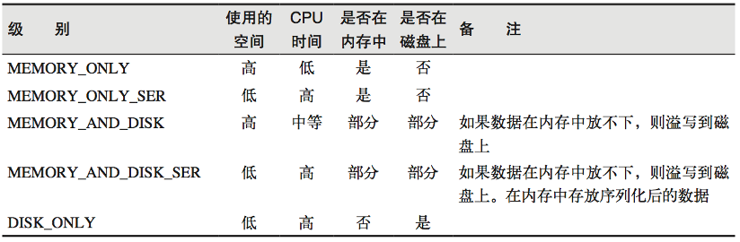

# Spark Core

## RDD (Resilient Distributed Dataset)
- Can be understood as a data pipeline.

```java
    public static void main(String[] args) {

        SparkConf conf = new SparkConf();
        conf.setAppName("Spark01");
        conf.setMaster("local");
        JavaSparkContext sc = new JavaSparkContext(conf);


        // read from memory
        List<String> list = Arrays.asList("alice,bob");
        JavaRDD<String> rdd = sc.parallelize(list,3); //3 partitions\

        // read from disk
        // JavaRDD<String> rdd = sc.textFile("/Users/chenruochen/Documents/IT-Study/Spark/spark/data/1.txt");


        List<String> collect = rdd.collect();
        collect.forEach(System.out::println);

        rdd.saveAsTextFile("output");// save as text file in relatived path

        sc.close();
    }

```

### Partitioning Rules

#### 1. **Spark File Path Settings**  
- Spark can read files using **absolute** or **relative paths**.  
- In **IDEA**, the relative path is based on the **project root** rather than the **module root**.  

#### 2. **Spark File Source Partitioning Strategy**  
- `JavaRDD<String> rdd = sc.parallelize(list,3);` //3 partitions\
- If above is not set, set spark.default.parallelism
- If above is not set, Spark uses the following default value `conf.setMaster("local[*]");`

- The `textFile` method can accept a third parameter: `minPartitions` (minimum number of partitions).  
    - If not provided, Spark uses the following default value:  
    ```java
    minPartitions = math.min(defaultParallelism, 2)
    ```
- You can also configure it using parameters:  
    - `spark.default.parallelism` (default is 1)  
    ```python
    math.min(parameter, 2)
    ```
- Alternatively, Spark can use the total number of cores in the environment:  
    ```python
    math.min(total_cores, 2)
    ```

#### 3. **Spark is Built on Hadoop's MR Framework**  
- Spark does **not implement file slicing** itself—it relies on Hadoop's MapReduce (MR) library.  
- The number of file splits is determined by **Hadoop**, not Spark. Spark does not support file manipulation.

The calculation rules for the number of slices and file data storage in Hadoop are different.
1. When calculating the number of partitions, it is split by bytes as evenly as possible.
2. The partition data storage considers the integrity of the business data and reads it line by line. When reading data, the offset (starting from 0) must also be considered.

:::info
### Java Tuples Class
The `Tuple` class is a container class that holds multiple values of different types. It is used to represent a row in a dataset. The `Tuple` class is part of the `scala.Tuple` package. The maximum number of values that can be stored in a `Tuple` is 22.

```java
import scala.Tuple2;

public class MyClass {
    public static void main(String[] args) {
        Tuple2<String, Integer> tuple = new Tuple2<>("Alice", 25);
        String name = tuple._1();
        int age = tuple._2();
        System.out.println(name + " is " + age + " years old.");
    }
}
```
:::
### RDD Methods
All methods can be divided into two categories:
#### Transformations
- `map` - applies a function to each element of the RDD and returns a new RDD.
- `filter` - selects only the elements that satisfy a predicate and returns a new RDD.
- `flatMap` - applies a function to each element of the RDD and returns a new RDD, but the function can return multiple elements.
- `sample` - returns a sampled subset of the RDD.
- `union` - combines two RDDs into a single RDD.
- `groupByKey` - groups the elements of the RDD by key.
- `reduceByKey` - reduces the values of each key in the RDD.
- `sortByKey` - sorts the elements of the RDD by key.
- `join` - joins two RDDs based on their keys.
- `cogroup` - groups the elements of the RDD by key and then joins them.
- `cartesian` - returns the Cartesian product of two RDDs.
- `distinct` - returns a new RDD with duplicate elements removed.
- `intersection` - returns a new RDD with the elements that are common to both RDDs.
- `subtract` - returns a new RDD with the elements that are in the first RDD but not in the second RDD.
- `sampleByKey` - returns a sampled subset of the RDD based on the keys.
- `coalesce` - reduces the number of partitions in the RDD.
- `repartition` - repartitions the RDD into a specific number of partitions.
- `persist` - caches the RDD in memory or disk.
- `checkpoint` - sets a checkpoint directory for fault-tolerance.


#### Map()
- By default, the number of partitions in a newly created RDD is the same as the number of partitions in the previous RDD.
- By default, the distribution of data does not change.
- Data will execute all RDDs before proceeding to the next operation.

#### Filter()
- May cause data skew, leading to performance degradation.

#### FlatMap() 
- Similar to map(), but can return multiple elements.
- Breaks down an element and then recombines it.
- Map does not have the ability to flatten.

#### GroupBy()
- Groups by key.
- Data with the same key will be aggregated together.
- Does not change the number of partitions.
- Shuffle operation exists.

:::info
### Shuffle
- To solve the problem of data skew, Spark will automatically perform shuffle operations.
- All data must be grouped before subsequent operations can be executed.
- Disk operations will write data to disk.
- Shuffle operations will redistribute data to different partitions so that each partition has a similar amount of data.
- Shuffle operations consume a lot of network bandwidth and disk IO.
:::

#### Distinct()
- Distributed deduplication.
- Grouping + shuffle operation.

#### KV methods
- Use `parallelizePairs` to create an RDD of key-value pairs.
- Use `mapValues` to apply a function to the values of the RDD.
- Use `groupByKey` to group values by key.
- Use `reduceByKey` to aggregate values by key.

### Actions
- Make the data flow and trigger computation.
- `collect` - returns an array that contains all the elements of the RDD.
- `reduce` - reduces the elements of the RDD using a function.
- `count` - returns the number of elements in the RDD.
- `first` - returns the first element of the RDD.
- `take` - returns an array with the first n elements of the RDD.
- `saveAsTextFile` - saves the RDD as a text file.
- `saveAsObjectFile` - saves the RDD as an object file.
- `foreach` - applies a function to each element of the RDD.
- `foreachPartition` - applies a function to each partition of the RDD.

### RDD Serialization
:::info
The logic code of RDD operators (methods) is executed on the Executor side, while other codes are executed on the driver side.
:::

For performance reasons, Spark 2.0 began to support another Kryo serialization mechanism. Kryo is 10 times faster than Serializable. When RDD shuffles data, simple data types, arrays, and string types are already serialized using Kryo within Spark.

### Dependency 
Narrow dependency means that each partition of the parent RDD is used by at most one partition of the child RDD (one-to-one or many-to-one).
Wide dependency means that the same partition of the parent RDD is depended on by multiple partitions of the child RDD (can only be one-to-many), which will cause Shuffle.
Transformations with wide dependencies include: sort, reduceByKey, groupByKey, join, and any operation that calls the rePartition function.
Wide dependencies have a more significant impact on Spark's evaluation of a transformation, such as performance impact. If business requirements are not affected, try to avoid using transformations with wide dependencies, as wide dependencies will definitely involve shuffle, affecting performance.

### RDD Caching
RDD caches the previous computation results through the Cache or Persist method. By default, the data is cached in the JVM heap memory in serialized form. However, the data is not cached immediately when these two methods are called, but when the subsequent action operator is triggered, the RDD will be cached in the memory of the computing node for reuse.

The cache method calls the persist method at the bottom, and the default cache level is MEMORY_ONLY. The persist method can change the storage level.


The cache may be lost, or the data stored in memory may be deleted due to insufficient memory. The RDD cache fault tolerance mechanism ensures that even if the cache is lost, the calculation can still be executed correctly. Through a series of transformations based on RDD, the lost data will be recalculated. Since each partition of the RDD is relatively independent, only the lost part needs to be calculated, and there is no need to recalculate all partitions.

### RDD Checkpoint
Spark provides a Checkpoint function to write intermediate results of RDD to disk. When a Spark job fails, the RDD can be restored from the Checkpoint instead of being recalculated. The Checkpoint function can reduce Shuffle operations and improve performance.

### Differences between Cache and Checkpoint
- (1) Cache only saves the data without cutting off the lineage dependency. Checkpoint cuts off the lineage dependency.
- (2) Cache data is usually stored in places like disk and memory, with low reliability. Checkpoint data is usually stored in fault-tolerant and highly available file systems like HDFS, with high reliability.
- (3) It is recommended to use Cache for the RDD of checkpoint(), so that the checkpoint job only needs to read data from the Cache, otherwise, it needs to recalculate the RDD from scratch.
- (4) After using the cache, you can release the cache through the unpersist() method.

### Limitation of RDD
- RDD can only process structured data and cannot process unstructured data such as images, audio, and video.