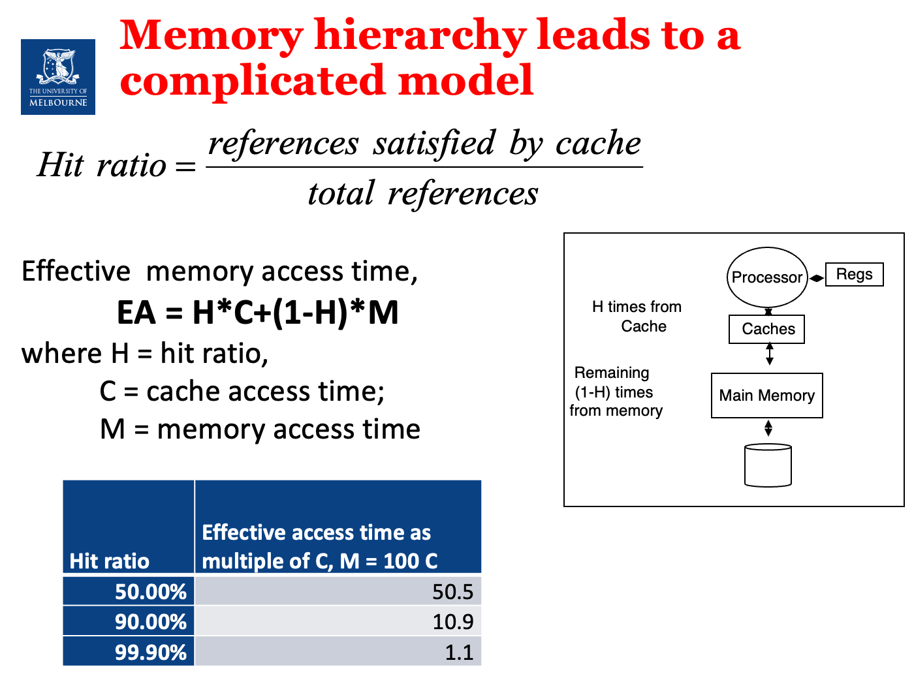

# Advanced Database Systems (COMP90050)

## Week 1

### Modelling Disk Access 
Disk access time = seek time + rotational delay + (transfer length / bandwidth)

- Seek time: the time it takes to locate the requested sector on the disk.
- Rotational delay: the time it takes to rotate the disk to the correct position.
- Transfer length: the number of bytes to be transferred.
- Bandwidth: the maximum rate of data transfer.

### HDD vs SSD
| **Feature**       | **HDD**                           | **SSD**                           |
|-------------------|-----------------------------------|-----------------------------------|
| **Storage Type**  | Magnetic disks                    | Flash memory                      |
| **Speed**         | Slower (100MB/s to 200MB/s)        | Faster (500MB/s to 5000MB/s+)     |
| **Durability**    | Less durable, susceptible to damage | More durable, resistant to shocks |
| **Capacity**      | Larger capacities (up to 10TB+)    | Smaller capacities (up to 4TB+)   |
| **Noise**         | Noisy due to moving parts          | Silent                           |
| **Power Consumption** | Higher power consumption        | Lower power consumption           |
| **Cost**          | More affordable for large storage | More expensive per GB             |

- Moore’s law: memory chip capacity doubles every 18 months since 1970
- Joy’s law for processors: processor performance doubles every two years since 1984

- Hit ratio (HR): the percentage of requests that are satisfied by the buffer.
- If the hit ratio (HB) is high, the effective access time (EA) will be closer to the buffer access time (BC), meaning accessing data will generally be fast.
- If the hit ratio is low, the access time will be closer to the disk access time (D), meaning it will take longer to access the data, as more requests will result in disk accesses instead of buffer hits.