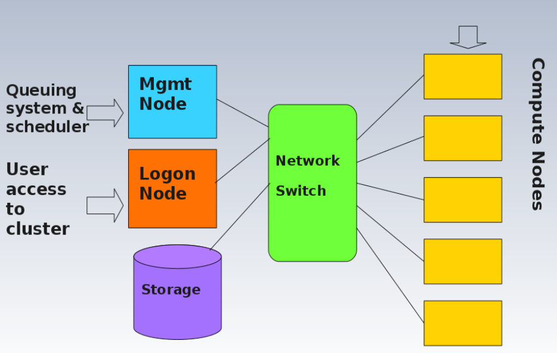
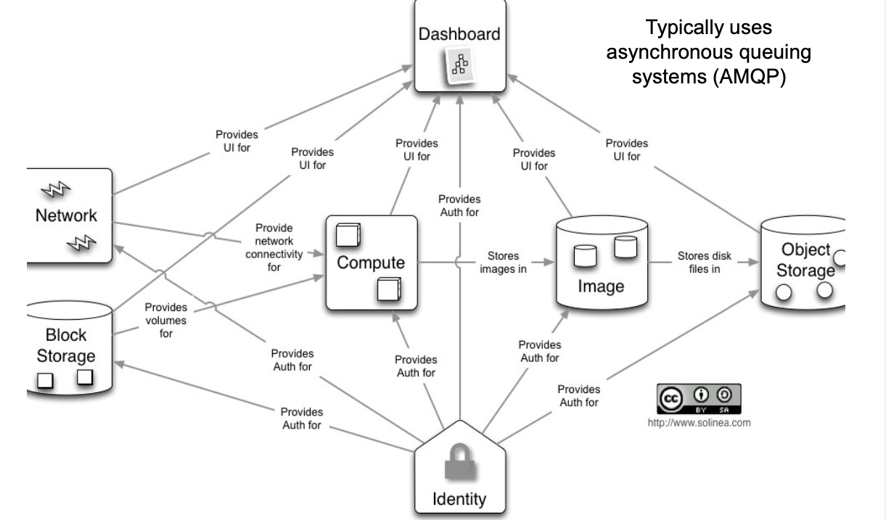
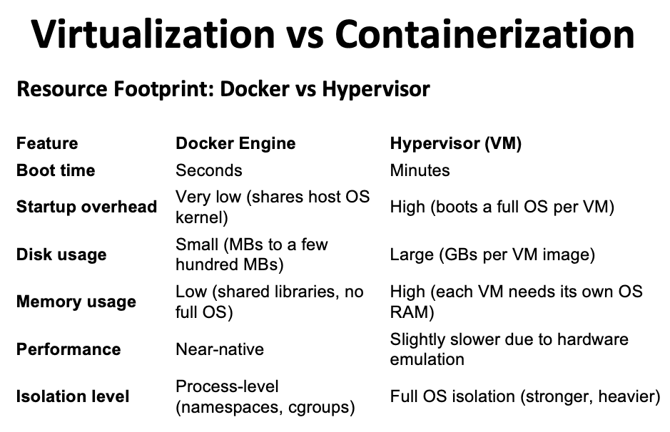
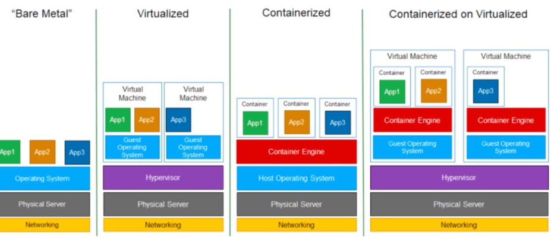
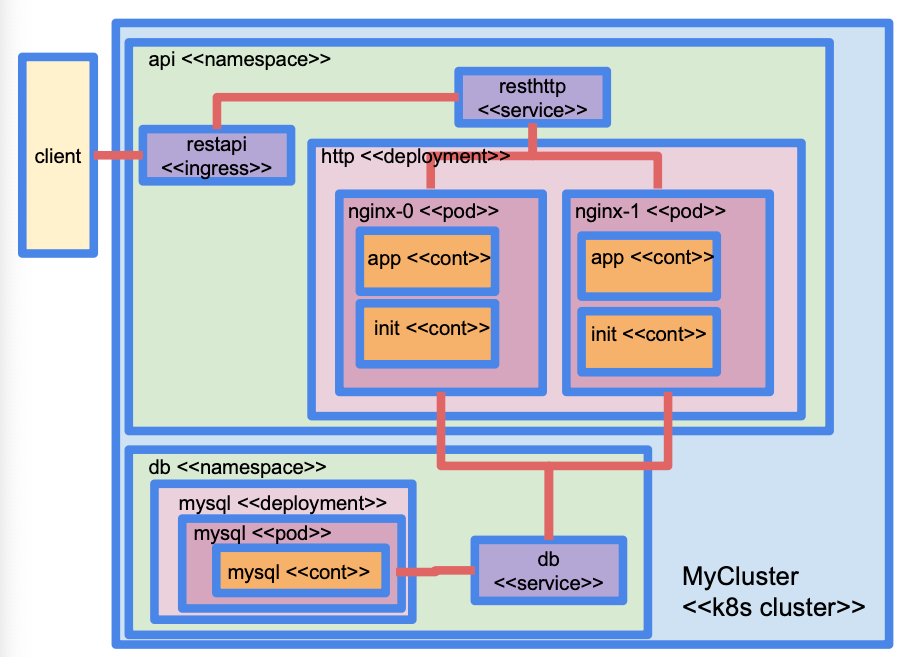
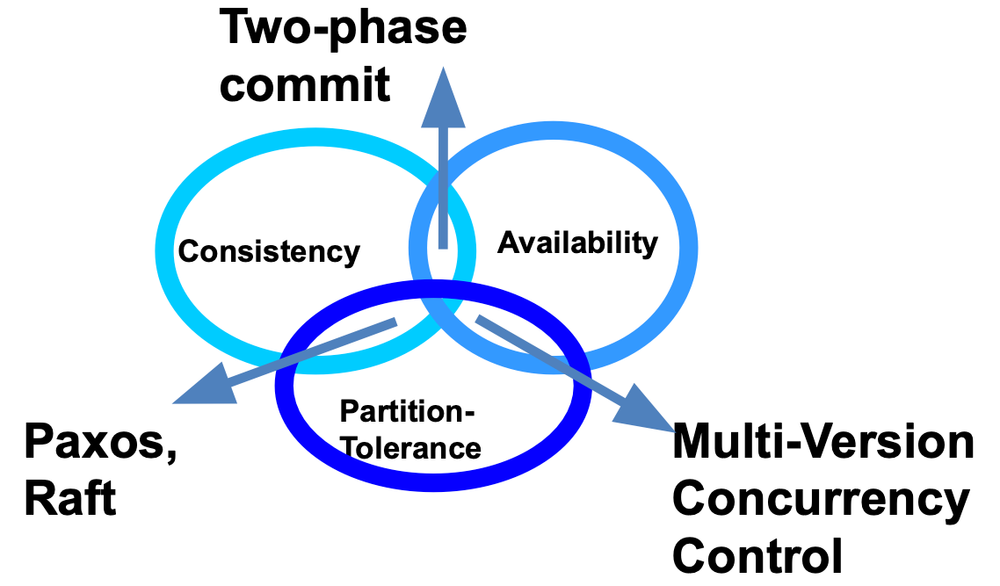

# Cluster and Cloud Computing (COMP90024)

## Week 1

### Cloud Characteristics
– On-demand self-service . A consumer can provision computing
capabilities as needed without requiring human interaction with
each service provider.
– Networked access . Capabilities are available over the network and
accessed through standard mechanisms that promote use by
heterogeneous client platforms.
- Resource pooling . The provider's computing resources are pooled to
serve multiple consumers using a multi-tenant model potentially
with different physical and virtual resources that can be
dynamically assigned and reassigned according to consumer
demand.
– Rapid elasticity . Capabilities can be elastically provisioned and
released, in some cases automatically, to scale rapidly upon
demand.
– Measured service . Cloud systems automatically control and
optimize resource use by leveraging a metering capability at some
level of abstraction appropriate to the type of service.

### Grid Computing

## Week 2

### Horizontal and Vertical Scaling
- Horizontal scaling refers to adding more resources to a system, easy to add more, cost not so high.
- Vertical scaling refers to increasing the resources of a system, more complex, cost high.


### Categories of Flynn's Taxonomy

| Type | Full Name | Instruction Stream | Data Stream | Example |
|-------|-----------|---------------------|-------------|---------|
| **SISD** | Single Instruction, Single Data | Single | Single | Traditional single-core CPU |
| **SIMD** | Single Instruction, Multiple Data | Single | Multiple | GPU, vector processors |
| **MISD** | Multiple Instruction, Single Data | Multiple | Single | Fault-tolerant systems (rare) |
| **MIMD** | Multiple Instruction, Multiple Data | Multiple | Multiple | Multi-core CPUs, distributed systems |

---
### Approaches for Parallelism (where and how)
– Explicit (openMP / MPI) vs Implicit parallelism
– Hardware
– Operating System
– Software/Applications
– Some or all of these

:::info
Message Passing Interface (MPI) is a standardized and portable message-passing system designed to function on a wide range of parallel computers.
:::

### Erroneous Assumptions of Distributed Systems
1. The network is reliable
2. Latency is zero
3. Bandwidth is infinite
4. The network is secure
5. Topology doesn't change
6. There is one administrator
7. Transport cost is zero
8. The network is homogeneous
9. Time is ubiquitous

## Week 3


### Amdahl's Law and Gustafson's Law
#### 🌟 **Key Differences**
| Law | Assumption | Best Use Case | Result |
|------|------------|---------------|--------|
| **Amdahl's Law** | Fixed problem size | Small-scale problems, focus on bottlenecks | Speedup limited by the serial part |
| **Gustafson's Law** | Scalable problem size | Large-scale problems, focus on parallel efficiency | Speedup can scale nearly linearly with the number of processors |
 
 **If you can make use of parallelisation you should make use of it! It will always generate some benefit, and the larger the problem the bigger the gain.**

### Environment Modules
Environment Modules is a tool used to dynamically manage and configure the user’s shell environment in Unix-like systems. It is widely used in High-Performance Computing (HPC) environments to simplify the use of software packages and manage different software versions without conflicts.  

Modules work by modifying environment variables (e.g., `PATH`, `LD_LIBRARY_PATH`, `MANPATH`, etc.) when a module is loaded or unloaded. This allows users to switch between different versions of the same software easily without modifying the system configuration.  

 ---

### 🛠️ **Common `module` Commands**

| Command | Description | Example |
|---------|-------------|---------|
| `module help` | Displays help information about the `module` command, including available options and subcommands. | `module help` |
| `module avail` | Lists all available modules in the system. | `module avail` |
| `module whatis <modulefile>` | Shows a brief description of the specified module. | `module whatis gcc` |
| `module display <modulefile>` | Displays detailed information about what a module will modify in your environment (e.g., `PATH`, `MANPATH`, etc.). | `module display gcc/10.2.0` |
| `module load <modulefile>` | Loads the specified module and updates the environment accordingly. | `module load gcc/10.2.0` |
| `module unload <modulefile>` | Unloads the specified module and resets the environment. | `module unload gcc/10.2.0` |
| `module list` | Lists all currently loaded modules. | `module list` |
| `module purge` | Unloads all currently loaded modules. | `module purge` |
| `module swap <old_module> <new_module>` | Unloads the old module and loads the new one in a single step. | `module swap gcc/9.3.0 gcc/10.2.0` |
| `module save <name>` | Saves the current module environment as a named collection. | `module save my_environment` |
| `module restore <name>` | Restores a previously saved module collection. | `module restore my_environment` |

---
### 🛠️ **Common `slurm` Commands**
| Command       | Description                    | Example                                          |
|--------------|--------------------------------|--------------------------------------------------|
| `sbatch`     | Submit a job                   | `sbatch job.slurm`                               |
| `squeue`     | View job status                | `squeue -u <username>`                                         |
| `scancel`    | Cancel a job                   | `scancel 12345`                                  |
| `sinfo`      | View node status               | `sinfo`                                          |
| `sacct`      | View job history               | `sacct -u username`                              |
| `sstat`      | View running job status        | `sstat 12345`                                    |
| `scontrol`   | Manage jobs, nodes, partitions | `scontrol show job 12345`                        |
| `sprio`      | View job priority              | `sprio`                                          |
| `srun`       | Run a command interactively    | `srun --pty bash`                                |
| `sinteractive` | Start an interactive session | `sinteractive -n 4 -t 2:00:00 --mem=8G`         |


### Slurm Job Scripts
Example
``` bash
#!/bin/bash
#SBATCH --job-name=myjob        # 作业名
#SBATCH --output=output.txt     # 标准输出文件
#SBATCH --error=error.txt       # 标准错误输出文件
#SBATCH --ntasks=1              # 任务数
#SBATCH --cpus-per-task=4      # 每个任务的CPU核数
#SBATCH --mem=4GB               # 分配的内存
#SBATCH --time=01:00:00         # 最大运行时间（1小时）
#SBATCH --partition=standard    # 分区名称

# 下面是实际执行的命令
echo "Starting my job..."
srun my_program arg1 arg2    # 执行的程序及参数
```

:::info
### Some Linux Commands
| **Command**             | **Description**                                                   |
|-------------------------|-------------------------------------------------------------------|
| `touch <filename>`       | Creates an empty file. If the file already exists, it updates the file's timestamp. |
| `scp <source> <destination>` | Securely copies files or directories to/from a remote host.      |
| `diff <file1> <file2>`   | Compares the differences between two files.                       |
| `sdiff <file1> <file2>`  | Displays the differences between two files side by side.          |
| `comm <file1> <file2>`   | Compares two sorted files and outputs common and different lines. |
| `find <path> <options>`  | Searches for files or directories within the specified path.      |
| `grep <pattern> <file>`  | Searches for lines in a file that match a given pattern.          |
| `tar -xvfh <archive>`    | Extracts a `.tar` file and shows the file list.                   |
| `ls -d <path>`           | Lists only the directory itself, not its contents.                |
| `cut <options>`          | Extracts specific columns from text.                              |
| `paste <file1> <file2>`  | Merges the contents of two files side by side by columns.         |
| `ls | wc -l`             | Counts the number of files and directories in the current directory. |
| `tar -xvfh <archive.tar>`| Extracts a `.tar` archive and shows detailed information.        |
| `tar -cvf <archive.tar> <files>` | Creates a `.tar` archive.                                    |
| `ls -l`                  | Lists files in the current directory with detailed information like permissions, size, and modified time. |
| `tar -cvf <archive.tar> <files>` | Creates a `.tar` archive.                                    |
| `ls -l`                  | Displays detailed information about files in the current directory. |
| `tar -xvfh archive.tar`  | Extracts the contents of a `.tar` file and shows the files being extracted. |
| `ls | wc -l`             | Counts the number of files and directories in the current directory. |
| `tar -cvf archive.tar`   | Creates a `.tar` file from specified files.                      |
| `ls -d */`               | Lists only the subdirectories in the current directory.          |
| `cut -f1 -d":" <file>`   | Extracts the first column of data before the colon (:) delimiter in a file. |
::: 

## Week 4
### Public Clouds
#### Pros
– Utility computing
– Can focus on core business
– Cost-effective
– “Right-sizing”
– Democratisation of computing
#### Cons
– Security
– Loss of control
– Possible lock-in
– Dependency of Cloud provider continued existence

### Private (on premise) Clouds
#### Pros
– Control
– Consolidation of resources
– Easier to secure
– More trust
#### Cons
– Relevance to core business? e.g., Netflix ->Amazon
– Staff/management overheads
– Hardware obsolescence
– Over/under utilisation challenges
– (Effort and cost of establishing a data centre)

### OpenStack
- Open Source: OpenStack is a completely open-source cloud computing platform, and anyone can download, install, and modify the source code. It allows enterprises to build and manage their own cloud infrastructure in private data centers with full control.
- Deployment: OpenStack is typically deployed on an organization's own hardware or can be deployed on any supported hardware (including virtual machines). Therefore, it is suitable for private cloud and hybrid cloud deployments.
- Highly Customizable: Being open-source, OpenStack allows users to highly customize according to their needs.
- Primarily provides Infrastructure as a Service (IaaS) functionalities such as computing, storage, and networking.
- Offers services like Nova (compute), Swift (object storage), Neutron (networking), Cinder (block storage), Keystone (identity management), etc.
- Requires enterprises to manage and maintain their services themselves.


## Week 5


### Container Orchestration Tools
- Container orchestration technologies provide a framework for integrating and managing containers at scale
1. Container orchestration technologies feature
- Networking
- Scaling
- Service discovery and load balancing
- Health check and self-healing
- Security
- Rolling updates
2. Goals:
- Simplify container management processes
- Help to manage availability and scaling of containers

### Persistence
#### Docker has two options for containers to store files on the host machine, so that the files are persisted even after the container stops.
- Docker volumes (Managed by Docker, /var/lib/docker/volume/)
- Bind mounts (Managed by user, anywhere on the file system)

### Docker networking
- “host”: every container uses the host network stack; which means all containers share the same IP address, hence ports
cannot be reused in different containers (Docker Engine on Linux only, not for Docker Desktop for Linux, MacOS, or Windows)
### Docker networking modes
- “bridge”: containers can re-use the same port, as they havedifferent IP addresses, and expose a port of their own that belong to the hosts, allowing containers to be somewhat visible from theoutside.
- “none”: no network, completely isolated. i.e. No access fromoutside, no access to the outside.
- “overlay”: used in Docker SWARM for multi-host communications.
- “macvlan”: containers gets its own IP on the physical network (like a real machine)


### CI/CD
- CI/CD Pipeline - Integrates the CI/CD practices, the tools, and stages that software changes undergo from development to deployment

- Lint Check
- Dependency Check
- Code Quality Analysis
- Unit Testing
- Integration/E2E Tests
- Pack the Software (build docker image)
- Deployment

## Week 6
### K8S
- Node: a compute node (usually a Virtual Machine) that k8s runs on
- Volume: persistent storage that can be attached to a node and mounted as a file system
- Pod: a set of one or more containers that work together to accomplish a task: a pod is the smallest component that can be deployed in a k8s cluster
- Deployment: a set of identical pods that run at the same time: it can be used to keep a number of replicas of the same app (say, a deployment of three Nginx pods)
- Service: functionality a pod offers on a port. Services are internal to a k8s cluster
- Ingress: a component that allows clients access to one or more services with routing based on hostname, paths, etc
- Config map: a way to pass parameters around in a k8s cluster
- Namespace: all the objects above (except nodes) are grouped in namespaces for easier management. In every k8s cluster there is a default namespace called “default”

[Check more about K8S](../kubernetes/index.md)

### SOAP vs REST
- ReST is more of a style to use HTTP than a separate protocol
- SOAP/WS is a stack of protocols that covers every aspect of using a remote service, from service discovery, to service description, to the actual request/response

### WDSL (Web Services Description Language)
- WSDL（Web Services Description Language）是Web服务的核心标准之一，它在过去很长一段时间内被广泛用于描述和实现SOAP（Simple Object Access Protocol）风格的Web服务。然而，随着技术的发展，特别是在REST（Representational State Transfer）架构风格的兴起和微服务架构的流行，WSDL的使用确实有所减少。

### ReST Best Practices
1) Keep URIs short – and create URIs that don’t change.
2) URIs should be opaque identifiers that are meant to be
discovered by following hyperlinks, not constructed by the
client.
3) Use nouns, not verbs in URLs
4) Make all HTTP GETs side-effect free. Doing so makes the
request "safe".
5) Use links in your responses to requests! Doing so
connects your response with other data. It enables client
applications to be "self-propelled”, i.e. "what is the next step
to take".
6) Minimize use of query strings.


## Week 7
### FaaS
- The idea behind Serverless/FaaS is to develop software applications without
bothering with the infrastructure (especially scaling-up and down as load
increases or decreases): the cloud provider manages servers and capacity

- FaaS函数是一个独立的过程，它返回的值被其他进程所消费。在许多FaaS框架中，FaaS函数是一个Docker容器。
- FaaS函数必须返回一个可以被其他项目消费的值，通常这个值是一个对象的JSON表示。

#### Why FaaS
- Simpler deployment (the cloud provider takes care of the infrastructure)
- Reduced computing costs (only the time during which functions are executed
is billed) and more efficient use of computing resources
- Reduced application complexity and more flexibility due to loosely-coupled
architecture

The main difference between proprietary FaaS services and open-source
FaaS frameworks is that the latter can be deployed on your cluster, looked
into, disassembled, and improved by you.

### Functions
- 不修改系统状态的函数被称为无副作用的（例如，一个接受图像并返回该图像缩略图的函数）。
- 以某种方式改变系统的函数不是无副作用的（例如，一个返回图像缩略图并将其写入文件系统的函数）。
- 无副作用的函数可以并行运行，并且在给定相同输入的情况下，保证返回相同的输出。
- 然而，在相对复杂的系统中，副作用几乎是不可避免的。因此，必须考虑如何使具有副作用的函数在FaaS环境中通常所需的并行运行，避免死锁（每个函数都在等待另一个函数释放资源）。
- 将非无副作用的函数数量限制在最小范围内是一个好的实践，而不是在应用程序中散布改变系统的代码片段。

有状态函数：输出依赖于内部存储的信息，难以并行运行。
无状态函数：不内部存储信息，依赖外部存储来维护状态，更适合在FaaS环境中运行

- 默认情况下，FaaS中的函数是同步的，因此它们会立即（或几乎立即）返回结果。
- 然而，有些函数可能需要更长的时间才能返回结果，因此在过程中可能会导致超时并锁定与客户端的连接，因此最好将它们转换为异步函数。
- 异步函数返回一个代码，通知客户端执行已开始（通常是HTTP状态码202），然后在执行完成时触发一个事件。
- 在更复杂的情况下，可以使用涉及消息队列系统的发布/订阅模式来处理异步函数。

| 特性 | 单体应用 | 微服务应用 | 无服务器应用 |
|---|---|---|---|
| **架构** | 所有功能在一个代码库和运行时环境中 | 将功能拆分为多个独立的服务，每个服务有自己的代码库和运行时环境 | 将功能进一步拆分为函数，由第三方平台管理运行时环境 |
| **部署** | 作为一个整体部署 | 各个服务独立部署 | 函数按需部署，由平台自动扩展 |
| **扩展** | 垂直扩展（增加资源） | 水平扩展（增加实例） | 自动水平扩展 |
| **耦合度** | 高耦合 | 低耦合 | 无耦合 |
| **技术栈** | 通常使用单一技术栈 | 各个服务可以使用不同的技术栈 | 函数可以使用不同的语言和环境 |
| **开发** | 开发和调试相对简单 | 开发和调试更复杂，需要服务间通信机制 | 开发简单，只需关注函数逻辑 |
| **测试** | 测试相对简单 | 需要进行集成测试和端到端测试 | 测试相对简单，但需要模拟事件触发 |
| **维护** | 维护相对简单 | 需要维护多个服务，更复杂 | 维护由平台负责，开发者只需关注代码 |
| **故障隔离** | 故障会影响整个应用 | 故障被隔离在单个服务中 | 故障被隔离在单个函数中 |
| **资源利用率** | 资源利用率可能较低 | 资源利用率较高，但需要管理多个服务 | 资源利用率最高，按需付费 |
| **延迟** | 通常较低 | 可能引入网络延迟 | 可能引入网络延迟和冷启动延迟 |
| **成本** | 初期成本较低，但随着规模扩大成本增加 | 初期成本较高，但更容易扩展，长期成本可能较低 | 成本与使用量直接相关，适合事件驱动的应用 |
| **适用场景** | 小型应用、快速原型开发 | 大型复杂应用、需要灵活性和可扩展性的应用 | 事件驱动的应用、需要高度弹性和自动扩展的应用 |
| **示例工具** | 传统的 Web 应用框架 | Kubernetes, Docker, Istio | AWS Lambda, Azure Functions, Google Cloud Functions |
**总结:**
*   **单体应用** 简单易用，适合小型项目或快速原型开发。
*   **微服务应用** 提供更高的灵活性和可扩展性，适合大型复杂项目。
*   **无服务器应用** 提供最高的弹性和自动扩展能力，适合事件驱动的应用。

### Fission
- Function: a software module that returns a value and can be called
independently by a trigger
- Environment: the Docker image that a function runs on. An environment is a
language-specific, includes an HTTP server and some base libraries, but it
can be customised
- Package: a set of files (usually source code and/or compiled binaries) that is
used to customise an Environment
- Trigger: an event that causes the execution of a function, such as:
○ An HTTP request
○ A timer
○ A message published on a queue
○ The completion of a Kubernetes job
- Router: a component that directs an HTTP request to a function
- Specifications (Specs): a set of YAML files that defines the components of a
Fission application.
“Specs” make it easier to deploy and maintain
applications compared to the use of CLI commands

#### Executors
- Fission executes function in two different ways:
- PoolManager (default executor): Fission manages a pool of pods for every
environment; when a function is invoked the function packages are
loaded into the pod and the function executed. There is a single
instance of a function running on any given time
- NewDeploy: new pods are created as the load increases
- PoolManager minimizes the latency in executing functions (warm start), but
cannot cope with heavy load on a single function (functions are multi-threaded
and able to service different request at the same time, but they may become
overloaded)
- NewDeploy has a higher latency (cold start) but allows multiple instances of
the same function to run at the same time, hence it can cope better under
heavy loads. Additional function instances are automatically spun according to
some metrics (such as CPU consumption)

#### Fission Cli
``` shell
fission environment list
fission packages list
fission function log --name
fission function create --name hello --env python --code hello.py # create a function
<function name> --namespace <namespace> # see the log of a function
fission function test --name <function name> --namespace <namespace> # test function
fission specs apply # To update the cluster based on specs
```
- While the test command is useful for a quick test, it is not how functions are
invoked, for that we need a trigger, The most typical use case is an HTTP request, hence we need to create a
route (aka HTTP trigger):
``` shell
fission route create --name hellort --function hello --method GET --url /hello
```

#### Fission MQ
- To achieve asynchronous functions (e.g using kafka or redis)

#### Fission WebSocket
- Fission can accommodate long-running tasks between a back-end application and a web front-end


---

## Week 8

### CouchDB vs PostgreSQL vs ElasticSearch
-  ElasticSearch restricts write request directed to an index to only one node at
a time (the node hosting the primary shard) while every node in CouchDB can
accept write requests
-  ElasticSearch has elections in place to establish another master node in case
one fails, and there is the possibility of not reaching a minimum number of
master-eligible nodes (a quorum), hence forcing the cluster to stop accepting
write requests. By contrast, there are no elections in CouchDB, even when
one or more nodes fail
-  In PostgreSQL a failed node hinders the functioning of the whole cluster and
leads to some data not being accessible at all
-  These differences are rooted in different approaches to an unsolvable
problem, a problem defined by Brewer’s CAP Theorem


- CouchDB uses MVCC, hence it is a highly-available DBMS and maintains its
availability even when a network partition happens, possibly sacrificing its
consistency
- ElasticSearch uses a mix of two-phase commit (for replicating data from
primary to secondary nodes) and Paxos-like behaviour (to elect a master
node), hence it is consistent but not available when a network partition
occurs.
To ensure in-order updates of documents, a sequence number and a primary
term (a number that identifies the primary shard) has to be passed to the
transaction request
- PostgreSQL federated databases use a two-phase commit, hence they do
not tolerate a network partition

### ElasticSearch

#### Es集群健康状态
状态 | 含义 | 数据可用性 | 冗余安全性
Green | 一切正常，主 + 副本都在 | ✅ | ✅
Yellow | 主分片在，副本缺失 | ✅ | ❌
Red | 主分片或数据丢失，服务中断 | ❌ | ❌

#### Es Components
- ElasticSearch: the component that does the storing and searching of
documents
- FileBeat: the component that listens for updates in files (typically log files)
and loads the updates into indexes
- MetricBeat: a component that monitors the state of a system and stores the
metrics into indexes
- LogStash: a component that transforms data collected by data sources (such
as FileBeat and MetricBeat) and stores the transformed data into
ElasticSearch indexes
- Kibana: a web-based user interface that allows the query and management of
an ElasticSearch cluster

#### Shards
- ElasticSearch by default uses hash sharding on the document ID to ensure an equal number of documents in each shard
- The bigger the shard, the slower the search, but every shard consumes resources, hence the optimal number of shards depends on several criteria
- it makes sense to remove older data when they become either too old or too large
- In ElasticSearch an index can have its life-cycle policy defined through the following phases: Hot, Warm, Cold, Frozen, Delete

:::info
ElasticSearch Index = MySQL Database
ElasticSearch Document = MySQL Row
ElasticSearch Field = MySQL Column
:::

#### ES Data Types
-  Binary (encoded as Base64 strings)
-  Boolean (true or false as JSON values)
-  Keyword (a string that contain a limited number of values, such as postal
- odes, city names, etc)
-  Text (a string field that is full-text indexed)
-  Numeric (integers, float, double, etc)
-  Date (timestamps expressed as either strings or numbers)
-  Object (not indexed, but its fields can be)
-  Array (there are no arrays in ElasticSearch, but any field can contain 0, 1, or more values as long as all the values have the same data type)
-  Join (a field that creates a parent-child relationship between documents)
-  Geo (a geometric shape with real-world coordinates)
-  Vector (a numeric array that contains a point in a multi-dimensional space)

#### ES Metadata
- When documents are inserted, some metadata fields are added (by default _id and
_index)
Common metadata fields include:
- - _index (the index the document belongs to)
- - _id (document ID - similar to the primary key in a relational DBMS)
- - _version (document version)
- - _primary_term (it identifies the primary shard)
- - _seq_no (the change number within the primary shard)
- - _source (the original JSON document)
- - _routing (the shard the document is assigned to - only when the routing is
forced when creating the document)
- By default the search API does not return all metadata fields, but adds _score (the
relevancy of a document in a query: the higher the score, the more relevant the
document within the query results)
- The ID of a document is assigned by ElasticSearch if no ID is given in the request
- The ID is unique to a document: an error is returned when trying to insert a document
using an existing ID

#### Updating and deleting documents
- Since ElasticSearch is concurrent, there may be requests that are arrive
out-of-order (say, when a node fails), therefore the document sequence
number and the primary term should be sent along with the update or delete
request.
- When these two meta fields are omitted, the update or delete
request may return status 409 (conflict) or risk overwriting previous
changes.
- The meta fields can be obtained by reading the document just
before sending the update or delete request
- 409s can happen especially during search updates or deletes, as
other clients may have changed the documents between the search
and update/delete steps (ElasticSearch does not lock data as
relational DBMS do: no “SELECT FOR UPDATE” in ElasticSearch)

#### Query DSL
``` json
// A query to select all H1 students that are named “John”

POST /students/_search
{
  "query": {
    "bool": {
      "must": [
        {
          "range": {
            "mark": {
              "gte": 80
              }
            }
          },
          {
            "match": {
              "name": "john *"
              }
            }
          ]
        }
    }
}
```
- “must” means “and”
- “should” means “or”
- "filter" means "where"

#### ES pagination
- Pagination (by default ElasticSearch returns 1,000 rows) is implemented via a cursor (think of it as a bookmark that marks a page in a book)
- The cursor ID has to be passed to subsequent request to retrieve the next page

#### EQL
- EQL is a language used to match events that occur near each other, often used to search logs for suspicious activity
- The following query retrieve events that happen within one minute from each other and satisfy a logical expression

#### Parent-Child Relationship: Mapping Definition

- In ElasticSearch, you can explicitly establish a **parent-child relationship** between two documents through mappings.
- For example, a `"course"` document can have multiple `"student"` documents as child documents.

This is similar to a one-to-many relationship in relational databases.  
In ElasticSearch, the `join` field type is used to define this relationship. For example:

```json
PUT my_index
{
  "mappings": {
    "properties": {
      "my_join_field": {
        "type": "join",
        "relations": {
          "course": "student"
        }
      }
    }
  }
}
```

In this example:
- `my_join_field` is a special field used to represent the parent-child relationship between documents.
- `"course": "student"` indicates that each `"course"` document can have multiple `"student"` child documents.

When inserting documents, you need to specify whether it is a parent or child. For example:
- Inserting a course document:
  ```json
  POST my_index/_doc/1
  {
    "title": "Math 101",
    "my_join_field": "course"
  }
  ```
- Inserting a student child document (must reference the parent document ID):
  ```json
  POST my_index/_doc/2?routing=1
  {
    "name": "Alice",
    "my_join_field": {
      "name": "student",
      "parent": "1"
    }
  }
  ```


#### Vector Data
- Vectors (both sparse and dense) can be loaded into ElasticSearch and queried for equality and k-Nearest Neighbours searches
- During the mapping definition, a vector is defined with its type, no. of dimensions, the distance to use and some index parameters
```json
{
"type": "dense_vector",
"dims": 5,
"similarity": "l2_norm",
"m": 32,
"ef_construction": 100
}
```
- ElasticSearch uses the Hierarchical Navigable Small World algorithm for vector searches

## Week 9
- Virtual Machine Monitor (VMM) aka Hypervisor: The virtualisation layer between the underlying hardware (e.g. the physical server) and the virtual machines and guest operating systems it supports.
- - The environment of the VM should appear to be the same as the physical machine
- - Minor decrease in performance only
- - Appears as though in control of system resources
- Virtual Machine (VM): A representation of a real machine/server using hardware/software that can host a guest operating system
- Guest Operating System: An operating system that runs in a virtual machine environment that would otherwise run
directly on a separate physical system

### Typical virtualization strategies mainly include the following three aspects:
### 1. De-privileging
- **Trap and Emulate**: The VMM simulates the impact of system and hardware resources by intercepting and simulating the execution of privileged instructions that fall into the VMM.
- **Implementation**: This is usually achieved by running the GuestOS at a lower hardware priority than the VMM.
### 2. Primary/Shadow Structures
- **Maintaining Shadow Copies**: The VMM maintains a "shadow" copy of critical structures, with its "primary" version operated by the GuestOS, such as the memory page table.
- **Purpose**: To ensure that the correct version of the copy is visible to the GuestOS.
### 3. Memory Traces
- **Controlling Access**: Control access to memory to ensure that the shadow and primary structures remain consistent.
- **Common Strategies**: Write-protect the primary copy so that it can capture, interpret, and handle update operations that may cause page faults.
- **Benefits**: Prevent other people's applications/code from crashing the server you are using.
The picture also includes a schematic diagram, showing the relationship between GuestOS, VMM, and resources, emphasizing the process of interception and simulation.

### There are MANY hypervisors that are realized in many ways (more later)
- KVM - Kernel-based Virtual Machine – uses raw images, qcow2, and VMware formats.
- LXC - Linux Containers (through libvirt) used to run Linux-based virtual machines.
- QEMU - Quick EMUlator (typically used for development purposes)
- Vmware vSphere runs VMware-based Linux and Windows images through connection with vCenter server.
- Virtuozzo - OS Containers and Kernel-based Virtual Machines supported via libvirt virt_type=parallels.
- zVM - Server virtualization on z Systems and IBM LinuxONE, it can run Linux, z/OS and more.
- Ironic - OpenStack project which provisions bare metal machines (more later).

### Full Virtualization and Para-virtualization
| Feature      | Full Virtualization                                  | Para-virtualization                                     |
| :----------- | :--------------------------------------------------- | :------------------------------------------------------ |
| **Definition** | Allows unmodified Guest OS to run by simulating complete hardware. | Hypervisor provides a special interface to the Guest OS, which needs to be modified to be aware of and use this interface. |
| **Guest OS** | Unmodified, unaware of the virtualization environment. | Requires modification, also known as "Hypervisor-aware" Guest OS. |
| **Performance** | Relatively low. Due to the need to simulate hardware and trap/translate sensitive instructions (Trap & Emulate), there is a performance overhead. | Relatively high. The Guest OS communicates directly with the Hypervisor through an efficient interface, reducing the overhead of instruction trapping and emulation. |
| **Compatibility** | **Advantage**: Supports unmodified operating systems, good compatibility, and can run various different Guest OS. | **Disadvantage**: Can only run modified Guest OS that supports this specific Hypervisor. |
| **Security** | Good isolation between Guest OS and Hypervisor, because the OS runs on simulated hardware. | The Guest OS needs to interact directly with the Hypervisor, which may theoretically pose a more direct interaction risk (but in practice, the Hypervisor is usually designed very securely). |
| **Deployment/Maintenance** | **Advantage**: Simple deployment, no need to modify the Guest OS. | **Disadvantage**: Need to obtain, install, and maintain modified versions of the Guest OS. |
| **Examples** | VMware Workstation/Fusion, VirtualBox, KVM (when running unmodified OS) | Xen (early versions), OpenVZ (strictly speaking, it is OS-level virtualization, but the concept is similar) |
**Summary:**
*   The main advantage of **Full Virtualization** is its **compatibility** and **ease of use** (no need to modify the Guest OS), but at the cost of **performance**.
*   The main advantage of **Para-virtualization** is its **high performance**, but it sacrifices **compatibility** and requires the modification of the Guest OS.
If you need to run various different, unmodified operating systems, Full Virtualization is the better choice. If you pursue the ultimate performance and can accept the modification of the Guest OS, then Para-virtualization may be more suitable.


### Hardware-assisted Virtualization and Binary Translation
| Feature      | Hardware-assisted Virtualization                                  | Binary Translation                                              |
| :----------- | :--------------------------------------------------- | :------------------------------------------------------ |
| Definition    | Hardware provides architectural support to run Hypervisor (e.g., KVM) | Implements capture and execution by scanning guest instructions and replacing sensitive instructions with simulated code (e.g., VMWare) |
| Hardware Requirements | Requires new processor support, many new processors typically have this feature | Does not require hardware support, but implementation is more difficult |
| Sensitive Instruction Handling | All sensitive instructions can be captured | Sensitive instructions are replaced with simulated code |
| Performance    | Typically high, as hardware directly supports virtualization | May be lower, as an additional translation step is required |
| Compatibility  | High, as hardware support reduces software layer complexity | Relatively high, but may have issues with non-1:1 mapping between instruction sets |
| Implementation Difficulty | Relatively low, as hardware provides support | Relatively high, as complex software translation mechanisms are required |
| Instruction Set Mapping | Typically 1:1 mapping, hardware directly supports | Rarely 1:1 mapping, requires translation and simulation |
| Examples       | KVM, Intel VT-x, AMD-V                                 | VMWare, VirtualBox (early versions)                             |
Summary:
- The main advantage of **Hardware-assisted Virtualization** is its high performance and relatively low implementation difficulty, as hardware directly supports virtualization operations. This makes it the preferred method for modern virtualization technology.
- The main advantage of **Binary Translation** is that it does not rely on specific hardware and can run on older processors. However, its performance may not be as good as hardware-assisted virtualization, and it is more complex to implement.
In modern processors, hardware-assisted virtualization is usually the better choice. However, in cases where hardware does not support or maximum compatibility is required, binary translation may be more suitable.

### Bare Metal Hypervisor and Hosted Virtualization
| Feature       | Bare Metal Hypervisor | Hosted Virtualisation |
| :------------ | :------------------- | :------------------- |
| Running Location | Directly on physical hardware | On top of a host operating system |
| Examples       | VMWare ESX Server    | VMWare Workstation    |
| Boot Method    | Boots directly on physical machine | First boots the host operating system, then the VMM |
| Hardware Management | VMM directly manages hardware | Host operating system manages hardware |
| Performance    | Typically higher      | May be lower, influenced by the host operating system |
| Complexity     | Implementation is complex, requires direct hardware management | Implementation is simple, utilizing host operating system functions |
| Driver Support | VMM needs to support all hardware drivers | Utilizes the host operating system's drivers |
| System Resource Utilization | Lower, no additional operating system overhead | Higher, including the host operating system's overhead |
| Typical Application Scenarios | Enterprise-level data centers, high-performance demand environments | Personal users, development and testing environments |

### Operating System Level Virtualization
| Feature     | Advantages                                                         | Disadvantages                                                         |
| :---------- | :--------------------------------------------------------------- | :--------------------------------------------------------------- |
| Resource Utilization | **Lightweight**<br>Uses fewer resources, high efficiency | **Resource Sharing**<br>Shares resources with other containers, may have resource competition |
| Performance    | **Fast**<br>Runs directly on the host operating system, reducing virtualization layer overhead |  |
| Number of Containers | **More VMs**<br>Can run more virtual machines on the same hardware |  |
| Application Packaging | **Application and Dependency Packaging**<br>Can package applications and all OS dependencies into containers |  |
| Development Proximity | **Closer to Application Development**<br>Provides an environment closer to application development |  |
| Compatibility  | **Same OS Applications**<br>Can only run applications designed for the same operating system | **Different Guest OS**<br>Cannot host different guest operating systems |
| File System    | **Native File System**<br>Can only use the native file system |  |
| Resource Utilization | **Resource Sharing**<br>Uses the same resources as other containers |  |
This table details some of the main advantages and disadvantages of operating system level virtualization, helping to understand the characteristics of this virtualization technology in terms of resource utilization, performance, compatibility, and more. Operating system level virtualization, also commonly referred to as containerization (e.g., Docker), is very popular in modern software development and deployment, particularly suitable for microservice architectures and continuous integration/continuous deployment (CI/CD) processes.
