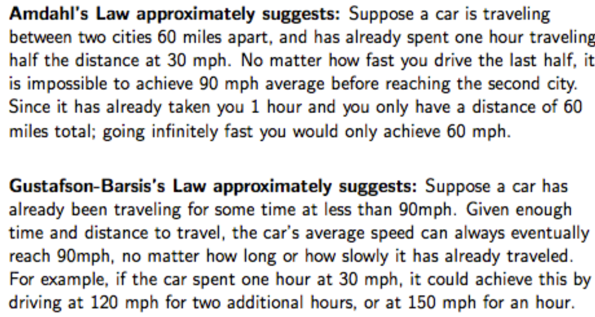

# Cluster and Cloud Computing (COMP90024)

## Week 1
Over the past two decades, several major trends in research and computing have collectively enabled the rise of cloud computing:
1. **Virtualization** has allowed multiple virtual machines to run efficiently on a single physical host, maximizing hardware utilization—crucial for scalable cloud infrastructure.
2. **Distributed computing models**, such as grid and cluster computing, demonstrated how large tasks could be executed across multiple machines, forming the architectural basis of the cloud.
3. **Broadband Internet access** made it feasible to access remote resources with low latency, enabling the core idea of “computing over the internet.”
4. **Utility computing** introduced the pay-as-you-go model, shifting IT investment from capital to operational expenditure, thus attracting cost-conscious enterprises.
5. **Scalability and elasticity** gave organizations the ability to dynamically adjust resources based on real-time demand, improving flexibility and cost-efficiency.
6. **Service-Oriented Architecture (SOA)** encouraged modular, reusable components, shaping how cloud services are designed and integrated.
7. **Data storage innovations**, such as SSDs and software-defined storage, improved data throughput and reliability, meeting the demands of large-scale cloud workloads.
8. **Security and privacy advancements**, including encryption, access control, and compliance standards, addressed growing concerns around trusting third-party providers.
9. **Open source software**, like OpenStack and Kubernetes, fueled rapid innovation and made cloud technologies more accessible to startups and researchers alike.
10. **Economic pressures** to cut costs and improve agility further accelerated cloud adoption, as organizations sought to benefit from economies of scale and specialized expertise.


### Cloud Characteristics

| 特征 | 英文名称 | 核心概念 | 主要优势 | 实现方式 | 典型应用场景 |
|------|----------|----------|----------|----------|--------------|
| **按需自助服务** | On-demand self-service | 用户可自主获取计算资源，无需人工干预 | • 提高效率<br>• 降低成本<br>• 24/7可用 | • 自助服务门户<br>• API接口<br>• 自动化配置工具 | • 开发测试环境快速创建<br>• 临时计算资源需求<br>• 业务高峰期扩容 |
| **网络化访问** | Networked access | 通过网络提供服务，支持多平台访问 | • 随时随地访问<br>• 跨平台兼容<br>• 降低部署复杂度 | • 标准网络协议<br>• Web界面<br>• 移动应用<br>• API服务 | • 远程办公<br>• 移动应用开发<br>• 跨地域协作 |
| **资源池化** | Resource pooling | 多租户共享资源池，动态分配资源 | • 资源利用率高<br>• 成本分摊<br>• 规模经济效应 | • 虚拟化技术<br>• 多租户架构<br>• 资源调度算法 | • 共享主机服务<br>• 企业私有云<br>• 公有云平台 |
| **快速弹性** | Rapid elasticity | 资源可快速扩展和收缩，支持自动化 | • 快速响应需求变化<br>• 避免资源浪费<br>• 应对突发流量 | • 自动扩缩容<br>• 负载均衡<br>• 容器编排<br>• 微服务架构 | • 电商促销活动<br>• 视频直播<br>• 游戏服务器 |
| **可计量服务** | Measured service | 自动监控、控制和报告资源使用情况 | • 按使用量付费<br>• 成本透明化<br>• 资源优化 | • 监控系统<br>• 计费系统<br>• 使用报告<br>• 资源配额管理 | • 按需付费模式<br>• 成本核算<br>• 资源管理 |

### 分布式系统发展历史总结
分布式系统的演进是一个不断应对更大规模、更复杂协作需求的过程，其发展历程大致可以分为以下几个阶段：
1.  **早期探索与标准化阶段（大致在20世纪80年代末至90年代初）**
    *   **挑战**：早期分布式系统实现复杂，缺乏统一标准，导致不同系统间难以互操作。供应商各自提供解决方案（如 AnsaWare, IBM Distributed SOM / Component Broker 等），容易形成技术锁定。
    *   **技术尝试**：为了解决互操作性问题，出现了像 ORB（对象请求中介）这样的核心组件。ORB 充当对象间的“信使”，让分布式对象能像本地对象一样通信。这可以看作是 RPC（远程过程调用）思想的一种面向对象、更高级的实现。
    *   **标准化努力**：OMG 组织制定了 CORBA（公共对象请求代理体系结构）标准。CORBA 提供了一个框架，允许不同语言编写的、运行在不同平台上的应用程序进行互操作，通过 IDL（接口定义语言）定义接口，生成客户端/服务端存根和骨架，实现“编写一次，到处运行”的理想。CORBA 架构通常包括连接层、对象适配器、ORB 核心等。
2.  **互联网普及与对等计算阶段（大致在1990年代中期至末期）**
    *   **背景**：互联网的迅速发展（如 1993 年互联网开始普及）极大地扩展了分布式系统的规模和应用范围。
    *   **新模式**：出现了对等计算（P2P）模式，如文件共享应用，改变了传统的客户端-服务器架构。
    *   **扩展**：系统规模（机器数量、参与人员）和应用领域都在快速扩大。
3.  **网格计算与 e-Research 阶段（大致在21世纪初）**
    *   **目标**：为了支持更大规模的科学研究合作（即 e-Research），网格计算应运而生。其核心思想是“将计算和数据资源像电力网格一样按需分配”，实现组织与组织之间的资源共享和协同。
    *   **代表项目**：Globus Toolkit 是网格计算领域的重要项目，由 Ian Foster 等人主导。早期版本（如 GT2）关注核心安全、资源管理和数据管理功能。后来发展到 GT3 和 GT4，逐渐引入了 Web 服务理念，特别是 GT3 提出了“Grid Services”的概念，试图将有状态的服务与 Web 服务标准结合起来。
    *   **关键理念**：网格计算试图解决跨组织边界的资源共享和协同问题，是分布式系统向更宏观、更复杂协作场景的延伸。英国政府等机构对此进行了大量投资。
4.  **网格技术的演变与反思阶段（大致在2010年代后）**
    *   **Globus Toolkit 的退役**：经过二十年的发展，Globus Toolkit 项目在 2018 年左右停止作为开源工具包维护，但其精神延续到了 Globus.org 这个成熟的数据管理服务中。
    *   **挑战与反思**：网格技术的实施面临困难，商业利益也可能影响标准的制定。人们开始反思其复杂性，并引用“使软件安全、可靠和快速的唯一方法是使其小型化”的观点，对是否应采用更轻量级的 Web 服务或其他技术替代部分网格技术提出了疑问。

**总结**：
分布式系统的发展史是一个从关注底层通信和标准化，到追求对象级互操作（CORBA），再到拥抱互联网规模和对等模式，最后发展到解决跨组织资源共享（网格计算）的过程。每个阶段都试图解决上一阶段遗留的问题和新的挑战，技术也日趋复杂，但也伴随着对简化、轻量化和实用性的反思。这个历史清晰地展示了技术如何不断演进以适应日益增长的连接和协作需求。

### Grid Computing

| 挑战领域 | 具体问题 | 涉及组件 | 技术难点 | 影响 | 解决方向 |
|----------|----------|----------|----------|------|----------|
| **信息系统多样性** | 异构资源整合困难 | • 服务器<br>• CPU/内存<br>• 存储设备<br>• 队列管理系统<br>• 操作系统<br>• 应用程序<br>• 数据库 | • 不同厂商标准<br>• 多种接口协议<br>• 兼容性问题<br>• 版本管理复杂 | • 管理复杂度高<br>• 协调困难<br>• 维护成本增加 | • 标准化接口<br>• 中间件抽象<br>• 统一管理平台 |
| **监控发现系统** | 实时状态监控困难 | • 队列监控<br>• 资源状态检测<br>• 负载评估<br>• 运行时间统计 | • 实时性要求高<br>• 准确性难保证<br>• 大规模监控开销<br>• 状态同步延迟 | • 资源利用率低<br>• 调度决策错误<br>• 性能优化困难 | • 分布式监控<br>• 智能预测<br>• 缓存机制 |
| **作业调度资源中介** | 多约束优化问题 | • 调度器<br>• 资源分配器<br>• 进程通信管理<br>• 试点作业系统 | • 多目标优化<br>• 动态约束变化<br>• 资源竞争处理<br>• 通信开销优化 | • 作业等待时间长<br>• 资源浪费<br>• 系统吞吐量低 | • 智能调度算法<br>• 预留机制<br>• 负载均衡 |
| **虚拟组织支持** | 跨学科需求适配 | • 用户接口<br>• 权限管理<br>• 资源访问控制<br>• 应用适配层 | • 需求多样化<br>• 安全策略复杂<br>• 用户体验要求<br>• 专业知识要求 | • 用户满意度低<br>• 学习成本高<br>• 应用推广困难 | • 领域专用接口<br>• 简化操作流程<br>• 自动化工具 |
| **层次结构地理分布** | 跨地域协同复杂 | • 应用程序层<br>• 中间件层<br>• 资源层<br>• 织物层<br>• 网络基础设施 | • 网络延迟<br>• 数据传输开销<br>• 故障容错<br>• 一致性维护 | • 响应时间长<br>• 可靠性降低<br>• 管理复杂度高 | • 分层架构优化<br>• 本地化部署<br>• 容错机制 |


## Week 2

### Horizontal and Vertical Scaling
- Horizontal scaling refers to adding more resources to a system, easy to add more, cost not so high. 增加服务器数量 more processors
- Vertical scaling refers to increasing the resources of a system, more complex, cost high. 增加单个服务器资源 faster processors

### Amdahl's Law 与 Gustafson-Barsis's Law 

#### Amdahl's Law (阿姆达尔定律)

**核心思想**：系统的整体性能提升受到系统中无法并行化部分的限制。

#### 数学公式
```
加速比 S = 1 / (s + (1-s)/p)
```
其中：
- s = 串行部分占总执行时间的比例
- p = 处理器数量
- (1-s) = 可并行化部分的比例

#### 关键特点

| 特点 | 描述 | 示例 |
|------|------|------|
| **固定问题规模** | 问题大小保持不变，增加处理器数量 | 对同一个1000×1000的矩阵进行计算 |
| **理论上限** | 最大加速比 = 1/s | 如果10%串行，最大加速比 = 10 |
| **收益递减** | 处理器数量增加，边际收益递减 | 从2核到4核提升明显，从64核到128核提升微小 |
| **悲观预测** | 强调并行化的局限性 | "并行计算无法无限扩展" |

#### 实际应用场景
- **适用于**：问题规模固定的传统并行计算
- **典型例子**：图像处理、数值计算、科学仿真
- **设计指导**：优化串行部分，减少同步开销

#### Gustafson-Barsis's Law (古斯塔夫森-巴西斯定律)

**核心思想**：在固定时间内，通过增加处理器可以解决更大规模的问题

#### 数学公式
```
加速比 S = s + p(1-s) = p - s(p-1)
```
其中：
- s = 串行部分占总执行时间的比例
- p = 处理器数量
- 重点：问题规模随处理器数量增长

#### 关键特点

| 特点 | 描述 | 示例 |
|------|------|------|
| **固定执行时间** | 保持执行时间不变，扩大问题规模 | 1小时内处理更多数据 |
| **线性扩展** | 理论上可以线性扩展 | 处理器翻倍，问题规模翻倍 |
| **实际导向** | 更符合实际应用需求 | 天气预报、大数据处理 |
| **乐观预测** | 强调并行化的潜力 | "并行计算可以有效扩展" |

#### 实际应用场景
- **适用于**：问题规模可扩展的现代计算
- **典型例子**：大数据分析、机器学习、云计算
- **设计指导**：设计可扩展的算法和系统架构

#### 两定律的对比分析

| 对比维度 | Amdahl's Law | Gustafson-Barsis's Law |
|----------|--------------|----------------------|
| **问题规模** | 固定不变 | 随处理器数量增长 |
| **时间约束** | 最小化执行时间 | 固定执行时间 |
| **扩展性观点** | 悲观：强调限制 | 乐观：强调潜力 |
| **最大加速比** | 1/s (有上限) | p - s(p-1) (近似线性) |
| **适用场景** | 传统HPC应用 | 现代大规模计算 |
| **设计重点** | 减少串行部分 | 增加并行工作量 |

#### 实际应用示例

 Amdahl's Law 示例
```
假设程序90%可并行化(s=0.1)：
- 1核：加速比 = 1
- 2核：加速比 = 1.82
- 4核：加速比 = 3.08  
- 8核：加速比 = 4.71
- 无穷核：最大加速比 = 10
```

 Gustafson-Barsis's Law 示例
```
假设程序90%可并行化(s=0.1)：
- 1核：加速比 = 1
- 2核：加速比 = 1.9
- 4核：加速比 = 3.7
- 8核：加速比 = 7.3
- 继续增长...
```



### Categories of Flynn's Taxonomy
| 类型       | 全称                                  | 特点                                 | 示例/备注                               |
| -------- | ----------------------------------- | ---------------------------------- | ----------------------------------- |
| **SISD** | Single Instruction, Single Data     | **单指令、单数据流**：串行执行，**无并行性**。        | 传统冯·诺依曼架构，基本已过时。                    |
| **MISD** | Multiple Instruction, Single Data   | **多指令、单数据流**：多个处理单元对**相同数据做不同处理**。 | 少见，通常用于容错系统（比如并行校验）。                |
| **SIMD** | Single Instruction, Multiple Data   | **单指令、多数据流**：多个处理器对**多个数据做相同操作**。  | 图像处理、多媒体加速（如 GPU、向量指令）。强调**数据级并行**。 |
| **MIMD** | Multiple Instruction, Multiple Data | **多指令、多数据流**：各处理器独立运行，处理不同任务和数据。   | 现代主流架构，如多核 CPU、分布式系统。强调**任务并行**。    |

### Implicit and Explicit Parallelism

| 特性         | **隐式并行化**                 | **显式并行化**                               |
| ---------- | ------------------------- | --------------------------------------- |
| 💡 定义      | 由编译器和并行语言自动识别和调度程序中的并行性   | 程序员手动控制并行的各个方面                          |
| 🔍 谁负责并行化？ | **编译器/运行时系统**负责并行化分析与调度   | **程序员**负责任务划分、调度、通信等                    |
| ⚙️ 工作内容    | 编译器识别可并行部分，安排任务到多核/线程上运行  | 程序员需要指定线程/进程、通信方式、同步机制等                 |
| 🧠 程序员负担   | 低，写代码更接近串行逻辑              | 高，要求程序员有并行计算知识                          |
| 🧪 实现难度    | 编译器设计和自动并行分析难度大           | 程序设计、调试和维护难度大                           |
| ✅ 优点       | 编程简单、代码清晰，便于维护            | 控制力强，可实现更高性能和优化空间                       |
| ❌ 缺点       | 编译器可能错过某些并行机会，效率受限        | 编程复杂、容易出错，调试困难                          |
| 🧾 示例技术    | OpenMP（某种程度上）、自动向量化、函数式语言 | MPI、OpenMP（显式方式）、CUDA、Pthreads、Java 并发等 |

### OpenMP
- Widely used API for **shared-memory parallel programming**

#### 🧱 1. 并行构造（Parallel Constructs）

用于创建多个线程并行执行代码块：

* `#pragma omp parallel`：开启一个并行区域。
* `#pragma omp for`：将循环迭代划分给多个线程。
* `#pragma omp sections`：多个线程执行不同代码块。
* `#pragma omp single`：只由一个线程执行。
* `#pragma omp task`：动态创建任务，供线程执行。

---

#### 👥 2. 线程管理

* `omp_set_num_threads(n)`：设置并行线程数。
* `omp_get_num_threads()`：获取当前线程总数。
* `omp_get_thread_num()`：获取当前线程的编号。

---

#### 🔒 3. 同步机制（避免竞态）

* `#pragma omp critical`：临界区，保证代码块互斥执行。
* `#pragma omp atomic`：原子操作，适合简单数值操作。
* `#pragma omp barrier`：所有线程在此等待同步。
* `omp_set_lock()/omp_unset_lock()`：显式锁控制。

---

#### 📦 4. 数据共享属性

* `shared`：多个线程共享同一变量。
* `private`：每个线程有自己独立变量。
* `firstprivate`：每个线程复制主线程初始值。
* `reduction`：线程局部变量归约成一个（如求和）。

---

#### 🔁 5. 循环调度策略

* **static**：平均划分，编译时决定。
* **dynamic**：运行时动态分配，适合负载不均。
* **guided**：先大块，后小块，提高效率。
* **auto**：由编译器或运行时决定。

### MPI
- Widely adopted approach for message passing in parallel systems
- Key functions:
  - MPI_Init : initiate MPI computation
  - MPI_Finalize : terminate computation
  - MPI_COMM_SIZE : determine number of processors
  - MPI_COMM_RANK : determine my process identifier
  - MPI_SEND : send a message
  - MPI_RECV : receive a message

### Parallelism in Hardware
| 架构                         | 简要描述                                       |
| -------------------------- | ------------------------------------------ |
| **Basic CPU**              | 最基本的单核处理器，不能进行硬件级别的并行运算。                   |
| **Hardware Threading CPU** | 单个核心可同时支持多个线程（如 Intel 超线程技术），提升并发能力。       |
| **Multi-Core**             | 单个物理芯片中包含多个独立核心，每个核心可以并行处理任务。              |
| **SMP（对称多处理器）**            | 一台系统中有多个物理 CPU（不仅仅是多核），通常应用于高端服务器、HPC 等领域。 |


### Erroneous Assumptions of Distributed Systems
| 编号 | 错误假设                                      | 解释             | 实际情况                                                       |
| -- | ----------------------------------------- | ---------------- | ---------------------------------------------------------- |
| 1  | **The network is reliable**<br>网络是可靠的     | 程序员以为网络传输一定成功    | 实际上，网络会**丢包、延迟、断连**，需设计重试机制、容错机制                           |
| 2  | **Latency is zero**<br>延迟为零               | 以为远程请求和本地一样快     | 实际上，**网络延迟显著**，应优化请求批处理、缓存等策略                              |
| 3  | **Bandwidth is infinite**<br>带宽是无限的       | 认为可以随意传输大量数据     | 实际中带宽有限，需做**压缩、限速、分页**等优化                                  |
| 4  | **The network is secure**<br>网络是安全的       | 默认数据在传输中不会被窃听或篡改 | 实际网络是不可信的，必须使用**加密、认证、授权机制**                               |
| 5  | **Topology doesn’t change**<br>网络拓扑不会变    | 认为服务地址、机器分布是固定的  | 实际上节点会频繁**上线/下线、崩溃、迁移**，需设计服务发现、容错机制                       |
| 6  | **There is one administrator**<br>只有一个管理员 | 假设系统由一个人或一方维护管理  | 实际系统可能跨组织、跨团队，需设计良好的**权限划分和协调机制**                          |
| 7  | **Transport cost is zero**<br>传输成本为零      | 认为远程通信和本地调用一样便宜  | 实际远程调用成本高，尤其是**小请求多次频繁调用**，会造成性能瓶颈                         |
| 8  | **The network is homogeneous**<br>网络是同质的  | 假设所有节点配置、系统、平台一致 | 实际上节点可能使用**不同操作系统、硬件架构、网络配置**，需考虑兼容性                       |
| 9  | **Time is ubiquitous**<br>全系统时间一致         | 认为所有机器的时钟都是同步的   | 实际各节点时间可能**漂移或不同步**，需要使用如 NTP、逻辑时钟、Lamport 时间戳等方式处理时间一致性问题 |


## Week 3


### Amdahl's Law and Gustafson's Law
#### **Key Differences**
| Law | Assumption | Best Use Case | Result |
|------|------------|---------------|--------|
| **Amdahl's Law** | Fixed problem size | Small-scale problems, focus on bottlenecks | Speedup limited by the serial part |
| **Gustafson's Law** | Scalable problem size | Large-scale problems, focus on parallel efficiency | Speedup can scale nearly linearly with the number of processors |
 
 **If you can make use of parallelisation you should make use of it! It will always generate some benefit, and the larger the problem the bigger the gain.**

| 名称       | 类型     | 功能                       |
| -------- | ------ | ------------------------ |
| `module` | 环境管理器  | 加载软件（如 MPI、Python）及其依赖路径 |
| `Slurm`  | 作业调度系统 | 管理资源，提交并安排作业（运行在哪台机器）    |
| `MPI`    | 并行编程接口 | 程序中用于**多节点通信**的接口和标准     |


### Environment Modules
Environment Modules is a tool used to dynamically manage and configure the user’s shell environment in Unix-like systems. It is widely used in High-Performance Computing (HPC) environments to simplify the use of software packages and manage different software versions without conflicts. Module 命令就是在多用户、多软件环境下，方便你动态切换/加载不同软件版本和依赖的工具，特别适用于科研服务器和超级计算平台

Modules work by modifying environment variables (e.g., `PATH`, `LD_LIBRARY_PATH`, `MANPATH`, etc.) when a module is loaded or unloaded. This allows users to switch between different versions of the same software easily without modifying the system configuration.  

 ---

### 🛠️ **Common `module` Commands**

| Command | Description | Example |
|---------|-------------|---------|
| `module help` | Displays help information about the `module` command, including available options and subcommands. | `module help` |
| `module avail` | Lists all available modules in the system. | `module avail` |
| `module whatis <modulefile>` | Shows a brief description of the specified module. | `module whatis gcc` |
| `module display <modulefile>` | Displays detailed information about what a module will modify in your environment (e.g., `PATH`, `MANPATH`, etc.). | `module display gcc/10.2.0` |
| `module load <modulefile>` | Loads the specified module and updates the environment accordingly. | `module load gcc/10.2.0` |
| `module unload <modulefile>` | Unloads the specified module and resets the environment. | `module unload gcc/10.2.0` |
| `module list` | Lists all currently loaded modules. | `module list` |
| `module purge` | Unloads all currently loaded modules. | `module purge` |
| `module switch <modulefile1> <modulefile2>` | This unloads one modulefile (modulefile1) and loads another (modulefile2). | `module switch gcc/9.3.0 gcc/10.2.0` |

---
### 🛠️ **Common `slurm` Commands**
| Command       | Description                    | Example                                          |
|--------------|--------------------------------|--------------------------------------------------|
| `sbatch`     | Submit a job                   | `sbatch job.slurm`                               |
| `squeue`     | View job status                | `squeue -u <username>`                                         |
| `scancel`    | Cancel a job                   | `scancel 12345`                                  |
| `sinfo`      | View node status               | `sinfo`                                          |
| `sacct`      | View job history               | `sacct -u username`                              |
| `sstat`      | View running job status        | `sstat 12345`                                    |
| `scontrol`   | Manage jobs, nodes, partitions | `scontrol show job 12345`                        |
| `sprio`      | View job priority              | `sprio`                                          |
| `srun`       | Run a command interactively    | `srun --pty bash`                                |
| `sinteractive` | Start an interactive session | `sinteractive -n 4 -t 2:00:00 --mem=8G`         |


### Slurm Job Scripts
Example
``` bash
#!/bin/bash
#SBATCH --job-name=myjob        # 作业名
#SBATCH --output=output.txt     # 标准输出文件
#SBATCH --error=error.txt       # 标准错误输出文件
#SBATCH --ntasks=1              # 运行1个并行任务（通常指 MPI rank 数）
#SBATCH --cpus-per-task=4      # 每个任务使用 4 个线程
#SBATCH --mem=4GB               # 分配的内存
#SBATCH --time=01:00:00         # 最大运行时间（1小时）
#SBATCH --partition=standard    # 分区名称
#SBATCH --array=1-100           # 数组任务，将这个作业拆成 100 个并行子任务（编号从 1-100），可用于参数扫描、大批量小任务
#SBATCH --dependency=afterok:12345:67890  # 依赖关系 表示当前作业会等到 Job ID 12345 和 67890 成功结束后才会执行

# 下面是实际执行的命令
echo "Starting my job..."
srun my_program arg1 arg2    # 执行的程序及参数
```
#### Interactive Job
- 在 HPC 集群中，用户不能直接在登录节点（login node）上运行重计算脚本，因为这样会影响其他用户。
- 如果你希望：
  - 手动运行一个较大的脚本s l
  - 进行代码测试或调试
  - 实时观察运行过程（而不是通过提交作业等待）
- 你就需要申请一个交互式作业 —— 它会把你“登录”到一个真正的 计算节点（compute node） 上。
``` bash
sinteractive --nodes=1 --ntasks-per-node=2
```
| 参数                    | 说明                                        |
| --------------------- | ----------------------------------------- |
| `sinteractive`        | 是 SpARTan 集群中用来申请交互式作业的命令（某些系统用 `salloc`） |
| `--nodes=1`           | 申请 1 个计算节点                                |
| `--ntasks-per-node=2` | 每个节点申请 2 个“任务”（通常等于 CPU 核心数）              |

### MPI 
MPI 进行并行编程，虽然更复杂、更繁琐，但它能突破单机内存限制，实现跨节点、超大规模的并行计算，是高性能计算的核心工具。
#### MPI4Py
``` python
from mpi4py import MPI

nproc = MPI.COMM_WORLD.Get_size()  # 获取通信器的大小
iproc = MPI.COMM_WORLD.Get_rank()  # 获取当前进程的排名
inode = MPI.Get_processor_name()   # 获取当前MPI进程运行的节点名

if iproc == 0: 
    print("This code is a test for mpi4py.")

for i in range(0, nproc):
    MPI.COMM_WORLD.Barrier()  # 同步所有进程
    if iproc == i:
        print('Rank %d out of %d' % (iproc, nproc))

MPI.Finalize()  # 结束MPI环境

```
- 运行 `srun -n 4 python mpi_hello.py` 来运行这个程序，其中 `-n 4` 表示使用 4 个进程。

``` pseudocode
Initialize MPI environment
Get total number of processes (size)
Get rank of this process (rank)

[可选] If rank == 0:
    Prepare input data OR divide the task into chunks

Broadcast or scatter input/task to all processes

Each process:
    Perform local computation on its chunk of data

Gather or reduce results back to root process

If rank == 0:
    Merge results if necessary
    Output final result

Finalize MPI environment
```

### Common Linux Commands
| **Command**             | **Description**                                                   |
|-------------------------|-------------------------------------------------------------------|
| `less <filename>`       | Displays the contents of a file in a pager.                      |
| `touch <filename>`       | Creates an empty file. If the file already exists, it updates the file's timestamp. |
| `source <filename>`      | Sources the contents of a file into the current shell environment. |
| `scp <source> <destination>` | Securely copies files or directories to/from a remote host.      |
| `diff <file1> <file2>`   | Compares the differences between two files.                       |
| `sdiff <file1> <file2>`  | Displays the differences between two files side by side.          |
| `comm <file1> <file2>`   | Compares two sorted files and outputs common and different lines. |
| `find <path> <options>`  | Searches for files or directories within the specified path.      |
| `grep <pattern> <file>`  | Searches for lines in a file that match a given pattern.          |
| `tar -xvfh <archive>`    | Extracts a `.tar` file and shows the file list.                   |
| `ls -d <path>`           | Lists only the directory itself, not its contents.                |
| `cut <options>`          | Extracts specific columns from text.                              |
| `paste <file1> <file2>`  | Merges the contents of two files side by side by columns.         |
| `ls \| wc -l`             | Counts the number of files and directories in the current directory. |
| `tar -xvfh <archive.tar>`| Extracts a `.tar` archive and shows detailed information.        |
| `tar -cvf <archive.tar> <files>` | Creates a `.tar` archive.                                    |
| `ls -l`                  | Lists files in the current directory with detailed information like permissions, size, and modified time. |
| `tar -cvf <archive.tar> <files>` | Creates a `.tar` archive.                                    |
| `ls -l`                  | Displays detailed information about files in the current directory. |
| `tar -xvfh archive.tar`  | Extracts the contents of a `.tar` file and shows the files being extracted. |
| `ls \| wc -l`            | Counts the number of files and directories in the current directory. |
| `tar -cvf archive.tar`   | Creates a `.tar` file from specified files.                      |
| `ls -d */`               | Lists only the subdirectories in the current directory.          |
| `cut -f1 -d":" <file>`   | Extracts the first column of data before the colon (:) delimiter in a file. |

## Week 4
| 特性       | 公有云（Public Cloud）                                                                   | 私有云（Private Cloud / On-Premise）                                                        | 混合云（Hybrid Cloud）                                                        |
| -------- | ----------------------------------------------------------------------------------- | -------------------------------------------------------------------------------------- | ------------------------------------------------------------------------ |
| **优点**   | - 按需计费（Utility computing）<br>- 专注核心业务<br>- 成本更低<br>- 灵活资源分配（Right-sizing）<br>- 普惠计算 | - 完全控制权<br>- 更好资源整合<br>- 安全性更高<br>- 更易于建立信任                                            | - 云突发（Cloud-bursting）能力<br>- 高峰时用公有云，平时用私有云<br>- 兼顾弹性与控制                 |
| **缺点**   | - 安全性担忧<br>- 控制权缺失<br>- 潜在厂商锁定（Lock-in）<br>- 云厂商倒闭风险                                | - 可能不是核心业务（如 Netflix 使用 Amazon）<br>- 人员/管理开销<br>- 硬件老化风险<br>- 资源利用率难以调优<br>- 建设数据中心成本高 | - 数据/资源迁移复杂<br>- 如何实时判断数据可否进公有云？<br>- 短期需求可能导致高成本<br>- 是否符合合规（如 PCI-DSS） |
| **代表示例** | AWS, Microsoft Azure, Google Cloud                                                  | 本地部署：OpenStack, 私有 VMware                                                              | Eucalyptus, VMware Cloud Foundation（如 vSphere）                           |

| 层级\模型      | **On-Premises**（本地部署） | **IaaS**（基础设施即服务）             | **PaaS**（平台即服务）          | **SaaS**（软件即服务）          |
| ---------- | --------------------- | ----------------------------- | ------------------------ | ------------------------ |
| **用户负责部分** | 所有硬件和软件层级             | 应用、数据、运行时、中间件等                | 应用和数据                    | 仅使用应用                    |
| **厂商负责部分** | 无                     | 虚拟机、存储、网络                     | 加上运行时、中间件、操作系统           | 全部：从硬件到应用                |
| **灵活性**    | 最高                    | 高                             | 中                        | 最低                       |
| **维护负担**   | 最大（自建机房、自管一切）         | 中                             | 小                        | 极小（几乎无维护）                |
| **控制权**    | 完全控制                  | 较多控制权                         | 中等控制权                    | 几乎无控制权                   |
| **适合对象**   | 企业内部专属 IT、监管严格、传统系统   | 需要灵活基础设施的大型项目                 | 开发者构建 Web/App 系统         | 最终用户或企业直接用现成系统           |
| **示例**     | 自建数据中心、传统服务器部署        | AWS EC2、Google Compute Engine | Google App Engine、Amazon Elastic MapReduce | Gmail、Microsoft Office 365 |

### OpenStack
- Open Source: OpenStack is a completely open-source cloud computing platform, and anyone can download, install, and modify the source code. It allows enterprises to build and manage their own cloud infrastructure in private data centers with full control.
- Deployment: OpenStack is typically deployed on an organization's own hardware or can be deployed on any supported hardware (including virtual machines). Therefore, it is suitable for private cloud and hybrid cloud deployments.
- Highly Customizable: Being open-source, OpenStack allows users to highly customize according to their needs.
- Primarily provides Infrastructure as a Service (IaaS) functionalities such as computing, storage, and networking.
- Requires enterprises to manage and maintain their services themselves.


| 组件           | 功能概述                              | 关键模块 / 特点                                                                                                                                                                         |
| ------------ | --------------------------------- | --------------------------------------------------------------------------------------------------------------------------------------------------------------------------------- |
| **Keystone** | 认证与授权服务（AuthN/AuthZ），用户与权限管理，服务目录 | - 用户、角色、项目、服务注册<br>- 统一身份管理系统<br>- 支持 Token 认证                                                                                                                                    |
| **Horizon**  | Web 图形界面，OpenStack 的自助服务门户        | - 基于 Python/Django<br>- 依赖 Keystone、Nova、Glance、Neutron 等<br>- 使用 Apache + mod\_wsgi                                                                                              |
| **Nova**     | 管理虚拟机生命周期（Compute 服务）             | - `nova-api`: 接收用户 API 请求<br>- `nova-compute`: 调用 hypervisor 启停 VM<br>- `nova-scheduler`: 选择主机部署 VM<br>- `nova-conductor`: 协调数据库/镜像等资源<br>- `nova-network`（老版）: 网络管理（现在用 Neutron） |
| **Glance**   | 镜像服务：存储和分发 VM 镜像及元数据              | - `glance-api`: 镜像获取、存储<br>- `glance-registry`: 镜像元数据管理                                                                                                                           |
| **Swift**    | 对象存储服务：存储非结构化数据（如 VM 镜像、备份等）      | - 基于 REST API<br>- 非 POSIX 文件系统<br>- 数据自动复制，容错性强<br>- 不依赖其他服务，可独立使用                                                                                                               |
| **Cinder**   | 块存储服务：为 VM 提供持久存储卷                | - `cinder-api`: 接收请求<br>- `cinder-volume`: 与存储后端交互<br>- `cinder-scheduler`: 分配卷资源<br>- `cinder-backup`: 卷备份                                                                       |
| **Neutron**  | 网络服务：为 VM 提供虚拟网络连接                | - `neutron-server`: 接收网络请求<br>- 插件式架构（支持 Open vSwitch、Linux Bridge 等）<br>- 管理 IP、端口、安全组、路由器等                                                                                      |
| **Heat**     | 基于模板的编排服务：部署和管理云端应用               | - 模板 = stack 的蓝图<br>- 支持 Ansible、Chef、Puppet 集成<br>- 类似 AWS CloudFormation                                                                                                        |

### MRC Research Cloud
#### Horizon Dashboard
| 模块分类     | 功能项              | 描述                                                                |
| -------- | ---------------- | ----------------------------------------------------------------- |
| **项目管理** | Project          | 云中的组织单元（也称 Tenant），每个用户可以属于一个或多个项目，用户在项目中创建和管理资源。                 |
| **计算**   | Overview         | 查看资源使用情况（如 CPU、内存、磁盘等配额和使用量）。                                     |
|          | Instances        | 启动、连接、管理虚拟机实例（通过 VNC 或 SSH 登录）。                                   |
|          | Images           | 管理镜像和快照，用于创建实例。                                                   |
|          | Key Pairs        | 管理 SSH 密钥对，用于登录实例：<br> - 可在仪表盘中生成<br> - 或用命令 `ssh-keygen` 生成后导入公钥 |
|          |                  | **注意：切勿分享私钥；确保私钥权限为 600**（否则无法连接实例）                               |
| **存储**   | Volumes          | 块存储管理：创建、挂载、卸载和删除卷。                                               |
|          | Backups          | 卷的备份副本（适用于灾难恢复，存储于不同后端）。                                          |
|          | Snapshots        | 卷的快照（快速创建副本或回滚）；依赖当前存储后端。                                         |
|          | Multi-Attach     | 支持一个卷挂载到多个虚拟机上（驱动需支持）。                                            |
|          | Volume Expansion | 卷的在线扩容功能。                                                         |
| **网络**   | Network Topology | 可视化显示网络结构（实例、路由器、网络连接等）。                                          |
|          | Networks         | 创建/管理私有网络或连接到公网。                                                  |
|          | Routers          | 管理路由器，用于连接私网与公网。                                                  |
|          | Security Groups  | 管理虚拟防火墙规则，控制实例入/出端口（如 SSH、HTTP）。                                  |
|          | Floating IPs     | 绑定或释放公网 IP，使实例可被外部访问。                                             |

#### Lauching a VM
| **设置类别**            | **字段**                 | **说明**                                           |
| ------------------- | ---------------------- | ------------------------------------------------ |
| **Details**         | Instance Name          | 虚拟机实例名称（< 63字符），也是主机名                            |
|                     | Description (optional) | 实例的简要描述（可选）                                      |
|                     | Availability Zone      | 通常选择默认 `melbourne-qh2-uom`                       |
|                     | Count                  | 启动的实例数量，可一次启动多个相同配置实例                            |
| **Source**          | Select Boot Source     | 选择启动方式，常用为 `Image`                               |
|                     | Image Name             | 推荐镜像：NeCTAR Ubuntu 22.04 LTS (Jammy) amd64       |
| **Flavor**          | Flavor                 | 分配的计算资源（CPU、RAM、磁盘），需在项目配额范围内                    |
| **Network**         | Network                | 使用默认网络，分配私有 IP；校外需 VPN 才能访问                      |
|                     | 多网络支持                  | 当前项目不支持多个网络连接                                    |
| **Security Groups** | Security Group         | 默认组允许从任意位置通过端口22连接（SSH）                          |
| **Key Pair**        | Key Pair               | **必须选择**一个密钥对，否则无法访问虚拟机                          |
| **SSH连接**           | Private Key            | 使用私钥文件连接虚拟机                                      |
|                     | 示例命令                   | `ssh -i mykeypair ubuntu@<hostname>`             |
| **软件安装（可选）**        | 安装 Apache              | `sudo apt update && sudo apt install -y apache2` |
|                     | 测试是否运行                 | `curl localhost`（应返回网页内容）                        |

#### Volume Storage
| **步骤** | **操作/命令**                       | **说明**                             |
| ------ | ------------------------------- | ---------------------------------- |
| 1️⃣    | Attach Volume                   | 在 Horizon 界面中，将 Volume 附加到一个虚拟机实例上 |
| 2️⃣    | `sudo fdisk -l`                 | 查看挂载的卷设备名称（例如 `/dev/vdb`）          |
| 3️⃣    | `sudo mkfs.ext4 /dev/vdb`       | 格式化卷为 ext4 文件系统（**仅首次使用**时执行）      |
| 4️⃣    | `sudo mkdir /mnt/demo`          | 创建一个挂载点目录（你想把这个盘挂到哪里）              |
| 5️⃣    | `sudo mount /dev/vdb /mnt/demo` | 将卷挂载到该目录下                          |
| 6️⃣    | `df -h`                         | 查看当前挂载情况和磁盘使用情况（验证挂载是否成功）          |

#### 或者可以使用Openstack CLI(OSC)完成以上步骤
| **操作**             | **命令**                                                                                                                                                                                                          | **说明**                                    |
| ------------------ | --------------------------------------------------------------------------------------------------------------------------------------------------------------------------------------------------------------- | ----------------------------------------- |
| ✅ 1. 加载 OpenRC 文件  | `source ./<your-openrc-file>`                                                                                                                                                                                   | 设置环境变量，连接你的 OpenStack 项目                  |
| 🖥️ 2. 创建虚拟机实例     | `openstack server create --image 49f677df-01e5-45c9-9611-609ef21f60e1 --flavor uom.general.1c4g --network f0c86d08-d45b-45c4-9216-b8abd6bc133c --key-name id_alwyn --availability-zone melbourne-qh2-uom demo2` | 通过指定镜像、配置、网络、密钥、可用域创建名为 `demo2` 的实例       |
| 💽 3. 创建卷          | `openstack volume create --size 10 --type performance --availability-zone melbourne-qh2-uom demo2-volume`                                                                                                       | 创建 10GB 性能型卷，命名为 `demo2-volume`           |
| 🔗 4. 将卷挂载到实例      | `openstack server add volume demo2 demo2-volume`                                                                                                                                                                | 将刚刚创建的卷挂载到实例 `demo2`                      |
| 🔐 5. 创建安全组        | `openstack security group create demo2-sg`                                                                                                                                                                      | 新建一个名为 `demo2-sg` 的安全组                    |
| 🔓 6. 添加安全规则（开放端口） | `openstack security group rule create --protocol tcp --dst-port 80 --remote-ip 0.0.0.0/0 demo2-sg`                                                                                                              | 向 `demo2-sg` 添加允许外部访问端口 80 的规则（用于 Web 服务） |
| 📎 7. 将安全组附加到实例    | `openstack server add security group demo2 demo2-sg`                                                                                                                                                            | 把安全组 `demo2-sg` 绑定到实例 `demo2` 上           |


## Week 5
| **Feature**          | **Docker Engine (Containerization)** | **Hypervisor (Virtualization)**           |
| -------------------- | ------------------------------------ | ----------------------------------------- |
| **Boot time**        | Seconds                              | Minutes                                   |
| **Startup overhead** | Very low (shares host OS kernel)     | High (boots a full OS per VM)             |
| **Disk usage**       | Small (MBs to a few hundred MBs)     | Large (GBs per VM image)                  |
| **Memory usage**     | Low (shared libraries, no full OS)   | High (each VM needs its own OS RAM)       |
| **Performance**      | Near-native                          | Slightly slower due to hardware emulation |
| **Isolation level**  | Process-level (namespaces, cgroups)  | Full OS isolation (stronger, heavier)     |

| **架构方式**                                   | **概念**                                        | **优点**                                 | **缺点**                                  | **适用场景**                 |
| ------------------------------------------ | --------------------------------------------- | -------------------------------------- | --------------------------------------- | ------------------------ |
| **Bare Metal（裸金属）**                        | 直接在物理服务器上运行操作系统和应用，无虚拟化或容器层。                  | - 最高性能和最低延迟<br>- 完全控制硬件<br>- 资源无额外开销   | - 部署和维护复杂<br>- 资源利用率低<br>- 缺乏灵活性和弹性     | 高性能计算、大型数据库、对性能要求极高的应用   |
| **Virtualized（虚拟化）**                       | 在物理服务器上运行Hypervisor，托管多个虚拟机，每个虚拟机运行独立操作系统和应用。 | - 良好的资源隔离<br>- 多个操作系统支持<br>- 灵活部署和迁移   | - 虚拟化开销，性能低于裸金属<br>- 启动时间较长<br>- 资源占用较高 | 云服务（IaaS）、异构环境、开发测试      |
| **Containerized（容器化）**                     | 物理服务器运行主机操作系统，容器引擎运行多个轻量级容器，每个容器封装一个应用。       | - 启动快，资源利用高<br>- 易于部署和扩展<br>- 轻量级隔离    | - 容器间隔离较虚拟机弱<br>- 共享内核可能导致安全隐患          | 微服务架构、DevOps、CI/CD、云原生应用 |
| **Containerized on Virtualized（虚拟化上的容器化）** | 在虚拟机上运行容器引擎，再由容器运行应用，实现双层隔离和管理。               | - 虚拟机提供强隔离<br>- 容器带来轻量级部署优势<br>- 适合多租户 | - 双重开销，资源利用率低于纯容器<br>- 管理复杂度较高          | 企业多租户环境、需要同时兼顾安全与弹性的场景   |

### Docker
| 名称                 | 定义与作用                                            |
| ------------------ | ------------------------------------------------ |
| **Container（容器）**  | 一个进程，行为类似于独立机器；是镜像的运行时实例。                        |
| **Image（镜像）**      | 容器的蓝图，包含文件系统和运行所需环境。                             |
| **Layer（层）**       | 镜像中的修改，每条 Dockerfile 指令形成一个层。                    |
| **Dockerfile**     | 构建镜像的“配方”，包含所有构建指令。                              |
| **Build（构建）**      | 构建 Docker 镜像的过程，依据 Dockerfile。                   |
| **Registry（镜像仓库）** | 存储镜像仓库的托管服务，如 Docker Hub。                        |
| **Docker Hub**     | Docker 的官方集中镜像仓库和管理平台。                           |
| **Repository（仓库）** | 某个镜像及其不同版本（tag）的集合。                              |
| **Tag（标签）**        | 镜像的版本标识，默认是 `latest`。                            |
| **Compose**        | 用于定义和运行多个容器组成的应用的工具（通过 `docker-compose.yml` 文件）。 |

### Persistence data in Docker
#### Docker has two options for containers to store files on the host machine, so that the files are persisted even after the container stops.
| 特性       | Docker Volumes               | Bind Mounts                              |
| -------- | ---------------------------- | ---------------------------------------- |
| **管理方式** | 由 Docker 管理                  | 由用户手动管理                                  |
| **默认位置** | `/var/lib/docker/volumes/`   | 任意路径（如 `/home/user/data`）                |
| **创建方式** | 使用 `docker volume create` 命令 | 在运行容器时指定 `-v /host/path:/container/path` |
| **安全性**  | 更安全，Docker 可以控制访问            | 可能受主机目录结构和权限影响                           |
| **可移植性** | 更好，容易在多主机或工具间迁移              | 差，路径依赖具体主机                               |
| **常见用途** | 数据库存储、日志、持久化数据               | 开发阶段挂载源代码、配置文件                           |
| **性能**   | 通常略快，因为 Docker 优化了挂载路径       | 性能取决于挂载目录所在的文件系统                         |

### Docker networking
| 网络模式        | 特点与描述                                                                              |
| ----------- | ---------------------------------------------------------------------------------- |
| **host**    | 容器与宿主机共用网络栈（同一 IP），**不能端口复用**。适用于 **Linux 上的 Docker Engine**（不适用于 Docker Desktop）。 |
| **bridge**  | 默认网络模式，**每个容器有独立 IP**，可以通过端口映射让外部访问。容器间可通信。适用于大多数场景。                               |
| **none**    | 容器无网络连接，**完全隔离**，既无法访问外部，也无法被访问。用于测试、最大隔离等需求。                                      |
| **overlay** | 用于 **多主机网络通信**，支持在 Docker Swarm 中跨主机连接容器。适合分布式部署。                                  |
| **macvlan** | 容器在物理网络中**拥有独立 IP**，表现得像一台真正的主机。适用于对网络要求严格的场景。                                     |

### Docker Security
| 安全措施               | 说明                                         |
| ------------------ | ------------------------------------------ |
| **使用官方或受信任的镜像**    | 优先使用 Docker Hub 上的官方仓库镜像，避免使用未知来源的镜像       |
| **非 root 用户运行容器**  | 使用非 root 用户运行应用程序，降低权限，减少攻击影响范围            |
| **最小化容器大小**        | 容器越小，攻击面越小，有助于减少不必要的软件和依赖                  |
| **镜像漏洞扫描**         | 使用 `docker scan` 或集成工具扫描镜像，及时修复已知漏洞（CVE）   |
| **限制网络与卷的访问权限**    | - 只开放必要端口<br>- 挂载必要卷并设置权限<br>- 尽可能使用只读文件系统 |
| **保持 Docker 引擎更新** | 定期升级 Docker Engine，修复安全漏洞和错误               |

### Docker Commands
# Docker 常用命令参考表

| **操作类别**    | **操作说明**          | **命令示例**                                                                            | **备注**               |
| ----------- | ----------------- | ----------------------------------------------------------------------------------- | -------------------- |
| **登录/登出**   | 登录Docker Registry | `docker login [registry_url]`                                                       | 登录后输入用户名和密码          |
|             | 登出Docker Registry | `docker logout`                                                                     |                      |
| **镜像管理**    | 构建镜像（基于dockerfile）              | `docker build -t <image_name>:<tag> <路径或URL>`                                   | `-t` 指定镜像名和标签           |
|             | 拉取镜像              | `docker pull <image_name>:<tag>`                                                    | 默认tag为latest         |
|             | 列出本地镜像            | `docker images`                                                                     | 显示镜像名、tag、ID、大小等信息   |
|             | 打标签               | `docker tag <source_image>:<tag> <target_image>:<tag>`                              | 重新标记镜像               |
|             | 推送镜像到远程仓库         | `docker push <image_name>:<tag>`                                                    | 需先登录                 |
|             | 删除本地镜像            | `docker rmi <image_name>:<tag>`                                                     |                      |
|             | 扫描镜像安全漏洞(CVE)     | `docker scout cves <image_name>:<tag>`                                             | 检测镜像中的已知漏洞          |
| **容器管理**    | 运行容器              | `docker run -d --name <container_name> <image_name>:<tag>`                          | `-d` 后台运行，交互需加 `-it` |
|             | 交互式运行容器           | `docker run -it --name <container_name> <image_name>:<tag> /bin/bash`               | 交互shell，退出容器用`exit`  |
|             | 列出运行中的容器          | `docker ps`                                                                         | 显示ID、名称、状态、端口映射等     |
|             | 列出所有容器（包括停止的）     | `docker ps -a`                                                                      | 显示状态包括Exited         |
|             | 停止容器              | `docker stop <container_name_or_id>`                                                |                      |
|             | 重启容器              | `docker restart <container_name_or_id>`                                             |                      |
|             | 删除容器              | `docker rm <container_name_or_id>`                                                  |                      |
|             | 强制停止并删除容器         | `docker rm -f <container_name_or_id>`                                               | 强制停止并删除              |
|             | 查看容器日志            | `docker logs <container_name_or_id>`                                                |                      |
|             | 进入正在运行的容器shell    | `docker exec -it <container_name_or_id> /bin/bash`                                  | 容器内执行交互式shell        |
|             | 使用docker debug调试容器    | `docker debug <container_name_or_id>`                                               | 进入只读或异常容器调试环境       |
| **卷与挂载**    | 创建Docker卷         | `docker volume create --name <volume_name>`                                         | 创建命名卷                |
|             | 运行容器并挂载命名卷        | `docker run -d --name <container_name> -v <volume_name>:<container_path> <image>`   | 卷内容会自动初始化容器内默认内容     |
|             | 运行容器并挂载绑定目录       | `docker run -d --name <container_name> -v $(pwd)/host_dir:<container_path> <image>` | 宿主机目录直接挂载，内容以宿主机为准   |
|             | 列出所有卷             | `docker volume ls`                                                                  | 显示所有卷                |
|             | 删除卷               | `docker volume rm <volume_name>`                                                    | 注意卷被容器使用时无法删除        |
| **镜像与容器清理** | 删除未使用的镜像、容器、网络等   | `docker system prune`                                                               | 交互确认后删除所有无用资源        |

### Dockerfile 常用指令
| 指令            | 作用说明                           | 示例                                                               |   |          |
| ------------- | ------------------------------ | ---------------------------------------------------------------- | - | -------- |
| `FROM`        | 指定基础镜像，构建镜像的起点。                | `FROM ubuntu:20.04`                                              |   |          |
| `LABEL`       | 为镜像添加元数据（作者、版本等信息）。            | `LABEL maintainer="you@example.com"`                             |   |          |
| `RUN`         | 在镜像构建时执行命令，安装软件或修改文件系统。        | `RUN apt-get update && apt-get install -y curl`                  |   |          |
| `CMD`         | 容器启动时默认执行的命令或参数（可被启动参数覆盖）。     | `CMD ["nginx", "-g", "daemon off;"]`                             |   |          |
| `ENTRYPOINT`  | 容器启动时必执行的命令，通常和 CMD 配合使用。      | `ENTRYPOINT ["/entrypoint.sh"]`                                  |   |          |
| `ENV`         | 设置环境变量。                        | `ENV PATH=/usr/local/bin:$PATH`                                  |   |          |
| `COPY`        | 将文件/目录从构建上下文复制到镜像文件系统。         | `COPY ./app /app`                                                |   |          |
| `WORKDIR`     | 设置工作目录，后续命令都在该目录执行。            | `WORKDIR /app`                                                   |   |          |
``` dockerfile
# 选择基础镜像
FROM nginx:latest
# 设置环境变量，示范用
ENV WELCOME_STRING="Hello, Docker!"
# 复制入口脚本到镜像
COPY entrypoint.sh /entrypoint.sh
RUN chmod +x /entrypoint.sh
# 复制自定义网页（可选）
COPY index.html /usr/share/nginx/html/index.html
# 声明容器启动时执行的入口点脚本
ENTRYPOINT ["/entrypoint.sh"]
# 默认命令（传递给 entrypoint.sh 执行）
CMD ["nginx", "-g", "daemon off;"]
```
- ENTRYPOINT gets executed when the container starts. CMD specifies arguments that will be fed to the ENTRYPOINT. ENTRYPOINT will always be executed unless it is overridden.

### CI/CD (Continuous Integration and Continuous Delivery)
| 特性           | Continuous Integration (CI)                        | Continuous Delivery (CD)                       |
| ------------ | -------------------------------------------------- | ---------------------------------------------- |
| **定义**       | 开发者频繁提交代码，自动构建并运行测试以验证代码正确性                        | 通过 CI 验证后，代码自动部署到生产环境或预生产环境                    |
| **主要目标**     | 快速发现并修复代码错误                                        | 自动发布功能/修复，无需人工干预                               |
| **核心功能**     | 自动构建 + 自动化测试                                       | 自动部署 + 持续发布                                    |
| **典型工具**     | Jenkins, GitHub Actions, Travis CI, GitLab CI/CD 等 | Spinnaker, ArgoCD, AWS CodeDeploy, GitLab CD 等 |
| **优点**       | - 自动构建和测试<br>- 提早发现错误<br>- 提高透明度和协作效率              | - 自动部署流程<br>- 更频繁的小规模发布<br>- 提升开发与交付效率         |
| **触发方式**     | 每次代码提交/合并触发自动测试流程                                  | 每次通过 CI 后自动触发部署流程                              |
| **是否需要人工干预** | 不需要人工干预进行测试                                        | 可能只需批准或配置一次性策略，之后无需人工干预                        |
| **输出结果**     | 可运行通过测试的构建产物                                       | 实际运行中的新版本软件部署                                  |

- CI/CD Pipeline: Integrates the CI/CD practices, the tools, and stages that software changes undergo from development to deployment
#### CI/CD Pipeline Stages
| **阶段**                    | **说明**                                       | **好处**         |
| ------------------------- | -------------------------------------------- | ------------------------ |
| **Lint Check**            | 代码语法和风格检查工具（如 ESLint、flake8）自动扫描代码问题         | 提高代码一致性、减少低级错误           |
| **Dependency Check**      | 扫描依赖库中的安全漏洞或许可问题（如 `safety`、`npm audit`）     | 提高安全性，防止引入易受攻击的软件包       |
| **Code Quality Analysis** | 使用工具分析代码复杂度、重复率等质量指标（如 SonarQube）            | 提高可维护性、可读性，减少技术债务        |
| **Unit Testing**          | 测试单个函数/模块的逻辑是否正确（如 JUnit）             | 快速发现函数级别的 bug，提升可靠性      |
| **Integration/E2E Tests** | 测试模块之间或整个系统的行为是否符合预期（如 Selenium、Cypress）     | 提高系统整体稳定性，模拟真实用户行为防止回归问题 |
| **Pack the Software**     | 打包或构建发布工件，如生成二进制、Docker 镜像                   | 统一交付格式，支持快速部署和跨环境运行      |
| **Deployment**            | 自动部署到测试或生产环境（如使用 Helm、Ansible、Terraform 等工具） | 快速上线，减少人为失误，提升效率和发布频率    |


## Week 6

### Container Orchestration Tools
- Provide a framework for integrating and managing containers at scale
- 容器编排技术的主要功能
* **网络管理（Networking）**
  管理容器间通信，支持跨主机通信。
* **弹性扩缩容（Scaling）**
  根据负载自动增加或减少容器实例数量。
* **服务发现与负载均衡（Service Discovery & Load Balancing）**
  容器服务自动注册，流量智能分配。
* **健康检查与自愈（Health Check & Self-healing）**
  自动检测故障容器并重启或替换，确保系统稳定。
* **安全（Security）**
  保障容器隔离、访问控制和安全通信。
* **滚动更新（Rolling Updates）**
  无中断地更新容器服务，保证高可用。

### Container Orchestration Tools Goals
* 简化容器管理流程，自动化部署和维护。
* 确保容器服务的高可用性和弹性伸缩。

### Combine Declarative Management with Infrastructure as Code
* 通过**声明式配置**（YAML/JSON），定义期望的状态。
* 采用**基础设施即代码**理念，实现配置自动化、版本化和可复用。
* 支持系统自愈和幂等性，提升运维效率和稳定性。


### K8S
* **集群目标**
  运行对终端用户有用的软件应用，保证服务稳定可靠。

* **K8s 关键功能**

  * **容器自动重启与容错**：容器崩溃自动重启，节点宕机时容器自动迁移到其他健康节点。
  * **服务发现与 DNS 名称**：为服务分配固定的 DNS 名称，避免依赖易变的 IP 地址。
  * **智能调度**：根据节点特性（如 GPU、内存大小）自动分配容器。
  * **负载均衡**：均匀分布容器负载，优化资源利用。
  * **多版本管理**：通过命名空间（namespace）支持同一集群中不同版本的容器并存（如 dev 与 prod 环境）。
  * **配置管理**：灵活分发配置数据和环境变量到容器内，方便动态调整应用参数。

### K8S Components
| **术语**         | **定义**                                           | **说明**                             |
| -------------- | ------------------------------------------------ | ---------------------------------- |
| **Node**       | 计算节点，通常是运行 Kubernetes 的虚拟机或物理机                   | Kubernetes 集群中的计算资源单元              |
| **Volume**     | 持久化存储，可以附加到节点并挂载为文件系统                            | 用于存储持久数据，容器重启后数据不会丢失               |
| **Pod**        | 一组协同工作的一个或多个容器，是 Kubernetes 中最小的可部署单元            | 同一 Pod 内容器共享网络和存储资源                |
| **Deployment** | 一组同时运行的相同 Pod 副本，用于管理和维护应用的多个实例（如运行3个 Nginx Pod） | 负责副本管理、滚动更新、回滚等                    |
| **Service**    | Pod 对外提供的功能，通过端口暴露，服务仅在集群内部可见                    | 用于实现负载均衡和服务发现                      |
| **Ingress**    | 管理外部客户端访问一个或多个 Service 的组件，支持基于主机名、路径等的路由        | 实现集群外部访问，支持反向代理和负载均衡               |
| **ConfigMap**  | Kubernetes 中传递配置参数的机制                            | 用于动态注入配置数据，避免将配置写死在镜像中             |
| **Namespace**  | 对集群中的资源（除 Node 外）进行分组管理的机制                       | 方便多团队、多环境共用同一个集群，默认命名空间为 `default` |


[Check more about K8S](../kubernetes/index.md)
### Pods
| **主题**           | **内容**                                                                                                     |
| ---------------- | ---------------------------------------------------------------------------------------------------------- |
| **Pod 组成**       | 通常由一个容器组成，但可以有多个容器并行运行（例如应用容器 + 辅助容器）                                                                      |
| **多容器示例**        | - CouchDB 容器 + Lucene 搜索容器（实现全文检索）<br>- 应用容器 + 认证容器（验证请求有效性）                                               |
| **Pod Manifest** | 必须包含 Pod 名称、容器名称和镜像<br>可包含环境变量、端口、卷挂载等信息                                                                   |
| **Pod 特性**       | 同一 Pod 内容器运行在同一节点，共享存储和网络                                                                                  |
| **调度规则**         | 使用 Affinity（亲和）、Anti-Affinity（反亲和）、Node Selector、Taints & Tolerations 控制调度                                 |
| **容器镜像管理**       | Kubernetes 自动下载镜像，私有镜像库需提供位置和凭证                                                                            |
| **为什么用 Pods？**   | - 支持微服务架构，实现松耦合<br>- 方便日志收集（副容器处理日志，应用无需修改代码）<br>- 可配置 Init 容器初始化应用环境<br>- Sidecar 容器扩展应用功能（如添加/去除 HTTP 头） |

- Affinity: A way to force the scheduling of certain pods on a given node type
- Sidecars: Containers that run alongside the application container to extend its functionality
### YAML

```yaml
apiVersion: ...
kind: ...
metadata:
  name: ...
spec:
  ...
```

#### Metadata

资源的元信息，通常包含：

```yaml
metadata:
  name: my-app              # 资源名称（唯一标识）
  namespace: default        # 命名空间（可选）
  labels:                   # 标签，用于选择器和管理
    app: my-app
  annotations:              # 注解，用于存储元数据（非选择用途）
    description: "My test app"
```

#### Spec

```yaml
spec:
  containers:               # 容器列表（通常至少一个）
    - name: app-container
      image: nginx:latest   # 容器镜像
      ports:
        - containerPort: 80
      env:                  # 环境变量（可选）
        - name: ENV
          value: "prod"
      volumeMounts:         # 容器内挂载路径
        - name: data-volume
          mountPath: /data
  volumes:                  # 宿主机或外部挂载卷定义
    - name: data-volume
      emptyDir: {}
  nodeSelector:             # 节点选择器（调度规则）
    disktype: ssd
  tolerations:              # 容忍污点（调度规则）
  affinity:                 # 节点/Pod 亲和性（调度规则）
```

---

#### Selector

```yaml
spec:
  selector:
    matchLabels:
      app: my-app            # 选择匹配标签的 Pod
```

#### Deployment

```yaml
apiVersion: apps/v1
kind: Deployment
metadata:
  name: my-app
spec:
  replicas: 3
  selector:
    matchLabels:
      app: my-app
  template:                    # Pod 模板
    metadata:
      labels:
        app: my-app
    spec:
      containers:
        - name: app-container
          image: nginx:latest
```
#### 总结

| 区块           | 用途说明                                 |
| ------------ | ------------------------------------ |
| `apiVersion` | 表示资源使用的 API 版本                       |
| `kind`       | 指定资源类型，如 Pod、Deployment 等            |
| `metadata`   | 描述资源的名称、标签、注解等                       |
| `spec`       | 定义资源的具体行为（容器、卷、服务端口等）                |
| `selector`   | 用于匹配目标 Pod（常见于 Deployment 和 Service） |

### Kubeconfig File
- The kubeconfig file contains:
  - The master node floating point address
  - A client certificate (unique to that cluster) used to authenticate the user
  - The port the k8s API is listening to (all communications use HTTPS)
  - …plus other parameters
### Kubectl
| 功能分类                      | 命令格式与说明                                                                                                     |
| ------------------------- | ----------------------------------------------------------------------------------------------------------- |
| 🔍 查看节点状态                 | `kubectl get nodes` <br> 显示集群中所有节点（node）                                                                    |
| 🔍 查看 Pod                 | `kubectl get pods -n <namespace>` <br> 查看某个命名空间内所有 pod                                                      |
| 🔍 查看所有资源                 | `kubectl get all -n <namespace>` <br> 查看该 namespace 内所有资源<br>`kubectl get all -A` <br> 查看所有 namespace 的所有资源 |
| 🔍 查看所有 Pod（所有 namespace） | `kubectl get pods -A`                                                                                       |
| 🔎 查看 Pod 详细信息            | `kubectl describe pods <pod-name> -n <namespace>` <br> 显示该 pod 的详细配置、事件等                                    |
| 🔎 查看 Node 资源使用情况         | `kubectl describe node <node-name>` <br> 查看该节点上的 pods、内存（Mi）、CPU（millicores）等                               |
| 🔎 查看 Pod 资源使用情况          | `kubectl top pods -n <namespace>` <br> 查看 pod 的 CPU 和内存用量                                                   |
| 🚀 删除 Pod（强制重启）           | `kubectl delete pod <pod-name> -n <namespace>` <br> 会触发 Kubernetes 自动重新创建该 pod                              |
| 🔁 优雅重启 Deployment（滚动更新）  | `kubectl rollout restart deployment <deployment-name> -n <namespace>` <br> 按顺序依次重启 pod，不中断服务                |
| 📦 应用 Manifest            | `kubectl apply -f <manifest>.yaml -n <namespace> --wait` <br> `--wait` 参数会等待资源准备完成后才返回                      |
| 🔌 本地端口转发                 | `kubectl port-forward deployment/<deployment-name> <local-port>:<pod-port>` <br> 将 pod 的端口转发到本机端口，便于本地调试访问  |
| 🔑 获取集群访问配置               | `openstack coe cluster config <cluster-name>` <br> 生成 `kubeconfig` 文件，配置集群访问权限                              |

### Helm
| 项目            | 说明                                                  |
| ------------- | --------------------------------------------------- |
| 🧱 Helm 是什么？  | Helm 是 Kubernetes 的包管理器，用于简化应用的部署和管理。               |
| 📦 Helm Chart | Chart 是 Helm 应用包，包含一组 Kubernetes Manifests（YAML 文件） |
| 🎛️ 自定义参数     | Helm chart 支持通过命令行参数或 YAML 文件进行配置                   |

| 命令                                                   | 说明                        |
| ---------------------------------------------------- | ------------------------- |
| `helm repo add <name> <url>`                         | 添加 Helm 仓库                |
| `helm repo update`                                   | 更新仓库内容                    |
| `helm upgrade --install <release-name> <chart-name>` | 安装或升级一个 chart 实例（release） |
| `--set <key>=<value>`                                | 在 CLI 中设置一个自定义参数          |
| `--values <values.yaml>`                             | 从 YAML 文件中读取多个自定义参数配置     |

### SoA (Service Oriented Architecture)
| **概念**     | **说明**                                 |
| ---------- | -------------------------------------- |
| **SoA 定义** | 架构风格：将系统设计为多个**松耦合的服务**，每个服务独立完成一部分功能。 |
| **应用场景**   | 在组件分布在不同系统或机器之间时，函数调用不再可行，必须通过服务通信。    |
| **通信方式**   | 使用网络协议（如 HTTP）进行服务调用，组件间以消息方式交互。       |
| **优势**     | 易于复用、扩展、跨平台、适配变化，支持异构系统集成。             |

| **术语**     | **说明**                                                                                                                 |
| ---------- | ---------------------------------------------------------------------------------------------------------------------- |
| **Web 服务** | 实现 SoA 的常用方式：通过网络调用服务（例如 HTTP + XML/JSON）。                                                                             |
| **常见类型**   | - **SOAP**（Simple Object Access Protocol）<br>- **REST**（Representational State Transfer）<br>- 其他专用标准（WFS、WMS、HL7、SDMX） |
| **传输协议**   | 虽然两者都可使用 HTTP，但 SOAP 也可基于 SMTP、TCP 等协议运行。                                                                              |

### SOAP vs REST
- ReST is more of a style to use HTTP than a separate protocol
- SOAP/WS is a stack of protocols that covers every aspect of using a remote service, from service discovery, to service description, to the actual request/response

| **比较项**      | **SOAP/WS**                     | **REST**                    |
| ------------ | ------------------------------- | --------------------------- |
| **通信风格**     | 基于远程过程调用（Remote Procedure Call） | 基于资源操作（通过 HTTP 动词操作资源）      |
| **协议栈**      | 是一套完整协议栈（包括服务发现、描述、消息格式、安全等）    | 是一种架构风格，不是协议；直接用 HTTP 协议的语义 |
| **数据格式**     | 通常使用 XML（结构严格）                  | 通常使用 JSON（轻量），也支持 XML       |
| **灵活性**      | 强大但复杂，适合企业内部或高安全性场景             | 简洁轻便，适合公开 API 和 Web 服务      |
| **跨语言/平台支持** | 非常强，适合异构环境                      | 同样良好，但依赖于标准化资源接口设计          |
| **典型应用场景**   | 银行系统、企业内部系统、B2B 服务              | Web API、微服务架构、移动端接口         |


### WDSL (Web Services Description Language)
- WSDL（Web Services Description Language）是Web服务的核心标准之一，它在过去很长一段时间内被广泛用于描述和实现SOAP（Simple Object Access Protocol）风格的Web服务。然而，随着技术的发展，特别是在REST（Representational State Transfer）架构风格的兴起和微服务架构的流行，WSDL的使用确实有所减少。

### ReST Best Practices
1) Keep URIs short – and create URIs that don’t change.
2) URIs should be opaque identifiers that are meant to be discovered by following hyperlinks, not constructed by the client.
3) Use nouns, not verbs in URLs
4) Make all HTTP GETs side-effect free. Doing so makes the request "safe".
5) Use links in your responses to requests! Doing so connects your response with other data. It enables client applications to be "self-propelled”, i.e. "what is the next step to take".
6) Minimize use of query strings.

| **HTTP 方法** | **Safe（安全）** | **Idempotent（幂等）** | **说明**                           |
| ----------- | ------------ | ------------------ | -------------------------------- |
| `GET`       | ✅ 是          | ✅ 是                | 获取资源，不改变状态（安全），调用多次效果一致（幂等）      |
| `POST`      | ❌ 否          | ❌ 否                | 创建新资源或提交数据，调用多次会产生多个副作用（不安全也不幂等） |
| `PUT`       | ❌ 否          | ✅ 是                | 替换或创建资源，调用多次结果一致（幂等），但会修改状态（不安全） |
| `DELETE`    | ❌ 否          | ✅ 是                | 删除资源，调用多次效果一样（幂等），但会改变服务器状态（不安全） |

### Git
| **术语/概念**             | **解释**                     | **常见命令示例**                                                                                                     |
| --------------------- | -------------------------- | -------------------------------------------------------------------------------------------------------------- |
| **Repository（仓库）**    | Git 项目目录，包含版本历史、分支等        | `git init`（初始化本地仓库）<br>`git clone https://<user>@<host>/path/to/repo.git`（克隆）                                  |
| **Commit（提交）**        | 一次代码更改记录                   | `git commit -m "message"`<br>`git log`（查看提交历史）                                                                 |
| **Branch（分支）**        | 并行开发路径                     | `git branch <branch>`（创建）<br>`git checkout <branch>`（切换）<br>`git branch`（列出本地分支）<br>`git branch --remotes`（远程） |
| **head**              | 某个分支的最新提交位置                | 自动管理，查看：`git log --oneline`                                                                                    |
| **HEAD**              | 当前所在分支或提交                  | `git status` 查看当前 HEAD 位置                                                                                      |
| **Tag（标签）**           | 给某次提交打标签，用于发布版本            | `git tag v1.0`<br>`git tag`（列出标签）                                                                              |
| **Remote repository** | 托管在 GitHub/GitLab 等平台的远程仓库 | `git remote add origin <url>`<br>`git remote -v`（查看）                                                           |
| **Clone（克隆）**         | 克隆远程仓库到本地                  | `git clone https://<username>@<host>/path/to/repo.git`                                                         |
| **Checkout（签出）**      | 切换到其他分支或新建分支               | `git checkout <branch>`<br>`git checkout -b <new_branch>`                                                      |
| **Pull（拉取）**          | 获取远程更改并合并到当前分支             | `git pull`<br>`git fetch -a`（获取所有远程更新）                                                                         |
| **Push（推送）**          | 将本地提交上传到远程仓库               | `git push origin <branch>`（如：`git push origin feature/demo2`）                                                  |
| **Merge（合并）**         | 把其他分支合并进当前分支               | `git merge <branch>`                                                                                           |
| **Rebase（变基）**        | 重新应用提交到另一个分支之上（生成更线性的历史）   | `git rebase <branch>`                                                                                          |
| **Add（添加暂存）**         | 将文件变更添加到暂存区                | `git add <filename>`（添加单个）<br>`git add .`（添加所有）                                                                |
| **Diff（查看更改）**        | 显示工作区和暂存区、提交之间的差异          | `git diff`（工作目录变更）<br>`git diff --cached`（已暂存未提交）                                                              |
| **日志查看**              | 查看提交历史                     | `git log`<br>`git log --oneline`（简洁格式）<br>`git log --graph --all --oneline`                                    |
| **状态查看**              | 查看当前分支、修改状态                | `git status`                                                                                                   |


## Week 7
### FaaS
| **类别**               | **内容说明**                                                                                   |
| -------------------- | ------------------------------------------------------------------------------------------ |
| **定义**               | FaaS（Function-as-a-Service）又称 **Serverless Computing**（更流行但不精确）                            |
| **核心理念**             | 开发者只关注代码逻辑，不需管理服务器或基础设施（如扩容、负载等）                                                           |
| **“Serverless”的含义**  | 实际上并不是“无服务器”，而是“看不见服务器”（Server-unseen）                                                     |
| **FaaS vs 编程语言中的函数** | - **编程语言函数**：在同一进程内执行，返回值仅限当前程序使用<br>- **FaaS 函数**：独立运行（如 Docker 容器），是可被其他系统调用的服务，常返回 JSON |
| **与微服务的关系**          | 是微服务架构的极端形式，函数更小更独立，每个函数完成一个简单任务                                                           |
| **执行模型**             | - 按需加载，按需执行<br>- **事件驱动**：函数通过触发事件被调用                                                      |
| **触发方式示例**           | - 每小时触发（如压缩日志）<br>- 有节点加入集群<br>- GitHub PR 合并<br>- 消息队列有新消息                                |
| **函数特性（函数式编程相关）**    | - 无副作用（side-effect-free）<br>- 瞬态（ephemeral）<br>- 无状态（stateless）<br>→ 适合并发和自动伸缩             |
| **优势**               | ✅ 自动扩容<br>✅ 降低成本（只按执行时间计费）<br>✅ 简化部署（无需运维）<br>✅ 架构更灵活                                      |
| **构建方式**             | 通过**函数 + 事件组合**构建完整应用，像 UI 系统中的“事件响应回调”模式                                                  |
| **典型实现形式**           | FaaS 函数通常封装在 Docker 容器中运行                                                                  |


### Functions
- 不修改系统状态的函数被称为无副作用的（例如，一个接受图像并返回该图像缩略图的函数）。
- 以某种方式改变系统的函数不是无副作用的（例如，一个返回图像缩略图并将其写入文件系统的函数）。
- 无副作用的函数可以并行运行，并且在给定相同输入的情况下，保证返回相同的输出。
- 然而，在相对复杂的系统中，副作用几乎是不可避免的。因此，必须考虑如何使具有副作用的函数在FaaS环境中通常所需的并行运行，避免死锁（每个函数都在等待另一个函数释放资源）。
- 将非无副作用的函数数量限制在最小范围内是一个好的实践，而不是在应用程序中散布改变系统的代码片段。

#### 有状态函数：输出依赖于内部存储的信息，难以并行运行。
#### 无状态函数：不内部存储信息，依赖外部存储来维护状态，更适合在FaaS环境中运行

- 默认情况下，FaaS中的函数是同步的，因此它们会立即（或几乎立即）返回结果。
- 然而，有些函数可能需要更长的时间才能返回结果，因此在过程中可能会导致超时并锁定与客户端的连接，因此最好将它们转换为异步函数。
- 异步函数返回一个代码，通知客户端执行已开始（通常是HTTP状态码202），然后在执行完成时触发一个事件。
- 在更复杂的情况下，可以使用涉及消息队列系统的发布/订阅模式来处理异步函数。


| 特性 | 单体应用 | 微服务应用 | 无服务器应用 |
|---|---|---|---|
| **架构** | 所有功能在一个代码库和运行时环境中 | 将功能拆分为多个独立的服务，每个服务有自己的代码库和运行时环境 | 将功能进一步拆分为函数，由第三方平台管理运行时环境 |
| **部署** | 作为一个整体部署 | 各个服务独立部署 | 函数按需部署，由平台自动扩展 |
| **扩展** | 垂直扩展（增加资源） | 水平扩展（增加实例） | 自动水平扩展 |
| **耦合度** | 高耦合 | 低耦合 | 无耦合 |
| **技术栈** | 通常使用单一技术栈 | 各个服务可以使用不同的技术栈 | 函数可以使用不同的语言和环境 |
| **开发** | 开发和调试相对简单 | 开发和调试更复杂，需要服务间通信机制 | 开发简单，只需关注函数逻辑 |
| **测试** | 测试相对简单 | 需要进行集成测试和端到端测试 | 测试相对简单，但需要模拟事件触发 |
| **维护** | 维护相对简单 | 需要维护多个服务，更复杂 | 维护由平台负责，开发者只需关注代码 |
| **故障隔离** | 故障会影响整个应用 | 故障被隔离在单个服务中 | 故障被隔离在单个函数中 |
| **资源利用率** | 资源利用率可能较低 | 资源利用率较高，但需要管理多个服务 | 资源利用率最高，按需付费 |
| **延迟** | 通常较低 | 可能引入网络延迟 | 可能引入网络延迟和冷启动延迟 |
| **成本** | 初期成本较低，但随着规模扩大成本增加 | 初期成本较高，但更容易扩展，长期成本可能较低 | 成本与使用量直接相关，适合事件驱动的应用 |
| **适用场景** | 小型应用、快速原型开发 | 大型复杂应用、需要灵活性和可扩展性的应用 | 事件驱动的应用、需要高度弹性和自动扩展的应用 |
| **示例工具** | 传统的 Web 应用框架 | Kubernetes, Docker, Istio | AWS Lambda, Azure Functions, Google Cloud Functions |
**总结:**
*   **单体应用** 简单易用，适合小型项目或快速原型开发。
*   **微服务应用** 提供更高的灵活性和可扩展性，适合大型复杂项目。
*   **无服务器应用** 提供最高的弹性和自动扩展能力，适合事件驱动的应用。

### Fission
| **术语/组件**       | **说明**                                                           |
| --------------- | ---------------------------------------------------------------- |
| **Function**    | 可被独立触发执行的**代码模块**，返回值，运行在某语言环境内                                  |
| **Environment** | 基于 Docker 镜像的运行环境，语言相关（如 Python），带有 HTTP server 和基本库，可被自定义       |
| **Package**     | 用于**自定义环境**的一组代码/依赖（如：添加 elasticsearch 库）                        |
| **Trigger**     | 触发函数执行的事件：<br>✅ HTTP 请求<br>✅ 定时器（Cron）<br>✅ 消息队列<br>✅ K8s Job 完成 |
| **Router**      | 负责将 HTTP 请求**路由到对应函数**                                           |
| **Specs（规范）**   | 用 YAML 文件描述 Functions、Triggers 等配置，便于应用**声明式部署与版本管理**            |

#### Executors
| **执行方式**        | **机制**                                                 | **特点**                                        |
| --------------- | ------------------------------------------------------ | --------------------------------------------- |
| **PoolManager** | 默认方式。为每个 environment 维护**一个 pod 池**，函数调用时加载 package 执行 | ✅ 启动快（warm start）<br>❌ 单实例，承载压力小（多线程处理，但容易过载） |
| **NewDeploy**   | 每个函数拥有自己的 deployment，根据负载**自动扩展多个 pod 实例**             | ❌ 启动慢（cold start）<br>✅ 可扩展，适合高并发场景            |


### Fission Cli

#### Function
| **类别**          | **操作说明**       | **命令示例**                                                      | **备注**                   |
| --------------- | -------------- | ------------------------------------------------------------- | ------------------------ |
| **函数 Function** | 创建函数           | `fission fn create --name hello --env python --code hello.py` | 代码为 `hello.py` 文件        |
|                 | 测试函数           | `fission fn test --name hello`                                | 默认使用 `default` namespace |
|                 | 查看日志           | `fission fn log --name hello --namespace default`             | 查看特定命名空间下日志              |
|                 | 更新函数代码         | `fission fn update --name hello --code hello.py`              | 修改源代码后需执行此命令             |
|                 | 列出函数           | `fission fn list`                                             |                          |
|                 | 删除函数           | `fission fn delete --name hello`                              |                          |
|                 | 容器运行函数 (Alpha) | `fission fn run-container ...`                                | 使用 Docker 容器作为函数         |

#### Create HTTP Route
| **操作说明**    | **命令示例**                                                                                          | **说明**                              |
| ----------- | ------------------------------------------------------------------------------------------------- | ----------------------------------- |
| 创建 HTTP 路由  | `fission route create --name hellort --function hello --method GET --url /hello`                  | curl 请求后返回 Hello world              |
| 创建带参数的路由    | `fission route update --name hello --function hello --method GET --url '/hello/{word:[A-Za-z]+}'` | 参数通过 header 传入                      |
| 示例函数处理参数    | `request.headers["X-Fission-Params-Word"]`                                                        | Flask 风格读取 header 参数                |
| 绑定多个路由到同一函数 | 创建多个 `route create` 命令                                                                            | 同一个函数支持 GET、POST、DELETE 等多个 HTTP 动作 |

#### 包与自定义环境（Package）
| **操作说明**        | **命令示例**                                                                                                 | **说明**                                               |
| --------------- | -------------------------------------------------------------------------------------------------------- | ---------------------------------------------------- |
| 创建自定义包          | `fission pkg create --name mypackage --sourcearchive mypackage.zip --env python --buildcmd './build.sh'` | ZIP 包含 `requirements.txt`, `build.sh`, `__init__.py` |
| 使用 package 创建函数 | `fission fn create --name myfunction --env python --pkg mypackage --entrypoint "myfunction.main"`        | 指定入口函数                                               |

#### 定时/资源触发器（Triggers）
| **类型**   | **命令示例**                                                                                     | **说明**        |
| -------- | -------------------------------------------------------------------------------------------- | ------------- |
| 定时触发器    | `fission timer create --name everyminuteMyFunction --function myfunction --cron "@every 1m"` | 每分钟调用一次函数     |
| K8s 资源监控 | `fission watch create --name podEventsMyFunction --function myfunction --type pod`           | pod 状态变化时触发函数 |

#### CLI 对象缩写对照表
| **缩写** | **对应全名**      |
| ------ | ------------- |
| `fn`   | Function      |
| `env`  | Environment   |
| `rt`   | Route         |
| `tr`   | Trigger       |
| `pkg`  | Package       |
| `spec` | Specification |

#### Example: Create a HTTP Function
```bash
# 1. 创建 Python 环境
fission env create --name python --image fission/python-env

# 2. 写 hello.py
echo "def main(): return 'Hello, world!'" > hello.py

# 3. 创建函数
fission fn create --name hello --env python --code hello.py

# 4. 创建 HTTP 路由
fission route create --name hellort --function hello --method GET --url /hello

# 5. 调用函数
curl http://localhost:9090/hello
# 输出: Hello, world!
```

### Fission MQ & WebSocket
| **功能类别**     | **说明**                                                                      | **关键技术/特点**                   |
| ------------ | --------------------------------------------------------------------------- | ----------------------------- |
| 消息队列（MQ）     | Fission 支持使用 Kafka 或 Redis 等作为后端，实现函数之间的异步通信。一个函数可以发送消息到队列，另一个函数稍后消费。       | 实现函数解耦、异步处理、高性能               |
| WebSocket 支持 | 用于处理长任务结果返回。客户端发请求后开启 WebSocket 连接，Fission 后台函数完成任务后通过 WebSocket 返回结果。      | 实时、双向通信；适合与前端 JS 配合使用         |

### Fission Specs
| **功能类别**        | **说明**                                                                   | **关键命令/用法**                                        |
| --------------- | ------------------------------------------------------------------------ | -------------------------------------------------- |
| 规范管理（Specs）     | 使用 YAML 文件来声明函数、触发器、路由等配置，统一管理，实现基础设施即代码、声明式管理。                          | `fission specs apply` 一次性部署全部组件                    |
| 创建 Specs        | 使用 Fission CLI 命令时加 `--spec` 会将配置写入 specs 目录，而不是立即应用到集群中。                | `fission function create --spec ...`               |
| 删除 Specs 对象     | 从 specs 目录删除对应 YAML 文件后，使用 `fission specs apply --delete` 可同步从集群中移除对应对象。 | `fission specs apply --delete`                     |
| 参数传递（ConfigMap） | 可通过 Kubernetes 的 ConfigMap 将参数注入函数中，Fission 会将其挂载为文件，可通过读取文件来获取值。        | `kubectl apply -f <configmap>.yaml`                |
| 读取参数（Python）    | 通过函数读取路径如 `/configs/<namespace>/<configmap-name>/<key>` 获取参数值。           | `open('/configs/default/shared-data/ES_USERNAME')` |
| 注意事项            | ConfigMap 适用于非敏感参数；敏感信息建议使用 Kubernetes Secret。                           | Secrets 会挂载在 `/secrets/...` 目录中                    |

### Test FaaS
| **类别**           | **说明**                                                                                 | **示例 / 建议**                                                                   |
| ---------------- | -------------------------------------------------------------------------------------- | ----------------------------------------------------------------------------- |
| **为何测试**         | 提前发现问题，减少维护成本，提升团队协作效率                                                                 | 早期发现 bug 成本低，避免各模块互相“甩锅”                                                      |
| **测试方式**         | 自动化、早期、全面、增量                                                                           | 使用脚本/CI 工具自动测试；结合设计同时写测试（TDD）；每改一点测一点                                         |
| **测试目标**         | - 正常情况<br>- 边界情况<br>- 错误情况                                                             | <ul><li>正常输入是否成功？</li><li>异常输入（如除0、空字符串）是否处理？</li><li>服务挂了能否给出合理错误？</li></ul> |
| **测试对象**         | <ul><li>函数本身</li><li>函数之间交互</li><li>触发器调用是否正确</li><li>外部依赖（如 DB）是否连接正常</li></ul>       | REST API 输入输出、Kafka 消息处理、定时任务、ConfigMap/Env 参数是否生效                            |
| **与 Fission 配合** | 可在函数开发早期本地运行或通过 CLI 快速部署，结合 curl 或 pytest 测试                                           | `fission function test --name <fn>` 或 `curl localhost:9090/api/...`           |
| **持续集成 (CI)**    | 把函数测试加入 CI/CD 流水线自动执行                                                                  | 在 GitLab/GitHub Actions 中配置自动部署 & 测试                                          |


| **测试类型**                     | **测试目标**                      | **特点**                                        |
| ---------------------------- | ----------------------------- | --------------------------------------------- |
| **Unit Test**                | 测试单个函数/模块是否按预期工作              | - 快速执行<br>- 不依赖外部系统（数据库、网络等）<br>- 聚焦边界条件与逻辑分支 |
| **Integration Test**         | 测试多个组件协同工作是否正常（例如函数与数据库的集成）   | - 可使用 **mock**（模拟依赖）测试异常情况<br>- 较慢，但真实反映模块间交互 |
| **System Test (End-to-End)** | 测试整个系统从入口到输出是否符合预期（如最终用户访问接口） | - 模拟真实用户<br>- 检查 API、触发器、函数、消息队列、数据库是否能协同工作   |


## Week 8
### 4V of Big Data
| **特征**       | **说明**                     | **影响与挑战**                                     |
| ------------ | -------------------------- | --------------------------------------------- |
| **Volume**   | 数据量巨大（GB、TB、PB…）           | 要求数据库具备高存储能力和分布式扩展能力                          |
| **Velocity** | 数据生成/到达速度快（如实时传感器、社交媒体）    | 要求系统具备实时或近实时处理能力，支持高吞吐写入/更新                   |
| **Variety**  | 数据形式多样（结构化、半结构化、非结构化），模式复杂 | 传统关系型数据库难以应对，需考虑文档型、图数据库、键值对存储等非关系型数据库（NoSQL） |
| **Veracity** | 数据准确性、可信度不一（数据来源多，质量参差）    | 数据清洗和验证变得更重要，需要灵活的数据模型支持低一致性或不同“新鲜度”的数据       |

| **数据模型类型**                         | **说明**                             | **代表系统**                          | **特点/适用场景**                        |
| ---------------------------------- | ---------------------------------- | --------------------------------- | ---------------------------------- |
| 🔑 **Key-Value Store**             | 以键-值对方式存储数据，访问快速但功能简单              | Redis, RocksDB, Berkeley DB       | 极致性能（缓存、排行榜等），不支持复杂查询              |
| 🧱 **Column Family Store** (列式数据库) | 行-列族结构，每行可有不同列，适合稀疏数据              | Apache Cassandra, HBase, Accumulo | 写多读少场景、大规模时间序列、日志分析                |
| 📄 **Document Store**              | 以文档（JSON/XML）为单位存储半结构化数据，结构灵活，支持嵌套 | MongoDB, CouchDB, ElasticSearch   | 非结构化数据、多变 schema、支持全文检索、面向 API 的应用 |
| 🔗 **Graph Database**              | 基于节点和边建模，适合复杂关系数据                  | Neo4j, Amazon Neptune             | 社交网络、推荐系统、路径搜索场景                   |

### CouchDB vs PostgreSQL vs ElasticSearch
| 特性 / 数据库系统  | **CouchDB**         | **PostgreSQL (Federated)** | **ElasticSearch**              |
| ----------- | ------------------- | -------------------------- | ------------------------------ |
| **架构类型**    | Master-Master（多主）   | Federated（分布式联邦数据库）        | Master-eligible + Data Node 架构 |
| **读写机制**    | 所有节点均可读写            | 只有主节点可接收客户端请求，写操作由主节点转发    | 写操作仅通过主节点（主分片），读可并行访问副本        |
| **数据分布**    | 所有节点持有部分数据（分片 + 副本） | 每个节点持有特定表，需外部协调            | 数据索引被切成分片，分布在数据节点上（主+副本）       |
| **失败容忍性**   | 高：只要还有副本存在，其他节点继续服务 | 低：关键节点故障可能导致整个系统失效         | 中等：主节点失效时需选举新主节点               |
| **扩展性**     | 高：节点可随时加入，手动重新分片    | 低：手动管理分布，协调复杂              | 高：自动分片分配、副本均衡、主节点选举            |
| **一致性保证**   | 最终一致性               | 强一致性（需全部节点成功）              | 强一致性（通过主节点 + 两阶段提交）            |
| **主节点角色变化** | 无主节点概念              | 固定主入口（如 Node 1）            | 有主节点，支持主节点选举                   |
| **CAP 模型倾向** | **AP**（可用性 + 分区容忍）       | **CA**（一致性 + 可用性）          | **CP**（一致性 + 分区容忍）                       |
| **一致性机制**    | MVCC + 冲突解决（Revision 冲突） | Two-phase commit           | Two-phase commit（数据复制）+ Master 选举（Paxos） |
| **可用性**      | 高：即使发生网络分区也能接受写请求        | 高：前提是无分区                   | 降低：主节点失联或无 quorum 时停止写                   |
| **分区容忍性**    | 有：各节点继续运行，稍后解决冲突         | 无：发生分区即终止事务                | 有：可选举新主节点，但失去 quorum 时停止写                |
| **写请求策略**    | 多节点并发接受写入                | 仅主节点协调，子节点处理部分数据           | 仅主分片节点接受写入                               |
| **事务策略**     | 乐观并发控制（MVCC），可冲突         | 严格分布式事务，需全员提交才成功           | 写入先到主分片 → 复制到副本 → 使用 2PC 确认              |
| **冲突处理**     | 接受多个版本，由应用层解决            | 不允许冲突，冲突回滚                 | 自动回滚失败写入（以 primary term 区分更新顺序）          |
| **选主机制**     | 无（去中心化）                  | 固定主节点                      | Paxos-like（Raft）选主机制                     |
| **适用场景**     | 容错要求高、暂时不一致可接受           | 高一致性要求、不可容忍分区              | 实时搜索/分析、高写入一致性要求                         |
| **使用场景**    | IoT、边缘计算、断网容忍       | 数据严格一致需求系统（如银行、订单系统）       | 实时搜索、日志处理、大数据分析                |

### CAP Theorem

| 算法 / 机制                    | 用途 / 特性                                |
| -------------------------- | -------------------------------------- |
| **Two-phase commit (2PC)** | 确保一致性，写操作在所有节点提交成功后才真正生效；缺点：遇到分区时中止写操作 |
| **Paxos / Raft**           | 用于选主、达成一致（主节点的操作可被认可）；保证一致性但牺牲部分可用性    |
| **MVCC**                   | 每次写入为新版本，无全局锁，冲突留待后期处理；高可用但弱一致性        |

### Document-Oriented Databases for Big Data
| **特点**       | **说明**                     |
| ------------ | -------------------------- |
| 避免跨表JOIN | 适合分布式系统                 |
| 天然水平扩展 | 适合水平扩展（分区）             |
| 灵活结构变化 | 支持灵活的结构变化             |
| 提高性能     | 提高查询/写入性能，尤其是读取完整对象时 |
| 自包含数据   | 每个文档是一个自包含的数据单元，便于独立处理与复制 |
### Sharding & Replication
| 特性   | 📌 分片（Sharding）                           | 📌 复制（Replication）                            |
| ---- | ----------------------------------------- | --------------------------------------------- |
| 定义   | 将数据“**水平划分**”为多个子集，每个子集称为一个**分片（shard）**  | 将**相同的数据复制**到多个节点，形成主从结构或副本集                  |
| 目标   | **分散负载**、提升性能、**扩展数据容量**                  | **容错备份**、高可用、灾备                               |
| 数据位置 | 不同分片存储在**不同节点**，每个节点存储一部分数据               | 同一份数据**复制到多个节点**                              |
| 典型策略 | - 哈希分片（Hash）<br> - 范围分片（Range）            | - 主从复制（Master-Slave）<br> - 多主复制（Multi-Master） |
| 好处   | - 提高系统处理能力<br>- 支持大规模数据存储                 | - 容灾能力强<br>- 节点故障时仍可服务                        |
| 缺点   | - 查询可能涉及多个分片（跨分片）<br> - 分片键选择需谨慎          | - 增加存储成本<br> - 写入一致性控制复杂                      |
| 关系   | 🔁 可组合使用：<br>**每个分片内部可以再进行复制**以保证数据安全与高可用 |                                               |


### ElasticSearch
| ✅ **擅长 (Good at)**        | ❌ **不擅长 (Bad at)**                   |
| ------------------------- | ------------------------------------ |
| 🔍 全文搜索（Full-text search） | 🔗 存储关联数据（如发票与客户）<br>不支持复杂关系和高效 Join |
| 🕒 基于时间的数据检索（如日志、监控数据）    | 🔄 频繁修改数据（更新会生成新文档，导致索引膨胀）           |
| 📦 存储非结构化数据（如 JSON 文档）    | 🔁 多文档事务（只能保证单文档的事务安全）               |
| 📈 快速检索和聚合大量数据            | 📊 跨维度复杂分析（如数据仓库 OLAP 分析）            |
| 📂 存储不常变化的数据（如静态文档、历史记录）  | ⚙️ 多级嵌套查询与父子关系查询：虽然可做但性能差            |

#### ES Concepts
| 术语              | 说明                                     | 类比关系（关系型数据库）  |
| --------------- | -------------------------------------- | ------------- |
| **Index**       | 类似于关系型数据库中的「数据库」                       | 数据库           |
| **Documents**   | ElasticSearch 中的数据项，采用 JSON 格式表达       | 表中的行（记录）      |
| **Data stream** | 一组遵循相同命名模式的索引，常用于日志轮转                  | —             |
| **Shard**       | 索引的水平分区                                | 数据库分片         |
| **Replicas**    | shard 的副本数量，2 个副本即有 1 个主 shard + 2 个副本 | 数据冗余，提高可用性    |
| **Node**        | ElasticSearch 的一个实例                    | 服务器节点         |
| **Cluster**     | 多个节点协作管理同一索引                           | 集群            |
| **Mappings**    | 映射定义，JSON 文档字段与数据类型及索引方式的映射            | 数据库模式（schema） |

#### ELK Stack
| 组件名               | 功能说明                                        |
| ----------------- | ------------------------------------------- |
| **ElasticSearch** | 存储和搜索文档的核心组件                                |
| **FileBeat**      | 监听文件（通常是日志文件）的更新，并将数据发送到索引                  |
| **MetricBeat**    | 监控系统状态，将指标数据存储到索引                           |
| **LogStash**      | 转换收集到的数据（如 FileBeat 和 MetricBeat 的数据），再存入索引 |
| **Kibana**        | 基于网页的用户界面，支持查询和管理 ElasticSearch 集群          |
| **FunctionBeat**  | 监控无服务器环境（如 AWS Lambda）活动，并存储结果到索引           |
| **HeartBeat**     | 检查服务状态并将结果存储到索引                             |
| **Observability** | 观察系统指标、分析并生成洞察                              |
| **Security**      | 负责安全方面的监控和分析                                |

#### ElasticSearch Cluster and Scale
| 主题             | 说明                                                                        |
| -------------- | ------------------------------------------------------------------------- |
| **节点角色**       | 每个节点可被赋予一个或多个角色，主要角色有：<br>- **Master**：协调集群操作<br>- **Data**：管理数据          |
| **Master节点**   | 负责协调集群，比如分配分片、监控节点健康、创建索引等。<br>集群可有多个master-eligible节点，但同一时刻只有一个主master节点 |
| **Data节点**     | 管理数据，但如果不是master-eligible，则不能成为master或参与选举                                |
| **Master故障处理** | 当master节点失败，其他master-eligible节点举行选举，选出新的master<br>剩余节点上的副本分片会升级为主分片替代失效分片 |
| **扩展方式**       | - **垂直扩展**：升级现有节点性能并迁移数据<br>- **水平扩展**：新增节点，分片会自动迁移以负载均衡                  |
| **节点移除**       | 移除数据节点时，该节点的主分片需由剩余节点上的副本分片升级为主分片，确保数据完整性                                 |

#### ES集群健康状态
| 状态 | 含义 | 数据可用性 | 冗余安全性 |
| ---- | ---- | ---------- | ---------- |
| Green | 一切正常，主 + 副本都在 | ✅ | ✅ |
| Yellow | 主分片在，副本缺失 | ✅ | ❌ |
| Red | 主分片或数据丢失，服务中断 | ❌ | ❌ |

#### ES Sharding
| 主题         | 说明                                                            |
| ---------- | ------------------------------------------------------------- |
| **默认分片方式** | ElasticSearch 默认使用基于文档ID的哈希分片，确保每个分片内文档数量大致均衡                 |
| **分片和副本数** | 每个索引可以设置不同数量的主分片（shards）和副本（replicas）                         |
| **路由控制**   | 可通过指定路由值（routing）将文档存储到特定分片，实现范围分片（range sharding），覆盖默认哈希分片机制 |
| **搜索线程数**  | 搜索时每个分片使用一个线程；同一分片可支持多重并发搜索                                   |
| **分片大小影响** | 分片越大，搜索越慢；分片数量多则资源消耗更大                                        |
| **分片优化建议** | 经验法则：每个分片约容纳2亿文档或10GB\~50GB数据；通常建议分片数略多于过少，以支持更好扩展性           |
| **分片数限制**  | 主分片数决定了索引最大可用的节点数，索引数据通常会超预期增长，应留有弹性                          |

:::info
ElasticSearch Index = MySQL Database
ElasticSearch Document = MySQL Row
ElasticSearch Field = MySQL Column
:::

#### ES Index Life-cycle
| 生命周期阶段     | 说明                                              |
| ---------- | ----------------------------------------------- |
| **Hot**    | 索引处于活跃状态，频繁写入和查询，性能要求最高，通常分配到高性能的 `data_hot` 节点 |
| **Warm**   | 数据访问频率降低，写入停止或减少，索引转移到性能稍低的 `data_warm` 节点以节省资源 |
| **Cold**   | 数据访问极少，主要用于归档，索引转移到低成本的 `data_cold` 节点，查询性能较低   |
| **Frozen** | 进一步降低性能和成本，索引几乎不被访问，仅保留极少的资源以备查询                |
| **Delete** | 索引生命周期终点，索引被删除以释放存储空间                           |

#### ES CURD
| 主题            | 说明                                                                                                                             |                    |
| ------------- | ------------------------------------------------------------------------------------------------------------------------------ | ------------------ |
| **插入文档时元数据**  | 自动添加 `_id`（文档ID，唯一）、`_index`（所属索引）、`_version`（版本）、`_primary_term`（主分片标识）、`_seq_no`（顺序号）、`_source`（原始JSON）、`_routing`（分片路由，指定时） |                    |
| **默认返回字段**    | 搜索结果默认不返回所有元数据，增加`_score`字段表示相关度（越高越相关）                                                                                        |                    |
| **文档ID**      | 如果请求中没指定，ElasticSearch自动生成；ID必须唯一，重复插入会报错                                                                                      |                    |
| **查询语言**      | - Query DSL（JSON格式，Lucene查询超集）<br>- SQL（有限支持）<br>- EQL（事件查询）<br>- ES QL（管道SQL，含转换和地理查询） |
| **SQL限制**     | 不支持完整SQL功能（无JOIN、不支持DISTINCT、地理查询有限、无法返回数组等）                                                                                   |                    |
| **增强SQL能力方法** | - 使用`/_sql/translate` API将SQL转成Query DSL<br>- SQL查询中加入Query DSL过滤子句                                                            |                    |
| **更新和删除文档**   | 使用HTTP PUT和DELETE请求                                                                                                            |                    |
| **并发更新冲突防范**  | 更新/删除时应携带`_seq_no`和`_primary_term`元数据，防止冲突（HTTP 409）                                                                           |                    |
| **冲突原因**      | 并发请求无锁机制，文档可能被其他请求修改，需先读取文档获取最新元数据再更新                                                                                          |                    |


#### Query DSL Example
``` json
// A query to select all H1 students that are named “John”

POST /students/_search
{
  "query": {
    "bool": {
      "must": [
        {
          "range": {
            "mark": {
              "gte": 80
              }
            }
          },
          {
            "match": {
              "name": "john *"
              }
            }
          ]
        }
    }
}
```
- “must” means “and”
- “should” means “or”
- "filter" means "where"

#### SQL Example
``` json
POST /_sql?format=txt
{
  "query": "SELECT data.status, data.type FROM \"filebeat-8.7.1\" WHERE MATCH('message', 'Windows')"
}
```
- `MATCH` is a full-text search operator that searches for the specified text in the `message` field.

#### ES SQL Pagination
* 默认情况下，ElasticSearch SQL 查询最多返回 1000 条结果。
* 使用 **游标（cursor）** 来分页，游标类似于书签，记录当前查询位置。
* **第一次查询** 返回结果和游标ID，例如：

```http
POST /_sql?format=json
{
  "query": "SELECT HISTOGRAM(\"@timestamp\", INTERVAL 1 HOUR) AS H, COUNT(*) AS N FROM \"filebeat-8.7.1\" GROUP BY H"
}
```

* 返回的响应中包含 `"cursor"` 字段，这个字段必须在**后续分页请求**中带上，用来获取下一页数据：

```http
POST /_sql?format=json
{
  "query": "SELECT HISTOGRAM(\"@timestamp\", INTERVAL 1 HOUR) AS H, COUNT(*) AS N FROM \"filebeat-8.7.1\" GROUP BY H",
  "cursor": "<上一次返回的游标ID>"
}
```

* 当返回的 `"cursor"` 字段为空时，表示所有数据已经返回完毕。
* 游标是有时效的，通常会在几分钟后失效，需要及时使用。

#### ES SQL Others
- Metric Aggregation
- Bucket Aggregation
- OLAP

#### Parent-Child Relationship: Mapping Definition
- In ElasticSearch, you can explicitly establish a **parent-child relationship** between two documents through mappings.
- For example, a `"course"` document can have multiple `"student"` documents as child documents.

- This is similar to a one-to-many relationship in relational databases.  
- In ElasticSearch, the `join` field type is used to define this relationship. For example:

```json
PUT my_index
{
  "mappings": {
    "properties": {
      "my_join_field": {
        "type": "join",
        "relations": {
          "course": "student"
        }
      }
    }
  }
}
```
- In this example:
  - `my_join_field` is a special field used to represent the parent-child relationship between documents.
  - `"course": "student"` indicates that each `"course"` document can have multiple `"student"` child documents.

- When inserting documents, you need to specify whether it is a parent or child. For example:
  - Inserting a course document:
  ```json
  POST my_index/_doc/1
  {
    "title": "Math 101",
    "my_join_field": "course"
  }
  ```
  - Inserting a student child document (must reference the parent document ID):
  ```json
  POST my_index/_doc/2?routing=1
  {
    "name": "Alice",
    "my_join_field": {
      "name": "student",
      "parent": "1"
    }
  }
  ```

#### Vector Data
- Vectors (both sparse and dense) can be loaded into ElasticSearch and queried for equality and k-Nearest Neighbours searches
- During the mapping definition, a vector is defined with its type, no. of dimensions, the distance to use and some index parameters
```json
{
  "type": "dense_vector",
  "dims": 5,
  "similarity": "l2_norm",
  "m": 32,
  "ef_construction": 100
}
```
- ElasticSearch uses the Hierarchical Navigable Small World algorithm for vector searches

## Week 9
### Virtualization Motivations
| **目标**                           | **说明**                |
| -------------------------------- | --------------------- |
| **服务器整合** (Server Consolidation) | - 提高资源利用率<br>- 降低能源消耗 |
| **按需创建虚拟机**                      | - 无需购买硬件<br>- 支持公有云计算 |
| **安全与隔离**                        | - 多个用户共享同一台机器，互不影响    |
| **硬件无关性**                        | - 可轻松迁移到其他硬件上运行       |

### Virtualization Principles
| **属性**              | **解释**                              |
| ------------------- | ----------------------------------- |
| **Fidelity（真实度）**   | 客户操作系统运行在虚拟环境中的行为应与在真实物理机上一致（除时间影响） |
| **Performance（性能）** | 大部分指令应由硬件直接执行，无需 VMM 干预             |
| **Safety（安全性）**     | 所有资源访问都由 VMM 管控，确保隔离和安全             |


| **术语**                                         | **定义**                                                                                           |
| ---------------------------------------------- | ------------------------------------------------------------------------------------------------ |
| **Virtual Machine Monitor (VMM) / Hypervisor** | 是物理硬件与虚拟机/客户操作系统之间的虚拟化层。它负责资源调度和隔离。特点包括：<br> - 虚拟机环境应与物理机环境一致<br> - 只有轻微性能下降<br> - 虚拟机看起来控制了系统资源 |
| **Virtual Machine (VM)**                       | 使用硬件/软件模拟出的服务器，可运行客户操作系统，就像真实的物理机一样                                                              |
| **Guest Operating System**                     | 运行在虚拟机中的操作系统，原本应该运行在独立的物理机上                                                                      |

### Classification of Instructions 底层 CPU 指令集
| 类别                                       | 定义 
| ---------------------------------------- | ----------------------------------------- | 
| 🔒 **Privileged Instructions**<br>（特权指令） | **只有在内核模式下执行不报错**，如果在用户模式执行会导致 trap（陷入内核） | `CLI`, `STI`, `HLT`, `IN`, `OUT`, `LGDT`, `LIDT`, `MOV to CRx` |
| ⚠️ **Sensitive Instructions**<br>（敏感指令）  | **行为依赖于当前硬件状态或权限级别**，即使不 trap，也可能产生不同结果   |                     |
| ✅ **Innocuous Instructions**<br>（无害指令）   | **不依赖权限或硬件状态**，可在用户态自由执行，不影响系统完整性         |

### Virtualization
| 概念                 | 描述                          |
| ------------------ | --------------------------- |
| Popek-Goldberg 定理  | 虚拟化要求敏感指令都必须是特权指令           |
| x86 问题             | 部分敏感指令无法触发 trap，不能安全虚拟化     |
| Trap-and-Emulate   | 将 Guest OS 的行为通过 trap 捕捉并模拟 |
| Shadow Structures  | VMM 维护页表等关键资源的影子结构以保持一致性    |
| Intel VT / AMD SVM | 硬件提供支持，确保 x86 架构也可以高效虚拟化    |

### Ring 权限等级
| Ring 级别  | 权限 | 作用                       |
| -------- | -- | ------------------------ |
| Ring 0   | 高  | VMM（虚拟机监视器） / Host OS 内核 |
| Ring 1/2 | 中  | 少数驱动 / 通信接口（通常不用）        |
| Ring 3   | 低  | 用户应用 / 被虚拟化的 Guest OS    |

### Typical virtualization strategies
| 技术                    | 说明                                         |
| --------------------- | ------------------------------------------ |
| **De-privileging**    | Guest OS 被安排在比 VMM 更低的权限等级上（通常是 Ring 3）    |
| **Trap-and-emulate**  | 特权指令触发 trap 后，VMM 捕捉并模拟其系统效果               |
| **Shadow Structures** | VMM 维护关键数据结构的副本（如页表、控制寄存器），Guest OS 访问的是镜像 |
| **Memory Tracing**    | 使用写保护 + page fault 捕捉对物理内存的修改              |


### OpenStack 支持的 Hypervisors
| Hypervisor         | 简介                                                          | 支持的镜像格式                 |
| ------------------ | ----------------------------------------------------------- | ----------------------- |
| **KVM**            | Kernel-based Virtual Machine，主流开源 Hypervisor，运行在 Linux 上    | `raw`, `qcow2`, `vmdk`  |
| **LXC**            | Linux Containers，容器级虚拟化，通过 `libvirt` 管理                     | Linux 容器镜像              |
| **QEMU**           | Quick Emulator，软件级全虚拟化，一般用于开发、模拟硬件                          | 开发调试用，多格式支持             |
| **VMware vSphere** | 商用 Hypervisor，支持 Windows/Linux，需连接 vCenter 服务器              | VMware 格式 (`vmdk`)      |
| **Virtuozzo**      | 商用虚拟化解决方案，支持 OS 容器与 KVM 虚拟机                                 | `parallels` via libvirt |
| **zVM**            | IBM z 系列大型主机虚拟化，支持 z/OS、Linux 等                             | 专用格式                    |
| **Ironic**         | OpenStack 项目，用于裸机部署，**不是 Hypervisor**，而是**无需虚拟化，直接使用真实物理机** | 裸机（bare metal）          |


### Full Virtualization and Para-virtualization
| 类型               | 全虚拟化（Full Virtualisation）                  | 半虚拟化（Para-Virtualisation）           |
| ---------------- | ------------------------------------------ | ----------------------------------- |
| 原理               | 模拟整个硬件环境，Guest OS 无需修改                     | Hypervisor 暴露特定 API，Guest OS 必须修改   |
| 代表系统             | VMware、KVM、QEMU                            | Xen（使用 para-virtualized guests）     |
| 是否需要 Guest OS 修改 | ❌ 无需修改，可运行任意操作系统                           | ✅ 需要修改，必须是 “hypervisor-aware” 的操作系统 |
| 兼容性              | ✅ 高，支持旧版/未修改系统                             | ❌ 低，只能运行特定修改后的系统                    |
| 性能               | ⛔ 有虚拟化开销（Trap-and-Emulate 等）               | ✅ 性能高，系统调用直接访问 Hypervisor           |
| 内核态运行位置          | Guest OS 在 Ring 1 或更低（Ring 3），VMM 在 Ring 0 | Guest OS 直接使用 Hypervisor 接口，减少 trap |


### Hardware-assisted Virtualization and Binary Translation
| 技术                | 硬件辅助虚拟化 (Hardware-assisted Virtualisation)      | 二进制翻译 (Binary Translation)   |
| ----------------- | ----------------------------------------------- | ---------------------------- |
| **原理**            | 利用 CPU 提供的虚拟化扩展（如 Intel VT-x, AMD-V），处理器直接支持虚拟化 | 通过动态扫描和替换客户机的敏感指令，转换为等效的模拟代码 |
| **对 Guest OS 要求** | 不需要修改 Guest OS                                  | 不需要修改 Guest OS               |
| **性能**            | 性能较好，接近原生                                       | 额外开销较大，性能相对较差                |
| **实现难度**          | 较简单，实现更容易                                       | 较复杂，需要“实时”替换指令流              |
| **硬件需求**          | 需要 CPU 支持虚拟化扩展（Ring -1 的支持）                     | 不依赖硬件支持                      |
| **支持的特性**         | 支持硬件辅助 DMA、内存虚拟化等高级功能                           | 需要软件层面模拟较多，支持有限              |
| **适用场景**          | 现代服务器处理器，KVM、Hyper-V、Xen 的硬件模式                  | 老旧硬件，或者不支持虚拟化扩展的 CPU 环境      |
| **缺点**            | 依赖硬件，旧机器不支持                                     | 性能开销大，复杂度高                   |
| **示例**            | KVM（借助 Intel VT-x / AMD-V）                      | VMware 早期版本的二进制翻译技术          |


### Bare Metal Hypervisor and Hosted Virtualization
| 类型                                 | 描述                                      | 例子                 |
| ---------------------------------- | --------------------------------------- | ------------------ |
| **裸机型 Hypervisor (Bare Metal)**    | VMM 直接运行在物理硬件上，控制硬件及设备驱动程序。启动即运行在实际机器上。 | VMware ESX Server  |
| **托管型虚拟化 (Hosted Virtualisation)** | VMM 运行于已有操作系统之上，依赖宿主系统资源管理。             | VMware Workstation |

### Operating System Level Virtualization
| 主题           | 类型/概念                          | 说明                               | 示例/备注                           |
| ------------ | ------------------------------ | -------------------------------- | ------------------------------- |
| **操作系统级虚拟化** | 容器/轻量级虚拟机                      | 基于同一个操作系统创建轻量级容器，不模拟完整硬件环境       | LXC、Docker、OpenVZ、FreeBSD Jails |
|              | 优点                             | 轻量、高效、启动快、资源利用率高                 |                                 |
|              | 缺点                             | 只能运行同一类操作系统应用，无法跨 OS，使用相同文件系统    |                                 |
| **内存虚拟化**    | 传统页表 (Page Tables)             | 管理虚拟地址到物理地址映射                    |                                 |
|              | 影子页表 (Shadow Page Tables)      | VMM维护，与客户机页表同步，实现客户机虚拟地址到物理机地址映射 | 增加管理开销                          |
|              | 硬件支持                           | 硬件加速内存虚拟化，如 Intel EPT、AMD NPT    |                                 |
| **虚拟机热迁移**   | 脏页 (Dirty Pages)               | 内存中已修改但尚未写回磁盘的页面                 |                                 |
|              | 干净页 (Clean Pages)              | 已写回磁盘的内存页面                       |                                 |
|              | 迁移过程                           | 先迁移干净页，再反复迁移脏页，保证中断时间最短          |                                 |


### AWS Services
| 服务类别      | 服务名称                             | 主要功能与特点                                                                               | 备注                        |
| --------- | -------------------------------- | ------------------------------------------------------------------------------------- | ------------------------- |
| **网络服务**  | Amazon VPC                       | 自定义虚拟网络，支持子网划分，实现公有/私有子网隔离                                                            | 管理IP地址范围，网络隔离与安全          |
| **计算服务**  | Amazon EC2                       | 弹性云服务器实例，支持安全组、弹性IP、负载均衡                                                              | 支持 Session Manager 无需开放端口 |
| **数据库服务** | Amazon RDS                       | 托管关系型数据库，支持多种引擎（MySQL、PostgreSQL等）                                                    | 方便管理关系型数据库                |
|           | Amazon DocumentDB                | 托管文档数据库，兼容 MongoDB API                                                                | 适合文档型数据存储                 |
|           | Amazon OpenSearch                | 托管 Elasticsearch，自动管理，支持扩展和与 AWS 服务集成                                                 | 搜索与分析                     |
| **存储服务**  | Amazon S3                        | 高可用对象存储，支持多种访问方式，支持静态网站托管、版本控制和生命周期策略                                                 | 适合存储海量非结构化数据              |
| **系统管理**  | AWS Systems Manager              | 远程管理节点（Fleet Manager）、安全连接（Session Manager）、自动任务执行（Run Command）、自动补丁管理（Patch Manager） | 简化运维管理                    |
| **安全服务**  | AWS WAF                          | Web 应用防火墙，基于自定义规则过滤 HTTP 请求                                                           | 保护应用免受常见攻击                |
| **容器编排**  | Elastic Container Service (ECS)  | 托管 Docker 容器，支持 EC2 和无服务器 Fargate                                                     | 简化容器部署和管理                 |
|           | Elastic Kubernetes Service (EKS) | 托管 Kubernetes 集群，支持 EC2 和 Fargate                                                     | 原生 Kubernetes 服务          |

## Week 10
### Challenges of Security
| 挑战点          | 示例与说明                                     |
| ------------ | ----------------------------------------- |
| **用户/设备多样性** | 云/网格系统允许不同组织和用户动态接入，用户行为难以完全控制。           |
| **资源动态变化**   | 新用户加入、旧用户退出、资源变更，可能违反原有安全策略。              |
| **政策差异**     | 不同组织对安全要求不同，如需要将数据“召回”组织内部。               |
| **资源共享问题**   | “嘈杂邻居”问题：I/O 密集型任务影响同租户性能。NeCTAR 早期就有此问题。 |

### Technical Challenges: Authentication
| 概念     | 内容                                |
| ------ | --------------------------------- |
| 定义     | 识别和确认用户身份的过程（不涉及用户能做什么）           |
| 示例     | 站点 X 验证用户 Y 是否为声称身份               |
| 风险     | 被冒充（Masquerading）是现实存在的威胁         |
| 本地认证问题 | 用户多、变动大时管理困难（如 10 万用户）            |
| 可扩展性方案 | 集中式 vs 分布式认证系统；更需可扩展方案            |
| 指导建议   | 强密码策略（长度、复杂字符、定期更换）               |
| 推荐方案   | 使用\*\*公钥基础设施（PKI）\*\*提升认证安全性和可扩展性 |


### Public Key Cryptography (Asymmetric Cryptography)
| 特性   | 内容                       |
| ---- | ------------------------ |
| 别名   | 非对称加密                    |
| 密钥类型 | 公钥（公开）与私钥（保密）            |
| 工作原理 | 一方用私钥加密或签名，另一方用对应公钥解密或验证 |
| 功能用途 | 数据完整性校验、数字签名、非否认性、机密通信   |
| 优点   | 简化密钥管理；公钥可广泛分发，私钥需妥善保管   |
| 使用策略 | 公钥短期使用即可更换，减少被窃风险        |

### Public Key Certificate
| 概念   | 内容                                    |
| ---- | ------------------------------------- |
| 作用   | 将**公钥**与其拥有者（用户）绑定                    |
| 内容示例 | 包含公钥、用户身份信息（如：CN=张三, O=UniMelb, C=AU） |
| 现实类比 | 名片（但需信任源保证其真实性）                       |
| 安全问题 | 可能伪造、信息变动、传输不可信                       |
| 解决方案 | 由可信\*\*证书颁发机构（CA）\*\*签发证书             |


### Certification Authority (CA)
| 概念     | 内容                                 |
| ------ | ---------------------------------- |
| CA 的作用 | PKI(Public Key Infrastructure) 核心机构，负责颁发、管理、撤销数字证书            |
| 常见职责   | 制定策略、验证身份、签发证书、撤销证书、维护 CRL（证书撤销列表） |
| 认证流程   | 可委托注册机构（RA）执行，如出示护照/学生证等           |
| 管理内容   | 存储证书、更新证书、归档历史数据等                  |

### PKI in Cloud Computing
| 场景          | 内容                                  |
| ----------- | ----------------------------------- |
| IaaS 中的应用   | 如 AWS 使用密钥对访问虚拟机资源                  |
| 云互操作性       | 需以安全机制（如 PKI）为前提                    |
| 实际案例        | 使用 UoM 学生身份访问 MRC、Spartan 等         |
| 多种身份方式      | OpenID、Facebook ID、信用卡（如 Amazon 登录） |
| 单点登录（SSO）需求 | 一次认证，多处访问，适用于分布式自治资源环境              |

### Technical Challenges: Authorization
| 项目           | 内容                                                                          |
| ------------ | --------------------------------------------------------------------------- |
| **定义**       | 控制用户访问资源的权限，依据**策略（Policy）**                                                |
| **与身份验证的关系** | 身份验证确认用户是谁；授权定义用户能做什么                                                       |
| **常见控制模型**   | - **RBAC**（基于角色）<br>- **ABAC**（基于属性）<br>- **IBAC**（基于身份）<br>- **GBAC**（基于组） |
| **类比**       | 护照 vs 商店会员卡：一个确认身份，一个授予权限                                                   |

### ☁️ 云环境中的授权

| 项目         | 内容                                               |
| ---------- | ------------------------------------------------ |
| **授权作用范围** | - 正在运行的服务或数据<br>- 安装补丁、删除 VM、启动镜像等操作             |
| **问题示例**   | - 谁可以装补丁？<br>- 镜像是否含恶意代码？<br>- 补丁是否会影响其他 VM？     |
| **软件工具支持** | Pakiti、Cfengine、Puppet、容器技术（如 Docker、Kubernetes） |

### 🔐 授权实现方式

| 项目           | 内容                                                                            |
| ------------ | ----------------------------------------------------------------------------- |
| **虚拟组织（VO）** | 多机构用户共享资源并协作的概念框架                                                             |
| **策略表达形式**   | - XML<br>- SAML（安全断言标记语言）<br>- XACML（访问控制标记语言）                                |
| **访问控制三元组**  | `{ Role × Action × Resource }`：某角色是否能对某资源执行某操作？                               |
| **角色层次示例**   | 角色 X ≥ 角色 Y ≥ 角色 Z（X 权限最多）                                                    |
| **相关技术标准**   | - XACML, PERMIS, CAS, VOMS, AKENTI, SAML, WS-\*<br>- PDP（策略决策点）和 PEP（策略执行点）机制 |

### 🛡️ 授权面临的挑战

| 项目    | 内容                   |
| ----- | -------------------- |
| 安全性维护 | 镜像恶意软件、补丁兼容性问题、依赖冲突等 |
| 复杂依赖  | 软件依赖版本管理复杂，影响服务可靠性   |
| 多组织协作 | 各组织安全策略不一，难以统一管理     |

### Other Challenges
| 安全挑战类别                       | 描述                                                                                                                                                                   |
| ---------------------------- | -------------------------------------------------------------------------------------------------------------------------------------------------------------------- |
| **单点登录（SSO）**                | - Grid 和 Shibboleth 提供了先例<br>- 目前 Cloud IaaS 并未完全解决<br>- 依赖非云开发者自行实现                                                                                                 |
| **审计与日志（Auditing）**          | - 涉及日志记录、入侵检测、安全审计等<br>- 在**单一云/本地系统**中成熟<br>- **跨云/联邦云环境**支持尚不成熟<br>- 示例工具：CloudWatch（AWS）、Ceilometer（OpenStack）                                                    |
| **数据删除与加密**                  | - 无法直接访问硬盘，传统工具无法使用<br>- 删除小数据简单，大规模（TB级）数据删除复杂<br>- 需要安全加密和彻底擦除机制                                                                                                   |
| **责任归属（Liability）**          | - 法律责任与数据安全问题                                                                    |
| **软件许可问题（Licensing）**        | - 多种模型：按用户、服务器、组织、浮动授权、机器固定等<br>- 云环境下这些模型适配困难<br>- 与本地集群（如 SPARTAN）对比：资源调度与合规难题                                                                                     |
| **工作流安全（Workflow Security）** | - 常用工具：Taverna, Pegasus, Galaxy, Kepler, Nimrod, OMS 等<br>- 模型类型：<br>→ Orchestration（集中式）<br>→ Choreography（去中心化）<br>- 安全工作流的挑战：<br>→ 定义<br>→ 执行<br>→ 分享<br>→ 统一安全策略 |
