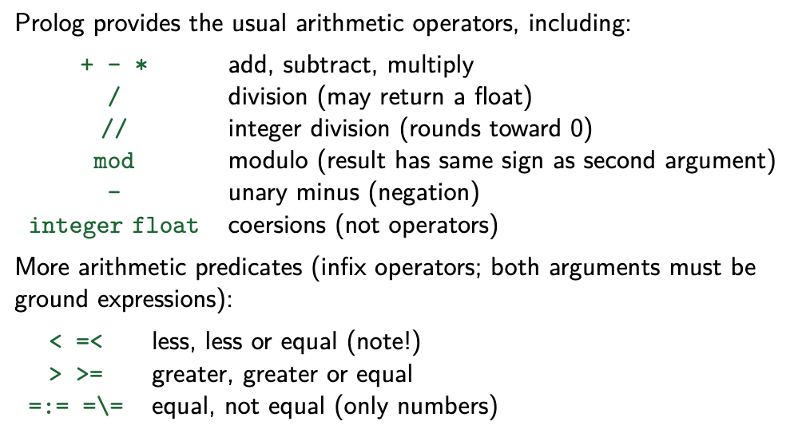

# Declarative Programming (COMP90048)

## Week 1

#### Imperative languages are based on commands, in the form of instructions and statements.
- Commands are executed.
- Commands have an effect, such as to update the computation state,and later code may depend on this update.
#### Logic programming languages are based on finding values that satisfy a set of constraints.
- Constraints may have multiple solutions or none at all.
- Constraints do not have an effect.
#### Functional languages are based on evaluating expressions.
- Expressions are evaluated.
- Expressions do not have an effect.

## Prolog
Prolog is a declarative programming language. It is based on logic programming and uses the predicate calculus.

```prolog
% import the test.pl file
% (A small part of) the British Royal family
% parent(queen_elizabeth, prince_charles).
% parent(prince_philip, prince_charles).
% parent(prince_charles, prince_william).
% parent(prince_charles, prince_harry).
% parent(princess_diana, prince_william).
% parent(princess_diana, prince_harry).
?- [test].
%queries
?- parent(prince_charles, prince_william).
% true
% This query asks: of whom Prince Charles is a parent?
?- parent(prince_charles, X)
```

- If there is more than one answer to the query, Prolog prints them one at a time, pausing to see if more solutions are wanted. Typing semicolon asks for more solutions; just hitting enter (return) finishes without more solutions.

### Rules
**Rules need to be written in the file .pl**
```prolog
% “X is grandparent of Z if X is parent of Y and Y is parent of Z .”
grandparent(X,Z) :- parent(X, Y), parent(Y, Z).
```
- Rules can be recursive. Prolog has no looping constructs, so recursion is widely used.
```prolog
% A person’s ancestors are their parents and the ancestors of their parents.
ancestor(Anc, Desc) :-parent(Parent, Desc),ancestor(Anc, Parent).
```

### Equality
- Equality in Prolog, written “=” and used as an infix operator, can be used both to bind variables and to check for equality. Prolog is a single-assignment language: once bound, a variable cannot be reassigned.

### Disjunction and Conjunction
- Goals can be combined with disjunction (or) as well as conjunction (and). Disjunction is written “;” and used as an infix operator. Conjunction (“,”) has higher precedence (binds tighter) than disjunction, but parentheses can be used to achieve the desired precedence.

### Negation
- Negation in Prolog is written “\+” and used as a prefix operator. Negation has higher (tighter) precedence than both conjunction and disjunction. Be sure to leave a space between the \+ and an open parenthesis.
```prolog
% Who are the parents of Prince William other than Prince Charles?
?- parent(X, prince_william), \+ X = prince_charles.
X = princess_diana.
```
- Disequality in Prolog is written as an infix “\=”. So X \= Y is the same as \+ X = Y.

### Closed World Assumption
- Prolog assumes that all terms are true, unless explicitly stated otherwise. This is called the closed world assumption (CWA). **This means that if a term is not mentioned in the program, it is assumed to be false**. This can be a problem if the program is used to reason about real-world situations, where some terms may be unknown or undecidable.

:::info
1. Variables must start with an uppercase letter (A-Z) or _.
2. Atoms (constants) must start with a lowercase letter (a-z) or be enclosed in single quotes ('...').
3. Prolog is strictly case-sensitive, so X and x are completely different!
:::

## Week 2
### Prolog Concepts
- In Prolog, all data structures are called term. A term can be atomic orcompound, or it can be a variable.
- An atom begins with a lower case letter and follows with letters, digits and underscores
- each compound term is a functor (sometimes called function symbol) followed by one or more arguments in parentheses, separated by commas.
- List: [] is the empty list, [H | T] is a list with head H and tail T.
- A variable is also a term. It denotes a single unknown term. A variable name begins with an upper case letter or underscore, followed by any number of letters, digits, and underscores.
- Prolog is a single-assignment language: a variable can only be bound (assigned) once.
- A term is a ground term if it contains no variables, and it is a nonground term if it contains at least one variable.
- A substitution is a mapping from variables to terms.Any ground Prolog term has only one instance, while a nonground Prolog terms has an infinite number of instances.

### Proper Lists
- A proper list is either empty ([]) or not ([X | Y]), in which case, the tail of the list must be a proper list. We can define a predicate to recognise these.
```prolog
proper_list([]).
proper_list([_Head|Tail]) :-
proper_list(Tail).
```

### Append
- The append operation is used to concatenate two lists. It is defined as follows:
```prolog
append([], C, C).
append([A|B], C, [A|BC]) :-
append(B, C, BC).
```

### e.g. Find the first n th elements of a list
```prolog
% Find the first n th elements of a list
take(N, List, Front) :-
length(Front,N),
append(Front, _, List).
```

### Arithmetic
- Use the built-in predicate is/2 (an infix operator) evaluates expressions.


### Logic and Resolution

#### 1. **Resolution Method (Resolution)**:
Resolution is an inference method used in automated reasoning systems (like Prolog). It works by applying facts and rules to a goal, simplifying the goal until it becomes either a tautology or a contradiction.

#### 2. **Rules and Facts**:
- **Facts** are known true statements.
- **Rules** are conditional inferences and are written in the form of `head :- body`. This means if `body` is true, then `head` is true.

#### 3. **Resolution Algorithm**:
- The core of the resolution method is to use **proof by contradiction** (driving reasoning through negation of the goal).
- It simplifies the goal by matching it with rules and facts in the program until a conclusion is reached, or no solution is found.

#### 4. **Specific Process**:
- Select a clause and attempt to match it with the goal.
- Use logical reasoning to reduce the goal until it is either true (tautology) or false (contradiction). If the goal is true, a solution has been found. If false, there is no solution.

#### Summary:
Resolution in Prolog is used to derive a goal step by step by applying rules, rather than directly "computing" the result. It is a **logic programming** approach based on inference.


## Week 3

### Debugger

- The debugger prints the current port, execution depth, and goal (with the current variable bindings) at each step.
- use `trace.` to start tracing, and `notrace.` to stop tracing. `creep` can be used to step through the program one step at a time.
- Bird box model: the debugger shows the current state of the program, and the user can selectively step through the program to examine the intermediate states.

### Infinite backtracking loop
- If a goal cannot be proven, Prolog will backtrack and try other possibilities. This can lead to an infinite loop.
- To avoid this, we can use the `once` predicate, which will try to prove the goal once, and fail if it cannot be proven。


### Tail Recursion
- Tail recursion is a special case of recursion where the recursive call is the last operation performed in the function.
- Efficiency: Tail recursion helps to avoid adding stack frames with each recursive call, thereby reducing memory consumption. Especially with deep recursion, it can prevent stack overflow errors.
- Optimization: Some Prolog implementations can optimize tail-recursive predicates by reusing the same stack frame, making the performance of tail recursion as efficient as iterative solutions.

- We make factorial tail recursive by introducing an accumulating parameter, or just an accumulator. This is an extra parameter to the predicate that holds a partially computed result.

## Week 4
### Homoiconicity
- Homoiconicity is a property of programming languages that allows the use of data structures as first-class citizens.
- In Prolog, this means that terms can be constructed and manipulated at runtime, and that the language itself can be used as a data structure.
### Auto-loading
- Many SWI Prolog “built-ins”, such as append/3, are not actually built-in, but are auto-loaded. 

:::info
### Call
square(X, Y) :- Y is X * X.
?- call(square, 5, Y).
Y = 25.
:::

e.g.
```prolog
filter(_, [], []).
filter(P, [X|Xs], Filtered) :-
    ( call(P, X) ->
        Filtered = [X|Filtered1]
    ;
        Filtered = Filtered1
    ),
    filter(P, Xs, Filtered1).
```
```bash
# 保留偶数
filter(even, [1,2,3,4,5,6], Result).
# Result 将是 [2,4,6]

# 保留大于3的数
filter(X > 3, [1,2,3,4,5,6], Result).
# Result 将是 [4,5,6]
```
### Setof
- The `setof` construct is used to generate a set of solutions to a goal. It is similar to `findall`, but it returns a set of solutions instead of a list.
Template：模板项，通常包含Goal中的变量
Goal：要求解的目标
List：收集的解的有序列表
e.g.
```bash
#  找出能被3整除的数
setof(X, X in 1..10, Y)
# Y 将是 [3, 6, 9]

# 更复杂的例子
setof(X, Y^(parent(Y, X)), Children)
# 找出每个父亲的孩子列表
```
Use existential quantification, written with infix caret (ˆ), to collect
solutions for a template regardless of the bindings of some of the variables
not in the Template.

### Bagof
- The bagof/3 predicate is just like setof/3, except that it does not sort the result or remove duplicates.

### Comparing 
- Prolog, somewhat arbitrarily, uses the ordering: **Variables < Numbers < Atoms < CompoundTerms**
- `@<, @=<, @>, and @>=`

### Sorting
- sort list according to @< ordering
- sort/2 sorts a list, removing duplicates, 
- msort/2 sorts a list, without removing duplicates, and 
- keysort/2 stably sorts list of X-Y terms, only comparing X parts

### Determining term types
```bash
?- integer(3)
true.

?- float(3.14)
true.

?- atom(hello)
true.
```
### Others
- var/1 holds for unbound variables, nonvar/1 holds for any term other
than an unbound variable, and ground/1 holds for ground terms (this
requires traversing the whole term). Using these or the predicates on the
previous slide can make your code behave differently in different modes.
```prolog
% Define a custom infix operator
:- op(Precedence, Type, OperatorName).
:- op(500, yfx, '+>').  

% Now it can be used like this
test(X) :- 3 +> 4 = X.
- write/1 is handy for printing messages
```
### Propagation and Labeling  
- Propagation: Reducing the domain of variables through constraints to improve solving efficiency.
- Labeling: Selecting specific values for variables to try to satisfy all constraints.

### CLP(FD)
- In the CLP(FD) (Constraint Logic Programming over Finite Domains) library, more advanced arithmetic constraint predicates are provided, which can be used for bidirectional reasoning (i.e., in,out and out,in modes).
| **Arithmetic Predicate** | **Limitation** | **CLP(FD) Alternative** | **Advantage** |
|--------------------------|----------------|-------------------------|---------------|
| `is/2`                   | Right side must be ground | `#=/2`  | Supports variable inference |
| `=:=/2`                  | Can only compare known values | `#=/2`  | Suitable for variables |
| `=\=/2`                  | Can only compare known values | `#\=/2` | Suitable for variables |
| `=< /2`                  | Can only compare known values | `#=</2` | Suitable for variables |

| **Operator**             | **Description**                |
|--------------------------|--------------------------------|
| `Expr1 #= Expr2`         | `Expr1` equals `Expr2`         |
| `Expr1 #\= Expr2`        | `Expr1` not equal to `Expr2`   |
| `Expr1 #> Expr2`         | `Expr1` greater than `Expr2`   |
| `Expr1 #< Expr2`         | `Expr1` less than `Expr2`      |
| `Expr1 #>= Expr2`        | `Expr1` greater than or equal to `Expr2` |
| `Expr1 #=< Expr2`        | `Expr1` less than or equal to `Expr2`    |
| `Var in Low..High`       | `Low ≤ Var ≤ High`             |
| `List ins Low..High`     | Each `Var` in `List` is between `Low..High` |

- label/1 is an enumeration predicate used to search for specific assignments of variables to satisfy all defined constraints. It traverses possible values of variables and solves them.

- Generate-and-Test requires generating candidate solutions before validation, which is less efficient.
- Constrain-and-Generate reduces the range of candidate solutions through constraints, usually more efficient.
- Through labeling, Prolog can automate the search process and provide the final solution.

## Week 5
### Haskell
- Haskell is a purely functional programming language. It is statically typed, and supports pattern matching, higher-order functions, and lazy evaluation.

### [] in Haskell
- The empty list is denoted by [], and it is a built-in data type in Haskell.
- ["a","b"] is syntactic suger for `"a" : "b" : []`.

### Functions in Haskell

:::info
Haskell 是一种纯函数式编程语言，它强调在编程中使用函数。在 Haskell 中，函数是一等公民，这意味着它们可以像其他数据类型一样被传递和操作。下面是一些关于 Haskell 函数的基本介绍：
### 函数定义
在 Haskell 中，函数通过以下语法定义：
```haskell
name :: TypeSignature
name parameter1 parameter2 ... = expression
```
- `name` 是函数的名称。
- `TypeSignature` 是函数的类型签名，它声明了函数的输入类型和输出类型。
- `parameter1`, `parameter2`, ... 是函数的参数。
- `expression` 是函数体，它定义了如何从参数计算结果。
### 示例
这是一个简单的 Haskell 函数，它将两个数字相加：
```haskell
add :: Num a => a -> a -> a
add x y = x + y
```
在这个例子中，`add` 是函数名，`Num a =>` 表示这个函数适用于任何数值类型 `a`，`a -> a -> a` 是类型签名，表示函数接受两个类型为 `a` 的参数并返回一个类型为 `a` 的结果。
### 函数调用
在 Haskell 中，函数调用不使用括号，而是通过空格分隔参数：
```haskell
result = add 3 4
```
这将返回 `7`。
### 模式匹配
Haskell 函数通常使用模式匹配来定义不同的行为，这类似于其他语言中的 switch 语句或多个 if-else 语句。例如：
```haskell
factorial :: (Integral a) => a -> a
factorial 0 = 1
factorial n = n * factorial (n - 1)
```
这里，`factorial` 函数通过模式匹配定义了两种情况：当输入为 `0` 时返回 `1`，否则递归地计算 `n * (n - 1)!`。
### 递归
由于 Haskell 没有 while 或 for 循环，递归是执行重复任务的主要方式。上面的 `factorial` 函数就是一个递归的例子。
### 高阶函数
Haskell 支持高阶函数，即可以接受其他函数作为参数或返回函数作为结果的函数。例如：
```haskell
applyTwice :: (a -> a) -> a -> a
applyTwice f x = f (f x)
```
这个 `applyTwice` 函数接受一个函数 `f` 和一个参数 `x`，然后两次应用 `f` 到 `x` 上。
### 惰性计算
Haskell 使用惰性计算模型，这意味着表达式只在需要时计算。这允许 Haskell 程序以非常高效的方式处理无限数据结构和其他高级抽象。
这些是 Haskell 函数的一些基本概念。Haskell 的强大之处在于它的类型系统和函数式编程范式，这使得编写简洁、可重用和高效的代码成为可能。

:::


### Referential transparency
- A function is referentially transparent if it always returns the same result when given the same arguments.


### Useful Haskell Built in Functions
- length computes the number of elements in a list
- null returns True if a list is empty, and False otherwise
- the !! operator gets the nth element of a list, as in [1,2,3,4] !! 2, which gives us 3 (note zero-based list indexing).
- the ++ operator joins two lists together, as in [1,2] ++ [3,4], which gives us [1,2,3,4]
- head and tail separate a list into its first and remaining elements
- last and init do just the opposite
- take n and drop n split the list at an arbitrary point

### Common List Functions
head, tail, last, init, take and drop sum  maximum elem !! ++ splitAt

### Basic Types
- Int: Integer, 32-bit signed integer
- Integer: Integer, arbitrary-precision integer
- Float: Floating-point number
- Char: Character
- String: List of characters
- Bool: Boolean
- Tuple: Fixed-size collection of values
- List: Variable-size collection of values


## Week 6
### Binary Tree
### Search Tree
### Expression Tree

## Week 7

### Common Functions in Data.List
| 函数       | 类型签名                        | 作用说明               | 示例代码                  | 输出结果                  |
| -------- | --------------------------- | ------------------ | --------------------- | --------------------- |
| `map`    | `(a -> b) -> [a] -> [b]`    | 对列表每个元素应用一个函数      | `map (*2) [1,2,3]`    | `[2,4,6]`             |
| `sort`   | `Ord a => [a] -> [a]`       | 升序排序               | `sort [3,1,2]`        | `[1,2,3]`             |
| `filter` | `(a -> Bool) -> [a] -> [a]` | 保留满足条件的元素          | `filter even [1..6]`  | `[2,4,6]`             |
| `group`  | `Eq a => [a] -> [[a]]`      | 把相邻相等的元素分组         | `group [1,1,2,3,3,3]` | `[[1,1],[2],[3,3,3]]` |
| `nub`    | `Eq a => [a] -> [a]`        | 去除重复元素（保留第一个出现的）   | `nub [1,2,2,3,1]`     | `[1,2,3]`             |
| `delete` | `Eq a => a -> [a] -> [a]`   | 删除列表中第一个匹配的元素      | `delete 2 [1,2,3,2]`  | `[1,3,2]`             |
| `(\\)`   | `Eq a => [a] -> [a] -> [a]` | 列表差：从左边列表中删去右边所有元素 | `[1,2,2,3] \\ [2,3]`  | `[1,2]`               |


### List Comprehension
#### Home-made map
```haskell
myMap :: (a -> b) -> [a] -> [b]
myMap f xs = [f x | x <- xs]
```

#### Home-made filter
```haskell
myFilter :: (a -> Bool) -> [a] -> [a]
myFilter p xs = [x | x <- xs, p x]
```

#### Loop Conversion
```text
function matches xs ys: 
    set l to [] 
    for x in xs: 
        for y in ys: 
            if x == y: 
                append x to l 
    return (length l)
```

这段逻辑的作用是：
**统计在两个列表 `xs` 和 `ys` 中相等的元素对的数量（包括重复）**。

---

#### ✅ Haskell 版本的写法：

```haskell
matches :: Eq a => [a] -> [a] -> Int
matches xs ys = length [x | x <- xs, y <- ys, x == y]
```

---

#### 🔍 分解解释：

* `[x | x <- xs, y <- ys, x == y]`
  这是一种列表推导，生成一个新列表，包含所有 `x`，满足：

  * `x` 来自 `xs`
  * `y` 来自 `ys`
  * 只有当 `x == y` 时才留下

* 然后用 `length` 来统计这样的匹配有多少个。
