# Introduction to Machine Learning (COMP90049)

## Week 1

- Machine learning is a method of teaching software to learn from data and make decisions on their own, without being explicitly programmed.

### Three ingredients for machine learning
1. Data
- Discrete vs continuous vs ...
- Big data vs small data
- Labeled data vs unlabeled data
- Public vs sensitive data

2. Models
- function mapping from inputs to outputs
- probabilistic machine learning models
- geometric machine learning models
- parameters of the function are unknown

3. Learning
- Improving (on a task) after data is taken into account
- Finding the best model parameters (for a given task)
- Supervised vs. unsupervised learning

:::info
Supervised Learning:监督学习使用带有标签的数据进行训练，模型学习输入（features）到输出（labels）之间的映射关系。
Unsupervised Learning:无监督学习使用没有标签的数据，模型通过分析数据的模式和结构来进行学习。
:::

### Linear Algebra Review
#### Matrices
- Matrices addition/subtraction: Add(Subtract) correspond ingentries in A and B 
- Matrix multiplication: Multiply corresponding entries in A and B and sum the products
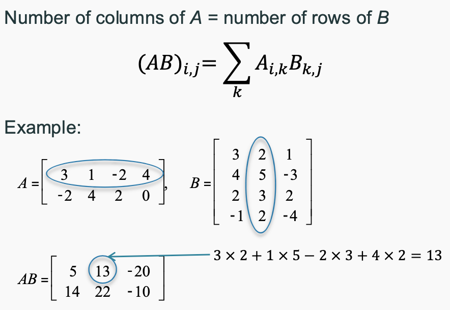
- Matrix transpose: Transpose of a matrix is obtained by interchanging its rows and columns. Matrix is **symmetric** if it is equal to its transpose.
- Matrix inverse: The inverse of a matrix A is denoted by A^-1 and is obtained by multiplying A by its inverse. 
- A matrix cannot be inverted if: More rows than columns, More columns than rows,Redundant rows/columns (linear independence)
#### Vectors
- A vector is a matrix with several rows and **one** column
- Vector addition/subtraction: Add(Subtract) corresponding entries in A and B
- Vector inner product: Multiply corresponding entries in A and B and sum the products
- Vector Euclidean norm: The square root of the sum of the squares of the entries in the vector.
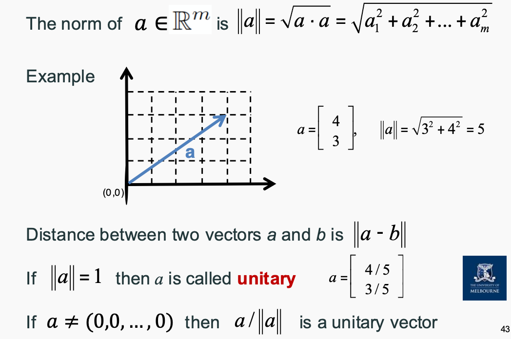
- Vector inner product: The dot product of two vectors A and B is the sum of the products of their corresponding entries.
- The cosine of the angle between two vectors can be found by using norms and the inner product

### Instances, Attributes, and Learning Paradigms (Supervised vs. Unsupervised Learning)
- In ML terminology examples are called Instances
- Each instance can have some Features or Attributes
- Concepts are things that we aim to learn. Generally, in the form of labels or classes

#### Unsupervised do not have access to an inventory of classes and instead discover groups of ‘similar’ examples in a given dataset.
- Clustering is unsupervised — the learner operates without a set of labelled training data
- **Success is often measured subjectively; evaluation is problematic**

#### Supervised methods have prior knowledge of classes and set out to discover and categorise new instances according to those classes
- Classification learning is supervised
- In Classification, we can exhaustively list/enumerate all possible labels for a given instance; a correct prediction
entails mapping an instance to the label which is truly correct
- Regression learning is supervised 
- In Regression,"infinitely" many labels are possible, we cannot conceivably enumerate them; a “correct” prediction is when the numeric value is acceptably close to the true value

### Featured Data Types
1. Discrete: Nominal (Categorical)
- Values are distinct symbols, values themselves serve only as labels or names
- No relation is implied among nominal values (no ordering or distance measure)
- Only equality tests can be performed
- e.g. Student Number
2. Ordinal
- An explicit order is imposed on the values
- Addition and subtraction does not make sense
- e.g. Educational Level
3. Continuous: Numeric
- Numeric quantities are real-valued attributes
- All mathematical operations are allowed 

## Equal Width vs. Equal Frequency vs. Clustering

| Method                  | Equal Width Binning          | Equal Frequency Binning       | Clustering                   |
|-------------------------|----------------------------|------------------------------|------------------------------|
| **Definition**          | Each bin has the same width | Each bin contains the same number of data points | Groups data points based on similarity |
| **Type**               | Data discretization        | Data discretization         | Unsupervised learning       |
| **Advantages**         | Easy to compute, simple     | Suitable for skewed distributions | Can detect natural groupings in data |
| **Disadvantages**       | Sparse or dense bins if data density varies | Uneven bin width, harder to interpret | May require tuning (e.g., number of clusters) |
| **Common Algorithms**   | Fixed width intervals      | Quantiles-based binning     | K-Means, DBSCAN, Hierarchical Clustering |
| **Use Cases**          | Histogram creation, feature engineering | Handling skewed data in ML models | Customer segmentation, anomaly detection |

:::info
Equal Width Binning：用于简单离散化，每个 bin 宽度相同，但可能会导致数据密度不均衡。
Equal Frequency Binning：每个 bin 的数据量相等，适合处理偏态数据，但 bin 的宽度不一致，可能难以解释。
Clustering（聚类）：用于无监督学习，根据数据点的相似性自动分组，适合发现隐藏模式，但通常需要调整参数（如 k 值）。
:::

## Standardization vs. Normalization

| **Method**              | **Standardization (Z-score)**            | **Min-Max Normalization**         |
|-------------------------|-----------------------------------------|----------------------------------|
| **Formula**            | \( X' = \frac{X - \mu}{\sigma} \)       | \( X' = \frac{X - X_{\min}}{X_{\max} - X_{\min}} \) |
| **Range**              | Mean = 0, Std = 1                        | [0,1] or [-1,1]                 |
| **Best for**           | Normally distributed data                | Data with fixed bounds          |
| **Sensitive to outliers?** | Less sensitive                          | More sensitive                   |
| **Formula** | (X - mean) / std | (X - min) / (max - min) |
:::info
Standardization：将数据标准化到均值为 0，标准差为 1 的分布，适用于正态分布的 数据。
Normalization：将数据缩放到 [0,1] 或 [-1,1] 范围内，适用于数据范围固定的数据。
:::

## Week 2
### K-Nearest Neighbors (KNN)
- supervied learning algorithm
#### KNN Classification
- Return the most common class label among neighbors
- Example: cat vs dog images; text classification; ...
#### KNN Regression
- Return the average value of among K nearest neighbors
- Example: housing price prediction;

#### To measure categorical distance, we can use:
- Hamming distance: number of positions where the two strings differ
- Jaccard Similarity: intersection over union of two sets

#### To measure numerical distance, we can use:
- Manhattan distance: sum of absolute differences between corresponding components
- Euclidean distance: square root of the sum of the squares of the differences between corresponding components
- Cosine distance: 1 minus the cosine of the angle between two vectors

#### To measure oridinal distance, we can use:
- Normalized Ranks: rank each value and normalize them to [0, 1]

#### Majority Vote

#### Inverse Distance
- Give more weight to the nearer neighbors rather than quantity.
- The bigger the weight, the more important the neighbor is.
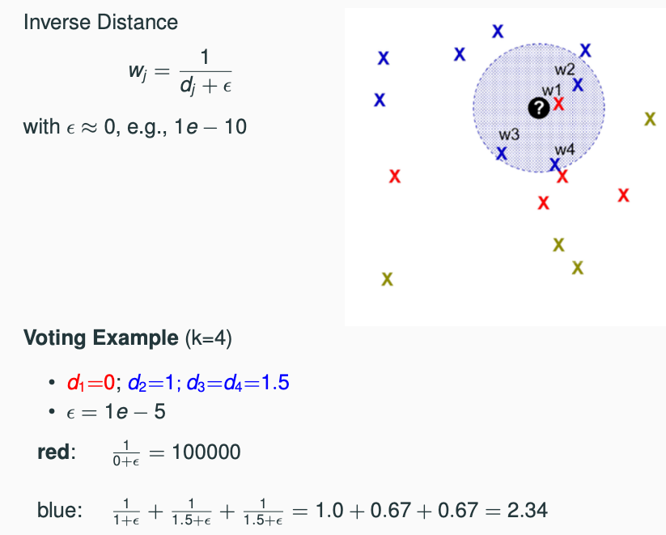

#### Inverse Linear Distance
- Give more weight to the nearer neighbors, but with a decreasing slope.
- The bigger the weight, the more important the neighbor is.

| 方法名称                    | 是否考虑距离 | 权重形式             | 特点                |
| ----------------------- | ------ | ---------------- | ----------------- |
| Majority Vote           | ❌ 不考虑  | 所有邻居权重相等         | 简单、容易实现，容易受异常值影响 |
| Inverse Distance        | ✅ 强调距离 | 权重 = 1 / 距离      | 近邻影响大，远邻影响小，权重下降快 |
| Inverse Linear Distance | ✅ 强调距离 | 权重 = 1 - d/D（D是最大距离，d是当前距离） | 更平滑下降，抗异常能力更强 |


#### Value of K
| **K Value** | **Bias**               | **Variance**            | **Overfitting**  | **Underfitting**  | **Best For**                                 |
|-------------|------------------------|-------------------------|------------------|-------------------|---------------------------------------------|
| **Small K** (e.g., K=1, K=3) | **Low Bias**: The model can closely follow the data. | **High Variance**: Sensitive to noise and outliers. | Likely to overfit due to high sensitivity to small fluctuations in the training data. | Unlikely to underfit unless the data is too noisy or simple. | - Complex data with clear patterns<br> - When the dataset is relatively small. |
| **Large K** (e.g., K=10, K=20) | **High Bias**: The model becomes less sensitive to variations in the data. | **Low Variance**: Smoothing out the noise by considering more neighbors. | Less likely to overfit as it smooths out fluctuations. | Might underfit if the data has complex relationships or non-linear patterns. | - Noisy data<br> - When a generalization is more important than capturing every detail. |
| **Medium K** (e.g., K=5, K=7) | A balanced approach with moderate bias. | Balanced variance, aiming for generalization. | Minimizes both overfitting and underfitting. | Good compromise between bias and variance. | - Standard choice for most datasets, balancing generalization and accuracy. |

#### Why KNN
- Pros
- Intuitive and simple
- No assumptions
- Supports classification and regression
- No training: new data →evolve and adapt immediately
- Cons
- How to decide on best distance functions?
- How to combine multiple neighbors?
- How to select K ?
- Expensive with large (or growing) data sets

#### Lazy Learning vs. Eager Learning

| Criteria               | Lazy Learning (e.g., KNN)                     | Eager Learning                             |
|------------------------|-----------------------------------------------|--------------------------------------------|
| **Definition**          | Delays learning until a query is made          | Learns from the training data immediately  |
| **Training Phase**      | Fast (no model building)                      | Slow (model is built during training)       |
| **Prediction Phase**    | Slow (requires processing the entire dataset)  | Fast (uses the pre-built model)            |
| **Memory Requirement**  | High (stores the entire training dataset)       | Lower (only stores the model)              |
| **Flexibility**          | High (can adapt to new data easily)            | Low (requires retraining for new data)     |
| **Example**             | K-Nearest Neighbors (KNN)                      | Decision Trees, Neural Networks            |


### Probility
- P(A=a): the probability that random variable A takes value a
- 0 <= P(A=a) <= 1
- P(True) = 1
- P(False) = 0

#### Joint Probability
- P(A, B): joint probability of two events A and B
- the probability of both A and B occurring = P(A ∩ B)

#### Conditional Probability
- P(A|B): the probability of A occurring given that B has occurred
- P(A|B) = P(A ∩ B) / P(B)

#### Independent Probability
- Two events A and B are independent if P(A|B) = P(A)
- P(A, B) = P(A) * P(B)

:::info
#### Disjoint
- P(A∩B)=0

#### Product Rule
- P(A, B) = P(A|B) * P(B) = P(B|A) * P(A)

#### Chain Rule
- P(A,B,C)=P(A)⋅P(B∣A)⋅P(C∣A,B)
:::

#### Bayes' Rule
- P(A|B) = ( P(B|A) * P(A) ) / P(B)
- Bayes’ Rule allows us to compute P(A|B) given knowledge of the ‘inverse’ probability P(B|A).


#### Marginalization
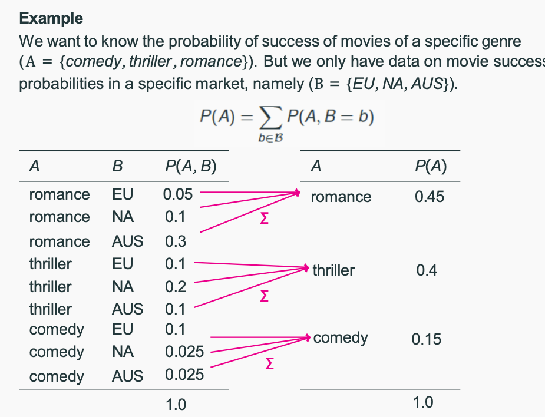

#### Probability Distributions
- Probability distributions can be discrete or continuous. 
- Discrete Random Variable: Takes on a countable number of distinct values (e.g., number of heads in coin flips). 
- Continuous Random Variable: Takes on an infinite number of possible values (e.g., height of students).

| **Distribution** | **Type** | **Range** | **Parameters** | **Formula** | **Example** | **Use Cases** |
|-----------------|----------|-----------|---------------|-------------|-------------|---------------|
| **Normal** | Continuous | −∞ to +∞ | Mean μ, Variance σ² | <code>P(x) = (1 / √(2πσ²)) * exp(-((x - μ)² / (2σ²)))</code> | Human height, exam scores | Linear regression, Gaussian models |
| **Bernoulli** | Discrete | 0, 1 | Probability p | <code>P(X = k) = p^k (1 - p)^(1 - k)</code> | Coin flip | Binary classification |
| **Binomial** | Discrete | 0 to n | Number of trials n, Success probability p | <code>P(k) = C(n, k) * p^k * (1 - p)^(n - k)</code> | Number of heads in 10 coin flips | Binary classification, hypothesis testing |
| **Multinomial** | Discrete | 0 to n for each category | Number of trials n, Probabilities p₁, ..., pₖ | <code>P(x₁, ..., xₖ) = (n! / (x₁!x₂!...xₖ!)) * ∏(pᵢ^xᵢ)</code> | Rolling a dice multiple times | Text classification, NLP |
| **Categorical** | Discrete | 1 to k | Probabilities p₁, ..., pₖ | <code>P(X = i) = pᵢ</code> | Choosing a color from a set of options | Classification, clustering |

## Week 3

### Zero-R
- A simple baseline model that predicts the most frequent class in the training data.

### One-R
- Also known as Decision stom
- Uses only one feature (“best” feature) to build a model

### Desicion Trees
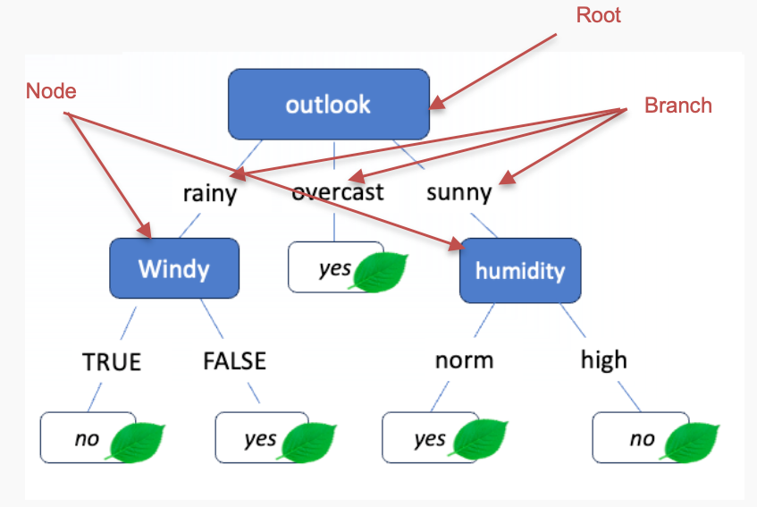
- Choose an attribute to partition the data at the node such that each partition is as pure (homogeneous) as possible.
- In each partition, most of the instances should belong to as few classes as possible
- Each partition should be as large as possible.

### ID3 (Iterative Dichotomiser 3)
- A top-down approach that splits the data into smaller subsets based on the value of a chosen feature.

#### Entropy (measure of uncertainty. The expected (average) level of uncertainty (surprise))
- For a Low probability event: if it happens, it’s big news! Big surprise! **High information!**
- For a High probability event: it was likely to happen anyway. Not very surprising. **Low information!**
- Higher H means more uncertain. 
- Low entropy means high certainty
- High entropy means high uncertainty
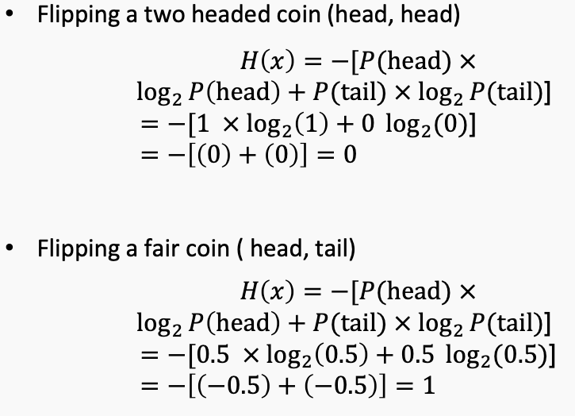
#### Conditional Entropy measures the amount of uncertainty in X given Y.

#### Information Gain (measure of the reduction in entropy after splitting)
- Information gain measures the reduction in entropy about the target variable achieved by partitioning the data based on a given feature.
- Choose the largest as information gain to split the tree.

#### Shortcomings of IG
- Overfitting: Greedy algorithm may choose a feature that is too specific and does not generalize well to unseen data.
- C4.5: use gain ratio to choose the best feature to split the tree.
   - Gain ratio (GR) reduces the bias for information gain towards highly branching attributes by normalising relative to the split information
   - Split info (SI) is the entropy of a given split (evenness of the distribution of instances to attribute values)
   - GR = IG / SI
   - Choose the largest as GR to split the tree.
   - 如果下面的attribute的选项是pure的，就不选择这个选项作为继续的分支，然后在剩余的attribute里选择GR最大的attribute作为继续的分支。如果下面的attribute全是pure的，就到达了叶子节点。

:::info
计算 **信息增益（Information Gain, IG）**、**增益率（Gain Ratio, GR）** 和 **分裂信息（Split Information, SI）**，我们需要以训练集中的“PLAY”列为目标变量（label）来进行分类评估。

下面是逐步讲解和计算方法：

---

## ✅ 1. 基础准备

训练数据（6个实例）：

| ID | Outlook | Temp | Humidity | Wind | PLAY |
| -- | ------- | ---- | -------- | ---- | ---- |
| A  | s       | h    | h        | F    | N    |
| B  | s       | h    | h        | T    | N    |
| C  | o       | h    | h        | F    | Y    |
| D  | r       | m    | h        | F    | Y    |
| E  | r       | c    | n        | F    | Y    |
| F  | r       | c    | n        | T    | N    |

* 正类（PLAY=Y）：C、D、E（3个）
* 负类（PLAY=N）：A、B、F（3个）

---

## ✅ 2. 计算总熵 Entropy(S)

$$
Entropy(S) = -p_+\log_2(p_+) - p_-\log_2(p_-)
$$

$$
p_+ = 3/6 = 0.5,\quad p_- = 0.5
$$

$$
Entropy(S) = -0.5\log_2(0.5) - 0.5\log_2(0.5) = 1
$$

---

## ✅ 3. 对每个属性计算信息增益（以 Outlook 为例）

### Outlook 的取值有：`s`, `o`, `r`

* **s（A, B）**：PLAY = N, N → Entropy = 0
* **o（C）**：PLAY = Y → Entropy = 0
* **r（D, E, F）**：PLAY = Y, Y, N →

  $$
  p_+ = 2/3, p_- = 1/3  
  \Rightarrow Entropy = -\frac{2}{3}\log_2\frac{2}{3} - \frac{1}{3}\log_2\frac{1}{3} ≈ 0.918
  $$

加权总熵：

$$
Entropy_{Outlook} = \frac{2}{6} \cdot 0 + \frac{1}{6} \cdot 0 + \frac{3}{6} \cdot 0.918 ≈ 0.459
$$

**信息增益**：

$$
IG(Outlook) = Entropy(S) - Entropy_{Outlook} = 1 - 0.459 = 0.541
$$

---

## ✅ 4. Split Information（SI）

$$
SI(Outlook) = -\sum_i \frac{|S_i|}{|S|} \log_2 \frac{|S_i|}{|S|}
$$

* s: 2/6 → log₂(2/6)
* o: 1/6 → log₂(1/6)
* r: 3/6 → log₂(3/6)

$$
SI = -(\frac{2}{6} \log_2 \frac{2}{6} + \frac{1}{6} \log_2 \frac{1}{6} + \frac{3}{6} \log_2 \frac{3}{6})  
\approx -(0.389 + 0.431 + 0.5) = 1.32
$$

---

## ✅ 5. Gain Ratio（GR）

$$
GR = \frac{IG}{SI} = \frac{0.541}{1.32} ≈ 0.41
$$

---

## ✅ 类似方法可以应用于其他特征：

* 按照属性值分组，计算每组的熵和加权熵
* 再算信息增益（IG）
* 再算分裂信息（SI）
* 最后算增益率（GR）

:::

### Naive Bayes Theory
:::info
arg max: argument of maximum value
:::

- Supervied ML method

#### Example:
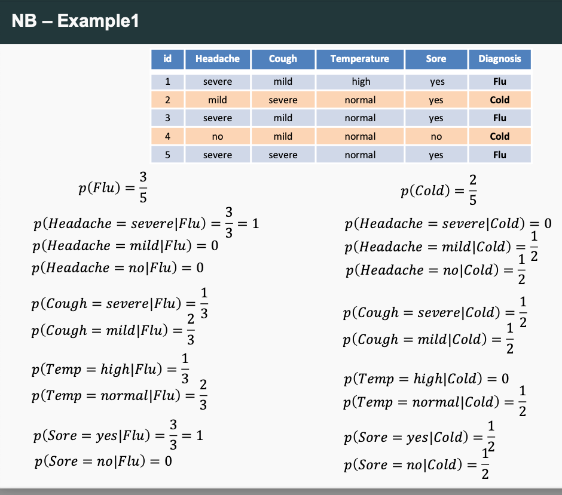
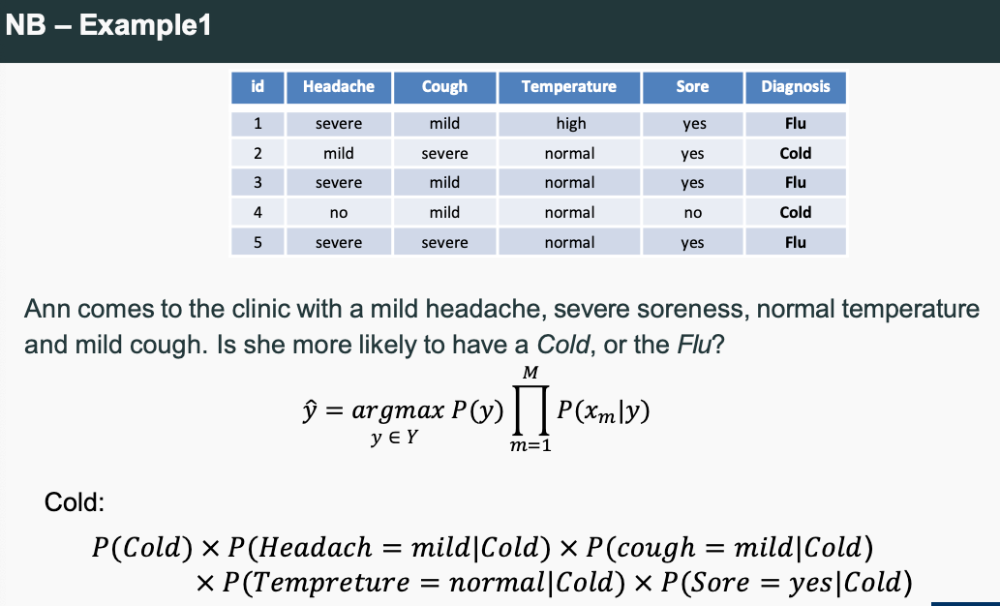

- If any term P(xm|y ) = 0 then the class probability P(y|x ) = 0
- To solve this: use Laplace smoothing.

1. First Solution: We can assign a (small) positive probability 𝜀 to every unseen class-feature combination
2. Second Solution: We can add a “pseudocount” α to each feature count observed during training, often is 1.

- Probabilities are changed drastically when there are few instances; with a large number of instances, the changes are small
-  Laplace smoothing (and smoothing in general) **reduces variance** of the NB classifier because it reduces sensitivity to individual (non-)observations in the training data

### Different Naive Bayes

Naïve Bayes classifiers have several key variants that differ based on how they model the distribution of features. Below is a comparison of the most common types:

| Variant        | Assumption on Feature Distribution | Use Case |
|--------------|----------------------------------|---------|
| **Gaussian Naïve Bayes (GNB)** | Assumes features follow a Gaussian (normal) distribution. | Suitable for continuous data, often used in text classification and real-world datasets with normally distributed features. |
| **Multinomial Naïve Bayes (MNB)** | Assumes feature counts follow a multinomial distribution. | Best for text classification (e.g., spam detection, document classification) where features are word counts or term frequencies. |
| **Bernoulli Naïve Bayes (BNB)** | Assumes binary feature presence (1 = present, 0 = absent). | Used in binary text classification (e.g., sentiment analysis, spam filtering), where features represent whether a word appears in a document. |
| **Complement Naïve Bayes (CNB)** | A modification of Multinomial Naïve Bayes, designed to handle class imbalances. | Works better for imbalanced datasets and improves accuracy by adjusting feature probabilities. |
| **Categorical Naïve Bayes** | Assumes features are discrete categorical variables. | Used for classification tasks with categorical inputs that are not necessarily text-based. |

Each variant modifies the way probabilities are calculated based on the data's nature, making Naïve Bayes a flexible and effective algorithm for different types of classification tasks.


### Conclusion of Naive Bayes
1. Why does it work given that it’s a blatantly wrong model of the data?
- we don’t need the true distribution over P(y|x ), we just need to be able to identify the most likely outcome

2. Advantages of Naive Bayes
- easy to build and estimate
- easy to scale to many feature dimensions (e.g., words in the vocabulary) and data sizes
- reasonably easy to explain why a specific class was predicted
- good starting point for a classification project

:::info
### How NB Works
- Calculate Prior Probabilities: Compute the probability of each class based on the training data.
- Compute Likelihood: Estimate the probability of features given each class using the conditional probability formula.
- Apply Bayes’ Theorem: Use Bayes' rule to compute the posterior probability for each class.
- Classify: Assign the class with the highest posterior probability to the new instance.
:::

## Week 4

### Linear Regression
- A supervised learning algorithm that models the relationship between a scalar dependent variable (y) and one or more explanatory variables (X1, X2,..., Xn).
- The model assumes that the relationship between the dependent and independent variables is linear.
- The goal is to find the best line that fits the data.

#### Loss Function
- The loss function measures the error between the predicted values and the actual values.
- The loss function is used to optimize the model parameters (i.e., the weights and biases) to minimize the loss.

:::info
- When using a regression model for prediction, it is important to only predict within the relevant range of data
- We should not try to extrapolate beyond the range of observed X’s
- Make sure independent variables are NOT highly correlated with each other, otherwise the model becomes unstable
:::

### Optimization
- Find parameter values 𝜽 that maximize (or minimize) the value of a function f(𝜽)

### Iterative Optimization
#### Closed-form solutions
- Previously, we computed the closed form solution for the MLE of the binomial distribution
- We follow our recipe, and arrive at a single solution
#### Unfortunately, life is not always as easy
- Often, no closed-form solution exists
- Instead, we have to iteratively improve our estimate of θˆ until we arrive at a satisfactory solution
- Gradient descent is one popular iterative optimization method

### Gradient Descent
- Descending a mountain (aka. our function) as fast as possible: atevery position take the next step that takes you most directly into the valley

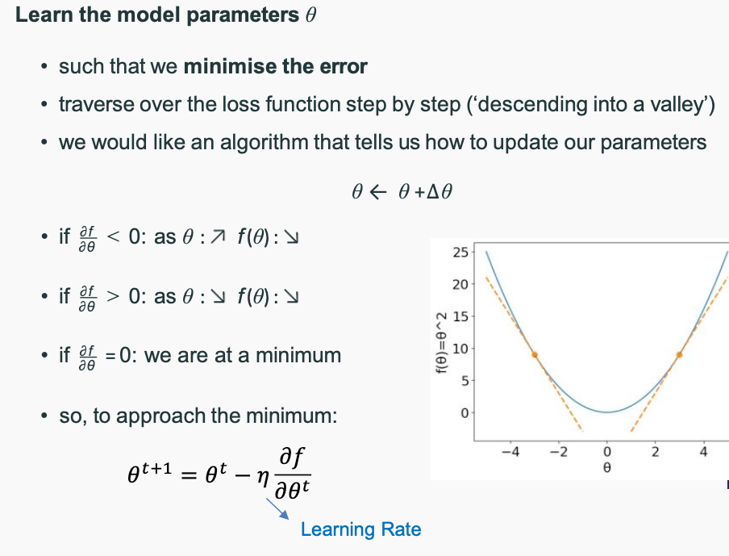
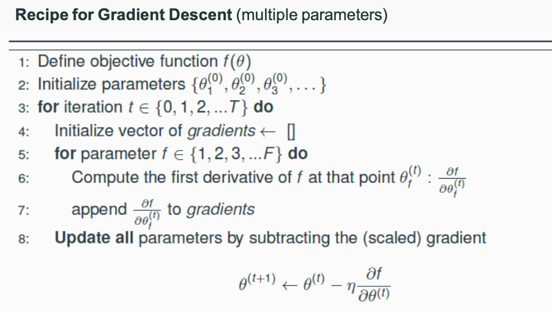

:::info
1. with an appropriate learning rate, GD will find the global minimum for differentiable convex functions (bowl shape)
2. with an appropriate learning rate, GD will find a local minimum for differentiable non-convex functions
:::

### Logistic Regression
| **Comparison**       | **Naïve Bayes**                         | **Logistic Regression**                  |
|----------------------|--------------------------------------|----------------------------------------|
| **Model Type**       | Generative Model                    | Discriminative Model                  |
| **Probability Learned** | \( P(x, y) \) (Joint Probability) | \( P(y | x) \) (Conditional Probability) |
| **Assumptions**      | Assumes feature independence        | No specific feature independence assumption |
| **Computational Complexity** | Low, fast computation          | Higher, requires gradient descent     |
| **Use Cases**        | Text classification (e.g., spam detection) | Tasks requiring feature relationship modeling |
| **Suitable for Large Datasets?** | Yes, simple computation   | Yes, but computationally more intensive |

:::info
## Understanding Odds and Log Odds in Logistic Regression

## 1. What are Odds?

Odds represent the ratio of the probability of an event occurring to the probability of it not occurring. Mathematically, odds are defined as:

\[
\text{odds} = \frac{P}{1 - P}
\]

where:
- \( P \) is the probability of the event occurring.
- \( 1 - P \) is the probability of the event not occurring.

### **Types of Odds**
- **Odds against an event**: When \( 0 < \text{odds} < 1 \), meaning the event is less likely to happen than not.
- **Odds in favor of an event**: When \( \text{odds} > 1 \), meaning the event is more likely to happen than not.

**Example:**
- If an event has a **60% chance** of occurring (\( P = 0.6 \)), the odds are:
  \[
  \text{odds} = \frac{0.6}{1 - 0.6} = \frac{0.6}{0.4} = 1.5
  \]
  This means the event is **1.5 times more likely** to occur than not.

## 2. Why Use Log Odds (Logit Function)?

Since odds can range from **0 to infinity**, they are not ideal for direct modeling in a regression setting. Instead, we take the **logarithm of odds**, known as the **logit function**:

\[
\text{log odds} = \log \left(\frac{P}{1 - P}\right)
\]

### **Advantages of Log Odds:**
1. **Transforms probability into an unrestricted range**  
   - \( P \) is always between \( 0 \) and \( 1 \), but log odds can take any value from **\(-\infty\) to \(+\infty\)**.
   - This makes it easier to model using linear regression techniques.

2. **Handles Non-Linearity in Probability**  
   - The relationship between probability and log odds is **non-linear**, but when transformed to log odds, it becomes **linear**.

**Example Calculation:**
- If the event has a probability of \( P = 0.8 \):
  \[
  \text{odds} = \frac{0.8}{1 - 0.8} = \frac{0.8}{0.2} = 4
  \]
  - Taking the natural logarithm:
    \[
    \log(4) \approx 1.386
    \]
  - Now, instead of dealing with probabilities, we can work with a linear scale.

## 3. Connection to Logistic Regression

In **logistic regression**, we model the probability of an event occurring using the equation:

\[
\log \left(\frac{P}{1 - P}\right) = \theta_0 + \theta_1 x_1 + \theta_2 x_2 + ... + \theta_n x_n
\]

This means:
- Instead of predicting probabilities directly, logistic regression predicts **log odds**, which follow a linear relationship with input features.
- We then use the **sigmoid function** to convert log odds back into probabilities.

## 4. Conclusion

- **Odds** measure how likely an event is compared to it not happening.
- **Log odds (logit function)** transform probabilities into a linear form, making them easier to model.
- Logistic regression leverages log odds to predict probabilities effectively.

Understanding this transformation is key to interpreting logistic regression results and making informed predictions.

:::

- Logit function: The logarithm of the odds.
### Softmax function: The function that converts a vector of real numbers to a probability distribution.

### Logistic Regression Summary
1.  Pros
- Probabilistic interpretation
- No restrictive assumptions on features
- Often outperforms Naive Bayes
- Particularly suited to frequency-based features (so, popular in NLP)
2. Cons
- Can only learn linear feature-data relationships
- Some feature scaling issues
- Often needs a lot of data to work well
- Regularisation a nuisance, but important since overfitting can be a big problem

## Week 5
### Support Vector Machines (SVM) 
#### Classifier
- A linear classifier (through origin) with parameters divides the space into positive and negative halves

### Hard Margin
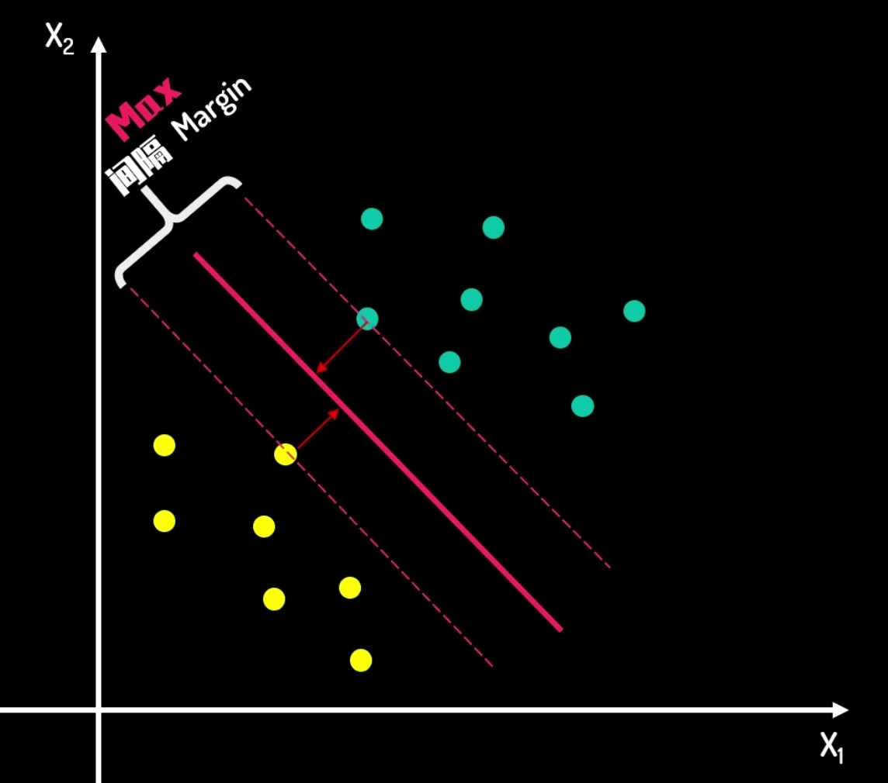
- The margin is the distance between the decision boundary and the closest data point.
- The goal is to maximize the margin while keeping the data points as far away from the decision boundary as possible.
- The decision boundary is the line that separates the positive and negative data points.
- It is called hard margin because the data points must be correctly classified on both sides of the decision boundary.

#### Soft Margin
- The margin is softened by introducing a penalty term that depends on the distance of the data points from the decision boundary.
- The goal is to minimize the margin while keeping the data points as far away from the decision boundary as possible.
- The decision boundary is the line that separates the positive and negative data points.
- It is called soft margin because the data points can be misclassified on both sides of the decision boundary.


:::info
### Kernel Trick
- The kernel trick is a way to transform non-linear data into a higher-dimensional space where it becomes linearly separable.
- The kernel function is a similarity function that measures the similarity between two data points in the original space.
- The kernel trick allows us to use non-linear models in a linear model.
:::

### Applications of SVM
#### Multiclass problems
1. **Introduce parameter vectors**: If there are \( k \) categories, we introduce a parameter vector \( \theta_1, \theta_2, \ldots, \theta_k \) for each category.
2. **Jointly learn parameters**: Jointly learn these parameters by ensuring that the discriminant function associated with the correct category has the highest value. The goal is to minimize the following expression:
   \[
   \frac{1}{2} \sum_{y=1}^{k} \| \theta_y \|^2
   \]
   The constraint is that for all \( y' \neq y_i \) and \( i = 1, \ldots, n \), it satisfies:
   \[
   (\theta_{y_i} \cdot x_i) \geq (\theta_{y'} \cdot x_i) + 1
   \]
3. **Predict new examples**: Predict the label of a new example based on the following formula:
   \[
   \hat{y} = \arg\max_{y=1,\ldots,k} (\theta^*_y \cdot x)
   \]
#### Rating problems
#### Ordinal regression problems
- Target variable: The target variable in ordinal regression is an ordinal variable, where the categories have a certain order, such as education level (elementary, middle school, high school, university, graduate) or movie ratings (1 star to 5 stars).
- Model purpose: Unlike multiclass classification problems, ordinal regression models not only predict the correct category but also the order relationship between categories.

#### Translate each rating into a set of binary labels
- We can convert these labels into binary labels. For example, we can divide the ratings into two categories: "like" and "dislike". Here is a simple conversion example:

- 1 star and 2 stars: Dislike (represented by 0)
- 3 stars: May require additional processing as it can be considered neutral or context-dependent
- 4 stars and 5 stars: Like (represented by 1)
- Alternatively, we can create a binary label for each rating level as follows:

- 1 star: [1, 0, 0, 0, 0]
- 2 stars: [0, 1, 0, 0, 0]
- 3 stars: [0, 0, 1, 0, 0]
- 4 stars: [0, 0, 0, 1, 0]
- 5 stars: [0, 0, 0, 0, 1]


### Ranking
- In machine learning, ranking tasks typically involve ordering a set of items such that certain items have higher priority over others. SVM can address ranking problems by modifying the standard binary classification SVM, a method commonly known as RankSVM. RankSVM learns a ranking function through pairwise comparisons, ensuring that positive examples rank higher than negative ones.

### Structured prediction
- Structured prediction is a branch of machine learning that involves predicting structured outputs, such as sequences, trees, or graphs. SVM can be extended to handle these problems through Structured SVM. Structured SVM learns a prediction function by maximizing the margin, which can output entire structures rather than simple class labels. This approach is particularly useful in fields like natural language processing, bioinformatics, and computer vision.

**The core idea of Support Vector Machines (SVM) is to find an optimal hyperplane that best separates data points of different classes while maximizing the margin between the classes. This margin is the distance from the hyperplane to the nearest training data point. The goal of SVM is to find a hyperplane with the largest margin, which can improve the model's generalization ability and reduce the risk of overfitting.**

## Week 6 
:::info
| 方法                   | 描述             | 优点        | 缺点             |
| -------------------- | -------------- | --------- | -------------- |
| **Holdout**          | 简单划分为训练+测试     | 快速、实现简单   | 结果可能不稳定        |
| **Stratification**   | 分层抽样，保持类别分布    | 保证各类别比例均衡 | 通常与其他方法结合使用    |
| **Cross-validation** | 多次划分训练+验证，轮流训练 | 结果稳健、泛化更好 | 计算成本较高（训练多次模型） |

| Scenario | Holdout | Cross-Validation |
|----------|--------|------------------|
| Large dataset (millions of records) | ✅ Works well | ❌ Too slow |
| Small dataset (few thousand samples) | ❌ Might not be reliable | ✅ More accurate |
| Need fast evaluation | ✅ Quick & simple | ❌ Computationally heavy |
| Hyperparameter tuning | ❌ Risky (prone to overfitting) | ✅ More stable |
| Deep learning models (large compute cost) | ✅ Saves time | ❌ Too expensive |
:::
### Evaluation 
if our model will perform effectively on unseen data

#### Holdout
- Split the data randomly into two parts: a training set and a test set.
- Train the model on the training set and evaluate it on the test set.

#### Holdout Weakness
- The size of the split affects the estimate of the model’s behaviour: Lots of test instances, and few training instances → , the learner doesn’t have enough information to build an accurate model. Lots of training instances, and few test instances → learner builds an accurate model, but test data might not be representative (so estimates of performance can be too high/too low)
- Bias in Sampling: Random sampling of data can lead to different distribution in train and test datasets

#### Stratification
- Stratification ensures that each fold or partition of the data maintains the same class distribution as the original dataset

#### Stratification Weakness
- Complexity: Can be more complex to implement compared to simple random sampling.
- Inefficient Resource Utilization: some data is only used for training and some only for testing

#### k-fold Cross-validation
- Divide the data into k equal parts, and use k-1 parts for training and 1 part for testing.
- Repeat k times, each time using a different part for testing and the remaining parts for training.
- The average performance of the k models is the estimate of the performance of the model on the entire dataset.

#### k-fold Cross-validation Weakness
- Fewer folds: more instances per partition, more variance in performance estimates
- More folds: fewer instances per partition, less variance but slower

#### Hyperparameter Tuning
- If the Decision Tree is too short (Depth is too small), The DT would be too simple (Something like 1-R)
- If the Decision Tree is too long (Depth is too big), The DT would be too complex and cannot generalize well
- To decide about the best depth for a tree (and other hyperparameters), we need a way to measure how well our tree can - edict labels for new, unseen data.
- But… If we use our Test data for hyperparameter tuning, then we don’t have any other (unseen) data to test the performance of the final model (after the hyperparameter tuning) → It will cause data leakage
- We need a third set → Validation data, or use cross-validation to split the data into training, validation, and test sets.

### Classification Evaluation Metrics
- We can present all possible classification results a two-class problem in the following **confusion matrix**.
- **Confusion matrix is for classification problems.**
- True Positive (TP): The model correctly predicts the positive class.
- False Positive (FP): The model incorrectly predicts the positive class.
- True Negative (TN): The model correctly predicts the negative class.
- False Negative (FN): The model incorrectly predicts the negative class.

#### Recall
- Recall: From the cases that are actually positive, what percentage has been correctly identified (predicted positive) by our classifier. **Recall = TP / (TP + FN)**

#### Precision
- From the cases that are predicted positive, what percentage are actually positive. **Precision = TP / (TP + FP**)

#### F1-score
- A popular metric that can help with finding a balance between Precision & Recall is F1-Score. F1-Score is the harmonic mean of Precision and Recall. **F1-Score = 2 * (Precision * Recall) / (Precision + Recall)**

### Averaging methods
In multi-class problems, Macro Averaging, Micro Averaging, and Weighted Averaging are three methods for calculating the average precision or recall. These methods are particularly useful in evaluating the performance of classification models, especially in datasets with imbalanced classes.
Here is a brief description of these three methods:
### 1. Macro Averaging
Macro Averaging first calculates the metrics (such as precision, recall, or F1 score) for each class, and then calculates the simple arithmetic average of these metrics. It treats each class as equally important, without considering the actual frequency or size of the classes.
The calculation formula is as follows:
$$
\text{Macro Average} = \frac{1}{N} \sum_{i=1}^{N} \text{metric}_i
$$
Where, $N$ is the total number of classes, and $\text{metric}_i$ is the value of the metric for the $i$-th class.
**Advantages**: Each class is treated equally, so this may be a better metric for imbalanced datasets.
**Disadvantages**: If some classes are very few, they may disproportionately affect the overall performance evaluation.
### 2. Micro Averaging
Micro Averaging first calculates the total precision, total recall, and total F1 score for all classes, and then calculates the arithmetic average of these totals. It calculates the metrics by considering individual predictions in each class, so it takes into account the actual frequency of the classes.
The calculation formula is as follows:
$$
\text{Micro Average Precision} = \frac{\sum_{i=1}^{N} TP_i}{\sum_{i=1}^{N} TP_i + \sum_{i=1}^{N} FP_i}
$$
$$
\text{Micro Average Recall} = \frac{\sum_{i=1}^{N} TP_i}{\sum_{i=1}^{N} TP_i + \sum_{i=1}^{N} FN_i}
$$
Where, $TP_i$, $FP_i$, and $FN_i$ are the numbers of true positives, false positives, and false negatives, respectively, for the $i$-th class.
**Advantages**: It takes into account the true distribution of each class, so it is usually a more reliable metric for imbalanced datasets.
**Disadvantages**: It may overlook the imbalance between classes, as the contributions of all classes are averaged.
### 3. Weighted Averaging
Weighted Averaging is a variant of Macro Averaging, which takes into account the support of each class (i.e., the number of instances in each class). The value of the metric for each class is multiplied by the support of that class, and then the average of these weighted values is calculated.
The calculation formula is as follows:
$$
\text{Weighted Average} = \frac{\sum_{i=1}^{N} (\text{metric}_i \times \text{support}_i)}{\sum_{i=1}^{N} \text{support}_i}
$$
Where, $\text{metric}_i$ is the value of the metric for the $i$-th class, and $\text{support}_i$ is the support of the $i$-th class.
**Advantages**: It takes into account the relative size of each class, so it is a fairer metric for imbalanced datasets.
**Disadvantages**: Like Macro Averaging, it may give disproportionate weight to minority classes, which may distort the overall performance evaluation.
The choice of which averaging method to use depends on the specific application scenario and the characteristics of the dataset. In the case of class imbalance, Weighted Averaging is often considered the best choice, as it simultaneously considers the performance and relative importance of each class.

:::info
- If we want to prioritize small classes and ensure each class is given equal importance, macro averaging is the better choice.
- If we care more about overall system performance, where larger classes influence the results more (common in real-world applications like fraud detection), micro averaging is preferable.
:::

### **Regression** Performance Metrics
#### MSE, RMSE, and MAE (Mean Squared Error, Root Mean Squared Error, and Mean Absolute Error)
- Sum of Squared Errors (SSE) is the sum of the squared differences between the predicted and actual values.
- MSE emphasizes larger errors due to squaring and is sensitive to outliers.
- RMSE is the square root of MSE, providing a more interpretable metric in the same units as the target variable.
- MAE treats all errors equally, is less sensitive to outliers, and provides a straightforward average error measure.

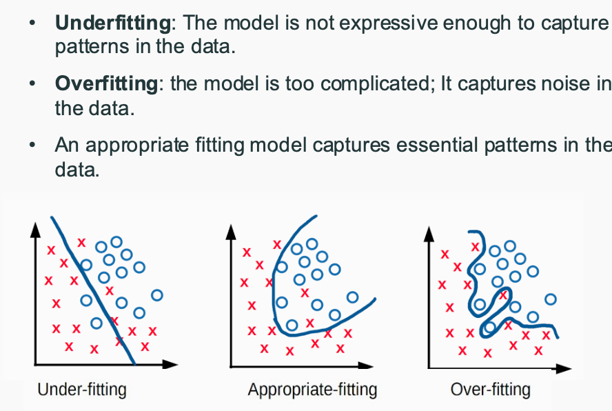
1. Evidence of overfitting: large gap between training and test performance
2. Evidence of underfitting: High error rate for both test and training set

### Learning Curves
- A learning curve is a plot of learning performance over experience or time
- y-axis: Performance measured by accuracy, error rate or other metrics
- x-axis: conditions, e.g., sizes of training sets, model complexity, number of iterations…
- The learning curve can be used to identify overfitting, underfitting, or a suitable trade-off between the two.
- Training learning curve: calculated from the training set that shows how well the model is learning.
- Validation learning curve: calculated from a holdout set that shows how well the model is generalising.

#### data trade-off
- More training instances? → (usually) better model
- More evaluation instances? → more reliable estimate of effectivenes 

### Bias and Variance
- Model bias: the tendency of our model to make systematically wrong predictions
- Evaluation bias: the tendency of our evaluation strategy to over- or under-estimate the effectiveness of our model
- Sampling bias: if our training or evaluation dataset isn’t representative of the population.

- Model variance: Sensitivity of a machine learning model's predictions to small changes in the training data, leading to different outcomes when the model is trained on different subsets of the data.
- Evaluation variance: Variability in the performance metrics of a model (such as accuracy, precision, or recall) when evaluated across different test datasets or under different evaluation conditions.

## Week 7: Feature Selection
### Univariate Methods
*   **Concept**: Evaluate each feature individually in relation to the target variable.
*   **Advantages**:
    *   Intuitive approach to assess the "goodness" of each attribute.
    *   Model-independent.
    *   Linear time complexity with respect to the number of attributes.
*   **Good Features**: Features that are "correlated" with the label and can predict it effectively.
*   **Methods**:
    *   **Signal-to-Noise Ratio (SNR)**: Select features with high SNR.
    *   **Mutual Information (MI)**: Measures the dependence between the target variable and each feature. Select features with high MI.
    *   **Chi-Squared Test**: Determines if there is a significant association between categorical variables (for classification tasks).
    *   **ANOVA F-value**: Evaluates the significance of individual features in a dataset (for classification tasks with continuous features).
    *   **Correlation-based Feature Selection (CFS)**: Measures the correlation between each feature and the target variable. Selects features with high correlation.
### Multivariate Methods
*   **Concept**: Consider subsets of features together to capture their combined predictive power.
*   **Limitations of Univariate Methods**: Sometimes, single features may not provide good classification, but a combination of features can lead to better decision boundaries.
*   **Complexity**: Choosing the optimal subset of attributes that gives the best performance on the validation data.
*   **Feature Subset Assessment**:
    *   Split data into training, validation, and test sets.
    *   Train a classifier on each feature subset using the training data.
    *   Select the feature subset that performs best on the validation data.
    *   Test the selected subset on the test data.
*   **Algorithms**: 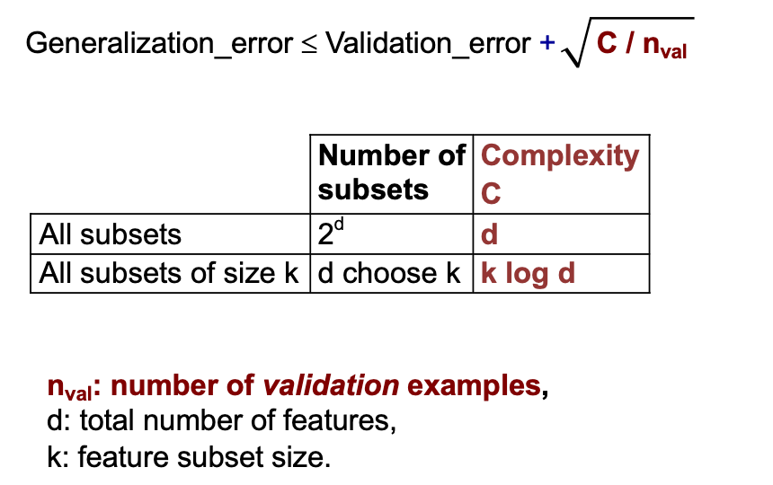
### Filter Methods
*   **Concept**: Rank features (or feature subsets) independently of the classifier based on a predefined criterion.
*   **Criterion**: Measure the "relevance" of each feature (or feature subset) with respect to the target variable.
*   **Search Strategy**: Typically involves sorting features based on individual rankings or nested subsets.
*   **Assessment**: No direct assessment, but cross-validation can be used to determine the optimal number of features to select.
### Wrapper Methods
*   **Concept**: Use a classifier to evaluate the "usefulness" of different feature subsets.
*   **Criterion**: Measure the predictive power of each feature subset.
*   **Search Strategy**: Search through the space of all possible feature subsets. Train a new classifier for each candidate subset.
*   **Assessment**: Use cross-validation to evaluate the performance of each subset.
### Embedded Methods
*   **Concept**: Similar to wrapper methods, but utilize the classifier's internal knowledge to guide the search for the best feature subset, avoiding the need to train a new classifier for every candidate subset.
*   **Criterion**: Measure the "usefulness" of each feature subset.
*   **Search Strategy**: Guided search based on the classifier's knowledge.
*   **Assessment**: Use cross-validation.
### Forward Selection (Wrapper Method)
*   **Running Time**: Increases with the number of attributes.
*   **Advantages**: Performs well when the optimal subset is small.
*   **Disadvantages**: May converge to a suboptimal solution and is not feasible for large datasets.
### Forward Selection (Embedded Method)
*   **Running Time**: Faster than the wrapper method.
*   **Advantages**: Uses the classifier's knowledge to evaluate candidate features.
### Backward Elimination (Wrapper Method)
*   **Running Time**: Increases with the number of attributes.
*   **Advantages**: Removes the most irrelevant attributes at the beginning.
*   **Disadvantages**: May converge to a suboptimal solution and is not feasible for large datasets.
### Backward Elimination (Embedded Method)
*   **Running Time**: Faster than the wrapper method.
*   **Advantages**: Uses the classifier's knowledge to evaluate candidate features.
### L0-Norm Regularization
*   **Concept**: Directly minimize the number of features used by the algorithm by promoting zero entries in the weight vector.
*   **Objective Function**: Minimize the number of non-zero entries in the weight vector.
*   **Challenges**: The objective function is non-continuous and non-convex, making the optimization problem combinatorially hard.
### L1-Norm Regularization
*   **Concept**: Use a convex function to promote sparsity in the weight vector, resulting in fewer non-zero entries.
*   **Objective Function**: Minimize the L1 norm of the weight vector (taxicab norm or Manhattan norm).
*   **Advantages**: The optimization problem is convex, making it easier to solve.
*   **Result**: The solution typically has fewer non-zero entries, effectively performing feature selection.

**主成分分析 (PCA**)
* **目标**：找到一组正交的基向量，能够最大限度地解释数据方差。
* **步骤**：
    1. **数据中心化**：将数据集中的每个特征减去其均值，消除均值的影响。
    2. **计算协方差矩阵**：计算中心化数据矩阵的协方差矩阵。
    3. **特征值分解/奇异值分解**：计算协方差矩阵的特征值和特征向量，或者对中心化数据矩阵进行 SVD。
    4. **选择主成分**：选择前 m 个特征值最大的特征向量作为主成分。
    5. **数据降维**：将原始数据投影到主成分构成的子空间中，实现降维。
- **PCA 的优势**：
* **简化数据**：减少变量数量，降低模型复杂度。
* **揭示潜在结构**：找到数据背后的潜在维度，帮助理解数据本质。
* **提高效率**：降低计算成本，提高模型训练和预测速度。
- **PCA 的局限性**：
* **无法利用类别标签信息**：PCA 无法区分不同类别。
* **最大化方差**：PCA 最大化方差，但不一定能够区分不同类别。
- **PCA 的应用**：
* **图像压缩**：将图像分割成小块，并将每个小块投影到低维子空间中，实现压缩。
* **面部表情识别**：将面部图像投影到低维子空间中，提取关键特征，用于表情识别。
**PCA 的评估**：
* **避免破坏交叉验证**：不要在整个数据集上进行降维，否则会破坏交叉验证。
* **在交叉验证的训练集上进行降维**：在交叉验证的每个训练集上进行降维，并在验证集上进行评估。

## Week 8
- 朴素贝叶斯和逻辑回归都是基于概率模型的分类算法，但朴素贝叶斯假设特征之间相互独立，而逻辑回归则没有这个限制。
- 感知器不使用概率模型，而是直接优化分类错误率，更加简单直观。

### ANN
- Artificial neural network is a network of processing elements
- Each element converts inputs to output
- The output is a function (called activation function) of a weighted sum of inputs
- Training an ANN means adjusting weights for training data given a pre-defined network topology

### Perceptron
- The Perceptron is a minimal neural network
- neural networks are composed of neurons
- A neuron is defined as y = f(θ0 + θ1 x1 +...+ θd xd)

### Perceptron Algorithm
- supervised classification algorithm
- 感知器通过调整权重来优化性能，并通过比较预测输出与真实输出之间的差异来更新权重。如果预测正确，则不做任何改变；如果预测错误，则根据实际情况增加或减少权重。
- 一个epoch就是完成一次完整的训练过程
- if mistakes: 𝑦(𝜃 ⋅ 𝒙) ≤ 0, we need to update
- 感知器算法通过迭代地更新权重来最小化误分类的数量。每次迭代中，如果发现某个样本被误分类，就根据学习率和样本的特征更新权重。这个过程重复进行直到达到预定的epoch数。
- can set learning rate 𝜂 as 1 for simplicity

### Online learning vs. Batch learning
- The perceptron algorithm is an online algorithm: update weights after each training example
- In contrast, Naive Bayes and logistic regression (with Gradient Descent) are batch algorithms

### Multi-layer perceptron
- Input layer with input units x: the first layer, takes features x as inputs
- Output layer with output units y: the last layer, has one unit per
possible output (e.g., 1 unit for binary classification)
- Hidden layers with hidden units h: all layers in between.

### Multi-layer Perceptron vs. other Neural Networks
#### Multi-layer Perceptron
- One specific type of neural network
- Feed-forward
- Fully connected
- Supervised learner
#### Other types of neural networks
- Convolutional neural networks
- Recurrent neural networks
- Autoencoder (unsupervised)

### Linear vs. Non-linear classification
#### Linear classification
- The perceptron, naive bayes, logistic regression are linear classifiers
- Decision boundary is a linear combination of features σ𝑖 𝜃𝑖𝑋𝑖
- Cannot learn‘feature interactions’ naturally
#### Non-linear classification
- Neural networks with at least 1 hidden layer and non-linear activations
- Decision boundary is a non-linear function of the inputs

### Feature engineering vs feature learning
| 项目           | Feature Engineering（特征工程）              | Feature Learning（特征学习）         |
| ------------ | -------------------------------------- | ------------------------------ |
| **使用方式**     | 人工设计并提取特征作为模型输入                        | 模型从原始数据中自动学习特征                 |
| **典型模型**     | 感知机、朴素贝叶斯、逻辑回归、决策树等                    | 神经网络（MLP、CNN、RNN、Transformer等） |
| **数据输入**     | 需要是人类理解的、高质量的“特征”（如 sunny, overcast 等） | 原始的数值数据，如图像像素、文本词向量、音频信号       |
| **是否需要领域知识** | ✅ 需要，特征提取要依赖专家经验                       | ❌ 不需要，模型自动学出与任务相关的特征           |
| **控制权/可解释性** | 高（你知道模型在用什么特征）                         | 低（中间特征难解释，但通常更有效）              |
| **对调参的依赖**   | 相对较少（因为特征是固定的）                         | 高（要调网络结构、激活函数、学习率等超参数）         |


### Activation Functions
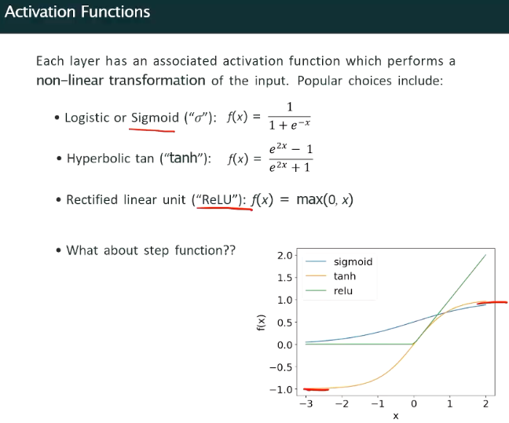
1. **Logistic or Sigmoid Function**:
   The output range of this function is between 0 and 1, commonly used in the output layer for binary classification problems. But will cause gradient vanishing problem, not commonly used.
2. **Hyperbolic Tangent Function (tanh)**:
   The output range of this function is between -1 and 1, more commonly used than the sigmoid function because its output mean is 0, which helps alleviate the gradient vanishing problem.
3. **Rectified Linear Unit (ReLU)**: Most commonly used activation function
   This function directly returns the input value when the input is greater than 0, otherwise returns 0. It is one of the most popular activation functions currently, due to its simplicity, efficiency, and ability to accelerate the training process of neural networks.
- Note that the activation functions must be non-linear, as without this, the model is simply a (complex) linear model
:::info
### 感知机学习规则
- 二分类问题：sigmoid
- 多分类问题：softmax
- 多标签问题：sigmoid
- 线性回归: 线性函数

### Formula
#### 🧮 **公式 1：线性组合（Perceptron 中的加权求和）**

$$
\Sigma = \theta_0 + \theta_1 \cdot x_1 + \theta_2 \cdot x_2
$$

#### ✅ 含义：

* $\Sigma$：感知机的中间结果（还没经过激活函数）
* $\theta_0$：偏置项（bias）
* $\theta_1, \theta_2$：输入特征的权重
* $x_1, x_2$：输入特征值

这是感知机对一个输入样本做出的“线性打分”。

---

#### 🔁 **公式 2：感知机权重更新规则（Perceptron Learning Rule）**

$$
\theta_j^{(t)} \leftarrow \theta_j^{(t-1)} + \eta \cdot (y^{(i)} - \hat{y}^{(i,t)}) \cdot x_j^{(i)}
$$

#### ✅ 含义：

* $\theta_j^{(t)}$：第 $t$ 次更新后第 $j$ 个权重
* $\theta_j^{(t-1)}$：上一次的权重值
* $\eta$：学习率（learning rate）
* $y^{(i)}$：第 $i$ 个训练样本的真实标签
* $\hat{y}^{(i,t)}$：当前模型对样本 $i$ 的预测（经过激活函数）
* $x_j^{(i)}$：样本 $i$ 的第 $j$ 个特征

只在预测错误（即 $y \ne \hat{y}$）时才更新。
---

这两个公式一起构成了感知机的核心工作机制：

> **先用第一个公式计算预测，再根据第二个公式更新权重。**
:::

### When is Linear Classification Enough?
- If we know our classes are linearly (approximately) separable
- If the feature space is (very) high-dimensional
...i.e., the number of features exceeds the number of training instances
(kernel trick)
- If the traning set is small
- If interpretability is important, i.e., understanding how (combinations of) features explain different predictions
- …but with increasing availability of data, and more powerful computers, non-linear models are gaining popularity, with currently Neural Networks being their most popular variant.

### Pros and Cons of Neural Networks
#### Pros
- Powerful tool!
- Neural networks with at least 1 hidden layer can approximate any (continuous) function. They are universal approximators
- Automatic feature learning
- Empirically, very good performance for many diverse tasks
#### Cons
- Powerful model increases the danger of ‘overfitting’
- Requires large training data sets
- Often requires powerful compute resources (GPUs)
- Lack of interpretability

## Week 9
| Characteristics | Activation Function | Step Function |
|------|--------------------------|---------------------|
| Definition | Introduces non-linear factors, determines whether a node is activated | Takes different constant values in different intervals |
| Mathematical Properties | Usually continuous and differentiable | Discontinuous, with jumps only at specific points |
| Applications | Introduces non-linearity in neural networks, increasing model complexity | Signal processing, control theory, early perceptron models |
| Common Types | Sigmoid, Tanh, ReLU, Leaky ReLU, Softmax | Heaviside step function |
| Advantages | Improves model expressiveness, suitable for complex pattern recognition | Simple, easy to understand and implement |
| Disadvantages | May cause gradient disappearance or explosion, requires selection of suitable functions | Discontinuous, not suitable for gradient-based optimization algorithms |
| Use in Neural Networks | Widely used, a core component of modern neural networks | Rarely used, mainly in early models |
Summary: Activation functions and step functions have different applications and properties in mathematics and engineering. Activation functions are mainly used in neural networks to introduce non-linearity and improve model expressiveness, while step functions are used in signal processing, control theory, and other fields. In neural networks, step functions are not suitable as activation functions due to their discontinuity.

### Why cannot we use the step functon?
Derivative is not defined at 0.
When it’s not at 0, the derivative is 0.
= No way to update weights and learn anything!

### A problem encountered when training a multilayer perceptron (MLP) and the method to solve it.
1. The update rule depends on the actual target output y: When training a neural network, we typically use an update rule to adjust the network's weights, which depends on the actual target output. However, in a multilayer network, we can only directly obtain the actual output of the final layer, but not the actual output of the hidden layers.
2. We can only access the actual output of the final layer: In a multilayer network, we can only directly observe the output of the final layer, while the output of the hidden layers is not directly observable.
3. We do not know the actual activation of the hidden layers: Since we cannot directly observe the actual output of the hidden layers, we do not know the actual activation state of the hidden layers.
To solve these problems, backpropagation (Backpropagation) provides an effective method. Backpropagation is an algorithm for training multilayer neural networks, which updates the weights in the network by calculating the partial derivatives of the error. This method allows us to effectively calculate the error partial derivatives for each individual weight, thereby updating the weights of the hidden layers, not just the outermost layer. This way, we can still effectively train the entire network without knowing the actual activation of the hidden layers. 

### Comparison of Perceptron and Backpropagation
| 感知机更新                  | Backprop                |
| ---------------------- | ----------------------- |
| 只有一层（输出层）              | 多层（含隐藏层）                |
| 权重更新基于误差 $y - \hat{y}$ | 基于损失函数对每个权重的导数          |
| 没有链式法则                 | 使用链式法则（链式求导）            |
| 不需要激活函数的导数             | 必须使用激活函数的导数（如 sigmoid'） |
| 简单快速，但只能处理线性可分         | 更复杂，但可以拟合非线性函数          |

### Backpropagation
**训练多层感知机（MLP）** 的标准流程，用于理解 **反向传播（Backpropagation）+ 梯度下降（Gradient Descent）** 的全过程。

#### **Step 1: Forward propagate an input x**

输入 $\mathbf{x}$（训练样本）进入神经网络：

* 一层一层地执行线性变换和激活函数
* 对每一层 $l$：

  $$
  \mathbf{z}^{(l)} = \mathbf{W}^{(l)} \mathbf{a}^{(l-1)} + \mathbf{b}^{(l)} \\
  \mathbf{a}^{(l)} = f(\mathbf{z}^{(l)})
  $$

  其中 $f$ 是激活函数（如 ReLU、Sigmoid）

✅ 最终得到输出 $\hat{y}$

#### **Step 2: Compute the predicted output $\hat{y}$**

这是前向传播的最后结果：

$$
\hat{y} = \text{MLP}(\mathbf{x})
$$

可能是：

* 标量（用于二分类）
* 向量（用于多分类，比如经过 softmax）

#### **Step 3: Compare $\hat{y}$ with true output $y$, compute error**

定义一个 **损失函数（Loss Function）**：

常用的损失函数：

* 均方误差（MSE）：$\frac{1}{2} (y - \hat{y})^2$
* 交叉熵（Cross-Entropy）用于分类

记为：

$$
\mathcal{L}(\hat{y}, y)
$$

我们现在知道当前预测有多“错”。

#### **Step 4: Modify each weight to reduce the error (Gradient Descent)**

这一步就是 **反向传播的核心**：

1. 通过 **链式法则** 计算损失函数对每一层权重的梯度：

$$
\frac{\partial \mathcal{L}}{\partial \mathbf{W}^{(l)}}
$$

2. 使用 **梯度下降** 更新每一层权重：

$$
\mathbf{W}^{(l)} \leftarrow \mathbf{W}^{(l)} - \eta \cdot \frac{\partial \mathcal{L}}{\partial \mathbf{W}^{(l)}}
$$

$$
\mathbf{b}^{(l)} \leftarrow \mathbf{b}^{(l)} - \eta \cdot \frac{\partial \mathcal{L}}{\partial \mathbf{b}^{(l)}}
$$

其中 $\eta$ 是学习率。

🔁 每一层的梯度依赖于后一层的梯度：这就是**反向传播**（误差从输出层传回隐藏层）

#### **Step 5: Repeat for all data and multiple epochs**

* 对训练集中的每个样本重复上面过程（可能使用 mini-batch）
* 进行多个轮（epochs），直到损失不再明显下降

#### ✨ 总结流程图

```
Input x
  ↓
[Forward Propagation]
  ↓
Predicted Output ŷ
  ↓
Compare with True Output y
  ↓
[Compute Loss]
  ↓
[Backpropagation: compute gradients]
  ↓
Update weights with Gradient Descent
  ↓
Repeat
```

---


### Generalized Delta Rule
The **Generalized Delta Rule** 是 **反向传播算法（Backpropagation）** 的数学核心，用于训练多层感知机（MLP）。它是一种将感知机的简单“误差更新规则”推广到多层神经网络中的方法。

---

#### 🧠 一句话解释：

> **Generalized Delta Rule** 就是用**链式法则**计算隐藏层中每个神经元的误差信号，并据此更新权重。

#### 🧮 回顾感知机的基本更新：

在单层感知机中，如果输出是：

$$
\hat{y} = f(\theta^T x)
$$

误差是：

$$
\delta = y - \hat{y}
$$

然后我们更新权重：

$$
\theta \leftarrow \theta + \eta \cdot \delta \cdot x
$$

但对于多层神经网络（有隐藏层），我们不能直接用 $y - \hat{y}$ 来更新隐藏层的权重。

#### 🚀 Generalized Delta Rule 的核心思想：

对于任意神经元 $j$ 的权重 $w_{ji}$，更新公式为：

$$
w_{ji} \leftarrow w_{ji} + \eta \cdot \delta_j \cdot x_i
$$

其中：

* $\eta$：学习率
* $\delta_j$：第 $j$ 个神经元的“误差信号”
* $x_i$：输入（来自上一层）

#### ❗关键点在于怎么定义 $\delta_j$（误差信号）

#### 👉 对于输出层的神经元：

$$
\delta_j = (y_j - \hat{y}_j) \cdot f'(z_j)
$$

* $f'(z_j)$：激活函数的导数
* $z_j$：未激活前的线性输入

#### 👉 对于隐藏层的神经元：

$$
\delta_j = f'(z_j) \cdot \sum_k \delta_k \cdot w_{kj}
$$

* $\delta_k$：来自下一层（靠近输出层）的误差信号
* $w_{kj}$：从本层神经元 $j$ 到下一层神经元 $k$ 的权重

#### 🧠 总结

| 项目      | 感知机               | Generalized Delta Rule (Backprop) |
| ------- | ----------------- | --------------------------------- |
| 适用网络    | 单层                | 多层（含隐藏层）                          |
| 误差传播    | 直接用 $y - \hat{y}$ | 使用链式法则逐层传播                        |
| 激活函数导数  | 不需要               | 必须计算 $f'(z)$                      |
| 支持非线性   | ❌                 | ✅                                 |
| 支持隐藏层训练 | ❌                 | ✅                                 |


### Discriminative and Generative
"**Discriminative**" and "**Generative**" are two different model approaches in machine learning used for classification or prediction tasks, but their **modeling ideas and goals differ**. Here are their main differences:

---

### 🔍 One-sentence Difference:

* **Discriminative Models**: Directly learn the **mapping from input to output** (i.e., learn $P(y \mid x)$).
* **Generative Models**: Learn the **data generation process** (i.e., learn $P(x, y)$, which can derive $P(x \mid y)$ and $P(y)$).

---

### 📚 More Specifically:

| Attribute     | Discriminative Models                        | Generative Models                             |
| ------------- | -------------------------------------------- | --------------------------------------------- |
| What is learned? | Learn $P(y \mid x)$: the probability of class y given input x | Learn $P(x \mid y)$ and $P(y)$: how input x is generated by class y |
| Examples      | Logistic Regression, SVM, Random Forest, BERT | Naive Bayes, HMM, GMM, GAN, VAE               |
| Capabilities  | Classification, regression                   | Classification, sample generation (images, text), missing value imputation, data simulation |
| Model input distribution? | ❌ Does not model the distribution of $x$ | ✅ Models the generation mechanism of $x$     |
| Can generate data? | ❌ No                                    | ✅ Can generate new samples (images, text, etc.) |
| Typical performance | More accurate for classification (because it directly optimizes the classification task) | More robust with less data, but may have slightly weaker classification performance |

---

### 🎓 Classic Examples:

#### Naive Bayes (Generative)

* Assume you know the word frequency for each class (e.g., "spam" or "normal email").
* You can first generate a spam email and then see if a new email resembles spam.

#### Logistic Regression (Discriminative)

* Only learns to directly determine from the features of an email whether it is spam or normal.

---

### ✅ When to Use Which?

* Use **Discriminative**:

  * Classification is the sole task (e.g., sentiment classification, image recognition)
  * Sufficient data is available, aiming for the best prediction performance

* Use **Generative**:

  * Want to **generate data** (images, speech, text, etc.)
  * There is **missing data**, **few-shot learning**, or a need for stronger expressive capability

---

## Week 10
### Unsupervised Learning
- Finding the correct label for an instance can be hard and expensive (the labelling usually should be done manually)
- Labelled data is limited
- On the other hand, we have access to many more datasets that are not labelled

### Types of unsupervised learning
- PCA: simplify complex datasets with many features by extracting the most essential information
- Clustering: Finding groups of items that are similar
- Anomaly detection: detecting rare occurrences that seem suspicious because they're different from the established pattern
- Associate Rule Mining: Given a set of transactions, find rules that will predict the occurrence of an item based on the occurrences of other items in the transaction

### Clustering

| Dimension | Type | Description | Example Algorithm |
|-----------|------|-------------|-------------------|
| Membership | Exclusive | Each point belongs to only one cluster | K-Means |
|            | Overlapping | A point can belong to multiple clusters | FCM, GMM |
| Assignment Method | Deterministic | Clear membership | K-Means |
|                  | Probabilistic | Probabilistic membership | GMM, FCM |
| Structure | Hierarchical | Tree structure | Hierarchical Clustering |
|           | Partitioning | Flat partitioning | K-Means |
| Coverage | Partial | Not all points need to be covered | Clustering with outlier handling |
|          | Complete | All points are classified | Most traditional clustering |
| Intra-cluster Characteristics | Homogeneous | Clusters are as similar as possible | Most clustering algorithms |
|                              | Heterogeneous | Allows significant differences within clusters | Used for specific needs |

---
### K-means
#### K-means clustering process (exclusive, complete and partitioning clustering method)
- Ask the user how many clusters they would like (K)
-  Randomly pick K points (as seeds or initial cluster centroids)
-  Repeat
   - Assign each instance to the cluster with the nearest centroid
   - Recompute the centroid of each cluster
- Until the centroids don’t change (or until changes are smaller than a threshold, or until relatively few points change clusters)

#### K-means limitaion
- “mean” is ill-defined for categorical attributes
- Sensitive to outliers
- Sensitive to Initial Centroids
- Not able to handle non-spherical clusters
- Not able to handle clusters of differing sizes
- Not able to handle clusters with different densities
- Requires Predefined Number of Clusters (K): Determining the optimal number of clusters can be a challenging task

#### K-means strengths
- Simplicity: straightforward and easy-to-understand algorithm.
- Scalability: computationally efficient and can converge relatively quickly. Suitable for clustering tasks involving a large number of data points.
- Interpretable Results: Clusters can be easily interpreted and visualised.
- Applicability: K-means is applicable to a wide range of clustering tasks (often good enough).

#### Elbow Method (to find optimal K)
- A “good” cluster should have High cluster cohesion (Intra-cluster distances are minimized) and High Cluster Separation (Inter-cluster distances are maximized)
- To measure Cohesion: Within-cluster Sum of Squares (WCSS): the sum of the squared distance between each point and the centroid in a cluster (Cluster Cohesion)
- Look for a point where the reduction in WCSS significantly slows down: that is the Elbow point

### Hierarchical Clustering
- Agglomerative (Bottom-up) clustering
   - Start with the points (instances) as individual clusters
   - At each step, merge the closest pair of clusters until only one cluster (or k clusters) left

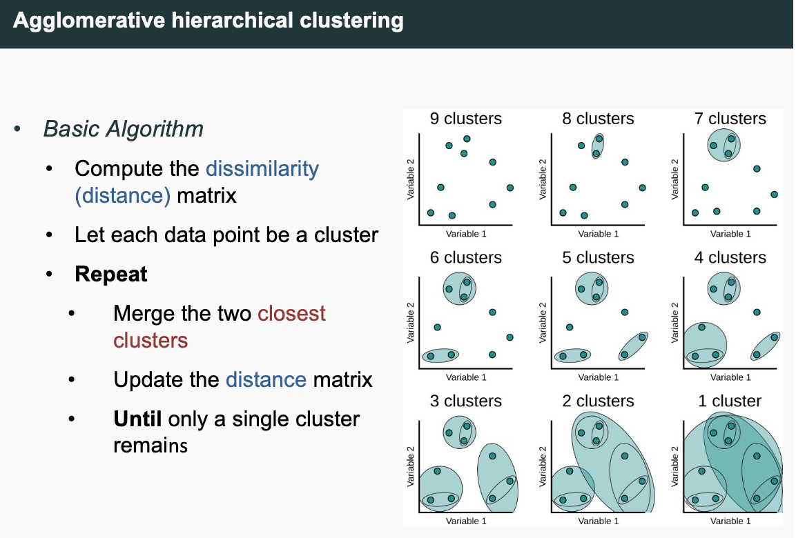
- Single Linkage: Distance between the closest members of the cluster
   - Can handle non-similar shapes
   - Sensitive to noise and outliers
- Complete Linkage: Distance between the furthest members of the cluster
   - Less sensitive to noise and outliers
   - Tends to create spherical clusters with a consistent diameter.
   - Tends to break large clusters
- Centroid Linkage: Distance between the two centroids

#### Strength
- No assumption of any particular number of clusters
   - Any desired number of clusters can be obtained by 'cutting' the dendrogram at the appropriate level
- No assumption of cluster shape
   - not assume specific shapes or distributions for the clusters.
   - can handle clusters of various shapes, sizes, and densities
- They may correspond to meaningful taxonomies
   - Examples in biological sciences (e.g., animal kingdom, phylogeny reconstruction, …)

#### Weakness
- Once a decision is made to combine two clusters, it cannot be undone, i.e., an object that is in the wrong cluster will always stay there.
- No objective function is directly minimised, i.e., no 'relative' quality measure

### Clustering Metrics
#### WCSS and BCSS
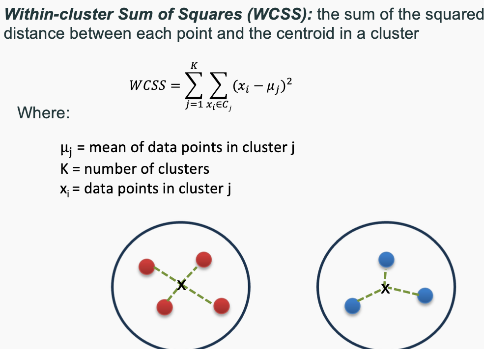
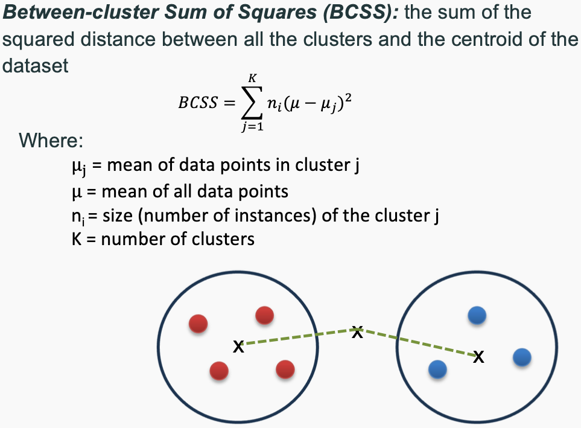

- The two main concepts used to evaluate the goodness of a clustering structure without relying on external information (i.e., unsupervised evaluation) are:

   - **Cohesion (Intra-cluster Similarity)** – Measures how closely related the points within the same cluster are. A good clustering structure should have high cohesion, meaning data points within a cluster should be densely packed and similar to one another. This is typically evaluated using metrics like within-cluster sum of squares (WCSS).

   - **Separation (Inter-cluster Dissimilarity)** – Measures how well-separated different clusters are from each other. A strong clustering structure should have high separation, meaning clusters are distinct and far apart from one another. This is often evaluated using metrics like between-cluster sum of squares (BCSS).

- These two principles ensure that clusters are both internally coherent and externally distinct, leading to a well-formed clustering solution.

#### Calinski-Harabasz Index
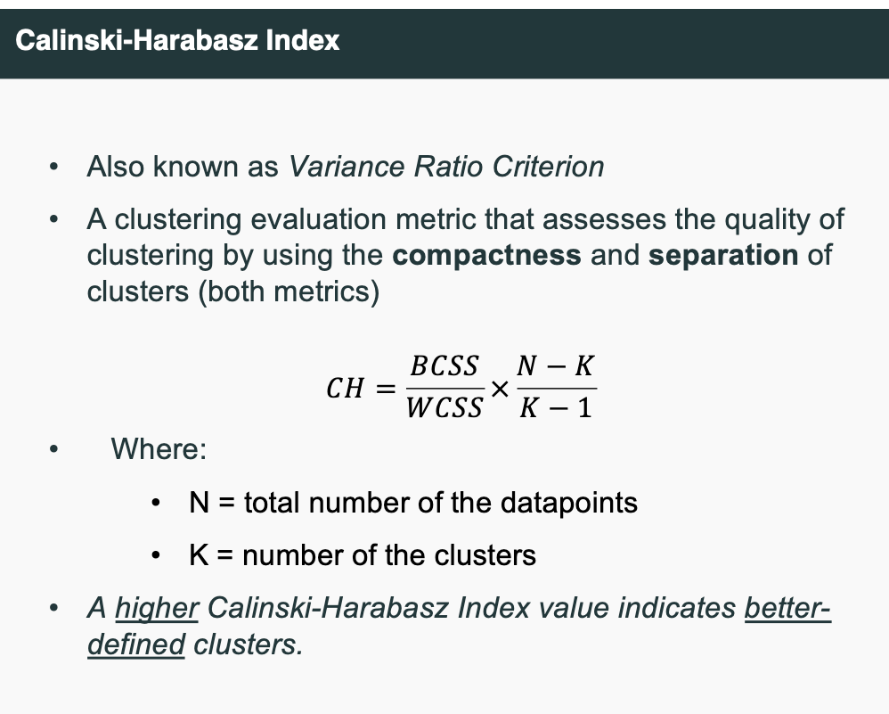

### Homogeneity
- Whether each cluster contains only data points that are all from the same class. Homogeneity checks if all the items in a cluster are the same type.
### Completeness
- Whether all data points of a particular class are assigned to the same cluster.

#### Why Do We Need Both Metrics?
- Homogeneity alone can be misleading. It only checks whether all instances within a cluster share the same label but does not ensure that instances of the same class are grouped together.

- Thus, a good clustering solution should aim for both high homogeneity and high completeness to ensure meaningful and accurate grouping of data points.

#### 数学公式 & 如何计算

这两个指标都基于 **条件熵（conditional entropy）** 的概念，并且和 **V-measure** 有关联。

我们用以下变量表示：

- $ C $：真实的类别（class）
- $ K $：聚类的结果（cluster）

##### 1. Homogeneity (h)

$$
h = 
\begin{cases}
    1 - \frac{H(C|K)}{H(C)} & \text{if } H(C) \neq 0 \\
    1 & \text{otherwise}
\end{cases}
$$

其中：
- $ H(C|K) $：给定聚类结果的类别条件熵（表示每个簇内部的类别分布混乱程度）
- $ H(C) $：类别的总熵（原始类别分布的不确定性）

💡 含义：如果每个簇里的类别都很单一（$ H(C|K) \approx 0 $），则 `h ≈ 1`，说明同质性很好。

---

##### 2. Completeness (c)

$$
c = 
\begin{cases}
    1 - \frac{H(K|C)}{H(K)} & \text{if } H(K) \neq 0 \\
    1 & \text{otherwise}
\end{cases}
$$

其中：
- $ H(K|C) $：给定真实类别的聚类条件熵（表示每个类别在聚类结果中被打散的程度）
- $ H(K) $：聚类结果的总熵（聚类分布的不确定性）

💡 含义：如果每个类别都被集中在某一个簇中（$ H(K|C) \approx 0 $），则 `c ≈ 1`，说明完整性很好。

---

#### 举个例子说明怎么算

### 示例输入：

| 数据点 | 真实类别（Class） | 聚类结果（Cluster） |
|--------|------------------|---------------------|
| A      | Cat              | 1                   |
| B      | Cat              | 1                   |
| C      | Dog              | 1                   |
| D      | Dog              | 2                   |
| E      | Bird             | 2                   |

我们可以看到：

- Cluster 1 包含 Cat, Cat, Dog → 不同类 → **同质性差**
- Cat 分布在 Cluster 1 → 完整性 OK
- Dog 分布在 Cluster 1 和 Cluster 2 → **完整性差**

---

#### 手动计算（简化理解）：

- **同质性**（Homogeneity）：
  - Cluster 1: 两个猫 + 一个狗 → 不纯
  - Cluster 2: 一个狗 + 一个鸟 → 更不纯
  - 所以 `h < 1`

- **完整性**（Completeness）：
  - 猫都在 cluster 1 → OK
  - 狗分布在两个 cluster → 不完整
  - 鸟在 cluster 2 → OK
  - 所以 `c < 1`

---

### Issues of unsupervised learning
- Ambiguity in Interpretation
   - Clusters or embeddings may not align with human-understandable or task-relevant categories.
   - Clusters or latent features are often hard to interpret or evaluate objectively
- Wrong Direction
   - The model may find structure, but there's no guarantee it's meaningful or useful for our task

### Semi-supervised learning
- learning from both labelled and unlabelled data, often more unlabelled
- Two common strategies within semi-supervised learning are self-training and active learning
:::info
| 类型              | 是否需要标签  | 应用场景        |
| --------------- | ------- | ----------- |
| Supervised      | ✅ 是     | 分类、回归       |
| Semi-supervised | ✅ 部分有标签 | 资源有限但数据多    |
| Unsupervised    | ❌ 否     | 聚类、异常检测、降维等 |

:::

### Self-tranining
- Repeat
- Train a model f on L using any supervised learning method
- Apply f to predict the labels on each instance in U
- Identify a subset of U with “high confidence” labels
- Remove them from U and add them to L with the classifier predictions as the “ground-truth”
- Until L does not change
#### Problems and Solution
- 错误传播 (Classification errors can propagate)：这是自训练的一个主要风险。如果模型在预测未标记数据的标签时犯了错误（比如给了一个高置信度的错误标签），并且这个错误的数据被加入了 L，那么在下一轮训练中，这个错误的数据就会被当作“正确”的标签来训练模型。这会导致模型在新数据上表现更差，错误会像滚雪球一样越滚越大。
- 高置信度阈值：一个常用的策略是，模型在预测未标记数据标签时，只有当它对预测结果非常“自信”（置信度高于某个预设的阈值）时，才把这个预测的标签和对应的数据加入到 L 中。如果模型对预测结果不太确定（置信度低），就认为这个预测不可靠，不把它加入 L，从而避免引入错误标签。

### Active Learning
- pose queries (unlabelled instances) for labelling by an oracle (e.g. a human annotator)

#### Uncertain Sampling
1. Least Confidence: Choose samples with the smallest predicted probability for the most likely class
2. Margin Sampling: Choose samples where the difference between the top two predicted class probabilities is smallest
3. Entropy sampling: Select the sample with the highest prediction entropy
#### Query Strategies
- Query by Committee(QBC) If the committee disagrees on an instance, the model is uncertain and would benefit most from seeing the true label.
:::info
| 策略                       | 关键点         | 优势          | 劣势              |
| ------------------------ | ----------- | ----------- | --------------- |
| **Uncertainty Sampling** | 利用单个模型的不确定性 | 简单高效，易实现    | 可能偏向异常点         |
| **QBC**                  | 利用多个模型的不一致  | 更稳健，捕捉“争议点” | 算法复杂度高，需要训练多个模型 |
:::

### Data Augmentation
- Bootstrap sampling: create “new” datasets by resampling existing data, with or without replacement
- Cross validation / repeated random subsampling are based on the same idea
- Each “batch” has a slightly different distribution of instances, forces model to use different features and not get stuck in local minima
- Advantages
   - More data nearly always improves learning
   - Most learning algorithms have some robustness to noise
- Disadvantages
   - Biased training data
   - May introduce features that don’t exist in the real world
   - May propagate errors
   - Increases problems with interpretability and transparency

### Unsupervised pre-training
#### BERT
- pretrained language model developed by Google that understands text by looking at both left and right context simultaneously
- **Masked Language Modelling (MLM)**: Predict missing words in a sentence. "The cat [MASK] on the mat."
- **Next Sentence Prediction (NSP)**: Predict if one sentence follows another.
:::info
-**预训练（Pre-training）**：
模型先在大规模的无标签数据上训练，比如让语言模型预测句子中的下一个词，或者让图像模型识别图像中的特征。这个阶段模型学习的是通用的“知识”或“表示”，但没有特定任务的标签指导。
- **迁移（Transfer）**：
把预训练得到的模型参数（权重）拿过来，作为一个“起点”或者“初始模型”。
- **微调（Fine-tuning）**：
然后用你手头具体的有标签数据（比如分类任务的标签）对这个模型进行针对性的训练，让模型学会具体任务的要求。这个过程会稍微调整预训练时学到的参数，使模型更适合你的特定任务。
:::

## Week 11
### Parametric Models and Non-parametric Models:
| Feature              | Parametric Models                                          | Non-parametric Models                                      |
|----------------------|------------------------------------------------------------|------------------------------------------------------------|
| Assumptions          | Strong assumptions about data distribution (e.g., normal distribution, linear relationship) | Almost no assumptions about data distribution               |
| Number of Parameters | Fixed number of parameters, usually few                    | Number of parameters is not fixed, can be many              |
| Model Complexity     | Relatively low model complexity                            | Model complexity can be high                                |
| Training Data Needs  | Usually requires less training data                        | May require a large amount of training data                 |
| Generalization Ability | Depends on the accuracy of assumptions                   | Generally strong generalization ability as it does not rely on specific assumptions |
| Overfitting Risk     | Risk of overfitting, especially if assumptions do not match the true distribution | Also has overfitting risk, but can usually be controlled through model selection and regularization |
| Computational Efficiency | Usually high computational efficiency                   | Computational efficiency can be low, especially for large datasets |
| Flexibility          | Low flexibility, constrained by assumptions                | High flexibility, able to adapt to complex data structures and relationships |
| Examples             | Linear regression, logistic regression, Naive Bayes        | K-nearest neighbors, decision trees, random forests, support vector machines |
| Application Scenarios | Suitable for situations where assumptions are reasonable and data volume is small | Suitable for situations with large data volumes, complex relationships, or unknown assumptions |
| Model Interpretability | Usually has good interpretability                         | Interpretability may be poor, especially for complex models |

### Ensembles
- Ensemble learning (aka. Classifier combination): constructs a set of base classifiers from a given set of training data and aggregates the outputs into a single meta-classifier
- Intuition 1: the combination of lots of weak classifiers can be at least as good as one strong classifier
- Intuition 2: the combination of a selection of strong classifiers is (usually) at least as good as the best of the base classifiers
- Ensembles are effective when individual classifiers are slightly better than random (error < 0.5).

#### When does ensemble learning work?
- The classifiers should not make the same mistakes (not the same bias)
- The base classifiers are reasonably accurate (better than chance), slightly
better than random (error < 0.5).

### Different classifiers (different models or the same model with feature manipulation): Stacking
### 1. Stacking
**Description:**
- **Different classifiers (different models or the same model with feature manipulation):** Stacking, also known as stacked generalization, involves training on multiple different models (these models can be different algorithms or the same algorithm with different features or hyperparameters). The predictions of these models are then used as input features to train a higher-level model (meta-learner, usually a simple linear model like logistic regression).
**How it works:**
1. **Level 0 models:** Train multiple base models on the complete dataset.
2. **Level 1 model:** Use the predictions of the base models as input features to train a higher-level model (meta-learner).
**Key Points:**
- **Diversity:** The effectiveness of stacking relies on the diversity of the base models.
- **Complexity:** It can be more complex compared to other ensemble methods, and implementing and tuning parameters can be more difficult.
- **Application Scenarios:** Stacking is useful when you can use multiple different models or when you want to leverage the strengths of different algorithms.
**In short:** Stacking uses multiple different models to make predictions and uses these predictions as features for another model to obtain the final prediction.

### Same classifier, instance manipulation: Bagging (primarily targets variance reduction)
### 2. Bagging
**Description:**
- **Same classifier, instance manipulation:** Bagging, or Bootstrap Aggregating, primarily reduces variance by manipulating data instances. It is often used to reduce the variance of models, especially those complex models sensitive to small changes in the training data (e.g., decision trees).
**How it works:**
1. **Bootstrap Sampling:** Perform sampling with replacement from the original dataset to create multiple different training sets (called bootstrap samples).
2. **Parallel Training:** Independently train the same model on each bootstrap sample.
3. **Aggregate Predictions:** Average the predictions (regression) or use majority voting (classification) for all models.
**Key Points:**
- **Variance Reduction:** Bagging primarily improves model stability by reducing variance.
- **Parallelism:** Models in bagging are trained in parallel.
- **Application Scenarios:** Suitable for models that are very sensitive to small changes in the training data, such as decision trees.
**In short:** Bagging improves model stability by repeatedly sampling the original data, training the same model on each sample, and then aggregating the predictions of these models.

:::info
Random Forest is considered a "Bagging" (Bootstrap Aggregating) method because it uses bootstrap sampling techniques when constructing each decision tree. Bagging is an ensemble learning method whose core idea is to create multiple subsets from the original dataset through bootstrap sampling, train a base learner (e.g., decision tree) on each subset, and finally improve the overall model's performance by combining the predictions of these base learners.
In Random Forest, the specific application of Bagging is reflected in the following aspects:
1. **Bootstrap Sampling:** For the original dataset, Random Forest performs multiple bootstrap samplings, each generating a subset of the same size as the original dataset but with possibly repeated elements. These subsets are used to train different decision trees.
2. **Independent Training:** Each decision tree is independently trained on its respective bootstrap sample, meaning they do not share the same training data.
3. **Combine Predictions:** In the prediction phase, Random Forest combines the predictions of all decision trees. For classification problems, majority voting is usually used; for regression problems, the average prediction value is used.
Through this method, Random Forest uses Bagging techniques to reduce model variance, improve generalization ability, and enhance robustness to noise and outliers. Each tree is trained on a slightly different data subset, which helps introduce diversity, making the overall model more stable and accurate. Therefore, Random Forest is classified as a Bagging method.
- Random Forest adopts both feature manipulation and instance manipulation approaches. 
:::

### Same classifier, algorithm manipulation: Boosting (primarily targets bias reduction)
### 3. Boosting
**Description:**
- **Same classifier, algorithm manipulation:** Boosting primarily reduces bias by gradually adjusting the model during training. It weights training samples so that the model focuses more on previously misclassified samples.
**How it works:**
1. **Initialization:** Initialize the weights of all samples equally.
2. **Iterative Training:** Gradually train the model, adjusting the weights of the samples based on the error rate of the previous model so that the weights of misclassified samples increase.
3. **Combine Models:** Combine all models, usually weighting them based on each model's accuracy.
**Key Points:**
- **Bias Reduction:** Boosting primarily improves model accuracy by reducing bias.
- **Sequentiality:** Models in boosting are trained sequentially, with each model depending on the output of the previous model.
- **Application Scenarios:** Suitable for tasks where performance can be improved by focusing on difficult samples.
**In short:** Boosting improves model accuracy by gradually adjusting the training process so that the model focuses more on samples misclassified by previous models.
**Summary:**
- **Stacking** uses multiple different models and inputs their outputs as features into another model.
- **Bagging** uses the same model but trains on different data subsets to reduce variance.
- **Boosting** uses the same model but gradually adjusts the model during training to reduce bias.

| Feature | Stacking | Bagging | Boosting |
|---------|----------|---------|----------|
| **Model Type** | Different classifiers (different models or the same model with different feature processing) | Same classifier | Same classifier |
| **Objective** | Combine predictions of multiple models to improve overall performance | Primarily reduce variance | Primarily reduce bias |
| **Instance Processing** | Use the original dataset | Perform bootstrap sampling (sampling with replacement) on training data | Adjust sample weights based on errors from the previous round of models |
| **Model Processing** | Use different models or the same model with different feature processing | Use the same model | Use the same model |
| **Algorithm Processing** | Use a meta-learner to combine predictions of multiple models | No specific algorithm processing | Adjust model weights through boosting algorithms (e.g., AdaBoost, Gradient Boosting) |
| **Advantages** | Combine advantages of different models to improve generalization ability | Reduce overfitting, improve model stability | Improve prediction accuracy, reduce bias |
| **Disadvantages** | High computational complexity, requires training multiple models and a meta-learner | May increase model variance, sensitive to outliers | May lead to overfitting, sensitive to noise |
| **Typical Applications** | Combine different types of models (e.g., decision trees, neural networks, SVM) | Random Forest | AdaBoost, Gradient Boosting Machines (GBM) |
| **Applicable Scenarios** | Scenarios requiring the combination of multiple models to improve performance | Scenarios requiring variance reduction and improved model stability | Scenarios requiring bias reduction and improved prediction accuracy |

### Summary
- **Stacking** improves overall performance by combining predictions of different models, suitable for scenarios requiring the combination of multiple models to improve performance.
- **Bagging** reduces model variance and improves stability through bootstrap sampling, suitable for scenarios requiring variance reduction and improved model stability.
- **Boosting** reduces model bias and improves prediction accuracy by adjusting sample weights, suitable for scenarios requiring bias reduction and improved prediction accuracy.


### Anomaly Detection
- Anomalies are different from noise
   - Noise is random error or variance in a measured variable
   - Noise should be removed before anomaly detection

### Types of Anomaly
#### Global Anomaly
- significantly deviates from the rest of the data
#### Contextual Anomaly
- deviates significantly based on a selected context
   - Contextual attributes: define the context, e.g., time & location
   - Behavioural attributes: characteristics of the object, used in anomaly evaluation, e.g., temperature
#### Collective Anomaly
- deviates significantly from the majority of the data

### Anomaly Detection Algorithms
#### Supervised Anomaly Detection
- Use labelled data to train a model to detect anomalies
- Challenges
   - Labeling data is expensive and time-consuming
   - Anomalies are often rare and difficult to detect
   - Anomalies may change over time
   - Cannot detect unknown and emerging anomalies
   - Anomalies may be specific to a particular context
   - Anomalies may be specific to a particular user or group of users

#### Semi-Supervised Anomaly Detection
- Labels are available only for normal data
- apply the trained model to both unlabelled and labelled data
- Any instance that falls outside the learned decision boundary is marked as a potential anomaly
- Challenges
   - Require labels from the normal class
   - Possible high false alarm rate - previously unseen (yet legitimate) data records may be recognised as anomalies

#### Unsupervised Anomaly Detection
- Assume the normal objects are somewhat "clustered" into multiple groups, each having some distinct features
- An outlier is expected to be far away from any groups of normal objects
- Challenges
   - Normal objects may not share any strong patterns, but the collective outliers may share high similarity in a small area
   - Ex. In intrusion detection, normal activities are diverse
   - Unsupervised methods may have a high false positive rate but still miss many real outliers

#### Unsupervised Anomaly Detection Approaches
- Statistical (model-based)
   - Assume that normal data follow some statistical model, such as Gaussian distribution
- Proximity-based
   - An object is an outlier if the nearest neighbours of the object are far away
- Density-based
   - Outliers are objects in regions of low density
- Clustering-based
   - Normal data belong to large and dense clusters

#### Statistical (model-based)
- Pros
   - Statistical tests are well-understood and well-validated.
   - Quantitative measure of the degree to which an object is an outlier.
- Cons
   - Data may be hard to model parametrically.
   - Multiple modes
   - Variable density
   - In high dimensions, data may be insufficient to estimate the true distribution.

#### Proximity-based
- Pros
   - Easier to define a proximity measure for a dataset than to determine its statistical distribution.
   - Quantitative measure of the degree to which an object is an outlier.
   - Deals naturally with multiple modes.
- Cons
   - O(n^2) complexity.
   - Score sensitive to choice of k.
   - Does not work well if the data has widely variable density.

#### Density-based
- Pros
   - Quantitative measure of the degree to which an object is an outlier.
   - It can work well even if the data has variable density.
- Cons
   - O(n^2) complexity
   - Must choose parameters
   - k for nearest neighbours
   - d for distance threshold

#### Clustering-based
- Pros
   - Some clustering techniques have O(n) complexity.
   - Extends the concept of outlier from single objects to groups of objects.
- Cons
   - Requires thresholds for large and small clusters.
   - Sensitive to the number of clusters chosen.
   - Outliers may affect the initial formation of clusters.

## Week 12
### Bias
#### Out-group homogeneity bias (Stereotypes/Prejudice)
- Humans tend to perceive out-group members as less nuanced than in-group members.
#### Correlation Fallacy
- Humans have a tendency to mistake correlation (two co-incidentally co-occurring events) with causation.
#### Historical Bias
- A randomly sampled data set, reflects the world as it was including existing biases which should not be carried forward

### Measurement Bias
- Noisy measurement → errors or missing data points which are not randomly distributed
- Mistaking a (noisy) proxy for a label of interest
- Oversimplification of the quantity of interest
- should 1. Know your domain 2. Know your task 3. Know your data

### Model Bias
- Weak models: high bias – low variance
- Unjustified model assumptions
- Blind loss functions: Blind to certain types of errors
- should 1. Carefully consider model assumptions 2. Carefully choose loss functions 3. Model groups separately 4. Represent groups fairly in the data

### Evaluation / Deployment Bias
- Test set not representative
- Overfit to a test set
- Evaluation metrics may not capture all quantities of interest (disregard minority groups or average effects)
- Use of systems in ways they were not intended to use. Lack of education of end-users.