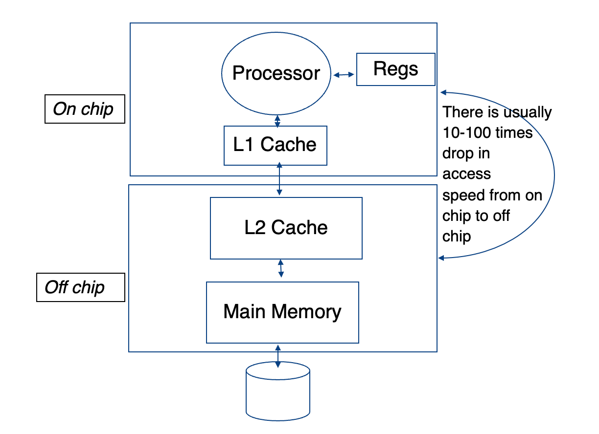
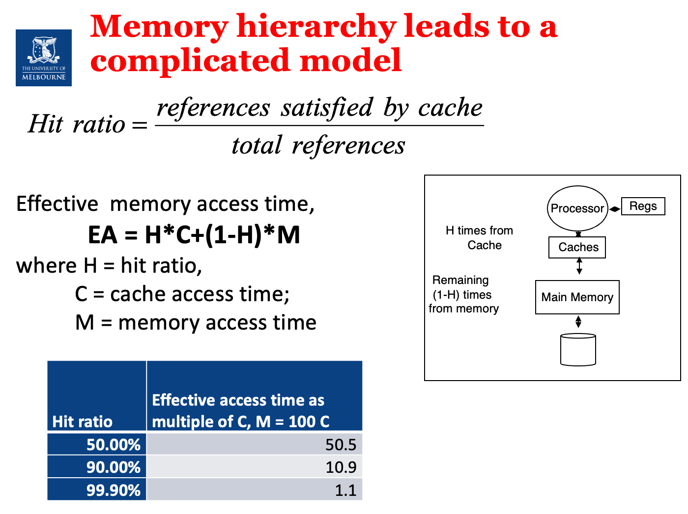
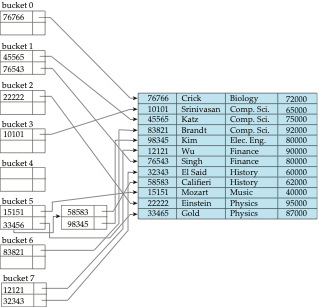

# Advanced Database Systems (COMP90050)

## Week 1

### Modelling Disk Access 
Disk access time = seek time + rotational delay + (transfer length / bandwidth)

- Seek time: the time it takes to locate the requested sector on the disk.
- Rotational delay: the time it takes to rotate the disk to the correct position.
- Transfer length: the number of bytes to be transferred.
- Bandwidth: the maximum rate of data transfer.

### HDD vs SSD
| **Feature**       | **HDD**                           | **SSD**                           |
|-------------------|-----------------------------------|-----------------------------------|
| **Storage Type**  | Magnetic disks                    | Flash memory                      |
| **Speed**         | Slower (100MB/s to 200MB/s)        | Faster (500MB/s to 5000MB/s+)     |
| **Durability**    | Less durable, susceptible to damage | More durable, resistant to shocks |
| **Capacity**      | Larger capacities (up to 10TB+)    | Smaller capacities (up to 4TB+)   |
| **Noise**         | Noisy due to moving parts          | Silent                           |
| **Power Consumption** | Higher power consumption        | Lower power consumption           |
| **Cost**          | More affordable for large storage | More expensive per GB             |
- SSD do not have seek and rotation delays.
- Moore’s law: memory chip capacity doubles every 18 months since 1970
- Joy’s law for processors: processor performance doubles every two years since 1984

### Disk Access Time
1. For HDD: 
- Disk Access Time = Seek Time + Rotational Delay + Transfer Time
2. For SSD: 
- Disk Access Time = Transfer Time
3. For both, Transfer Time = Transfer Length / Bandwidth

### Hit Ratio
- Hit ratio = (Number of hits) / (Number of requests)
- Hit ratio (HR): the percentage of requests that are satisfied by the buffer.
- If the hit ratio (HB) is high, the effective access time (EA) will be closer to the buffer access time (BC), meaning accessing data will generally be fast.
- If the hit ratio is low, the access time will be closer to the disk access time (D), meaning it will take longer to access the data, as more requests will result in disk accesses instead of buffer hits.
- Effective  memory access time, EA = H*C+(1-H)*M,where H = hit ratio, C = cache access time; M = memory access time

## Week 2
### Storage Area Networks (SANs)
- A SAN is a network of storage devices that provides a single logical storage space to multiple hosts.
- SANs are used to increase storage capacity, availability, and performance.
- They are used for shared-disk file systems
- They regularly also allow for automated back up functionality
- It was the fundamental storage for data center type systems with mainframes for decades
- Different versions evolved over time to allow for more data but fundamentals are the same even today
- They came with their own networking capabilities
- We visit a version of these when we see what can be done about failures
- In a nutshell failure probability of one disk is different to 100s of disks which requires design choices

### Deductive database systems (DDBS)
- e.g. prolog

---

### Comparison Table between Nested Loop Join and Block Nested-Loop Join

| Criteria                 | Nested Loop Join (NLJ)             | Block Nested-Loop Join (BNLJ)   |
|--------------------------|------------------------------------|---------------------------------|
| **Data Access Level**     | Record-by-record                   | Block-by-block                  |
| **I/O Cost**              | High                               | Reduced                         |
| **Seeks**                 | High                               | Lower                           |
| **Memory Requirement**    | Low                                | Higher (requires memory to store a block) |
| **Best for**              | Small tables or indexed joins      | Large tables with limited memory|
| **Performance**           | Poor for large tables              | Better for large tables         |

### Worst Case Cost Estimation
- r is called the outer relation and s is the inner relation of the join.
In the worst case, if there is enough memory only to hold one block of each table, the estimated cost is:

- **Block Transfers**:  
\[
n_r \times b_s + b_r
\]

- **Seeks**:  
\[
n_r + b_r
\]

####  Calculation Example

#### **Given:**
| Table      | Records | Blocks |
|------------|---------|--------|
| `customer` | 10,000  | 400    |
| `depositor`| 5,000   | 100    |

#### **Costs:**
| Method                | Block Transfers                      | Seeks           |
|-----------------------|--------------------------------------|-----------------|
| **Nested Loop Join**   | \( 10,000 \times 100 + 400 = 1,000,400 \) | \( 10,000 + 400 = 10,400 \) |
| **Block Nested-Loop Join** | \( 400 \times 100 = 40,000 \)       | \( 400 + 100 = 500 \)  |

### Other Join Comparison

| Criteria                | Nested-Loop Join | Block Nested-Loop Join | Indexed Nested-Loop Join | Merge Join | Hash Join |
|-------------------------|------------------|------------------------|--------------------------|------------|-----------|
| **Data Access Level**    | Record-by-record | Block-by-block         | Record-by-record (with index) | Sort and merge | Partitioning and hashing |
| **I/O Cost**             | High             | Reduced                | Low                      | Low        | Low       |
| **Seeks**                | High             | Lower                  | Low                      | Low        | Low       |
| **Memory Requirement**   | Low              | Higher (for block storage) | Low                      | Moderate   | High      |
| **Best for**             | Small tables or indexed joins | Large tables with limited memory | When the inner table has an index | When both tables are sorted | Large tables where sorting is expensive |
| **Performance**          | Poor for large tables | Better for large tables | Efficient when an index exists | Very efficient for sorted data | Efficient when no natural order of data exists |

## Week 3
- Sql query will be convert to relational algebra and then convert to physical plan.
- Left deep join: the left table is processed first, then the right table is processed. This is what the optimizer will do by default.

### Heuristic optimization techniques
- Perform selections early (reduces the number of tuples)
- Perform projections early (reduces the number of attributes)
- Perform most restrictive selection and join operations (i.e. with smallest result size) before other similar operations
- Optimizers often use simple heuristics for very cheap queries, and perform exhaustive enumeration for more expensive queries

### Indexing
- Indexing mechanisms used to speed up access to desired data in a similar way to look up in a phone book
- Search Key - attribute or set of attributes used to look up records/rows in a system, like an ID of a person
- An index file consists of records (called index entries) of the form search-key, pointer to where data is
- Index files are typically much smaller than the original data files and many parts of it are already in memory

#### Order indices
search keys are stored in some order
#### Hash indices
search keys are distributed hopefully uniformly across “buckets” using a “function”

### B+ Tree
- InnoDB
[Check this out](../cliché/2.md)

## Week 4
### Hash Indexing
- Hashing is a technique used to map data of an arbitrary size to a fixed-size value, typically a number.
- The hash function takes an input of any size and produces a fixed-size output.
- The hash function should be deterministic, meaning that it should always produce the same output for the same input.

### Bitmap Indexing
- A bitmap index is a data structure that stores a set of values in a compact form, allowing for fast and efficient retrieval of values that match a given condition.
- A bitmap index is a special type of index that stores a set of values in a bitmap, where each bit represents a value in the index.
- A bitmap index is used to quickly locate the values that match a given condition, without having to search through the entire index.
- A bitmap index is typically used to speed up queries that involve a large number of values that are stored in a database.
[Check This Out](../cliché/12.md))

### Index Structures Comparison

### Index Structures Comparison

| Index Type | Data Structure | Key Characteristics | Advantages | Disadvantages | Best Use Cases |
|-----------|----------------|---------------------|------------|---------------|----------------|
| B+ Tree | Balanced Tree | Multi-way search tree All data in leaf nodes | - Disk-friendly - Efficient range queries - Stable performance | - High insert/delete overhead - Space consumption | Relational databases Ordered data Range queries |
| Hash Index | Hash Table | Direct mapping Keys to storage locations | - Fast insertion - O(1) equality queries - Compact space | - No range queries - Hash collisions - Not order-preserving | Equality lookups Caching Unique identifiers |
| Bitmap Index | Bitmap array | Represent data existence via bits | - Compressed storage - Fast bit operations - Efficient aggregation | - High update cost - Suitable for low-cardinality columns - Space overhead | Data warehouses Analytical queries Low-mutation data |
| Quadtree | Tree-based spatial division | Recursive four-way space partitioning 2D spatial indexing | - Fast spatial queries - Data clustering - Recursive division | - Unbalanced depth - Additional space overhead - Dimension-limited | Geographic Information Systems Spatial clustering Collision detection |
| K-D Tree | Binary space partitioning | Multi-dimensional space recursive division | - High-dimensional space queries - Nearest neighbor search - Dynamic adjustment | - Complex construction - Unstable performance - Curse of dimensionality | Machine learning Spatial clustering High-dimensional data |
| R-Tree | Balanced tree for spatial data | Hierarchical minimum bounding rectangles | - Efficient multi-dimensional indexing - Handles complex spatial queries - Supports overlapping regions | - Higher computational complexity - Overhead in updates - Performance degrades with high dimensionality | Geographical databases Spatial networks Location-based services |
| R+ Tree | Variant of R-Tree | No overlapping node regions | - Improved query performance - More precise spatial indexing - Reduced search space | - More complex construction - Higher maintenance cost - Less flexible with irregular data | Advanced spatial databases Precise geographic querying Complex spatial analysis |

#### In-Depth Analysis

#### B+ Tree
- Widely used in database indexing
- Maintains data order
- Supports efficient range queries

#### Hash Index
- Commonly used for fast key-value lookups
- Trades space for query speed
- Unsuitable for sorting-required scenarios

#### Bitmap Index
- Compressed storage
- Ideal for low-cardinality, infrequently updated data
- Bit operations provide efficient aggregation

#### Quadtree
- 2D space specialized indexing
- Recursive division improves query efficiency
- Common in Geographic Information Systems

#### K-D Tree
- Multi-dimensional space generic indexing
- Effective method for high-dimensional data
- Excellent for nearest neighbor search scenarios、

#### R-Tree
- Designed for multi-dimensional indexing
- Uses minimum bounding rectangles (MBR)
- Key in spatial databases and GIS
- Handles non-point spatial objects efficiently

#### R+ Tree
- Addresses R-Tree's overlapping limitations
- Ensures no node region overlap
- Provides more precise spatial querying
- Computational overhead for maintenance

## Week 5
### ACID Properties
- Atomicity: A transaction is a single unit of work that either succeeds completely or fails completely.
- Consistency: A transaction must maintain database consistency.
- Isolation: Transactions should not interfere with each other.
- Durability: Once a transaction is committed, it should remain committed even in the event of a system failure.

### Flat Transactions
- A flat transaction is a transaction that is executed as a single unit of work.
- Flat transactions do not model many real applications
- If a system fails during a flat transaction, all the changes are lost.
#### Savepoints
- Savepoints are a mechanism that allows a transaction to create a savepoint before executing a set of statements.
- If a system fails during a savepoint, all the changes made after the savepoint are lost.

## Week 6
### Some simple concurrency control approaches:
- Dekker's algorithm (write some code to guarantee exclusive access) - needs almost no hardware support, but the code turns out to be complicated to implement especially for more than two transactions/processes
- OS supported primitives (through interrupt calls) - expensive, independent of number of processes
- Spin locks (using atomic lock/unlock instructions) –common

### A semaphore is a more general concurrency control tool, more flexible than a lock. Its working mechanism can be understood as:
1. get(): Attempt to acquire the semaphore, if it is already occupied:
- If no one is waiting, "wait"
- If someone is waiting, add yourself to the waiting queue
2. give(): Release the semaphore, and:
- If there is a waiting queue, wake up the first one (FIFO)

| Feature                 | Semaphore                                        | Spin Lock                                       |
|-------------------------|--------------------------------------------------|--------------------------------------------------|
| Nature                  | Concurrency control mechanism (counting allowed) | A type of lock implementation                   |
| Thread Blocking         | Yes (threads are put to sleep while waiting)     | No (threads busy-wait without yielding CPU)     |
| Suitable Scenarios      | High-contention situations needing queuing       | Short critical sections, context switch is expensive |
| CPU Usage               | Low (waiting threads don't consume CPU)          | High (waiting threads consume CPU while spinning) |
| Wake-up Mechanism       | FIFO queue wakes the next waiting thread         | No wake-up mechanism, relies on continuous retry |
| Counting Support        | Yes (can manage multiple resources)              | No (typically only supports 1 lock)              |
| Risk of Deadlock        | Yes (misuse can lead to deadlocks)               | Yes (can hang if lock isn't properly released)   |
| Typical Implementation  | OS-level (e.g., P/V operations, wait queues)     | Atomic variables + busy-loop (user/kernel space) |
| Language Primitives     | Java's `Semaphore`, POSIX `sem_wait()`           | Atomic ops in C, custom SpinLock in Java         |
| Reentrancy              | Not reentrant by default                         | Not reentrant by default                         |

#### Semaphore is like “you queue up and wait to be called”;
#### Spin Lock is like “you keep knocking on the door until someone opens”.

### Deadlock solutions
- Have enough resources so that no waiting occurs
- Do not allow a process to wait long, simply rollback after a certain time
- Linearly order the resources and request of resources should follow this order 
- Pre-declare all necessary resources 
- Periodically check the graph for cycles

## Week 7
- When dependency graph has cycles (circular dependencies) then there is a violation of isolation and a possibility of inconsistency
- If two transactions have the same dependency graph, then they will have the same final state.

### Serial History
1. **Definition of Isolated History**:
   - A history is considered isolated if and only if it is equivalent to a serial history.
   - In other words, all transactions are executed in a sequential order.
2. **Definition of Serial History**:
   - A serial history is the result obtained by executing each transaction in sequence.
3. **Outcome of N Transactions**:
   - N transactions can produce up to N! different serial histories.
4. **Acceptability of Any Serial History**:
   - There is no need to worry about choosing which serial history to accept.
5. **Concurrent Transaction Set**:
   - Therefore, creating a concurrent transaction set that is actually equivalent to a serial history will be isolated.
### Bad Executions
1. **Transaction Order**:
   - If transaction T1 is executed before transaction T2, it is denoted as T1 << T2.
2. **Before and After Sets**:
   - Before(T) = {T' | T' << T}: Represents the set of all transactions executed before transaction T.
   - After(T) = {T' | T << T'}: Represents the set of all transactions executed after transaction T.
3. **Definition of Wormhole Transaction**:
   - If a transaction T' belongs to both Before(T) and After(T), i.e., T' ∈ Before(T) ∩ After(T), then T' is called a wormhole transaction.
   - This implies the existence of a circular dependency relationship T << T' << T.
4. **Impact of Wormhole Transactions**:
   - The presence of wormhole transactions indicates that there is no good isolation between transactions, i.e., the conditions for serial execution are not met.
   - This situation can lead to cycles in the transaction dependency graph, thereby disrupting the isolation of transactions.
5. **Wormhole Theorem**:
   - A history is isolated (isolated) if and only if it has no wormhole transactions.

## Week 8
### Lock Compatibility Matrix
#### Current Mode of Lock
| Request | Free | Shared | Exclusive |
|---------|------|--------|-----------|
| **Shared request (SLOCK)**   Used to block others writing/modifying | Compatible   Request granted immediately   Changes Mode from Free to Shared | Compatible   Request granted immediately   Mode stays Shared | Conflict   Request delayed until the state becomes compatible   Mode stays Exclusive |
| **Exclusive request (XLOCK)**   Used to block others reading or writing/modifying | Compatible   Request granted immediately   Changes Mode from Free to Exclusive | Conflict   Request delayed until the state becomes compatible   Mode stays Shared | Conflict   Request delayed until the state becomes compatible   Mode stays Exclusive |

