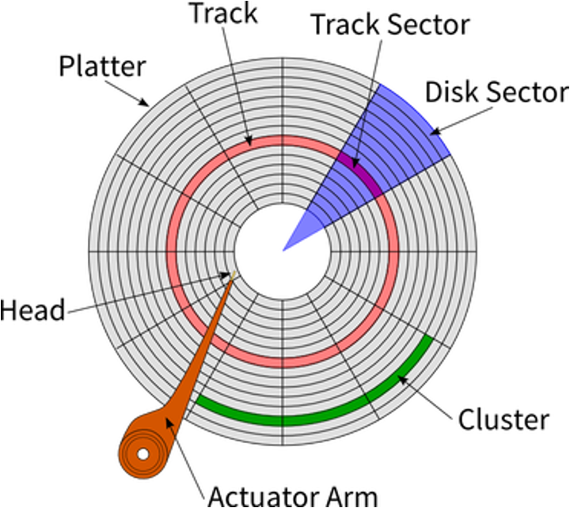
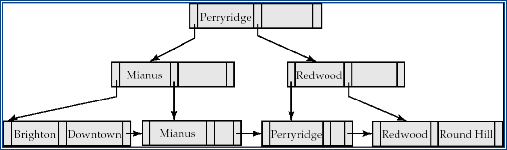
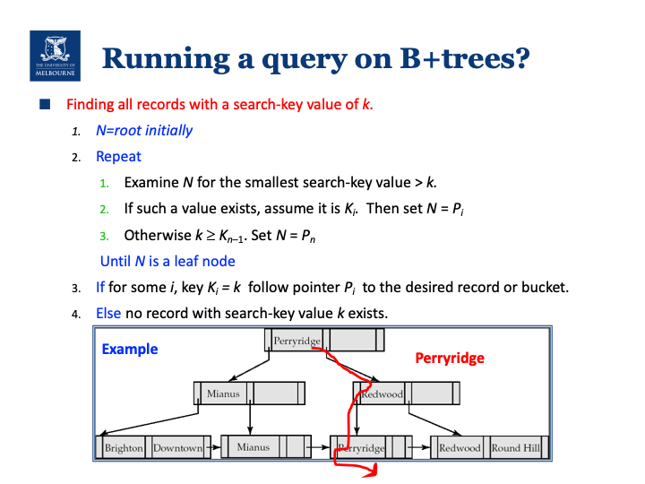
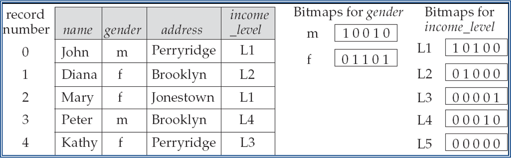
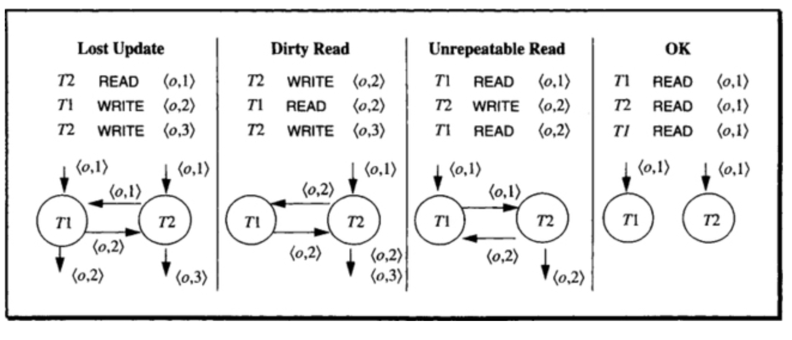
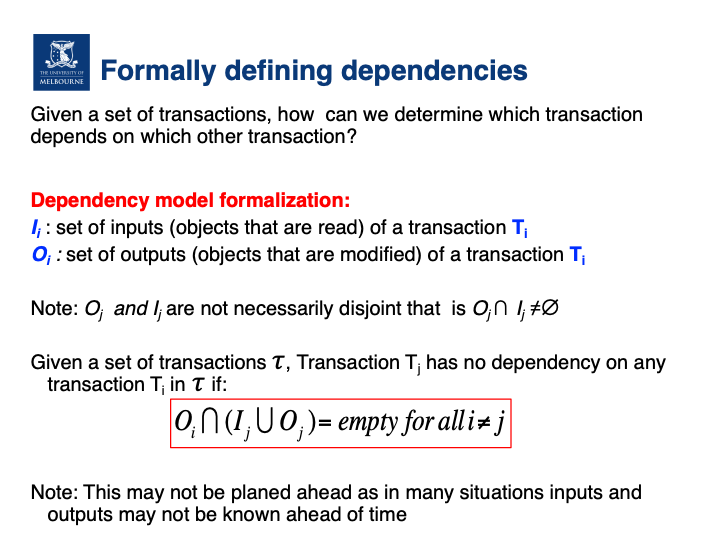
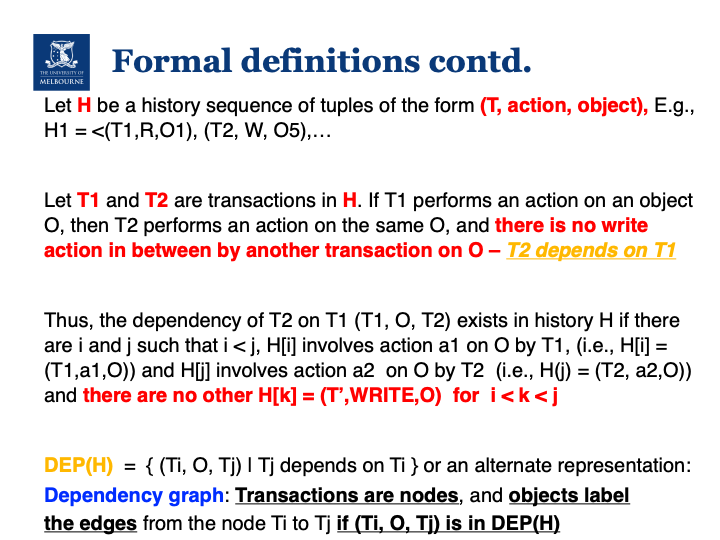
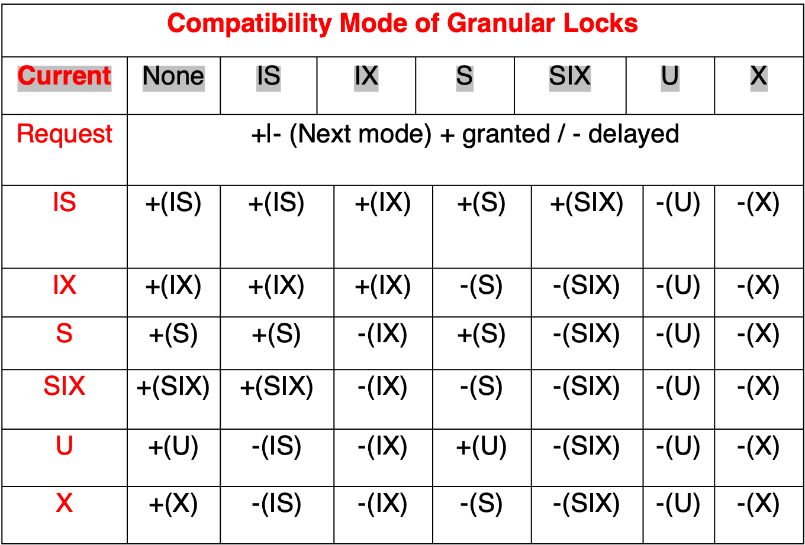
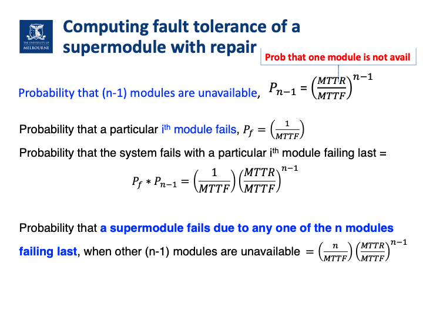
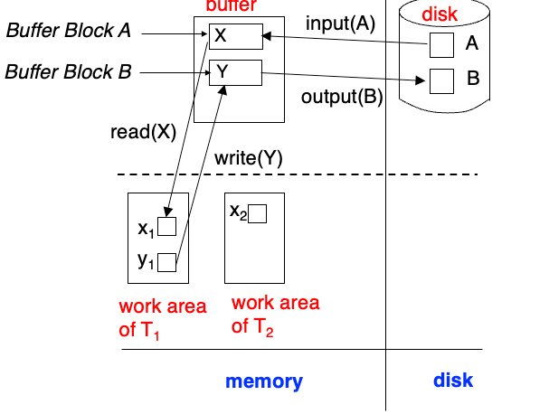

# Advanced Database Systems (COMP90050)

## Week 1
- Performance of a database system comes from **Hardware** (The speed of the processor, Number of processors, Number of drives and I/O bandwidth, Size of main memory, Communication network, Type of architecture), **Software** (Type and details of database technology used for a given application). and **Database tuning, crash recovery** (Indexing parameters, Data duplication, Sharing data)

### Disk 

- Tracks: circular path on disk surface
- Tracks are subdivided into disk sectors
- magnetic head, which reads and writes data to the platter surfaces

### Modelling Disk Access 
Disk access time = seek time + rotational delay + (transfer length / bandwidth)

- Seek time: the time the head of the actuator arm moves from a position to a required track.
- Rotational delay: the time the rotation of the disk brings the required track sector to the head of the actuator arm.
- Transfer length: the number of bytes to be transferred.
- Bandwidth: the maximum rate of data transfer.

### Disk Access Time
1. For HDD: 
- Disk Access Time = Seek Time + Rotational Delay + Transfer Time
2. For SSD: 
- Disk Access Time = Transfer Time
3. For both, Transfer Time = Transfer Length / Bandwidth

### SSD (Solid-State Drive/Solid-State Disk)
- No moving parts like Hard Disk Drive (HDD)
- Silicon rather than magnetic materials
- No seek/rotational latency
- No start-up times like HDD
- Runs silently 
- Random access of typically under 100 micro-seconds compared 2000 - 3000 micro-seconds for HDD
- Relatively very expensive, nevertheless did not effect DBMS when they were born so key design decisions remain
- Certain read/write limitations plagued it for years

- SSD do not have seek and rotation delays.
- Moore’s law: memory chip capacity doubles every 18 months since 1970

- Joy’s law for processors: processor performance doubles every two years since 1984


:::info
### HDD vs SSD
| **Feature**       | **HDD**                           | **SSD**                           |
|-------------------|-----------------------------------|-----------------------------------|
| **Storage Type**  | Magnetic disks                    | Flash memory                      |
| **Speed**         | Slower (100MB/s to 200MB/s)        | Faster (500MB/s to 5000MB/s+)     |
| **Durability**    | Less durable, susceptible to damage | More durable, resistant to shocks |
| **Capacity**      | Larger capacities (up to 10TB+)    | Smaller capacities (up to 4TB+)   |
| **Noise**         | Noisy due to moving parts          | Silent                           |
| **Power Consumption** | Higher power consumption        | Lower power consumption           |
| **Cost**          | More affordable for large storage | More expensive per GB             |
:::
- **Sequential reads** are ideal for performance-sensitive workloads because the high throughput compensates for the initial seek.
- Random reads, especially of small amounts of data, are heavily penalized by seek time, leading to poor performance.


### Hit Ratio
- **Hit ratio = (Number of hits) / (Number of requests)**, or references safisfied by cache / total references
- Hit ratio (HR): the percentage of requests that are satisfied by the buffer.
- If the hit ratio (HB) is high, the effective access time (EA) will be closer to the buffer access time (BC), meaning accessing data will generally be fast.
- If the hit ratio is low, the access time will be closer to the disk access time (D), meaning it will take longer to access the data, as more requests will result in disk accesses instead of buffer hits.
- Effective memory access time, **EA = H*C+(1-H)*M, where H = hit ratio, C = cache access time; M = memory access time**

## Week 2
### Storage Area Networks (SANs)
- A SAN is a network of storage devices that provides a single logical storage space to multiple hosts.
- SANs are used to increase storage capacity, availability, and performance.
- They are used for shared-disk file systems
- They regularly also **allow for automated back up functionality**
- It was **the fundamental storage for data center** type systems with mainframes for decades
- Different versions evolved over time to allow for more data but fundamentals are the same even today
- They came with their own **networking capabilities**
- We visit a version of these when we see what can be done about failures
- In a nutshell **failure probability of one disk is different to 100s of disks** which requires design choices

#### Communication Cost
- **transmit time = distance/c + message_bits/bandwidth**, where c = speed of light (200 million meters/sec) with fibre optics
- Today it is **hard to reduce hardware related latency** on contemporary systems further
- The key cost in latency comes from software in networking 
- So **each message length should be large** to achieve better link utilization while **keep the overall need to transfer data to a minimum**

#### Module Availability
- measures the ratio of service accomplishment to elapsed time
- **M = mean time to failure / (mean time to failure + mean time to repair)**, where Mean time to failure is the time elapsing before a failure is experienced

### Database Types
| 数据库类型 | 特点 | 优点 | 缺点 |
| --- | --- | --- | --- |
| **Simple file(s)** | 简单文本文件，每行一条记录，字段由分隔符分开 | 对简单应用非常快 | 可靠性较低，维护困难，存在并发问题 |
| **RDBS** | 表格集合，行和列组成，键用于唯一标识每行 | 数据一致性高（有事务有ACID），与具体应用无关的优化，适用于多种应用 | 对于某些特殊应用可能较慢 |
| **Object Oriented DB Systems** | 直接存储对象，可能包含数据和方法的混合体 | 适合复杂数据处理的应用 | 应用范围有限，商业系统较少采用 |
| **NoSQL** | 非关系型数据库，灵活无固定模式，支持大数据处理 | 设计简单，线性扩展性好 | 一致性妥协，可能导致读取旧版本数据 |


### Deductive database systems (DDBS)
- Allows recursion, similar to logic programming paradigm
- e.g. prolog

---

### Database Architecture
| 架构类型 (Architecture Type) | 描述 (Description)                                                                 | 优点 (Advantages)                                                                                                | 缺点 (Disadvantages)                                                                                                |
| :--------------------------- | :--------------------------------------------------------------------------------- | :---------------------------------------------------------------------------------------------------------------- | :------------------------------------------------------------------------------------------------------------------- |
| Centralized (集中式)          | 数据存储在一个中心位置。                                                            | 简单易管理，数据一致性强。                                                                                         | 单点故障风险高，可扩展性差。                                                                                         |
| Client-Server (客户端-服务器) | 客户端（请求方）向服务器（服务提供方）发送请求，服务器处理请求并返回结果。数据通常存储在服务器端。 | 结构清晰，易于管理和维护；服务器可以集中处理数据和业务逻辑；可扩展性相对较好（可增加服务器）。                               | 服务器可能成为性能瓶颈或单点故障；网络依赖性强；客户端需要安装或配置。                                                 |
| Distributed (分布式)          | 数据分布在多个节点上，可以位于不同地点，节点间可能协同工作。                                | 高可用性，负载均衡，容错能力强；可扩展性好。                                                                       | 复杂度高，一致性维护困难（如CAP理论），网络延迟可能影响性能。                                                           |
| WWW (万维网)                 | 数据分散在世界各地，有多个所有者，缺乏统一组织结构。                                        | 资源极其丰富，访问极其广泛，用户界面统一（浏览器）。                                                               | 组织结构松散，安全性低，数据质量参差不齐，难以保证一致性和可靠性。                                                     |
| Grid (网格)                  | 类似于分布式，但每个节点管理自己的资源，并遵循一定规则或协议进行协作。                          | 资源共享，协同工作能力强；可扩展性好；容错性较好。                                                                   | 结构复杂，管理难度大，部署和维护成本高。                                                                             |
| P2P (点对点)                 | 与Grid类似，但节点地位平等，可以自由加入或离开网络，资源共享更自由。                            | 自由度高，去中心化，抗单点故障能力强。                                                                             | 安全性和稳定性较差，资源查找效率可能不高，难以进行集中管理。                                                           |
| Cloud (云计算)               | Grid的泛化版，资源（计算、存储等）作为服务按需获取，通常由第三方公司运营和管理。                  | 弹性伸缩，按需付费，成本低廉（通常），易于管理（对用户而言）。                                                           | 依赖互联网连接，隐私和数据安全问题（可能受制于服务商），服务可用性依赖于提供商。                                         |

### Simple Nested Loop Join
```
for each tuple tr in r do begin
	for each tuple ts  in s do begin
		test pair (tr,ts) to see if they satisfy the join condition theta 
		if they do, add tr • ts to the result.
	end
end
```
- r is called the outer relation and s the inner relation of the join.
- Expensive since it examines every pair of tuples in the two relations.


### Nested Loop Join and Block Nested-Loop Join

| Criteria                 | Nested Loop Join (NLJ)             | Block Nested-Loop Join (BNLJ)   |
|--------------------------|------------------------------------|---------------------------------|
| **Data Access Level**     | Record-by-record                   | Block-by-block                  |
| **I/O Cost**              | High                               | Reduced                         |
| **Seeks**                 | High                               | Lower                           |
| **Memory Requirement**    | Low                                | Higher (requires memory to store a block) |
| **Best for**              | Small tables or indexed joins      | Large tables with limited memory|
| **Performance**           | Poor for large tables              | Better for large tables         |

### Worst Case Cost Estimation
- r is called the outer relation and s is the inner relation of the join.
In the worst case, if there is enough memory only to hold one block of each table, the estimated cost is:

#### Calculation Example

#### **Given:**
| Table      | Records | Blocks |
|------------|---------|--------|
| `customer` | 10,000  | 400    |
| `depositor`| 5,000   | 100    |

#### **Costs:**
| Method                | Block Transfers                      | Seeks           |
|-----------------------|--------------------------------------|-----------------|
| **Nested Loop Join**   | 10,000 * 100 + 400 = 1,000,400 | 10,000 + 400 = 10,400 |
| **Block Nested-Loop Join** | 400 * 100 = 40,000       | 400 + 100 = 500  |

- Nested Loop Join 会遍历 customer 表的每一行，然后对每一行都扫描整个 depositor 表，因此它的 Block Transfers 和 Seeks 都非常高。
- Block Nested-Loop Join 会以块为单位处理 customer 表，减少了对 depositor 表的重复扫描次数，因此它的 Block Transfers 和 Seeks 都显著降低。

### Other Join Comparison

| Criteria                | Nested-Loop Join | Block Nested-Loop Join | Indexed Nested-Loop Join | Merge Join | Hash Join |
|-------------------------|------------------|------------------------|--------------------------|------------|-----------|
| **Data Access Level**    | Record-by-record | Block-by-block         | Record-by-record (with index) | Sort and merge | Partitioning and hashing |
| **I/O Cost**             | High             | Reduced                | Low                      | Low        | Low       |
| **Seeks**                | High             | Lower                  | Low                      | Low        | Low       |
| **Memory Requirement**   | Low              | Higher (for block storage) | Low                      | Moderate   | High      |
| **Best for**             | Small tables or indexed joins | Large tables with limited memory | When the inner table has an index | When both tables are sorted | Large tables where sorting is expensive |
| **Performance**          | Poor for large tables | Better for large tables | Efficient when an index exists | Very efficient for sorted data | Efficient when no natural order of data exists |

## Week 3
- Sql query will be convert to relational algebra and then convert to physical plan.
- Left deep join: the left table is processed first, then the right table is processed. This is what the optimizer will do by default.

### Benefits of Relational Algebra and how to generate alternatives
- Query optimizers use **equivalence rules** to systematically generate expressions equivalent to a given expression 
- SQL does not give this power as it defines what you want to get and not how you get it (good for the user but not for the machine)
- And hence relational algebra is used, which is a procedural language and deals with the “how” part
- One can generate all equivalent expressions exhaustively given a relational algebra expression, but it is very expensive in space and time for complex queries
- So most systems take short cuts, i.e. consider only some plans


### Heuristic and exhaustive optimization techniques
- Perform selections early (reduces the number of tuples)
- Perform projections early (reduces the number of attributes)
- Perform most restrictive selection and join operations (i.e. with smallest result size) before other similar operations
- **Optimizers often use simple heuristics for very cheap queries, and perform exhaustive enumeration for more expensive queries**

### Indexing (A key choice to make for optimization)
- Indexing mechanisms used to speed up access to desired data in a similar way to look up in a phone book
- Search Key - attribute or set of attributes used to look up records/rows in a system, like an ID of a person
- An index file consists of records (called index entries) of the form search-key, pointer to where data is
- Index files are typically much smaller than the original data files and many parts of it are already in memory

#### Order indices
- search keys are stored in some order
#### Hash indices (more on start of week 4)
- search keys are distributed hopefully uniformly across “buckets” using a “function”
- A hash index organizes the search keys, with their associated record pointers, into a hash file structure. Order is not important.
- Hash indices are **always secondary indices**.
- Given a key the aim is to find the related record on file in **one shot** which is important.
- An ideal hash function is **uniform**, i.e., each bucket is assigned the same number of search-key values from the set of all possible values.
- Ideal hash function is **random**, so each bucket will have the same number of records assigned to it irrespective of the actual distribution of search-key values in the file.
- Typical hash functions perform computation on the internal binary representation of the search-key. 


#### What gets faster with index?
- Disk access, insertions, deletions, space overhead

---
### B+ Tree
- InnoDB default index type
- Automatically reorganizes itself with small, local, changes, in the face of insertions and deletions.  
- Reorganization of entire file is not required to maintain performance.
- Most of the higher level nodes of a B+tree would be in main memory already!
- [Check this out](../cliché/2.md)




- Leaf nodes in a B+-tree file organization store records, instead of pointers
   - Helps keep data records clustered even when there are insertions/deletions/updates
- pointers support range queries

#### Metrics
- If there are K search-key values in the file, the height of the tree is no more than log[n/2](K) and it would be balanced, where n is the number of search-key values per node 一个节点最多的子节点数（即树的“阶”.
- A node is generally the same size as a disk block, typically 4 kilobytes
   - and n is typically around 100 (40 bytes per index entry).
- With 1 million search key values and n = 100
   - log50(1,000,000) = 4 nodes are accessed in a lookup.
- Contrast this with a balanced binary tree with 1 million search key values — around 20 nodes are accessed in a lookup
   - above difference is significant since every node access may need a disk I/O, costing around 20 milliseconds


## Week 4
### Hash Indexing
- Hashing is a technique used to map data of an arbitrary size to a fixed-size value, typically a number.
- The hash function takes an input of any size and produces a fixed-size output.
- The hash function should be deterministic, meaning that it should always produce the same output for the same input.


### Bitmap Indexing
- A bitmap index is a data structure that stores a set of values in a compact form, allowing for fast and efficient retrieval of values that match a given condition.
- Applicable on attributes that take on a relatively small number of distinct values, used for business analysis
- A bitmap index is used to quickly locate the values that match a given condition, without having to search through the entire index.
- A bitmap index is typically used to speed up queries that involve a large number of values that are stored in a database.
- 
- [Check This Out](../cliché/12.md)

### Index Structures Comparison
| Index Type | Data Structure | Key Characteristics | Advantages | Disadvantages | Best Use Cases |
|-----------|----------------|---------------------|------------|---------------|----------------|
| B+ Tree | Balanced Tree | Multi-way search tree<br>All data in leaf nodes | - Disk-friendly<br>- Efficient range queries<br>- Stable performance | - High insert/delete overhead<br>- Space consumption | Relational databases<br>Ordered data<br>Range queries |
| Hash Index | Hash Table | Direct mapping<br>Keys to storage locations | - Fast insertion<br>- O(1) equality queries<br>- Compact space | - No range queries<br>- Hash collisions<br>- Not order-preserving | Equality lookups<br>Caching<br>Unique identifiers |
| Bitmap Index | Bitmap array | Represent data existence via bits | - Compressed storage<br>- Fast bit operations<br>- Efficient aggregation | - High update cost<br>- Suitable for low-cardinality columns<br>- Space overhead | Data warehouses<br>Analytical queries<br>Low-mutation data |
| Quadtree | Tree-based spatial division | Recursive four-way space partitioning<br>2D spatial indexing | - Fast spatial queries<br>- Data clustering<br>- Recursive division | - Unbalanced depth<br>- Additional space overhead<br>- Dimension-limited | Geographic Information Systems<br>Spatial clustering<br>Collision detection |
| K-D Tree | Binary space partitioning | Multi-dimensional space recursive division | - High-dimensional space queries<br>- Nearest neighbor search<br>- Dynamic adjustment | - Complex construction<br>- Unstable performance<br>- Curse of dimensionality | Machine learning<br>Spatial clustering<br>High-dimensional data |
| R-Tree | Balanced tree for spatial data | Hierarchical minimum bounding rectangles | - Efficient multi-dimensional indexing<br>- Handles complex spatial queries<br>- Supports overlapping regions | - Higher computational complexity<br>- Overhead in updates<br>- Performance degrades with high dimensionality | Geographical databases<br>Spatial networks<br>Location-based services |
| R+ Tree | Variant of R-Tree | No overlapping node regions | - Improved query performance<br>- More precise spatial indexing<br>- Reduced search space | - More complex construction<br>- Higher maintenance cost<br>- Less flexible with irregular data | Advanced spatial databases<br>Precise geographic querying<br>Complex spatial analysis |

#### In-Depth Analysis

#### B+ Tree
- Widely used in database indexing
- Maintains data order
- Supports efficient range queries

#### Hash Index
- Commonly used for fast key-value lookups
- Trades space for query speed
- Unsuitable for sorting-required scenarios

#### Bitmap Index
- Compressed storage
- Ideal for low-cardinality, infrequently updated data
- Bit operations provide efficient aggregation

#### Quadtree
- 2D space specialized indexing
- Recursive division improves query efficiency
- Common in Geographic Information Systems
- 典型的 Quadtree 实现中，其叶节点通常代表一个空间区域，该区域最终只包含一个数据点

#### K-D Tree
- Multi-dimensional space generic indexing
- Effective method for high-dimensional data
- Excellent for nearest neighbor search scenarios、

#### R-Tree
- Designed for multi-dimensional indexing
- Uses minimum bounding rectangles (MBR)
- Key in spatial databases and GIS
- Handles non-point spatial objects efficiently
- Bounding boxes of children of a node are allowed to overlap, multiple paths may need to be searched due to overlaps
- To find data items intersecting a given query point/region, do the following, starting from the root node:
   - If the node is a leaf node, output the data items whose keys intersect the given query point/region.
   - Else, for each child of the current node whose bounding box intersects the query point/region, recursively search the child.

#### R+ Tree
- Addresses R-Tree's overlapping limitations by ensuring no node region overlap
- Ensures no node region overlap
- Provides more precise spatial querying
- Computational overhead for maintenance

## Week 5
### ACID Properties
- Atomicity: A transaction is a single unit of work that **either succeeds completely or fails completely**.
- Consistency: A transaction must maintain database **consistency**.
- Isolation: Transactions should **not interfere with each other**.
- Durability: Once a transaction is committed, it should **remain committed** even in the event of a system failure.

### Flat Transactions
- A flat transaction is a transaction that is executed as a single unit of work.
- Flat transactions do not model many real applications
- If a system fails during a flat transaction, all the changes are lost.
#### Savepoints
- a mechanism that allows a transaction to create a savepoint before executing a set of statements.
- If a system fails during a savepoint, all the changes made after the savepoint are lost.
#### Nested Transactions
- Commit Rules:
   - A subtransaction can either commit or abort, however, commit cannot take place unless the parent itself commits.
   - Subtransactions have A, C, and I properties but not D property unless all its ancestors commit.
   - Commit of subtransaction makes its results available only to its parents.
- Rollback Rules:
   - If a subtransaction rolls back, all its children are forced to roll back.
- Visibility Rules:
   - Changes made by a subtransaction are visible to the parent only when it commits. 
   - All objects of parent are visible to its children. 
   - Implication of this is that the **parent should not modify objects while children are accessing them**. [This is not a problem as parent does not run in parallel with its children.]

#### How do Transactions get to run: Monitors
- The main function of a **Transaction Processing Monitor** is to integrate system components and manage resources so that transactions can run:
   - TP monitors manage the transfer of data between clients and servers
   - Breaks down applications or code into transactions and ensures that all the database(s) are updated properly
   - It also takes appropriate actions if any error occurs
#### TP Monitor Services
- Terminal management: Since many terminals run client software, the TP monitor should provide appropriate **ACID properties between the client and the server processes**
- Presentation service: this is similar to terminal management in the sense it has to **deal with different presentation (user interface) software**
- Context management:  E.g. maintaining the sessions etc. 
- Start/Restart: Note: there is no difference between start and restart in TP based systems 
- Heterogeneity: If the application needs access to different DB systems, local ACID properties of individual DB systems is not sufficient. **Local TP monitor needs to interact with other TP monitors to ensure the overall ACID properties.**
- Control communications: If the application communicates with other remote processes, the local TP monitor should **maintain the communication status among the processes to be able to recover from a crash.**
| 模块                     | 主要职责                  |
| ---------------------- | --------------------- |
| Terminal Management    | 管理客户端与服务器之间事务的一致性     |
| Presentation Service   | 管理不同用户界面与后台服务之间的数据一致性 |
| Context Management     | 跟踪用户会话和事务上下文          |
| Start/Restart          | 系统故障恢复与事务一致性保障        |
| Heterogeneity          | 支持跨多个数据库的分布式事务一致性     |
| Control Communications | 管理远程通信状态，支持事务恢复       |

- using a single process for all the transaction processing monitor services is bad since **One error in the process can impact all the transactions. This could lead to poor performance as well as monitors of different transactions cannot be distributed either.**

## Week 6
### Some simple concurrency control approaches:
- Dekker's algorithm (write some code to guarantee exclusive access) - **needs almost no hardware support, but the code turns out to be complicated to implement** especially for more than two transactions/processes
   - takes storage space
   - uses busy waiting
   - efficient if the lock contention is low (that is frequency of access to the locks)
- OS supported primitives (through interrupt calls) - **expensive, independent of number of processes**
   - OS supported primitives such as lock and unlock 
   - need no special hardware
   - do not use busy waiting and therefore more effective sometimes
- Spin locks (using atomic lock/unlock instructions) – **common**
   - efficient for low lock contentions - many DBMSs systems use them
   - uses busy waiting
   - Need some hardware support 
      - Should be able to lock bus (communication channel between CPU and memory + any other devices) for two memory cycles (one for reading and one for writing). 
      - During this time no other devices’ access is allowed to this memory location

### Compare and swap
- 使用Compare and Swap操作可以在多线程环境中安全地实现变量的更新，避免了竞态条件和数据不一致的问题。

| 特性             | 自旋锁 (Spinlock)                      | Compare-and-Swap (CAS)                 |
| :--------------- | :------------------------------------- | :------------------------------------- |
| **本质**         | 一种同步锁机制/数据结构                | 一种原子操作/指令                      |
| **目的**         | 保护临界区，确保互斥访问              | 原子地比较并更新内存中的值             |
| **获取失败行为** | 忙等待（循环不断尝试获取锁）           | 立即返回结果（成功或失败，可能带旧值） |
| **线程状态**     | 获取失败时，线程保持运行状态，占用CPU | 通常用于无锁算法，线程自行决定后续操作 |
| **资源消耗**     | 长时间持有锁时，浪费CPU资源           | 单次操作开销小，但循环使用CAS会消耗CPU |
| **实现方式**     | 通常使用 CAS 或 Test-and-Set 等原子操作 | 现代CPU通常提供硬件支持               |
| **适用场景**     | 锁持有时间短、竞争不激烈               | 实现无锁/低锁结构、原子变量、乐观锁   |
| **主要优势**     | 锁获取成功后延迟低（无上下文切换）     | 无锁，避免阻塞和上下文切换，可伸缩性好 |
| **主要劣势**     | 竞争激烈或持有时间长时效率低，耗CPU   | 实现复杂，可能发生无限重试（ABA问题）  |
| **关系**         | CAS 常被用作自旋锁的实现基础          | CAS 是一种底层原子操作，可用于构建锁   |

| 特性         | Test-and-Set (TAS)                     | Compare-and-Swap (CAS)                                   |
| :----------- | :------------------------------------- | :------------------------------------------------------- |
| **基本操作** | 读取并设置固定值 (通常是 true/1)        | 比较期望值，若匹配则更新为新值                            |
| **灵活性**   | 低，总是设置固定值                      | 高，可以检查任意期望值并更新为任意新值                    |
| **所需参数** | 通常只需内存地址                        | 需要内存地址、期望值、新值                                |
| **返回值**   | 原始值 (用于判断是否成功获取锁)         | 通常返回操作是否成功 (布尔值)，有时也返回旧值             |
| **主要用途** | 实现简单的自旋锁                        | 实现自旋锁、无锁数据结构、原子变量、乐观锁等             |
| **复杂度**   | 较简单                                  | 相对复杂一些                                              |
| **硬件支持** | 许多处理器支持                          | 现代处理器普遍支持                                        |
| **关系**     | 可以用 CAS 来实现 TAS (CAS(addr, 0, 1)) | CAS 是更通用的原子操作，TAS 可以看作是 CAS 的一个特例 |
**总结:**
*   **TAS** 更简单直接，适合实现非常基础的锁机制。它的行为是“尝试获取锁：如果没被占，我就占；如果被占，我知道了”。
*   **CAS** 更强大灵活，它说“尝试更新：只有当当前状态是我预期的样子时，我才把它改成新的样子；否则我就放弃这次更新，并告诉你实际情况”。这种条件性的原子更新能力使得 CAS 在构建复杂并发结构时非常有用。


### A semaphore is a more general concurrency control tool, more flexible than a lock. Its working mechanism can be understood as:
1. get(): Attempt to acquire the semaphore, if it is already occupied:
- If no one is waiting, "wait"
- If someone is waiting, add yourself to the waiting queue
2. give(): Release the semaphore, and:
- If there is a waiting queue, wake up the first one (FIFO)

| Feature                 | Semaphore                                        | Spin Lock                                       |
|-------------------------|--------------------------------------------------|--------------------------------------------------|
| Nature                  | Concurrency control mechanism (counting allowed) | A type of lock implementation                   |
| Thread Blocking         | Yes (threads are put to sleep while waiting)     | No (threads busy-wait without yielding CPU)     |
| Suitable Scenarios      | High-contention situations needing queuing       | Short critical sections, context switch is expensive |
| CPU Usage               | Low (waiting threads don't consume CPU)          | High (waiting threads consume CPU while spinning) |
| Wake-up Mechanism       | FIFO queue wakes the next waiting thread         | No wake-up mechanism, relies on continuous retry |
| Counting Support        | Yes (can manage multiple resources)              | No (typically only supports 1 lock)              |
| Risk of Deadlock        | Yes (misuse can lead to deadlocks)               | Yes (can hang if lock isn't properly released)   |
| Typical Implementation  | OS-level (e.g., P/V operations, wait queues)     | Atomic variables + busy-loop (user/kernel space) |
| Language Primitives     | Java's `Semaphore`, POSIX `sem_wait()`           | Atomic ops in C, custom SpinLock in Java         |
| Reentrancy              | Not reentrant by default                         | Not reentrant by default                         |

#### Semaphore is like “you queue up and wait to be called”;
#### Spin Lock is like “you keep knocking on the door until someone opens”.

### Deadlock solutions
- In a deadlock, each process in the deadlock is **waiting for another to release the resources** it wants.
- Have enough resources so that no waiting occurs, but not practical
- Do not allow a process to wait long, simply **rollback after a certain time**
- Linearly order the resources and **request of resources should follow this order**
- **Pre-declare all necessary resources** 
- **Periodically check the graph for cycles**
- Allow waiting for a maximum time on a lock then force Rollback

### Recall that we want Concurrency
- achieve isolation by sequentially processing each transaction 
   - not efficient
      - Provides poor response times
      - Wastes useful resources by not allowing transactions to use them
- Concurrent execution should:
   - still make sense/work
   - not cause application programs (transactions) to malfunction
   - not have lower throughput or bad response times than serial execution

## Week 7
### Dependency model 
- Concurrency control is about finding/addressing all the associated problems
- need to define what actions and what objects in multiple concurrent transactions can cause a problem: **dependency graph**
- **Read-Read dependency does not affect Isolation**
- When dependency graph has cycles (circular dependencies) then there is a violation of isolation and a possibility of inconsistency
- If two transactions have the same dependency graph, then they will have the same final state.


#### Define dependencies


- Given two histories H1 and H2, H1 and H2 are equivalent if DEP(H1) = DEP(H2)
- This implies that a given database will end up in **exactly the same final state by executing either of the sequence of operations in H1 or H2**
- 从历史序列 H1 根据定义求出 DEP(H1)，方法是枚举所有操作对，只要满足对象相同、顺序正确且中间没有写操作，就形成依赖
   - example
   ```
   H = ⟨(T1, R, O1), (T3, W, O5), (T3, W, O1), (T2, R, O5),
     (T2, W, O2), (T5, R, O4), (T1, R, O2), (T5, R, O3)⟩
   ```
   1. **T1 R O1**
   → 后面 T3 W O1 → 冲突：T1 → T3 ✅
   2. **T3 W O5**
   → 后面 T2 R O5 → 冲突：T3 → T2 ✅
   - 3. **T2 W O2**
   → 后面 T1 R O2 → 冲突：T2 → T1 ✅
   - 所以 `DEP (H) = < T 1, O1, T 3 >, < T 3, O5, T 2 >, < T 2, O2, T 1 >`

### Serial History
- A history is considered isolated if and only if it is equivalent to a serial history.
- In other words, all transactions are executed in a sequential order.
- A serial history is the result obtained by executing each transaction in sequence.
- N transactions can produce up to N! different serial histories.
- There is no need to worry about choosing which serial history to accept.
- So **creating a concurrent transaction set that is actually equivalent to a serial history will be isolated.**

### Bad Executions: Wormhole
1. **Transaction Order**:
   - If transaction T1 is executed before transaction T2, it is denoted as T1 << T2.
2. **Before and After Sets**:
   - Before(T) = {T' | T' << T}: Represents the set of all transactions executed before transaction T.
   - After(T) = {T' | T << T'}: Represents the set of all transactions executed after transaction T.
3. **Definition of Wormhole Transaction**:
   - If a transaction T' belongs to both Before(T) and After(T), i.e., T' ∈ Before(T) ∩ After(T), then T' is called a wormhole transaction.
   - This implies the existence of a circular dependency relationship T << T' << T.
4. **Impact of Wormhole Transactions**:
   - The presence of wormhole transactions indicates that there is no good isolation between transactions, i.e., the conditions for serial execution are not met.
   - This situation can lead to cycles in the transaction dependency graph, so disrupting the isolation of transactions.
5. **Wormhole Theorem**:
   - A history is isolated (isolated) if and only if it has no wormhole transactions.

#### To avoid wormhole
- use locks to make sure access is done in an orderly fashion, but need think about:
   - types of locks we get 
   - how and when we get locks considering the progression of the transaction
   - also paying attention to how we release the locks and when
- avoid cycles in the dependency graph

### Lock Compatibility Matrix
- 如果当前某个事务已经持有一个对象的锁，而你请求的锁与之不兼容，那你就不能获得锁，必须等待
- 共享锁又叫读锁（允许其他读，不允许写），独占锁又叫写锁（不允许其他读写）
#### Current Mode of Lock
| Request | Free | Shared | Exclusive |
|---------|------|--------|-----------|
| **Shared request (SLOCK)** <br> Used to block others writing/modifying | Compatible <br> Request granted immediately <br> Changes Mode from Free to Shared | Compatible <br> Request granted immediately <br> Mode stays Shared | Conflict <br> Request delayed until the state becomes compatible <br> Mode stays Exclusive |
| **Exclusive request (XLOCK)** <br> Used to block others reading or writing/modifying | Compatible <br> Request granted immediately <br> Changes Mode from Free to Exclusive | Conflict <br> Request delayed until the state becomes compatible <br> Mode stays Shared | Conflict <br> Request delayed until the state becomes compatible <br> Mode stays Exclusive |

### Locking Theorem
- A transaction is **two phase** if its all lock operations precede its unlock operations.
- **Locking theorem**: If all transactions are well formed and two-phased, then any legal history will be isolated. Otherwise possible wormhole transactions.
- **Rollback theorem**: An update transaction that does an UNLOCK and then  does a ROLLBACK is not two phase. 


### Two-Phase Locking (2PL) and Strict Two-Phase Locking (S2PL)
- **two-phase locking guarantee serializability**, with two-phase we want to prevent transactions from getting in-between each other and causing cycles in the dependencies basically, 都是悲观锁
- “没有缩小阶段”（no shrinking phase）是指在 S2PL，一旦事务获得了所需的锁，它就不会在事务执行过程中释放这些锁
- Locks must be released when commit/abort happens
- Reduces concurrency and efficiency further。牺牲部分并发性来换取更强的一致性保障，特别是防止级联回滚
- preventing cascading aborts 级联回滚:
   - 当一个事务的中止导致多个事务回滚并且浪费工作，因为它们读取了一个被中止事务写入的对象时，这种情况下，S2PL是一个更好的选择，因为它可以减少资源的浪费
| 特性            | 普通 2PL            | **严格 2PL (S2PL)**            |
| ------------- | ----------------- | ---------------------------- |
| **锁的释放时机**    | 可在事务中途释放          | **必须在 commit 或 abort 时统一释放** |
| **是否有“缩小阶段”** | ✅ 有缩小阶段           | ❌ 没有缩小阶段                     |
| **是否防止级联回滚**  | ❌ 不一定（可能读取未提交的数据） | ✅ 可以防止（不允许读未提交的数据）           |
| **并发性**       | 相对较高              | 更低（锁保留时间更长）                  |
| **实现复杂度**     | 较低                | 稍高                           |
| **常见使用场景**    | 适用于某些可容忍回滚的并发系统   | 适用于需严格隔离和避免错误传播的系统           |


#### Phantoms
- commonly occur when we lock records but another transaction adds a new record
- So reading the same table twice from one transaction presents two different sets of records as the other has inserted some in the meantime
- **Predicate locks** solve this problem. Rather than locking records, lock based on condition
- **Page Locks** can solve this problem too. In this case, the storage should be organized based on values of attributes.
- High volume systems use specialized locking mechanisms as well:
   - Key Range Locks: to protect b-trees completeness
   - Hole Locks: to protect space for uncommitted deletes

## Week 8
### Degrees of Isolation
| Degree | 保证内容            | 对应 SQL 隔离级别                            |
| ------ | --------------- | -------------------------------------- |
| 0      | 事务仅保证 **不写脏数据** | 低于 `Read Uncommitted`                  |
| 1      | 不写脏数据，**不读脏数据** | `Read Uncommitted`/接近 `Read Committed` |
| 2      | + 不可重复读         | `Read Committed`（接近）                   |
| 3      | + 无幻读，完整可串行化    | `Serializable`                         |

| Isolation Level                       | Problems Avoided | Description                                                |
| -------------------------- | -------------- | ------------------------------------------------- |
| **Read Uncommitted**（Read Uncommitted） | ❌Dirty Read、❌Non-repeatable Read、❌Phantom Read | A transaction can read data that **has not been committed** by other transactions. The lowest level, data is not secure.                |
| **Read Committed**（Read Committed）   | ✅Dirty Read，❌Non-repeatable Read、❌Phantom Read | Can only read data that **has been committed** by other transactions. This is the default isolation level for SQL Server and Oracle. |
| **Repeatable Read**（Repeatable Read）  | ✅Dirty Read、✅Non-repeatable Read，❌Phantom Read | The same row data will be read consistently within a transaction. This is the default level for MySQL InnoDB.          |
| **Serializable**（Serializable）     | ✅Dirty Read、✅Non-repeatable Read、✅Phantom Read | The highest isolation level, transactions are executed completely serially, with the lowest efficiency but the highest consistency. Usually implemented through locking or range query control.       |

| Exception                             | Explanation                                          |
| ------------------------------ | ------------------------------------------- |
| **Dirty Read（Dirty Read）**             | A transaction reads data modified by **an uncommitted transaction**.                    |
| **Non-repeatable Read（Non-repeatable Read）** | A transaction reads the same data twice, with different results (because another transaction updated and committed the data).        |
| **Phantom Read（Phantom Read）**           | A transaction executes the same query twice, seeing "phantom" rows added (because another transaction inserted new rows). |

### Granularity of Locks
| Lock Granularity                   | Description                        | Concurrency | System Overhead |
| --------------------- | ------------------------- | --- | ---- |
| **Database-level Lock**             | Locks the entire database. The coarsest, suitable for management tools or backup operations. | Lowest  | Smallest   |
| **Table-level Lock (Table Lock)**   | Locks an entire table, preventing other transactions from writing or reading and writing.     | Low   | Small    |
| **Page-level Lock (Page Lock)**    | Locks a page (e.g., 8KB) containing multiple rows. A compromise solution.   | Medium | Medium    |
| **Row-level Lock (Row Lock)**     | Locks a single record/row, commonly used in OLTP systems.   | High   | High    |
| **Column-level Lock (Column Lock)** | Locks a specific column, rarely used.              | Highest  | Highest   |

1. **Acquire locks from root to leaf**（从根到叶获取锁）
   - 这意味着在访问或修改数据时，应该首先获取较高层次的锁（例如目录或父节点），然后再逐步获取较低层次的锁（例如子节点或叶子节点）。这样做可以确保在整个数据结构上的锁定顺序一致，避免死锁的发生。
2. **Release locks from leaf to root**（从叶到根释放锁）
   - 这表示在完成数据操作后，应该先释放最低层次的锁（叶子节点），然后逐步向上释放较高层次的锁（直到根节点）。这样可以确保在释放锁的过程中，数据的完整性得到维护，同时减少锁持有的时间，提高系统的并发性能。

### Lock Type (从排他性弱到强)
| Lock Type | Full Name                               | Description                                                                                                                                                                         |
| --------- | --------------------------------------- | ----------------------------------------------------------------------------------------------------------------------------------------------------------------------------------- |
| **IS**    | Intent Shared（Intent Shared Lock）       | Indicates that the transaction **intends** to add a shared lock at a finer granularity (e.g., row). Acts on table/page level.                                                       |
| **IX**    | Intent Exclusive（Intent Exclusive Lock） | Indicates that the transaction **intends** to add an exclusive lock at a finer granularity. Allows multiple transactions to add exclusive locks at different granularity resources. |
| **S**     | Shared Lock（Shared Lock）                | Allows multiple transactions to read simultaneously, but cannot write. Used for read operations.                                                                                    |
| **U**     | Update Lock（Update Lock）                | A "middle lock" to prevent deadlocks, used in scenarios where a read is about to become a write. At most one U lock, other transactions can share reads but cannot write.           |
| **SIX**   | Shared with Intent Exclusive            | Adds an S lock at the table level, allowing an X lock to be added at the **row level**. Typically, only one SIX lock can exist for a table.                                         |
| **X**     | Exclusive Lock（Exclusive Lock）          | Prevents other transactions from reading or modifying the resource. The transaction itself can read and write, while others cannot do anything. Used for write operations.          |


#### 加锁必须“从上到下声明意图”：保证锁的层次性和一致性
- 读操作：只要某一个父节点声明有“读意图”就够了。
- 写操作：所有父节点都要声明“写意图”。这是为了防止你在写某个对象时，上层节点没有声明写的意图，可能造成其他事务也读写同一块资源而无法检测到冲突。


### Two-Version Locking and Nested Transactions and Locking
| 特性 / Feature                          | Two-Version Locking   | Nested Transactions and Locking |
| ------------------------------------- | --------------------- | ------------------------------- |
| **目标 / Goal**                         | 提高读写并发性               | 管理嵌套事务中的锁继承与隔离                  |
| **核心机制 / Core Idea**                  | 写事务创建临时版本；其他事务读取已提交版本 | 子事务锁递归继承至父事务，由最顶层事务最终决定提交或回滚    |
| **读操作影响 / Read Delay**                | 只在提交阶段短暂阻塞            | 取决于锁粒度与子事务的并发结构                 |
| **锁继承 / Lock Inheritance**            | 无特殊继承机制               | 子事务完成后其锁会递归传递给父事务               |
| **父子事务并发 / Parent-Child Concurrency** | 不涉及事务结构               | 父事务不能与子事务并发执行；子事务可复用父事务锁        |
| **同级子事务访问 / Sibling Subtransactions** | 无需协调，同读不同版本           | 若访问同一对象，必须串行使用父事务的锁，保证串行化       |
| **适用场景 / Application Scenario**       | 高并发读 + 轻写场景           | 模块化复杂业务流程，事务嵌套较多的系统             |
| **并发性 / Read-Write Concurrency**      | 高                     | 中等，依赖锁粒度和结构                     |
| **实现复杂度 / Complexity**                | 中等到高                  | 高                               |


## Week 9 
- 乐观锁允许事务在不加锁的情况下进行，然后在提交前进行验证以确保没有事务冲突。如果有冲突，则重新执行事务。这种方法可以提高并发性和性能，尤其是在冲突较少的环境中
### Optimistic Concurrency Control and Pessmistic Concurrency Control

| Feature               | Optimistic Concurrency Control (OCC)                                 | Pessimistic Concurrency Control (PCC)                                 |
|-------------------|----------------------------------------------------|----------------------------------------------------|
| Basic Assumption             | Conflicts rarely occur                                       | Conflicts frequently occur                                       |
| Locking Strategy             | Transactions do not lock data, allowing free reading and modification                         | Transactions lock data when reading and modifying, preventing other transactions from accessing             |
| Conflict Detection Timing         | Conflict detection is performed when the transaction is committed                               | Conflict detection is performed during the execution of the transaction                             |
| Performance Impact             | Reduces lock contention, improves concurrency performance                               | Increases lock contention, may reduce concurrency performance                           |
| Applicable Scenarios             | Read-heavy, write-light, with few conflicts                               | Write-heavy, with many conflicts                             |
| Transaction Termination Frequency         | May be high, because conflict detection is performed at commit time                       | Usually low, because conflicts are prevented during the execution of the transaction                 |
| Retry Overhead             | May be high, because aborted transactions need to be retried                         | Usually low, because fewer conflicts lead to fewer aborted transactions                 |
| Implementation Technology             | Version control, shadow pages, validation, etc                             | Locking mechanism (shared locks, exclusive locks, etc)                           |

### "Backward Validation" and "Forward Validation" in OCC
| 项目            | **Backward Validation（向后验证）** | **Forward Validation（向前验证）**                   |
| ------------- | ----------------------------- | ---------------------------------------------- |
| **事务阶段**      | 当前事务即将提交                      | 当前事务正在执行或即将提交                                  |
| **当前事务创建的集合** | **读集（Read Set）**              | **写集（Write Set）**                              |
| **检查的对象**     | 与当前事务重叠的**已提交事务的写集**          | 与当前事务重叠的**仍在执行的事务的读集**                         |
| **冲突检测目标**    | 检查是否有其他事务**修改了当前事务读取过的数据**    | 检查是否有其他事务**读取了当前事务准备写入的数据**                    |
| **假设状态**      | 其他事务已完成                       | 其他事务仍**活跃中**                                   |
| **冲突处理选项**    | 通常：**中止当前事务并重试**              | - 延迟当前事务<br>- 中止冲突事务<br>- 中止当前事务<br>（**多种选择**） |
| **策略选择依据**    | 通常固定策略（如中止当前）                 | 根据系统代价或策略决策（如事务优先级、代价）                         |
| **并发性能**      | 好（冲突后处理，提升读性能）                | 更高（灵活处理写冲突，减少无谓中止）                             |
| **使用场景**      | 冲突较少或主要关注读取一致性的系统             | 写入冲突更常见、希望更细粒度控制提交策略的系统                        |

- **Backward Validation**：读完再查有没有被别人改 → 改了就失败
- **Forward Validation**：写之前看有没有人已经读了 → 冲突就选择怎么处理（退让 or 胜出）

### Time-stamp-based Concurrency Control
| 特性       | 内容                                              |
| -------- | ----------------------------------------------- |
| **相似性**  | 和 OCC 一样，需要对事务进行冲突检测和验证（Validation）             |
| **主要区别** | 验证是**持续的**，在**每个操作发生时**就立即检查合法性                 |
| **结果特性** | 一旦检测到冲突，事务**立即被中止（Abort）**，没有延迟到提交阶段            |
| **核心机制** | 依赖\*\*时间戳（Timestamp）\*\*决定事务和操作的先后顺序，从而判断操作是否合法 |

- TBCC 适合高度确定性的场景，如需要事务顺序完全一致。
- OCC 更适合大多数一般性高并发系统，如 Web 应用等。

### Comparison of Concurrency Control Schemes
| 特性       | **时间戳排序** | **两阶段加锁（2PL）** | **乐观并发控制（OCC）** |
| -------- | --------- | -------------- | --------------- |
| 控制机制     | 全局时间戳     | 加锁，遵循加锁阶段+解锁阶段 | 执行时无锁，提交前验证     |
| 死锁风险     | 无         | 有死锁风险          | 无死锁             |
| 冲突处理     | 立即中止      | 等待或依赖死锁检测      | 提交阶段统一中止        |
| 适合更新密集场景 | 不适合（中止频繁） | 很适合（中止少）       | 不适合             |
| 适合读密集场景  | 一般        | 表现一般           | 非常适合            |
| 中止概率     | 高         | 低              | 中等至高            |
| 并发性能     | 中         | 中等             | 高（如果冲突少）        |
| 实现复杂度    | 中         | 高（死锁检测+锁管理）    | 中高              |

---
### 分布式系统中的事务一致性问题如何解决 Two-phase atomic commit protocol (2PC):
- one-phase 一阶段提交协议忽略了确认与异常处理，在面对失败、冲突、或通信异常时无法保障原子性和一致性，不适合可靠的分布式数据库系统。
- 2PC is designed to allow any participant to choose to abort a transaction.
- 在多个分布式节点之间达成一致提交或中止事务的决定，确保事务的原子性（Atomicity） —— 要么所有节点都提交，要么全部回滚

| 阶段                     | 协调者操作                   | 参与者操作                                    | 要点说明                   |
| ---------------------- | ----------------------- | ---------------------------------------- | ---------------------- |
| **阶段 1**（Prepare）      | 发送 Prepare 请求           | 检查本地事务状态：<br>若能提交则记录日志并返回 Yes<br>否则返回 No | 投票结果一旦为 Yes，参与者不能再改变决定 |
| **阶段 2**（Commit/Abort） | 根据投票结果广播 Commit 或 Abort | 若收到 Commit → 提交事务<br>若收到 Abort → 回滚事务    | 所有节点达成一致，事务原子性保障       |

#### 具体操作
| 接口名称                                | 发起者 | 接收者 | 作用说明                                               |
| ----------------------------------- | --- | --- | -------------------------------------------------- |
| `canCommit(trans)`                  | 协调者 | 参与者 | 协调者询问参与者是否可以提交事务。<br>返回 `Yes` 或 `No`。              |
| `doCommit(trans)`                   | 协调者 | 参与者 | 协调者通知参与者提交事务。                                      |
| `doAbort(trans)`                    | 协调者 | 参与者 | 协调者通知参与者回滚事务。                                      |
| `haveCommitted(trans, participant)` | 参与者 | 协调者 | 参与者告知协调者其已经提交事务（用于清理协调者的状态信息）。                     |
| `getDecision(trans)` → Yes / No     | 参与者 | 协调者 | 参与者在投票 Yes 后长时间未收到回复时，请求协调者告知最终决策。<br>用于恢复宕机或消息延迟。 |

- canCommit 是第一阶段的核心接口：投票。
- doCommit 和 doAbort 是第二阶段的决策通知。
- haveCommitted 用于协助协调者垃圾回收旧事务状态。
- getDecision 是异常恢复机制的一部分，防止参与者长时间卡在“已准备”状态。


### What happens in failures…
| 失败场景                              | 应对措施或动作                                         |
| --------------------------------- | ----------------------------------------------- |
| ⏳ **协调者等待投票超时**                   | 协调者主动**中止事务**，向所有参与者发送 `doAbort` 消息以终止事务。       |
| ❓ **参与者已投票 Yes（不确定状态），但未收到协调者决策** | 参与者**不能自行决定**，必须使用 `getDecision` 向协调者查询事务结果。    |
| 📬 **协调者崩溃或消息丢失，参与者完成操作后未收到决策**   | 参与者可以**单方面中止事务**，避免无限期阻塞（这种情况依赖系统策略，可能限制单方面中止）。 |
| 📉 **协调者崩溃导致不回复参与者**              | 参与者通过超时机制调用 `getDecision` 或使用日志等待协调者恢复再获取决策。    |

- 超时机制（timeout actions） 是 2PC 中防止“永远等待”的核心手段。
- getDecision 方法 是参与者用来从协调者那里获取最终决策（commit 或 abort）。
- 协调者有最终决策权，参与者只能在明确协调者失败或长期无响应时考虑本地中止。
- 2PC 因此被称为阻塞协议，因为投票 Yes 的参与者必须等待协调者做决定。

#### General Principle: 
- If transaction T is before transaction U in their conflicting access to objects at one of the servers then:
  - They must be in that order at all of the servers whose objects are accessed in a conflicting manner by both T and U
  - Plus, the objects remain locked locally until two-phase commit ends
- 每个服务器负责对其自己的对象应用并发控制
- 分布式事务的服务器集合成员共同负责确保事务按顺序执行
- 服务器独立行动会导致死锁

#### Time-stamp ordering
- The coordinator accessed by a transaction issues a globally unique timestamp
- The timestamp is passed with each object access 
- The servers are jointly responsible for ensuring serial equivalence:
  - that is if T access an object before U, then T is before U at all objects
#### OCC
- Validation takes place in phase 1 of 2PC protocol at each server
- Transactions use a globally unique order for validation

### Transactions with replicated data
- The simple read one/write all scheme is not realistic 
  - because it **cannot be carried out if some of the servers are unavailable** which beats the purpose in many cases
- The available copies replication scheme is designed to allow some servers to be temporarily unavailable

#### one-copy serializability 
- the effect of transactions on replicated objects should be the same as if they had been performed one at a time on a single set of objects

#### Available copies replication rule
- Before a transaction commits, it checks for failures and recoveries of the RMs it has contacted, the set should not change during execution

## Week 10
### P(A) = 
- probability of a disk failing which we call event A, given a certain duration of time of use
- As time t goes to infinity P(A) approaches 1…

### Module availability
- measures the ratio of service accomplishment to elapsed time
- Mean time to failure / (Mean time to failure + mean time to repair), where Mean time to failure is the time elapsing before a failure is experienced


### RAID
- RAID (Redundant Array of Independent Disks) is a data storage virtualization technology that combines multiple physical disk drives into one or more logical units to enhance performance, reliability, and/or capacity. RAID technology achieves distributed storage and redundant backup of data across multiple disks through techniques such as striping, mirroring, and parity.
The main goals of RAID include:
1. Improving performance: By distributing data across multiple disks, RAID can increase data read and write speeds, as multiple disks can operate simultaneously.
2. Enhancing reliability: Through data redundancy, RAID can protect data in the event of disk failure, preventing data loss.
3. Expanding capacity: By combining multiple disks into a single logical unit, RAID can provide greater storage capacity than a single disk.

| RAID 级别    | 数据分布方式        | 校验信息       | 优点                         | 缺点                        | 可靠性（MTTF）说明                                      |
| :--------- | :------------ | :--------- | :------------------------- | :------------------------ | :----------------------------------------------- |
| **RAID 0** | 块级条带化         | 无          | 高 I/O 吞吐量，性能好              | 无冗余，任何磁盘故障都导致数据丢失         | **最低**。整体系统 MTTF 显著降低，约为单块磁盘 MTTF 的 1/N（N 是磁盘数）。 |
| **RAID 1** | 镜像（Mirroring） | 无          | 高可靠性，读取性能好（可并行读取）          | 存储空间利用率低（50%），成本高         | **很高**。可容忍任意一块磁盘故障，整体 MTTF 明显高于单块磁盘。             |
| **RAID 2** | 位级条带化Bit level striping         | 按位校验       | 理论上高速（针对特定错误模式），高可靠性       | 实现复杂，成本极高，实际很少使用          | **高**。具备纠错能力，整体 MTTF 提升，但因应用少不常见。                |
| **RAID 3** | 字节级条带化Byte level striping        | 专用校验盘（异或）  | 高传输速率，可容忍单盘故障              | 写入性能受校验盘瓶颈限制，读取有延迟        | **高**。单盘故障可恢复，整体 MTTF 显著提升。                      |
| **RAID 4** | 块级条带化Block level striping         | 专用校验盘（异或）  | 高吞吐量，可容忍单盘故障               | 写入性能差（校验盘瓶颈），读取性能好        | **高**。与 RAID 3 类似，支持单盘恢复，MTTF 明显高于 RAID 0。       |
| **RAID 5** | 块级条带化         | 分布式校验块（异或） | 高吞吐量，写入性能优于 RAID 4，可容忍单盘故障 | 写入性能仍有一定瓶颈，控制器复杂          | **较高**。分布式校验避免单点瓶颈，单盘恢复，MTTF 较好。                 |
| **RAID 6** | 块级条带化         | 分布式双校验块    | 可容忍双盘同时故障，可靠性最高            | 写入性能比 RAID 5 更差（需计算两个校验块） | **非常高**。可容忍两块盘同时故障，MTTF 极高，适用于关键数据场景。            |

-   **RAID 0** 专注于性能，牺牲了所有冗余。只要一盘坏，全部数据丢，因此整体 MTTF 大幅降低。
-   **RAID 1** 专注于可靠性和读取性能，牺牲了存储空间。镜像保护，只要一盘工作，数据仍可恢复，MTTF 提高。
-   **RAID 2** 是一种理论上的高性能方案，但实际应用很少。
-   **RAID 3, 4, 5** 在性能和可靠性之间提供了不同的平衡点，都提供单盘容错能力。RAID 5 通过分布式校验盘改善了 RAID 4 的写入瓶颈。
-   **RAID 6** 提供了最高的可靠性，能够容忍两块磁盘的故障，但写入性能相对较差。


### Fault tolerance by voting
- Failvote - Stops if there is no majority agreement.
- Failfast - Similar to failvote except the system senses which modules are available and uses the majority of the available modules. 
- Failfast system has better availability than failvoting (since failvote stops when there is no majority agreement). 
| 特性       | Failvote             | Failfast             |
| -------- | -------------------- | -------------------- |
| 是否依赖总数   | 是（必须形成“总体多数”）        | 否（只依赖“活着的”模块中形成多数）   |
| 容错能力     | 中（容忍不到半数失败）          | 高（可容忍最多 N-1 个失败）     |
| 示例（10模块） | 最多容忍 4 个失败（第5个失败时停止） | 最多容忍 9 个失败（最后1个也能工作） |
| 可用性      | 较低                   | 更高                   |
| 风险       | 较少错误（需大多数同意）         | 可能会依据小多数决策，风险略高      |

#### Compute availability of a failvote system
- If there are n events, mean time to the first event = m/n, m is years of MTTF
- Consider a system with  modules each with MTTF of 10 years, Failvoting with 2 devices, MTTF = 10/2 = 5 years (system fails with 1 device failure). Failvoting with 3 devices, MTTF = 10/3 for the first failure + 10/2 for 2nd failure = 8.3 years
- Lower availability for higher reliability (multiple modules agreeing on a value means that value is more likely to be accurate/reliable)

#### Probability of a particular module is not available
- MTTR/(MTTF+MTTR) where MTTR is mean time to repair


#### RAID系统MTTF计算公式 tut11例题
- What is the mean time to failure value for different RAID systems (e.g., RAID 0 with 2 disks and RAID 2 with 2 disks, RAID 1 with 2 disks, RAID 1 with 3 disks, RAID 3 with 3 disks, RAID 6 with 5 disks)?

- Let’s label the probability of one disk failure as p, and the mean time to failure of one individual disk is MTTF. P is between 0 and 1.
- RAID 0 with 2 disks and RAID 2 with 2 disks – The system fails if one of the disks fails. The probability that one of the two disks fails (disk A or disk B) is p + p = 2p. So, as failure probability doubles mean time to failure is halved = 1/2 × MTTF.
- RAID 1 with 2 disks - The system fails if both of the disks fail at the same time. The probability that both disks fail (disk A and disk B) is p ∗ p = p^2 as p is between 0 and 1, mean time to failure of the system will increase to MTTF^2.
- RAID 1 with 3 disks - The system fails if three of the disks fail at the same time. The probability that all disks fail (disk
A and disk B and disk C) is p ∗ p ∗ p = p^3. So, the mean time to failure of the system is accordingly MTTF^3.
- RAID 3 with 3 disks- The system fails if 2 of the 3 disks fail at the same time. The probability that 2 disks fail is p ∗ p = p^2. There are 3 different possible combinations of 2 disk failures (A, B; or A, C; or B, C), so the probability that any of the 2 disks out of these 3 disks fail is 3p^2. The mean time to failure of the system is 1/3 × MTTF^2.
- RAID 6 with 5 disks - The system fails if 3 out of the 5 disks fail at the same time. The probability that 3 disks fail is p ∗ p ∗ p = p^3. There are 10 different possible combinations of 3 disks failures out of 5 disks (A,B,C; or A,B,D; or A,B,E; A,C,D; or A,C,E; or A,D,E; or B,C,D; or B,C,E; or B,D,E; or C,D,E), so the probability that any of the 3 disks out of these 5 disks fail is 10p^3. Mean time to failure of the system is then 1/10 × MTTF^3.

#### RAID空间利用率公式

| RAID级别 | 公式 | 说明 |
|---------|------|------|
| **RAID 0** | `n/n = 100%` | n = 总盘数，无冗余 |
| **RAID 1** | `1/n × 100%` | n = 总盘数，镜像冗余 |
| **RAID 3/4/5** | `(n-1)/n × 100%` | n = 总盘数，1个奇偶校验盘 |
| **RAID 6** | `(n-2)/n × 100%` | n = 总盘数，2个奇偶校验盘 |
| **RAID 10** | `50%` | 无论多少盘，固定50% |

#### RAID 1的通用公式
```
RAID 1空间利用率 = 1/n × 100%
```
- 2盘RAID 1: 1/2 = 50%
- 3盘RAID 1: 1/3 = 33.3%
- 4盘RAID 1: 1/4 = 25%

#### RAID 3/5的通用公式
```
RAID 3/5空间利用率 = (n-1)/n × 100%
```
- 3盘RAID 3: (3-1)/3 = 66.7%
- 4盘RAID 5: (4-1)/4 = 75%
- 5盘RAID 5: (5-1)/5 = 80%

### RAID 6的通用公式
```
RAID 6空间利用率 = (n-2)/n × 100%
```
- 4盘RAID 6: (4-2)/4 = 50%
- 5盘RAID 6: (5-2)/5 = 60%
- 6盘RAID 6: (6-2)/6 = 66.7%

---
### Recovery
- Recovery algorithms have two parts
1. **Actions taken during normal transaction processing** to ensure enough information exists to recover from failures
2. **Actions taken after a failure** to recover the database contents to a state that ensures atomicity, consistency and durability

### Store data in DBMS
| 存储类型                | 描述                                   | 示例          | 崩溃后是否保留数据  | 用途             |
| ------------------- | ------------------------------------ | ----------- | ---------- | -------------- |
| 易失性存储（Volatile）     | 存储在断电或系统崩溃后会丢失的数据                    | 主内存（RAM）、缓存 | ❌ 不保留      | 临时数据处理，如缓冲池    |
| 非易失性存储（Nonvolatile） | 在大多数故障中可以幸存的数据存储设备，但不能完全依赖于其进行故障恢复   | 磁盘、磁带、闪存    | ✅ 一般保留     | 持久存储，如日志和数据文件  |
| 稳定存储（Stable）        | 理论上在所有硬件或软件故障中都能保留数据的存储（通过复制和写入协议实现） | 使用双磁盘块+复制   | ✅ 模拟“绝对可靠” | 用于日志和事务恢复的关键数据 |

#### Data Access 
- Physical blocks are those blocks residing on the disk. 
- Buffer blocks are the blocks residing temporarily in main memory.
- Block movements between disk and main memory 
  - Input(B) transfers the physical block B  to main memory.
  - Output(B) transfers the buffer block B to the disk, and replaces the data there.
- Transaction has **private work-area**, 保存了事务访问或更新过的所有数据项的本地副本（local copy）
- Transactions transfer data between system buffer blocks and private work-area 
   - read(X) assigns the value of data item X to the local variable xi
   - write(X) assigns the value of local variable xi to data item {X} in the buffer block
      - 初始的读/写操作是在内存层次结构memory hierarchy内进行的。
      - 第一次访问数据项 X 时执行 read(X)，后续访问都是对本地副本的操作。
      - 最后一次访问后，事务可以执行 write(X)。
      - output(B_x) 不一定立即跟随 write(X) 执行，系统可以在稍后执行输出操作。



### Cyclic Redundancy Check
- DBMSs borrow this method from networks to increase durability on disks
- It further complicates matters but **increases durability**
- It is a method, **similar to parity computations** we saw before, to catch problems in written data on disks
- Most errors in communications or in our case on disk happen contiguously, i.e. is in bursts
- **CRC can be used to detect burst errors** on disks with many bits changing
- In fact the parity bit we saw can be seen as a 1 bit CRC computation
- CRC/parity can be used even when we do not use a RAID design on disks

### log-based recovery
#### Deferred database modification
- The deferred database modification scheme records all modifications to the log, but defers all the writes to after partial commit.
- 在崩溃恢复期间，只有当日志中同时存在 `<T_i start>` 和 `<T_i commit>` 时，才需要对事务 T_i 进行重做。
- redo T_i会将事务更新过的所有数据项的值设置为新的值, 重做必须按顺序
#### Immediate database modification
- Allows database updates of an uncommitted transaction to be made as the writes are issued
- Since undoing may be needed, update logs must have both old value and new value
- Update log record must be written before database item is written
   - undo(Ti) restores the value of all data items updated by Ti to their old values, going backwards from the last log record for Ti
   - redo(Ti) sets the value of all data items updated by Ti to the new values, going forward from the first log record for Ti
   - both must be idempotent
   - if log contains `<T_i start>` and `<T_i commit>` then redo(Ti) must be executed
   - if log contains `<T_i start>` but no `<T_i commit>` then undo(Ti) must be executed
   - undo(Ti) must be executed before redo(Ti)


| Feature | Deferred Database Modification | Immediate Database Modification |
|---|---|---|
| **Change Application Time** | Batch applied at transaction commit | Applied immediately during transaction |
| **I/O Operations** | Reduced | Increased |
| **Real-time Performance** | Lower | Higher |
| **Commit Time** | Potentially longer | Shorter |
| **Recovery Process** | Simple, discard uncommitted transactions | Complex, requires rollback of incomplete transactions |
| **Transaction Log** | Larger | Relatively smaller |
| **Applicable Scenarios** | High consistency requirements, can tolerate longer commit times | High real-time requirements, need immediate reflection of changes |
| **Advantages** | Increases efficiency, simplifies recovery | Enhances real-time performance, reduces commit time |
| **Disadvantages** | Commit time may be longer, larger transaction log | Complex recovery process |


## Week 11
:::info
The redo log records the physical changes of data pages, used for recovery after a service crash to ensure transaction durability. The undo log records logical logs, used to restore original data during transaction rollback, ensuring transaction atomicity and consistency.
:::
### Problems in recovery procedure:
- Searching the entire log is time-consuming.
- We might unnecessarily redo transactions that have already output their updates to the database.
- To solve this, use **checkpoint**:
   - Output all log records currently residing in main memory onto stable storage
   - Output all modified buffer blocks to the disk
   - Write a log record `< checkpoint>` onto stable storage

### Checkpointing
- Scan backwards from the end of the log to find the most recent `<checkpoint>` record.
- Continue scanning backwards until `<Ti start>` is found.
- Only consider the part of the log following the start record. The earlier part of the log can be ignored during recovery and can be erased whenever desired.
- For all transactions (starting from Ti or later) with no `<Ti commit>`, execute `undo(Ti)`. (Done only in the case of immediate modification.)
- Scanning forward in the log, for all transactions starting from Ti or later with a `<Ti commit>`, execute `redo(Ti)`.

### Recovery with Concurrent Transactions
1. **Allow concurrent transactions**: The system design allows multiple transactions to execute simultaneously.
2. **Single disk buffer and log**: All transactions share the same disk buffer and a single log file.
3. **Buffer block updates**: A buffer block can be updated by one or more transactions.
4. **Strict two-phase locking**: Use strict two-phase locking to ensure that updates of uncommitted transactions are not visible to other transactions.
5. **Checkpointing technique changes**: Due to the possibility of multiple active transactions during checkpointing, adjustments to the checkpointing technique are required.

#### Specific recovery procedure
- Initialize  undo-list and  redo-list to empty
- Scan the log backwards from the end, stopping when the first 
   - `<checkpoint L>` record is found	
   - For each record found during the backward scan:
      - if the record is `<Ti commit>`, add Ti to redo-list
      - if the record is `<Ti start>`, then if Ti is not in redo-list, add Ti to undo-list
      - For every Ti in L, if Ti is not in redo-list, add Ti to undo-list
- At this point undo-list consists of incomplete transactions which must be undone, and redo-list consists of finished transactions that must be redone.
- Recovery now continues as follows:
   - Scan log backwards from most recent record, stopping when `<Ti start>` records have been encountered for every Ti in undo-list.
   - During the scan, perform undo for each log record that belongs to a transaction in  undo-list
   - Locate the most recent `<checkpoint L>` record
   - Scan log forwards from the `<checkpoint L>` record  till the end of the log
   - During the scan, perform redo for each log record that belongs to a transaction on  redo-list


### Log Record Buffering
1. **Log Record Buffering**:
   - Log records are buffered in main memory.
   - Log records can be output with a single output operation.
   - Log records are output to stable storage when a block of log records in the buffer is full, or a log force operation is executed.
2. **Log Force**:
   - Perform log force operations to commit transactions by forcing all log records (including commit records) to be written to stable storage.

#### Rules for log record buffering
- Log records are **output to stable storage in the order** in which they are created. 
- Transaction Ti enters the **commit state only when the log record `<Ti commit>` has been output to stable storage**.
- write-ahead logging or **WAL rule**: Before a block of data in main memory is output to the database, all log records pertaining to data in that block must have been output to stable storage. 


### Issues with Database Buffering
1. **Removing existing blocks when the buffer is full**:
   - When new data blocks are needed and the buffer is full, existing data blocks must be removed from the buffer. 
2. **Write-back strategy for updated blocks**:
   - If the selected block has been updated, the write operation must be completed before outputting it to disk.
3. **Handling uncommitted updates**:
   - If a block with uncommitted updates is output to disk, log records containing undo information must first be output to stable log storage (Write-Ahead Logging, WAL).
4. **Avoid ongoing updates**:
   - There should be no ongoing update operations when outputting data blocks to disk.
5. **Use of locks**:
   - Before writing a data item, a transaction acquires an exclusive lock on the block containing the data item to ensure no interference from other transactions.
6. **Locks held for a short time are called latches**:
   - This type of lock is typically used to control short-term access to shared resources.

### Buffer Management Complications
- 数据库缓冲可以有两种实现方式：
   - 在真实主存：为数据库预留一部分真实主存区域。
   - 在虚拟内存：使用虚拟内存作为数据库缓冲。
- 使用预留主存的缺点
   - 灵活性受限：需要在数据库缓冲与应用程序之间提前划分内存，限制了灵活性。
   - 需求变化：需求可能会发生变化，尽管操作系统知道如何最佳分配内存，但它无法改变内存分区。

### Buffer Management
1. **Page replacement**: When the operating system needs to replace a modified page, the page is written to the swap space on disk.
2. **Double paging problem**: When the database decides to write buffered pages to disk, the buffered pages may be in swap space, leading to additional I/O operations.
3. **Ideal handling process**:
   - The operating system should hand over control to the database when it needs to evict pages from the buffer.
   - The database should first output log records and then output pages to the database instead of swap space.
   - Release pages for use by the operating system.
4. **Avoid double paging**: The above methods can avoid double paging, but some operating systems do not support this feature.

### Logical Logging
1. **Limitations of physical undo**: Operations like B⁺ tree insertions and deletions cannot be undone by restoring old values (physical undo) because once locks are released, other transactions may have updated the B⁺ tree.
2. **Method of logical undo**: Instead, insertions (or deletions) are undone by performing delete (or insert) operations (called logical undo).

### Remote Backup Systems
- provide high availability by allowing transaction processing to continue even if the primary site is destroyed

#### Part 1: Failure Detection and Control Transfer
- **Failure Detection**
   - The backup site must detect the failure of the primary site.
   - To distinguish between primary site failure and link failure, **multiple communication links must be maintained between the primary site and the remote backup**.
   - Use **heartbeat messages** for detection.
- **How to Transfer Control**
   - To take over control, the backup site first uses its database copy and all log records received from the primary site for recovery.
   - Completed transactions will be re-executed, and incomplete transactions will be rolled back.
   - When the backup site takes over processing, it becomes the new primary site.
#### Part 2: Recovery Time and Hot Standby Configuration
- **Recovery Time**
   - To reduce takeover delay, the backup site regularly processes redo log records.
   - Perform recovery from the previous database state, execute checkpoints, and then delete the earlier part of the log.
- **Hot Standby Configuration**
   - The backup continuously processes arriving redo log records and applies updates locally.
   - When a primary site failure is detected, the backup rolls back incomplete transactions and prepares to process new transactions.
#### Part 3: Durability Levels
- Ensure the durability of updates by delaying transaction commits until updates are recorded in the backup. However, this delay can be avoided by allowing lower levels of durability.
- **One-safe**
   - Commit once the transaction's commit log record is written to the primary site.
   - Problem: Updates may not reach the backup before it takes over.
- **Two-very-safe**
   - Commit only when the transaction's commit log record is written to both the primary site and the backup.
   - Reduces availability because if either site fails, the transaction cannot commit.
- **Two-safe**
   - If both the primary site and backup are active, proceed as two-very-safe.
   - If only the primary site is active, commit immediately when the transaction's commit log record is written to the primary site.
   - Offers better availability than two-very-safe; avoids the issue of lost transactions in one-safe.
| 模式                | 何时提交事务                            | 优点            | 缺点                     |
| ----------------- | --------------------------------- | ------------- | ---------------------- |
| **One-safe**      | 提交日志写入主站即可提交                      | 高可用，快         | 有事务丢失风险：日志可能尚未到达备份站就宕机 |
| **Two-very-safe** | 日志写入主站和备站才允许提交                    | 非常安全          | 可用性差，任何一边挂了都无法提交事务     |
| **Two-safe**      | 两边都活着：two-very-safe；仅主站活：one-safe | 折中方案，兼顾安全与可用性 | 小概率仍会丢失事务（主站挂、备站未及时同步） |


### Shadow Paging
- 是一种简单但效率不高的恢复方法，适合小规模、低并发的系统。虽然恢复快、不需要日志，但写入开销大、不适合现代高并发数据库系统。不用日志，不回滚，只切换指针。
#### Commit Process:
1. Flush all modified pages in main memory to disk.
2. Output the current page table to disk.
3. Make the current page table the new shadow page table:
   - Maintain a pointer to the shadow page table at a fixed location on disk.
   - Update the pointer to point to the current page table.
Once the pointer to the shadow page table is written, the transaction is committed.
#### Recovery after Crash:
- No recovery is needed—new transactions can start immediately using the shadow page table.
#### Page Reclamation:
- Pages not pointed to by the current/shadow page table should be released (garbage collection).
#### Advantages of Shadow Paging:
- No overhead of writing log records.
- Simple recovery.
#### Disadvantages of Shadow Paging:
- Copying the entire page table is expensive when the page table is large—can be reduced by using a B+ tree-like page table structure.
- Even with the above extension, commit overhead is still high—requires flushing every updated page and page table.
- Data becomes fragmented (related pages are separated on disk).
- After each transaction completes, database pages containing old versions of modified data need garbage collection.
- Difficult to extend the algorithm to allow concurrent transactions.

---
### Data Warehousing
- Data sources基本存的都是current data没historical，Corporate decision making需要historical，所以需要data warehouse
- repository (archive) of information gathered from multiple sources, stored under a unified schema, at a single site
- Greatly simplifies querying, permits study of historical trends
- Shifts decision support query load away from transaction processing systems

### Design Issues
- **Source driven architecture**: data sources transmit new information to warehouse, either continuously or periodically (e.g. at night)
- **Destination driven architecture**: warehouse periodically requests new information from data sources
- Keeping warehouse exactly synchronized with data sources (e.g. using two-phase commit) is **too expensive**
   - Usually OK to have slightly out-of-date data at warehouse
   - Data/updates are periodically downloaded form online transaction processing (OLTP) systems (most of the DBMS work we have seen so far)
- Schema (what schema to use)
- Data cleaning
   - Merge address lists from different sources and purge duplicates
- How to propagate updates
- What data to summarize
   - raw data is too large
   - Aggregate values (totals/subtotals) often enough

### OLAP: Online Analytical Processing 
- Interactive analysis of data
- Multidimensional data
   - Measture attributes e.g. sales, profit, etc.
   - Dimension attributes e.g. time, location, product, etc.

### Cross-tabulation (pivot table)
- A table that summarizes data by combining different dimensions

### Data Cube
- A data cube is a multidimensional generalization of a cross-tab

### OLAP Operations
- **Pivoting旋转**: changing the dimensions used in a cross-tab
- **Slicing切片**: creating a cross-tab for fixed values only
   - Sometimes called dicing切块, particularly when values for multiple dimensions are fixed
- **Rollup上卷**: moving from finer-granularity data to a coarser granularity 
- **Drill down下钻**: The opposite operation - that of moving from coarser-granularity data to finer-granularity data

### OLAP implementation
- The earliest OLAP systems used multidimensional arrays in memory to store data cubes, and are referred to as **multidimensional OLAP (MOLAP)** systems
- OLAP implementations using only relational database features using rows and columns and no precalculated data cubes called **relational OLAP (ROLAP)** systems
- Hybrid systems, which store some summaries in memory and store the base data and other summaries in a relational database, are called **hybrid OLAP (HOLAP)** systems
- **Early OLAP systems precomputed all possible aggregates** in order to provide online response, **Space and time requirements for doing so can be very high**, Several optimizations available for computing multiple aggregates

### Information Retrieval (IR) 比如Elasticsearch
| 特性     | 信息检索系统（IR） | 数据库系统（DBMS）    |
| ------ | ---------- | -------------- |
| 数据结构   | 非结构化文本（文档） | 结构化数据（表格、关系）   |
| 查询方式   | 基于关键词/相关性  | 基于 SQL、精确匹配    |
| 典型应用   | 搜索引擎、文档检索  | OLTP、财务系统、库存管理 |
| Schema | 无需 schema  | 依赖 schema      |
| 响应速度   | 更快（针对检索任务） | 更慢（复杂事务、多表联结）  |

- Differences from database systems:
   - IR systems don’t deal with transactional updates (including concurrency control and recovery)
   - Database systems deal with structured data, with schemas that define the data organization.
   - IR systems deal with some querying issues not generally addressed by database systems.
      - Approximate searching by keywords.
      - Ranking of retrieved answers by estimated degree of relevance.
   - 使用了inverted index倒排索引，比如说ES。An inverted index is a data structure that maps keywords to the list of documents that contain them, enabling fast full-text search.

### In Memory Databases
#### 优点
* **高性能硬件与并行性**：利用现代高性能CPU和多核并行处理，提高事务处理速度。
* **减少磁盘瓶颈**：大幅增加缓冲区大小，减少对磁盘I/O的依赖，提升响应速度。
* **适用实时场景**：尤其适合实时数据分析和在线事务处理（OLTP）场景。

#### 挑战
* **磁盘I/O仍是瓶颈**：尽管缓冲区大，但日志写入和持久化仍需依赖磁盘，限制整体性能。
* **数据冲突和并行性限制**：多个事务并发访问相同数据会产生冲突，影响并行执行效率。
* **日志记录瓶颈**：高频率事务导致日志写入成为性能瓶颈。
* **主存易失性**：系统崩溃时，内存中数据全部丢失，恢复机制复杂。

#### 商业64位系统支持
* **大容量主存支持**：支持数十GB甚至更多内存容量，适合大规模内存数据库部署。
* **内存中数据处理**：Memory resident data allows faster processing of transactions

#### 优化机会
- To reduce space overheads use different data structures, i.e. do not use indices built for disks
- No need to pin buffer pages in memory before data are accessed, since buffer pages will never be replaced
- Design query-processing techniques to minimize space overhead - avoid exceeding main memory limits during query evaluation
- Improve implementation of operations such as locking and latching, so they do not become bottlenecks
- Optimize recovery algorithms, since pages rarely need to be written out to make space for other pages

## Week 12
### NoSQL
| 类型            | 数据模型特点              | 典型用途           | 查询灵活性      | 关系处理能力     | 存储结构         |
| ------------- | ------------------- | -------------- | ---------- | ---------- | ------------ |
| **Key-Value** | 简单的键-值对存储           | 缓存、会话管理、简单配置存储 | 低（基于键直接访问） | 无          | 键映射到任意数据     |
| **Document**  | 存储 JSON、XML 等半结构化文档 | 内容管理、用户资料、日志   | 高（支持复杂查询）  | 轻度关联（嵌套文档） | 文档（如 JSON）   |
| **Graph**     | 节点和边，适合复杂关系建模       | 社交网络、推荐系统、网络拓扑 | 高（基于关系查询）  | 强（复杂连接和路径） | 图结构（节点+边）    |
| **Column**    | 类似表格，但列是按族分组且可变长    | 大数据分析、时序数据     | 中（基于列族查询）  | 低（不强调复杂关联） | 列族存储（如HBase） |
- Key-Value：最快最简单，适合快速读写。
- Document：灵活，适合半结构化数据和复杂查询。
- Graph：最擅长处理复杂关系和连接查询。
- Column：适合大规模数据分析，列式存储优化了扫描性能。

### CAP Theorem
- Consistency: every node always sees the same data at any given instance (i.e., strict consistency)
- Availability: the system continues to operate, even if nodes crash, or some hardware or software parts are down due to upgrades
- Partition Tolerance: the system continues to operate in the presence of network partitions
- **CAP theorem**: any distributed database with shared data, can have at most two of the three desirable properties, C, A or P. 在网络分区的情况下要么保证一致性，要么保证可用性

| 特性         | ACID                                          | BASE                                                  |
| ---------- | --------------------------------------------- | ----------------------------------------------------- |
| **全称**     | Atomicity, Consistency, Isolation, Durability | Basically Available, Soft state, Eventual consistency |
| **设计目标**   | 强调严格的数据一致性和事务完整性                              | 强调系统的高可用性和可扩展性                                        |
| **一致性模型**  | 强一致性（Strong Consistency）                      | 最终一致性（Eventual Consistency）                           |
| **事务处理**   | 事务是原子操作，要么全部成功，要么全部失败                         | 不保证每次操作立即一致，允许临时不一致                                   |
| **适用场景**   | 传统关系型数据库，银行、电商、财务等需要严格一致性的系统                  | 分布式系统、NoSQL数据库、大规模Web应用等需要高可用性的场景                     |
| **性能和可用性** | 牺牲一定性能和可用性以保证数据严格一致                           | 牺牲一定一致性以换取高性能和高可用性                                    |
| **隔离级别**   | 多种隔离级别，保证并发事务的隔离                              | 允许一定程度的状态不一致（软状态）                                     |
| **状态管理**   | 数据状态必须严格符合预期                                  | 状态可能是“软状态”，会逐渐收敛到一致                                   |

- ACID 更适合对数据正确性和一致性要求极高的场景，比如银行转账。
- BASE 更适合对系统响应速度和可用性要求高、可以容忍短暂不一致的场景，比如社交媒体、搜索引擎。

| 一致性类型     | 说明                        | 示例/应用场景              |
| --------- | ------------------------- | -------------------- |
| **强一致性**  | 所有读操作都能看到最近一次写操作的结果       | 分布式数据库的严格事务要求，ACID模型 |
| **弱一致性**  | 不保证写操作后立即可读；可能看到旧数据       | 高吞吐系统，如缓存或某些NoSQL数据库 |
| **最终一致性** | 如果不再有新更新，所有副本最终都会收敛到一致的状态 | DNS系统、CDN分发网络        |

### Eventual consistency 变体
| 模型名称       | 保证内容                              | 举例                   |
| ---------- | --------------------------------- | -------------------- |
| **因果Causal一致性**  | 如果一个操作因另一个操作而发生（存在因果关系），它们的顺序会被保留 | 社交网络（例如：评论必须在帖子之后显示） |
| **读-写Read-your-write一致性** | 用户在写入后总能读到自己的更新，不会读到旧值            | 用户设置变更后再次查看设定值       |
| **会话Session一致性**  | 单个会话中，系统保证读-写一致性                  | 移动App用户会话            |
| **单调读Monotonic read一致性** | 一旦读取了某个值，就不会看到更旧的值                | 时间轴/日志浏览             |
| **单调写Monotonic write一致性** | 写操作会按照发起顺序被应用                     | 用户评论依次出现             |

- A number of these properties can be combined
- Monotonic reads and read-your-writes are most desirable
