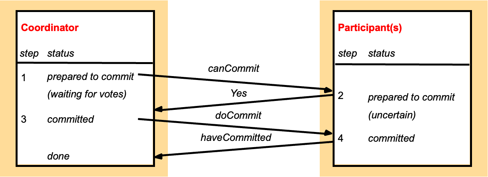

# Advanced Database Systems (COMP90050)

## Week 1

### Modelling Disk Access 
Disk access time = seek time + rotational delay + (transfer length / bandwidth)

- Seek time: the time it takes to locate the requested sector on the disk.
- Rotational delay: the time it takes to rotate the disk to the correct position.
- Transfer length: the number of bytes to be transferred.
- Bandwidth: the maximum rate of data transfer.

### HDD vs SSD
| **Feature**       | **HDD**                           | **SSD**                           |
|-------------------|-----------------------------------|-----------------------------------|
| **Storage Type**  | Magnetic disks                    | Flash memory                      |
| **Speed**         | Slower (100MB/s to 200MB/s)        | Faster (500MB/s to 5000MB/s+)     |
| **Durability**    | Less durable, susceptible to damage | More durable, resistant to shocks |
| **Capacity**      | Larger capacities (up to 10TB+)    | Smaller capacities (up to 4TB+)   |
| **Noise**         | Noisy due to moving parts          | Silent                           |
| **Power Consumption** | Higher power consumption        | Lower power consumption           |
| **Cost**          | More affordable for large storage | More expensive per GB             |
- SSD do not have seek and rotation delays.
- Moore’s law: memory chip capacity doubles every 18 months since 1970
- Joy’s law for processors: processor performance doubles every two years since 1984

### Disk Access Time
1. For HDD: 
- Disk Access Time = Seek Time + Rotational Delay + Transfer Time
2. For SSD: 
- Disk Access Time = Transfer Time
3. For both, Transfer Time = Transfer Length / Bandwidth

### Hit Ratio
- Hit ratio = (Number of hits) / (Number of requests)
- Hit ratio (HR): the percentage of requests that are satisfied by the buffer.
- If the hit ratio (HB) is high, the effective access time (EA) will be closer to the buffer access time (BC), meaning accessing data will generally be fast.
- If the hit ratio is low, the access time will be closer to the disk access time (D), meaning it will take longer to access the data, as more requests will result in disk accesses instead of buffer hits.
- Effective  memory access time, EA = H*C+(1-H)*M,where H = hit ratio, C = cache access time; M = memory access time

## Week 2
### Storage Area Networks (SANs)
- A SAN is a network of storage devices that provides a single logical storage space to multiple hosts.
- SANs are used to increase storage capacity, availability, and performance.
- They are used for shared-disk file systems
- They regularly also allow for automated back up functionality
- It was the fundamental storage for data center type systems with mainframes for decades
- Different versions evolved over time to allow for more data but fundamentals are the same even today
- They came with their own networking capabilities
- We visit a version of these when we see what can be done about failures
- In a nutshell failure probability of one disk is different to 100s of disks which requires design choices

### Deductive database systems (DDBS)
- e.g. prolog

---

### Comparison Table between Nested Loop Join and Block Nested-Loop Join

| Criteria                 | Nested Loop Join (NLJ)             | Block Nested-Loop Join (BNLJ)   |
|--------------------------|------------------------------------|---------------------------------|
| **Data Access Level**     | Record-by-record                   | Block-by-block                  |
| **I/O Cost**              | High                               | Reduced                         |
| **Seeks**                 | High                               | Lower                           |
| **Memory Requirement**    | Low                                | Higher (requires memory to store a block) |
| **Best for**              | Small tables or indexed joins      | Large tables with limited memory|
| **Performance**           | Poor for large tables              | Better for large tables         |

### Worst Case Cost Estimation
- r is called the outer relation and s is the inner relation of the join.
In the worst case, if there is enough memory only to hold one block of each table, the estimated cost is:

- **Block Transfers**:  
\[
n_r \times b_s + b_r
\]

- **Seeks**:  
\[
n_r + b_r
\]

####  Calculation Example

#### **Given:**
| Table      | Records | Blocks |
|------------|---------|--------|
| `customer` | 10,000  | 400    |
| `depositor`| 5,000   | 100    |

#### **Costs:**
| Method                | Block Transfers                      | Seeks           |
|-----------------------|--------------------------------------|-----------------|
| **Nested Loop Join**   | \( 10,000 \times 100 + 400 = 1,000,400 \) | \( 10,000 + 400 = 10,400 \) |
| **Block Nested-Loop Join** | \( 400 \times 100 = 40,000 \)       | \( 400 + 100 = 500 \)  |

### Other Join Comparison

| Criteria                | Nested-Loop Join | Block Nested-Loop Join | Indexed Nested-Loop Join | Merge Join | Hash Join |
|-------------------------|------------------|------------------------|--------------------------|------------|-----------|
| **Data Access Level**    | Record-by-record | Block-by-block         | Record-by-record (with index) | Sort and merge | Partitioning and hashing |
| **I/O Cost**             | High             | Reduced                | Low                      | Low        | Low       |
| **Seeks**                | High             | Lower                  | Low                      | Low        | Low       |
| **Memory Requirement**   | Low              | Higher (for block storage) | Low                      | Moderate   | High      |
| **Best for**             | Small tables or indexed joins | Large tables with limited memory | When the inner table has an index | When both tables are sorted | Large tables where sorting is expensive |
| **Performance**          | Poor for large tables | Better for large tables | Efficient when an index exists | Very efficient for sorted data | Efficient when no natural order of data exists |

## Week 3
- Sql query will be convert to relational algebra and then convert to physical plan.
- Left deep join: the left table is processed first, then the right table is processed. This is what the optimizer will do by default.

### Heuristic optimization techniques
- Perform selections early (reduces the number of tuples)
- Perform projections early (reduces the number of attributes)
- Perform most restrictive selection and join operations (i.e. with smallest result size) before other similar operations
- Optimizers often use simple heuristics for very cheap queries, and perform exhaustive enumeration for more expensive queries

### Indexing
- Indexing mechanisms used to speed up access to desired data in a similar way to look up in a phone book
- Search Key - attribute or set of attributes used to look up records/rows in a system, like an ID of a person
- An index file consists of records (called index entries) of the form search-key, pointer to where data is
- Index files are typically much smaller than the original data files and many parts of it are already in memory

#### Order indices
search keys are stored in some order
#### Hash indices
search keys are distributed hopefully uniformly across “buckets” using a “function”

### B+ Tree
- InnoDB
[Check this out](../cliché/2.md)

## Week 4
### Hash Indexing
- Hashing is a technique used to map data of an arbitrary size to a fixed-size value, typically a number.
- The hash function takes an input of any size and produces a fixed-size output.
- The hash function should be deterministic, meaning that it should always produce the same output for the same input.

### Bitmap Indexing
- A bitmap index is a data structure that stores a set of values in a compact form, allowing for fast and efficient retrieval of values that match a given condition.
- A bitmap index is a special type of index that stores a set of values in a bitmap, where each bit represents a value in the index.
- A bitmap index is used to quickly locate the values that match a given condition, without having to search through the entire index.
- A bitmap index is typically used to speed up queries that involve a large number of values that are stored in a database.
[Check This Out](../cliché/12.md))

### Index Structures Comparison

### Index Structures Comparison

| Index Type | Data Structure | Key Characteristics | Advantages | Disadvantages | Best Use Cases |
|-----------|----------------|---------------------|------------|---------------|----------------|
| B+ Tree | Balanced Tree | Multi-way search tree All data in leaf nodes | - Disk-friendly - Efficient range queries - Stable performance | - High insert/delete overhead - Space consumption | Relational databases Ordered data Range queries |
| Hash Index | Hash Table | Direct mapping Keys to storage locations | - Fast insertion - O(1) equality queries - Compact space | - No range queries - Hash collisions - Not order-preserving | Equality lookups Caching Unique identifiers |
| Bitmap Index | Bitmap array | Represent data existence via bits | - Compressed storage - Fast bit operations - Efficient aggregation | - High update cost - Suitable for low-cardinality columns - Space overhead | Data warehouses Analytical queries Low-mutation data |
| Quadtree | Tree-based spatial division | Recursive four-way space partitioning 2D spatial indexing | - Fast spatial queries - Data clustering - Recursive division | - Unbalanced depth - Additional space overhead - Dimension-limited | Geographic Information Systems Spatial clustering Collision detection |
| K-D Tree | Binary space partitioning | Multi-dimensional space recursive division | - High-dimensional space queries - Nearest neighbor search - Dynamic adjustment | - Complex construction - Unstable performance - Curse of dimensionality | Machine learning Spatial clustering High-dimensional data |
| R-Tree | Balanced tree for spatial data | Hierarchical minimum bounding rectangles | - Efficient multi-dimensional indexing - Handles complex spatial queries - Supports overlapping regions | - Higher computational complexity - Overhead in updates - Performance degrades with high dimensionality | Geographical databases Spatial networks Location-based services |
| R+ Tree | Variant of R-Tree | No overlapping node regions | - Improved query performance - More precise spatial indexing - Reduced search space | - More complex construction - Higher maintenance cost - Less flexible with irregular data | Advanced spatial databases Precise geographic querying Complex spatial analysis |

#### In-Depth Analysis

#### B+ Tree
- Widely used in database indexing
- Maintains data order
- Supports efficient range queries

#### Hash Index
- Commonly used for fast key-value lookups
- Trades space for query speed
- Unsuitable for sorting-required scenarios

#### Bitmap Index
- Compressed storage
- Ideal for low-cardinality, infrequently updated data
- Bit operations provide efficient aggregation

#### Quadtree
- 2D space specialized indexing
- Recursive division improves query efficiency
- Common in Geographic Information Systems

#### K-D Tree
- Multi-dimensional space generic indexing
- Effective method for high-dimensional data
- Excellent for nearest neighbor search scenarios、

#### R-Tree
- Designed for multi-dimensional indexing
- Uses minimum bounding rectangles (MBR)
- Key in spatial databases and GIS
- Handles non-point spatial objects efficiently

#### R+ Tree
- Addresses R-Tree's overlapping limitations
- Ensures no node region overlap
- Provides more precise spatial querying
- Computational overhead for maintenance

## Week 5
### ACID Properties
- Atomicity: A transaction is a single unit of work that either succeeds completely or fails completely.
- Consistency: A transaction must maintain database consistency.
- Isolation: Transactions should not interfere with each other.
- Durability: Once a transaction is committed, it should remain committed even in the event of a system failure.

### Flat Transactions
- A flat transaction is a transaction that is executed as a single unit of work.
- Flat transactions do not model many real applications
- If a system fails during a flat transaction, all the changes are lost.
#### Savepoints
- Savepoints are a mechanism that allows a transaction to create a savepoint before executing a set of statements.
- If a system fails during a savepoint, all the changes made after the savepoint are lost.

## Week 6
### Some simple concurrency control approaches:
- Dekker's algorithm (write some code to guarantee exclusive access) - needs almost no hardware support, but the code turns out to be complicated to implement especially for more than two transactions/processes
- OS supported primitives (through interrupt calls) - expensive, independent of number of processes
- Spin locks (using atomic lock/unlock instructions) –common

### A semaphore is a more general concurrency control tool, more flexible than a lock. Its working mechanism can be understood as:
1. get(): Attempt to acquire the semaphore, if it is already occupied:
- If no one is waiting, "wait"
- If someone is waiting, add yourself to the waiting queue
2. give(): Release the semaphore, and:
- If there is a waiting queue, wake up the first one (FIFO)

| Feature                 | Semaphore                                        | Spin Lock                                       |
|-------------------------|--------------------------------------------------|--------------------------------------------------|
| Nature                  | Concurrency control mechanism (counting allowed) | A type of lock implementation                   |
| Thread Blocking         | Yes (threads are put to sleep while waiting)     | No (threads busy-wait without yielding CPU)     |
| Suitable Scenarios      | High-contention situations needing queuing       | Short critical sections, context switch is expensive |
| CPU Usage               | Low (waiting threads don't consume CPU)          | High (waiting threads consume CPU while spinning) |
| Wake-up Mechanism       | FIFO queue wakes the next waiting thread         | No wake-up mechanism, relies on continuous retry |
| Counting Support        | Yes (can manage multiple resources)              | No (typically only supports 1 lock)              |
| Risk of Deadlock        | Yes (misuse can lead to deadlocks)               | Yes (can hang if lock isn't properly released)   |
| Typical Implementation  | OS-level (e.g., P/V operations, wait queues)     | Atomic variables + busy-loop (user/kernel space) |
| Language Primitives     | Java's `Semaphore`, POSIX `sem_wait()`           | Atomic ops in C, custom SpinLock in Java         |
| Reentrancy              | Not reentrant by default                         | Not reentrant by default                         |

#### Semaphore is like “you queue up and wait to be called”;
#### Spin Lock is like “you keep knocking on the door until someone opens”.

### Deadlock solutions
- Have enough resources so that no waiting occurs
- Do not allow a process to wait long, simply rollback after a certain time
- Linearly order the resources and request of resources should follow this order 
- Pre-declare all necessary resources 
- Periodically check the graph for cycles

## Week 7
- When dependency graph has cycles (circular dependencies) then there is a violation of isolation and a possibility of inconsistency
- If two transactions have the same dependency graph, then they will have the same final state.

### Serial History
1. **Definition of Isolated History**:
   - A history is considered isolated if and only if it is equivalent to a serial history.
   - In other words, all transactions are executed in a sequential order.
2. **Definition of Serial History**:
   - A serial history is the result obtained by executing each transaction in sequence.
3. **Outcome of N Transactions**:
   - N transactions can produce up to N! different serial histories.
4. **Acceptability of Any Serial History**:
   - There is no need to worry about choosing which serial history to accept.
5. **Concurrent Transaction Set**:
   - Therefore, creating a concurrent transaction set that is actually equivalent to a serial history will be isolated.
### Bad Executions
1. **Transaction Order**:
   - If transaction T1 is executed before transaction T2, it is denoted as T1 << T2.
2. **Before and After Sets**:
   - Before(T) = {T' | T' << T}: Represents the set of all transactions executed before transaction T.
   - After(T) = {T' | T << T'}: Represents the set of all transactions executed after transaction T.
3. **Definition of Wormhole Transaction**:
   - If a transaction T' belongs to both Before(T) and After(T), i.e., T' ∈ Before(T) ∩ After(T), then T' is called a wormhole transaction.
   - This implies the existence of a circular dependency relationship T << T' << T.
4. **Impact of Wormhole Transactions**:
   - The presence of wormhole transactions indicates that there is no good isolation between transactions, i.e., the conditions for serial execution are not met.
   - This situation can lead to cycles in the transaction dependency graph, thereby disrupting the isolation of transactions.
5. **Wormhole Theorem**:
   - A history is isolated (isolated) if and only if it has no wormhole transactions.

## Week 8
### Lock Compatibility Matrix
#### Current Mode of Lock
| Request | Free | Shared | Exclusive |
|---------|------|--------|-----------|
| **Shared request (SLOCK)**   Used to block others writing/modifying | Compatible   Request granted immediately   Changes Mode from Free to Shared | Compatible   Request granted immediately   Mode stays Shared | Conflict   Request delayed until the state becomes compatible   Mode stays Exclusive |
| **Exclusive request (XLOCK)**   Used to block others reading or writing/modifying | Compatible   Request granted immediately   Changes Mode from Free to Exclusive | Conflict   Request delayed until the state becomes compatible   Mode stays Shared | Conflict   Request delayed until the state becomes compatible   Mode stays Exclusive |

### Degrees of Isolation
| Isolation Level                       | Problems Avoided | Description                                                |
| -------------------------- | -------------- | ------------------------------------------------- |
| **Read Uncommitted**（Read Uncommitted） | ❌Dirty Read、❌Non-repeatable Read、❌Phantom Read | A transaction can read data that **has not been committed** by other transactions. The lowest level, data is not secure.                |
| **Read Committed**（Read Committed）   | ✅Dirty Read，❌Non-repeatable Read、❌Phantom Read | Can only read data that **has been committed** by other transactions. This is the default isolation level for SQL Server and Oracle. |
| **Repeatable Read**（Repeatable Read）  | ✅Dirty Read、✅Non-repeatable Read，❌Phantom Read | The same row data will be read consistently within a transaction. This is the default level for MySQL InnoDB.          |
| **Serializable**（Serializable）     | ✅Dirty Read、✅Non-repeatable Read、✅Phantom Read | The highest isolation level, transactions are executed completely serially, with the lowest efficiency but the highest consistency. Usually implemented through locking or range query control.       |

| Exception                             | Explanation                                          |
| ------------------------------ | ------------------------------------------- |
| **Dirty Read（Dirty Read）**             | A transaction reads data modified by **an uncommitted transaction**.                    |
| **Non-repeatable Read（Non-repeatable Read）** | A transaction reads the same data twice, with different results (because another transaction updated and committed the data).        |
| **Phantom Read（Phantom Read）**           | A transaction executes the same query twice, seeing "phantom" rows added (because another transaction inserted new rows). |

| Isolation Level             | Dirty Read | Non-repeatable Read | Phantom Read |
| ---------------- | -- | ----- | -- |
| Read Uncommitted | ✅  | ✅     | ✅  |
| Read Committed   | ❌  | ✅     | ✅  |
| Repeatable Read  | ❌  | ❌     | ✅  |
| Serializable     | ❌  | ❌     | ❌  |

### Granularity of Locks
| Lock Granularity                   | Description                        | Concurrency | System Overhead |
| --------------------- | ------------------------- | --- | ---- |
| **Database-level Lock**             | Locks the entire database. The coarsest, suitable for management tools or backup operations. | Lowest  | Smallest   |
| **Table-level Lock (Table Lock)**   | Locks an entire table, preventing other transactions from writing or reading and writing.     | Low   | Small    |
| **Page-level Lock (Page Lock)**    | Locks a page (e.g., 8KB) containing multiple rows. A compromise solution.   | Medium | Medium    |
| **Row-level Lock (Row Lock)**     | Locks a single record/row, commonly used in OLTP systems.   | High   | High    |
| **Column-level Lock (Column Lock)** | Locks a specific column, rarely used.              | Highest  | Highest   |

### Lock Type
| Lock Type     | Full Name                           | Description                                                |
| ------- | ---------------------------- | ------------------------------------------------- |
| **X**   | Exclusive Lock（Exclusive Lock）          | Prevents other transactions from reading or modifying the resource. The transaction itself can read and write, while others cannot do anything. Used for write operations.             |
| **S**   | Shared Lock（Shared Lock）             | Allows multiple transactions to read simultaneously, but cannot write. Used for read operations.                            |
| **U**   | Update Lock（Update Lock）             | A "middle lock" to prevent deadlocks, used in scenarios where a read is about to become a write. At most one U lock, other transactions can share reads but cannot write. |
| **IS**  | Intent Shared（Intent Shared Lock）         | Indicates that the transaction **intends** to add a shared lock at a finer granularity (e.g., row). Acts on table/page level.                 |
| **IX**  | Intent Exclusive（Intent Exclusive Lock）      | Indicates that the transaction **intends** to add an exclusive lock at a finer granularity. Allows multiple transactions to add exclusive locks at different granularity resources.         |
| **SIX** | Shared with Intent Exclusive | Adds an S lock at the table level, allowing an X lock to be added at the **row level**. Typically, only one SIX lock can exist for a table.       |

### Two-Version Locking and Nested Transactions and Locking
| Feature      | Two-Version Locking | Nested Transactions and Locking |
| ------- | ------------------- | ------------------------------- |
| Target      | Enhance read-write concurrency             | Manage lock semantics in nested transactions                     |
| Lock Policy     | Write lock + multiple version data          | Hierarchical lock management                        |
| Multi-Version Support | Yes（read old, write new）            | No（traditional lock semantics）                        |
| Application Scenario    | High concurrency read + light write scenarios      | Complex process transactions, module transaction nesting                   |
| Read-Write Concurrency    | High                   | Depends on lock granularity                          |
| Implementation Complexity   | Medium to high                | High                               |

## Week 9 

### Optimistic Concurrency Control and Pessmistic Concurrency Control

| Feature               | Optimistic Concurrency Control (OCC)                                 | Pessimistic Concurrency Control (PCC)                                 |
|-------------------|----------------------------------------------------|----------------------------------------------------|
| Basic Assumption             | Conflicts rarely occur                                       | Conflicts frequently occur                                       |
| Locking Strategy             | Transactions do not lock data, allowing free reading and modification                         | Transactions lock data when reading and modifying, preventing other transactions from accessing             |
| Conflict Detection Timing         | Conflict detection is performed when the transaction is committed                               | Conflict detection is performed during the execution of the transaction                             |
| Performance Impact             | Reduces lock contention, improves concurrency performance                               | Increases lock contention, may reduce concurrency performance                           |
| Applicable Scenarios             | Read-heavy, write-light, with few conflicts                               | Write-heavy, with many conflicts                             |
| Transaction Termination Frequency         | May be high, because conflict detection is performed at commit time                       | Usually low, because conflicts are prevented during the execution of the transaction                 |
| Retry Overhead             | May be high, because aborted transactions need to be retried                         | Usually low, because fewer conflicts lead to fewer aborted transactions                 |
| Implementation Technology             | Version control, shadow pages, validation, etc                             | Locking mechanism (shared locks, exclusive locks, etc)                           |

### "Backward Validation" and "Forward Validation"
| Feature | Backward Validation | Forward Validation |
| --- | --- | --- |
| Definition | Starting from the result, inversely checking the correctness and rationality of the input data | Starting from the input data, forwardly predicting the accuracy and reliability of the result |
| Application Scenario | Used for debugging and diagnosing system failures, especially in finding the root cause of problems in complex systems | Used for evaluating the predictive ability of models, especially in machine learning and data analysis fields |
| Data Flow | From result to cause | From cause to result |
| Validation Process | Analyzing output results, tracing back to their causes and conditions | Based on known conditions and rules, deriving expected output results |
| Goal | Ensuring system stability and security | Improving model accuracy and generalization ability |
| Tools and Technologies | Fault diagnosis tools, log analysis, reverse engineering, etc. | Statistical methods, cross-validation, A/B testing, etc. |

### Time-stamp-based Concurrency Control
| Category | Specific Content | Explanation/Impact |
| :------- | :----------------------------------------------------------------------- | :------------------------------------------------------------------------ |
| **Core Advantages** | **Serializability Guarantee** | Ensures that the final result of concurrent transactions is equivalent to some serial execution order, thereby ensuring data consistency. |
|          | **Lock-Free** | Transactions typically do not acquire explicit locks during execution, reducing lock contention and waiting, theoretically improving performance in low-conflict environments. |
|          | **Transaction Isolation** | Ensures that transactions read data that conforms to the version order of their timestamps. |
| **Core Disadvantages** | **Transaction Abort and Restart** | Conflicts require transactions to be aborted and restarted, incurring additional overhead and resource waste, potentially reducing performance under high conflict conditions. |
|          | **Timestamp Management** | Requires a reliable mechanism to generate globally unique and monotonically increasing timestamps, which can be complex to implement. |
|          | **Implementation Complexity** | The implementation logic of TSCC is typically more complex than that of simple lock mechanisms. |

### Two-phase atomic commit protocol:
- is designed to allow any participant to choose to abort a transaction.

#### phase 1 - each participant votes. 
If it votes to commit, it is prepared: It cannot change its mind. 
In case it can crash, it must save updates in permanent store.
#### phase 2 - the participants carry out the joint decision.

### Faliures
#### time-out actions in the 2PC is used
to avoid blocking forever when a process crashes or a message is lost

#### uncertain participant that has voted yes: it can’t decide on its own
it uses getDecision method to ask coordinator about outcome

#### coordinator delayed in waiting for votes: 
It can abort and send doAbort to participants

#### participant has carried out client requests, but has not had a followup from the coordinator. It can abort unilaterally

### one-copy serializability 
- the effect of transactions on replicated objects should be the same as if they had been performed one at a time on a single set of objects

### Available copies replication rule
- Before a transaction commits, it checks for failures and recoveries of the RMs it has contacted, the set should not change during execution

## Week 10
### P(A) = 
- probability of a disk failing which we call event A, given a certain duration of time of use
- As time t goes to infinity P(A) approaches 1…

### Module availability
- measures the ratio of service accomplishment to elapsed time
- Mean time to failure / (Mean time to failure + mean time to repair)

### RAID
RAID (Redundant Array of Independent Disks) is a data storage virtualization technology that combines multiple physical disk drives into one or more logical units to enhance performance, reliability, and/or capacity. RAID technology achieves distributed storage and redundant backup of data across multiple disks through techniques such as striping, mirroring, and parity.
The main goals of RAID include:
1. Improving performance: By distributing data across multiple disks, RAID can increase data read and write speeds, as multiple disks can operate simultaneously.
2. Enhancing reliability: Through data redundancy, RAID can protect data in the event of disk failure, preventing data loss.
3. Expanding capacity: By combining multiple disks into a single logical unit, RAID can provide greater storage capacity than a single disk.

RAID has various levels, each with its specific advantages and disadvantages, suitable for different application scenarios. Here are some common RAID levels:
1. RAID 0: Data striping, which distributes data across multiple disks to improve performance. However, it has no redundancy, and data will be lost if any disk fails.
2. RAID 1: Data mirroring, which writes data simultaneously to two or more disks to enhance reliability. However, storage capacity is halved because each data block needs to be stored on multiple disks.
3. RAID 5: Data striping with parity, which distributes data and parity information across multiple disks to improve performance and reliability. It can protect data in the event of a single disk failure, but write performance may be affected.
4. RAID 6: Similar to RAID 5, but uses two parity blocks, allowing data protection in the event of two disk failures.
5. RAID 10: Combines the features of RAID 1 and RAID 0, first performing data mirroring and then striping the mirrored data to enhance performance and reliability. However, storage capacity is halved.

### Fault tolerance by voting
- Failvote - Stops if there is no majority agreement.
- Failfast - Similar to failvote except the system senses which modules are available and uses the majority of the available modules. 
- Failfast system has better availability than failvoting (since failvote stops when there is no majority agreement).  
- Consider a system with  modules each with MTTF of 10 years, Failvoting with 2 devices, MTTF = 10/2 = 5 years (system fails with 1 device failure)
- Lower availability for higher reliability (multiple modules agreeing on a value means that value is more likely to be accurate/reliable)

### Recovery
- Recovery algorithms have two parts
1. Actions taken during normal transaction processing to ensure enough information exists to recover from failures
2. Actions taken after a failure to recover the database contents to a state that ensures atomicity, consistency and durability

### Cyclic Redundancy Check
- DBMSs borrow this method from networks to increase durability on disks
- It further complicates matters but increases durability
- It is a method, similar to parity computations we saw before, to catch problems in written data on disks
- Most errors in communications or in our case on disk happen contiguously, i.e. is in bursts
- CRC can be used to detect burst errors on disks with many bits changing
- In fact the parity bit we saw can be seen as a 1 bit CRC computation
- CRC/parity can be used even when we do not use a RAID design on disks

### log-based recovery
#### Deferred database modification
- The deferred database modification scheme records all modifications to the log, but defers all the writes to after partial commit.
#### Immediate database modification
- Allows database updates of an uncommitted transaction to be made as the writes are issued
- Since undoing may be needed, update logs must have both old value and new value

| Feature | Deferred Database Modification | Immediate Database Modification |
|---|---|---|
| **Change Application Time** | Batch applied at transaction commit | Applied immediately during transaction |
| **I/O Operations** | Reduced | Increased |
| **Real-time Performance** | Lower | Higher |
| **Commit Time** | Potentially longer | Shorter |
| **Recovery Process** | Simple, discard uncommitted transactions | Complex, requires rollback of incomplete transactions |
| **Transaction Log** | Larger | Relatively smaller |
| **Applicable Scenarios** | High consistency requirements, can tolerate longer commit times | High real-time requirements, need immediate reflection of changes |
| **Advantages** | Increases efficiency, simplifies recovery | Enhances real-time performance, reduces commit time |
| **Disadvantages** | Commit time may be longer, larger transaction log | Complex recovery process |

### shadow-paging

## Week 11
### Problems in recovery procedure:
- Searching the entire log is time-consuming.
- We might unnecessarily redo transactions that have already output their updates to the database.

:::info
The redo log records the physical changes of data pages, used for recovery after a service crash to ensure transaction durability. The undo log records logical logs, used to restore original data during transaction rollback, ensuring transaction atomicity and consistency.
:::
### Checkpointing
- Scan backwards from the end of the log to find the most recent `<checkpoint>` record.
- Continue scanning backwards until `<Ti start>` is found.
- Only consider the part of the log following the start record. The earlier part of the log can be ignored during recovery and can be erased whenever desired.
- For all transactions (starting from Ti or later) with no `<Ti commit>`, execute `undo(Ti)`. (Done only in the case of immediate modification.)
- Scanning forward in the log, for all transactions starting from Ti or later with a `<Ti commit>`, execute `redo(Ti)`.

### Concurrency Control
1. **Allow concurrent transactions**: The system design allows multiple transactions to execute simultaneously.
2. **Single disk buffer and log**: All transactions share the same disk buffer and a single log file.
3. **Buffer block updates**: A buffer block can be updated by one or more transactions.
4. **Strict two-phase locking**: Use strict two-phase locking to ensure that updates of uncommitted transactions are not visible to other transactions.
5. **Checkpointing technique changes**: Due to the possibility of multiple active transactions during checkpointing, adjustments to the checkpointing technique are required.

### Two-Phase Locking
Two-Phase Locking (2PL) is a method used for concurrency control, aimed at ensuring the serialization of transactions in a database system, preventing data inconsistencies such as lost updates, dirty reads, non-repeatable reads, and phantom reads. It achieves this by requiring transactions to obtain the necessary locks before reading or modifying data and releasing these locks after the transaction is completed.
The two-phase locking protocol divides the execution of a transaction into two phases:
1. **Growing Phase**: In this phase, a transaction can acquire locks but cannot release any locks. The transaction requests and obtains all the locks it needs. This phase ensures that transactions do not interfere with each other due to resource contention during execution.
2. **Shrinking Phase**: In this phase, a transaction can release locks but cannot acquire any new locks. The transaction begins to release the locks it previously acquired after completing all necessary operations. This phase ensures that transactions do not have new impacts on other transactions before committing or rolling back.
Based on the type and release time of locks, two-phase locking can be divided into several variants:
- **Strict 2PL**: All exclusive locks (X locks) held by a transaction are not released until the transaction commits or rolls back. This ensures that transactions are not visible to other transactions before committing, thus avoiding dirty reads, non-repeatable reads, and phantom reads.
- **Rigorous 2PL**: All locks (including shared locks S locks and exclusive locks X locks) held by a transaction are not released until the transaction commits or rolls back. This is the strictest 2PL variant, providing the highest level of isolation.
- **Conservative 2PL**: A transaction must acquire all the locks it needs before it starts. This can prevent transactions from being blocked due to waiting for locks during execution.
The two-phase locking protocol is a key technology for achieving the ACID properties (Atomicity, Consistency, Isolation, Durability) of transactions, especially in ensuring isolation. However, it may also lead to deadlocks, requiring additional mechanisms to detect and resolve deadlock issues.

### Log Record Buffering
1. **Log Record Buffering**:
   - Log records are buffered in main memory.
   - Log records can be output with a single output operation.
2. **Log Force**:
   - Perform log force operations to commit transactions.
   - Force all log records (including commit records) to be written to stable storage.

### Issues with Database Buffering
1. **Removing existing blocks when the buffer is full**:
   - When new data blocks are needed and the buffer is full, existing data blocks must be removed from the buffer.
2. **Write-back strategy for updated blocks**:
   - If the selected block has been updated, the write operation must be completed before outputting it to disk.
3. **Handling uncommitted updates**:
   - If a block with uncommitted updates is output to disk, log records containing undo information must first be output to stable log storage (Write-Ahead Logging, WAL).
4. **Avoid ongoing updates**:
   - There should be no ongoing update operations when outputting data blocks to disk.
5. **Use of locks**:
   - Before writing a data item, a transaction acquires an exclusive lock on the block containing the data item to ensure no interference from other transactions.
6. **Locks held for a short time are called latches**:
   - This type of lock is typically used to control short-term access to shared resources.
These issues involve buffer management, data consistency, and transaction processing strategies in database management systems.

### Buffer Management
1. **Page replacement**: When the operating system needs to replace a modified page, the page is written to the swap space on disk.
2. **Double paging problem**: When the database decides to write buffered pages to disk, the buffered pages may be in swap space, leading to additional I/O operations.
3. **Ideal handling process**:
   - The operating system should hand over control to the database when it needs to evict pages from the buffer.
   - The database should first output log records and then output pages to the database instead of swap space.
   - Release pages for use by the operating system.
4. **Avoid double paging**: The above methods can avoid double paging, but some operating systems do not support this feature.

### Logical Logging

1. **Limitations of physical undo**: Operations like B⁺ tree insertions and deletions cannot be undone by restoring old values (physical undo) because once locks are released, other transactions may have updated the B⁺ tree.
2. **Method of logical undo**: Instead, insertions (or deletions) are undone by performing delete (or insert) operations (called logical undo).

### Remote Backup Systems
#### Part 1: Failure Detection and Control Transfer
- **Failure Detection**
   - The backup site must detect the failure of the primary site.
   - To distinguish between primary site failure and link failure, multiple communication links must be maintained between the primary site and the remote backup.
   - Use heartbeat messages for detection.
- **How to Transfer Control**
   - To take over control, the backup site first uses its database copy and all log records received from the primary site for recovery.
   - Completed transactions will be re-executed, and incomplete transactions will be rolled back.
   - When the backup site takes over processing, it becomes the new primary site.
#### Part 2: Recovery Time and Hot Standby Configuration
- **Recovery Time**
   - To reduce takeover delay, the backup site regularly processes redo log records.
   - Perform recovery from the previous database state, execute checkpoints, and then delete the earlier part of the log.
- **Hot Standby Configuration**
   - The backup continuously processes arriving redo log records and applies updates locally.
- When a primary site failure is detected, the backup rolls back incomplete transactions and prepares to process new transactions.
#### Part 3: Durability Levels
- Ensure the durability of updates by delaying transaction commits until updates are recorded in the backup. However, this delay can be avoided by allowing lower levels of durability.
- **One-safe**
   - Commit once the transaction's commit log record is written to the primary site.
   - Problem: Updates may not reach the backup before it takes over.
- **Two-very-safe**
   - Commit only when the transaction's commit log record is written to both the primary site and the backup.
   - Reduces availability because if either site fails, the transaction cannot commit.
- **Two-safe**
   - If both the primary site and backup are active, proceed as two-very-safe.
   - If only the primary site is active, commit immediately when the transaction's commit log record is written to the primary site.
   - Offers better availability than two-very-safe; avoids the issue of lost transactions in one-safe.

### Shadow Paging
#### Commit Process:
1. Flush all modified pages in main memory to disk.
2. Output the current page table to disk.
3. Make the current page table the new shadow page table:
   - Maintain a pointer to the shadow page table at a fixed location on disk.
   - Update the pointer to point to the current page table.
Once the pointer to the shadow page table is written, the transaction is committed.
#### Recovery after Crash:
- No recovery is needed—new transactions can start immediately using the shadow page table.
#### Page Reclamation:
- Pages not pointed to by the current/shadow page table should be released (garbage collection).
#### Advantages of Shadow Paging:
- No overhead of writing log records.
- Simple recovery.
#### Disadvantages of Shadow Paging:
- Copying the entire page table is expensive when the page table is large—can be reduced by using a B+ tree-like page table structure.
- Even with the above extension, commit overhead is still high—requires flushing every updated page and page table.
- Data becomes fragmented (related pages are separated on disk).
- After each transaction completes, database pages containing old versions of modified data need garbage collection.
- Difficult to extend the algorithm to allow concurrent transactions.

### Data Warehousing
- repository (archive) of information gathered from multiple sources, stored under a unified schema, at a single site
- Greatly simplifies querying, permits study of historical trends
- Shifts decision support query load away from transaction processing systems

### Design Issues
- Keeping warehouse exactly synchronized with data sources (e.g. using two-phase commit) is too expensive
   - Usually OK to have slightly out-of-date data at warehouse
   - Data/updates are periodically downloaded form online transaction processing (OLTP) systems (most of the DBMS work we have seen so far)
- Schema (which schema to use)
- Data cleaning
- How to propagate updates
- What data to summarize

### OLAP
- Interactive analysis of data, commonly for data analysis as mentioned before
- Multidimensional data
   - Measture attributes e.g. sales, profit, etc.
   - Dimension attributes e.g. time, location, product, etc.

### Cross-tabulation
- A table that summarizes data by combining different dimensions

### Data Cube
- A data cube is a multidimensional generalization of a cross-tab

### OLAP Operations
- Pivoting: changing the dimensions used in a cross-tab
- Slicing: creating a cross-tab for fixed values only
   - Sometimes called dicing, particularly when values for multiple dimensions are fixed
- Rollup: moving from finer-granularity data to a coarser granularity 
- Drill down: The opposite operation -  that of moving from coarser-granularity data to finer-granularity data

### OLAP implementation
- The earliest OLAP systems used multidimensional arrays in memory to store data cubes, and are referred to as multidimensional OLAP (MOLAP) systems
- OLAP implementations using only relational database features using rows and columns and no precalculated data cubes called relational OLAP (ROLAP) systems
- Hybrid systems, which store some summaries in memory and store the base data and other summaries in a relational database, are called hybrid OLAP (HOLAP) systems

### Information Retrieval
Differences from database systems is then:
- IR systems don’t deal with transactional updates (including concurrency control and recovery)
- Database systems deal with structured data, with schemas that define the data organization
- IR systems deal with some querying issues not generally addressed by database systems
   - Approximate searching by keywords
   - Ranking of retrieved answers by estimated degree of relevance

### Information Retrieval Systems
- IR systems don’t deal with transactional updates (including concurrency control and recovery)
- Database systems deal with structured data, with schemas that define the data organization
- IR systems deal with some querying issues not generally addressed by database systems
- Approximate searching by keywords
- Ranking of retrieved answers by estimated degree of relevance

