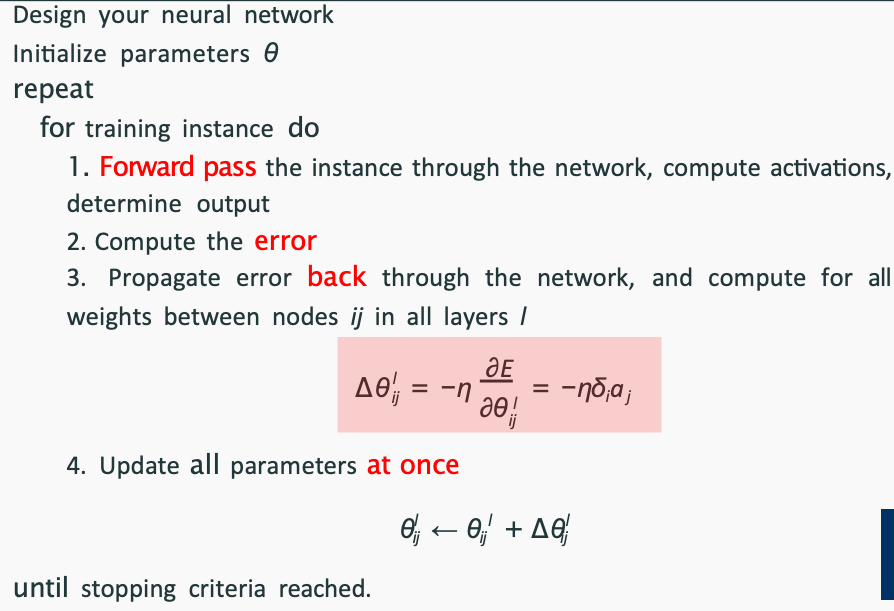

# Machine Learning
| Algorithm                | Type            | Generative/Discriminative | Linear/Non-linear | Notes                                                                 |
|--------------------------|-----------------|---------------------------|-------------------|-----------------------------------------------------------------------|
| Naive Bayes              | Classification  | Generative                | Linear            | Assumes feature independence, uses Bayes' theorem                     |
| Logistic Regression      | Classification  | Discriminative            | Linear            | Uses sigmoid function, mainly for binary classification               |
| Decision Trees           | Classification  | Discriminative            | Non-linear        | Handles both numerical and categorical features                       |
| SVM                      | Classification  | Discriminative            | Linear/Non-linear | Uses kernel trick for non-linear, finds optimal hyperplane            |
| k-NN                     | Classification  | Discriminative            | Non-linear        | Instance-based, sensitive to feature scaling                          |
| Neural Networks          | Classification  | Discriminative            | Non-linear        | Can model complex patterns, requires large datasets                   |
| Linear Regression        | Regression      | Discriminative            | Linear            | Predicts continuous values, sensitive to multicollinearity            |
| k-Means                  | Clustering      | -                         | Linear            | Unsupervised, sensitive to initial centroids and outliers             |
| PCA                      | Dimensionality Reduction | -                  | Linear            | Unsupervised, maximizes variance, does not consider class labels      |
| Hierarchical Clustering  | Clustering      | -                         | Non-linear        | Unsupervised, builds nested clusters, linkage methods affect results  |
| Perceptron               | Classification  | Discriminative            | Linear            | Simple model, only for linearly separable data                        |
| Multi-Layer Perceptron   | Classification/Regression | Discriminative   | Non-linear        | Can solve XOR problem, uses backpropagation for training              |

# Introduction
- An instance is a single exemplar from the data, consisting of a bundle of (possibly unknown) attribute values (feature values) (and, in the case of supervised ML, a class value). 一行数据
- An feature (attribute) is a single measurement of some aspect of an instance, for example, the frequency of some event related to this instance, or the label of some meaningful category. 每个列上的特征、
- label(concepts) refers to the output variable that a machine learning model predicts or classifies. 最后一列的标签、

| 项目       | Supervised Learning（监督学习）                                                                         | Semi-supervised Learning（半监督学习）                                                        | Unsupervised Learning（无监督学习）                                                  |
| -------- | ------------------------------------------------------------------------------------------------- | -------------------------------------------------------------------------------------- | ----------------------------------------------------------------------------- |
| **定义**   | 使用带标签的数据训练模型                                                                                      | 使用少量带标签 + 大量未标记数据                                                                      | 使用未标记数据发现结构或模式                                                                |
| **训练数据** | 全部数据都有标签 (x, y)                                                                                   | 部分数据有标签，其余没有                                                                           | 所有数据都没有标签                                                                     |
| **目标**   | 学习从输入到输出的映射函数                                                                                     | 利用未标记数据辅助提升监督学习性能                                                                      | 挖掘数据的隐藏结构、聚类或降维                                                               |
| **优点**   | - 性能好，预测准确<br>- 易于评估                                                                              | - 降低标注成本<br>- 利用更多数据<br>- 介于两者之间                                                       | - 无需人工标注<br>- 可发现潜在结构                                                         |
| **缺点**   | - 需要大量标注数据<br>- 成本高                                                                               | - 模型较复杂，难以调优<br>- 依赖标签质量                                                               | - 没有明确的评估标准<br>- 结果不一定可解释                                                     |
| **常见算法** | - Logistic Regression<br>- Decision Trees <br>- Naive Bayes<br>- SVM<br>- k-NN<br>- Neural Networks | - Self-Training<br>- Active Learning | - k-Means<br>- PCA<br>- Hierarchical Clustering |
| **应用场景** | - 图像识别<br>- 文本分类<br>- 医疗诊断                                                                        | - 医疗影像分析（标签稀缺）<br>- 网络安全<br>- 学术文本分类                                                   | - 客户分群<br>- 异常检测<br>- 推荐系统降维                                                  |
| **标签依赖** | 高                                                                                                 | 中等                                                                                     | 无                                                                             |
| **学习策略** | 拟合标签预测                                                                                            | 结合监督与无监督的方式                                                                            | 利用相似性、距离、密度等自组织结构                                                             |

| 数据类型/算法                     | Nominal（类别，无顺序）    | Ordinal（类别，有顺序）   | Numeric（数值型） |
| --------------------------- | ------------------ | ----------------- | ------------ |
| **Logistic Regression**     | ❌（需 One-Hot 编码）    | ⚠️（建议用整数，但小心线性关系） | ✅（天然支持）      |
| **Decision Trees**          | ✅（直接支持）            | ✅（顺序可影响划分）        | ✅（天然支持）      |
| **Naive Bayes** | ✅（非常适合，如多项式NB）  | ⚠️（可当作 nominal 处理，但有顺序信息未被利用） | ✅（需使用高斯NB）   |
| **SVM**                     | ❌（需 One-Hot 或数值编码） | ⚠️（可转数值，但影响大）     | ✅            |
| **k-NN**                    | ⚠️（可编码但距离计算要小心）    | ⚠️（顺序可编码，仍需谨慎）    | ✅            |
| **Neural Networks**         | ❌（需独热编码或嵌入）        | ⚠️（用嵌入或数值，但注意误导）  | ✅            |
| **k-Means**                 | ❌（不适合非数值数据）        | ⚠️（可尝试编码，但不推荐）    | ✅（必须是数值型）    |
| **PCA**                     | ❌（仅限数值型）           | ❌（不可用于类别）         | ✅（必须是数值型）    |
| **Hierarchical Clustering** | ⚠️（需距离定义，编码后可用）    | ⚠️（顺序编码有时合理）      | ✅（常见使用）      |
 
## 哪些算法敏感于数值范围？

✅ 受影响：SVM, k-NN, PCA, 梯度下降类模型（如逻辑回归、神经网络）

❌ 不敏感：决策树、随机森林、朴素贝叶斯

| 方法                | 也叫                        | 作用               | 数学形式                                         |
| ----------------- | ------------------------- | ---------------- | -------------------------------------------- |
| **Scaling**       | Min-Max Scaling           | 统一数值范围（不改变分布形状）  | $x' = \frac{x - \min(x)}{\max(x) - \min(x)}$ |
| **Normalization** | Standardization / Z-score | 统一分布形状（变为均值0方差1） | $x' = \frac{x - \mu}{\sigma}$                |


# KNN
classification and regression
## 算法
- Choose k: Decide the number of nearest neighbors (k).
- Compute Distance: Measure the distance between the test instance and all training instances (e.g., Euclidean distance, Manhattan distance, or Cosine similarity).
- Find Nearest Neighbors: Select the k closest training instances.
- Predict the Output:
  - For classification, use majority voting or weighted voting among the k neighbors.
  - For regression, take the average or weighted average of the k neighbors' values.

## 距离计算
- Majority class voting: 选择出现次数最多的类别作为预测结果，不管远近weight都一样
- inverse distance weighting: 根据距离的倒数加权，距离越近权重越大 1/d+ε
- Inverse linear distance weighting $$w_j = \frac{d_3 - d_j}{d_3 - d_1}$$
   - d_3 is the distance of the farthest neighbor (Here is 3NN)
   - d_j is the distance of the j-th neighbor 他是第几远的那个邻居的distance 比如第二远的距离是4 就填4
- Cosine similarity: 计算两个向量之间的夹角余弦值，值越大越相似 
   - cosine similarity = dot product / (magnitude of x * magnitude of y) $$\cos(\theta) = \frac{A \cdot B}{\|A\| \|B\|}$$
   - magnitude of x = sqrt(x1^2 + x2^2 + ... + xn^2)
   - cosine distance = 1 - cosine similarity
      - high distance means low similarity
## K的选择
- 如果k太小，模型会过拟合，因为模型会过度依赖于最近的邻居，导致模型对噪声敏感
- 如果k太大，模型会欠拟合，因为模型会忽略特征差异，导致模型对噪声不敏感
   - 如果k=N，	忽略特征差异，退化成多数类投票法


# Probability
- marginal probability: 只关注某一个变量的概率，忽略（边缘化）其他变量 
- conditional probability: 在给定其他变量的情况下，某一个变量的概率
- joint probability: 两个事件同时发生的概率
- disjoint events: 两个事件不能同时发生
- Bayes' theorem: 
   $$P(A|B) = \frac{P(B|A)P(A)}{P(B)}$$
   - P(A|B) is the probability of A given B
   - P(B|A) is the probability of B given A
   - P(A) is the probability of A
   - P(B) is the probability of B

# Decision Trees
classification and regression

handle numerical and categorical features
- 0-R
   - 直接预测最频繁的类
- 1-R(decision stump)
   - 选择最少的error count的feature, 然后根据选择的feature进行预测
- Information Gain (for classification)：choose the attribute that has th largest difference between the entropy of the class distribution at the parent node, and the average entropy across its daughter nodes (weighted by the fraction of instances at each node)

$$
IG(A|R) = H(R) - \sum_{i \in A} P(A = i) H(A = i)
$$


$$
IG(O) = H(R) - MI(O)
$$

   - In this dataset, we have **6 instances total**—**3 Y** and **3 N**. The entropy at the **top level** of our tree is:

$$
H(R) = - \left[ \frac{3}{6} \log_2 \frac{3}{6} + \frac{3}{6} \log_2 \frac{3}{6} \right]
$$

   - average entropy（也就是MI Mean Information）: sum the calculated entropy at each daughter multiplied by the fraction of instances at that daughter
   - 最终选择最高的IG的feature进行split，pure的node就直接停，如果一个子集不是纯的（即其中的样本不全属于同一类别），那么就需要继续分裂，直到达到停止条件为止。


- Gain Ratio (for classification)
   $$
   GR(A|R) = \frac{IG(A|R)}{SplitInfo(A|R)}
   $$
$$SI(o) = - \left[ \frac{2}{6} \log_2 \frac{2}{6} + \frac{1}{6} \log_2 \frac{1}{6} + \frac{3}{6} \log_2 \frac{3}{6} \right] \approx 1.459$$
- 比如说outlook里有两个s，一个n，三个q，splitinfo如上
- IG有high-arity bias，所以需要用gain ratio来解决


# Naive Bayes
primarily for classification
1. **Calculate Prior Probabilities**: Compute the probability of each class based on the training data.  
2. **Compute Likelihood**: Estimate the probability of features given each class using the conditional probability formula.  
3. **Apply Bayes’ Theorem**: Use Bayes' rule to compute the posterior probability for each class. 
4. **Classify**: Assign the class with the highest posterior probability to the new instance.

compute example 哪个大选哪个 如果有不确定的attriute就跳过计算他

**N:**  $P(N) \times P(\text{Temp} = h \mid N) \times P(\text{Wind} = F \mid N) = \frac{1}{2} \times \frac{2}{3} \times \frac{1}{3} = \frac{1}{9}$

**Y:**  $P(Y) \times P(\text{Temp} = h \mid N) \times P(\text{Wind} = F \mid N) = \frac{1}{2} \times \frac{1}{3} \times 1 = \frac{1}{6}$


## Elipson-Smoothing
- Instead of using zero values, we replace them with a small positive constant ε, which allows us to avoid complete probability collapse

## Laplace Smoothing
- α=1 题目会给
- 分子加1，分母加类别数*α, 比如一个outlook里面有三个类别x,y,z，那么分母加3
- 别忘了有些概率是0的其实他分母不是0


# Linear Regression
goal is to find the linear equation that best fits the data, aka minimise the loss function 
$$ y = \beta_0 + \beta_1x_1 + \beta_2x_2 + \dots + \beta_nx_n + \epsilon $$

- **$y$**: Dependent variable (what you're trying to predict).
- **$x_1, x_2, \dots, x_n$**: Independent variables (features or predictors).
- **$\beta_0$**: Intercept (the value of $y$ when all $x$ values are 0).
- **$\beta_1, \beta_2, \dots, \beta_n$**: Coefficients (the change in $y$ for a one-unit change in each $x$).
- **$\epsilon$**: Error term (difference between the actual and predicted values).

Independent variables being highly correlated with each other, makes the model's predictions unstable 

## MSE, RMSE, MAE
- If outliers are a concern, RMSE is more sensitive and should be analyzed carefully.
- If we want a more interpretable measure, MAE is often preferred.
- MSE is useful in optimisation tasks, as it provides a continuous loss function for training models.

## Gradient Descent
- for finding the optimum parameters for a loss function (such as MSE), we first need to calculate the partial derivatives of the loss function (MSE).

$$MSE(\beta) = \mathcal{L}(\beta) = \frac{1}{N} \sum_{i} (y_i - \hat{y}_i)^2 = \frac{1}{N} \sum_{i} (y_i - x_i^T \beta)^2$$

- The partial derivative of the MSE  loss function would be: $$\frac{\partial \mathcal{L}}{\partial \beta_k} = -\frac{2}{N} \sum_{i} x_{ik} (y_i - x_i^T \beta_k)$$

- 初始函数可以随便选，Then, use **Gradient Descent** method to find the $\beta$ that minimises the loss (MSE) in an iterative fashion.
$$
\beta_k^{j+1} = \beta_k^j + \Delta \beta_k^j, \quad \text{with} \quad \Delta \beta_k^j = - \eta  \frac{\partial \mathcal{L}}{\partial \beta_k^j}
$$
- 记住 beta0是常数 所以他的x是1
- learning rate is too high, the algorithm may overshoot the minimum and fail to converge.
- learning rate is too low, the algorithm may converge slowly. 
   - If we’re in the first few steps and MSE is increasing, then we can start again with a different initial guess and/or learning rate.
   - After several iterations, if the decrease in the MSE becomes negligible, indicating that the gradient is nearly zero, we consider the algorithm to have converged; alternatively, if higher accuracy is desired, we can reduce the learning rate on our current estimate of β to further refine the solution.

# Logistic Regression
classification problem, mainly for binary classification, cannot handle non-linear 

may overfit when A large number of features relative to the number of training examples. 特征数量远大于训练样本数量

sigmoid function: $$ \sigma(z) = \frac{1}{1 + e^{-z}} $$

In **Logistic Regression**, we are regressing (predicting) the **probability** that an input belongs to a certain class.

The **Logistic Regression model** is:

$$
P(Y=1 | X) = \frac{1}{1 + e^{-(\beta_0 + \beta_1 X_1 + \beta_2 X_2 + ... + \beta_n X_n)}}
$$

Where:
- $P(Y=1 | X)$ is the **probability** of the data point being in **Class 1**.
- $X_1, X_2, ... X_n$ are the **input features**.
- $\beta_0, \beta_1, ... \beta_n$ are the **coefficients** learned from the data.
- 记住 永远先找class1的概率 一般sigmoid函数是0.5为分界线 大于0.5就是1 小于0.5就是0 然后class0的概率就是1-class1的概率

## Gradient Descent
$$
\sigma(x_A; \beta) = \sigma(0.2+(0.3\times1+(-2.2)\times0+3.3\times1+(-0.2)\times5))=0.94
$$
先算出所有的Xa,Xb,Xc,Xd,Xe的sigma(x_i; \beta) 然后进行更新参数


$$
\beta_1 = \beta_1 - \eta \sum_{i \in \{A,B,C,D,E\}} (\sigma(x_i; \beta) - y_i) x_{1i}
$$
## Odds
$$
\text{Odds} = \frac{P(Y=1)}{P(Y=0)}
$$
compare the likelihood of the event happening versus not happening

## Scalling

Scaling is important in logistic regression (and many other machine learning models) for the following reasons:

1. **Improves Model Performance** Logistic regression uses gradient-based optimisation (e.i., Gradient Descent) to find the optimal weights. When features have different scales (e.g., `Sun` values range from 0 to 7 while `IBM` is just 0 or 2), the optimisation can become inefficient or converge slowly.
2. **Prevents Certain Features from Dominating** In this dataset, the `Sun` feature ranges from 0 to 7, while others like `IBM` only take values from {0, 2}. Without scaling, the model might assign too much importance to `Sun` just because of its larger values, even if it's not the most important predictor.
3. **Better Numerical Stability** Logistic regression calculates logits (linear combination of features and weights), which are then passed through the sigmoid function. If the feature values are too large, it can lead to numerical instability (e.g., extremely large or small values in exponentiation).

## Use Logistic Regression as multi-class classification
- One-vs-All 
   - train a separate binary logistic regression classifier for each class. Each classifier distinguishes one class from all other classes.
- Softmax Regression
   - generalizes the binary logistic regression model to handle multiple classes simultaneously

# SVM
**classification** and **regression** tasks. It works by finding the optimal hyperplane that best separates the data into different classes while maximising the margin (distance between the hyperplane and the nearest data points from each class, called support vectors).

In real-world data, perfect linear separation is often impossible due to noise or overlap between classes. To handle this, soft-margin SVM introduces slack variables ($\xi$) and a penalty parameter ($C$):

Soft-margin SVM introduces **slack variables** ($\xi_i$) to allow margin violations and misclassifications when the data is not linearly separable.
- If $\xi_i = 0$, the point is correctly classified and outside the margin.
- If $0 < \xi_i \leq 1$, the point is within the margin but still correctly classified.
- If $\xi_i > 1$, the point is misclassified.

如果没有slack变量，那么数据必须完全线性可分，否则无法找到超平面。

**Penalty for Slack ($C$)**
- The penalty parameter $C$ controls how much we penalize large $\xi_i$ values.
- **Higher $C$**: Less tolerance for margin violations, leading to a more complex model that prioritizes correct classification. model overfit data
- **Lower $C$**: More tolerance for margin violations, resulting in a softer boundary that generalizes better. model underfit data

The SVM optimization problem with slack variables is:

$$
\min \frac{1}{2} ||w||^2 + C \sum_{i=1}^{n} \xi_i
$$

subject to:

$$
y_i (w \cdot x_i + b) \geq 1 - \xi_i, \quad \xi_i \geq 0
$$

where:
- $w$ is the weight vector,
- $b$ is the bias term,
- $y_i$ are the class labels ($\pm1$),
- $x_i$ are the feature vectors.

SVM Classification Rule:
- If $f(x) \geq 0$, classify as **Class 1**.
- If $f(x) < 0$, classify as **Class 0**.

## Application
- Multi-class classification
- Rating
- Ranking
- Structured prediction

# Evaluation
## Split data into train, validation, test
- **Basic problems?** A simple **train-test split** (e.g., 80-20) usually works.
- **Need hyperparameter tuning?** Use a **train-validation-test split** (e.g., 70-15-15).
- **Imbalanced data?** Make sure to use **stratification**.
   - stratification ensures that each subset of data has the same proportion of different categories

## Why split data into train, validation, test
- To Make Sure Our Model Actually Learns (and Not Just Memorizes)
- To Get a Fair Performance Estimate
- To Tune the Model Without Cheating (validation set)
- To Handle Class Imbalances当一个数据里一类远远超过另一类 Fairly (stratified sampling)

## Confusion Matrix
- True Positive (TP): Predicted positive, actually positive.
- True Negative (TN): Predicted negative, actually negative.
- False Positive (FP): Predicted positive, actually negative. 
   - The false positives (FP) are those items that we attempted to classify as being of class d, but they were actually of some other class 本来不是d但是被分成了d
- False Negative (FN): Predicted negative, actually positive. 
   - false negatives (FN): those items that were actually of class d, but we classified as being of some other class 本来是d但是被分成了别的

Confusion matrix isn't just for binary classification—it also works for **multi-class classification**. In this case, the matrix expands to accommodate all possible class predictions.

For a problem with *three classes* (e.g., Cat, Dog, and Rabbit), the confusion matrix might look like this:

| **Actual / Predicted** | **Predicted: Cat** | **Predicted: Dog** | **Predicted: Rabbit** |
|----------------------|----------------|----------------|----------------|
| **Actual: Cat**     | **Correct: Cat** | Cat misclassified as Dog | Cat misclassified as Rabbit |
| **Actual: Dog**     | Dog misclassified as Cat | **Correct: Dog** | Dog misclassified as Rabbit |
| **Actual: Rabbit**  | Rabbit misclassified as Cat | Rabbit misclassified as Dog | **Correct: Rabbit** |

- *Diagonal values*  represent correct classifications.
- *Off-diagonal values* are *errors*, where one class is misclassified as another.

## Holdout vs. Cross-Validation
**1. Holdout Evaluation**  
- split dataset randomly into **training and test sets**—typically something like **80% for training and 20% for testing**.  
- Train the model on the training set, then test it on the test set once.  
- The test set gives an estimate of how the model will perform on new data. 

**2. Cross-Validation**  
- Instead of just one train-test split, you split the dataset into $K$ equal-sized parts (folds) (e.g., K=5 or 10).  
- Train the model K times, each time using $K-1$ folds for training** and one fold for testing.  
- The final performance score is the **average** across all runs.  
- k太大，计算量太大，容易过拟合，k太小，方差太大，容易欠拟合

**When Should You Use Holdout vs. Cross-Validation?**
| Scenario | Holdout | Cross-Validation |
|----------|--------|------------------|
| Large dataset (millions of records) | ✅ Works well | ❌ Too slow |
| Small dataset (few thousand samples) | ❌ Might not be reliable | ✅ More accurate |
| Need fast evaluation | ✅ Quick & simple | ❌ Computationally heavy |
| Hyperparameter tuning | ❌ Risky (prone to overfitting) | ✅ More stable |
| Deep learning models (large compute cost) | ✅ Saves time | ❌ Too expensive |

----

## Accuracy, Precision, Recall, F1-Score
单用accuracy可能不准确，因为数据不平衡，比如99%的样本是0，1%的样本是1，那么如果模型全部预测0，accuracy也是99%，但是这个模型其实很差。

Precision/Recall are typically in an inverse relationship, so we need to balance them.
- Precision: True Positives / (True Positives + False Positives)
   - 预测为正的样本中，实际为正的比例，越高越好
- Recall: True Positives / (True Positives + False Negatives)
   - 在所有实际为正类的样本中，有多少被成功识别，越高越好

F1-Score: 2 * (Precision * Recall) / (Precision + Recall)

## Compute for entire model
- **Macro Averaging**: Computes the precision and recall **independently for each class** and then takes their **unweighted average**. This treats all classes **equally**, regardless of their size.  
- **Micro Averaging**: Aggregates the contributions of **all classes** before calculating precision and recall. This approach **weights** larger classes more heavily and gives an overall system performance measure.  
- **Weighted Averaging**: Similar to macro averaging, but each class is **weighted by its support** (i.e., the number of instances in that class). This helps when classes are **imbalanced**.  

**When to Use Macro vs. Micro Averaging?**  考虑weight 用micro 不考虑用macro 现实中micro多
- If we want to *prioritize small classes* and ensure each class is given **equal importance**, **macro averaging** is the better choice.  
- If we care more about *overall system performance*, where larger classes influence the results more (common in real-world applications like fraud detection), **micro averaging** is preferable. 

| Aspect | Model Bias | Evaluation Bias |
|--------|------------|----------------|
| **Definition** | Errors due to incorrect assumptions in the model | Errors due to incorrect evaluation methods |
| **Cause** | Model is too simple or incorrectly structured | Test set is biased or inappropriate metrics are used |
| **Effect** | Leads to **underfitting** (poor learning) | Leads to **misleading performance metrics** |
| **Example** | Using a linear model for a nonlinear problem | Evaluating a fraud detection model with only non-fraud cases in the test set |
| **Solution** | Use a more flexible complex model, add more features | Use fair test sets, proper metrics, and cross-validation |

|      | Model Variance (模型方差) | Evaluation Variance (评估方差) |
| ---- | --------------------- | -------------------------- |
| 意义   | 模型输出随训练集不同而波动的程度      | 性能评估结果随测试集或划分不同而波动的程度      |
| 关注点  | 模型本身的稳定性和泛化能力         | 评估指标的稳定性和可信度               |
| 高方差解决方法 | 简化模型、增加数据、正则化         | 使用交叉验证、多次重复实验              |


| 情况           | Train Error | Test Error | 问题    | 解决办法             |
| ------------ | ----------- | ---------- | ----- | ---------------- |
| Underfitting (high bias) | 高           | 高          | 模型太简单 | 增加复杂度, add more feature, boosting |
| Overfitting (high variance)  | 低           | 高          | 模型太复杂 | 减少复杂度, reduce feature, add more traning data, bagging  |
| 理想状态         | 低           | 低          | 模型合适  | ✅ 无需修改           |

| 模型情况     | 偏差bias | 方差variance | 错误类型          |
| -------- | -- | -- | ------------- |
| 简单模型（线性） | 高  | 低  | 欠拟合（Underfit） |
| 复杂模型（深网） | 低  | 高  | 过拟合（Overfit）  |
| 适中模型     | 低  | 低  | 泛化好 ✅         |

# Feature Selection
better performance (too many feature overfitting), faster training, more interpretable model

1. *Filter Methods* – These use statistical techniques to rank and select features before training a model.  
   - Example: Mutual Information, Chi-Square Test, Correlation.  
      - Mutual Information大，说明这个特征和目标变量之间的关系很强，所以这个特征很重要。 best attribute for classification。
      -  Mutual Information is another name for Information Gain

2. *Wrapper Methods* – These test different subsets of features by training models and evaluating their performance.  
   - Example: Recursive Feature Elimination (RFE)： iteratively remove less important features and select the most relevant ones for a given model 
3. *Embedded Methods* – These select features automatically while training the model.  
   - Example: Decision Tree feature importance.

| 方法类型            | 核心思想                         | 是否依赖模型  | 优点                     | 缺点                     | 举例                                      |
| --------------- | ---------------------------- | ------- | ---------------------- | ---------------------- | --------------------------------------- |
| **Filter 方法**   | 独立于模型，根据统计指标（如相关性）对特征进行排序和选择 | ❌ 不依赖模型 | 快速、模型无关、适合高维数据         | 忽略特征之间的交互、与具体模型性能不一定相关 | 互信息（Mutual Info）、卡方检验（Chi-Square）、相关系数等 |
| **Wrapper 方法**  | 使用模型评估不同特征子集的效果，选择最优组合       | ✅ 依赖模型  | 通常选择效果更好的特征子集，考虑特征之间交互 | 计算成本高、容易过拟合            | 递归特征消除（RFE）、前向/后向选择                     |
| **Embedded 方法** | 在模型训练过程中进行特征选择，特征选择与学习过程一体化  | ✅ 强依赖模型 | 训练效率较高，能自动选择特征、适应模型    | 依赖具体模型结构（如线性、正则化）；难以泛化 | Lasso 回归、决策树特征重要性、正则化逻辑回归               |


| 方法                       | 核心思想                      | 常见问题                       | 解决方案                           |
| ------------------------ | ------------------------- | -------------------------- | ------------------------------ |
| **Forward Selection**    | 从无到有，逐步**加入**最有用的特征（贪心策略） | 可能错过更优的特征组合；前一步选错后无法回头     | 使用交叉验证评估每一步；结合嵌入式方法辅助选择        |
| **Backward Elimination** | 从全体开始，逐步**删除**最无用的特征      | 初始模型包含所有特征，计算开销大；易受多重共线性影响 | 在初步过滤后使用；配合正则化（如 Ridge）减少共线性影响 |

# PCA
unsupervised learning

Principal Component Analysis (PCA) is a linear dimensionality reduction technique that transforms a dataset into a lower-dimensional space by projecting it onto the directions (principal components) that maximize variance. These directions are orthogonal (uncorrelated) and ordered by the amount of original data variance they capture.


Formally, given a dataset $X \in \mathbb{R}^{n \times d}$, where $n$ is the number of observations and $d$ is the number of features, PCA seeks to find a new set of orthogonal axes, called **principal components**, onto which the data can be projected such that:


The first principal component corresponds to the direction of maximum variance in the data.

Each subsequent component captures the highest remaining variance under the constraint of being orthogonal to all previous components.

## Covariance Matrix
- 协方差矩阵 是描述数据各特征之间方差和协方差的矩阵，反映特征间的相关性。
- 特征值eigenvalue 是协方差矩阵的固有属性，代表数据沿对应特征向量方向的方差大小。
- 在 PCA 中，通过对协方差矩阵求特征值和特征向量，找到对应最大特征值的特征向量，实现有效降维。
- n samples and d features, covariance matrix is a `d x d` matrix
- compute covariance matrix 总乘法次数是`n*d^2`
## PCA缺点
PCA does not know about class labels

PCA maximizes variance

Notice: do dimensionality reduction (and feature selection) inside cross-validation, only applied to the training set


# Perceptron
- 找决策边界 classification and regression
- only can do linear
- 只能传数字

## Perceptron learning rule
$$\theta_j^{(t)} \leftarrow \theta_j^{(t-1)} + \eta \left( y^{(i)} - \hat{y}^{(i, t)} \right) x_j^{(i)}$$

where $\eta$ is the learning rate, $y^{(i)}$ is the true label, $\hat{y}^{(i, t)}$ is the predicted label at time $t$, $x_j^{(i)}$ is the $j$-th feature of the $i$-th sample, and $\theta_j^{(t)}$ is the weight of the $j$-th feature at time $t$, $\theta_j^{(t-1)}$ is the weight of the $j$-th feature at time $t-1$ 现有的weight

先计算$\hat{y}$，如果y和$\hat{y}$一样，就说明这个weight是好的，不需要更新。

直到某一轮权重 不再变化（所有样本都正确分类）为止


| 特性    | Perceptron | Multi-Layer Perceptron (MLP) |
| ----- | ---------- | ---------------------------- |
| 层数    | 单层         | 多层（至少含一个隐藏层）                 |
| 能力    | 线性分类       | 非线性分类、多种任务                   |
| 激活函数  | step function | ReLU、Sigmoid、tanh            |
| 表达能力  | 弱          | 强                            |
| 权重更新方式       | 手动规则（Perceptron Rule） | 基于导数的反向传播                |


# Multi-Layer Perceptron
- 找决策边界
- can do non-linear classification, regression

### Example
这个例子是用**感知器（Perceptron）网络**来学习**异或（XOR）函数**，并详细展示了权重更新的全过程。

---

## 🌟背景知识

* \*\*感知器（Perceptron）\*\*是一种最基本的神经元模型。
* XOR 不能用单层感知器解决，因为它是**非线性可分**的，所以我们这里用两层：

  * **第一层**：两个感知器，一个计算 AND (`p₁`)，一个计算 OR (`p₂`)
  * **第二层**：用 `p₁` 和 `p₂` 的输出作为输入，训练一个感知器来模拟 XOR

---

## 🔢 输入数据

我们有 4 个输入数据点，对应 `x₁ XOR x₂`：

|  # | x₁ | x₂ | p₁ = AND(x₁,x₂) | p₂ = OR(x₁,x₂) | y = XOR(x₁,x₂) |
| -: | -- | -- | --------------- | -------------- | -------------- |
|  1 | 1  | 0  | 0               | 1              | 1              |
|  2 | 0  | 1  | 0               | 1              | 1              |
|  3 | 1  | 1  | 1               | 1              | 0              |
|  4 | 0  | 0  | 0               | 0              | 0              |

---

## 🧠 第二层感知器

我们用 `p₁` 和 `p₂` 的输出作为输入，输入形式为：

```
P = <-1, p₁, p₂>
```

其中 `-1` 是为了表示偏置（bias），对应权重 `θ₀`

初始化参数：

```
θ = <θ₀, θ₁, θ₂> = <0, 0, 0>
```

---

## 🔁 权重更新过程

* 使用**感知器算法**（Perceptron Learning Rule）：

  ```
  θ ← θ + η(y - ŷ)P
  ```

  * 学习率 η = 0.1
  * ŷ 是当前模型的预测（0 或 1），由 z = θ·P 决定
  * 用硬阈值函数 f(z)：z > 0 → ŷ=1，否则 ŷ=0

---

### 🧮 Epoch（训练轮次）解释：

#### Epoch 1:

* 对每个样本输入向量 P，计算 z，预测 ŷ
* 如果 ŷ ≠ y，就调整权重
* 例如：

  * 第一个样本：P = ⟨-1, 0, 1⟩，z = 0 → ŷ = 0，而 y = 1

    * 所以更新 θ ← θ + 0.1 × (1 - 0) × ⟨-1, 0, 1⟩ → θ = ⟨-0.1, 0, 0.1⟩

你可以在每一行看到 z 的计算、预测、是否更新，以及新的权重。

---

## ✅ 收敛条件

当所有样本都被正确分类（即没有权重更新）时，说明模型已经**收敛**。

在这个例子中，**第 4 次 Epoch**后权重不再更新，所以训练完成。

---

## 🏁 最终权重

训练结束后，第二层的权重参数为：

```
θ = <0, -0.2, 0.1>
```

解释如下：

* `θ₀ = 0` → 偏置项
* `θ₁ = -0.2` → 与 AND(p₁) 相乘
* `θ₂ = 0.1` → 与 OR(p₂) 相乘

---

## 🧠 总结

通过第一层提取了简单的逻辑特征（AND 和 OR），第二层组合这两个特征学习更复杂的 XOR。

这种结构体现了：

> **“组合简单逻辑，实现复杂决策”**

---

## Feature Learning
由神经网络直接从原始数值数据中自动学习特征表示。

特征作为中间表示，是模型内部一层层“抽象”出来的，对目标任务有用。

也叫Representation Learning（表示学习）。

优点：减少了人工特征设计的需求。

代价：需要更多参数调优（比如网络层数、激活函数、学习率等）。

## activation function
- sigmoid:
$$
\sigma(z) = \frac{1}{1 + e^{-z}}
$$
- tanh:
$$
\tanh(z) = \frac{e^z - e^{-z}}{e^z + e^{-z}}
$$
- ReLU: Helps to delete unnecessary weights
$$
\text{ReLU}(z) = \max(0, z)
$$
- step function cannot be used for backpropagation because it is not differentiable at 0

## output function
- binary classification: sigmoid or step function
- multi-class classification: softmax
$$
\text{softmax}(z) = \frac{e^{z_i}}{\sum_{j=1}^n e^{z_j}}
$$

## loss function
- binary classification: cross-entropy
$$
L(y, \hat{y}) = -[y \log(\hat{y}) + (1-y) \log(1-\hat{y})]
$$
- multi-class classification: cross-entropy

$$
L(y, \hat{y}) = -\sum_{i=1}^n y_i \log(\hat{y_i})
$$

- regression: MSE


# Backpropagation
compute the partial derivatives of the error with respect to each weight in the network.

sequence: Compute the error, propagate the error backwards, update weights.

| 符号                  | 意义                                   |
| ------------------- | ------------------------------------ |
| $\theta_{ji}^{(l)}$ | 第 $l$ 层中，从第 $i$ 个神经元到第 $j$ 个神经元的权重   |
| 上标 $l$              | 这一层的编号（从输入到输出逐层递增）                   |
| 下标 $i, j$           | 第 $i$ 个神经元是**输入源**，第 $j$ 个神经元是**目标** |

- use MSE for loss function


In neural networks with backpropagation, we want to minimise the error of our network by finding the optimum weights ($\theta_{ij}$) for our network. To do so, we want to find the relation (dependency) between the error and the weights in each layer. Therefore, we use the derivatives of our error function.

$$
\theta_{jk}^{(l)} \leftarrow \theta_{jk}^{(l)} + \Delta \theta_{jk}^{(l)}
$$

where:

$$
\Delta \theta_{jk}^{(l)} = -\eta \frac{\partial E}{\partial \theta_{jk}^{(l)}} = \eta \, \delta_k^{(l)} a_j^{(l)}
$$

and

$$
\delta_k^{(l)} =  g'(z_k) (y - a_k^{(l)}) =  (1 - \sigma (z_k^{(l)})) \sigma (z_k^{(l)}) (y - a_k^{(l)})\quad \text {for the last layer}
$$

or

$$
\delta_k^{(l)} = g'(z_k) \theta_{kj}^{(l+1)} \delta_j^{(l+1)} =\sigma(z_k^{(l)}) (1 - \sigma(z_k^{(l)})) \theta_{kj}^{(l+1)} \delta_j^{(l+1)} \quad \text{for the layer before}
$$
| 符号  | 含义          | 备注        |
| --- | ----------- | --------- |
| `z` | 加权和（Linear） | 还没“激活”的输入 |
| `a` | 激活后的输出      | 可作为下一层的输入 |
- bia是要乘的



# Generative vs. Discriminative
discriminative approaches model a function to predict y from x, generative approaches model a distribution of x and y

判别式是“分辨”出类别，学的是分类边界；

生成式是“生成”数据，学的是数据的分布。

主要针对有监督学习中的分类和回归任务

| 方面    | 生成式模型 (Generative) | 判别式模型 (Discriminative) |               |
| ----- | ------------------ | ---------------------- | ------------- |
| 作用    | 可以生成数据，也可以分类       | 只能分类                   |               |
| 分类策略  | 通过贝叶斯公式计算后验概率      | 直接预测类别                 |               |
| 模型复杂度 | 通常更复杂              | 通常较简单                  |               |
| 训练效率  | 通常较低               | 通常较高                   |               |
| 适用场景  | 需要理解数据生成过程、生成样本    | 纯粹分类任务                 |               |
| 代表算法  | 朴素贝叶斯 | 逻辑回归、SVM、神经网络, 决策树, linear regression, kNN        |               |

# Unsupervised Learning
## K-Means
unsupervised learning, no labels

### 算法步骤
- Selecting K cluster centres (centroids) randomly  
- Assigning each data point to the nearest centroid
- Updating the centroids based on the average position of points in each cluster
- Repeating the process until centroids stop changing significantly

### K-Means缺点
- 需要手动选择K值
- 对初始值敏感
- 不能处理非圆形数据
- 对异常值敏感

找K可以用elbow method: Look for a point where the reduction in WCSS significantly slows down = the Elbow point

## evaluate the goodness of a clustering structure without relying on external information (i.e., unsupervised evaluation) 
### Cluster cohesion (compactness, tightness)
- Intra-cluster distance: distances between instances inside each cluster
- WCSS: within-cluster sum of squares
   - 每个cluster内部，所有点到cluster中心的距离的平方和
   - 越小越好

### Cluster separation (isolation, distinctiveness)
- Inter-cluster distances: the degree to which clusters are distinct or well-separated from each other
- BCSS: between-cluster sum of squares
   - cluster之间距离的平方和
   - 越大越好
好的cluster要有high cohesion and high separation 说明每个团内部很紧密，团和团之间很分散

Calinski-Harabasz Index:
$$
\text{CH} = \frac{\text{BCSS}}{\text{WCSS}} \times \frac{N - k}{k - 1}
$$
- BCSS: between-cluster sum of squares
- WCSS: within-cluster sum of squares
- N: total number of data points
- k: number of clusters
- Higher values indicate better clustering quality

## Supervised Clustering evaluation
Homogeneity measures whether each **cluster contains only data points from a single true class**. If a cluster consists of instances that all belong to the same externally supplied label, the clustering is considered highly homogeneous. This can be evaluated using metrics like Entropy and Purity.
$$
homogenity = 1 - H(Ytrue|Ypred) / H(Ytrue)
$$

Completeness measures whether **all instances of a given true class are assigned to the same cluster**. A high completeness score means that the clustering effectively groups all instances of a particular class together in one cluster.
$$
completeness = 1 - H(Ypred|Ytrue) / H(Ypred)
$$
Homogeneity alone can be misleading. It only checks whether all instances within a cluster share the same label but does not ensure that instances of the same class are grouped together.


## Hierarchical Clustering

### Linkage Method
| **链接方法**                     | **定义**                 | **优点**                           | **缺点**                                              | **适用场景**                    |
| ---------------------------- | ---------------------- | -------------------------------- | --------------------------------------------------- | --------------------------- |
| **Single Linkage** （最近距离法）   | 两个簇间距离是它们最接近的两个点之间的距离  | - 能发现任意形状的簇<br>- 计算简单，适合噪声较少的数据  | - 容易产生“链状效应”（Chaining effect），导致不自然的长条形簇<br>- 对噪声敏感 | - 希望发现非球状簇时<br>- 需要连接较松散结构时 |
| **Complete Linkage** （最远距离法） | 两个簇间距离是它们最远的两个点之间的距离   | - 簇内紧密，簇边界清晰<br>- 抑制链状效应，得到较紧凑的簇 | - 对离群点敏感<br>- 可能导致较小的簇，被孤立的点可能无法合并                  | - 需要得到紧凑、分离良好簇时             |
| **Average Linkage** （平均距离法）  | 两个簇间距离是两个簇所有点对之间距离的平均值 | - 折中方法，避免了最近和最远距离法的极端<br>- 稳定性较好 | - 计算量大，尤其数据量大时<br>- 结果依赖于簇内的点分布                     | - 需要平衡簇的紧密性和分离性时            |
| **Centroid Linkage** （质心距离法） | 两个簇间距离是两个簇质心之间的距离      | - 计算快速<br>- 直接使用簇中心点(要计算得出：总和/数量)，直观易理解       | - 可能导致簇合并后质心“移动”，出现“逆转”现象（非单调性），导致结果不稳定             | - 对球状簇效果较好<br>- 适合对质心敏感的应用  |


### Agglomerative Clustering
- bottom-up approach
- Start with each data point as a separate cluster
- Merge the two closest clusters until only one cluster remains

### Divisive Clustering
- top-down approach
- Start with one, all-inclusive cluster
- At each step, split a cluster until each cluster contains a point (or there are k clusters)


# Semi-Supervised Learning
utilizes a small set of labeled data together with a large amount of unlabeled data to improve model performance
## Self-Training
assume that **similar instances are likely to have the same label**
### 算法步骤
1. Train the learner on the currently labeled instances.
2. Use the learner to predict the labels of the unlabeled instances.
3. Where the learner is very confident, add newly labeled instances to the training set.
4. Repeat until all instances are labeled, or no new instances can be labeled confidently.

### Confidence Threshold
- 太低：模型会过度拟合 可能会导致错误标签的传播 不稳定 e.g. 0.4-0.5
- 太高：模型会欠拟合 可能会导致模型无法学习到正确的标签 学习速度很慢 e.g. over 0.8


## Active Learning
assume that **instances near class boundaries are the most informative for learning**, ask human to label the most informative instances

## Query Strategy
| **策略名称**            | **描述**                                                                 | **优点**                                      | **缺点**                                      |
| ------------------- | -------------------------------------------------------------------- | ----------------------------------------- | ----------------------------------------- |
| **不确定性采样**        | 选择模型最不确定的实例                                                        | - 能够快速识别模型不确定区域<br>- 提高模型的泛化能力 | - 可能导致过度采样不确定区域<br>- 需要计算不确定性 |
| - 最不自信          | 选择最可能类别的预测概率最小的样本(一行里面选最大的列和其他行里最大的列比，选最小)                                               | - 简单易行<br>- 适合二分类问题                  | - 对多分类问题效果有限                         |
| - 边缘采样          | 选择两个最可能类别概率差最小的样本（选一行里两列相减最小的）                                               | - 能更好地处理多分类问题                        | - 计算复杂度较高                              |
| - 熵采样            | 选择预测概率熵值最高的样本                                                     | - 能捕捉整体不确定性信息                        | - 计算复杂度高<br>- 需要熵的计算                |
| **委员会查询**         | 训练多个模型在同一数据集上，使用模型进行预测，选择模型之间差异最大的实例                        | - 能够捕捉模型间的不一致性<br>- 提高模型的鲁棒性 | - 需要训练多个模型<br>- 计算复杂度高             |

# Ensemble Learning
works when:
- learners to correct each other’s mistake relies on the assumption of **errors being uncorrelated**
- The base classifiers are reasonably accurate (better than chance)

## Bagging
- involves training multiple instances of the same algorithm on different subsets of the data and averaging the predictions. 平均掉每一个模型 投票
- e.g. Random Forest

| 特性                           | 随机森林描述                                |
| ---------------------------- | ------------------------------------- |
| 样本操作 (instance manipulation) | 使用 bootstrap 方法对训练数据进行有放回采样，生成多棵树的训练集 |
| 特征操作 (feature manipulation)  | 每个节点随机选择一部分特征，增强模型多样性                 |
| 方差 vs 偏差                     | 主要降低方差（减少过拟合），对偏差影响不大                 |
| 单棵树的可解释性                     | 高，可以清楚地解释预测路径                         |
| 整体模型的可解释性                    | 较低，难以解释多个树投票的整体预测逻辑                   |


## Stacking
- combines multiple models (often of different types) into a meta-model to learn how to best combine the predictions. 把每一个模型的预测结果作为输入，训练一个meta-model来学习如何最好地结合这些预测结果
   - After the base classifiers have been trained on the training set, they are used to make predictions on the validation set. The meta-classifier then uses these predictions as input to learn how to combine them in order to make an overall prediction.
   - The meta-classifier is trained on the validation set, using the predictions from the base classifiers as input, and the true labels of the validation set as the target variable

## Boosting
- involves adding ensemble members sequentially that correct the predictions made by prior models and outputs a weighted average of the predictions 顺序训练 一个模型修复上一个模型的错误
- higher weights to better-performing base learners 表现好的模型权重更高


# Anomaly Detection
Supervised methods require labeled datasets containing **both normal and anomalous instances** to train predictive models.

Unsupervised methods, on the other hand, do **not require labeled data** and instead identify anomalies based on deviations from learned patterns in the data.

Semi-supervised methods use a combination of **labeled and unlabeled data** to build models that can detect anomalies.

| 方法类别                        | 核心思想                 | 典型算法/示例                              | 优势             | 局限              |
| --------------------------- | -------------------- | ------------------------------------ | -------------- | --------------- |
| **Proximity-based**（基于距离）   | 异常点与其他点距离较远          | k-NN 异常检测、LOF (Local Outlier Factor) | 易理解，直观有效       | 对高维数据效果差，依赖距离度量 |
| **Statistical-based**（基于统计） | 异常值偏离总体的统计分布（如均值、方差） | z-score, Grubbs' test, Gaussian模型    | 理论扎实，适合数值型数据   | 依赖分布假设，对非正态分布无效 |
| **Density-based**（基于密度）     | 异常点所处区域密度明显低于其他点     | LOF, DBSCAN, Isolation Forest（部分）    | 能发现局部异常，适合复杂数据 | 密度估计成本较高，参数敏感   |
| **Clustering-based**（基于聚类）  | 异常点不属于任何聚类或离聚类中心很远   | K-Means, DBSCAN, K-Medoids           | 易于可视化，能结合无监督学习 | 聚类质量影响大，难处理小簇异常 |


#### Semi-supervised Learning – Good for ambiguous cases (e.g., platypus)
- Train a classifier (e.g., Naive Bayes, Logistic Regression) on known animal categories.
- Identify anomalies by looking at:
  - **High-entropy predictions**: e.g., platypus鸭嘴兽 = 35% mammal, 35% bird, 30% amphibian.
  - **Low-confidence predictions** across all classes: e.g., dragon.
- To improve reliability:
  - Use an **ensemble of classifiers**.
  - Flag instances where multiple models show uncertainty.

#### Unsupervised Learning – Best for true anomalies (e.g., dragon)
- Ignore labels; use clustering methods (e.g., K-means).
- Flag animals that:
  - Are **far from all cluster centroids**.
  - Form **small or isolated clusters**.
- Improve robustness:
  - Run clustering multiple times with different `K` values and seeds.
  - Use **voting** or **aggregate distance scores** to decide anomalies.

# Fairness
- Equal Opportunity: 对于所有真实标签为正类（y = 1）的人，不论其属于哪个受保护群体，都有相同的被模型预测为正类（ŷ = 1）的概率。
- Predictive Parity: model provides similar predictive outcomes for all demographic groups
# 常见计算指标 (Common Metrics)

## 距离度量 (Distance Metrics)

### 1. 欧几里得距离 (Euclidean Distance)
最常用的距离度量，计算两点间的直线距离
$$d(x, y) = \sqrt{\sum_{i=1}^{n} (x_i - y_i)^2}$$

**例子**: 点A(1,2), 点B(4,6)
$$d(A,B) = \sqrt{(1-4)^2 + (2-6)^2} = \sqrt{9 + 16} = 5$$

### 2. 曼哈顿距离 (Manhattan Distance)
也叫城市街区距离，计算各维度差值的绝对值之和
$$d(x, y) = \sum_{i=1}^{n} |x_i - y_i|$$

**例子**: 点A(1,2), 点B(4,6)
$$d(A,B) = |1-4| + |2-6| = 3 + 4 = 7$$


- 当 p=1 时，就是曼哈顿距离
- 当 p=2 时，就是欧几里得距离

### 3. 余弦相似度 (Cosine Similarity)
计算两个向量夹角的余弦值，值越大越相似
$$\cos(\theta) = \frac{A \cdot B}{\|A\| \|B\|} = \frac{\sum_{i=1}^{n} A_i B_i}{\sqrt{\sum_{i=1}^{n} A_i^2} \sqrt{\sum_{i=1}^{n} B_i^2}}$$

**余弦距离**: $d = 1 - \cos(\theta)$

**例子**: 向量A(3,4), 向量B(1,2)
- 点积: $A \cdot B = 3×1 + 4×2 = 11$
- 模长: $\|A\| = \sqrt{3^2 + 4^2} = 5$, $\|B\| = \sqrt{1^2 + 2^2} = \sqrt{5}$
- 余弦相似度: $\cos(\theta) = \frac{11}{5\sqrt{5}} = \frac{11}{5\sqrt{5}} ≈ 0.982$


---

## 分类评估指标 (Classification Metrics)

### 基础指标
从混淆矩阵计算：
- **准确率 (Accuracy)**: $\frac{TP + TN}{TP + TN + FP + FN}$
- **精确率 (Precision)**: $\frac{TP}{TP + FP}$ (预测为正的样本中真正为正的比例)
- **召回率 (Recall/Sensitivity)**: $\frac{TP}{TP + FN}$ (真正为正的样本中被正确预测的比例)
- **特异性 (Specificity)**: $\frac{TN}{TN + FP}$ (真正为负的样本中被正确预测的比例)
- **F1分数**: $F_1 = \frac{2 \times Precision \times Recall}{Precision + Recall}$

### 多分类评估
- **宏平均 (Macro Average)**: 每个类别单独计算指标，然后取平均
- **微平均 (Micro Average)**: 将所有类别的TP、FP、FN汇总后计算
- **加权平均 (Weighted Average)**: 按各类别样本数量加权平均

---

## 回归评估指标 (Regression Metrics)

### 1. 均方误差 (MSE - Mean Squared Error)
$$MSE = \frac{1}{n} \sum_{i=1}^{n} (y_i - \hat{y}_i)^2$$

### 2. 均方根误差 (RMSE - Root Mean Squared Error)
$$RMSE = \sqrt{MSE} = \sqrt{\frac{1}{n} \sum_{i=1}^{n} (y_i - \hat{y}_i)^2}$$

### 3. 平均绝对误差 (MAE - Mean Absolute Error)
$$MAE = \frac{1}{n} \sum_{i=1}^{n} |y_i - \hat{y}_i|$$

---


## Z-Score
$$Z = \frac{X - \mu}{\sigma}$$

## Standard Deviation
$$
\sigma = \sqrt{\frac{1}{n} \sum_{i=1}^{n} (x_i - \mu)^2}
$$

