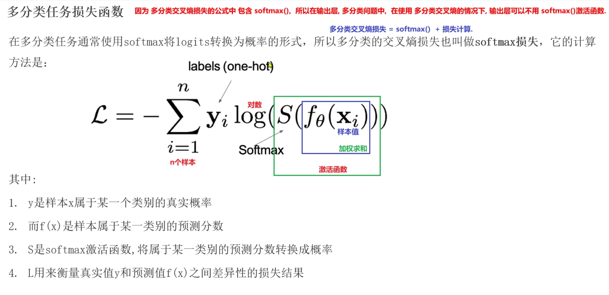
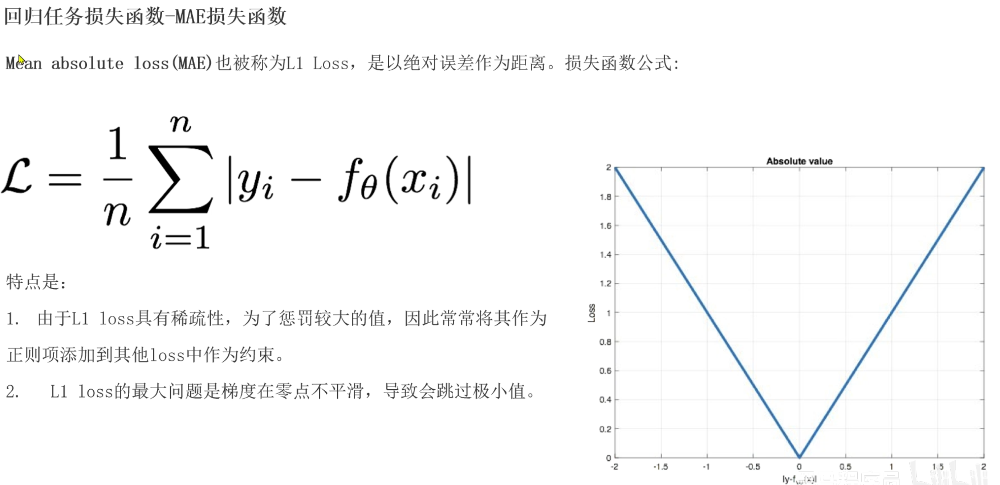
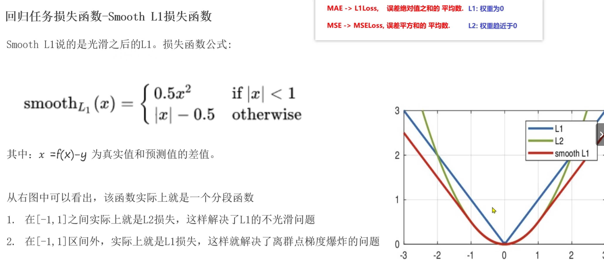
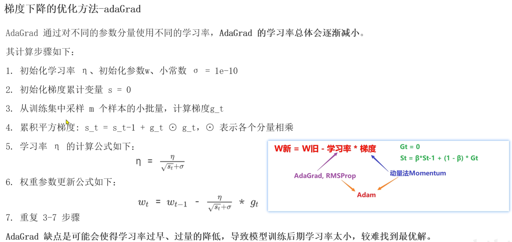
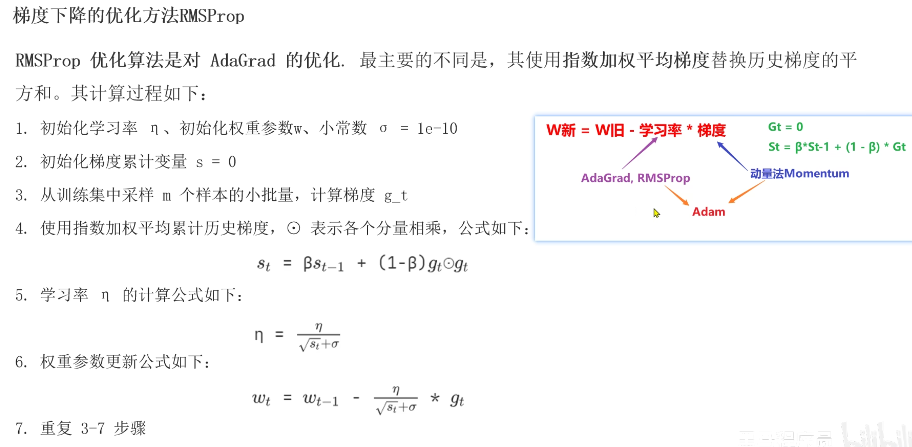
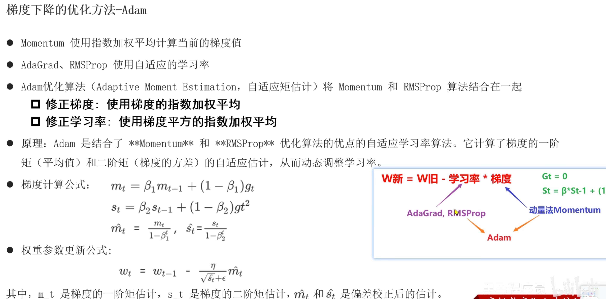
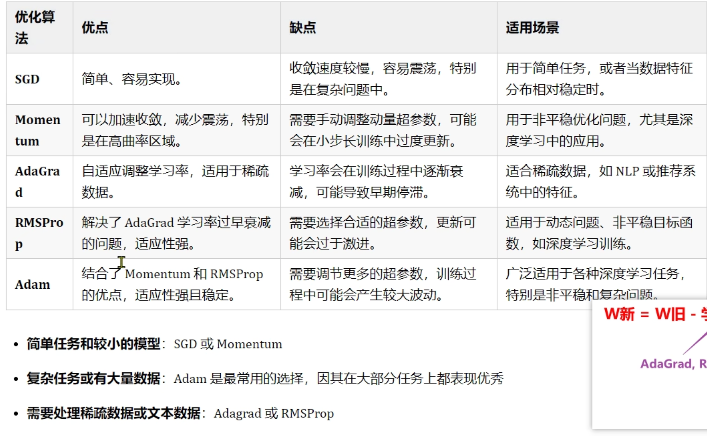
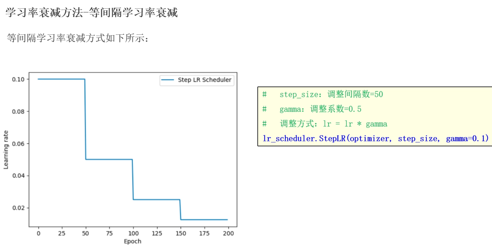
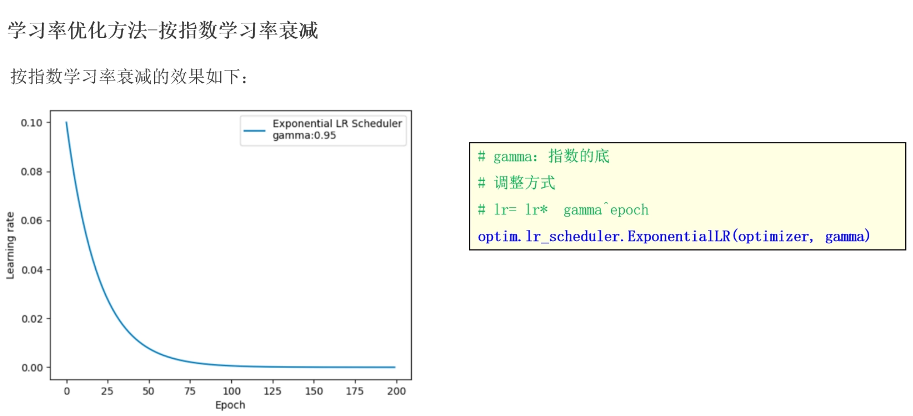
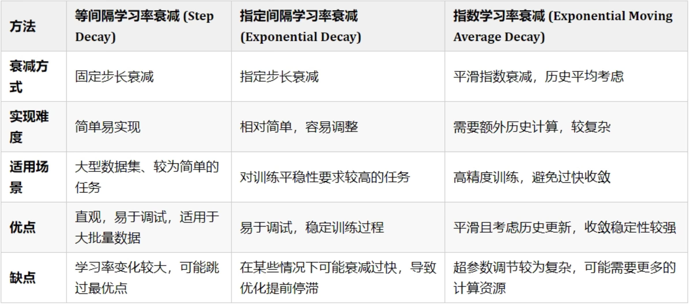

# 深度学习第四章节

##  神经网络搭建和参数计算

###  构建神经网络模型

```python
import torch
import torch.nn as nn  # 线性模型和初始化方法


# todo:1-创建类继承 nn.module类
class ModelDemo(nn.Module):
	# todo:2-定义__init__构造方法, 构建神经网络
	def __init__(self):
		# todo:2-1 调用父类的__init__方法
		super().__init__()
		# todo:2-2 创建隐藏层和输出层  定义属性
		# in_features: 输入特征数(上一层神经元个数)
		# out_features: 输出特征数(当前层神经元个数)
		self.linear1 = nn.Linear(in_features=3, out_features=3)
		self.linear2 = nn.Linear(in_features=3, out_features=2)
		self.output = nn.Linear(in_features=2, out_features=2)
		# todo:2-3 对隐藏层进行参数初始化
		# self.linear1.weight: 在类的内部调用对象属性
		nn.init.xavier_normal_(tensor=self.linear1.weight)
		nn.init.zeros_(tensor=self.linear1.bias)
		nn.init.kaiming_normal_(tensor=self.linear2.weight, nonlinearity='relu')
		nn.init.zeros_(tensor=self.linear2.bias)

	# todo:3-定义前向传播方法 forward(方法名固定) 得到预测y值
	def forward(self, x):  # x->输入样本的特征值
		# todo:3-1 第一层计算 加权求和值计算  激活值计算
		x = torch.sigmoid(input=self.linear1(x))
		# todo:3-2 第二层计算
		x = torch.relu(input=self.linear2(x))
		# todo:3-3 输出层计算  假设多分类问题
		# dim=-1: 按行计算, 一个样本一个样本算
		x = torch.softmax(input=self.output(x), dim=-1)
		# 返回预测值
		return x


if __name__ == '__main__':
	# 创建神经网络模型对象
	my_model = ModelDemo()
```

### 计算和查看模型参数

```python
# 创建模型预测函数
def train():
	# todo:1-创建神经网络模型对象
	my_model = ModelDemo()
	print('my_model->', my_model)
	# todo:2-构造数据集样本, 随机生成
	data = torch.randn(size=(5, 3))
	print('data->', data)
	print('data.shape->', data.shape)
	# todo:3-调用神经网络模型对象进行模型训练
	output = my_model(data)
	print('output->', output)
	print('output.shape->', output.shape)
	# todo:4-计算和查看模型参数
	print(('====================计算和查看模型参数==================='))
	# input_size: 样本的特征数
	# batch_size: 批量训练的样本数
	# summary(model=my_model, input_size=(3,), batch_size=5)
	summary(model=my_model, input_size=(5, 3))
	for name, param in my_model.named_parameters():
		print('name->', name)
		print('param->', param)


if __name__ == '__main__':
	train()
```

### 神经网络的优缺点

#### 优点

- 精度高，性能优于其他的机器学习方法，甚至在某些领域超过了人类
- 可以近似任意的非线性函数
- 近年来在学界和业界受到了热捧，有大量的框架和库可供调用

#### 缺点

- 黑箱，很难解释模型是怎么工作的
- 训练时间长，需要大量的计算力
- 网络结构复杂，需要调整超参数
- 小数据集上表现不佳，容易发生过拟合

## 损失函数

### 什么是损失函数

- 衡量模型参数质量的函数(评估模型)
- 对比模型预测值和真实值差异
- 指导通过梯度下降法计算梯度, 进行参数更新  loss.backward()

###  分类任务损失函数

#### 多分类任务损失函数

- 适用于多分类问题
- 计算出损失值后续结合梯度下降法和反向传播算法, 进行梯度更新
- nn.CrossEntropyLoss()



```python
# 适用于多分类
import torch
import torch.nn as nn


def dm01():
	# 手动创建样本的真实y值
	# y_true = torch.tensor(data=[[0, 1, 0], [1, 0, 0]], dtype=torch.float32)
	y_true = torch.tensor(data=[1, 2])
	print('y_true->', y_true.dtype)
	# 手动创建样本的预测y值 -> 模型预测值
	y_pred = torch.tensor(data=[[0.1, 0.8, 0.1], [0.7, 0.2, 0.1]], requires_grad=True, dtype=torch.float32)
	# 创建多分类交叉熵损失对象
	# reduction:损失值计算的方式, 默认mean 平均损失值
	criterion = nn.CrossEntropyLoss(reduction='sum')
	# 调用损失对象计算损失值
	# 预测y  真实y
	loss = criterion(y_pred, y_true)
	print('loss->', loss)


if __name__ == '__main__':
	dm01()
```

####  二分类任务损失函数

- 适用于二分类问题
- nn.BCEloss()


```python
# 适用于二分类
import torch
import torch.nn as nn


def dm01():
	# 手动创建样本的真实y值
	y_true = torch.tensor(data=[0, 1, 0], dtype=torch.float32)
	print('y_true->', y_true.dtype)
	# 手动创建样本的预测y值 -> 模型预测值
	# 0.6901, 0.5459, 0.2469 -> sigmoid函数的激活值
	y_pred = torch.tensor(data=[0.6901, 0.5459, 0.2469], requires_grad=True, dtype=torch.float32)
	# 创建多分类交叉熵损失对象
	# reduction:损失值计算的方式, 默认mean 平均损失值
	criterion = nn.BCELoss()
	# 调用损失对象计算损失值
	# 预测y  真实y
	loss = criterion(y_pred, y_true)
	print('loss->', loss)
	print('loss->', loss.requires_grad)


if __name__ == '__main__':
	dm01()
```

### 回归任务损失函数

####  MAE回归损失函数

- loss=(|y真实-y预测| + ...)/n
- 导数为-1或1, 0点位置不可导
- 也叫L1损失函数


```python
# 适用于回归任务
# MAE:导数为-1/1 0点位置不可导,一般取0作为导数
import torch
import torch.nn as nn


def dm01():
	# 手动创建样本的真实y值
	y_true = torch.tensor(data=[1.2, 1.5, 2.0], dtype=torch.float32)
	print('y_true->', y_true.dtype)
	# 手动创建样本的预测y值 -> 模型预测值
	# 0.6901, 0.5459, 0.2469 -> sigmoid函数的激活值
	y_pred = torch.tensor(data=[1.3, 1.7, 2.0], requires_grad=True, dtype=torch.float32)
	# 创建回归任务MAE损失对象
	# reduction:损失值计算的方式, 默认mean 平均损失值
	criterion = nn.L1Loss()
	# 调用损失对象计算损失值
	# 预测y  真实y
	loss = criterion(y_pred, y_true)
	print('loss->', loss)
	print('loss->', loss.requires_grad)


if __name__ == '__main__':
	dm01()
```

#### MSE损失函数

- 数据集中有异常(噪声)样本, 影响结果, 误差放大, 容易产生梯度爆炸
- 任意位置可导, 越接近底部, 导数越小, 符合梯度下降套路, 可以找到最小值


```python
# 适用于回归任务, 如果数据集有异常样本, 放大误差, 有可能导致梯度爆炸
# MSE: 任意位置都可导, 越接近底部, 导数越小
import torch
import torch.nn as nn


def dm01():
	# 手动创建样本的真实y值
	y_true = torch.tensor(data=[1.2, 1.5, 2.0], dtype=torch.float32)
	print('y_true->', y_true.dtype)
	# 手动创建样本的预测y值 -> 模型预测值
	# 0.6901, 0.5459, 0.2469 -> sigmoid函数的激活值
	y_pred = torch.tensor(data=[1.3, 1.7, 2.0], requires_grad=True, dtype=torch.float32)
	# 创建回归任务MAE损失对象
	# reduction:损失值计算的方式, 默认mean 平均损失值
	criterion = nn.MSELoss()
	# 调用损失对象计算损失值
	# 预测y  真实y
	loss = criterion(y_pred, y_true)
	print('loss->', loss)
	print('loss->', loss.requires_grad)


if __name__ == '__main__':
	dm01()
```

#### Smooth L1损失函数

- 中和MAE和MSE, w小于-1或w大于1使用MAE, w在[-1,1]范围内使用MSE
- 不受异常值影响,不容易产生梯度爆炸,在任意位置可导,可以找到最小值
- nn.SmoothL1()
- 既解决了MAE的0点位置不可导，又解决了MSE的异常值影响，不容易产生梯度爆炸



```python
# 适用于回归任务, 不受异常值影响
# smooth l1: 任意位置都可导, 越接近底部, 导数越小
import torch
import torch.nn as nn


def dm01():
	# 手动创建样本的真实y值
	y_true = torch.tensor(data=[1.2, 1.5, 2.0], dtype=torch.float32)
	print('y_true->', y_true.dtype)
	# 手动创建样本的预测y值 -> 模型预测值
	# 0.6901, 0.5459, 0.2469 -> sigmoid函数的激活值
	y_pred = torch.tensor(data=[1.3, 1.7, 2.0], requires_grad=True, dtype=torch.float32)
	# 创建回归任务smoothl1损失对象
	# reduction:损失值计算的方式, 默认mean 平均损失值
	criterion = nn.SmoothL1Loss()
	# 调用损失对象计算损失值
	# 预测y  真实y
	loss = criterion(y_pred, y_true)
	print('loss->', loss)
	print('loss->', loss.requires_grad)


if __name__ == '__main__':
	dm01()
```

##  神经网络优化方法

### 梯度下降算法回顾

- W = W - lr * grad

- 梯度下降算法是一种寻找最优网络参数的策略, 计算每次损失值对应的梯度, 进行参数更新
  - BGD, 使用全部样本计算梯度, 计算量大
  - SGD, 使用全部样本中随机一个样本计算梯度, 梯度可能不合理
  - Min-Batch, 使用一批样本计算梯度, 计算量相对小, 梯度更加合理

- Epoch：使用全部数据对模型进行一次完整训练，训练轮次
- Batch Size： 每次训练的样本数
- Iteration：使用一个batch数据对模型进行一次训练，迭代次数


### 反向传播算法(BP算法)

- 反向传播就是算当前损失值和参数的导数(梯度), 需要借助梯度连乘的方式

  

- 结合梯度下降算法更新参数  W1 = W0 - LR * 梯度 -> W0和LR已知, 梯度根据BP算法计算出

### 梯度下降优化方法

> 避免遇到鞍点（梯度为0）以及局部最小值情况


####  指数移动加权平均


- $$S_t = (1-\beta)Y_t + \beta S_{t-1}$$
- S100 = `0.1*Y100 + 0.1*0.9*Y99 + 0.1*0.9*0.9*Y98 + ....`
- 距离越近, 权重越大, 距离越远, 权重越小, 越接近当前时刻真实值
- β值越大, 受当前时刻真实值越小, 一般默认0.9, 这样第二个就是0.9^2, 第三个就是0.9^3, 以此类推, 越接近当前时刻真实值

#### SGD
- 它仅关注当前时刻的梯度，无历史梯度信息的利用。

#### 动量算法(Momentum)

- $$S_t = (1-\beta)g_t + \beta S_{t-1}$$
- 从梯度角度入手，结合指数移动加权平均计算出梯度值, 更新权重参数

  ```python
  # 动量法计算梯度实际上计算的是当前时刻的指数移动加权平均梯度值
  import torch
  from torch import optim
  
  
  def dm01():
  	# todo: 1-初始化权重参数
  	w = torch.tensor([1.0], requires_grad=True, dtype=torch.float32)
      # 自定义损失函数, 实际工作中调用不同任务的损失函数, 交叉熵损失/MSE损失...
  	loss = ((w ** 2) / 2.0).sum()
  	# todo: 2-创建优化器函数对象 SGD->动量法
  	# momentum: 动量法, 一般0.9或0.99
  	optimizer = optim.SGD([w], lr=0.01, momentum=0.9)
  	# todo: 3-计算梯度值
  	optimizer.zero_grad()
  	loss.sum().backward()
  	# todo: 4-更新权重参数 梯度更新
  	optimizer.step()
  	print('w.grad->', w.grad)
      # 第二次计算
      loss = ((w ** 2) / 2.0).sum()
      optimizer.zero_grad()
      loss.backward()
      optimizer.step()
      print('w.grad->', w.grad)
  
  
  if __name__ == '__main__':
  	dm01()
  ```

####  AdaGrad

- 随着训练次数增加调整学习率, 开始学习率大, 后续学习率越来越小
- 所有梯度的权重都是一样的



  ```python
  # adagrad优化方法调整学习率, 随着训练次数增加, 学习率越来越小, 一开始的学习率比较大
  import torch
  from torch import optim
  
  
  def dm01():
  	# todo: 1-初始化权重参数
  	w = torch.tensor([1.0], requires_grad=True, dtype=torch.float32)
  	loss = ((w ** 2) / 2.0).sum()
  	# todo: 2-创建优化器函数对象 Adagrad
  	optimizer = optim.Adagrad([w], lr=0.01)
  	# todo: 3-计算梯度值
  	optimizer.zero_grad()
  	loss.sum().backward()
  	# todo: 4-更新权重参数 梯度更新
  	optimizer.step()
  	print('w.grad->', w.grad, w)
  	# 第二次计算
  	loss = ((w ** 2) / 2.0).sum()
  	optimizer.zero_grad()
  	loss.backward()
  	optimizer.step()
  	print('w.grad->', w.grad, w)
  	# 第三次计算
  	loss = ((w ** 2) / 2.0).sum()
  	optimizer.zero_grad()
  	loss.backward()
  	optimizer.step()
  	print('w.grad->', w.grad, w)
  
  
  if __name__ == '__main__':
  	dm01()
  ```

#### RMSProp

- 对adagrap优化, 使用指数移动加权平均梯度代替累加梯度
- alpha越大, 历史梯度权重越大, 当前梯度权重越小，默认0.99

  ```python
  # rmsprop优化方法调整学习率, 对adagrad方法进行优化, 使用指数移动加权平均梯度代替历史累加梯度
  # 避免学习率过快减小, 导致后续模型收敛速度慢
  import torch
  from torch import optim
  
  
  def dm01():
  	# todo: 1-初始化权重参数
  	w = torch.tensor([1.0], requires_grad=True, dtype=torch.float32)
  	loss = ((w ** 2) / 2.0).sum()
  	# todo: 2-创建优化器函数对象  RMSprop
  	optimizer = optim.RMSprop([w], lr=0.01, alpha=0.9) 
  	# todo: 3-计算梯度值
  	optimizer.zero_grad()
  	loss.sum().backward()
  	# todo: 4-更新权重参数 梯度更新
  	optimizer.step()
  	print('w.grad->', w.grad, w)
  	# 第二次计算
  	loss = ((w ** 2) / 2.0).sum()
  	optimizer.zero_grad()
  	loss.backward()
  	optimizer.step()
  	print('w.grad->', w.grad, w)
  	# 第三次计算
  	loss = ((w ** 2) / 2.0).sum()
  	optimizer.zero_grad()
  	loss.backward()
  	optimizer.step()
  	print('w.grad->', w.grad, w)
  
  
  if __name__ == '__main__':
  	dm01()
  ```

#### Adam


- 修正梯度和学习率

  ```python
  # adam既优化学习率又优化梯度  adam=rmsprop+momentum
  import torch
  from torch import optim
  
  
  def dm01():
  	# todo: 1-初始化权重参数
  	w = torch.tensor([1.0], requires_grad=True, dtype=torch.float32)
  	loss = ((w ** 2) / 2.0).sum()
  	# todo: 2-创建优化器函数对象
  	# betas: 两个β值, 接收元组类型
  	optimizer = optim.Adam([w], lr=0.01, betas=(0.9, 0.99)) # 第一个β值是动量法, 第二个β值是RMSProp
  	# todo: 3-计算梯度值
  	optimizer.zero_grad()
  	loss.sum().backward()
  	# todo: 4-更新权重参数 梯度更新
  	optimizer.step()
  	print('w.grad->', w.grad, w)
  	# 第二次计算
  	loss = ((w ** 2) / 2.0).sum()
  	optimizer.zero_grad()
  	loss.backward()
  	optimizer.step()
  	print('w.grad->', w.grad, w)
  	# 第三次计算
  	loss = ((w ** 2) / 2.0).sum()
  	optimizer.zero_grad()
  	loss.backward()
  	optimizer.step()
  	print('w.grad->', w.grad, w)
  
  
  if __name__ == '__main__':
  	dm01()
  ```

####  如何选择梯度下降优化方法

- SGD和momentum适用于简单任务或浅层神经网络模型
- Adam适用于复杂任务或数据量大
- AdaGrad和RMSprop适用于文本数据处理 nlp



## 学习率衰减优化方法

###  为什么进行学习率优化

- **学习率过高，会造成梯度震荡，甚至爆炸，无法收敛。学习率过低，会造成模型收敛速度慢，甚至无法收敛**。
- 一般来说，前期学习率大，后期学习率小，可以加快模型收敛速度，避免过拟合。
- 根据模型训练次数, 手动调整学习率, 使模型前期收敛速度快, 后期收敛速度慢 

###  等间隔学习率衰减

```python
# 等间隔: 指定训练次数后修改学习率  lr=lr*gamma
import torch
from torch import optim
import matplotlib.pyplot as plt


def dm01():
	# todo: 1-初始化参数
	# lr epoch iteration
	lr = 0.1
	epoch = 200
	iteration = 10
	# todo: 2-创建数据集
	# y_true x w
	y_true = torch.tensor([0])
	x = torch.tensor([1.0], dtype=torch.float32)
	w = torch.tensor([1.0], requires_grad=True, dtype=torch.float32)
	# todo: 3-创建优化器对象 动量法
	optimizer = optim.SGD(params=[w], lr=lr, momentum=0.9)
	# todo: 4-创建等间隔学习率衰减对象
	# optimizer: 优化器对象
	# step_size: 间隔, 指定训练次数后修改学习率
	# gamma: 衰减系数 默认0.1 即 lr新 = lr旧 * gamma
	scheduer = optim.lr_scheduler.StepLR(optimizer=optimizer, step_size=50, gamma=0.5)
	# todo: 5-创建两个列表, 收集训练次数, 收集每次训练lr
	lr_list, epoch_list = [], []
	# todo: 6-循环遍历训练次数
	for i in range(epoch):
		# todo: 7-获取每次训练的次数和lr保存到列表中
		# scheduer.get_last_lr(): 获取最后lr
		lr_list.append(scheduer.get_last_lr())
		epoch_list.append(i)
		# todo: 8-循环遍历, batch计算
		for batch in range(iteration):
			# 先算预测y值 wx, 计算损失值 (wx-y_true)**2
			y_pred = w * x
			loss = (y_pred - y_true) ** 2
			# 梯度清零
			optimizer.zero_grad()
			# 梯度计算
			loss.backward()
			# 参数更新
			optimizer.step()
		# todo: 9-更新下一次训练的学习率
		scheduer.step()
	print('lr_list->', lr_list)

	plt.plot(epoch_list, lr_list)
	plt.xlabel("Epoch")
	plt.ylabel("Learning rate")
	plt.legend()
	plt.show()


if __name__ == '__main__':
	dm01()
```

### 指定间隔学习率衰减

- 前期模型训练设置比较多次数学习率更大, 中期设置相对少训练次数学习率小一些, 后期设置更少训练次数学习率更小一些

  ```python
  # 指定间隔: 通过步长列表指定训练次数后修改学习率  lr=lr*gamma
  import torch
  from torch import optim
  import matplotlib.pyplot as plt
  
  
  def dm01():
  	# todo: 1-初始化参数
  	# lr epoch iteration
  	lr = 0.1
  	epoch = 200
  	iteration = 10
  	# todo: 2-创建数据集
  	# y_true x w
  	y_true = torch.tensor([0])
  	x = torch.tensor([1.0], dtype=torch.float32)
  	w = torch.tensor([1.0], requires_grad=True, dtype=torch.float32)
  	# todo: 3-创建优化器对象 动量法
  	optimizer = optim.SGD(params=[w], lr=lr, momentum=0.9)
  	# todo: 4-创建等间隔学习率衰减对象
  	# optimizer: 优化器对象
  	# milestones: 指定间隔列表, 指定训练次数后修改学习率
  	# gamma: 衰减系数 默认0.1
  	scheduer = optim.lr_scheduler.MultiStepLR(optimizer=optimizer, milestones=[50, 100, 160], gamma=0.5, last_epoch=-1)
  	# todo: 5-创建两个列表, 收集训练次数, 收集每次训练lr
  	lr_list, epoch_list = [], []
  	# todo: 6-循环遍历训练次数
  	for i in range(epoch):
  		# todo: 7-获取每次训练的次数和lr保存到列表中
  		# scheduer.get_last_lr(): 获取最后lr
  		lr_list.append(scheduer.get_last_lr())
  		epoch_list.append(i)
  		# todo: 8-循环遍历, batch计算
  		for batch in range(iteration):
  			# 先算预测y值 wx, 计算损失值 (wx-y_true)**2
  			y_pred = w * x
  			loss = (y_pred - y_true) ** 2
  			# 梯度清零
  			optimizer.zero_grad()
  			# 梯度计算
  			loss.backward()
  			# 参数更新
  			optimizer.step()
  		# todo: 9-更新下一次训练的学习率
  		scheduer.step()
  	print('lr_list->', lr_list)
  
  	plt.plot(epoch_list, lr_list)
  	plt.xlabel("Epoch")
  	plt.ylabel("Learning rate")
  	plt.legend()
  	plt.show()
  
  
  if __name__ == '__main__':
  	dm01()
  ```

### 按指数学习率衰减

- 根据指数衰减, lr=$$lr * gamma^{epoch}$$ 

- 更符合梯度下降规律, 前期下降快, 中期缓慢, 后期更慢



  ```python
  # 指数间隔: 前期学习率衰减快, 中期慢, 后期更慢  lr=lr * gamma**epoch
  import torch
  from torch import optim
  import matplotlib.pyplot as plt
  
  
  def dm01():
  	# todo: 1-初始化参数
  	# lr epoch iteration
  	lr = 0.1
  	epoch = 200
  	iteration = 10
  	# todo: 2-创建数据集
  	# y_true x w
  	y_true = torch.tensor([0])
  	x = torch.tensor([1.0], dtype=torch.float32)
  	w = torch.tensor([1.0], requires_grad=True, dtype=torch.float32)
  	# todo: 3-创建优化器对象 动量法
  	optimizer = optim.SGD(params=[w], lr=lr, momentum=0.9)
  	# todo: 4-创建等间隔学习率衰减对象
  	# optimizer: 优化器对象
  	# gamma: 衰减系数 设置大一些, 初始指数大
  	scheduer = optim.lr_scheduler.ExponentialLR(optimizer=optimizer, gamma=0.9)
  	# todo: 5-创建两个列表, 收集训练次数, 收集每次训练lr
  	lr_list, epoch_list = [], []
  	# todo: 6-循环遍历训练次数
  	for i in range(epoch):
  		# todo: 7-获取每次训练的次数和lr保存到列表中
  		# scheduer.get_last_lr(): 获取最后lr
  		lr_list.append(scheduer.get_last_lr())
  		epoch_list.append(i)
  		# todo: 8-循环遍历, batch计算
  		for batch in range(iteration):
  			# 先算预测y值 wx, 计算损失值 (wx-y_true)**2
  			y_pred = w * x
  			loss = (y_pred - y_true) ** 2
  			# 梯度清零
  			optimizer.zero_grad()
  			# 梯度计算
  			loss.backward()
  			# 参数更新
  			optimizer.step()
  		# todo: 9-更新下一次训练的学习率
  		scheduer.step()
  	print('lr_list->', lr_list)
  
  	plt.plot(epoch_list, lr_list)
  	plt.xlabel("Epoch")
  	plt.ylabel("Learning rate")
  	plt.legend()
  	plt.show()
  
  
  if __name__ == '__main__':
  	dm01()
  ```

###  如何选择学习率衰减方法

- 优先选择指数学习率衰减方法
- 根据经验设置间隔选择指定间隔学习率衰减方法
- 简单模型选择等间隔学习率衰减方法

