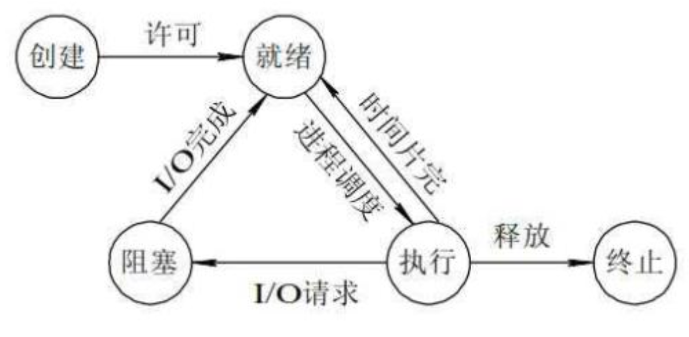

# 操作系统
## 操作系统的概念
### 操作系统的特性
| 特征  | 含义                                 | 关键点         | 举例           | 实现方式      |
| --- | ---------------------------------- | ----------- | ------------ | --------- |
| 并发性 | 系统允许**多个程序同时存在**，并**交替执行**         | 提高资源利用率、吞吐量 | 多个进程同时驻留内存   | 多道程序设计    |
| 共享性 | 多个进程可**共同使用资源**（资源复用）              | 并发进程共享系统资源  | 多个进程共享打印机    | 资源统一管理    |
| 虚拟性 | **一个物理资源**被“变成”**多个逻辑资源**，用户感觉“独占” | 逻辑 > 物理     | 虚拟内存、虚拟 CPU  | 时分复用、空分复用 |
| 异步性 | 程序执行过程**不可预期**，按调度策略**交替推进**       | 非连续执行       | 一个进程执行到一半被切换 | 调度、切换机制   |

### 操作系统的目标
| 目标   | 含义                          | 关键点/作用          | 举例或说明                  |
| ---- | --------------------------- | --------------- | ---------------------- |
| 方便性  | 为用户提供一个**方便的操作界面和开发环境**     | 屏蔽底层硬件差异，提高交互体验 | 提供图形界面、命令行界面、API       |
| 有效性  | 提高**系统资源利用率和吞吐量**，让硬件“物尽其用” | 强调性能和资源管理       | 多道程序、调度算法、缓冲区管理等       |
| 可扩充性 | 能**方便地加入新功能或适应新硬件**         | 保持系统的模块化、灵活性    | 插件式内核、微内核设计            |
| 开放性  | 遵循**开放标准**，便于移植、开发与兼容       | 硬件平台/开发者友好、便于移植 | Linux 遵循 POSIX，支持多平台部署 |

### 操作系统的发展
| 阶段/类型   | 特点/分类                                                | 关键速记要点                                                          | 举例                       |
| ------- | ---------------------------------------------------- | --------------------------------------------------------------- | ------------------------ |
| 无操作系统阶段 | - **人工操作方式**：用户手动操作输入设备 - **脱机输入/输出**：用外围设备批量输入输出 | 效率低、人工繁琐，没有程序自动调度                                               | 早期打孔卡机                   |
| 批处理系统   | - **单道批处理**：始终只运行一道作业 - **多道批处理**：多作业在内存中并存       | 单道特征：自动性、顺序性、单道性 多道优点：资源利用高、吞吐量大 缺点：周转慢、**无交互**           | 单道：IBM 709 多道：IBM 360 |
| 分时系统    | 支持**多人共享主机时间**，定时轮换使用处理器                             | 特点：交互性、**独占性**（轮转时独占CPU）、**及时性**、多路性                            | Unix                     |
| 实时系统    | 对任务响应必须在严格时限内完成                                      | 特点：交互性、独占性、及时性、多路性、**可靠性**                                      | 导弹系统、工业控制系统              |
| 微机操作系统  | 根据用户/任务数分类：                                          | 1. 单用户单任务：MS-DOS 2. 单用户多任务：Windows 7 3. 多用户多任务：Unix、Linux | MS-DOS, Windows, Linux   |

### 操作系统的功能
| 功能模块  | 核心作用                        | 关键子功能                                       | 速记关键词         |
| ----- | --------------------------- | ------------------------------------------- | ------------- |
| 处理机管理 | 控制**进程调度与切换**，实现对CPU的有序管理   | - 进程控制 - 进程同步与通信 - 调度算法等              | **进程管理**、调度   |
| 存储器管理 | 统一管理和分配**内存空间**，保障内存安全与高效使用 | - 内存分配 - 地址映射 - 内存保护 - 内存扩充（如虚拟内存） | 分配、保护、扩展      |
| 设备管理  | 控制和协调**I/O设备**的使用，屏蔽硬件差异    | - 缓冲管理 - 设备分配与控制 - 虚拟设备（如打印池）         | **缓冲**、分配、虚拟化 |
| 文件管理  | 实现对**数据文件的组织、存储与访问**        | - 文件空间管理 - 目录管理 - 文件访问与保护             | 存取、目录、保护      |
| 用户接口  | 为用户或程序提供与系统交互的通道            | - 用户接口（命令行、图形界面） - 程序接口（系统调用）            | CLI、GUI、系统调用  |

### 操作系统的结构
| 操作系统结构类型 | 特点与描述                                                                 |
| -------- | --------------------------------------------------------------------- |
| 无结构操作系统  | - 早期操作系统无统一设计思想 - 各过程随意调用，系统内部混乱 - 缺乏结构性                        |
| 模块化操作系统  | - 基于模块-接口方法设计 - 按功能划分模块，每个模块独立实现特定功能 - 各模块间通过接口交互，结构清晰          |
| 分层操作系统   | - 改进模块化结构中“无序性” - 使用**自底向上**方法构建各层，确保每层建立在稳定基础上 - 每层仅使用下一层提供的服务 |
| 微内核操作系统  | - 当前主流，支持多处理机 - 内核仅包含最基本功能，其它功能放在**服务器进程**中 - 结构清晰、易维护          |

#### 微内核
| 微内核特性    | 描述                                                       |
| -------- | -------------------------------------------------------- |
| 足够小的内核   | - 只实现最基本功能（硬件相关处理、基础通信等） - 不包含完整OS，仅为其提供运行基础          |
| 客户/服务器模式 | - 大部分OS功能以**服务器进程**形式运行 - 微内核与各功能模块解耦，提高系统灵活性         |
| 机制与策略分离  | - **机制**在微内核中，执行基本功能 - **策略**通过外部服务器进程实现 - 实现最小化内核 |
| 面向对象技术   | - 应用对象、封装、继承等思想构建系统 - 提高系统的可扩展性、可维护性和健壮性              |

## 进程管理
### 进程的特征
| 特征  | 速记点描述                      |
| --- | -------------------------- |
| 动态性 | 进程是程序的执行过程，有生命周期（创建→执行→消亡） |
| 并发性 | 多个进程可以同时存在于内存中并发运行         |
| 独立性 | 每个进程独立运行，拥有自己的资源和调度控制      |
| 异步性 | 每个进程按不可预知的速度独立运行，互不干扰      |

- PCB 全称是 Process Control Block，中文叫 进程控制块，是操作系统用来管理进程的最关键数据结构。可以把它理解为“进程的身份证”，操作系统就是通过 PCB 来识别和控制每一个进程的。

### 进程的三种基本状态
- 三种基本状态（就绪、运行、阻塞）描述的是进程在执行过程中的不同阶段：就绪等待CPU，运行中使用CPU，阻塞等待资源

| 状态名称    | 含义              | 特点            | 转换条件                       |
| ------- | --------------- | ------------- | -------------------------- |
| **就绪态** | 进程已具备运行条件，等待CPU | 有资源但没CPU      | 获取CPU → 变为运行态              |
| **运行态** | 正在使用CPU执行指令     | 独占CPU（单核只有一个） | 被剥夺CPU → 就绪态 等待事件 → 阻塞态 |
| **阻塞态** | 正在等待某事件（如I/O）   | 没有运行条件        | 事件完成 → 回到就绪态               |

#### 挂起状态
- 挂起状态是指进程被操作系统暂时暂停执行以便检查或调度

| 挂起状态产生原因 | 说明                    | 目的/作用              |
| -------- | --------------------- | ------------------ |
| 终端用户的请求  | 用户程序运行中发现可疑问题，主动使程序暂停 | 便于用户研究程序执行情况或进行修改  |
| 父进程请求    | 父进程希望挂起某个子进程          | 便于考查子进程或协调多个子进程的活动 |
| 负荷调节的需要  | 实时系统负荷过重，影响实时任务控制     | 挂起不重要的进程，保证系统正常运行  |
| 操作系统的需要  | 操作系统主动挂起某些进程          | 检查资源使用或进行记账管理      |

### 进程同步
- 临界资源（Critical Resource） 是指 多个进程/线程不能同时使用的共享资源，必须**互斥访问**，否则会发生冲突或错误。
- 临界区（Critical Section） 是指 **访问临界资源的代码段**。

### 同步机制规则
| 规则名称 | 说明                       | 目的            |
| ---- | ------------------------ | ------------- |
| 空闲让进 | 当临界区空闲时，允许请求进入临界区的进程立即进入 | 有效利用临界资源      |
| 忙则等待 | 临界区被占用时，其他进程必须等待         | 保证临界资源的互斥访问   |
| 停止等待 | 保证等待进程在有限时间内能进入临界区       | 避免“死等”（死锁）    |
| 让权等待 | 进程不能进入临界区时应释放CPU         | 避免“忙等”浪费CPU资源 |

### 信号量
- 原语（Primitive） 是操作系统提供的一个 不可被打断 的最小执行单元，常用于多线程/进程同步中，保证共享资源的安全访问。
- 低级原语是“底层锁” —— 控资源互斥，不管通信
- 高级原语是“系统服务” —— 能同步、能通信、能阻塞管理

| 操作名称       | 类型   | 作用简介             |
| ---------- | ---- | ---------------- |
| P 操作       | 低级原语 | 申请资源，若资源不可用则阻塞等待 |
| V 操作       | 低级原语 | 释放资源，唤醒等待进程      |
| send 操作    | 高级原语 | 发送信号量（消息传递）      |
| receive 操作 | 高级原语 | 接收信号量（消息传递）      |

- P操作尝试“占用”一个资源，若资源已用完，则阻塞等待。 每次执行P操作会使信号量S减1
- V操作释放一个资源，若有进程等待，则唤醒其中一个。 每次执行V操作会使信号量S加1
- send/receive 更多用于进程间通信的高级同步。

### 进程通信
| 通信方式                | 是否共享内存  | 是否阻塞  | 特点简介                              |
| ------------------- | ------- | ----- | --------------------------------- |
| 管道（Pipe）            | ❌ 否     | ✅ 是/否 | 父子进程间简单通信（匿名管道）或任意进程通信（命名管道 FIFO） |
| 消息队列（Message Queue） | ❌ 否     | ✅ 是/否 | 内核维护的消息列表，支持异步、结构化传输              |
| 信号量（Semaphore）      | ❌ 否     | ✅ 是   | 一般用于同步或互斥，不适合传数据                  |
| 共享内存（Shared Memory） | ✅ 是     | ❌ 否   | 速度最快，需要配合信号量等机制控制同步               |
| 套接字（Socket）         | ❌ 否     | ✅ 是/否 | 跨主机通信，基于网络协议，适合分布式系统              |
| 信号（Signal）          | ❌ 否     | ✅ 是   | 传递简单通知或控制指令（如中断）                  |
| 内存映射文件（mmap）        | ✅ 是（文件） | ❌ 否   | 多进程共享同一个磁盘文件映射的内存区域               |

- mmap 是一种用于 内存映射文件或设备 到进程地址空间的系统调用，它允许你将文件或其他对象映射进内存，使得你可以像访问普通内存一样对文件进行读写操作。

### 进程调度算法
| 调度算法       | 特点描述              | 优缺点           |
| ---------- | ----------------- | ------------- |
| FIFO（先入先出） | 进程按到达顺序排队执行       | 有利于长作业，不利于短作业 |
| 短进程优先      | 优先执行运行时间短的进程      | 有利于短进程，不利于长作业 |
| 高优先权       | 根据优先权调度，分静态和动态优先权 | 可能导致低优先级进程饥饿  |
| 时间片轮转      | 每个进程分配固定时间片，循环执行  | 公平，适合交互系统，响应快 |

## 处理和调度
### 作业状态
| 状态名称 | 说明                                                         |
| ---- | ---------------------------------------------------------- |
| 提交   | 作业从输入设备进入外部存储设备的过程，信息未完全进入系统，不能被调度程序选取。                    |
| 收容   | 也叫后备状态，作业被存放在外存的“输入井”中，等待后续处理。                             |
| 执行   | 调度程序从后备作业中选取作业加载到内存并分配资源，作业进入执行状态。但同一时刻只有部分作业占用CPU，其余处于等待。 |
| 完成   | 作业运行结束，资源未完全回收，系统进行打印结果、回收资源等善后处理。                         |

### 进程调度时机
- 进程调度指的是操作系统在内存中多个就绪进程之间分配CPU使用权，是微观的调度，涉及进程切换

| 调度时机                      | 说明                      |
| ------------------------- | ----------------------- |
| 1. 正在运行的进程运行完毕或发生不可继续运行事件 | 当前进程执行完毕或遇到阻塞，需调度其他进程执行 |
| 2. 运行中的进程提出输入/输出请求而暂停运行   | 进程等待I/O操作完成，CPU调度其他进程   |
| 3. 进程执行通信或同步原语操作（如 P 操作）  | 因同步操作阻塞，CPU调度其他进程       |
| 4. 可抢先式调度中更高优先级进程进入就绪队列   | 更高优先级进程抢占CPU，当前进程被挂起    |
| 5. 时间片轮转法中时间片用完           | 当前进程时间片耗尽，调度器切换到下一个进程   |

### 死锁产生的四个必要条件
| 条件名称    | 说明                                              |
| ------- | ----------------------------------------------- |
| 互斥条件    | 资源在某一时刻只能被一个进程独占使用，其他进程必须等待资源释放才能使用。            |
| 请求和保持条件 | 进程已占有至少一个资源，同时又请求新的资源，若新资源被占用，则进程阻塞，但不释放已占有的资源。 |
| 不剥夺条件   | 资源只能由占有它的进程主动释放，不能被系统强行剥夺。                      |
| 环路等待条件  | 存在进程-资源的环形等待链，进程依次等待下一个进程占有的资源，形成死锁环路。          |

### 死锁的处理
| 处理方法 | 说明                                     |
| ---- | -------------------------------------- |
| 预防死锁 | 事先破坏产生死锁的四个必要条件之一或多个，通过设置限制条件避免死锁发生。   |
| 避免死锁 | 银行家算法。动态分配资源时检测系统安全状态，防止进入不安全状态，从而避免死锁。      |
| 检测死锁 | 允许死锁发生，通过检测机制发现死锁，并定位相关进程和资源。          |
| 解除死锁 | 发现死锁后采取措施，如撤销或挂起进程，回收资源，恢复进程运行，解除死锁状态。 |

## 存储器管理
### 存储器分类
| 存储类型            | 访问速度        | 容量      | 所在位置         | 主要作用与特点                       |
| --------------- | ----------- | ------- | ------------ | ----------------------------- |
| **寄存器**         | 极快（最快）      | 极小      | CPU 内部       | 暂存指令/数据，直接与CPU协同工作，价格昂贵，数量有限  |
| **高速缓存（Cache）** | 很快          | 较小      | CPU 与内存之间    | 存放最近/常用数据，减小CPU与内存速度差，提高系统效率  |
| **内存（主存）**      | 中等（比Cache慢） | 中等      | 主板上，直接与CPU相连 | 存放运行中的程序和数据，CPU必须从内存中读取指令和数据  |
| **磁盘缓存**        | 较慢（比内存慢）    | 大（缓冲区级） | 磁盘和内存之间      | 缓解磁盘I/O慢的问题，提前加载常用数据，减少磁盘访问次数 |

### 程序装入方式
| 装入方式        | 地址处理方式                     | 是否支持移动 | 是否支持分段装入 | 适用环境      | 主要特点/备注                                  |
| ----------- | -------------------------- | ------ | -------- | --------- | ---------------------------------------- |
| **绝对装入**    | 编译时生成**绝对地址**              | ❌ 不能移动 | ❌ 不支持    | 单道程序系统    | 编译阶段固定内存地址，装入时直接执行，简单高效，但灵活性差            |
| **可重定位装入**  | 编译时生成**相对地址**， 装入时静态重定位 | ❌ 不能移动 | ❌ 不支持    | 多道批处理系统   | 装入时根据起始地址重定位；装入后地址固定，不能再动；需一次性分配完整内存空间   |
| **动态运行时装入** | 编译时生成**相对地址**， 运行时动态重定位 | ✅ 支持移动 | ✅ 支持     | 多道+虚拟存储系统 | 程序可分段、动态装入、动态扩展；支持非连续分配、地址空间大、程序段共享、高灵活性 |

### 连续内存分配
- 连续内存分配是指将内存中的空闲区域按照地址连续的方式分配给作业，从而使作业可以连续地使用内存空间。

| 分配方式         | 是否支持多道程序  | 分区是否固定 | 是否支持移动       | 存在问题              | 适用场景    | 补充说明            |
| ------------ | --------- | ------ | ------------ | ----------------- | ------- | --------------- |
| **单一连续分配**   | ❌ 只支持一道作业 | ❌ 无分区  | ❌ 不支持        | 内存利用率低，只能一道程序     | 单用户操作系统 | 最简单，已基本淘汰       |
| **固定分区分配**   | ✅ 支持      | ✅ 固定大小 | ❌ 不支持        | 内部碎片大（分区大 > 作业大小） | 早期多道系统  | 每个分区一道作业，分区提前划定 |
| **动态分区分配**   | ✅ 支持      | ❌ 动态划分 | ❌ 不支持        | 外部碎片严重            | 多道程序系统  | 每次装入根据作业需要分配内存  |
| **可重定位分区分配** | ✅ 支持      | ❌ 动态划分 | ✅ 支持（重定位+紧凑） | 有开销但能解决外部碎片问题     | 高级操作系统  | 支持地址重定位和紧凑处理    |

- 紧凑（Compaction）是指将分散在内存中零碎的空闲分区，通过搬移正在运行的程序（即已分配分区）的位置，将它们集中起来形成一个大的连续空闲区，从而使一个较大的作业能装入内存。

### 动态分区分配算法
- 动态分区分配是为了在多道程序环境下动态分配内存，根据作业实际需要的大小，临时划分内存分区，从而提高内存利用率，支持多个作业并发执行。

| 算法名称         | 英文缩写/别名       | 排列依据     | 查找起点      | 优点             | 缺点             |
| ------------ | ------------- | -------- | --------- | -------------- | -------------- |
| **首次适应算法**   | **First Fit** | 按地址递增排序  | 空闲区表首开始   | 查找快，开销小        | 易产生大量小碎片（靠前位置） |
| **循环首次适应算法** | **Next Fit**  | 按地址递增排序  | 上次查找结束处继续 | 避免首次适应“靠前碎片堆积” | 整体内存利用率不如最佳适应  |
| **最佳适应算法**   | **Best Fit**  | 按大小递增排序  | 空闲区表首开始   | 能尽量利用小块空间      | 易产生许多无法再用的小碎片  |
| **最坏适应算法**   | **Worst Fit** | 按大小递减排序  | 空闲区表首开始   | 保留大空闲区，方便大作业   | 分配后剩大空闲区→也易碎片化 |
| **快速适应算法**   | **Quick Fit** | 分区大小分类链表 | 查找对应大小链表  | 查找效率高，分配速度快    | 维护多个链表开销大，更新麻烦 |

### 分页和分段
- 分页：把程序按固定大小切成页，让他们分散存到内存空闲块中，提高内存利用率，对程序员不可见。
- 分段：把程序按逻辑功能划分为段（如代码段、数据段），方便管理和共享，对程序员可见。

| 对比项        | 分页（Page）      | 分段（Segment）   | 段页式（Segmented Paging） |
| ---------- | ------------- | ------------- | --------------------- |
| 📌 分配单位    | 页（Page）       | 段（Segment）    | 段 ➕ 页                 |
| 📌 单位性质    | 物理单位          | 逻辑单位          | 逻辑 + 物理组合             |
| 📌 地址结构    | 一维（页号 + 页内地址） | 二维（段号 + 段内地址） | 三维（段号 + 页号 + 页内地址）    |
| 📌 地址空间    | 一维线性地址空间      | 二维逻辑结构        | 二维逻辑结构 + 页表支持         |
| 📌 页/段大小   | 固定，由系统统一设定    | 不固定，由用户程序决定   | 段大小不一，每段再分页，页大小固定     |
| 📌 分配方式    | 离散分配          | 离散分配（逻辑上连续）   | 离散分配                  |
| 📌 地址转换机制  | 页表            | 段表            | 段表 ➕ 页表               |
| 📌 设计目的    | 解决内存碎片问题，提高内存利用率       | 方便程序设计和逻辑管理   | 综合分页和分段优点             |
| 📌 是否支持共享段 | 不支持           | 支持            | 支持                    |
| 📌 程序员可见性  | 不可见，系统自动完成    | 可见，程序员感知逻辑段   | 可见段结构，分页由系统处理         |

### 虚拟存储器三大特性
- 虚拟存储器是操作系统为了实现多道程序并发执行而提供的一种存储器管理技术，它将内存和外存（硬盘）结合起来，形成一个逻辑上的大内存，从而实现内存的按需分配和动态扩展。**虚拟存储器利用“虚拟性”提供大地址空间，用“多次性”按需加载程序片段，再通过“对换性”腾出空间保持高效运行。**

| 特性      | 含义说明                               | 举例/关键词              | 目的/好处             |
| ------- | ---------------------------------- | ------------------- | ----------------- |
| **多次性** | 作业不是一次性全部调入内存，而是**按需分批**调入（边运行边加载） | 局部性原理、按需分页          | **减少内存压力**，提升并发能力 |
| **对换性** | 暂时不用的内容可以**调出内存到磁盘**，等需要再调回        | 整体对换（进程级）、部分对换（页/段） | **腾出空间**，提升内存利用率  |
| **虚拟性** | 用户看到的地址空间（逻辑内存）**比实际内存大得多**        | 虚拟地址 > 物理内存，地址映射机制  | **让程序感觉内存“无限大”**  |

### 请求分页存储管理方式
- 是虚拟存储器的一种管理方法，核心思想：程序的页面（代码和数据）只有在真正需要使用时，才从外存调入内存，而不是一开始就全部加载进来。

| 调页策略                       | 定义说明                        | 优点                | 缺点                  | 典型应用              |
| -------------------------- | --------------------------- | ----------------- | ------------------- | ----------------- |
| **预调页策略** (Pre-Paging)     | 一次性调入多个相邻页，预测后续可能访问的页面提前加载。 | 减少缺页中断次数，提高首次加载效率 | 若预测不准，调入未使用页，浪费内存资源 | 程序首次加载时，程序员可指定预调页 |
| **请求调页策略** (Demand Paging) | 只在访问页面时发生缺页，才调入所需页面。        | 调入的页面一定会被访问，内存利用高 | 缺页中断较多，开销较大         | 当前主流虚拟存储器系统采用策略   |

### 页面置换算法
- 页面置换算法是虚拟存储器管理中的一个重要概念，它决定了在内存不足时，如何选择要换出的页面。

| 算法名称    | 原理说明                | 优缺点                    | 实现复杂度 | 备注           |
| ------- | ------------------- | ---------------------- | ----- | ------------ |
| 最佳（OPT） | 淘汰未来最长时间内不再使用的页面    | 理论最优，但需预知未来访问序列        | 不可实现  | 只作为最优参考标准    |
| FIFO    | 淘汰最先进入内存的页面         | 简单实现，可能淘汰常用页（Belady现象） | 低     | 可能出现Belady异常 |
| LRU     | 淘汰最近最久未使用的页面        | 效果好，接近OPT，但实现较复杂       | 中高    | 需要记录访问时间     |
| Clock   | 使用“访问位”和“修改位”指针循环检测 | 性能接近LRU，硬件支持较好         | 中     | 适合实际系统       |

- Belady: 在某些情况下，增加物理内存的页面数，反而导致缺页次数增多的奇怪现象。因为FIFO算法只考虑了页面进入内存的先后顺序，而没有考虑页面的访问频率。

## 设备管理
### I/O设备分类
| 分类依据    | 分类类别 | 说明                  |
| ------- | ---- | ------------------- |
| 按使用特性   | 存储设备 | 用于数据存储，如硬盘、闪存       |
|         | 输入设备 | 用于向计算机输入信息，如键盘、鼠标   |
|         | 输出设备 | 用于从计算机输出信息，如显示器、打印机 |
| 按传输速率   | 低速设备 | 传输速度较慢，如键盘、鼠标       |
|         | 中速设备 | 传输速度中等，如磁带          |
|         | 高速设备 | 传输速度快，如硬盘、光驱        |
| 按共享属性   | 独占设备 | 同一时刻只能被一个进程使用       |
|         | 共享设备 | 多个进程可以共享使用          |
|         | 虚拟设备 | 通过软件模拟的设备           |
| 按信息交换单位 | 块设备  | 以块为单位进行数据传输，如硬盘     |
|         | 字符设备 | 以字符为单位进行数据传输，如键盘、鼠标 |

### I/O软件分类
| 软件层级        | 作用说明                                   | 备注                     |
| ----------- | -------------------------------------- | ---------------------- |
| **用户层软件**   | 提供用户与操作系统交互的接口，通过系统调用访问操作系统服务          | 高级语言通过库函数调用系统调用        |
| **设备独立性软件** | 统一设备驱动接口，负责设备命名、保护、分配和释放，管理数据传输存储空间    | 实现设备管理的抽象，屏蔽硬件差异       |
| **设备驱动程序**  | 与硬件设备控制器直接通信，实现具体设备操作指令，控制设备运行         | 具体实现硬件操作，依赖硬件特性        |
| **中断处理程序**  | 保存被中断进程环境，处理中断信号，切换进程上下文，读取设备状态及修改进程状态 | 保证系统响应硬件中断，恢复被中断进程运行状态 |

### I/O控制方式
- 指的是操作系统或CPU如何管理和控制外围设备（如键盘、磁盘、打印机）的输入输出

| 控制方式         | 原理及特点                                | 优缺点              | CPU与I/O关系             |
| ------------ | ------------------------------------ | ---------------- | --------------------- |
| 程序I/O方式      | CPU不断轮询检测I/O设备状态（忙等待），无中断机制          | 简单实现，但浪费CPU资源    | CPU等待I/O完成，不能做其它任务    |
| 中断驱动I/O方式    | I/O设备完成操作后通过中断通知CPU，CPU暂停当前任务处理中断    | CPU和I/O并行，提高效率   | CPU执行任务，I/O完成时打断CPU处理 |
| 直接存储器访问(DMA) | I/O设备直接与内存交换数据，CPU只负责启动和结束，减少CPU干预   | 进一步提升CPU利用率      | CPU与I/O设备、内存并行工作      |
| 通道方式         | 专门I/O处理机（通道）负责I/O任务，CPU主要处理数据，三者并行工作 | 最大化系统吞吐量，CPU负担最轻 | CPU、通道、I/O设备三者同时工作    |

- 程序I/O：CPU等设备，一直盯着设备，看它有没有准备好，浪费资源。
- 中断驱动：设备准备好了，打个招呼给CPU，CPU再去处理，节省等待时间。
- DMA：设备和内存直接传输数据，CPU只管安排，不用操心具体数据搬运。
- 通道方式：多了个专门的“帮手”去管I/O，CPU专心干别的，效率最高。

### I/O通道控制方式
- 一种更高级的I/O控制方式，通常出现在大型机和高端服务器中
- I/O通道是专门的硬件“辅助处理器”或“专用控制器”，负责处理I/O任务，减轻CPU负担
- 这样CPU可以专注做计算，I/O通道专注做设备管理，实现三者（CPU、通道、设备）并行工作，大幅提升性能。

| 通道类型   | 特点描述                                       | 适用设备类型  | 优缺点                    |
| ------ | ------------------------------------------ | ------- | ---------------------- |
| 字节多路通道 | 多个非分配子通道，按时间片轮转方式分时共享主通道，按字节交叉传输           | 低速设备    | 利用率较高，不丢信息，但不适合高速设备    |
| 数组选择通道 | 只有一个分配子通道，一次只能控制一台设备，设备独占通道，闲置时不能切换        | 高速设备    | 传输速率高，但通道利用率低，易闲置      |
| 数组多路通道 | 结合数组选择通道的高速和字节多路通道的分时共享，含多个非分配子通道，实现数组方式传输 | 高速和中速设备 | 传输速率高且通道利用率好，广泛用于多设备连接 |

- 字节多路通道：像排队轮流用，一个字节一个字节地传输，适合慢设备。
- 数组选择通道：一个设备一次用到底，快但浪费通道。
- 数组多路通道：综合两者优点，快速且多设备共享，效率高。  

### 中断分类
- 中断是计算机系统中的一种重要机制，用于处理突发事件或异步事件，提高系统的响应能力和可靠性。

| 中断类型 | 来源           | 说明                      | 例子               |
| ---- | ------------ | ----------------------- | ---------------- |
| 内中断  | 处理器和内存内部产生   | 也称陷阱，程序执行错误或非法操作导致的中断   | 地址非法、校验错误、执行特权指令 |
| 外中断  | 处理器和内存外部设备产生 | 设备或外部事件触发的中断            | I/O设备中断、断点调试     |
| 软中断  | 软件模拟硬中断的信号通信 | 用于进程间通信，CPU在适当时机处理软中断信号 | Unix系统的信号机制      |
| 硬中断  | 硬件设备产生的中断 | 用于处理硬件设备的中断请求 | 键盘、鼠标、网卡中断 |

### 缓冲分类
- I/O设备速度远低于CPU，为了协调I/O设备和CPU的速度差，引入缓冲区。

| 缓冲类型    | 工作原理                                     | 优点                        | 缺点 / 注意事项                  |
| ------- | ---------------------------------------- | ------------------------- | -------------------------- |
| **单缓冲** | 设置一个缓冲区，I/O 和 CPU 轮流访问它                  | 简单，支持基本并行处理               | CPU 或 I/O 常常空闲，效率不高        |
| **双缓冲** | 设置两个缓冲区，I/O 装填一个，CPU 处理另一个，两者并行交替        | 提高 CPU 与 I/O 并行度，减少等待时间   | CPU 必须等待另一个缓冲区填满或清空，仍有等待情况 |
| **缓冲池** | 设置多个缓冲区，并划分为三种：①空缓冲区 ②输入缓冲区 ③输出缓冲区；用队列管理 | 支持多个并发 I/O 操作，效率最高，资源利用率高 | 管理复杂，需要操作系统协调多个队列          |

#### 举例
| 项目        | 解释                                   |
| --------- | ------------------------------------ |
| **T1**    | I/O 设备读取数据 → 写入缓冲区的时间                |
| **T2**    | 操作系统从缓冲区 → 用户进程的时间                   |
| **T3**    | CPU 对数据的处理时间                         |
| **单缓冲效率** | 取决于 Max(T1, T3) + T2                 |
| **双缓冲优势** | T1 和 T3 可以**真正并行**（一个写缓冲，一个读处理），减少等待 |
| **缓冲池作用** | 支持更多设备、多个进程同时读写数据，提升 I/O 整体吞吐能力      |

### 磁盘调度算法
- 磁盘调度就是操作系统为了提高磁盘访问效率，根据一定算法安排磁头移动的顺序，从而减少寻道时间（磁头移动的时间）和平均响应时间。

| 算法     | 简称    | 原理                          | 优点          | 缺点                  | 关键词/比喻   |
| ------ | ----- | --------------------------- | ----------- | ------------------- | -------- |
| 先来先服务  | FCFS  | 谁先请求谁先服务，按请求顺序处理            | 简单、公平、实现容易  | 平均寻道时间不稳定，可能很长      | 排队买票     |
| 最短寻道优先 | SSTF  | 选离当前磁头最近的磁道请求优先             | 平均寻道时间较短    | 有可能导致远程请求长期饥饿       | 最近的先上车   |
| 扫描算法   | SCAN  | 磁头按一个方向扫过去，有请求就服务，走到底再反方向扫回 | 避免饥饿，效率较高   | 两端请求被服务频率低          | 电梯（来回跑）  |
| 循环扫描   | CSCAN | 磁头只朝一个方向移动，走到底立即跳回起点重新开始扫描  | 服务更均衡，延迟更平均 | 跳回成本高（非真正物理跳，但服务延迟） | 单向电梯，绕圈跑 |

### 磁盘阵列
- RAID 是通过将多个磁盘组合成一个逻辑磁盘，利用数据冗余和并行访问技术，来提升：存储性能（提高读写速度），容错能力（防止数据丢失），存储容量（多个盘组合）

| 级别         | 关键特性                | 容错   | 读性能   | 写性能    | 成本/磁盘利用率   | 适用场景 / 说明      |
| ---------- | ------------------- | ---- | ----- | ------ | ---------- | -------------- |
| **RAID 0** | 数据条带化并行存储（无冗余）      | ❌ 无  | ✅ 高   | ✅ 高    | ✅ 高（100%）  | 对性能要求高、不关心数据安全 |
| **RAID 1** | 镜像备份（数据复制）          | ✅ 一块 | ✅ 高   | ❌ 一般   | ❌ 低（50%）   | 数据安全要求高，读多写少   |
| **RAID 2** | 位/字节级交叉 + 海明校验      | ✅ 多块 | ❌ 较低  | ❌ 较低   | ❌ 低（多个冗余盘） | 学术研究用，几乎不实际使用  |
| **RAID 3** | 条带化 + 单校验盘（位交叉）     | ✅ 一块 | ✅ 高   | ❌ 低    | ❌ 中等       | 连续大数据传输，如视频    |
| **RAID 4** | 块级条带化 + 单校验盘        | ✅ 一块 | ✅ 高   | ❌ 写易冲突 | ❌ 中等       | 少量写，多读的应用      |
| **RAID 5** | 块级条带 + 校验块分布        | ✅ 一块 | ✅ 高   | ✅ 中等   | ✅ 较高（节省空间） | 最常用，读写均衡场景     |
| **RAID 6** | RAID5 + 双校验盘        | ✅ 两块 | ✅ 高   | ❌ 写慢   | ❌ 低（空间冗余高） | 高容错要求，如金融      |
| **RAID 7** | RAID3基础 + 缓存 + 实时控制 | ✅ 一块 | ✅ 非常高 | ✅ 非常高  | ❌ 极贵       | 高端实时系统，商用很少    |

### 设备分配数据结构
- 操作系统不能直接对硬件操作，它必须通过某种“中介结构”来统一调度各种设备
- 当多个设备共享一个控制器或通道时，就需要分层管理结构来明确谁控制谁

| 数据结构       | 缩写   | 管理对象        | 每个对应的个数 | 说明与作用                                    |
| ---------- | ---- | ----------- | ------- | ---------------------------------------- |
| **设备控制表**  | DCT  | 每个**外设**    | 每个外设一个  | 描述单个物理设备的状态、分配情况、控制信息等。比如打印机、磁带驱动器等。     |
| **控制器控制表** | COCT | 每个**控制器**   | 每个控制器一个 | 控制器负责管理多个外设，对外设统一调度和管理。比如一个磁盘控制器控制多个硬盘。  |
| **通道控制表**  | CHCT | 每个**I/O通道** | 每个通道一个  | I/O 通道可以并行处理多个设备的请求，用于高速传输，类似于 DMA 控制器。  |
| **系统设备表**  | SDT  | **全系统设备总览** | 系统中只有一个 | 描述系统中所有设备的总体信息（如设备类型、编号、状态等），相当于全局目录或总表。 |

## 文件管理
### 文件类型分类
| 分类角度         | 分类方式  | 举例或说明                        |
| ------------ | ----- | ---------------------------- |
| **按用途**      | 系统文件  | 操作系统内核、驱动程序                  |
|              | 用户文件  | 用户写的文本、数据、程序                 |
|              | 库文件   | 供程序调用的通用模块，如 `.dll`、`.so`    |
| **按数据形式**    | 源文件   | `.c`、`.java`，未编译             |
|              | 目标文件  | `.o`、`.obj`，编译后未链接           |
|              | 可执行文件 | `.exe`、无扩展名（Linux），可直接运行     |
| **按访问权限**    | 只执行文件 | 只能运行，不能查看或修改                 |
|              | 只读文件  | 只能查看，不能写或运行                  |
|              | 读写文件  | 可读、可写、可能还能执行                 |
| **按组织与处理方式** | 普通文件  | 数据文件、程序文件                    |
|              | 目录文件  | 管理其他文件的目录项，如 Linux 的 `/home` |
|              | 特殊文件  | 外部设备文件或通信文件，如 `/dev/sda`     |

### 文件的逻辑结构
| 分类        | 类型       | 子类型 / 特点              | 说明与示例                         |
| --------- | -------- | --------------------- | ----------------------------- |
| **有结构文件** | **定长记录** | 每条记录长度一致，字段固定位置       | 处理方便、控制容易，传统数据处理中常用           |
|           | **变长记录** | 各记录长度不同，长度可知，通常带有长度标识 | 灵活性高，根据记录组织方式可分为以下几种          |
|           | └ 顺序文件   | 按某种顺序排列，记录可定长也可变长     | 读取效率高，但插入、删除不便                |
|           | └ 索引文件   | 为每个记录建立索引项，加速查找       | 类似于数据库中的索引表                   |
|           | └ 索引顺序文件 | 为每组记录的首记录建立索引项        | 兼顾索引与顺序访问，适合范围查找              |
| **无结构文件** | **流式文件** | 由字符流组成，无明确记录单位        | 适合纯文本、日志类文件；Unix 中所有文件都视为流式文件 |

### 索引分配方式
| 分配方式     | 特点 & 说明                              | 示例 / 备注                 |
| ------ | ------------------------------------ | ----------------------- |
| 单级索引分配 | 用一个索引块存储所有数据块的地址；无法支持特别大的文件          | 简单但索引块容量有限，适合小文件        |
| 多级索引分配 | 当一个索引块满时，继续为其分配新的索引块形成“多级”，支持更大文件    | 类似树状结构，逐级跳转，读取时较慢       |
| 混合索引分配 | 同时使用直接索引 + 一级索引 + 二级索引 + 三级索引等多种方式组合 | Unix 文件系统采用，平衡空间效率与访问速度 |

- FAT（File Allocation Table）方式是一种链接分配方式，每个磁盘块用 FAT 表连接，但访问效率较低，尤其是随机访问。
- 多级与混合索引是为了解决 FAT/链式分配查找慢、空间浪费的问题。

### 文件的物理结构
| 物理结构类型 | 说明                           | 优点            | 缺点                      |
| ------ | ---------------------------- | ------------- | ----------------------- |
| 顺序结构   | 文件逻辑上顺序的记录分配到连续的物理块中         | 管理简单，存取速度快    | 空间利用率低，插入删除操作不便，仅能在末尾操作 |
| 链接结构   | 文件数据存放在非连续物理块，每块包含指针指向下一个物理块 | 空间利用率高，便于文件扩展 | 文件搜索效率低                 |
| 索引结构   | 为文件建立索引表，表项指出文件记录所在物理块号      | 满足动态增长需求，存取方便 | 索引表占用额外空间，多级索引访问时间较长    |

### 文件存储空间管理
| **方式**      | **基本原理**                            | **优点**          | **缺点**                    | **典型系统**      |
| ----------- | ----------------------------------- | --------------- | ------------------------- | ------------- |
| 空闲表法        | 为每个空闲区建表项（记录起始盘块号和长度），以连续分配方式管理空闲空间 | 实现简单，便于管理       | 空闲表太大会影响效率；扩展性差；不适合频繁动态变化 | 小型系统          |
| 空闲链表法       | 将空闲盘块或盘区通过指针连接成链（盘块链 or 盘区链）        | 空间利用率高，便于扩展     | 查找空闲空间耗时；链结构不利于快速定位       |               |
| 位示图（bitmap） | 每位代表一个盘块，0 表示空闲，1 表示已分配             | 检索效率高，结构紧凑      | 大容量磁盘位图占空间较多              |               |
| 成组链接法       | 每组记录若干空闲块地址，第一个块存后面一组地址，形成分组链       | 结合链表与表的优点，适合大系统 | 实现较复杂，需管理组之间的跳转           | **UNIX 文件系统** |

### 目录结构
| **目录结构类型** | **基本特点**                   | **优点**                | **缺点**                   | **适用场景**      |
| ---------- | -------------------------- | --------------------- | ------------------------ | ------------- |
| 单级目录       | 所有文件共享一个目录表，文件名必须唯一        | 实现简单，便于管理             | 文件名冲突严重，不支持用户划分，难以管理大量文件 | 小型、教学文件系统     |
| 两级目录       | 为每个用户分配一个用户目录，由主目录统一管理用户目录 | 文件名可重复；支持多用户；检索速度快    | 结构仍较简单，不支持用户目录下再细分子目录    | 多用户小型系统       |
| 多级目录       | 类似树结构，根目录下可递归建多个子目录        | 支持分级管理；灵活组织文件；支持共享与隔离 | 实现较复杂；路径管理成本提高           | 大型操作系统，如 Unix |

## 操作系统安全和保护
### 安全的分类
| **等级** | **级别名称**    | **核心特性**                          | **备注/关键词**        |
| ------ | ----------- | --------------------------------- | ----------------- |
| D      | 安全保护欠缺级     | 没有安全保护，系统未进行安全评估                  | 最低级，只有 D1         |
| C1     | 自主访问控制级     | 提供审慎的保护，支持基本的身份认证和访问控制            | C 类低级，审慎保护        |
| C2     | 受控访问控制级     | 在 C1 基础上增加个体级访问控制，具备审计功能          | 可审计；用户级访问控制       |
| B1     | 标签安全级       | 在 C2 基础上加入**强制访问控制**，所有用户需与安全等级关联 | 引入强制访问控制（MAC）     |
| B2     | 结构化保护级      | 要求**结构化设计**，分析隐蔽信道，增强可信度          | 强化设计、分析隐蔽信道       |
| B3     | 安全域级        | 在 B2 上增加 ACL、全面审计、安全恢复            | ACL + 安全审计 + 灾难恢复 |
| A1     | 验证设计级（最高安全） | 包含 B3 所有功能 + **形式化安全验证**          | 目前最高，只有 A1        |

### 计算机病毒特征
| **特征名称** | **定义说明**                | **关键词/提示语**          |
| -------- | ----------------------- | -------------------- |
| 寄生性      | 病毒附着在正常程序上运行，掩盖自己，不易被发现 | **“伪装成正常程序”**        |
| 传染性      | 病毒可自我复制，感染其他文件或系统       | **“自我复制，快速扩散”**      |
| 隐蔽性      | 利用多种技术躲避检测与查杀工具，潜伏系统内部  | **“伪装+躲避查杀”**        |
| 破坏性      | 占用资源、破坏文件、导致系统运行异常等     | **“删除数据+资源占用+异常运行”** |

### 设计安全操作系统的原则
| **原则名称**  | **含义说明**                               | **关键词/提示语**       |
| --------- | -------------------------------------- | ----------------- |
| 微内核原则     | 操作系统核心应尽可能精简，仅保留基本功能，提高系统安全性           | **“越小越安全”**       |
| 策略和机制分离原则 | 安全策略和实现机制分离，策略可灵活配置，机制只负责执行            | **“策略是规则，机制是工具”** |
| 安全入口原则    | 所有访问系统资源的请求都必须通过统一入口，便于统一控制与审计         | **“一把门锁”**        |
| 分离原则      | 不同权限的用户/数据/功能应隔离，防止互相干扰或越权操作           | **“权限隔离，互不干扰”**   |
| 部分硬件实现原则  | 安全功能中关键部分由硬件支持实现，提高可信度和抗篡改能力           | **“硬件辅助保障”**      |
| 分层设计原则    | 将系统划分为多个安全等级层次，每层只与上下相邻层交互，增强模块独立性与控制性 | **“高内聚，低耦合”**     |
