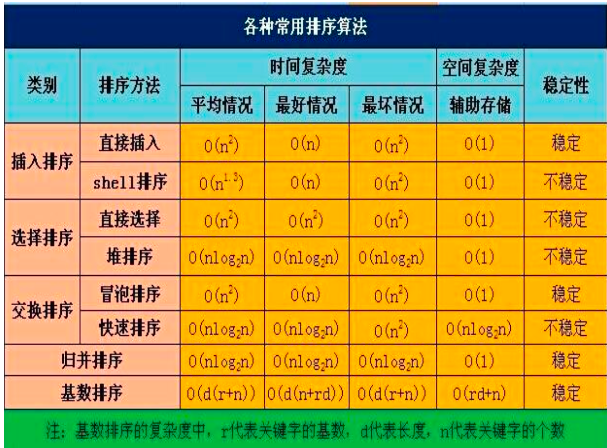

# 数据结构

## 数据结构的概念
### 基本概念
- 数据：能输入到计算机中并且被计算机程序处理的符号的总称
- 数据元素：数据的基本单位。有时，一个数据元素可由若干数据项组成
- 数据结构的存储方式：
    - 顺序存储：把逻辑上相邻的结点存储在物理位置上相邻的存储单元中
    - 链式存储：把逻辑上相邻的结点存储在物理位置上不相邻的存储单元中，结点间的逻辑关系是由附加的指针字段表示的
    - 索引存储：存储结点信息的同时，还建立附加的索引表，索引表中的每一项称为索引项，索引项的一般形式是（关键字，地址）
    - 散列存储：根据结点的关键字直接计算出该结点的存储地址
- 算法：
    - 算法特征：有穷性、确切性、输入、输出、可行性
    - 算法评定：健壮性、可读性、正确性、空间复杂度
    - 时间复杂度：算法运行时间随问题规模增长的变化趋势
    - 空间复杂度：算法运行时所占用的存储空间随问题规模增长的变化趋势

## 线性表
- 线性表的表示方法：顺序表示、链式表示。
- 线性表的存储结构和实现：线性链表、循环链表、双向链表。
- 链表的四种形式：单链表、双链表、循环单链表、循环双链表。
- 线性表的相关操作
    - 线性链表判空（L 为头指针）：
```pseudocode
带头结点：L→next==null;
不带头结点：L==null
循环链表判空：L→next==L
双向链表判空：L→next==L
```
### 顺序表和链表的比较

| 对比维度     | 顺序表                        | 链表                   |
| -------- | -------------------------- | -------------------- |
| 存储结构  | **顺序存储**（数组）               | **链式存储**（指针连接结点）     |
| 存取方式  | 支持**顺序 + 随机访问**            | 只能**从表头顺序访问**（逐个遍历）  |
| 按序号查找 | `O(1)`（直接通过下标访问）           | `O(n)`（逐个结点向后找）      |
| 按值查找  | 无序：`O(n)`；有序可二分：`O(log n)` | `O(n)`               |
| 插入操作   | 平均需移动半个表长元素，`O(n)`         | 修改指针即可，`O(1)`（找到位置后） |
| 删除操作   | 同插入，平均 `O(n)`              | 修改指针即可，`O(1)`（找到位置后） |
| 存储密度  | 高（只存值）                     | 低（每个结点需额外指针域）        |
| 空间分配  | 需**预分配固定大小**（可能浪费）         | **动态分配**，灵活但碎片化      |
| 扩容方式  | 需手动申请更大数组并复制元素             | 不需要，动态申请新结点          |
| 应用场景     | 查询频繁、数据量稳定                 | 插入/删除频繁、不定长数据        |

- 顺序表中插入元素，平均要移动的元素个数为：n/2
- 在一个长度为n的顺序表中，在第i个元素（1≤i≤n+1）之前插入一个新元素时须向后移动**n-i+1**个元素

## 栈和队列
- 栈和队列的定义
    - 栈：栈是限定仅在表尾进行插入或删除操作的线性表。先进后出，后进先出
    - 队列：队列是只允许在一端进行插入操作、而在另一端进行删除操作的线性表。先进先出，后进后出

### 栈
- 应用：
    - 数制转换：将一个数从一种进制转换为另一种进制
    - 括号匹配检验：检查表达式中的括号是否匹配
    - 行编辑程序：编辑程序中的行编辑功能
    - 表达式求值：将中缀表达式转换为后缀表达式，然后求值
- 操作：
    - 判空：S.top == -1
    - 判满：S.top == MaxSize - 1
    - 进栈要先移动指针，再进元素
    - 出栈要先取元素，再移动指针

### 队列
- 应用：
    - 层次遍历
        - 比如二叉树的层次遍历
    - 计算机系统
        - 解决主机与外部设备之间速度不匹配
        - 解决由多用户引起的资源竞争
- 操作：
    - 判空：Q.front == Q.rear
    - 判满：（rear+1）mod MAXSIZE==front
    - 求元素个数：（rear-front+MAXSIZE）mod MAXSIZE
    - 插入：（rear+n）mod MAXSIZE
    - 删除：（front+n）mod MAXSIZE

### 循环队列
1. **队空的条件：Q.front == Q.rear**  
   解释：当队头指针与队尾指针指向同一位置时，队列中没有元素（初始状态或所有元素出队后均满足）。

2. **队满的条件：(Q.rear + 1) % MAXQSIZE == Q.front**  
   解释：预留一个空位置作为标记，当队尾指针后移一位（循环后）与队头指针重合时，队列已满（避免与队空条件冲突）。

3. **入队：Q.rear = (Q.rear + 1) % MAXQSIZE**  
   解释：元素入队后，队尾指针后移一位，若超出数组长度则通过取模回到起点，形成环形。

4. **出队：Q.front = (Q.front + 1) % MAXQSIZE**  
   解释：元素出队后，队头指针后移一位，同样通过取模实现环形移动，指向新的队头元素。

5. **当前元素个数：(Q.rear - Q.front + MAXQSIZE) % MAXQSIZE**  
   解释：通过队尾与队头指针的差值计算元素数，加MAXQSIZE再取模是为了避免 rear < front 时出现负数（确保结果为正数）。

### 举例：

#### 1. 栈的操作举例（MaxSize = 5）

**初始状态：**
```
S.top = -1
S.data = [ ][ ][ ][ ][ ]
判空：S.top == -1 ✓（栈为空）
判满：S.top == MaxSize - 1 = 4（当前不满足，所以栈未满）
```

**操作1：进栈操作（先移动指针，再进元素）**
```
1. 进栈 'A'：
   - 先移动指针：S.top = S.top + 1 = 0
   - 再进元素：S.data[0] = 'A'
   状态：S.top = 0, S.data = [A][ ][ ][ ][ ]
   判空：S.top == -1 ✗（不满足，所以栈不为空）
   判满：S.top == 4 ✗（不满足，所以栈未满）

2. 进栈 'B'：
   - 先移动指针：S.top = 1
   - 再进元素：S.data[1] = 'B'
   状态：S.top = 1, S.data = [A][B][ ][ ][ ]

3. 进栈 'C'：
   - 先移动指针：S.top = 2
   - 再进元素：S.data[2] = 'C'
   状态：S.top = 2, S.data = [A][B][C][ ][ ]

4. 进栈 'D'：
   - 先移动指针：S.top = 3
   - 再进元素：S.data[3] = 'D'
   状态：S.top = 3, S.data = [A][B][C][D][ ]

5. 进栈 'E'：
   - 先移动指针：S.top = 4
   - 再进元素：S.data[4] = 'E'
   状态：S.top = 4, S.data = [A][B][C][D][E]
   判满：S.top == 4 ✓（栈已满，不能再进栈）
```

**操作2：出栈操作（先取元素，再移动指针）**
```
1. 出栈：
   - 先取元素：x = S.data[S.top] = S.data[4] = 'E'
   - 再移动指针：S.top = S.top - 1 = 3
   状态：S.top = 3, S.data = [A][B][C][D][E]（E已取出）
   返回值：'E'

2. 出栈：
   - 先取元素：x = S.data[3] = 'D'
   - 再移动指针：S.top = 2
   状态：S.top = 2, S.data = [A][B][C][D][E]
   返回值：'D'

3. 出栈：
   - 先取元素：x = S.data[2] = 'C'
   - 再移动指针：S.top = 1
   状态：S.top = 1, S.data = [A][B][C][D][E]
   返回值：'C'

4. 出栈：
   - 先取元素：x = S.data[1] = 'B'
   - 再移动指针：S.top = 0
   状态：S.top = 0, S.data = [A][B][C][D][E]
   返回值：'B'

5. 出栈：
   - 先取元素：x = S.data[0] = 'A'
   - 再移动指针：S.top = -1
   状态：S.top = -1, S.data = [A][B][C][D][E]
   判空：S.top == -1 ✓（栈为空，不能再出栈）
   返回值：'A'
```

#### 2. 队列的操作举例（MAXSIZE = 5）

**初始状态：**
```
Q.front = 0
Q.rear = 0
Q.data = [ ][ ][ ][ ][ ]
判空：Q.front == Q.rear ✓（队列为空）
判满：(rear+1) mod MAXSIZE == front → (0+1) mod 5 = 1 ≠ 0 ✗（队列未满）
元素个数：(rear-front+MAXSIZE) mod MAXSIZE = (0-0+5) mod 5 = 0
```

**操作1：插入操作（入队）**
```
1. 插入 'A'：
   - rear = (rear + 1) mod MAXSIZE = (0 + 1) mod 5 = 1
   - Q.data[rear] = Q.data[1] = 'A'（实际存储位置）
   状态：front = 0, rear = 1, Q.data = [ ][A][ ][ ][ ]
   判空：front == rear → 0 == 1 ✗（队列不为空）
   判满：(rear+1) mod MAXSIZE == front → (1+1) mod 5 = 2 ≠ 0 ✗
   元素个数：(1-0+5) mod 5 = 1

2. 插入 'B'：
   - rear = (1 + 1) mod 5 = 2
   - Q.data[2] = 'B'
   状态：front = 0, rear = 2, Q.data = [ ][A][B][ ][ ]
   元素个数：(2-0+5) mod 5 = 2

3. 插入 'C'：
   - rear = (2 + 1) mod 5 = 3
   - Q.data[3] = 'C'
   状态：front = 0, rear = 3, Q.data = [ ][A][B][C][ ]
   元素个数：(3-0+5) mod 5 = 3

4. 插入 'D'：
   - rear = (3 + 1) mod 5 = 4
   - Q.data[4] = 'D'
   状态：front = 0, rear = 4, Q.data = [ ][A][B][C][D]
   判满：(rear+1) mod MAXSIZE == front → (4+1) mod 5 = 0 == 0 ✓（队列已满）
   元素个数：(4-0+5) mod 5 = 4
```

**操作2：删除操作（出队）**
```
1. 删除：
   - 先取元素：x = Q.data[front] = Q.data[0] = 'A'
   - front = (front + 1) mod MAXSIZE = (0 + 1) mod 5 = 1
   状态：front = 1, rear = 4, Q.data = [ ][A][B][C][D]
   返回值：'A'
   判空：front == rear → 1 == 4 ✗（队列不为空）
   元素个数：(4-1+5) mod 5 = 3

2. 删除：
   - x = Q.data[1] = 'B'
   - front = (1 + 1) mod 5 = 2
   状态：front = 2, rear = 4, Q.data = [ ][A][B][C][D]
   返回值：'B'
   元素个数：(4-2+5) mod 5 = 2

3. 删除：
   - x = Q.data[2] = 'C'
   - front = (2 + 1) mod 5 = 3
   状态：front = 3, rear = 4, Q.data = [ ][A][B][C][D]
   返回值：'C'
   元素个数：(4-3+5) mod 5 = 1

4. 删除：
   - x = Q.data[3] = 'D'
   - front = (3 + 1) mod 5 = 4
   状态：front = 4, rear = 4, Q.data = [ ][A][B][C][D]
   返回值：'D'
   判空：front == rear → 4 == 4 ✓（队列为空，不能再删除）
   元素个数：(4-4+5) mod 5 = 0
```

#### 3. 循环队列的操作举例（MAXQSIZE = 5）

**初始状态：**
```
Q.front = 0
Q.rear = 0
Q.data = [ ][ ][ ][ ][ ]
队空：Q.front == Q.rear → 0 == 0 ✓（队列为空）
队满：(Q.rear + 1) % MAXQSIZE == Q.front → (0+1) % 5 = 1 ≠ 0 ✗
元素个数：(Q.rear - Q.front + MAXQSIZE) % MAXQSIZE = (0-0+5) % 5 = 0
```

**操作序列：A入队 → B入队 → C入队 → A出队 → D入队 → E入队 → B出队 → F入队**

**步骤1：A入队**
```
入队操作：Q.rear = (Q.rear + 1) % MAXQSIZE = (0 + 1) % 5 = 1
存储元素：Q.data[0] = 'A'（注意：rear指向下一个空位置，元素存在rear-1位置）
状态：front = 0, rear = 1
队列：[A][ ][ ][ ][ ]
      ↑front ↑rear
队空：0 == 1 ✗
队满：(1+1) % 5 = 2 ≠ 0 ✗
元素个数：(1-0+5) % 5 = 1
```

**步骤2：B入队**
```
入队操作：Q.rear = (1 + 1) % 5 = 2
存储元素：Q.data[1] = 'B'
状态：front = 0, rear = 2
队列：[A][B][ ][ ][ ]
      ↑front    ↑rear
元素个数：(2-0+5) % 5 = 2
```

**步骤3：C入队**
```
入队操作：Q.rear = (2 + 1) % 5 = 3
存储元素：Q.data[2] = 'C'
状态：front = 0, rear = 3
队列：[A][B][C][ ][ ]
      ↑front       ↑rear
元素个数：(3-0+5) % 5 = 3
```

**步骤4：A出队**
```
出队操作：Q.front = (Q.front + 1) % MAXQSIZE = (0 + 1) % 5 = 1
取出元素：Q.data[0] = 'A'
状态：front = 1, rear = 3
队列：[ ][B][C][ ][ ]
          ↑front ↑rear
队空：1 == 3 ✗
元素个数：(3-1+5) % 5 = 2
```

**步骤5：D入队**
```
入队操作：Q.rear = (3 + 1) % 5 = 4
存储元素：Q.data[3] = 'D'
状态：front = 1, rear = 4
队列：[ ][B][C][D][ ]
          ↑front    ↑rear
元素个数：(4-1+5) % 5 = 3
```

**步骤6：E入队（循环到起点）**
```
入队操作：Q.rear = (4 + 1) % 5 = 0（循环回到起点）
存储元素：Q.data[4] = 'E'
状态：front = 1, rear = 0（rear < front，已循环）
队列：[E][B][C][D][ ]
      ↑rear ↑front
队满：(0+1) % 5 = 1 == 1 ✓（队列已满，不能再入队）
元素个数：(0-1+5) % 5 = 4
```

**步骤7：B出队**
```
出队操作：Q.front = (1 + 1) % 5 = 2
取出元素：Q.data[1] = 'B'
状态：front = 2, rear = 0
队列：[E][ ][C][D][ ]
      ↑rear   ↑front
队空：2 == 0 ✗
队满：(0+1) % 5 = 1 ≠ 2 ✗（队列未满，可以入队）
元素个数：(0-2+5) % 5 = 3
```

**步骤8：F入队**
```
入队操作：Q.rear = (0 + 1) % 5 = 1
存储元素：Q.data[0] = 'F'
状态：front = 2, rear = 1
队列：[E][F][C][D][ ]
      ↑rear ↑front
队满：(1+1) % 5 = 2 == 2 ✓（队列再次满）
元素个数：(1-2+5) % 5 = 4
```

**边界情况说明：**

**情况1：rear < front（循环后）**
```
MAXQSIZE = 5, front = 3, rear = 1
队列：[X][X][ ][X][X]
          ↑rear ↑front
队空：3 == 1 ✗
队满：(1+1) % 5 = 2 ≠ 3 ✗
元素个数：(1-3+5) % 5 = 3
说明：rear绕了一圈后小于front，通过加MAXQSIZE再取模得到正确元素个数
```

**情况2：rear > front（正常情况）**
```
MAXQSIZE = 5, front = 1, rear = 4
队列：[ ][X][X][X][ ]
        ↑front    ↑rear
队空：1 == 4 ✗
队满：(4+1) % 5 = 0 ≠ 1 ✗
元素个数：(4-1+5) % 5 = 3
说明：正常情况，rear在front之后
```


## 数组与特殊矩阵
- 数组：有序的元素序列
- 一维：LOC(ai)=LOC(a0)+i*L (0≤i<n)
  - 这个公式描述的是**线性地址分配**中，第 `i` 个元素的存储地址计算方式，常见于数组等连续存储的数据结构中。

  - **`LOC(ai)`**：表示第 `i` 个元素（如数组的第 `i` 个元素）在内存中的存储地址。  
  - **`LOC(a0)`**：表示第一个元素（索引为 0 的元素）的起始地址（基地址）。  
  - **`i`**：元素的索引（从 0 开始，`0≤i<n` 表示索引范围在 0 到 `n-1` 之间，共 `n` 个元素）。  
  - **`L`**：单个元素占用的内存空间大小（单位：字节，由元素类型决定，如 int 型通常为 4 字节）。  

  **整体含义**：第 `i` 个元素的地址 = 首个元素的地址 + 索引 `i` × 单个元素的大小。这体现了连续存储的特性——通过基地址和偏移量（`i×L`）可直接计算任意元素的地址，实现随机访问（时间复杂度 O(1)）。

- 二维数组在内存中其实是一维的。有两种存储方式：

    - 行为主序：按行依次存储，先存完第 0 行，再存第 1 行，依此类推
      - LOC(a[i][j]) = LOC(a[0][0]) + (i * 列数 + j) * L
      - 举例：假设有一个 3行4列 的int数组（int arr[3][4]），基地址LOC(a[0][0])=2000，int占 4 字节（L=4）。
        - 元素a[0][0]的地址：2000 + (0 * 3 + 0) * 4 = 2000
        - 元素a[0][1]的地址：2000 + (0 * 3 + 1) * 4 = 2004
        - 元素a[1][0]的地址：2000 + (1 * 3 + 0) * 4 = 2016（第 1 行前有 4 个元素，每个占 4 字节，共 16 字节）
        - 元素a[2][3]的地址：2000 + (2 * 3 + 3) * 4 = 2000 + 11 * 4 = 2044
    - 列为主序：按列依次存储，先存完第 0 列，再存第 1 列，依此类推
      - LOC(a[i][j]) = LOC(a[0][0]) + (j * 行数 + i) * L
      - 举例：假设有一个 3行4列 的int数组（int arr[3][4]），基地址LOC(a[0][0])=2000，int占 4 字节（L=4）。
        - 元素a[0][0]的地址：2000 + (0 * 3 + 0) * 4 = 2000
        - 元素a[1][0]的地址：2000 + (0 * 3 + 1) * 4 = 2004（第 0 列前有 1 个元素，每个占 4 字节）
        - 元素a[0][1]的地址：2000 + (1 * 3 + 0) * 4 = 2012（第 1 列前有 3 个元素，共 12 字节）
        - 元素a[2][3]的地址：2000 + (3 * 3 + 2) * 4 = 2000 + 11 * 4 = 2044

:::info
- **LOC(a[i][j])**：第i行第j列元素的地址
- **LOC(a[0][0])**：数组基地址（第一个元素a[0][0]的地址）
- **i**：行下标
- **j**：列下标
- **L**：每个元素的内存单元数
:::

- 多维数组是特殊的线性表，是线性表的推广

### 广义表
- 广义表的长度（广度）指：广义表中所包含的数据元素的个数，比如(a,b,c,d)的长度为4
- 广义表的深度指：广义表中所包含括号的重数，比如(a,b,c,d)的深度为1，比如(a,(b,c),d)的深度为2

1. 串是内容受限的线性表，它限定了表中的元素为字符。
2. 多维数组可以看成是线性表的推广，其特点是结构中的元素本身可以是具有某种结构的数据，但属于同一数据类型。
3. 广义表是另一种线性表的推广形式，表中的元素可以是称为原子的单个元素，也可以是一个子表，所以线性表可以看成广义表的特例。

### 特殊矩阵：
- 特殊矩阵：值相同的元素或者零元素在矩阵中的分布有一定规律。
#### 对称矩阵
满足：`A[i][j] == A[j][i]`
**例子**（主对角线两边对称）：
```
A = 
[ 1  2  3 ]
[ 2  4  5 ]
[ 3  5  6 ]
```

* `A[0][1] = 2` 与 `A[1][0] = 2` 相等，其他同理。
* 主对角线为对称轴。

#### 上三角矩阵（上半区有值，下半为0）：
```
U = 
[ 1  2  3 ]
[ 0  4  5 ]
[ 0  0  6 ]
```

#### 下三角矩阵（下半区有值，上半为0）：
```
L = 
[ 1  0  0 ]
[ 2  4  0 ]
[ 3  5  6 ]
```

* 主对角线下/上方全部为 0 或固定值，常见于高斯消元等场景。
#### 对角矩阵（Diagonal Matrix）
**例子**（除主对角线外全为 0）：
```
D = 
[ 1  0  0 ]
[ 0  2  0 ]
[ 0  0  3 ]
```

* 只有 `A[0][0]`, `A[1][1]`, `A[2][2]` 非 0，其他为 0。
* 带状矩阵是对角矩阵的推广，例如：

**带状对角矩阵**（主对角线和其上下各一条对角线也有值）：

```
B = 
[ 1  2  0 ]
[ 3  4  5 ]
[ 0  6  7 ]
```


### 稀疏矩阵：
- 稀疏矩阵：其非零元素较零元素少，且分布没有一定规律
- 存储方法：

#### 三元组表
用一个三元组 `(row, col, value)` 来表示一个非零元素的位置和数值，节省空间。

稀疏矩阵 ➜ 用三元组 ➜ 每个非零值 ➜ 一个记录 `(i, j, v)`

原始稀疏矩阵：

```
M =
[ 0  0  3 ]
[ 4  0  0 ]
[ 0  5  0 ]
```

三元组表示为：

```
(row, col, value)
(0, 2, 3)
(1, 0, 4)
(2, 1, 5)
```

**好处**：只记录非零元素，空间效率高。

#### 十字链表法
为每行每列建立指针，将非零元素用结点连接，**适合频繁插入删除**。

* 每个非零节点包含：**值、行下标、列下标、右指针、下指针**
* 每行有一个**行头结点**，每列有一个**列头结点**

稀疏矩阵 ➜ 链表 ➜ 横指针右移（行）、竖指针下移（列）

稀疏矩阵：

```
M =
[ 0  0  3 ]
[ 4  0  0 ]
[ 0  5  0 ]
```

十字链表中节点内容为（每个节点）：

* `(0,2,3)` → 行0的右指针指向它，列2的下指针指向它
* `(1,0,4)` → 行1的右指针，列0的下指针
* `(2,1,5)` → 行2的右指针，列1的下指针

**好处**：

* 插入删除快
* 遍历某行或某列效率高
* 空间效率适中，比三元组表更适合动态变化的数据结构

### 广义表
| 项目     | 含义描述                  | 例子                            |
| ------ | --------------------- | ----------------------------- |
| **长度** | 广义表**最外层元素**的个数       | `(a, b, (c, d), e)` 长度为 **4** |
| **深度** | 广义表中**括号嵌套的最大层数**     | `(a, (b, (c, d)))` 深度为 **3**  |
| **表头** | 第一个元素（不管是原子还是子表）      | `(a, b, c)` 的表头为 `a`          |
| **表尾** | 除去第一个元素后的剩余部分（仍然是广义表） | `(a, b, c)` 的表尾为 `(b, c)`     |

## 树和二叉树
### 概念
| 速记点编号  | 名称         | 定义说明                   | 示例（以下图树为例）                       |
| ------ | ---------- | ---------------------- | -------------------------------- |
| 1️⃣    | 子节点 / 孩子节点 | 某节点直接连接的下一层节点          | `A` 的子节点有 `B`、`C`、`D`            |
| 2️⃣    | 节点的度       | 某节点的子节点数               | `A` 的度是 3；`B` 的度是 2              |
| 3️⃣    | 叶节点 / 终端节点 | 度为 0 的节点（没有子节点）        | `E`、`F`、`G`、`H` 是叶节点             |
| 4️⃣    | 非终端节点      | 度不为 0 的节点              | `A`、`B`、`C` 是非终端节点               |
| 5️⃣    | 父节点 / 双亲节点 | 某节点的直接上层节点             | `B` 的父节点是 `A`，`E` 的父节点是 `B`      |
| 6️⃣    | 兄弟节点       | 具有相同父节点的节点             | `B`、`C`、`D` 是兄弟节点；`E` 和 `F` 是兄弟  |
| 7️⃣    | 树的度        | 树中所有节点度的最大值            | 树的度是 3（`A` 有 3 个子节点）             |
| 8️⃣    | 节点的层次      | 根为第 1 层，子节点为第 2 层，以此类推 | `A` 在第 1 层，`B` 在第 2 层，`E` 在第 3 层 |
| 9️⃣    | 树的高度 / 深度  | 节点的最大层次                | 最深为第 3 层，所以高度是 3                 |
| 🔟     | 堂兄弟节点      | 父节点不同，但父节点在同一层的节点      | `E`（父为 `B`）和 `G`（父为 `C`）是堂兄弟     |
| 1️⃣1️⃣ | 祖先节点       | 从根到某节点路径中经过的所有节点       | `E` 的祖先有 `A` 和 `B`               |
| 1️⃣2️⃣ | 子孙节点       | 某节点为根的子树中所有节点          | `B` 的子孙包括 `E` 和 `F`              |
```
        A
      / | \
     B  C  D
    / \  \
   E   F  G
          \
           H
```

### 树的表示方法
| 表示方法         | 描述说明                           |
| ------------ | ------------------------------ |
| 树形表示法       | 以树的结构展示节点之间的层次关系，直观易懂 |
| 嵌套集合表示法     | 使用集合嵌套的方式表示树的层次结构       |
| 凹入表示法       | 通过缩进表示节点的层次关系，层次越深缩进越多 |
| 广义表表示法      | 使用广义表的形式表示树的结构，类似于列表嵌套 |

#### 树形表示法
```
        A
      / | \
     B  C  D
    / \  \
   E   F  G
          \
           H
```

#### 嵌套集合表示法
```
{A, {B, {E}, {F}}, {C, {G, {H}}}, {D}}
```

#### 凹入表示法
``` 
A
    B
        E
        F
    C
        G
            H
    D
```

#### 广义表表示法
```
(A, (B, (E, F)), (C, (G, H)), D)
```

### 树的存储结构
| 存储方式         | 结构特点                                     |
| ------------ | ---------------------------------------- | 
| **双亲顺序存储结构** | 每个节点包含数据和其父节点在数组中的下标。适用于查找双亲操作多的场景。      | 
| **孩子链式存储结构** | 每个节点有一个指针域，指向其“所有子节点的链表头”。适合查找子节点频繁的场景。  | 
| **孩子兄弟存储结构** | 每个节点有两个指针：一个指向第一个孩子，一个指向下一个兄弟。适合任意树转二叉树。 | 

#### 双亲顺序存储结构
```
        A
      / | \
     B  C  D
    / \  \
   E   F  G
          \
           H
```

#### 孩子链式存储结构
```
        A
      / | \
     B  C  D
    / \  \
   E   F  G
          \
           H   
```

#### 孩子兄弟存储结构
```
        A
      / | \
     B  C  D
    / \  \
   E   F  G
          \
           H
```

### 二叉树
- 满二叉树：深度为 k，有 2^k-1 个结点
- 完全二叉树：深度为 k，有 n 个结点，且结点 1 到 k-1 是满二叉树，第 k 层从左到右依次填充
    - 满二叉树一定是完全二叉树，但完全二叉树不一定是满二叉树
```
这个是满二叉树，也是完全二叉树
        1
      /   \
     2     3
    / \   / \
   4  5  6  7

```

| 性质内容                                           | 示例（以 n = 7 的完全二叉树为例）                               |
| ---------------------------------------------- | -------------------------------------------------- |
| 深度为 k 的二叉树最多有 2^k - 1 个节点                    | 深度为 3 时最多节点数：2³ - 1 = 7                         |
| 叶子结点数 n_0 = n_2 + 1，其中 n_2 是度为 2 的结点数      | 若有 3 个度为 2 的节点，则叶子结点数为 3 + 1 = 4                 |
| n 个节点的完全二叉树深度是 ⌊log₂n⌋ + 1  | n=7，⌊log₂7⌋ + 1 = 2 + 1 = 3 层 |
| 第 i 个结点的双亲编号为 ⌊i/2⌋（i=1 时无父节点） | 编号 3 的节点：⌊3/2⌋ = 1，其父是 1 号节点       |
| 左孩子为编号 2i，若 2i > n，则无左孩子                   | 编号 3 的节点：左孩子编号 2×3=6，存在                          |
| 右孩子为编号 2i+1，若 2i+1 > n，则无右孩子               | 编号 3 的节点：右孩子编号 2×3+1=7，存在                        |
| 对任何一棵二叉树，度为0的结点（叶子结点）总是比度为2的结点多一个 | 叶子结点数为 4，度为2的结点数为 3，叶子结点数比度为2的结点数多1 |

- 节点的编号与其父节点编号之间存在固定的数学关系。对于任意一个编号为n的节点,其父节点的编号为 n/2 (向下取整)
- 二叉树的先序遍历序列和后序遍历序列正好相反，这棵树必须是一条单向的斜线，且树的高度恰好等于结点数。

### 二叉树的存储结构

| 存储方式   | 描述                                            | 优点        | 缺点           | 适用场景       |
| ------ | --------------------------------------------- | --------- | ------------ | ---------- |
| 顺序存储结构 | 用数组表示完全二叉树，节点编号从 1 开始，节点 i 的左孩子是 2i，右孩子是 2i+1 | 快速定位父子节点  | 空间浪费（非完全二叉树） | 完全二叉树或接近完全 |
| 链式存储结构 | 每个节点用一个结构体（或对象）表示，含数据域、左孩子指针、右孩子指针            | 空间利用率高，灵活 | 不能随机访问       | 一般二叉树      |


### 二叉树的遍历
- 中序遍历专属于二叉树，因为它需要左右子树的明确划分，其他树形结构没有这种区分，所以不存在中序遍历。
``` 
        1
      /   \
     2     3
    / \   / \
   4  5  6  7
```

| 遍历方式 | 顺序规则      | 遍历结果              | 口诀  |
| ---- | --------- | ----------------- | --- |
| 前序遍历 | 根 → 左 → 右 | **1 2 4 5 3 6 7** | 根在前 |
| 中序遍历 | 左 → 根 → 右 | **4 2 5 1 6 3 7** | 根在中 |
| 后序遍历 | 左 → 右 → 根 | **4 5 2 6 7 3 1** | 根在后 |
| 层次遍历 | 按层从左到右    | **1 2 3 4 5 6 7** | BFS |


### 树和森林遍历
- 森林：多棵树组成，可先转为二叉树再进行遍历

| 遍历类型 | 访问顺序      | 说明                 | 口诀        |
| ---- | --------- | ------------------ | --------- |
| 先根遍历 | 根 → 左 → 右 | 先访问根节点，再访问子树（前序遍历） | 根左右       |
| 后根遍历 | 左 → 右 → 根 | 先访问所有子树，最后访问根节点    | 左右根       |
| 层次遍历 | 从上到下，从左到右 | 按层次顺序访问节点，广度优先遍历   | 层次遍历（BFS） |

```
树1:           A
              / \
             B   C
            /
           D

树2:         X
            / | \
           Y  Z  W
```
- 先根遍历（访问顺序：先遍历树1，再遍历树2）：
```
A B D C X Y Z W
```
- 后根遍历（访问顺序：先遍历树1，再遍历树2）：
```
D B C A Y Z W X
```
- 层次遍历（访问顺序：先遍历树1，再遍历树2）：
```
A B C D X Y Z W
```

### 森林转换成二叉树
- 将森林中的每棵小树以“左孩子-右兄弟”方式转换成二叉树结构。
  - 例如，假设有一棵树，根节点A有三个子节点B、C、D。转换后，B是A的左孩子，C是B的右兄弟，D是C的右兄弟。

  ```
    A
   /|\
  B C D

  转换为:

    A
   /
  B
   \
    C
     \
      D
  ```

- 将第二棵二叉树作为第一棵二叉树的右孩子。
  - 举例来说，如果有两棵树，第一棵树的根节点是A，第二棵树的根节点是X，那么转换后，X将作为A的右孩子。

  ```
  第一棵树:    A
             /
            B

  第二棵树:    X
             /
            Y

  转换为:

    A
   / \
  B   X
     /
    Y
  ```

- 第三棵二叉树作为第一棵二叉树右孩子的右孩子，以此类推。
  - 例如，假设有三棵树，第一棵树的根节点是A，第二棵树的根节点是X，第三棵树的根节点是Y。转换后，X是A的右孩子，Y是X的右孩子。

  ```
  第一棵树:    A
             /
            B

  第二棵树:    X
             /
            Y

  第三棵树:    Z
             /
            W

  转换为:

    A
   / \
  B   X
     / \
    Y   Z
       /
      W
  ```

### 赫夫曼树
- Huffman算法：每次选择权值最小的两个节点合并，形成一个新的节点，权值为两个节点权值之和
- 最优二叉树(也称哈夫曼树)中,如果有n个叶子结点,那么一定有n-1个分支结点。这是由最优二叉树的构造特点决定的。

| 速记点         | 定义                             | 举例                                              |
| ----------- | ------------------------------ | ----------------------------------------------- |
| 树的路径长度      | 所有结点从根到该结点路径长度的总和。完全二叉树路径长度最短。 | 如完全二叉树（3层满二叉树），路径长度最短。                          |
| 带权路径长度（WPL） | 所有叶子结点路径长度乘以对应权值的加和。           | 有叶子结点权值分别为2、3、5，路径长度分别为1、2、2，WPL=2×1+3×2+5×2=20 |
| 赫夫曼编码       | 从根开始，左分支编码0，右分支编码1，叶子结点路径编码。   | 权值5的叶子结点路径为“左-右-左”，编码为“0 1 0”。                  |

假设一棵树结构如下：

```
        (root)
        /     \
      A(2)    B(3)
              /   \
           C(5)  D(1)
```

* **路径长度**：

  * root到A的路径长度 = 1
  * root到B的路径长度 = 1
  * root到C的路径长度 = 2
  * root到D的路径长度 = 2
  * 树的路径长度 = 1 + 1 + 2 + 2 = 6

* **带权路径长度（WPL）**（只考虑叶子节点，假设A、C、D是叶子）：

  * A(权2)路径长度1，贡献 = 2×1=2
  * C(权5)路径长度2，贡献 = 5×2=10
  * D(权1)路径长度2，贡献 = 1×2=2
  * WPL = 2 + 10 + 2 = 14

* **赫夫曼编码**（假设左0右1）：

  * A的路径是左分支 = `0`
  * B是右分支 = `1`
  * C是B的左分支 = `1 0`
  * D是B的右分支 = `1 1`


### 最优二叉树
- 指的是带权路径长度（WPL）最小的二叉树
- 最常见的最优二叉树就是 —— 赫夫曼树（Huffman Tree）

### B树

| 内容                              | 备注示例           |
| ------------------------------- | -------------- |
| 所有**叶子结点都在同一层**                 | 没有“高度不一致”问题    |
| M 阶表示**最多有 M 个子树指针**（即 M 个分支）   | M 阶 = 最多 M 个孩子 |
| 关键字数量满足 `⌈m/2⌉ - 1 ≤ n ≤ m - 1` | 每个结点至少要有一半满    |
| 关键字**递增排列**                     | 支持范围查找         |

### B树和B+树对比

| 对比项           | B 树                        | B+ 树                       |
| ------------- | -------------------------- | -------------------------- |
| 用途   | 多用于**文件系统索引**              | 多用于**数据库索引**               |
| 子树数  | 有 **n 个关键字** → **n+1 棵子树** | 有 **n 个关键字** → **n 棵子树**   |
| 数据存储 | **数据存储在所有结点上（内结点 + 叶结点）**  | **数据只存在叶子节点，内节点只作索引**      |
| 查询效率          | 查询速度中等，可能在内结点找到            | 所有查找都到叶子，**查找路径一致，适合范围查询** |
| 叶子节点链接        | 不一定有链接                     | **所有叶子结点通过指针串联，便于区间遍历**    |


## 图
- 线性表可以是空表，树可以是空树，但图不可以是空图
### 概念
- 无向图∶每条边都是没有方向的
- 有向图∶每条边都是有方向的
- 连通图：图中任意两个顶点都是连通的（有路径的）
- 顶点度数：
    - 无向图：顶点v的度数是与v相关联的边的数目
    - 有向图：顶点v的度数是顶点v的入度（该顶点为终点的边的数目）与出度（以该顶点为起点的边的数目）之和
- 连通分量：无向图中的极大连通子图
    - 连通子图：内部任意两个顶点都连通。
    - 极大（最大）：不能再往里加点使它仍然连通了，一旦加点就“不全连通”了。
- 强连通图：有向图中任意两个顶点都是连通的
```
   A → B
   ↑   ↓
   D ← C
```
- 强连通分量：有向图中的极大强连通子图

### 图的存储结构
- 邻接矩阵：所谓邻接矩阵存储，是指用一个一维数组存储图中顶点的信息，用一个二维数组存储图中边的信息（即各顶点之间的邻接关系），存储顶点之间邻接关系的二维数组称为邻接矩阵。
- 邻接表：在邻接表中存在两种结点：顶点表结点和边表结点
- 十字链表：十字链表是有向图的一种链式存储结构。在十字链表中，对应于有向图中的每条弧有一个结点，对应于每个顶点也有一个结点。
- 邻接多表：邻接多重表是无向图的另一种链式存储结构。

#### 邻接矩阵

| 图类型 | 行/列意义            | 特点        | 边数与1的关系           | 空间优化        |
| --- | ---------------- | --------- | ----------------- | ----------- |
| 有向图 | 行：出度，列：入度        | 入度和 = 出度和 | 所有 1 的个数 = 边数     | 无法压缩        |
| 无向图 | 行或列的 1 的个数 = 顶点度 | 矩阵对称      | 所有 1 的个数 = 边数 × 2 | 可压缩为上/下三角区域 |

* **定义**：邻接矩阵由两个部分组成：

  * 顶点数组（存储所有顶点）
  * 邻接矩阵（二维数组表示顶点之间的边）

#### 1️⃣ 有向图示例

图结构：

```
A → B
B → C
```

邻接矩阵（有向）：

```
     A B C
   -------
A | 0 1 0
B | 0 0 1
C | 0 0 0
```

出度：

* A 的出度 = 第 1 行中 1 的个数 = 1
* B 的出度 = 第 2 行中 1 的个数 = 1
* C 的出度 = 第 3 行中 1 的个数 = 0

入度：

* A 的入度 = 第 1 列中 1 的个数 = 0
* B 的入度 = 第 2 列中 1 的个数 = 1
* C 的入度 = 第 3 列中 1 的个数 = 1

总出度 = 总入度 = 2 ✅

#### 2️⃣ 无向图示例
图结构：

```
A — B
B — C
```

邻接矩阵（无向）：

```
     A B C
   -------
A | 0 1 0
B | 1 0 1
C | 0 1 0
```

* 对称矩阵 ✅
* A 度 = 第 1 行中 1 的个数 = 1
* B 度 = 第 2 行中 1 的个数 = 2
* C 度 = 第 3 行中 1 的个数 = 1

矩阵中总共有 4 个 1，对应 2 条边（因为每条边占两个 1）✅

* **对称矩阵** ➜ 只需存上三角或下三角部分（不含对角线）
* **空间需求** = n(n - 1)/2

比如：

* 对于 5 个顶点，需空间 = 5×4/2 = 10 个元素


#### 邻接表

| 描述                               | 备注举例                        |
| ---------------------------------- | --------------------------- |
| 定义：对图中每个顶点都建立一个单链表，存储该顶点的邻接点信息。    | 每个顶点对应一个链表，链表节点为邻接点         |
| 无向图中，某顶点的邻接表节点数 = 该顶点的度（与多少个顶点相连）。 | 顶点 A 与 B、C 相连，A 的邻接表有 2 个节点 |
| 有向图中，某顶点的邻接表节点数 = 该顶点的出度（指向多少个顶点）。 | 顶点 A 有边指向 B、C，A 的邻接表有 2 个节点 |

#### 简单示例

* 无向图：顶点 A — B、C
  邻接表：

  ```
  A -> B -> C  
  B -> A  
  C -> A
  ```
* 有向图：顶点 A → B、C
  邻接表：

  ```
  A -> B -> C  
  B -> (无邻接点)  
  C -> (无邻接点)
  ```

#### 邻接矩阵和邻接表对比
| 特性          | 邻接矩阵                | 邻接表                    |
| ----------- | ------------------- | ---------------------- |
| **定义**      | 用二维数组存储顶点间边的关系      | 用链表存储每个顶点的邻接点信息        |
| **空间复杂度**   | 固定为 $O(n^2)$        | 边少时节省空间，约为 $O(n + e)$  |
| **适用场景**    | 边数多，稠密图             | 边数少，稀疏图                |
| **查询边是否存在** | $O(1)$ 直接通过矩阵索引查找   | 需要遍历链表，最坏 $O(k)$ （k是度） |
| **遍历邻接点**   | 需扫描整行，时间 $O(n)$     | 直接遍历链表，时间 $O(k)$       |
| **入度/出度统计** | 有向图：行代表出度，列代表入度，易统计 | 出度易统计，入度不易，需遍历所有链表     |
| **实现复杂度**   | 简单，数组直接实现           | 较复杂，需要链表指针操作           |


#### 十字链表
#### 邻接多表

### 图的遍历
| 内容    | DFS（深度优先遍历）              | BFS（广度优先遍历）         |
| ------ | ------------------------ | ------------------- |
| 遍历方式   | 类似树的先序遍历，从一个顶点沿深度方向尽可能走远 | 类似树的层次遍历，一层层按广度逐层访问 |
| 适用图类型  | 有向图或无向图均可                | 有向图或无向图均可 |
| 数据结构实现 | 栈（递归调用本质上用栈）             | 队列                  |
| 应用场景   | 路径搜索、拓扑排序、连通性检测          | 最短路径搜索（无权图）、层次划分    |
| 访问顺序特点 | 先访问尽可能深的邻接点，后回溯          | 先访问当前层所有邻接点，再访问下一层  |


### 最小生成树
- 保留 n - 1 条边，其中 n 是顶点数
- 所有顶点都连通（连通图）
- 边权和最小
- 没有环（是树结构）
- 在**带权无向连通图**中，选出一棵包含所有顶点的生成树，使所有边权之和最小。

#### 最小生成树算法
| 特点    | Prim 算法                       | Kruskal 算法             |
| ----- | ----------------------------- | ---------------------- |
| 思路    | **顶点为中心**，逐渐扩展生成树             | **边为中心**，按权值排序选择边      |
| 适用图类型 | 稠密图更优                         | 稀疏图更优                  |
| 数据结构  | 通常使用优先队列（堆）维护边                | 并查集（Union-Find）判环      |
| 操作步骤  | 每次选取与生成树相连的最小边                | 按边权从小到大加入边，避免环路        |
| 时间复杂度 | $O(V^2)$ 或 $O(E \log V)$（堆优化） | $O(E \log E)$（排序边和并查集） |
| 举例    | 从起点A开始，逐渐连入权重最小的边             | 从最小边开始，连通不同集合的顶点       |


#### 简单例子：

#### 图的顶点和边（权重）：

```
顶点：A, B, C

边：
A — B : 1
B — C : 2
A — C : 3
```

#### 图示：

```
   
A — 1 — B
 \      |
  3     2
   \   / 
    C
```


#### Prim 算法（从 A 开始）：

* 起点 A，只连接 A-B(1) 和 A-C(3)，选最小边 A-B(1)
* 集合 {A, B}
* 连接 B-C(2) 和 A-C(3)，选 B-C(2)
* 集合 {A, B, C}，结束

**选边：A-B(1), B-C(2)**

#### Kruskal 算法：

* 按权重排序边：A-B(1), B-C(2), A-C(3)
* 依次加入边，不成环：

  * 加 A-B(1)
  * 加 B-C(2)
  * 加 A-C(3) 会成环，跳过

**选边：A-B(1), B-C(2)**

#### 最小生成树边集：

```
A-B (1), B-C (2)
```


#### 总权重：

```
1 + 2 = 3
```

### 拓扑排序
- 应用于有向无环图（DAG），不适用有环图。
- 排序结果是一种满足依赖关系的线性序列。
- 常用于任务调度、编译依赖分析等场景。

#### 拓扑排序算法

| 特点   | AOV网         | AOE网            |
| ---- | ------------ | --------------- |
| 图的元素 | 顶点是活动，弧是顺序关系 | 顶点是事件，弧是活动（带时间） |
| 主要用途 | 分析活动依赖顺序     | 关键路径分析、时间管理     |


#### AOV网（Activity on Vertex）

* **顶点表示活动，边表示活动间的依赖关系**。

#### 例子：

活动：A, B, C, D

依赖关系：

* A → C （完成A后才能开始C）
* B → C
* C → D

#### 图示（顶点是活动）：

```
A     B
 \   /
   C
   |
   D
```

---

#### AOE网（Activity on Edge）

* **顶点表示事件（活动的开始或结束时刻），边表示活动，边上带活动持续时间**。

#### 例子：

事件：1, 2, 3, 4

活动及持续时间：

* 活动A（持续3天）：1 → 2
* 活动B（持续2天）：1 → 3
* 活动C（持续4天）：2 → 4
* 活动D（持续5天）：3 → 4

#### 图示（边是活动）：

```
1
|\
| \
A  B
(3)(2)
|    \
2-----3
 \    \
  C    D
 (4)  (5)
   \   /
     4
```


### 最短路径算法

| 特点      | 迪杰斯特拉算法（Dijkstra）        | 弗洛伊德算法（Floyd） |
| ------- | ------------------------ | ------------- |
| 计算目标    | 单源最短路径                   | 所有顶点对最短路径     |
| 支持的权值类型 | 非负权边                     | 可含负权边（无负权回路）  |
| 时间复杂度   | $O((V+E) \log V)$（使用堆优化） | $O(V^3)$      |
| 算法思想    | 贪心                       | 动态规划          |
| 适用图类型   | 稠密或稀疏图                   | 较小规模图         |
| 典型应用    | 地图导航、网络路由                | 交通网络全局路径规划    |

#### 举例
#### 图的顶点和边（带权有向图）

```
顶点：A, B, C, D

边及权重：
A → B : 1
A → C : 4
B → C : 2
B → D : 6
C → D : 3
```

#### Dijkstra 算法（单源最短路径）

#### 目标：

从顶点 A 出发，找出 A 到其他顶点的最短路径。

#### 过程：

| 步骤  | 确定的最短路径           | 距离估计 (A 到各点)                  |
| --- | ----------------- | ----------------------------- |
| 初始化 | A到A距离0，其他∞        | A:0, B:∞, C:∞, D:∞            |
| 1   | 从A开始，更新邻接点距离      | B:1 (A→B), C:4 (A→C), D:∞     |
| 2   | 选择未确定中距离最小点B（距离1） | 通过B更新C和D：C:3 (1+2), D:7 (1+6) |
| 3   | 选择未确定中距离最小点C（距离3） | 通过C更新D：D:6 (3+3)              |
| 4   | 选择未确定中距离最小点D（距离6） | 结束                            |

#### 结果：

* A→A: 0
* A→B: 1
* A→C: 3
* A→D: 6


#### Floyd 算法（所有顶点对最短路径）

#### 目标：

计算任意两点间的最短路径。

#### 初始化邻接矩阵（无连接为 ∞）：

|       | A | B | C | D |
| ----- | - | - | - | - |
| **A** | 0 | 1 | 4 | ∞ |
| **B** | ∞ | 0 | 2 | 6 |
| **C** | ∞ | ∞ | 0 | 3 |
| **D** | ∞ | ∞ | ∞ | 0 |

#### 过程：

动态更新路径长度，尝试通过顶点 k（从 A 到 D）中转。

* 以 k=A，k=B，k=C，k=D 为中转点，更新路径长度。
* 最终邻接矩阵：

|       | A | B | C | D |
| ----- | - | - | - | - |
| **A** | 0 | 1 | 3 | 6 |
| **B** | ∞ | 0 | 2 | 5 |
| **C** | ∞ | ∞ | 0 | 3 |
| **D** | ∞ | ∞ | ∞ | 0 |

#### 总结

* **Dijkstra**：从A点出发，找出到其他点的最短路径。
* **Floyd**：计算所有点之间的最短路径。

## 查找
### 概念

| 速记点   | 静态查找表             | 动态查找表                       |
| ----- | ----------------- | --------------------------- |
| 定义    | 只能进行**查找**操作的查找结构 | 在查找过程中可以同时进行**插入**和**删除**操作 |
| 数据元素  | 固定不变，表内数据元素不增删    | 支持元素的动态增删，表内容可变化            |
| 典型应用  | 只读的数据集合，如词典、配置文件  | 实时更新的数据集合，如数据库索引、缓存         |
| 维护复杂度 | 较低，因为数据固定，结构简单    | 较高，需要维护结构平衡或调整以保证效率         |

### 查找方法

| 方法名称  | 速记内容                           | 适用条件            | 特点说明             |
| ----- | ------------------------------ | --------------- | ---------------- |
| 顺序查找法 | 又称线性查找，在无序或有序的线性表中逐个查找         | 适用于无序或有序线性表     | 简单，效率低，时间复杂度O(n) |
| 折半查找法 | 又称二分查找，针对有序顺序表，通过不断折半范围缩小查找范围  | 只适用于有序的顺序表      | 高效，时间复杂度O(log n) |
| 分块查找法 | 又称索引顺序查找，结合顺序查找和折半查找优点，分块并建立索引 | 适用于数据量较大且有序的顺序表 | 结构动态，查找速度快       |

### BST 二叉搜索树
- 左子树所有节点值小于根节点值
- 右子树所有节点值大于根节点值
- 左右子树也分别为二叉搜索树

### 平衡二叉树 AVL树
- 左右子树高度差不超过1
- 左右子树也分别为平衡二叉树

| 特点          | AVL树                            | 红黑树                            |
| ----------- | ------------------------------- | ------------------------------ |
| **定义**      | 一种高度平衡的二叉排序树，任意节点左右子树高度差 ≤ 1    | 一种自平衡的二叉搜索树，满足红黑性质保证平衡         |
| **平衡条件**    | 节点的左右子树高度差最多为1                  | 满足红黑性质（节点颜色和路径黑色节点数规则）         |
| **平衡强度**    | 比红黑树更严格，树更“平”                   | 平衡条件较松，允许一定不平衡                 |
| **旋转次数**    | 插入或删除后可能需要多次旋转                  | 插入或删除后最多需要两次旋转                 |
| **查询效率**    | 平均和最坏情况下查询性能好，时间复杂度 $O(\log n)$ | 查询性能略逊于AVL，时间复杂度也为 $O(\log n)$ |
| **插入/删除效率** | 插入删除时调整次数多，开销相对大                | 插入删除时调整次数少，开销相对小               |
| **应用场景**    | 适合查询多、修改少的场景                    | 适合查询和修改均衡的场景，常用于系统底层数据结构       |

### 哈希表（散列表）
- 根据关键字 直接计算出地址 进行查找，提高查找效率，平均时间复杂度为 O(1)。

### 哈希函数构造方法
| 方法名称  | 描述                 | 例子（M=13）                      |
| ----- | ------------------ | ----------------------------- |
| 直接定址法 | f(key) = key       | key = 10 → f(10)=10           |
| 除留余数法 | f(key) = key mod M | key = 26 → f(26)=0            |
| 数字分析法 | 从 key 中取出某几位数字作为地址 | key=123456 → 取345             |
| 平方取中法 | 对 key 平方后取中间几位作为地址 | key=123 → 123²=15129 → 取中间512 |

### 哈希冲突解决方法

| 方法      | 描述                     | 举例                |
| ------- | ---------------------- | ----------------- |
| 开放定址法   | 冲突后向后找下一个空位（线性探测/二次探测） | 位置冲突后试 M+1、M+2... |
| 链地址法    | 每个槽位存一个链表，冲突的 key 依次链入 | 类似“拉链法”           |
| 再哈希法    | 换另一个哈希函数再计算地址          | 多函数备用             |
| 建立公共溢出区 | 所有冲突的记录统一存储在溢出区        | 辅助数组              |


## 排序
### 概念
- 内部排序∶ 指待排序记录存放在内存中进行的排序过程
- 外部排序∶ 指待排序记录的数量很大，内存一次不能容纳全部记录，在排序过程中尚需对外存进行访问的排序过程，通常采用归并排序法。
- 稳定排序∶ 如果在排序文件中存在多个关键字相同的记录，经过排序后，这些关键字相同的记录之间的前后相对次序保持不变的排序方法
- 不稳定排序∶若具有相同关键字的记录在排序结束后，其前后相对次序发生变化的排序方法

### 插入排序
#### 直接插入排序

#### 示例序列：`[7, 2, 8, 1]`

**步骤演示**：

```
初始：已排序 [7] | 未排序 [2, 8, 1]

插入2：与7比较 → 插入前面 → [2, 7]

插入8：与7比较 → 插入后面 → [2, 7, 8]

插入1：与8、7、2比较 → 插入最前 → [1, 2, 7, 8]
```

📌 结果：`[1, 2, 7, 8]`

#### 折半插入排序

**示例序列**：`[6, 4, 9, 3]`

**步骤演示**（与插入排序过程一样，但**查找插入位置用折半查找**）：

```
初始：已排序 [6] | 未排序 [4, 9, 3]

插入4：
    二分查找：在[6]中找4的插入位置 → 插入前面 → [4, 6]

插入9：
    二分查找：在[4,6]中找9的插入位置 → 插入后面 → [4, 6, 9]

插入3：
    二分查找：在[4,6,9]中找3的插入位置 → 插入最前 → [3, 4, 6, 9]
```

📌 结果：`[3, 4, 6, 9]`

🔎 差别：查插入位置用折半查找（更快），但**元素移动过程一样**。

#### 希尔排序

**示例序列**：`[9, 1, 2, 5, 7, 4, 8, 6, 3, 5]`

**核心思想**：按间隔分组，对每组进行插入排序，然后缩小间隔重复

#### 第一步：gap = 5，按间隔5分组

```
原数组：[9, 1, 2, 5, 7, 4, 8, 6, 3, 5]
索引：   0  1  2  3  4  5  6  7  8  9

分组（间隔5）：
组1：[9, 4]     → 插入排序 → [4, 9]
组2：[1, 8]     → 插入排序 → [1, 8]  
组3：[2, 6]     → 插入排序 → [2, 6]
组4：[5, 3]     → 插入排序 → [3, 5]
组5：[7, 5]     → 插入排序 → [5, 7]

重排组合：[4, 1, 2, 3, 5, 9, 8, 6, 5, 7]
```

#### 第二步：gap = 2，按间隔2分组

```
数组：[4, 1, 2, 3, 5, 9, 8, 6, 5, 7]

分组（间隔2）：
组1：[4, 2, 5, 8, 5] → 插入排序 → [2, 4, 5, 5, 8]
组2：[1, 3, 9, 6, 7] → 插入排序 → [1, 3, 6, 7, 9]

重排组合：[2, 1, 4, 3, 5, 6, 5, 7, 8, 9]
```

#### 第三步：gap = 1，整体插入排序

```
数组：[2, 1, 4, 3, 5, 6, 5, 7, 8, 9]

对每个元素进行插入排序：
插入1到2前 → [1, 2, 4, 3, 5, 6, 5, 7, 8, 9]
插入4到正确位置 → [1, 2, 4, 3, 5, 6, 5, 7, 8, 9]
插入3到正确位置 → [1, 2, 3, 4, 5, 6, 5, 7, 8, 9]
...继续插入排序...
```

📌 结果：`[1, 2, 3, 4, 5, 5, 6, 7, 8, 9]`

**💡 理解要点**：
- 希尔排序是插入排序的改进版
- 通过大间隔分组，让元素"跳跃式"移动，减少移动次数
- 逐步缩小间隔，最终变成普通的插入排序
- 比直接插入排序效率更高

### 选择排序
#### 简单选择排序

**示例序列**：`[5, 3, 1, 4]`

**步骤演示**：

```
初始：[5, 3, 1, 4]

第1轮：找最小值1，与第1位5交换
[1, 3, 5, 4]

第2轮：从第2位开始，找最小值3，已在正确位置
[1, 3, 5, 4]

第3轮：从第3位开始，找最小值4，与第3位5交换
[1, 3, 4, 5]

第4轮：只剩最后一位，已排序完成
[1, 3, 4, 5]
```

📌 结果：`[1, 3, 4, 5]`

#### 堆排序

**示例序列**：`[4, 1, 3, 2]`

**步骤演示**：

```
初始：[4, 1, 3, 2]

1. 建堆（大顶堆）：
   [4, 1, 3, 2] → [4, 2, 3, 1]

2. 依次取出堆顶元素：
   取出4 → [1, 2, 3]
   取出3 → [1, 2] 
   取出2 → [1]
   取出1 → []

3. 倒序排列：4, 3, 2, 1
```

📌 结果：`[1, 2, 3, 4]`

### 交换排序
#### 冒泡排序

**示例序列**：`[5, 3, 1, 4]`

**步骤演示**：

```
初始：[5, 3, 1, 4]

第1轮：相邻比较交换
5>3 → [3, 5, 1, 4]
5>1 → [3, 1, 5, 4]
5>4 → [3, 1, 4, 5]

第2轮：继续相邻比较
3>1 → [1, 3, 4, 5]
3<4 → [1, 3, 4, 5]
4<5 → [1, 3, 4, 5]

第3轮：继续相邻比较
1<3, 3<4, 4<5 → 无交换，排序完成
```

📌 结果：`[1, 3, 4, 5]`

#### 快速排序
- 快速排序的主要优势在于处理随机分布的数据,通过分区操作将数据分成两部分进行递归排序。但对于已经接近有序的序列,分区操作的效果很差,导致分区极不均衡。

**示例序列**：`[5, 3, 1, 4]`

**步骤演示**：

```
初始：[5, 3, 1, 4]

第1轮：选择基准值5
分区：小于5的放左边，大于5的放右边
[3, 1, 4] + [5] + []

递归排序左半部分[3, 1, 4]：
选择基准值3
[1] + [3] + [4]

递归排序右半部分[]：
空数组，无需排序

合并：[1, 3, 4, 5]
```

📌 结果：`[1, 3, 4, 5]`

### 归并排序

**示例序列**：`[5, 3, 1, 4]`

**步骤演示**：

```
初始：[5, 3, 1, 4]

第1层分解：
[5, 3] 和 [1, 4]

第2层分解：
[5] [3] [1] [4]

第1层合并：
[5] + [3] → [3, 5]
[1] + [4] → [1, 4]

第2层合并：
[3, 5] + [1, 4] → [1, 3, 4, 5]
```

📌 结果：`[1, 3, 4, 5]`

### 基数排序

**示例序列**：`[23, 12, 31, 45]`

**步骤演示**：

```
初始：[23, 12, 31, 45]

按个位数排序：
23(3), 12(2), 31(1), 45(5)
→ [31, 12, 23, 45]

按十位数排序：
31(3), 12(1), 23(2), 45(4)
→ [12, 23, 31, 45]
```

📌 结果：`[12, 23, 31, 45]`


### 总结


### 比较次数与初始序列无关的排序方法有哪些？
- 比较次数与初始序列无关的排序方法，主要分为两类：
  - 比较类排序：仅**选择排序**，其比较次数固定为 n(n-1)/2，不随初始序列变化；
  - 非比较类排序：以**基数排序**为代表，无元素间比较操作，自然与初始序列无关（类似的还有计数排序、桶排序，但计数排序依赖 “已知数值范围”，基数排序适用性更广）。