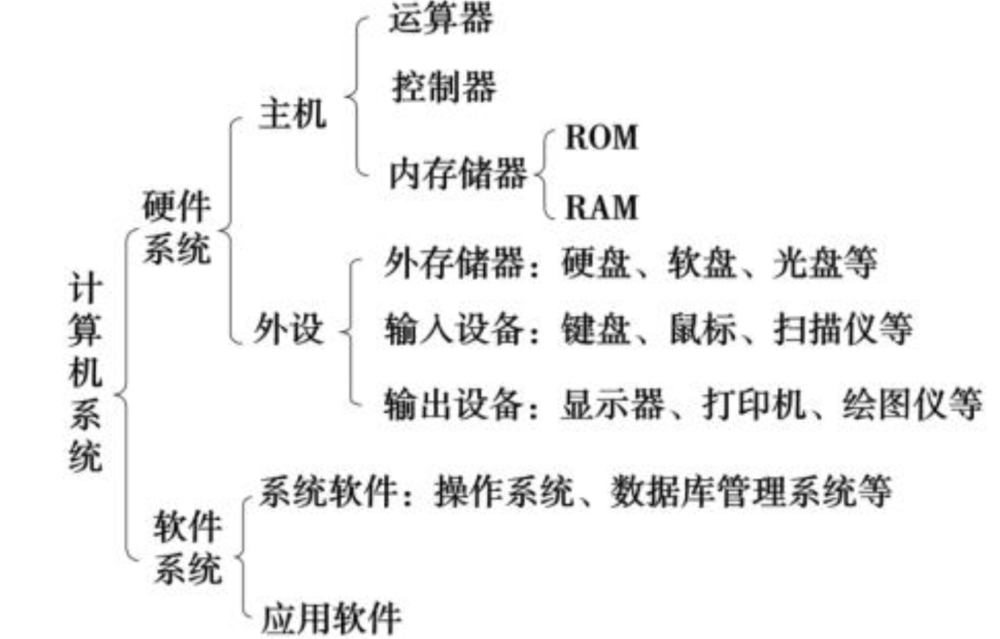

# 计算机组成原理
## 系统概念
### 发展阶段
| 阶段               | 技术基础                       | 存储技术      | 编程语言       | 特点                             |
| ---------------- | -------------------------- | --------- | ---------- | ------------------------------ |
| 第一代（1940s-1950s） | **电子管**                    | 鼠笼式延迟线、磁鼓 | 机器语言       | 体积大、功耗高、运算慢、**I/O 很慢**、可存储信息   |
| 第二代（1950s-1960s） | **晶体管**                    | **磁芯存储器** | **汇编语言**   | 更小更快、更稳定、更省电                   |
| 第三代（1960s-1970s） | **中小规模集成电路（SSI/MSI）**      | 磁芯/半导体混合  | 高级语言出现     | **操作系统**问世，批处理多道               |
| 第四代（1970s-至今）    | **大规模/超大规模集成电路（LSI/VLSI）** | 半导体存储器    | C语言等高级语言广泛 | **微处理器**诞生，计算机普及化，出现个人电脑、网络、AI |

### 计算机的更新迭代
| 驱动因素          | 解释                                                     |
| ------------- | ------------------------------------------------------ |
| **摩尔定律**      | 每 18\~24 个月，芯片上的晶体管数量翻倍，计算能力大幅提高，带动软件向**更高复杂度、更多功能**演进 |
| **半导体存储器的发展** | 存储容量增大、速度提升、价格下降，推动软件具备**更强数据处理和存储能力**（如数据库、大型软件系统）    |
| **微处理器的发展**   | 微处理器不断集成更多功能（如图形加速、AI指令集等），促使软件**向智能化、图形化、多媒体化**发展     |


### 计算机的应用
| 应用领域        | 特点与说明                                                                                        |
| ----------- | -------------------------------------------------------------------------------------------- |
| **科学计算**    | ⭐最早应用，处理**复杂公式和计算**，如天体模拟、气候建模等（追求精度与性能）                                                     |
| **过程控制**    | 用于**实时监控与控制**工业流程，如自动化生产线、航天飞控系统等（实时性强）                                                      |
| **人工智能**    | ⭐模拟人类智能，如**语音识别、图像识别、机器学习**（智能化方向）                                                           |
| **数据处理**    | ⭐应用**最广泛最重要**，处理简单但**量大**的数据，如银行、电商、统计系统等                                                    |
| **计算机辅助应用** | 提高设计制造等工作效率，包括：<br> - CAD：辅助设计<br> - CAM：辅助制造<br> - CAI：辅助教学<br> - CAT：辅助测试<br> - CAE：辅助工程分析 |
| **多媒体应用** | ⭐处理**图像、音频、视频**等多媒体数据，如**游戏、电影、音乐**等（多模态数据处理）                                                     |

### 计算机的分类
| 分类方式          | 类型       | 关键词/说明                     |
| ------------- | -------- | -------------------------- |
| **按工作原理**     | ① 数字式    | 离散数据、常见如 PC、手机，操作二进制，准确、通用 |
|               | ② 模拟式    | 连续数据、如温度仪表、电压控制，处理模拟信号     |
|               | ③ 混合式    | 数字 + 模拟结合，如雷达系统、航天控制等      |
| **按计算机性能/规模** | ① 巨型机    | 国防科研、航天等超级运算（如“神威·太湖之光”）   |
|               | ② 大型/中型机 | 企业/科研部门使用，支持多人多任务          |
|               | ③ 小型机    | 用于小型机构、部门、办公系统             |
|               | ④ 微型机    | 个人电脑 PC、笔记本，最常见            |
|               | ⑤ 单片机    | 嵌入式设备控制器，如智能电饭煲、空调遥控器      |

### 计算机常见性能指标
| 指标名称     | 含义与说明                                                               |
| -------- | ------------------------------------------------------------------- |
| **字长**   | CPU 一次能处理的 **二进制位数**，常见如 8 位、16 位、32 位、64 位；字长越大，处理能力越强             |
| **运算速度** | 衡量计算快慢的单位：                                                          |
|          | • **MIPS**（Million Instructions Per Second）百万条指令每秒                  |
|          | • **MFLOPS**（Million Floating-point Operations Per Second）百万次浮点运算/秒 |
|          | • **CPI**（Cycles Per Instruction）执行一条指令所需的时钟周期数，越小越快                |
| **内存容量** | 常用单位之间换算：                                                           |
|          | • 1KB = 1024B                                                       |
|          | • 1MB = 1024KB                                                      |
|          | • 1GB = 1024MB                                                      |
|          | • 1TB = 1024GB                                                      |

### 冯诺伊曼计算机的特点
- **五大组成部分**：运算器、控制器、存储器、输入设备、输出设备
- **程序存储原理**：指令和数据在存储器中**同等地位**，**按地址访问**
- **二进制编码**：指令和数据都以**二进制形式**存储
- **指令格式**：每条指令 = **操作码（干什么）+ 地址码（找谁干）**
- **顺序执行 + 条件跳转**：指令通常**顺序执行**，也可**根据条件跳转**执行顺序

### 计算机系统层次结构
| 层级    | 名称      | 特点                          | 执行主体               |
| ----- | ------- | --------------------------- | ------------------ |
| 第 1 级 | 微程序机器层  | 真实硬件层，执行微指令                 | 机器硬件               |
| 第 2 级 | 传统机器语言层 | 机器语言层，微程序解释执行机器指令系统         | 微程序                |
| 第 3 级 | 操作系统层   | 系统软件层，提供管理资源的服务（如进程、文件、设备等） | 操作系统（由机器指令+广义指令实现） |
| 第 4 级 | 汇编语言层   | 提供**符号化语言**，便于与机器层交流，接近硬件层  | 汇编程序               |
| 第 5 级 | 高级语言层   | 面向用户，接近自然语言，便于开发应用程序        | 编译器或解释器            |

### 计算机语言
| 语言类型     | 特点                                                               | 处理方式                  |
| -------- | ---------------------------------------------------------------- | --------------------- |
| **机器语言** | - 又称二进制代码语言<br>- 计算机唯一能直接识别和执行的语言<br>- 编程复杂，需要记忆二进制指令编码          | 计算机硬件直接执行             |
| **汇编语言** | - 用符号代替机器指令的二进制码<br>- 需要汇编程序（汇编器）翻译成机器语言才能执行                     | 汇编程序将汇编语言翻译成机器语言      |
| **高级语言** | - 接近自然语言，便于人类编写<br>- 需要编译程序把代码转换成汇编语言，再经过汇编器生成机器语言<br>或直接翻译成机器语言 | 先编译成汇编语言（或直接机器语言），再执行 |

### 语言处理程序
| 类型      | 特点                                             | 举例           |
| ------- | ---------------------------------------------- | ------------ |
| **解释型** | - 逐句解释执行程序代码<br>- 边解释边执行，执行效率相对较低<br>- 灵活，便于调试 | BASIC、Python |
| **编译型** | - 将程序源代码一次性编译成目标文件（如.obj文件）<br>- 编译完成后，运行效率较高  | C、C++        |

### CPU 的和它的主要性能指标
- CPU包含运算器（对数据加工处理的中心）和控制器（计算机的控制中心）
- 双核表示CPU上集成的两个运算核心
- 主频 (Main Frequency): 也叫时钟频率，单位是MHz，用来表示CPU的运算速度。主频 = 外频 × 倍频系数。
- 外频 (External Frequency): 是CPU的基准频率，单位也是MHz，表示CPU与主板同步运行的速度。
- 倍频系数 (Multiplier): 指CPU主频与外频之间的相对比例关系。
- 前端总线 (FSB) 频率 (Front Side Bus Frequency): 也叫总线频率，是CPU与内存直接交换数据的速度。
- 缓存 (Cache): 是一种能够进行高速数据交换的存储设备，它在CPU与内存交换数据之前先与CPU交换数据，因此速度很快。



## 数据表示和运算
### 进制转换
- 十转成非十：整数部分∶ 除 N 取余，商为 0 时，将余数倒序输出，小数部分∶乘 N 取整数
- 非十转十：每位上的数码×基数的位次方，然后求和
- 二/八/十六进制数的互相转换：一位八/十六进制数相当于三/四位二进制数

#### 例 1：十进制转二进制（整数部分）
把十进制数 **13** 转成二进制：

* 13 ÷ 2 = 6 余 1
* 6 ÷ 2 = 3 余 0
* 3 ÷ 2 = 1 余 1
* 1 ÷ 2 = 0 余 1 （停止）

把余数倒序排列：**1101**
所以，13₁₀ = 1101₂

#### 例 2：十进制转八进制（小数部分）

把十进制小数 **0.625** 转成八进制小数：

* 0.625 × 8 = 5.0 → 取整数部分5，小数部分0.0
* 0.0 × 8 = 0 → 取整数0

所以，0.625₁₀ = 0.5₈

#### 例 3：二进制转十进制

把二进制数 **1011** 转成十进制：

* 1×2³ + 0×2² + 1×2¹ + 1×2⁰
* \= 8 + 0 + 2 + 1 = 11

所以，1011₂ = 11₁₀

#### 例 4：八进制和二进制互转

八进制数 **7** 转二进制：

* 7 在二进制中是 **111** （因为一位八进制=三位二进制）

八进制数 **15** 转二进制：

* 1 八进制 = 001 二进制
* 5 八进制 = 101 二进制
* 所以 15 八进制 = 001101 二进制 → 合并去前导零就是 **1101**

#### 例 5：十六进制和二进制互转

十六进制数 **A** 转二进制：

* A = 10 十进制 = 1010 二进制（4位）

十六进制数 **2F** 转二进制：

* 2 = 0010
* F = 1111
* 合起来是 00101111 或简写为 **101111**


### 机器数
- 机器数 = 用一定规则将数转换计算机内部二进制的形式
- 符号位：机器数中表示正负的位，0为正，1为负，符号位放在最高位。
  - 原码和反码有符号位，补码没有符号位

| 数字 | 符号位 | 数值位（二进制） | 原码       | 反码                     | 补码              | 说明                       |
| -- | --- | -------- | -------- | ---------------------- | --------------- | ------------------------ |
| +5 | 0   | 0000101  | 00000101 | 00000101               | 00000101        | **正数的时候 原码=反码=补码**               |
| -5 | 1   | 0000101  | 10000101 | 11111010 (符号位不变，数值位取反) | 11111011 (反码+1) | 负数：原码符号位1，反码数值位取反，补码反码+1 |
| +0 | 0   | 0000000  | 00000000 | 00000000               | 00000000        | 正零                       |
| -0 | 1   | 0000000  | 10000000 | 11111111               | 00000000        | 反码中有-0，补码无-0             |


### 补码的计算

#### 例子背景
我们用 8 位二进制补码表示整数，范围是 -128 到 +127。

#### 补码加法举例

计算：

5 + (-3)

#### 步骤：

* **5 的二进制（补码）**：
  5 的原码是 `00000101`，因为是正数，补码同原码，
  所以 [5]补 = 00000101

* **-3 的补码**：
  3 的原码是 `00000011`
  先取反：`11111100`
  加1：`11111101`
  所以 [-3]补 = 11111101

* **相加**：

  ```
   00000101
  +11111101
  ----------
   00000010 （忽略最高位进位）
  ```

* **结果**：`00000010`，即十进制的 2。

* 验证：5 + (-3) = 2，正确。

#### 补码减法举例

计算：

5 - 3

#### 步骤：

* **5 的补码**：同上，`00000101`

* **3 的补码**：同上，`00000011`

* **求 -3 的补码**（减法转加法）

  * 取3的补码 `00000011`
  * 取反：`11111100`
  * 加1：`11111101`

* **相加**：

  ```
   00000101
  +11111101
  ----------
   00000010
  ```

* **结果**：`00000010`，十进制 2。

* 验证：5 - 3 = 2，正确。

### IEEE754 标准
- IEEE 754 标准是计算机中浮点数（小数）表示和运算的国际标准。它定义了浮点数的二进制格式和计算规则，保证不同平台之间浮点运算的一致性。
- 一个浮点数拆成3部分：符号位、指数位、尾数
  - 符号位（S）：0表示正数，1表示负数
  - 指数位（E）：用偏移码（Bias）表示，单精度Bias=127
  - 尾数（M）：又称有效数字或小数部分，存储的是二进制小数的“尾数”，默认最高位是隐含的1（除非是非规格化数）
- 比如：符号位=0（正数），指数=2，尾数=1.625，那真实数字就是：1.625 × 2² = 6.5

### 浮点数运算过程
| 速记点      | 内容说明                                      | 关键操作 / 备注                                |
| -------- | ----------------------------------------- | ---------------------------------------- |
| **速记点1** | **对阶**                                    | 计算阶差，把小阶尾数右移，向大阶靠齐，确保小数点对齐               |
| **速记点2** | **尾数求和**                                  | 对阶后，两个尾数按定点加减法进行运算，考虑符号位                 |
| **速记点3** | **规格化**                                   | 调整尾数和阶码使尾数最高位满足规范                        |
|          | - Ss1Ss2 = 00 且尾数最高位不同 → 左规（尾数左移，阶码减1）    | 避免溢出，尾数补足有效位                             |
|          | - Ss1Ss2 = 00 或 11 且尾数最高位相同 → 无溢出，无需调整    | 保持原状                                     |
|          | - Ss1Ss2 = 01 或 10 → 右规（尾数右移，阶码加1），表示溢出   | 防止阶码越界                                   |
| **速记点4** | **舍入方式**                                  | 两种方法：                                    |
|          | - “0 舍 1 入”法：尾数右移时，丢弃最高位0舍去，1则末位加1；可能引发溢出 | 需再次右规                                    |
|          | - 恒置“1”法：尾数右移后，尾数末位恒为1，可能使尾数变大或变小         | 稳定尾数长度                                   |
| **速记点5** | **溢出判断**（观察 Ss1Ss2）                       | 00：正数无溢出<br>01：正溢出<br>10：负溢出<br>11：负数无溢出 |

### 非数值型数据表示方法
| 速记点  | 内容说明                  | 备注                   |
| ---- | --------------------- | -------------------- |
| 速记点1 | **ASCII**：美国标准信息交换码   | 采用1字节（8位）编码字符        |
| 速记点2 | **汉字编码**：多种编码方式       | 国标码（GB码）、输入码、机内码、字形码 |
| 速记点3 | **二-十进制编码**：8421 BCD码 | 用4位二进制表示1位十进制数字      |

### 校验码
| 速记点  | 内容说明                                              | 备注            |
| ---- | ------------------------------------------------- | ------------- |
| 速记点1 | **奇/偶校验码**：在信息码基础上加1位校验码（可加前或后），分奇校验和偶校验          | 用于简单检错，但检错率较低 |
| 速记点2 | **CRC码（循环冗余校验码）**：检错率高、开销小、实现简单，广泛用于计算机网络数据通信     | 目前主流的检错方法     |
| 速记点3 | **海明码**：多重奇偶校验码，加入多个校验位，分配校验位到不同奇偶校验组，实现多位错误检测和定位 | 可以检测并纠正单个位错误  |


## 系统指令与总线
### 指令格式
| 指令类型  | 特点简述                          |
| ----- | ----------------------------- |
| 零地址指令 | 操作数隐含在栈顶，指令不带地址字段             |
| 一地址指令 | 指令带一个地址字段，另一个操作数在累加器或隐含寄存器中   |
| 二地址指令 | 指令带两个地址字段，一个为源操作数，一个为目标操作数    |
| 三地址指令 | 指令带三个地址字段，分别指定两个源操作数和一个结果存放地址 |
| 四地址指令 | 指令带四个地址字段，适合复杂操作，较少见          |

### 数据寻址方式
| 寻址方式        | 定义说明                    | 访问速度（大致） | 备注             |
| ----------- | ----------------------- | -------- | -------------- |
| 立即寻址        | 操作数直接在指令中给出             | 快        | 操作数大小受限        |
| 寄存器寻址       | 操作数存放在寄存器中              | 非常快      | 寄存器访问速度最快      |
| 直接寻址        | 指令给出操作数在内存的地址           | 较慢       | 访问内存           |
| 间接寻址        | 指令中地址指向另一个地址，操作数在该地址处   | 慢        | 多次内存访问         |
| 寄存器间接寻址     | 地址存在寄存器中，操作数在寄存器指向的内存地址 | 较慢       | 先读寄存器，再读内存     |
| 基址寻址        | 基址寄存器的值 + 指令中的偏移量计算地址   | 中等       | 面向系统，支持动态地址    |
| 变址寻址        | 变址寄存器的值 + 偏移量计算地址       | 中等       | 面向用户，支持数组、表等访问 |
| 相对寻址        | 以程序计数器PC为基址 + 指令偏移量计算地址 | 中等       | 支持跳转、分支        |
| 堆栈寻址        | 操作数在栈顶                  | 较快       | 零地址指令，多用于表达式计算 |
| 组合寻址（基址+变址） | 用多个寄存器和偏移量组合计算操作数地址     | 依组合复杂度而定 | 用于复杂数据结构访问     |


### RISC 和 CISC 的比较
- RISC （Reduced Instruction Set Computer）和 CISC （Complex Instruction Set Computer）都是计算机处理器设计的两种基本思想，目的是让 CPU 更高效地执行程序指令

| 特点    | RISC（精简指令集计算机）   | CISC（复杂指令集计算机）      |
| ----- | ---------------- | ------------------- |
| 指令数量  | 指令集简单，数量较少       | 指令集复杂，数量较多          |
| 指令长度  | 固定长度（如32位）       | 长度不固定，指令长度多样        |
| 指令格式  | 结构简单，格式统一        | 结构复杂，格式多样           |
| 寻址方式  | 寻址方式少，主要寄存器寻址    | 寻址方式多样              |
| 存储器访问 | 只有加载和存储指令访问存储器   | 多种指令直接访问存储器         |
| 操作数位置 | 大多数操作在寄存器之间完成    | 操作数可以在存储器和寄存器之间     |
| 执行周期  | 大部分指令一个时钟周期完成    | 指令执行时间不固定，复杂指令多周期执行 |
| 控制方式  | 主要采用组合逻辑控制       | 采用微程序控制             |
| 硬件设计  | 硬件简单，易于实现流水线     | 硬件复杂，实现流水线较难        |
| 编译器依赖 | 依赖优化编译器生成高效代码    | 硬件复杂，减少编译器负担        |
| 应用示例  | ARM、MIPS、PowerPC | x86架构（Intel、AMD处理器） |


### 总线结构
- 总线：连接各个功能部件的信息传输线，是各个功能部件共享的传输介质

| 总线结构类型 | 说明                                               |
| ------ | ------------------------------------------------ |
| 单总线结构  | 用一条系统总线连接 CPU、内存、I/O 等所有功能部件，结构简单但易发生总线冲突        |
| 双总线结构  | 增加了存储总线，专门负责 CPU 与主存之间高速数据传输，提高存储访问效率            |
| 三总线结构  | 在双总线结构基础上增加 I/O 总线，多个外设通过 I/O 总线与通道通信，改善外设数据传输效率 |

### 总线特性
| 特性类型 | 内容说明                                  |
| ---- | ------------------------------------- |
| 机械特性 | 总线连接的物理标准，如插头插座的尺寸、形状、引脚数量及排列顺序，接触可靠性 |
| 功能特性 | 各传输线功能分工，如地址总线传地址，数据总线传数据             |
| 电气特性 | 信号传递方向和电平范围，CPU发出的为输出信号，送入CPU为输入信号    |
| 时间特性 | 各信号有效的时间关系，信号之间的时序同步，通常用信号时序图描述       |

### 总线通信方式
| 通信方式  | 说明                                    |
| ----- | ------------------------------------- |
| 同步通信  | 通信双方由统一时钟控制数据传送，操作时间严格同步              |
| 异步通信  | 无公共时钟，各部件操作时间不必严格统一，分为不互锁、半互锁、全互锁三种形式 |
| 半同步通信 | 结合同步和异步特点，部分时间段同步，部分异步                |
| 分离式通信 | 一个传输周期分成两个子周期：周期1由主控A向从控B传送，周期2由B向A传送 |

### 总线通信标准
| 总线标准        | 简要说明                |
| ----------- | ------------------- |
| ISA         | 工业标准体系结构，较老的总线标准    |
| EISA        | 扩展的 ISA，总线性能和地址空间增强 |
| VESA        | 视频电子标准协会，主要用于显示接口   |
| PCI         | 外部设备互连，广泛应用的并行总线    |
| PCI-Express | 最新的高速串行总线和接口标准      |
| AGP         | 专用于加速图形处理的接口        |
| USB         | 通用串行总线，支持热插拔和即插即用   |

### 总线仲裁
- 总线仲裁：在多设备共享总线时，解决多个设备同时请求总线使用权的问题

| 仲裁方式       | 特点总结                      | 缺点                   |
| ---------- | ------------------------- | -------------------- |
| 链式查询方式     | 离仲裁器最近的设备优先级最高            | **链路故障敏感**，优先级固定     |
| 计数器定时查询    | 按顺序轮询各设备请求，使用程序计数器控制      | **无法体现优先级**，不适应实时性   |
| 独立请求/响应线方式 | 每个设备有一对 BRi/BGi 信号线，优先级可设 | **布线复杂**，**硬件资源开销大** |

## 存储系统
### 存储器分类
| 分类方式        | 分类依据    | 具体类型                  | 说明                              |
| ----------- | ------- | --------------------- | ------------------------------- |
| 一、按**存储介质** | 物理材料    | 半导体器件、磁性材料、光盘         | 如：DRAM（半导体）、磁盘（磁性）、CD-ROM（光盘）等  |
| 二、按**读写功能** | 是否可写    | ROM（只读存储器）、RAM（随机存储器） | ROM：数据预置不可改（在制造或写入时就固定好的）；RAM：数据可随时读写         |
| 三、按**系统作用** | 在系统中的位置 | 主存储器、辅助存储器、缓冲存储器      | 主存：如DDR；辅助：硬盘、U盘；缓冲：Cache（加快速度） |

- CD 光盘存储容量一般达 650MB ，有只读型光盘 CD-ROM 、一次性写入光盘 CD-R 和可擦除型光盘 CD-RW 等。


### 存储器层次结构
| 层次  | 名称           | 作用             | 特点            | 举例          |
| --- | ------------ | -------------- | ------------- | ----------- |
| 第1层 | **缓存 Cache** | CPU 与主存之间的高速缓冲 | 容量小、速度最快、价格高  | L1、L2、L3 缓存 |
| 第2层 | **主存 RAM**   | 存储正在运行的数据和程序   | 容量中等、速度较快、可读写 | DDR4、DDR5   |
| 第3层 | **辅助存储器**    | 永久保存大量数据       | 容量最大、速度慢、成本低  | SSD、HDD、光盘等 |

- RAM（随机访问存储器）：断电就没了，临时存程序和数据。
- ROM（只读存储器）：断电也能保留数据，常存“启动程序”等。

### RAM的分类：SRAM 和 DRAM
| 特性      | **SRAM（静态随机存取存储器）**         | **DRAM（动态随机存取存储器）**          |
| ------- | --------------------------- | ---------------------------- |
| 英文全称    | Static Random Access Memory | Dynamic Random Access Memory |
| 是否需要刷新  | ❌ **不需要刷新**（数据稳定）           | ✅ **需要周期性刷新**（电容会漏电）         |
| 存储单元结构  | 由 **6 个晶体管**组成              | 由 **1 个晶体管 + 1 个电容**组成       |
| 存取速度    | ✅ 快（纳秒级）                    | ❌ 慢（几十纳秒）                    |
| 集成度（容量） | ❌ 低（结构复杂，单元大）               | ✅ 高（结构简单，单位面积容量大）            |
| 功耗      | ✅ 低（静态功耗低）                  | ❌ 高（刷新耗电）                    |
| 成本      | ❌ 高                         | ✅ 低                          |
| 应用场景    | CPU缓存（L1/L2/L3 Cache）       | 主存（常见的 DDR4/DDR5 等）          |

#### DRAM的三种刷新方式
- 刷新：DRAM 的电容会漏电，需要定期刷新，否则数据会丢失

| 刷新方式     | 特点                       | 优缺点对比                    | 是否影响正常访问  |
| -------- | ------------------------ | ------------------------ | --------- |
| **集中刷新** | 在一个统一的时间段内，**集中**刷新所有行   | ✅实现简单<br>❌刷新期间需停止访问      | ❌ 需要暂停读/写 |
| **分散刷新** | 每次访问都**顺便刷新一行**，刷新过程分散进行 | ✅无“死时间”，不中断访问<br>❌控制逻辑复杂 | ✅ 不影响访问   |
| **异步刷新** | 集中+分散的结合，按最大刷新间隔安排刷新     | ✅利用刷新间隔<br>✅减少死时间        | ✅ 减少访问冲突  |

### ROM的分类
| 名称               | 简称           | 特点                                       |
| ---------------- | ------------ | ---------------------------------------- |
| **掩模式只读存储器**     | **Mask ROM** | 出厂前一次性烧录，**不可更改**，适合大批量生产                |
| **一次可编程只读存储器**   | **PROM**     | 用户可**编程一次**，之后不能修改（用电吹断保险丝）              |
| **可擦除可编程只读存储器**  | **EPROM**    | 可用紫外线**擦除后重新编程**，要整片擦除                   |
| **电可擦除可编程只读存储器** | **EEPROM**   | 可**电擦除并重复编程**，可以**按字节**擦除                |
| **闪速存储器**        | **Flash闪存**    | **改进版 EEPROM**，按“块”擦除，速度快、价格低，广泛用于U盘、手机等 |
| **固态硬盘**         | **SSD**      | 实质是**基于 Flash** 的大容量存储器，替代机械硬盘（HDD）      |

### 地址映射
| 映射方式  | 说明                          | 优点                 | 缺点           |
| ----- | --------------------------- | ------------------ | ------------ |
| 直接映射  | 主存块固定映射到 Cache 中的唯一一块位置     | 结构简单，成本低           | 容易产生冲突，命中率较低 |
| 全相联映射 | 主存块可映射到 Cache 中的任意块位置       | 灵活性高，命中率高，减少冲突     | 逻辑复杂，成本高     |
| 组相联映射 | 将 Cache 分组，组内采用全相联，组间采用直接映射 | 兼顾灵活性和成本，命中率优于直接映射 | 复杂度介于两者之间    |

### 存储器和CPU的连接
- 存储器和CPU的连接，就是让CPU能正确访问存储器中的数据和指令，完成读写操作的硬件线路和控制信号

| 连接方式     | 说明                             |
| -------- | ------------------------------ |
| 地址线连接    | CPU 地址线连接到存储器地址输入端，选中存储单元      |
| 数据线连接    | CPU 数据线与存储器数据端口相连，实现数据传输       |
| 读/写命令线连接 | 控制读写操作，读命令使存储器输出数据，写命令使存储器接收数据 |
| 片选线连接    | 控制哪片存储芯片被激活，防止总线冲突             |
| 合理选择存储芯片 | 根据容量、速度、功耗和成本选择合适芯片            |

### Cache替换算法
- 替换算法：当Cache满时，需要替换掉一些数据，以腾出空间给新的数据

| 替换算法         | 特点                          | 优缺点              |
| ------------ | --------------------------- | ---------------- |
| 随机算法（Random） | 随机选择一个块替换，无需记录使用情况          | 简单易实现，但不能提高命中率   |
| 先进先出（FIFO）   | 替换最早进入Cache的块，不记录使用频率       | 实现简单，开销小，但不利用局部性 |
| 最少使用（LRU）    | 替换最近最少使用的块，利用局部性原理，需要跟踪使用记录 | 命中率高，但实现复杂，开销大   |

### Cache写策略
- 写策略：当Cache中的数据被修改后，需要更新Cache和主存中的数据

| 写策略名称                    | 说明                                    | 优缺点                        |
| ------------------------ | ------------------------------------- | -------------------------- |
| 写直达法（Write Through）      | 数据写入Cache的同时，**立即写入主存**               | 数据一致性好，但写操作慢，主存压力大         |
| 写回法（Write Back）          | 只写Cache，不立即写主存，**等该Cache块被替换时再写回主存**  | 减少主存写次数，提高性能，但需维护脏位，数据一致性差 |
| 写分配法（Write Allocate）     | 写操作发生Cache未命中时，**先将对应块从主存调入Cache，再写** | 利用局部性原则，提高后续访问效率           |
| 非写分配法（No Write Allocate） | 写操作发生Cache未命中时，**直接写主存，不加载到Cache**    | 简单，不占用Cache空间，但可能导致性能下降    |

## CPU
### CPU寄存器分类
- CPU 寄存器（Register） 是计算机中速度最快、地位最高的存储器

| 寄存器类型     | 代表寄存器              | 主要功能说明                 |
| --------- | ------------------ | ---------------------- |
| **通用寄存器** | 多个寄存器组             | 用户可直接操作的寄存器，存放临时数据或运算数 |
| **专用寄存器** | IR、PC、MDR、MAR、PSWR | 特定功能寄存器，辅助CPU指令执行和控制   |

#### 专用寄存器
| 寄存器      | 缩写   | 作用描述                 |
| -------- | ---- | -------------------- |
| 指令寄存器    | IR   | 存放从主存取出的当前执行指令       |
| 程序计数器    | PC   | 存放下一条将要执行指令的地址       |
| 存储器数据寄存器 | MDR  | 暂存从主存读取或写入的数据或指令     |
| 存储器地址寄存器 | MAR  | 存放当前CPU要访问的主存单元地址    |
| 状态标志寄存器  | PSWR | 保存算术/逻辑运算结果的条件码（标志位） |

### 指令周期
- “指令周期的数据流”指的是CPU执行一条指令时，数据在CPU内部以及CPU和存储器之间传递和处理的过程。它描述了从取出指令开始，到完成指令执行，CPU内部各个部件之间数据如何流动的全过程。

| 阶段名称                    | 说明                      |
| ----------------------- | ----------------------- |
| 取指周期（Fetch）             | 从存储器取出下一条指令，送入指令寄存器（IR） |
| 间址周期（Decode/Addressing） | 解释指令含义，确定操作数地址，准备访问操作数  |
| 执行周期（Execute）           | 执行指令操作，如算术运算、存取数据或控制转移  |
| 中断周期（Interrupt）         | 响应中断请求，保存现场，转去中断服务程序    |

### 影响流水线性能的因素
- **流水线（Pipeline）**就是一种让 CPU 同时“多道作业”并行处理的技术，类似工厂流水线把工作分成多个步骤，多个任务同时在不同步骤上作业，提高整体效率。
  - 把一条指令的执行过程拆分成多个阶段（比如取指、译码、执行、访存、写回）
  - 每个阶段像流水线上的一个工序，多个指令可以同时在不同阶段执行
  - 这样一来，CPU 每个时钟周期都能完成一个阶段的工作，提高指令吞吐率

| 因素类型       | 说明                             | 影响表现           |
| ---------- | ------------------------------ | -------------- |
| 资源相关（结构相关） | 多条指令争用同一个硬件资源（如ALU、存储器端口等）     | 硬件资源冲突，流水停顿    |
| 数据相关       | 后一条指令的操作数依赖前一条指令的结果，但结果尚未写回或更新 | 数据冒险，需等待或转发    |
| 控制相关       | 流水线遇到转移（跳转）指令，后续指令的执行顺序不确定     | 控制冒险，产生流水停顿或重填 |

### 时序系统控制方式
- “时序系统控制方式”指的是计算机或数字系统中，如何产生和管理控制信号的时序安排方法，确保各个部件按正确的时间顺序协同工作。
| 控制方式 | 说明                          | 特点                 |
| ---- | --------------------------- | ------------------ |
| 同步控制 | 有统一时钟信号，所有控制信号都同步于该时钟       | 控制简单，易设计，但时钟周期限制性能 |
| 异步控制 | 无统一时钟，操作时间不固定，指令执行时间随实际需要变化 | 灵活高效，但设计复杂         |
| 联合控制 | 同步与异步控制结合，兼顾两者优点            | 灵活且易实现             |
| 人工控制 | 通过面板开关或按键人工干预控制，用于调试或开发     | 非自动控制，用于特殊场景       |

### 微指令编码方式
- 微指令是微程序控制器中的最小控制单位，是用来实现一条机器指令的基础步骤的指令
- 微指令编码方式是指微程序控制器中，如何用二进制编码来表示和组织控制信号（微命令）的方式。它决定了微指令的长度、结构和控制信号的生成效率。

| 编码方式  | 说明                        | 优缺点                   |
| ----- | ------------------------- | --------------------- |
| 直接编码法 | 每个微命令用独立的控制字段，所有控制信号并行出现  | 操作简单，速度快，但微指令字长，控制字段多 |
| 字段编码法 | 将相互排斥的微命令合并成一个字段，减少微指令字长度 | 缩短微指令字，提高编码效率         |
| 最短编译法 | 使用固定长度微指令，通过编码定义微命令       | 微指令字最短，节省存储空间         |

### 指令流水三个性能指标
- 指令流水（Instruction Pipeline） 是一种提高CPU执行效率的技术，它像工厂“装配线”一样，把一条指令的执行过程分成若干个阶段，每个阶段由不同的硬件模块完成，各阶段可以并行工作，提高吞吐率。

| 指标  | 含义           | 公式或说明                                                     | 理想值范围      | 类比解释                     |
| --- | ------------ | --------------------------------------------------------- | ---------- | ------------------------ |
| 吞吐量 | 单位时间内完成的指令数  | 最大吞吐量 ≈ 1 条/周期（满负荷工作时）<br>实际吞吐量 < 最大吞吐量                   | ≤ 1 条/周期   | 工厂每小时产出的产品数量             |
| 加速比 | 流水线比非流水线快多少倍 | 加速比 S = (n × t)/(n + k - 1)<br>（n = 指令数，k = 段数） | ≤ k（流水线段数） | 一人干 10 分钟，五人协作只需 3 分钟    |
| 效率  | 各功能段的资源利用率   | 效率 E = S/k<br>（S 为加速比，k 为段数）                    | ≤ 1        | 有 5 个人，但只有 4 个在忙时效率为 0.8 |

### 流水多发
- 普通流水线：每个时钟周期发射一条指令，多个指令在不同流水线阶段交错执行。
- 流水多发：每个时钟周期可以发射多条指令，多个指令同时进入流水线的同一阶段并行处理。

| 技术名称                 | 核心思想            | 特点                                | 类比理解              |
| -------------------- | --------------- | --------------------------------- | ----------------- |
| 超标量（Superscalar）     | **多个指令并发执行**    | 多个执行单元，同时执行**多条普通指令**             | 多条生产线并行运作，一次造多个零件 |
| 超流水（Superpipelining） | **单条指令细分更多流水段** | 将传统5段流水进一步细分为更多阶段，提高时钟频率          | 把一条流水线拆成更多更小的流水阶段 |
| 超长指令字（VLIW）          | **一条指令打包多条操作**  | 编译器将多个操作打包成**一条“超大”指令**，供多个部件并行执行 | 一条订单中包含多个加工任务     |


## I/O设备
### 磁表面记录方式
- 磁表面记录方式是计算机磁盘或磁带等磁性介质上记录和读取二进制数据时所采用的一种编码方式

| 编码方式      | 全称/简称                     | 速记要点                | 特征/规律               | 优缺点简述           |
| --------- | ------------------------- | ------------------- | ------------------- | --------------- |
| 归零制       | RZ (Return to Zero)       | 一个比特周期中信号一定返回0      | “1”与“0”都在中间回0       | 占带宽高，识别简单       |
| 不归零制      | NRZ (Non Return to Zero)  | 信号不回0，保持电平          | “1”保持高电平，“0”保持低电平   | 简单但难定位同步        |
| “见1就翻”不归零 | NRZ1（或NRZI）               | 遇到“1”就翻转电平，遇“0”不变   | 类似状态机：只在“1”时跳变      | 相对 NRZ 更适合长“0”串 |
| 调相制       | PM (Phase Modulation)     | 利用相位跳变来表示数据         | 通过“相位翻转”表示“1”       | 解码复杂，但抗干扰好      |
| 调频制       | FM (Frequency Modulation) | 每位起始强制产生脉冲，“1”再加一脉冲 | “1”=两个脉冲，“0”=一个脉冲   | 占用空间大，易同步       |
| 改进调频制     | MFM (Modified FM)         | 只在需要时加中间脉冲，降低脉冲密度   | “1”在位中加脉冲，“0”依据前位决定 | 更高存储密度，MFM更主流   |

### 传送控制方式
- 传送控制方式是为了 在 CPU、主存储器 和 I/O 设备之间高效、安全地传送数据

| 控制方式        | 控制者        | CPU参与情况    | 优点             | 缺点          | 适用场景         |
| ----------- | ---------- | ---------- | -------------- | ----------- | ------------ |
| 程序查询方式      | CPU        | 全程主动轮询     | 实现简单           | CPU效率低、忙等   | 低速设备、结构简单系统  |
| 程序中断方式      | CPU + 中断控制 | CPU仅在中断时处理 | 提高CPU利用率       | 中断处理有开销     | 中速设备         |
| DMA（直接存储访问） | DMA控制器     | CPU仅发起请求   | 数据传输快，CPU负担小   | 控制器复杂，需仲裁总线 | 大量数据传输，如硬盘   |
| I/O 通道控制方式  | I/O通道控制器   | CPU几乎不参与   | 可并行管理多个设备，效率最高 | 成本高，硬件复杂    | 大型主机、大型多设备系统 |

### 中断处理
- 中断（Interrupt）是指 计算机在执行程序的过程中，因某种突发事件而暂停当前任务，转去处理该事件，处理完后再返回原程序继续执行的一种机制。

#### ✅ 一图速记：中断处理 5 步流程
- INTR表示Interrupt Request
- EINT 表示 Enable Interrupt
```
┌──────────────┐
│ ① 中断请求   │ ← 来自外设（如键盘、磁盘）发出 INTR=1
└────┬─────────┘
     ↓
┌──────────────┐
│ ② 中断判优   │ ← 判断哪个中断源优先（如磁盘比键盘优先）
└────┬─────────┘
     ↓
┌──────────────┐
│ ③ 中断响应   │ ← CPU 检查 EINT=1 才会响应（开中断）
└────┬─────────┘
     ↓
┌──────────────┐
│ ④ 中断服务   │ ← 做三件事：保护现场 → 执行服务程序 → 恢复现场
└────┬─────────┘
     ↓
┌──────────────┐
│ ⑤ 中断返回   │ ← 执行 IRET 指令，返回断点处继续执行主程序
└──────────────┘
```

#### ✅ 对应的速记点解释表格

| 步骤     | 名称       | 关键词/作用                        |
| ------ | -------- | ----------------------------- |
| ① 中断请求 | INTR = 1 | 某个设备发出请求 → 设置中断请求触发器          |
| ② 中断判优 | 优先级判断    | 判断哪个中断先响应，比如打印机和键盘一起请求怎么办     |
| ③ 中断响应 | EINT 开关  | CPU 检查是否允许中断（EINT=1）才能执行中断隐指令 |
| ④ 中断服务 | 最关键阶段    | 保护现场→执行服务程序→恢复现场        |
| ⑤ 中断返回 | IRET     | 一条“中断返回指令”，回到中断前断点继续执行主程序     |

### DMA的控制方式
- DMA（Direct Memory Access，直接存储器访问）是一种让外设绕过 CPU，直接与主存交换数据的机制，大大提升了数据传输效率。

| 方式名称            | 速记关键词      | 原理说明                                                           |
| --------------- | ---------- | -------------------------------------------------------------- |
| **① CPU 停止访问法** | 暂停 CPU 用内存 | DMA 请求时，CPU **完全暂停**，DMA 独占总线访问内存，控制简单，但 CPU 被“晾着”效率低          |
| **② 交替访问法**     | 时间片轮转      | 一个 CPU 周期被平均分成两个片段：一半给 CPU，一半给 DMA，类似 **轮流用内存**                |
| **③ 周期挪用法**     | 挪用部分内存周期   | DMA 仅在 **IO 比内存慢**时，**趁内存空闲**“偷用”一次周期（偷时间），不干扰 CPU 连续访问内存，效率更高 |

### DMA接口组成
| 组成部分            | 作用说明                         |
| --------------- | ---------------------------- |
| **主存地址寄存器（AR）** | 保存当前要访问的主存地址（数据传输目标地址）       |
| **字计数器（WC）**    | 记录需要传输的数据字数，传输完毕后计数器归零       |
| **数据缓冲寄存器（BR）** | 暂存从主存或设备读入的数据，或准备写入的数据       |
| **DMA控制逻辑**     | 控制DMA传输过程，包括总线请求、握手、传送时序控制等  |
| **中断机构**        | DMA传输完成后向CPU发出中断信号，通知CPU传输结束 |

### I/O接口的功能
| 功能名称         | 作用说明                                 |
| ------------ | ------------------------------------ |
| **选址功能**     | CPU通过设备选择线上的设备码确定与哪台I/O设备通信，实现设备定位   |
| **传送命令功能**   | 存放并译码CPU发出的命令，保证I/O设备能正确响应CPU指令      |
| **传送数据功能**   | 提供数据通路，实现CPU与I/O设备之间的数据传送            |
| **反映设备状态功能** | 设置状态触发器，实时反映I/O设备的工作状态，使CPU能及时了解设备状况 |

### I/O接口的编址方式
| 编址方式      | 特点与优缺点                                                                                    | 备注              |
| --------- | ----------------------------------------------------------------------------------------- | --------------- |
| **统一编址**  | - I/O 地址视为内存地址的一部分<br>- 不需专门的I/O指令，操作灵活方便<br>- 端口地址空间大<br>- 端口占用内存地址空间，内存容量减小<br>- 访问速度较慢 | 编址空间共享，指令通用     |
| **不统一编址** | - I/O地址和存储地址分开<br>- 输入/输出指令与存储指令区分清晰<br>- 编程更清晰<br>- 指令种类少，功能受限<br>- 需要CPU发出两组控制信号，增加复杂度  | 独立I/O端口，硬件设计更复杂 |
