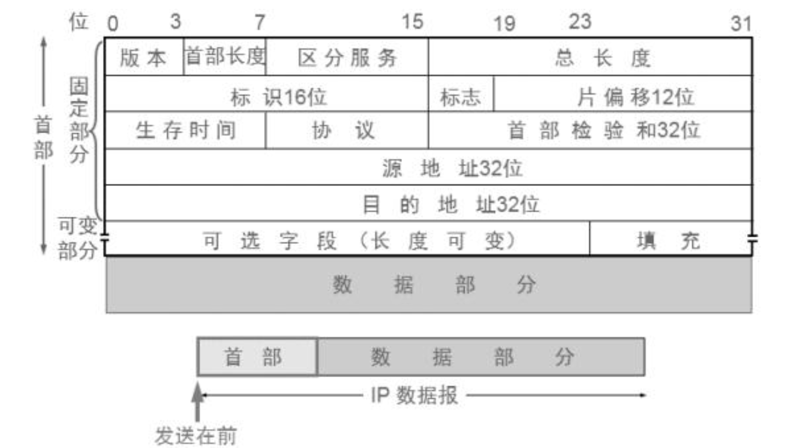
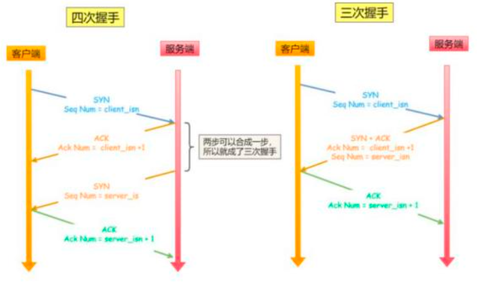
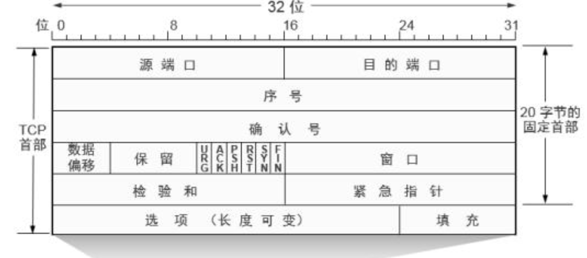

# 计算机网络
## 概述
- 计算机网络指分布在不同地理位置上的具有独立功能的多个计算机系统，通过通信设备和通信线路互连起来，在网络软件的管理下实现数据传输和资源共享

### 计算机网络发展阶段
| 阶段   | 名称      | 关键特点              | 示例/说明                |
| ---- | ------- | ----------------- | -------------------- |
| 第一阶段 | ARPANET | 世界第一个分组交换网络       | 1969年，美国ARPA开发，连4台主机 |
| 第二阶段 | 三层结构网络  | 主干网 → 地区网 → 校园网   | 中国CERNET网络分为省、市、学校三级 |
| 第三阶段 | 多级ISP结构 | 顶级ISP↔二级ISP↔三级ISP | 家用宽带通过三级ISP接入互联网     |

### 计算机网络的功能
| 功能名称  | 核心含义及作用说明                            |
| ----- | ------------------------------------ |
| 资源共享  | 网络中所有用户可共享软件、硬件、数据等资源，是**最本质**的功能    |
| 数据通信  | 提供传真、Email、远程登录、浏览等通信服务，实现信息的高效传递    |
| 提高可靠性 | 各计算机可互为备份/替代，某节点故障时系统仍可正常运作，增强系统容错能力 |
| 分布式处理 | 将大型任务分散到多台计算机同时处理，合理调配资源、提高处理效率      |

### 计算机网络的分类
| 分类方式      | 分类类型/示例                                 | 简要说明与关键词                                               |
| --------- | --------------------------------------- | ------------------------------------------------------ |
| **按覆盖范围** | 🌐 广域网 WAN<br>🏙 城域网 MAN<br>🏠 局域网 LAN  | **广域网**：跨城市/国家，如互联网<br>**城域网**：城市内部<br>**局域网**：校园/公司内部 |
| **按拓扑结构** | 🌲 树型<br>⭐ 星型<br>⭕ 环型<br>─ 总线型<br>🕸 网状 | 描述节点间连接方式：<br>**星型**常用于局域网<br>**总线型**简单但易冲突            |
| **按传输介质** | 有线（光纤、同轴电缆、双绞线）<br>无线（Wi-Fi、5G）         | **有线**适合高速/稳定连接<br>**无线**适合移动设备或难布线环境                  |

| 符号 | 拓扑结构      | 特点                      | 优点                | 缺点                    | 常见应用           |
| -- | --------- | ----------------------- | ----------------- | --------------------- | -------------- |
| 🌲 | **树型拓扑**  | 多个星型结构按层级连接，像倒立的树       | 扩展性好、易管理          | 高层节点故障影响下层            | 企业分层网络、分布式系统   |
| ⭐  | **星型拓扑**  | 所有节点都连接到一个中心节点（交换机/集线器） | 易管理，某个端口坏了不影响其他节点 | 中心节点故障全网瘫痪            | 局域网、办公室网络      |
| ⭕  | **环型拓扑**  | 节点首尾相连成一个闭环             | 每个节点转发数据，结构简单     | 任意一点故障可能导致全环瘫痪（双环可改善） | 早期令牌环网、光纤环网    |
| ─  | **总线型拓扑** | 所有节点共享一条通信干线            | 布线简单、成本低          | 易冲突、故障定位难、可扩展性差       | 早期以太网（同轴电缆）    |
| 🕸 | **网状拓扑**  | 节点间多路径互连                | 冗余度高、可靠性好         | 布线复杂、成本高              | 数据中心骨干、互联网核心路由 |


### 因特网核心和边缘网络
| 对比项  | 因特网核心       | 边缘网络（Edge）    |
| ---- | ----------- | ------------- |
| 位置   | 网络中间部分      | 靠近用户（终端）      |
| 连接对象 | 网络 ↔ 网络     | 用户 ↔ 网络       |
| 设备   | 核心路由器、大型交换机 | 接入路由器、Wi-Fi设备 |
| 延迟   | 极低，传输快      | 相对更高          |
| 控制者  | 大型ISP/骨干运营商 | 小型ISP、企业、家庭用户 |

- 路由器就是“数据的交通指挥”，它帮你决定“这条数据该走哪条路，最快送到目标”。

### 网络交换方式

| 交换方式     | 特点描述                          | 举例场景       | 优点           | 缺点            |
| -------- | ----------------------------- | ---------- | ------------ | ------------- |
| **电路交换** | 独占通信线路，需“建立 → 通话 → 拆除”三阶段     | 电话系统       | 实时性强，通信稳定    | 利用率低，浪费资源     |
| **报文交换** | 整个**报文**一次传输，“存储转发”           | 电子邮件系统     | 不需建立连接，节省资源  | 实时性差，时延大      |
| **分组交换** | 报文被分成多个**分组**，每个分组独立传输，“动态复用” | 互联网（如网页浏览） | 高效、灵活、资源利用率高 | 分组乱序，需重组，复杂性高 |

* 🧵 **电路交换**：**一根线三阶段**（呼叫建立 → 通话 → 呼叫拆除）
* 📩 **报文交换**：一整包发，一站一存，适合**非实时**数据
* 📦 **分组交换**：分成小包，独立传送，再**组装**，适合互联网

### 虚电路服务和数据报服务
* **虚电路服务（Virtual Circuit）**：
  类似于打电话，先建立“逻辑连接”后再传数据，**有序可靠**。
  常用于：**TCP 协议**

* **数据报服务（Datagram）**：
  类似于寄快递，每个包**独立传输**，没有固定路径，可能乱序、丢失。
  常用于：**UDP 协议、IP 层**

| 比较维度   | 虚电路服务（TCP）                | 数据报服务（UDP/IP）        |
| ------ | ------------------------- | -------------------- |
| 是否建立连接 | ✅ 需要先建立逻辑连接（类似电话）         | ❌ 无需建立连接（类似快递）       |
| 路由路径   | 所有分组走相同路径                 | 每个分组可走不同路径           |
| 数据顺序   | ✅ 到达有序                    | ❌ 到达可能乱序             |
| 可靠性    | ✅ 提供可靠传输（丢包重传、校验）         | ❌ 不保证可靠，可能丢失         |
| 开销大小   | ❗ 较大：需维护连接状态和开销           | ✅ 较小：无连接，轻量快速        |
| 使用场景   | Web传输、文件传输（HTTP/FTP/SSH）等 | 实时音视频、DNS、VoIP、在线游戏等 |

### OSI和TCP/IP
| OSI 七层模型  | TCP/IP 四层模型 | 功能说明                    |
| --------- | ----------- | ----------------------- |
| **应用层**   | **应用层**     | 提供用户应用服务，如HTTP、FTP、DNS等 |
| **表示层**   | -（包含在应用层中）  | 数据格式转换、加密压缩（现在应用层完成）    |
| **会话层**   | -（包含在应用层中）  | 管理会话连接，如登录控制（现在应用层完成）   |
| **传输层**   | **传输层**     | 端到端传输控制，如TCP/UDP        |
| **网络层**   | **网络层**     | 提供逻辑寻址与路由，如IP协议         |
| **数据链路层** | **网络接口层**   | 建立与控制数据链路，如MAC、以太网等 |
| **物理层**   | **网络接口层**   | 物理传输媒介，如电缆、光纤、无线等       |

| 对比点      | OSI 七层    | TCP/IP 四层 |
| -------- | --------- | --------- |
| 模型是否实际使用 | 理论模型      | 实际广泛使用    |
| 定义是否明确   | 每层功能定义清晰  | 实用中部分层合并  |
| 应用层作用    | 分为三层（应表会） | 合并为一层     |
| 网络接口层    | 分为数据链路+物理 | 合并为一层     |

### 协议三要素
| 要素     | 含义说明                         | 关键词举例             |
| ------ | ---------------------------- | ----------------- |
| **语法** | 定义信息的格式、结构、编码方式等             | 比如：包头格式、字段排列、编码规则 |
| **语义** | 规定通信中需要发出哪些控制信息、完成哪些动作、如何响应等 | 比如：请求、响应、确认、错误处理  |
| **时序** | 定义信息交换的先后顺序、时机、同步方式等         | 比如：先请求后应答、超时重传机制  |

### 关键性能指标
| 项目                           | 含义                    | 计算公式 / 单位     | 说明                |
| ---------------------------- | --------------------- | ------------- | ----------------- |
| **带宽（Bandwidth）**            | 信道最大数据传输速率            | bit/s 或 Bps   | 带宽越高，单位时间传的数据越多   |
| **发送时延（Transmission Delay）** | 数据从源主机送入链路所需时间        | 数据大小 / 发送速率   | 与数据长度成正比，与链路带宽成反比 |
| **传播时延（Propagation Delay）**  | 数据在链路上传播所需时间          | 链路长度 / 信号传播速度 | 与地理距离有关           |
| **处理时延（Processing Delay）**   | 节点处理分组时间（如查表、检查位）     | –             | 通常很短，但不可忽略        |
| **排队时延（Queuing Delay）**      | 等待被发送所需的时间            | –             | 与当前网络负载有关         |
| **RTT（往返时延）**                | 数据从源头到目的地再返回的时间       | 发送 + 传播 × 2   | 影响TCP握手、确认等       |
| **带宽-时延积**                   | 网络中的“管道容量”，衡量网络中在途数据量 | 带宽 × 传播时延     | 单位为比特（bit）        |
| **吞吐量（Throughput）**          | 实际传输数据量（用户层）          | 数据量 / 时间      | 实际性能指标，受多种因素影响    |
| **利用率（Utilization）**         | 网络资源被有效使用的比例          | 有效传输时间 / 总时间  | 用于衡量是否存在资源浪费      |


## 物理层
### 物理层的4个特性
| 特性名称  | 含义说明                         | 关键词举例             |
| ------ | ---------------------------- | ----------------- |
| **机械特性** | 指明接口所用接线器的形状和尺寸、引线数目和排列、固定和锁定装置等 | 比如：RJ-45、BNC、D-SUB |
| **电气特性** | 指明在接口电缆的各条线上出现的电压的范围 | 比如：+10V~-10V、+5V~-5V |
| **功能特性** | 指明某条线上出现的某一电平的电压表示何种意义 | 比如：0V表示0、5V表示1 |
| **过程特性** | 指明对于不同功能的各种可能事件的出现顺序 | 比如：先请求后应答、超时重传机制 |
### 通信方式
| 通信方式  | 含义说明                         | 关键词举例             |
| ------ | ---------------------------- | ----------------- |
| **单工通信** | 指数据只能单向传输 | 比如：广播、电视 |
| **半双工通信** | 指数据可以双向传输，但同一时间只能单向传输 | 比如：对讲机 |
| **全双工通信** | 指数据可以双向传输，且同一时间可以双向传输 | 比如：电话 |

### 信道
**通信信道**：数据传输的通路，分为物理信道和逻辑信道
- **物理信道**：传输数据信号的物理通路，由传输介质与通信设备组成
- **逻辑信道**：在物理信道基础上建立的数据传输路径

#### 信道的四个关键性能指标

| 指标 | 定义 | 说明 |
|------|------|------|
| **信道容量** | 信道能无错误传送的最大信息率 | 理论最大传输能力 |
| **信道宽度** | 信道的最大数据传输速率 | 单位时间内可传送的最大比特数 |
| **信道传输速率** | 数据在信道上的传输速率 | 实际数据传输速度 |
| **信道性能** | 信道的整体性能表现 | 综合评估指标 |

#### 数据传输质量指标

#### 误码率
- **定义**：最常用的数据通信传输质量指标
- **表示方式**："在多少位数据中出现一位差错"
- **计算公式**：
  ```
  误码率 = 错误码元数 / 传输总码元数
  误比特率 = 错误比特数 / 传输总比特数
  ```
- **举例**：如果在一万位数据中出现一位差错，即误码率为万分之一

### 信息传播的过程
信源 → 信道 → 信宿
- 信源：信息的发布者，即上载者
- 信宿：信息的接收者，即最终用户
- 信道：连接信源和信宿的传输通道

### 信息传播的目的
- 提高通信有效性 - 优化信息传输效率
- 减少或消除信源冗余度 - 压缩数据，去除不必要的重复信息
- 提高数字信号的冗余性 - 这是信源编码的基本要求

### 信道复用技术
- 信道复用技术（Multiplexing）是通信系统中为了提高信道利用率而设计的一种技术手段，它允许**多路信号在同一信道上传输**，从而让多个用户或服务共享有限的通信资源。

| 技术名称              | 原理简述                                | 主要特点               | 应用举例              |
| ----------------- | ----------------------------------- | ------------------ | ----------------- |
| **频分复用 (FDM)**    | 载波带宽划分为多个频带，用户同时占用不同频率信道传输          | 用户始终占用固定频带，资源独占    | 广播、传统电话系统         |
| **时分复用 (TDM)**    | 时间被划分为多个时隙，用户轮流占用各时隙发送信号            | 用户共享频带，但分时间段发送     | 早期数字电话系统          |
| **统计时分复用 (STDM)** | 动态按需分配时隙，仅有数据时分配，提升带宽利用率            | 异步分配，避免时隙浪费        | 现代数据通信网络          |
| **波分复用 (WDM)**    | 不同波长的光信号复用到一根光纤中传输，接收端分波还原          | 适用于光纤通信，多波长复用，容量大  | 光纤互联网骨干网          |
| **码分多址 (CDMA)**   | 用户信号用独特伪随机码编码，多个用户同频同时间同时发送，通过不同码分离 | 同频同时间复用，抗干扰能力强，容量大 | 3G移动通信（CDMA2000等） |

### 传输介质分类
| 介质类型       | 关键内容及特点                                                                           | 备注/举例              |
| ---------- | --------------------------------------------------------------------------------- | ------------------ |
| **同轴电缆**   | - 采用 AUI 接口和 BNC 连接器<br>- “5-4-3”规则限制网络段数                                         | 5段网线，4个中继器，3个有节点段  |
| **双绞线**    | - T568A线序：绿白、绿、橙白、蓝、蓝白、橙、棕白、棕<br>- T568B线序：橙白、橙、绿白、蓝、蓝白、绿、棕白、棕<br>- 绞合减少串扰，类别决定带宽 | Cat5e、Cat6，常用局域网布线 |
| **光纤**     | - 单模光纤：长距离、直线传播<br>- 多模光纤：短距离、较大芯径                                                | 长途通信与局域网骨干网，**不受电磁干扰和噪声影响**        |
| **无线传输介质** | - 红外线：短距离、视距传输<br>- 无线电波：多种频段，穿透力强                                                | Wi-Fi、蓝牙（个域网）、移动通信等     |

- 同轴电缆：抗干扰、带宽低、旧技术
- 双绞线：便宜、常见、≤100m
- 光纤：速率最高、距离最远、无干扰
- 无线：灵活机动、速率差异大、受干扰

### 传输设备分类
| 特点       | 中继器（Repeater）  | 集线器（Hub）            |
| -------- | -------------- | ------------------- |
| **功能**   | 信号放大和再生，延长传输距离 | 信号放大和转发，连接多个设备形成局域网 |
| **处理方式** | 只放大信号，不处理数据帧   | 接收信号后无选择地广播到所有端口    |
| **转发对象** | 物理信号           | 物理信号                |
| **智能程度** | 低              | 低                   |
| **冲突域**  | 不划分冲突域         | 所有端口共享一个冲突域，易冲突     |
| **用途**   | 延长网络传输距离       | 扩展网络端口数             |

### 香农定理 和 奈奎斯特定理
#### 香农定理（Shannon Theorem）

| 内容       | 说明                                              |
| -------- | ----------------------------------------------- |
| **目的**   | 给出信道的最大传输速率（信道容量）                               |
| **公式**   | C = B log₂(1 + S/N)                 |
|          | C：最大信道容量（bps）<br>B：带宽（Hz）<br>S/N：信噪比（无量纲） |
| **含义**   | 在带宽和信噪比一定的情况下，任何传输速率高于C的传输都会出错                |
| **适用范围** | 有噪声信道，考虑信噪比                                     |

#### 奈奎斯特定理（Nyquist Theorem）

| 内容       | 说明                                         |
| -------- | ------------------------------------------ |
| **目的**   | 给出无噪声信道的最大符号传输速率                           |
| **公式**   | C = 2 B log₂ M                         |
|          | C：最大传输速率（bps）<br>B：带宽（Hz）<br>M：信号电平数 |
| **含义**   | 最高传输速率与带宽和信号电平数有关，不考虑噪声影响                  |
| **适用范围** | 理想无噪声信道                                    |

#### 区别总结

| 方面   | 香农定理             | 奈奎斯特定理          |
| ---- | ---------------- | --------------- |
| 考虑因素 | 信噪比，带宽，噪声影响      | 仅带宽和信号电平数，无噪声假设 |
| 目标   | 信道容量上限（最大可靠传输速率） | 符号传输速率上限        |
| 适用信道 | 有噪声信道            | 理想无噪声信道         |


## 数据链路层
### 数据链路层的功能
| 功能名称  | 功能说明                         | 关键词举例             |
| ------ | ---------------------------- | ----------------- |
| **封装成帧** | 封装成帧也就是帧的定界，是在一段数据的前后分别添加首部和尾部，然后就构成了一个帧。告知接收方帧的开始位置和结束位置，确定帧中数据的位置，在封装成帧时，不考虑帧的长短等问题。 | 比如：帧头、帧尾 |
| **差错检测** | 保证数据的可靠传输，则必须对数据进行相应的校验机制，保证接收到的数据是可靠的、有效的、正确的。 | 比如：CRC校验 |
| **透明传输** | 保证帧的传输信息和控制信息不能混淆，接收方能区分正常数据和控制信息等数据 | 比如：字符填充、字节填充 |

### 校验方法
| 名称              | 速记点说明                   | 作用与特点                |
| --------------- | ----------------------- | -------------------- |
| **水平/垂直奇偶校验码**  | 在数据的行（水平）和列（垂直）分别加奇偶校验位 | 组合成二维奇偶校验，能检测并定位部分错误 |
| **CRC（循环冗余校验）** | 通过多项式除法生成校验码，错误检测能力强    | 广泛应用于网络传输和存储设备的错误检测  |
| **海明校验码**       | 在数据中插入校验位，能自动纠正单个比特错误   | 能检测并纠正单一错误，比奇偶校验更强   |

#### 水平/垂直奇偶校验码
#### CRC（循环冗余校验）
#### 海明校验码

### 数据链路层设备
| 设备名称  | 功能说明                         |
| ------ | ---------------------------- |
| **网卡** | 是一块被设计用来允许计算机在计算机网络上进行通讯的计算机硬件。由于其拥有 MAC 地址，因此属于 OSI 模型的第 2 层。 |
| **网桥** | 网桥的两个端口分别有一条独立的交换信道，不是共享一条背板总线 |
| **交换机** | 可以看作是多端口网桥的升级版，可隔离冲突域，但不能隔离广播域 |

- 冲突域：指的是多个设备竞争发送数据的区域。在同一冲突域中，若两个设备同时发送数据，会产生冲突。
- 广播域：指的是一个网络中所有能接收到广播消息的设备集合。即：发一个广播包（如 ARP 请求），谁能收到就算在同一个广播域。

### 交换机 vs 集线器 vs 路由器
| 设备      | 工作层次  | 依据     | 转发方式  | 冲突域   | 广播域             |
| ------- | ----- | ------ | ----- | ----- | --------------- |
| **集线器** | 物理层   | 无      | 广播    | 1 个   | 1 个             |
| **交换机** | 数据链路层 | MAC 地址 | 单播/广播 | 每端口一个 | 1 个（可用 VLAN 划分） |
| **路由器** | 网络层   | IP 地址  | 路由转发  | 每端口一个 | 每端口一个           |

### 局域网（LAN）技术
- 局域网特点：覆盖范围小、传输速度快、接入灵活、误码率低

| 局域网类型     | 拓扑结构            | 访问控制方式          | 特点 / 速记点                                              |
| --------- | --------------- | --------------- | ----------------------------------------------------- |
| **以太网**   | 总线型（或星型）        | **争用式 CSMA/CD** | 最常见局域网标准，**先听后说 + 冲突检测**；由 Xerox、Intel、DEC 联合开发。以太网最小传送的帧长度为64字节，以太网地址通常存储在网卡      |
| **令牌环网**  | 环型              | **令牌传递**        | 令牌沿环路传递，**持有令牌才可发送**，避免冲突，适合确定性通信。                    |
| **令牌总线网** | 物理：总线型<br>逻辑：环型 | **逻辑环令牌控制**     | 拓扑为总线，逻辑为环形，**令牌按逻辑顺序传递**。多用于工业场景（如 MAP 网络）。          |
| **FDDI**  | 双环型（主环 + 备环）    | **令牌传递**        | 光纤分布式数据接口，支持长距离传输和高可靠性，**主环通信 + 备环冗余**，速率可达 100 Mbps。 |

### 访问控制方式
| 访问控制方式  | 含义              | 特点                   | 常见例子                      | 易考点          |
| ------- | --------------- | -------------------- | ------------------------- | ------------ |
| **循环式** | 轮流控制信道使用权       | 无冲突，效率稳定，适合实时性要求高的系统 | **令牌环网**、**令牌总线网**        | 令牌传递，确定性强    |
| **预约式** | 节点提前申请使用信道资源    | 有预约机制，调度公平，管理开销大     | **TDMA（时分多址）**            | 先预约再用，适合定时通信 |
| **竞争式** | 各节点同时争夺信道，冲突后重传 | 简单灵活，但易冲突，性能受负载影响    | **以太网（CSMA/CD）**、ALOHA 系列 | 冲突概率，退避算法    |

- CSMA/CD（以太网）：抢话筒，冲突再来。先听后发，边发边听，冲突停发，随机延迟重发
- CSMA/CA（无线）：提前打招呼，避免冲突。
- 令牌机制：传话筒，有序发言，无冲突。

### VLAN
- 虚拟局域网（VLAN）是一种将局域网设备从逻辑上划分成一个个网段，从而实现虚拟工作组的数据交换技术。
- 这些网段具有与物理局域网不同的IP地址。
- 这些网段既可以共处于一个物理局域网中，又可分属于不同的物理局域网。这种技术主要应用于交换机和路由器中，但主流应用还是在交换机中。通过交换机可以配置某个端口的VLAN，从而实现不同VLAN之间的通信。
- VLAN的主要作用实际上不仅限于抑制广播风暴,但这确实是其最关键和最基本的功能。当网络中的主机数量增多时,广播数据包会导致网络性能严重下降。VLAN通过将大型物理局域网分割成多个逻辑子网,可以有效控制广播域的范围,从而抑制广播风暴的产生和扩散。

### PPP协议
- 使用得最广泛的数据链路层协议，为在点对点连接上传输多协议数据包提供了一个标准方法

| 特点内容                | 说明/关键点                             |
| ------------------- | ---------------------------------- |
| **面向连接**            | 建立连接才能通信             |
| **支持多种网络层协议**       | 通过 **协议字段** 指示 IP、IPX、AppleTalk 等等 |
| **具备错误检测，不具备纠错能力**  | 使用 **CRC 检测帧错**，但不重传（**不可靠协议**）    |
| **无确认重传机制，开销小、速度快** | 没有 ARQ（Automatic Repeat reQuest）机制 |
| **支持身份验证**          | 支持 **PAP（口令认证）和 CHAP（挑战握手认证，更安全）**     |
| **支持动态 IP 地址分配**    | 常用于拨号上网（如 ADSL），服务端分配 IP 给客户端      |

- CHAP通过其加密机制、定期认证和挑战响应等特性,确实提供了比PAP更高的安全性,使其成为更安全的PPP认证方式。这也是为什么在实际应用中,CHAP比PAP更受欢迎。

### HDLC协议
- **定义**：面向比特的、同步的数据链路层协议，采用“帧”的格式传输数据，由 ISO 制定。
- **特点**：
  * 用固定标志 `01111110` 封装帧
  * 比特填充保证透明传输
  * 支持 CRC 差错检测
  * 适用于点对点或多点链路
  * 支持全双工、半双工通信
- 三种站点：主站、从站、复合站
  - 主站：负责整个链路的控制，包括数据链路的建立、控制某一个从站传输数据、流量控制、差错控制等
  - 从站：在主站的控制下运行，当从站收到主站的命令帧后，要给主站回复一个"响应帧"，配合主站参与流控、差错等
  - 复合站：身份既可以作为主站，又可以作为从站
- HDLC → 比特封装，ISO 标准，但各厂商有私有实现（互通性差）。
- PPP → 面向字节，更简单，跨平台支持好，还能做认证，是接入互联网的主流点对点协议。

### 网卡功能
| 功能点             | 含义说明                         | 速记口诀或解释                   |
| --------------- | ---------------------------- | ------------------------- |
| **1. 网络接口**     | 将计算机与局域网物理连接起来               | **“插上网线能上网”** —— 网卡就是网络接口 |
| **2. 电信号匹配**    | 实现与传输介质之间的电气匹配（如电压、电流等）      | **“电平对接，听得懂说得出”**         |
| **3. 数据封装/解封装** | 把 IP 层传来的数据封装成帧，或把收到的帧还原成数据包 | **“打包寄信、拆包收件”**           |
| **4. 链路管理**     | 进行 MAC 地址识别、冲突检测、重传控制等链路控制任务 | **“谁说话、听清楚、别打架”**         |

### 网桥特点
| 功能            | 内容简述                                                   | 记忆口诀或要点提示                     |
| ------------------- | ------------------------------------------------------ | ----------------------------- |
| **寻址+路径选择**   | 网桥需要识别 MAC 地址，决定帧应转发到哪个网段                              | **“认地址，走对路”**                 |
| **协议封装适配**    | 接收帧后以目标网络的 MAC 协议转发                                    | **“A 来 B 转型发”** —— 按目标网络规范发出去 |
| **转发+协议转换**   | 在 LAN 之间存储转发，有时还需要链路层协议转换                              | **“能存能转能翻译”**                 |
| **少改帧结构**     | 通常不修改帧内容，或只小改封装部分                                      | **“不动数据动外壳”**                 |
| **帧翻译支持异构互联** | 可通过翻译封装在不同类型 LAN 之间通信，如把 Ethernet 的帧封装成 Token Ring 的格式 | **“帧翻译，异网通”** —— 支持不同协议局域网互联  |

- 网桥可以连接使用不同数据链路层协议、不同传输介质和不同传输速率的网络

## 网络层
### 网络层功能
| 功能名称   | 简明解释                      | 记忆关键词       |
| ------ | ------------------------- | ----------- |
| 异构网络互联 | 连接不同技术/结构的网络，使数据可以在它们之间传输 | **异网互通**    |
| 路由选择   | 选择一条最优路径让数据从源地址到达目的地址     | **选最佳路径**   |
| 拥塞控制   | 当网络负载过高时控制数据流，防止路由器或链路过载  | **防堵塞、防拥挤** |
### 路由协议
| 协议名称 | 中文名        | 工作层级       | 特点/算法            | 适用范围          | 速记关键词         |
| ---- | ---------- | ---------- | ---------------- | ------------- | ------------- |
| RIP  | 路由信息协议     | 自治系统内（IGP） | 距离矢量算法（跳数为度量）    | 小型网络          | **跳数简单，更新慢**  |
| OSPF | 开放最短路径优先协议 | 自治系统内（IGP） | 链路状态算法（Dijkstra） | 中大型企业网络       | **收敛快，层次化设计** |
| BGP  | 边界网关协议     | 自治系统间（EGP） | 路径向量协议（基于策略）     | 互联网骨干、ISP之间通信 | **跨域互联，策略优先** |

- 在RIP协议中, 最大跳数限制(15跳),16跳数代表不可达。

### IP地址分类
| 类别     | 地址范围                        | 用途说明    | 速记重点            |
| ------ | --------------------------- | ------- | --------------- |
| **A类** | 1.0.0.0 – 126.255.255.255   | 大型网络    | **首字节 1–126**   |
| **B类** | 128.0.0.0 – 191.255.255.255 | 中型网络    | **首字节 128–191** |
| **C类** | 192.0.0.0 – 223.255.255.255 | 小型网络    | **首字节 192–223** |
| **D类** | 224.0.0.0 – 239.255.255.255 | 多播地址    | **首字节 224–239** |
| **E类** | 240.0.0.0 – 247.255.255.255 | 实验/保留地址 | **首字节 240–247** |

- 网络地址(主机号全为0)和广播地址(主机号全为1)都不能分配给主机使用
- 比如A类网络的网络地址为1.0.0.0，广播地址为127.255.255.255
### 私有IP范围
| 类别     | 地址范围                          | 备注                       |
| ------ | ----------------------------- | ------------------------ |
| **A类** | 10.0.0.0 – 10.255.255.255     | 10.x.x.x                 |
| **B类** | 172.16.0.0 – 172.31.255.255   | 172.16.x.x \~ 172.31.x.x |
| **C类** | 192.168.0.0 – 192.168.255.255 | 192.168.x.x              |
### 网络层协议
| 协议名      | 中文名      | 功能描述                          | 速记关键词            |
| -------- | -------- | ----------------------------- | ---------------- |
| **ARP**  | 地址解析协议   | 把 IP 地址转换成 MAC 地址，实现数据链路层地址映射 | **IP→MAC，找物理地址** |
| **RARP** | 逆地址解析协议  | 把 MAC 地址转换成 IP 地址，主要用于无盘工作站启动 | **MAC→IP，逆向解析**  |
| **ICMP** | 网络控制报文协议 | 用于传递网络控制信息，如ping、差错报告         | **网络诊断，差错报告**    |
| **IGMP** | 网际组管理协议  | 管理 IP 多播组成员关系                 | **管理多播组成员**      |
### 广域网技术
| 技术名称     | 全称       | 主要特点                | 速记关键词           |
| -------- | -------- | ------------------- | --------------- |
| **DDN**  | 数字数据网    | 传输质量高，私有线路，带宽固定，低延迟 | **高质私网，带宽固定**   |
| **PSTN** | 公共交换电话网络 | 传统电话网，覆盖广，价格低       | **传统电话，覆盖广**    |
| **ISDN** | 综合业务数字网  | 电话＋传真＋数据＋视频等多业务融合   | **多业务融合**       |
| **FR**   | 帧中继      | 面向分组，支持局域网互联，广域网连接  | **分组交换，局域互联**   |
| **ATM**  | 异步传输模式   | 电路+分组交换结合，固定53字节信元  | **53字节信元，混合交换** |
### IP
- **IP（Internet Protocol，互联网协议）** 是工作在 **第三层（网络层）** 的协议。
- 它负责给每台联网设备分配一个唯一的地址（IP地址），使得数据能够在不同网络之间正确寻路和传输。
- 当数据包从一个局域网（LAN）发往另一个局域网，或者跨越广域网（WAN）时，IP地址是识别目标设备和路由选择的关键。
- 交换机工作在第二层（数据链路层），主要转发局域网内的数据帧，靠MAC地址；而路由器工作在第三层，通过IP地址把数据包从一个网络转发到另一个网络，实现跨网通信。
> IP地址就是第三层的“身份证”，它使得设备能够连接和通信于更大范围的网络——包括广域网和互联网。

### IPV4和IPV6
| 特性    | IPv4                 | IPv6                      |
| ----- | -------------------- | ------------------------- |
| 地址长度  | 32 位                 | 128 位                     |
| 地址格式  | 点分十进制（如 192.168.0.1） | 16 进制冒号分隔（如 2001:0db8::1） |
| 地址数量  | 约 42 亿               | 约 3.4×10^38（极大）           |
| 地址类型  | 单播、广播、多播             | 单播、多播、任播（无广播）             |
| 自动配置  | 手动配置、DHCP            | 支持无状态地址自动配置（SLAAC）        |
| 包头复杂度 | 复杂，头部可选字段较多          | 简化，头部固定长度                 |
| 安全性   | 依赖外部协议（如 IPsec 可选）   | 内建 IPsec 支持               |
| 兼容性   | 现用主流                 | 需要过渡技术（如隧道、双栈）            |
| 应用现状  | 广泛使用                 | 逐步推广，特别是物联网、移动通信          |

- IPV6特点：
  - 128位 冒分十六进制 连续的0可以省略为::
  - 更广阔的地址空间
  - 更晚上的自动配置
  - 高QOS quality of service 服务质量 
  - 更好的安全性

### IPV4报文格式


| 字段名                     | 长度（位） | 作用简介                    |
| ----------------------- | ----- | ----------------------- |
| 版本 (Version)            | 4     | IP协议版本号，IPv4为4          |
| 首部长度 (IHL)              | 4     | 头部长度，以4字节为单位            |
| 服务类型 (Type of Service)  | 8     | 区分优先级和服务质量              |
| 总长度 (Total Length)      | 16    | 整个数据包（头部+数据）的长度（字节）     |
| 标识 (Identification)     | 16    | 用于数据包分片时标识              |
| 标志 (Flags)              | 3     | 控制分片，如禁止分片等             |
| 片偏移 (Fragment Offset)   | 13    | 指示分片在原始数据中的位置           |
| 生存时间 (TTL)              | 8     | 限制数据包生命周期，防止无限循环        |
| 协议 (Protocol)           | 8     | 指示上层协议类型（如TCP=6，UDP=17） |
| 头部校验和 (Header Checksum) | 16    | 头部错误检测                  |
| 源 IP 地址                 | 32    | 发送端 IP 地址               |
| 目的 IP 地址                | 32    | 接收端 IP 地址               |
| 选项 (Options)            | 0\~40 | 可选字段，非必需                |
| 填充 (Padding)            | 变长    | 用于保证头部长度是4字节的倍数         |

### IPV6通信类型
- IPv4 没有任播的正式概念，但单播和组播是支持的

| 类型     | 定义描述             | 速记关键词      |
| ------ | ---------------- | ---------- |
| **单播** | 一点到一点的通信，传统点对点   | **点对点**    |
| **组播/多播** | 一点到多点的通信，发送给一组主机 | **一点多点**   |
| **任播** | 发送给一组主机中的最近一个    | **最近一个响应** |

### 判断IP是否在同一个子网
判断两个IP地址是否在同一网络下，关键是用**子网掩码**（Subnet Mask）来确定它们的网络部分是否相同。

#### 子网掩码
- 子网掩码（Subnet Mask）是用来划分IP地址中“网络部分”和“主机部分”的一个32位二进制数。
- 它的作用是告诉设备：
    - IP地址的哪一部分表示网络号（网络地址），
    - 哪一部分表示主机号（具体的设备地址）。
- 为什么需要子网掩码？
    - 因为IP地址分两部分，只有确定哪部分是网络，哪部分是主机，路由器才能知道数据包是发给同一网络内的设备，还是要发到别的网络去。

- 形式和特点：
    - 通常用点分十进制表示，比如：255.255.255.0
    - 转成二进制就是一串连续的1和0，比如：
        - 11111111.11111111.11111111.00000000
    - 连续的1表示网络部分，连续的0表示主机部分。

- 举个例子：
    - IP地址：192.168.1.10/24 (/24表示前24位是网络号，后8位是主机号)
    - 子网掩码：255.255.255.0
    - 子网掩码告诉你前24位（255.255.255）是网络号，后8位是主机号。
    - 所以192.168.1.10的网络地址是192.168.1.0，主机地址是0.0.0.10。

#### 例子：

* IP1: 192.168.1.10
* IP2: 192.168.1.20
* 子网掩码: 255.255.255.0

**二进制形式：**

| 项目       | 值（二进制）                    |
| -------- | -------------------------- |
| IP1      | 11000000.10101000.00000001.00001010 (192.168.1.10) |
| 子网掩码 | 11111111.11111111.11111111.00000000 (255.255.255.0) |
| 网络地址1 | 11000000.10101000.00000001.00000000 (192.168.1.0)   |

**同理 IP2：**  

| 项目       | 值（二进制）                    |
| -------- | -------------------------- |
| IP2      | 11000000.10101000.00000001.00010100 (192.168.1.20) |
| 子网掩码 | 11111111.11111111.11111111.00000000 (255.255.255.0) |
| 网络地址2 | 11000000.10101000.00000001.00000000 (192.168.1.0)   |

**两者网络地址相同，所以在同一网段。**
**如果子网掩码不同，或IP地址的网络部分不同，则不在同一网段。**


### 路由器
- 路由器通过读取数据包中的IP地址（第三层信息），决定数据包的转发路径，把数据从一个网络发送到另一个网络。
- 它根据路由表和路由协议选择最佳路径，实现跨局域网（LAN）到广域网（WAN）的通信。
- 路由器也会处理一些第三层相关功能，比如子网划分、NAT（网络地址转换）、防火墙过滤等。
- 网络风暴：指的是网络中大量数据包在短时间内大量泛滥，导致网络拥堵甚至瘫痪的现象
    - 路由器可以抑制
- 路由器在局域网中也有广泛的应用,特别是在需要进行网络分段、流量控制、访问控制等场景下。

### 路由选择协议
- 路由选择协议（Routing Protocol）是网络中用来让路由器之间动态交换路由信息，自动计算和维护最佳路径的协议。它们让网络能够适应拓扑变化，实现数据包高效转发。


#### 1. **内部网关协议（IGP，Interior Gateway Protocol）**

用于同一自治系统（AS，通常是一个组织或ISP内部网络）内部的路由交换。主要协议有：

* **RIP（Routing Information Protocol）**

  * 基于距离向量算法
  * 通过跳数决定路径优劣，最大跳数限制为15跳（限制了规模）
  * 简单易用，适合小型网络

* **OSPF（Open Shortest Path First）**

  * 基于链路状态算法
  * 计算每条路径的成本，使用Dijkstra算法
  * 支持大规模网络，收敛快，支持区域划分
  * 用IP而不是UDP进行数据报传输，可见OSPF在网络层

#### 2. **外部网关协议（EGP，Exterior Gateway Protocol）**

用于不同自治系统（一个“独立管理的网络集合”，它对外表现为一个整体）之间的路由选择，最重要的是：

* **BGP（Border Gateway Protocol）**
  - 边界网关协议（BGP）是自治系统间的路由协议，BGP 交换的网络可达性 信息提供了足够的信息来检测路由回路并根据性能优先和策略约束对路由进行决策。
  * 互联网的核心路由协议
  * 基于路径矢量协议，考虑策略和路径属性
  * 可扩展性强，支持复杂路由策略

#### 路由选择协议的功能

* 自动发现网络拓扑变化
* 维护路由表
* 计算最优路径
* 避免路由环路
* 支持负载均衡（部分协议）

#### 总结
| 协议        | 类型          | 主要特点                                                      | 适用范围           | 优点                       | 缺点                   |
| --------- | ----------- | --------------------------------------------------------- | -------------- | ------------------------ | -------------------- |
| **RIP**   | 内部网关协议（IGP） | 基于距离向量算法；跳数限制最大15跳；定期广播更新；简单易用；收敛较慢，规模有限制                 | 小型或简单网络        | 配置简单，适合小规模网络             | 跳数限制，收敛慢，不能有效处理大规模网络 |
| **OSPF**  | 内部网关协议（IGP） | 基于链路状态算法；使用Dijkstra算法计算最短路径；支持区域划分和层次化设计；快速收敛；支持VLSM和CIDR | 中大型企业和校园网络     | 高效、扩展性好，支持复杂拓扑，收敛速度快     | 配置较复杂，对CPU和内存资源要求较高  |
| **BGP**   | 外部网关协议（EGP） | 路径矢量协议；维护完整路径信息（AS路径）；支持复杂的路由策略和策略控制；互联网主干路由协议；收敛较慢       | 跨自治系统网络（互联网骨干） | 可扩展性强，支持策略路由，控制自治系统间路由传播 | 配置复杂，收敛慢，调试难度大       |

### SAN（存储区域网络）
- 存储区域网络（SAN）是一种高速网络，专门用于存储数据传输的高速专用网络。
- 它使用光纤通道（Fibre Channel）或iSCSI等技术，提供高速、可靠的数据传输。
- 存储区域网络通常用于大型数据中心，提供高吞吐量和低延迟的存储访问。


## 传输层
### 传输层协议
**基本特性对比：**

| 特性        | TCP                  | UDP                |
| --------- | -------------------- | ------------------ |
| 连接性       | 面向连接（需要建立连接）         | 无连接（直接发送数据）        |
| 可靠性       | 可靠传输（确认、重传、排序）       | 不可靠传输（不保证到达）       |
| 流量控制      | 支持（滑动窗口）             | 不支持                |
| 拥塞控制      | 支持（慢启动、拥塞避免等）        | 不支持                |
| 数据边界      | 无边界（流式传输）            | 有边界（数据报传输）         |
| 开销        | 大（20字节头部+连接管理）       | 小（8字节头部）           |
| 速度        | 相对较慢                 | 快                  |
| 适用场景      | 可靠性要求高的应用            | 实时性要求高的应用          |

- 注意：可靠传输方式虽然能够保证数据的可靠到达，但并不能完全保证数据的正确性。即使采用了可靠传输机制，接收端仍可能收到不正确的数据报，这主要有以下几个原因
  - 差错检测机制的局限性
  - 传输过程中的干扰
  - 协议实现的缺陷

**流式传输 vs 数据包传输核心区别：**

| 对比维度     | TCP流式传输                | UDP数据包传输            |
| -------- | ---------------------- | ------------------- |
| 数据传输方式   | 连续的字节流，无消息边界           | 独立的数据报，有明确边界        |
| 数据顺序     | 保证按序到达                 | 不保证顺序               |
| 数据完整性    | 自动重传丢失数据               | 丢失就丢失，不重传           |
| 发送/接收    | 可分批发送，可分批接收            | 一次发送一个完整数据报         |
| 缓冲区处理    | 内核自动管理发送/接收缓冲区         | 应用层直接处理             |
| 消息边界保护   | 无消息边界，需要应用层协议定义        | 天然保持消息边界            |

**TCP和UDP对比：**
| 维度        | TCP (Transmission Control Protocol) | UDP (User Datagram Protocol)    |
| --------- | ----------------------------------- | ------------------------------- |
| 是否连接      | 面向连接：三次握手建立，四次挥手释放                  | 无连接：直接发报文                       |
| 可靠性       | 序列号 + ACK + 重传 → **可靠、有序、不丢不重**     | Best-Effort：**可能丢、乱序、重复，不保证送达** |
| 传输粒度      | 字节流（Stream） 应用看不到分段                 | 报文（Datagram） 一次send()＝一次完整包     |
| 流量 / 拥塞控制 | 有窗口 + 拥塞算法（慢启动、拥塞避免、BBR…）           | 无流控、无拥塞控制，**发得快丢得多**            |
| 首部开销      | 20 Byte 起，带选项可到 40–60 Byte          | 8 Byte 固定，结构简单                  |
| 传输速度      | 稳定但握手 + 拥塞控制 → **首包慢，稳中求胜**         | **低延迟、抖动小**，但需应用自行容错            |
| 组播 / 广播   | 不支持                                 | 原生支持单播 / 组播 / 广播                |
| 适用场景      | HTTP/HTTPS、FTP、数据库、电子邮件…            | DNS、VoIP、直播、在线游戏、DHCP…          |
| 稳定性成本     | 端口占用多、FD 常驻、握手耗 RTT                 | 资源占用低、无状态、服务端易做并发               |
| 消息边界      | 无，需应用层自行划分                          | 天然保留边界，一包一消息                    |

### TCP 三次握手（建立连接）
| 次数  | 发送方   | 接收方       | 说明                   | 状态变化
| --- | ----- | --------- | -------------------- | --- |
| 第1次 | 发送SYN | 接收        | 发送方发送连接请求（SYN=1）     | 客户端：SYN_SENT 状态
| 第2次 |       | 发送SYN+ACK | 接收方同意连接（SYN=1，ACK=1） | 服务端：SYN_RCVD 状态
| 第3次 | 发送ACK |           | 发送方确认（ACK=1），连接建立完成  | 两端：ESTABLISHED 状态

**作用**：确保双方都能发送和接收，建立可靠连接。
- 第三次握手可以携带数据，但实践中常规实现不会这么做，通常等连接建立后再发数据。
- 三次握手的核心是：双向确认，确保双方的收发能力都正常可用。

### TCP 四次挥手（断开连接）

| 次数  | 发送方   | 接收方   | 说明                 | 状态变化
| --- | ----- | ----- | ------------------ | ---
| 第1次 | 发送FIN | 接收方   | 发送方请求断开连接，发送FIN=1  | 客户端：FIN_WAIT_1 状态
| 第2次 |       | 发送ACK | 接收方确认收到FIN，发送ACK=1 | 客户端：FIN_WAIT_2 状态 服务端：CLOSE_WAIT 状态
| 第3次 |       | 发送FIN | 接收方也请求断开连接，发送FIN=1 | 服务端：LAST_ACK 状态
| 第4次 | 发送ACK |       | 发送方确认接收FIN，发送ACK=1，等待一段时间确保无残留包 | 客户端：TIME_WAIT 状态 到 CLOSED 状态 服务端：CLOSED 状态

**作用**：双方都正常关闭连接，确保数据传输完整。
- 为什么需要四次？ TCP 是全双工连接，双方都需单独关闭自己的“发送通道”，因此各自都要发送一个 FIN。
- TIME_WAIT 的作用：客户端等待 2 个 MSL（最大报文生存时间），防止旧包干扰新连接。
- 如果服务端先发 FIN，则客户端进入 CLOSE_WAIT，流程对称。CLOSE_WAIT是被动关闭一方的连接状态。  



### 端口分类
- 熟知端口∶ 数值一般为 0~1023
- 登记端口号∶ 数值为 1024~49151
- 客户端口号∶ 数值为 49152~65535

### TCP可靠传输的实现
| 机制           | 作用                 | 关键点与说明                                                 |
| ------------ | ------------------ | ------------------------------------------------------ |
| **序列号和确认机制** | 保证数据按序到达和完整接收      | 每个字节有唯一序列号，接收方用确认号（ACK）告诉发送方收到的数据，确认号为期待的下一个序列号，支持累积确认 |
| **超时重传机制**   | 丢包时重新发送数据          | 动态计算重传超时（RTO）；收到3个重复ACK时快速重传；重传失败采用指数退避算法延长超时时间        |
| **流量控制**     | 防止接收方处理不过来，避免缓冲区溢出 | 利用滑动窗口控制发送速率，窗口大小反映接收方缓冲区空闲空间；零窗口探测防止死锁                |
| **拥塞控制**     | 避免网络拥塞，提升整体传输性能    | 慢启动指数增长拥塞窗口，拥塞避免线性增长；快速重传和快速恢复缩短丢包恢复时间                 |
| **连接管理**     | 建立和安全关闭连接          | 三次握手同步双方序列号，四次挥手安全关闭连接；TIME\_WAIT防止旧数据包干扰新连接           |
| **数据完整性**    | 检测和剔除传输错误的数据包      | 校验和检测数据错误，错误包被丢弃并触发重传                                  |
| **分片和重组**    | 根据MTU分段发送，确保数据按序还原 | MSS限制最大分段大小，接收方根据序列号缓存乱序包，按序重组数据                       |


### 流量控制和拥塞控制
TCP的流量控制和拥塞控制是保证网络高效、可靠传输的两大核心机制。它们虽然都能影响数据的发送速率，但关注点和实现方式不同：

#### 1. 流量控制（Flow Control）

**目的**：防止发送方“发太快”，让接收方来不及处理，导致丢包。

**实现机制**：TCP用“滑动窗口”实现流量控制。

- 每个TCP连接，接收方会在ACK报文中告诉发送方“我还能接收多少字节”（窗口大小）。
- 发送方根据这个窗口大小，决定最多能连续发送多少数据。
- 如果接收方处理不过来，可以把窗口缩小甚至为0，通知发送方暂停发送。
- 当接收方缓冲区有空闲时，再把窗口调大，允许继续发送。

**例子**：  
假如接收方窗口为4KB，发送方最多只能连续发4KB数据，必须等接收方确认收到并腾出空间后，才能继续发。

#### 2. 拥塞控制（Congestion Control）

**目的**：防止网络本身“太拥挤”，导致路由器/链路过载，丢包严重，影响所有用户。

**实现机制**：TCP通过动态调整“拥塞窗口”（cwnd）来控制发送速率，主要有四个算法阶段：

1. **慢启动（Slow Start）**：  
   - 初始cwnd很小，每收到一个ACK就指数级增加cwnd，快速探测网络容量。
2. **拥塞避免（Congestion Avoidance）**：  
   - cwnd增速变慢，线性增长，避免过快导致拥塞。
3. **快重传（Fast Retransmit）**：  
   - 发现丢包（收到3个重复ACK），立即重传丢失的数据包，不等超时。
4. **快恢复（Fast Recovery）**：  
   - 丢包后，cwnd减半，不回到最小值，快速恢复发送速率。

**核心思想**：  
- 一旦检测到网络拥塞（如丢包），就降低发送速率（减小cwnd），让网络“喘口气”。
- 网络空闲时，逐步加快发送速率，充分利用带宽。

#### 总结对比

| 机制       | 控制对象     | 作用点         | 典型实现         |
|----------|----------|-------------|---------------|
| 流量控制    | 发送方/接收方 | 防止接收方被“淹没” | 滑动窗口         |
| 拥塞控制    | 发送方/网络   | 防止网络被“挤爆” | 拥塞窗口+慢启动等算法 |

- 流量控制关注“接收方能不能吃下”，拥塞控制关注“网络能不能承受”。
- 两者共同作用，保证TCP传输既高效又可靠。


### TCP和UDP报文格式


| 项目        | TCP 报文头部                          | UDP 报文头部 | 说明            |
| --------- | --------------------------------- | -------- | ------------- |
| **源端口**   | 16 位                              | 16 位     | 发送端口号         |
| **目的端口**  | 16 位                              | 16 位     | 接收端口号         |
| **序号**    | 32 位                              | 无        | TCP 用于数据顺序控制  |
| **确认号**   | 32 位                              | 无        | 确认收到数据的序号     |
| **数据偏移**  | 4 位                               | 无        | TCP 头长度       |
| **保留**    | 6 位                               | 无        | 保留，置零         |
| **控制位**   | 6 位（URG, ACK, PSH, RST, SYN, FIN） | 无        | 用于连接管理和数据传输控制 |
| **窗口大小**  | 16 位                              | 无        | 流量控制窗口大小      |
| **校验和**   | 16 位                              | 16 位     | 用于错误检测        |
| **紧急指针**  | 16 位                              | 无        | 指示紧急数据的偏移     |
| **选项和填充** | 可变长度                              | 无        | 用于扩展，通常为空     |
| **数据**    | 可变长度                              | 可变长度     | 传输的实际数据       |

- **TCP**：面向连接，可靠传输，头部复杂，支持流量控制、拥塞控制、顺序控制。
- **UDP**：无连接，不可靠传输，头部简单，传输效率高，没有拥塞控制，适合实时传输。

## 应用层
### 服务方式
| 模式      | 全称               | 结构特点              | 优点            | 缺点            | 速记关键词     |
| ------- | ---------------- | ----------------- | ------------- | ------------- | --------- |
| **C/S** | Client / Server  | 客户端与服务器结构         | 响应速度快，交互性强    | 维护成本高，兼容性差    | 客户请求，服务响应 |
| **B/S** | Browser / Server | 浏览器 + Web 服务器结构   | 维护方便，跨平台，部署简单 | 对网络依赖强，交互性略差  | 浏览器访问服务   |
| **P2P** | Peer to Peer     | 点对点，每个节点互为客户端和服务器 | 资源分散，扩展性强     | 管理困难，数据一致性难保证 | 无主从，节点平等  |

| 对比项      | C/S（Client/Server） | B/S（Browser/Server） |
| -------- | ------------------ | ------------------- |
| **客户端**  | 需要安装专用客户端程序        | 直接通过浏览器访问           |
| **维护升级** | 升级需在每台客户端单独更新      | 只需更新服务器端即可生效        |
| **性能**   | 可进行复杂计算，性能强        | 依赖浏览器，复杂计算能力有限      |
| **部署环境** | 多用于局域网，专网环境        | 多用于互联网，跨地域分布        |
| **安全性**  | 高，可依赖局域网和专用协议      | 相对低，依赖 HTTPS 等安全机制  |
| **开发成本** | 开发量大，维护成本高         | 开发维护方便，统一部署         |
| **典型应用** | QQ/微信PC版、ERP、网银客户端 | 淘宝、京东、OA 系统、搜索引擎    |

### 域名服务器
| 服务器类型       | 作用描述                                       | 层级     | 速记关键词            |
| ----------- | ------------------------------------------ | ------ | ---------------- |
| **根域名服务器**  | 域名解析的起点，知道所有顶级域名服务器的地址                     | 最高层    | **起点/最顶级**       |
| **顶级域名服务器** | 负责管理本顶级域下所有二级域名的服务器信息（如 `.com`、`.org`）     | 第二层    | **.com、.cn 管理者** |
| **权威域名服务器** | 存有某主机域名与 IP 对应的权威记录，是最终的答复者                | 第三层    | **最终权威答复**       |
| **本地域名服务器** | 用户主机默认查询的 DNS，一般由 ISP 提供，若缓存中无结果则逐级查询其他服务器 | 用户侧最先用 | **DNS 起点查询者**    |

### 域名解析过程
| 查询阶段 | 查询谁？             | 回答了什么？                   |
| ---- | ---------------- | ------------------------ |
| 本地查询 | 本地域名服务器          | 如果缓存中有，直接返回 IP           |
| 根查询  | 根域名服务器（全球13台）    | 告诉你 `.com` 服务器在哪         |
| 顶级查询 | `.com` 顶级域名服务器   | 告诉你 `baidu.com` 的权威服务器在哪 |
| 权威查询 | `baidu.com` 的服务器 | 返回真正的 IP 地址              |

### 应用层协议
| 协议          | 中文名称            | 功能速记               | 协议类型    | 举例说明                                            | 端口 |
| ----------- | --------------- | ------------------ | ------- | ----------------------------------------------- | ---- |
| DNS         | 域名系统            | 域名 ↔ IP 映射         | UDP/TCP | 输入 `www.baidu.com` → 查得 IP 地址如 `220.181.38.148` | 53   |
| HTTP/WWW    | 万维网服务           | 浏览网页，超文本传输（HTML）   | TCP     | 用 Chrome 访问网页，HTTP 请求网页内容                       | 80   |
| FTP         | 文件传输协议（不安全，不加密）     | 上传下载文件，解决系统兼容问题    | TCP     | 向服务器上传课件或从服务器下载资料                               | 21（控制连接），数据传输用 20（主动模式）   |
| TELNET      | 远程登录协议（不安全，不加密）          | 登录远程主机并控制它         | TCP     | 在本机远程控制实验室 Linux 主机                             | 23   |
| DHCP        | 动态主机配置协议        | 自动分配 IP、网关、DNS 等配置 | UDP     | 插网线自动获取上网地址和网络参数（如连学校网络）                        | 67   |
| SMTP        | 简单邮件传输协议        | **发送**电子邮件         | TCP     | 从本地客户端发邮件（例如 QQ 邮箱发信）                           | 25   |
| POP3 / IMAP | 邮局协议 / 网际消息访问协议 | **接收**电子邮件         | TCP     | 用手机或 Outlook 接收邮件（POP3 是离线、IMAP 支持多端同步）         | 110  |
| SSH         | 安全远程登录协议        | 安全控制远程主机，替代 TELNET | TCP     | 用 XShell、SecureCRT 登录远程 Linux 主机                | 22   |
| RTP         | 实时传输协议          | 实时传输音视频，通常配合 UDP   | UDP     | 微信语音通话、在线视频会议的底层传输协议                            | 不固定，默认 5004/5005（UDP） |
| WebSocket   | 双向通信协议          | 支持浏览器与服务器的全双工通信    | TCP     | 浏览器与服务器实时同步聊天消息、股票行情、在线客服等                      | 80/443（基于 HTTP/HTTPS） |

### HTTP不同版本对比

| 版本         | 连接方式         | 多路复用 | 队头阻塞 | 加密要求 | 典型特性                |
|------------|---------------|-------|-------|-------|---------------------|
| HTTP/1.0   | 短连接，每请求新建 | 无     | 严重   | 可选   | 简单，效率低              |
| HTTP/1.1   | 长连接Keep-Alive | 无     | 有     | 可选   | 管道化，部分提升            |
| HTTP/2     | 长连接         | 有     | 仅TCP层 | 必须   | 二进制分帧，多路复用，首部压缩   |
| HTTP/3     | QUIC(UDP)     | 有     | 无     | 必须   | 基于UDP，0-RTT，抗丢包强      |

### HTTP请求头
| Header                                | 说明                              | 示例                                                 |
| ------------------------------------- | ------------------------------- | -------------------------------------------------- |
| `Host`                                | 指定请求的目标主机（域名 + 端口）              | `Host: www.example.com`                            |
| `User-Agent`                          | 客户端信息，浏览器/应用/版本等                | `User-Agent: Mozilla/5.0 ...`                      |
| `Accept`                              | 客户端能处理的内容类型                     | `Accept: text/html,application/json;q=0.9`         |
| `Accept-Encoding`                     | 客户端支持的压缩格式                      | `Accept-Encoding: gzip, deflate, br`               |
| `Accept-Language`                     | 客户端偏好语言                         | `Accept-Language: en-US,en;q=0.9`                  |
| `Content-Type`                        | 请求体类型                           | `Content-Type: application/json`                   |
| `Content-Length`                      | 请求体长度（字节）                       | `Content-Length: 348`                              |
| `Authorization`                       | 身份认证信息（Bearer Token、Basic Auth） | `Authorization: Bearer xxxxx`                      |
| `Cookie`                              | 发送给服务器的 Cookie 数据               | `Cookie: sessionid=12345`                          |
| `Referer`                             | 表示来源页面 URL                      | `Referer: https://www.google.com/`                 |
| `Connection`                          | 连接控制                            | `Connection: keep-alive`                           |
| `If-Modified-Since` / `If-None-Match` | 缓存验证                            | `If-Modified-Since: Wed, 21 Oct 2015 07:28:00 GMT` |
| `X-Request-ID` / `X-Custom-Header`    | 自定义 Header，用于追踪或传递额外信息          | `X-Request-ID: abc123`                             |


**控制连接 (Control Connection)**
- 用于：传输控制命令，比如登录、切换目录、请求文件等。
- 特点：命令文本、轻量、低带宽。
- 举例：FTP 中的控制连接用的是 端口 21。

**数据连接 (Data Connection)**
- 用于：传输实际数据内容，比如文件、网页、图片等。
- 特点：数据量大、传输频繁。
- 举例：FTP 中的数据连接用的是 端口 20 或动态端口（取决于主动/被动模式）。

### VPN
- 接入VPN：远程用户通过VPN连接到企业内网，实现安全访问内部资源。
- 内联网VPN：同一组织内部不同分支机构之间通过VPN建立安全连接，形成虚拟内网。
- 外联网VPN：不同组织之间通过VPN建立安全连接，实现业务协作和数据共享。

## 信息安全
### 加密技术
- 对称加密算法∶ **加解密秘钥通常是相同的**，算法可逆
- 非对称加密算法∶**加解密密钥不同**，算法不可逆

| 分类        | 关键特点                                      | 常见算法                  | 典型使用场景                                                              |
| --------- | ----------------------------------------- | --------------------- | ------------------------------------------------------------------- |
| **对称加密**  | - 只用一个密钥进行加解密<br>- 加密速度快<br>- 密钥共享风险较高    | AES、DES、3DES、ChaCha20 | - 大容量数据加密（文件加密、磁盘加密）<br>- TLS/SSL中的对称密钥加密<br>- VPN数据传输加密            |
| **非对称加密** | - 使用公钥加密，私钥解密<br>- 加密速度慢<br>- 安全性高，无需共享私钥 | RSA、ECC、DSA、ElGamal   | - 数字签名与身份认证<br>- 密钥交换（如Diffie-Hellman）<br>- 证书体系与安全邮件加密（PGP、S/MIME） |


### 安全的属性
| 属性名称  | 中文定义         | 速记关键词    | 对应攻击类型 | 举例说明                        |
| ----- | ------------ | -------- | ------ | --------------------------- |
| 完整性   | 信息未经授权不能被改动  | 防篡改、防破坏  | 主动攻击   | 黑客篡改网页内容、伪造银行交易记录           |
| 保密性   | 信息不被泄露给未授权者  | 防泄密、防监听  | 被动攻击   | 网络监听窃取密码、数据库信息泄露            |
| 可用性   | 信息资源可供授权用户使用 | 防拒绝、防瘫痪  | 阻断攻击   | DDOS 攻击使网站瘫痪、账号被非法封禁        |
| 不可否认性 | 行为不能被事后否认    | 防抵赖、可追溯  | 抵赖攻击   | 发邮件后否认发过、网银转账后否认转账记录        |
| 可控性   | 信息流向受控、可管理   | 可控传播、可审计 | 内部泄密等  | 敏感数据只能在授权范围内传播，企业对员工操作有日志审计 |

### 安全的类型
| 类型   | 定义关键词            | 主要手段或技术关键词                         | 举例助记                   |
| ---- | ---------------- | ---------------------------------- | ---------------------- |
| 实体安全 | 设备/线路/机房环境物理安全   | 防自然灾害（火灾、水灾、雷击）、防盗、防破坏、供电温湿控制      | 服务器被雷劈、机房失火、断电保护 UPS   |
| 软件安全 | 防破坏、防复制、防非法使用    | 密码鉴别、加密、授权、反破解、软件防复制               | 非法安装正版软件、反编译盗版破解       |
| 数据安全 | 防泄露、防篡改、防损坏、防窃取  | 身份验证、访问控制、加密备份、异地存储                | 数据库加密、定时备份、权限划分、数据库容灾  |
| 网络安全 | 防入侵、防监听、防未授权访问   | 加密、签名、访问控制、防火墙、密钥管理、传输加密、入侵检测、流量监测 | 黑客攻击、钓鱼网站、ARP欺骗、VPN保护  |
| 运行安全 | 系统运行稳定、异常处理、持续监测 | 故障检测、日志记录、系统维护、温度监控、自动告警           | 系统卡死自动重启、日志审计异常、机房温控报警 |

### 数字签名
- 可信的：任何人都可以方便地验证签名的有效性
- 不可复制的：无法通过复制来伪造签名
- 不可改变的：一旦签名，无法被篡改
- 不可抵赖的：无法否认自己的签名

### CA证书
CA（证书颁发机构）就是网络世界里的“官方身份证机构”，核心作用就两件事：
  
1. 给网站、服务器等“网络实体”发“数字身份证”（叫数字证书），发之前会先核实对方身份（比如确认网站真的是这个域名的主人）；  
2. 别人拿到这个“身份证”时，能通过CA验证它是不是真的、有没有被篡改，从而放心跟这个实体安全通信（比如你用浏览器访问电商网站，就是靠CA验证网站证书，确保你连的不是假网站，付款信息不会被窃听）。  

简单说：没有CA，你就没法确定网上的“对方”是不是真的，CA帮你解决了“网络通信该信谁”的问题。

### 认证和授权
> **认证是你是谁，授权是你能干嘛**

| 类别       | 含义            | 典型方式/技术                                     | 举例说明                                |
| -------- | ------------- | ------------------------------------------- | ----------------------------------- |
| **身份认证** | 验证“你是谁”的过程    | - 用户名+密码<br>- 数字证书（PKI）<br>- 生物识别           | - 登录系统时输入密码<br>- 刷指纹解锁<br>- 证书认证VPN |
| **授权**   | 确定“你可以干什么”的过程 | - 权限分配<br>- 角色权限控制（RBAC）<br>- ACL<br>- 规则授权 | - 管理员可以删除用户<br>- 普通用户只能查看文件，不可修改    |

#### 身份认证三种方式速记：
| 类型          | 简述                | 举例             |
| ----------- | ----------------- | -------------- |
| **1. 密码认证** | 用户输入密码，系统验证       | 登录校园网，输入学号+密码  |
| **2. 证书认证** | 用公钥证书验证身份，依赖PKI系统 | 登录企业内部VPN      |
| **3. 生物识别** | 用身体特征认证           | 指纹登录、面部解锁、虹膜识别 |

#### 授权系统常见类型：
| 授权类型            | 说明                | 举例                    |
| --------------- | ----------------- | --------------------- |
| **用户权限控制**      | 每个用户指定不同操作权限      | 用户A能读文件，用户B能写文件       |
| **基于角色（RBAC）**  | 用户属于某个角色，角色拥有一组权限 | 管理员角色拥有创建/删除权限，普通用户没有 |
| **访问控制列表（ACL）** | 给资源设置具体用户的权限列表    | 某文档只允许User1和User2访问   |
| **基于规则授权**      | 根据时间、地点、设备等规则动态授权 | 晚上禁止修改服务器文件，仅允许查看日志   |

### 防火墙分类
- 防火墙（Firewall），是一种硬件设备或软件系统，主要架设在内部网络和外部网络间，为了防止外界恶意程序对内部系统的破坏，或者阻止内部重要信息向外流出，有双向监督功能，防火墙不能防止感染了病毒的软件或文件的传输。

| 分类依据     | 分类类型        | 简要说明                      | 举例                     |
| -------- | ----------- | ------------------------- | ---------------------- |
| **组成方式** | 软件防火墙       | 纯软件方式运行在操作系统中             | Windows Defender 防火墙   |
|          | 硬件防火墙       | 有专用设备支持，软硬件一体化            | Cisco ASA、防火墙网关设备      |
| **运行平台** | Windows 防火墙 | 基于 Windows 系统的防火墙         | Windows 系统内置防火墙        |
|          | Linux 防火墙   | 基于 Linux 系统的防火墙           | iptables、ufw、firewalld |
| **保护对象** | 主机防火墙       | 针对单个主机进行防护                | 某台笔记本电脑开启本地防火墙         |
|          | 网络防火墙       | 部署在网络边界，对整个网络进行防护         | 公司出入口的防火墙设备            |
| **体系结构** | 包过滤型        | 根据 IP、端口、协议等字段进行判断并过滤     | iptables 中设置过滤规则       |
|          | 双宿网关        | 使用两个网络接口卡，隔离内网与外网         | 网络安全隔离装置               |
| **实现技术** | 包过滤         | 判断包头信息，效率高，但不深入           | 基于规则禁止端口访问             |
|          | 应用层代理       | 对应用数据层内容进行分析和转发，安全性更高但开销大 | HTTP 代理服务器防火墙          |


### 数据备份
| 类型       | 备份内容               | 优点             | 缺点             | 恢复方式           |
| -------- | ------------------ | -------------- | -------------- | -------------- |
| **完全备份** | 所有选定数据，无论是否变化      | 恢复快，仅需一次备份     | 数据量大、耗时长、占空间大  | 只需最近一次全备份      |
| **增量备份** | 自上次"任何类型备份"以来变更的文件 | 数据少、时间短、节省空间   | 恢复慢，需全备+所有增量备份 | 全备 + 每次增量，逐个恢复 |
| **差异备份** | 自上次"全备份"以来变更的所有文件  | 比增量恢复快，比全备节省空间 | 随时间推移备份量越来越大   | 全备 + 最近一次差异备份  |

### 常见网络攻击
| 类型                          | 描述说明                            | 举例                  |
| --------------------------- | ------------------------------- | ------------------- |
| **1. 拒绝服务攻击（DoS/DDoS）**     | 利用大量无用请求使服务器瘫痪，无法为正常用户提供服务      | 超多人恶意访问一个网站让它崩溃     |
| **2. 网络监听（Sniffing）**       | 被动监听网络数据包，窃取敏感信息                | 抓包工具抓取登录口令、银行卡号     |
| **3. 中间人攻击（MITM）**          | 攻击者伪装成通信双方中间节点，窃听或篡改通信内容        | 公共 Wi-Fi 被人劫持浏览器流量  |
| **4. IP 欺骗（IP Spoofing）**   | 伪装成可信 IP 地址进行通信，以骗取信任           | 像熟人一样发邮件骗你点击钓鱼链接    |
| **5. ARP 欺骗**               | 在局域网内通过伪造 ARP 响应，欺骗网关或主机，进行流量劫持 | 攻击者让所有设备把他当成网关，拦截流量 |
| **6. DNS 欺骗（DNS Spoofing）** | 篡改 DNS 映射，将域名指向恶意 IP            | 输入百度却跳转到假冒网站        |
| **7. 木马和后门**                | 利用恶意软件远程控制用户设备                  | 下载了带木马的游戏被黑客控制摄像头   |
| **8. 恶意代码攻击（病毒/蠕虫）**        | 利用自我复制传播并破坏系统资源                 | 邮件附件中带病毒，点开感染系统     |
| **9. 缓冲区溢出攻击**              | 给程序输入超长数据，覆盖或控制其内存，引发代码执行       | 像经典的 Blaster 蠕虫     |
| **10. 重放攻击**             | 攻击者截获合法用户的通信数据（通常是认证数据或交易请求），然后在合适的时机原样"重放"给服务器，以冒充用户进行非法操作。            | 攻击者截获用户登录请求，在合适的时机重放给服务器，冒充用户登录 |
| **11. CSRF**              | 攻击者伪造用户请求，冒充用户进行非法操作       | 攻击者伪造用户请求，冒充用户进行非法操作，可以通过在客户端页面增加伪随机数阻挡CSRF     |
| **12. XSS**              | 攻击者注入恶意脚本，窃取用户信息       | 攻击者注入恶意脚本，窃取用户信息     |
| **13. SQL注入**              | 攻击者注入恶意SQL语句，窃取数据库信息       | 攻击者注入恶意SQL语句，窃取数据库信息     |


## 无线网络与移动网络
- 802.11 = Wi-Fi 协议的“底层标准”，告诉设备怎么“无线上网”。

### 移动IP的三个实体

| 实体           | 速记点                 | 作用                | 类比说明      |
| ------------ | ------------------- | ----------------- | --------- |
| **移动结点（Mobile Node，MN）** | IP 地址的使用者，比如手机、笔记本等 | 真正移动的设备，接收/发送数据   | “用户本人”    |
| **本地代理（Home Agent，HA）** | 初始接入点，给设备分配固定 IP 地址 | 记录用户原来的地址，负责转发数据  | “老家邮局”    |
| **外部代理（Foreign Agent，FA）** | 新位置的接入点，帮忙转发和处理数据   | 接收来自 HA 的数据，交给 MN | “外地临时收件人” |

### 移动IP通信过程
| 步骤 | 描述                                                | 类比生活场景               |
| -- | ------------------------------------------------- | -------------------- |
| ①  | **在本地网络通信**：移动结点（MN）在原始网络时，照常 TCP/IP 通信。          | 人在老家，用固定地址收快递        |
| ②  | **到外部网络漫游**：MN 使用原 IP，但向本地代理（HA）登记新的**转交地址（CoA）** | 人搬到新地址，告诉老家邮局他的新收货地址 |
| ③  | **构建隧道**：HA 拦截原本发给 MN 的数据，封装后通过隧道发给 CoA（外部代理）     | 老家邮局把快递包起来，转寄到外地朋友家  |
| ④  | **解除封装 + 转交数据**：FA（或 MN 自身）解除隧道封装，将原数据送到 MN       | 外地朋友打开包裹，再送到你手里      |

## 其他
### 虚拟桌面基础架构(VDI)的三大关键组件
虚拟桌面基础架构(VDI)的三大关键组件包括:虚拟桌面发布平台、服务器虚拟化和客户端。

### SDN 
软件定义网络(SDN)采用层次结构是其核心架构特征。SDN将网络分为应用层、控制层和基础设施层三个层次,这种分层设计实现了控制平面和数据平面的分离,使网络更加灵活可编程。

### 网关
- 网关是一个综合性设备,可以工作在传输层及更高层。它能够转换不同协议系统之间的数据格式,使不同协议的网络之间可以互相通信。
- 一层（物理层）：网卡、集线器、中继器
- 二层（数据链路层）：网桥、交换机
- 三层（网络层）：路由器
- 传输层、应用层：网关