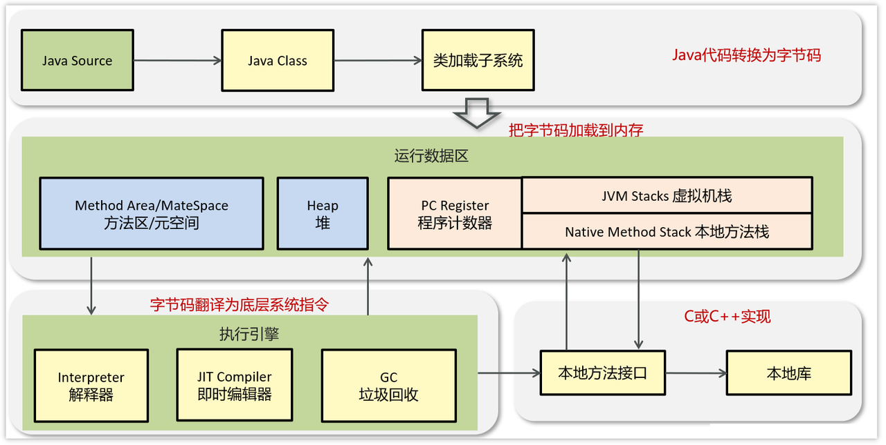

# 面试要点

## Java基础

### 1. equals() 和 == 的区别？如何正确重写 equals() 和 hashCode() 方法？为什么需要同时重写？

#### == 和 equals() 的区别
- **== 操作符**：对于基本数据类型比较值，对于引用类型比较内存地址
- **equals() 方法**：Object类默认实现是比较引用，String等类重写后比较内容

#### 正确重写的五个原则
1. **自反性**：x.equals(x) 必须返回 true
2. **对称性**：x.equals(y) 和 y.equals(x) 结果相同
3. **传递性**：如果 x.equals(y) 且 y.equals(z)，则 x.equals(z)
4. **一致性**：多次调用结果一致
5. **非空性**：x.equals(null) 返回 false

#### 为什么要同时重写？
因为HashMap/HashSet的工作机制：先用hashCode()确定存储位置，再用equals()处理哈希冲突。如果不同时重写会导致相等对象无法在HashMap中正确查找。Java约定：如果两个对象equals()返回true，它们的hashCode()必须相同。

- equals 方法判断两个对象是相等的，那这两个对象的 hashCode 值也要相等。
- 两个对象有相同的 hashCode 值，他们也不一定是相等的（哈希碰撞）。

| 问题                 | 结论               |
| ------------------ | ---------------- |
| `equals()` 比较什么？   | 值是否相等            |
| `hashCode()` 用来干嘛？ | 快速查找桶            |
| 为什么要同时重写？          | 保证集合类正常工作，避免逻辑错误 |
| 不重写会怎样？            | 数据重复、查找失败、逻辑异常   |

### 2. 接口和抽象类的区别？何时用接口？何时用抽象类？

#### 主要区别
- **继承关系**：接口支持多实现，抽象类只能单继承
- **方法**：接口Java8前只有抽象方法，抽象类可以有具体实现
- **成员变量**：接口只能有常量，抽象类可以有各种成员变量
- **构造方法**：接口不能有，抽象类可以有

#### 使用场景
- **接口**：定义契约规范、实现多重"继承"、强调"能做什么"（can-do关系）
- **抽象类**：代码复用、提供部分实现、强调"是什么"（is-a关系）、需要有状态

| 特性       | 接口                | 抽象类            |
| -------- | ----------------- | -------------- |
| 继承关系     | 可实现多个             | 只能继承一个         |
| 方法实现     | 抽象方法+默认方法（Java8+） | 抽象方法+具体方法      |
| 成员变量     | 只能有常量             | 可以有各种类型变量      |
| 构造方法     | 不能有               | 可以有            |
| 关系类型     | can-do（能做什么）      | is-a（是什么）      |
| 使用场景     | 定义规范、多重继承         | 代码复用、部分实现、有状态  |

### 3. String vs StringBuffer vs StringBuilder

#### 特性对比
- **String**：不可变，线程安全，频繁操作性能差，会创建大量临时对象
- **StringBuffer**：可变，线程安全（synchronized），适合多线程环境
- **StringBuilder**：可变，线程不安全，单线程环境性能最佳

#### 选择原则
- **String**：字符串很少改变的情况
- **StringBuffer**：多线程环境下的字符串频繁操作
- **StringBuilder**：单线程环境下的字符串频繁操作

| 特性     | String  | StringBuffer | StringBuilder |
| ------ | ------- | ------------ | ------------- |
| 可变性    | 不可变     | 可变           | 可变            |
| 线程安全   | 安全（不可变） | 安全（同步）       | 不安全           |
| 性能     | 频繁操作差   | 中等           | 最佳            |
| 内存使用   | 创建新对象   | 内部缓冲区        | 内部缓冲区         |
| 适用场景   | 少量操作    | 多线程字符串操作     | 单线程字符串操作      |

### 4. 自动装箱与拆箱原理及潜在问题

#### 基本概念
- **自动装箱**：基本类型自动转换为包装类型（如int→Integer）
- **自动拆箱**：包装类型自动转换为基本类型
- **实现原理**：编译器自动插入valueOf()和xxxValue()方法调用

#### 四大潜在问题
1. **缓存范围问题**：-128到127范围内的Integer对象会被缓存复用，超出范围会创建新对象
2. **性能问题**：频繁装箱拆箱会影响性能，特别是在循环中
3. **NullPointerException**：null的包装类型拆箱时会抛NPE
4. **三目运算符陷阱**：类型不一致时编译器会自动拆箱，可能导致NPE

#### 最佳实践
尽量使用基本类型、比较包装类型用equals()、避免循环中频繁装箱拆箱、注意缓存范围、小心null值拆箱

| 问题类型     | 具体表现                   | 解决方案           |
| -------- | ---------------------- | -------------- |
| 缓存范围问题   | -128~127外用==比较结果为false | 用equals()比较     |
| 性能问题     | 循环中频繁装箱拆箱              | 使用基本类型         |
| NPE问题    | null包装类型拆箱时抛异常         | 判空或使用基本类型      |
| 三目运算符陷阱  | 类型不一致导致自动拆箱NPE        | 保证两边类型一致       |
| 最佳实践     | 什么时候用包装类型？             | 需要null值或泛型时才用  |

### 5. BIO、NIO、AIO的区别？

#### I/O模型核心概念

**BIO、NIO、AIO三种I/O模型对比：**

| 特性         | BIO（同步阻塞）        | NIO（同步非阻塞）         | AIO（异步非阻塞）         |
| ---------- | --------------- | ------------------ | ------------------ |
| 全称         | Blocking I/O    | Non-blocking I/O   | Asynchronous I/O   |
| 阻塞性        | 阻塞             | 非阻塞               | 异步               |
| 同步性        | 同步             | 同步               | 异步               |
| 线程模型       | 一线程一连接          | 一线程处理多连接           | 一线程处理多连接           |
| API复杂度     | 简单             | 复杂               | 复杂               |
| 适用场景       | 连接数少、并发度低       | 连接数多、并发度高          | 连接数多、并发度高          |

#### 工作原理对比

| I/O模型 | 工作原理                      | 线程利用率 | 内存消耗 | CPU利用率 |
| ----- | ------------------------- | ----- | ---- | ----- |
| BIO   | 每个连接创建一个线程，线程阻塞等待I/O完成    | 低     | 高    | 低     |
| NIO   | 一个线程通过Selector轮询多个Channel | 高     | 中    | 高     |
| AIO   | 操作系统完成I/O后通知应用程序         | 高     | 低    | 中     |

#### 性能特性对比

| 性能指标   | BIO          | NIO            | AIO            |
| ------ | ------------ | -------------- | -------------- |
| 吞吐量    | 低（受线程数限制）    | 高              | 高              |
| 延迟     | 中等           | 低              | 最低             |
| 内存占用   | 高（大量线程栈）     | 中等             | 低              |
| CPU消耗  | 低（大量阻塞等待）    | 中等             | 低              |
| 可扩展性   | 差            | 好              | 最好             |

#### 编程模型对比

| 模型  | 编程模型                  | 事件处理       | 错误处理     | 学习成本 |
| --- | --------------------- | ---------- | -------- | ---- |
| BIO | 顺序编程，符合人类思维           | 同步处理       | try-catch | 低    |
| NIO | 事件驱动，需要状态机管理          | 事件循环       | 复杂       | 高    |
| AIO | 回调驱动，异步编程             | 回调函数       | 回调地狱     | 高    |

#### 实际应用场景选择

| 应用场景        | 推荐模型 | 选择理由                      | 注意事项              |
| ----------- | ---- | ------------------------- | ----------------- |
| Web服务器      | NIO  | 大量连接，请求处理时间短              | 需要处理粘包拆包问题        |
| 文件服务器       | BIO  | 文件I/O多为顺序操作，编程简单          | 控制并发连接数           |
| 即时通讯        | NIO  | 长连接，需要高并发                | 心跳检测，连接管理         |
| 游戏服务器       | AIO  | 实时性要求高，性能敏感              | 回调处理复杂            |
| 数据库连接池      | BIO  | 连接数可控，操作多为短连接             | 连接复用              |
| 大数据传输       | AIO  | 大文件传输，异步处理效率高             | 需要处理传输中断          |

#### 技术选型决策

| 考虑因素       | 权重  | BIO评分 | NIO评分 | AIO评分 | 说明              |
| ---------- | --- | ----- | ----- | ----- | --------------- |
| 开发难度（20%）  | 20% | 9     | 6     | 5     | BIO最简单          |
| 性能表现（30%）  | 30% | 4     | 8     | 9     | AIO性能最好         |
| 并发能力（25%）  | 25% | 3     | 8     | 9     | NIO/AIO并发能力强    |
| 稳定性（15%）   | 15% | 9     | 7     | 6     | BIO最稳定          |
| 生态成熟度（10%） | 10% | 10    | 8     | 5     | BIO生态最成熟        |
| **加权总分**    |     | **5.9** | **7.3** | **7.4** | AIO综合评分略高      |

### 6. Select、Poll、Epoll的区别

**I/O多路复用机制对比：**

| 特性         | Select           | Poll             | Epoll            |
| ---------- | ---------------- | ---------------- | ---------------- |
| 操作系统支持     | 几乎所有Unix/Linux   | Unix/Linux       | 仅Linux          |
| 文件描述符限制    | 有限制（通常1024）      | 无硬性限制            | 无限制              |
| 数据结构       | bitmap位图         | 链表               | 红黑树+双链表          |
| 时间复杂度      | O(n)             | O(n)             | O(1)             |
| 内存拷贝       | 每次调用都要拷贝         | 每次调用都要拷贝         | 使用mmap减少拷贝       |
| 工作模式       | 水平触发             | 水平触发             | 水平触发+边缘触发        |

**工作原理对比：**

| 机制     | 工作流程                      | 优点              | 缺点              |
| ------ | ------------------------- | --------------- | --------------- |
| Select | 轮询所有fd，返回就绪的fd集合          | 跨平台兼容性好         | 性能差、fd数量限制      |
| Poll   | 与select类似，但使用链表存储fd      | 没有fd数量限制        | 性能仍然较差          |
| Epoll  | 基于事件通知，只返回活跃的fd         | 高性能、支持大量连接      | 仅支持Linux        |

- fd File Descriptor（文件描述符）是操作系统对“打开资源”的标识，IO 多路复用技术（如 epoll）让我们能高效管理多个 fd，从而构建高并发服务器。

### 7. Stream流的特性
- 函数式编程：支持lambda表达式和函数式接口
- 惰性求值：中间操作不立即执行，终端操作才执行
- 并行处理：支持并行流提高性能
- 不可变性：不修改原数据，返回新流

## 集合

### 1. HashMap 的实现原理？JDK 1.7和1.8的区别？hash()方法的作用？如何处理哈希冲突？

#### 实现原理
HashMap基于数组+链表/红黑树的数据结构，通过hash算法将key映射到数组索引位置。

#### JDK 1.7 vs 1.8 主要区别
- **数据结构**：1.7是数组+链表，1.8是数组+链表+红黑树
- **插入方式**：1.7头插法（并发环境可能死循环），1.8尾插法
- **扩容时机**：1.7先扩容再插入，1.8先插入再扩容
- **hash算法**：1.8优化了hash算法，减少碰撞

#### hash()方法作用
将key的hashCode进行二次hash，让hash值更均匀分布，减少哈希冲突。

#### 哈希冲突处理
1. **链表法**：相同hash值的元素用链表连接
2. **红黑树优化**：当链表长度≥8且数组长度≥64时，链表转红黑树。当红黑树节点数小于6时，转回链表
3. **扩容机制**：负载因子超过0.75时，数组容量翻倍

| 版本对比   | JDK 1.7      | JDK 1.8           |
| ------ | ------------ | ----------------- |
| 数据结构   | 数组+链表        | 数组+链表+红黑树        |
| 插入方式   | 头插法          | 尾插法               |
| 链表转树   | 无            | 链表长度≥8且数组长度≥64时  |
| 扩容时机   | 先扩容再插入       | 先插入再扩容            |
| 并发问题   | 可能死循环        | 避免了死循环            |

### 2. ConcurrentHashMap 如何实现线程安全？

#### JDK 1.7：分段锁机制
- **Segment数组**：将HashMap分成多个段，每个段有独立的锁（ReentrantLock）
- **锁粒度**：只锁需要操作的段，其他段可并发访问
- **并发度**：默认16个段，最多支持16个线程同时写入

#### JDK 1.8：CAS + synchronized
- **取消Segment**：直接在Node节点上加锁
- **CAS操作**：数组元素为空时用CAS插入
- **synchronized**：发生冲突时锁住链表/红黑树的头节点
- **更细粒度**：锁的是具体的hash桶，并发性能更好

| 版本   | JDK 1.7        | JDK 1.8              |
| ---- | -------------- | -------------------- |
| 锁机制  | 分段锁（Segment）   | CAS + synchronized   |
| 锁粒度  | 段级别            | 节点级别                 |
| 并发度  | 最多16个写线程       | 理论上无限制               |
| 内存占用 | Segment额外开销    | 更少的内存开销              |
| 性能   | 读写分离，性能较好      | 读写性能都更优              |

### 3. ArrayList 和 LinkedList 的底层实现、时间复杂度？

#### 底层实现
- **ArrayList**：动态数组，连续内存空间存储
- **LinkedList**：双向链表，节点包含data、prev、next指针

#### 时间复杂度对比

| 操作   | ArrayList | LinkedList |
| ---- | --------- | ---------- |
| 随机访问 | O(1)      | O(n)       |
| 头部插入 | O(n)      | O(1)       |
| 尾部插入 | O(1)      | O(1)       |
| 中间插入 | O(n)      | O(1)*      |
| 头部删除 | O(n)      | O(1)       |
| 尾部删除 | O(1)      | O(1)       |
| 中间删除 | O(n)      | O(1)*      |

*注：LinkedList中间插入/删除的O(1)是指已知节点位置的情况，查找节点仍需O(n)

#### 使用场景
- **ArrayList**：频繁随机访问、少量插入删除
- **LinkedList**：频繁插入删除、顺序访问

### 4. Iterator 和 ListIterator 的区别？fail-fast 和 fail-safe 机制？

#### Iterator vs ListIterator

| 特性     | Iterator        | ListIterator     |
| ------ | --------------- | ---------------- |
| 适用范围   | 所有Collection    | 只适用于List        |
| 遍历方向   | 单向（向前）          | 双向（前进+后退）       |
| 操作能力   | 只能删除            | 增删改查都支持          |
| 索引访问   | 不支持             | 支持获取当前索引         |
| 起始位置   | 只能从头开始          | 可以从任意位置开始        |

#### fail-fast vs fail-safe

**fail-fast（快速失败）：**
- **机制**：检测到并发修改立即抛ConcurrentModificationException
- **实现**：通过modCount计数器检测结构性修改
- **代表**：ArrayList、HashMap的迭代器

**fail-safe（安全失败）：**
- **机制**：在副本上迭代，不会抛异常但可能读到过期数据
- **实现**：复制一份数据进行迭代
- **代表**：CopyOnWriteArrayList、ConcurrentHashMap

| 机制        | fail-fast | fail-safe    |
| --------- | --------- | ------------ |
| 异常处理      | 立即抛异常     | 不抛异常         |
| 数据一致性     | 强一致性      | 可能读到过期数据     |
| 性能开销      | 低         | 高（需要复制）      |
| 内存使用      | 少         | 多（额外副本）      |
| 适用场景      | 单线程环境     | 多线程环境        |

### 5. 如何保证集合的线程安全？

#### 五种解决方案

**1. Collections.synchronizedXXX()**
- **原理**：为每个方法加synchronized关键字
- **缺点**：性能较差，复合操作仍不安全

**2. Vector、Hashtable**
- **原理**：方法级别的synchronized
- **缺点**：过时的重量级同步，性能差

**3. CopyOnWriteArrayList**
- **原理**：写时复制，读写分离
- **适用**：读多写少的场景

**4. ConcurrentHashMap**
- **原理**：分段锁/CAS+synchronized
- **优点**：高并发性能好

**5. 外部加锁**
- **原理**：使用外部锁控制访问
- **灵活性**：可控制锁的粒度

| 方案                      | 性能  | 适用场景      | 缺点           |
| ----------------------- | --- | --------- | ------------ |
| Collections.synchronized | 差   | 简单场景      | 复合操作不安全      |
| Vector/Hashtable        | 差   | 遗留代码      | 重量级同步        |
| CopyOnWriteArrayList    | 读快  | 读多写少      | 写操作开销大       |
| ConcurrentHashMap       | 优   | 高并发Map操作  | 只适用于Map      |
| 外部加锁                    | 中   | 复杂业务逻辑    | 需要小心死锁       |

### 6. Comparable 和 Comparator 接口的区别？

#### 核心区别
- **Comparable**：内部比较器，对象自己定义排序规则
- **Comparator**：外部比较器，第三方定义排序规则

#### 详细对比

**Comparable接口：**
- **方法**：compareTo(T o)
- **实现位置**：在被比较的类内部实现
- **排序规则**：固定的，类的自然排序
- **使用方式**：Collections.sort(list)

**Comparator接口：**
- **方法**：compare(T o1, T o2)
- **实现位置**：可以在任何地方实现
- **排序规则**：灵活的，可以有多种排序方式
- **使用方式**：Collections.sort(list, comparator)

| 特性     | Comparable        | Comparator         |
| ------ | ----------------- | ------------------ |
| 位置     | 类内部实现             | 外部实现               |
| 方法     | compareTo()       | compare()          |
| 排序规则   | 单一固定              | 多样化灵活              |
| 修改成本   | 需要修改原类            | 不需要修改原类            |
| 使用场景   | 类有明确的自然排序         | 需要多种排序方式或无法修改原类    |
| 实现数量   | 一个类只能有一种          | 可以有多个不同的实现         |

## 多线程

### 1. 进程和线程的区别？创建线程的几种方式？哪种更推荐？

**进程 vs 线程：**
- **进程**：操作系统资源分配的基本单位，拥有独立的内存空间
  - 每个进程有独立的地址空间（内存、堆、栈、数据段等）
- **线程**：CPU 调度和执行的最小单位，同一进程内的线程共享内存空间
  - 同一进程内的线程共享进程的内存空间（堆、方法区等），但每个线程有自己的程序计数器、栈空间和局部变量表

| 特性     | 进程           | 线程         |
| ------ | ------------ | ---------- |
| 资源占用   | 独立内存空间       | 共享进程内存空间   |
| 创建开销   | 大            | 小          |
| 通信方式   | IPC（管道、消息队列） | 共享内存、同步机制  |
| 崩溃影响   | 不影响其他进程      | 可能影响整个进程   |
| 切换开销   | 大            | 小          |

- 线程切换比进程切换快是因为**线程共享同一进程的地址空间和资源**，**线程切换时只需切换堆栈和程序计数器等少量信息，而不需要切换地址空间，避免了进程切换时需要切换内存映射表等大量资源的开销**，从而节省了时间和系统资源。**进程切换时需要切换内存映射表等大量资源的开销。**

**创建线程的方式：**

| 方式               | 特点                | 推荐度 | 使用场景           |
| ---------------- | ----------------- | --- | -------------- |
| 继承Thread类        | 简单，但Java单继承限制     | ⭐⭐  | 简单场景，不推荐       |
| 实现Runnable接口     | 可多继承，推荐          | ⭐⭐⭐ | 一般异步任务         |
| 实现Callable+FutureTask | 有返回值，可抛异常        | ⭐⭐⭐ | 需要返回结果的任务      |
| 线程池              | 复用线程，性能好，资源可控    | ⭐⭐⭐⭐⭐ | 生产环境，高并发场景     |

**最推荐**：线程池方式，因为可以避免频繁创建销毁线程的开销，更好地控制并发数量。

**操作系统调度器负责线程切换：**
- 使用时间片轮转算法（分配CPU时间片）
- Java线程调度由 OS 决定（非 Java 自己控制）
- 优先级机制：Thread.setPriority() 是建议，不保证生效。

### 2. sleep(), wait(), yield(), join() 方法的区别？

| 方法      | 所属类      | 锁状态  | 使用场景        | 唤醒方式           |
| ------- | -------- | ---- | ----------- | -------------- |
| sleep() | Thread   | 不释放锁 | 暂停指定时间      | 时间到自动唤醒        |
| wait()  | Object   | 释放锁  | 等待条件满足      | notify/notifyAll |
| yield() | Thread   | 不释放锁 | 让出CPU给同优先级线程 | 立即重新参与调度       |
| join()  | Thread   | 不释放锁 | 等待线程执行完毕    | 目标线程执行完毕       |

**核心区别：**
- **sleep()和wait()的最大区别**：sleep不释放锁，wait释放锁
- **yield()作用**：暂停当前线程，让同优先级线程有机会执行，但实际是否让出 CPU 要看调度器。
- **join()用途**：主线程等待子线程执行完毕后再继续

### 3. 上下文切换是什么？开销在哪里？

**上下文切换**：CPU从一个线程切换到另一个线程时，需要保存当前线程状态并加载新线程状态的过程。

**开销构成：**
1. **保存现场**：寄存器、程序计数器、栈指针等
2. **加载新现场**：新线程的执行环境
3. **内存缓存失效**：CPU缓存可能失效，需要重新加载
4. **内核态切换**：用户态到内核态的切换开销

| 开销类型   | 具体内容           | 影响程度 |
| ------ | -------------- | ---- |
| 寄存器保存  | CPU寄存器状态保存/恢复  | 中等   |
| 内存访问   | 栈、堆内存访问模式变化   | 高    |
| 缓存失效   | CPU缓存、TLB失效    | 高    |
| 系统调用   | 用户态/内核态切换     | 中等   |

**减少上下文切换的方法：**
- 减少线程数量：使用线程池复用线程
- 使用无锁并发结构：如 ConcurrentHashMap、CAS
- 减少共享资源：降低锁竞争
- 使用协程

### 4. 什么是线程安全？如何理解原子性、可见性、有序性？

**线程安全**：多个线程同时访问共享资源时，不会产生数据不一致或其他非预期的结果。

**并发编程三大特性：**

| 特性   | 定义                   | 问题表现             | 解决方案              |
| ---- | -------------------- | ---------------- | ----------------- |
| 原子性  | 操作不可被中断，要么全部成功要么全部失败 | 数据不一致            | synchronized、CAS  |
| 可见性  | 一个线程修改共享变量，其他线程能立即看到 | 读取到过期数据          | volatile、synchronized |
| 有序性  | 程序执行顺序与代码顺序一致        | 指令重排序导致逻辑错误      | volatile、synchronized |

### 5. synchronized 关键字的原理？使用方式？锁升级过程？

**使用方式：**
- **修饰实例方法**：锁的是当前实例对象
- **修饰静态方法**：锁的是Class对象
- **修饰代码块**：锁的是指定对象

**锁升级过程（JDK1.6+）：**

| 锁状态   | 特点          | 适用场景       | 性能  |
| ----- | ----------- | ---------- | --- |
| 无锁    | 没有锁竞争       | 单线程访问      | 最高  |
| 偏向锁   | 偏向第一个获得锁的线程 | 基本没有竞争     | 高   |
| 轻量级锁  | CAS自旋获取锁    | 竞争不激烈，持锁时间短 | 中等  |
| 重量级锁  | 操作系统互斥锁     | 竞争激烈，持锁时间长  | 低   |

**升级路径**：无锁 → 偏向锁 → 轻量级锁 → 重量级锁（不可逆）

### 6. volatile 关键字的语义？原理？能保证原子性吗？适用场景？

**volatile的两大语义：**
1. **保证可见性**：修改立即刷新到主内存，读取直接从主内存读
2. **保证有序性**：禁止指令重排序

**实现原理：**
- **内存屏障**：编译器在volatile变量前后插入内存屏障指令
- **缓存一致性协议**：MESI协议确保缓存一致性

**不能保证原子性**：volatile不能保证复合操作的原子性，如 i++ 操作。

| 特性   | volatile | synchronized |
| ---- | -------- | ------------ |
| 原子性  | ❌        | ✅            |
| 可见性  | ✅        | ✅            |
| 有序性  | ✅        | ✅            |
| 阻塞性  | 不阻塞      | 可能阻塞         |
| 性能   | 高        | 相对较低         |

**适用场景：**
- 状态标记（如停止标志）
- 双重检查锁定模式
- 单例模式中的实例变量

### 7. synchronized 和 volatile 的区别？

| 对比维度   | synchronized | volatile   |
| ------ | ------------ | ---------- |
| 作用对象   | 方法、代码块       | 变量         |
| 原子性    | 保证           | 不保证        |
| 可见性    | 保证           | 保证         |
| 有序性    | 保证           | 保证         |
| 阻塞特性   | 可能阻塞         | 不阻塞        |
| 锁机制    | 互斥锁          | 无锁         |
| 性能开销   | 较高           | 较低         |
| 适用场景   | 复合操作、临界区     | 状态标记、简单赋值  |

### 8. CAS 操作的原理？Atomic类实现？ABA问题及解决方案？

**CAS（Compare-And-Swap）原理：**
比较内存位置的值与期望值，如果相同则更新为新值，整个操作是原子的。

**三个操作数：**
- **内存位置V**：要更新的变量
- **预期值A**：期望的当前值  
- **新值B**：要设置的新值

**Atomic类实现：**
基于CAS + volatile，通过无锁算法实现线程安全。

**ABA问题：**
值从A变成B再变回A，CAS检测不到中间的变化过程。

| 问题      | 表现                 | 解决方案                    |
| ------- | ------------------ | ----------------------- |
| ABA问题   | 值变化后又变回原值，CAS误判为未变化 | AtomicStampedReference 引入了版本戳 |
| 性能问题    | 高竞争时自旋消耗CPU        | 结合synchronized        |
| 只能保证单变量 | 多个变量的原子性无法保证       | AtomicReference包装对象    |

### 9. ThreadLocal 的原理？使用场景？内存泄漏问题及如何避免？

**原理：**
每个线程都有一个ThreadLocalMap，以ThreadLocal为key存储线程私有数据。

**数据结构：**
Thread → ThreadLocalMap → Entry(ThreadLocal, Value)

**使用场景：**
- **数据库连接管理**：每个线程独立的连接
- **用户会话信息**：Web请求中的用户信息
- **数据格式化**：SimpleDateFormat等非线程安全类

**内存泄漏问题：**

| 问题原因          | 后果      | 解决方案              |
| ------------- | ------- | ----------------- |
| ThreadLocal被回收 | key为null | 手动调用remove()      |
| 线程长期存活        | value无法回收 | 使用完毕立即remove()    |
| 强引用链          | 整个对象无法回收 | 避免在线程池中使用静态ThreadLocal |

**最佳实践：**
1. 使用完毕后立即调用 `remove()`
2. 使用 `try-finally` 确保清理
3. 避免在线程池中使用静态ThreadLocal

### 10. AQS底层和他的一些实现？
**核心思想：**
- 维护一个**共享资源的状态（state）**
- 使用**一个 FIFO 等待队列（CLH 队列）**来管理线程的访问
- 提供**模板方法**让子类实现同步器逻辑

**核心组成：**
- `state` 变量：
  - 是一个 `volatile int`，表示同步资源的状态（例如：锁是否被占用、计数器数量等）
  - 子类通过 `getState()`、`setState()`、`compareAndSetState()` 来操作它
- CLH 同步队列：
  - AQS 使用一个 **双向链表队列（CLH队列）** 保存等待锁的线程 
    - CLH 队列提供了有序、公平、高效的线程管理能力，能很好地支持 AQS 的可扩展、高性能并发模型，是实现 Java 锁的理想选择。
  - 每个线程抢锁失败后，构造成一个 `Node` 挂在队列尾部，阻塞等待

**独占模式与共享模式：**
- 独占模式（如：ReentrantLock）
  - 一个线程持有资源，其它线程必须等待。
  - 核心方法（子类可重写）：
* `tryAcquire(int)`
* `tryRelease(int)`

- 共享模式（如：Semaphore、CountDownLatch）
  - 多个线程可共享资源。
  - 核心方法（子类可重写）：
* `tryAcquireShared(int)`
* `tryReleaseShared(int)`

**AQS 的主要实现类：**

| 实现类                      | 描述                  |
| ------------------------ | ------------------- |
| `ReentrantLock`          | 可重入独占锁，支持公平/非公平     |
| `ReentrantReadWriteLock` | 支持读写分离锁，读共享，写独占     |
| `CountDownLatch`         | 倒计时器，等到计数归零再执行      |
| `Semaphore`              | 控制并发数量              |
| `CyclicBarrier`          | 多线程 barrier，同步屏障    |
| `FutureTask`             | 支持异步计算的任务容器（如线程池结果） |

**AQS 的优点：**
* **高可扩展性**：只需重写模板方法即可实现自定义同步器
* **统一阻塞机制**：统一使用 `LockSupport` 管理线程挂起与唤醒
* **性能优化**：使用自旋、CAS、懒中断、队列策略来减少资源竞争

## 数据库

### 1. SQL基础语法（DDL, DML, DQL, DCL）？常用函数？

**SQL语言分类：**

| 类型  | 全称                      | 作用       | 常用语句                     |
| --- | ----------------------- | -------- | ------------------------ |
| DDL | Data Definition Language | 数据定义语言   | CREATE、ALTER、DROP        |
| DML | Data Manipulation Language | 数据操作语言   | INSERT、UPDATE、DELETE    |
| DQL | Data Query Language      | 数据查询语言   | SELECT                   |
| DCL | Data Control Language    | 数据控制语言   | GRANT、REVOKE、COMMIT、ROLLBACK |

**常用函数分类：**

| 函数类型   | 常用函数                               | 作用                 |
| ------ | ---------------------------------- | ------------------ |
| 聚合函数   | COUNT、SUM、AVG、MAX、MIN               | 统计计算               |
| 字符串函数  | CONCAT、SUBSTRING、LENGTH、UPPER、LOWER | 字符串处理              |
| 日期函数   | NOW、CURDATE、DATE_FORMAT、DATEDIFF   | 日期时间处理             |
| 数学函数   | ROUND、CEIL、FLOOR、ABS、MOD          | 数值计算               |
| 条件函数   | IF、CASE WHEN、IFNULL、NULLIF        | 条件判断               |

### 2. MySQL核心区别（事务、锁、外键、索引结构）？

**存储引擎对比：**

| 特性     | InnoDB         | MyISAM    | Memory   |
| ------ | -------------- | --------- | -------- |
| 事务支持   | ✅支持ACID        | ❌不支持      | ❌不支持     |
| 锁级别    | 行级锁            | 表级锁       | 表级锁      |
| 外键支持   | ✅支持            | ❌不支持      | ❌不支持     |
| 索引结构   | B+树聚集索引        | B+树非聚集索引  | Hash索引   |
| 崩溃恢复   | ✅支持            | ❌不支持      | ❌不支持     |
| 适用场景   | 事务处理、高并发写入     | 只读、数据仓库   | 临时表、缓存   |

### 3. 索引：什么是索引？为什么能提高查询效率？索引的优缺点？

**索引定义：**
索引是数据库表中一个或多个列的值排序的数据结构，类似书的目录，用于快速定位数据。

**提高效率原理：**
- **减少扫描行数**：从全表扫描变为索引查找
- **有序存储**：B+树结构保证数据有序，支持范围查询
- **减少I/O操作**：索引通常比数据小，能缓存在内存中（MySQL的Buffer Pool）

**索引优缺点：**

| 优点           | 缺点              |
| ------------ | --------------- |
| 大幅提高查询速度     | 占用额外存储空间        |
| 加速表连接        | 降低写操作性能（增删改）    |
| 减少分组和排序时间    | 维护索引需要额外开销      |
| 唯一索引保证数据唯一性  | 过多索引影响优化器选择     |

### 4. B+树索引结构？为什么MySQL使用B+树而不是B树或哈希表？

**B+树特点：**
- **所有数据在叶子节点**：非叶子节点只存储键值
- **叶子节点连接**：叶子节点通过指针连接，支持范围查询
- **更高的扇出比**：非叶子节点可存储更多键值

**选择B+树的原因：**

| 对比项    | B+树        | B树         | 哈希表     |
| ------ | --------- | --------- | ------- |
| 范围查询   | ✅优秀       | ❌较差       | ❌不支持    |
| 顺序访问   | ✅优秀       | ❌一般       | ❌不支持    |
| 磁盘I/O  | ✅少        | ❌多        | ✅少      |
| 内存利用率  | ✅高        | ❌低        | ✅高      |
| 等值查询   | ✅快        | ✅快        | ✅最快     |
| 数据有序性  | ✅有序       | ✅有序       | ❌无序     |

### 5. 聚集索引和非聚集索引的区别？InnoDB的主键索引结构？

**聚集索引 vs 非聚集索引：**

| 特性       | 聚集索引（主键索引）    | 非聚集索引（辅助索引）      |
| -------- | ------------- | ---------------- |
| 数据存储     | 叶子节点存储完整行数据   | 叶子节点存储主键值        |
| 数据排序     | 数据按索引键物理排序    | 数据排序与索引无关        |
| 查询性能     | 一次查询获取所有数据    | 可能需要回表查询         |
| 每表数量     | 最多一个          | 可以有多个            |
| 存储开销     | 无额外开销         | 需要额外存储空间         |

**InnoDB主键索引结构：**
- **主键索引**：聚集索引，叶子节点存储完整行数据
- **辅助索引**：非聚集索引，叶子节点存储主键值
- **回表查询**：通过辅助索引查询时，需要根据主键值再查主键索引

### 6. 索引类型分类？

**按功能分类：**

| 索引类型   | 特点                 | 使用场景         | 示例               |
| ------ | ------------------ | ------------ | ---------------- |
| 主键索引   | 唯一+非空，自动创建聚集索引    | 主键字段         | PRIMARY KEY      |
| 唯一索引   | 值唯一，允许一个NULL      | 身份证号、邮箱      | UNIQUE           |
| 普通索引   | 无唯一性限制，提高查询速度     | 查询频繁的字段      | INDEX            |
| 组合索引   | 多列联合索引，遵循最左前缀原则   | 多条件查询        | (name, age, city) |
| 全文索引   | 文本关键词搜索           | 文章内容搜索       | FULLTEXT         |

### 7. 索引失效的常见场景？

**索引失效情况：**

| 失效场景         | 示例                          | 原因                |
| ------------ | --------------------------- | ----------------- |
| 函数操作         | WHERE YEAR(date) = 2023    | 对索引列使用函数          |
| 隐式类型转换       | WHERE age = '18'           | 数据类型不匹配           |
| LIKE以%开头     | WHERE name LIKE '%张'       | 无法利用索引的有序性        |
| OR条件         | WHERE a = 1 OR b = 2       | 其中一个条件没有索引        |
| 组合索引不满足最左前缀  | INDEX(a,b,c) WHERE b = 1   | 违反最左前缀原则          |
| 不等于操作        | WHERE age != 18            | 范围太大，优化器选择全表扫描    |
| IS NULL判断    | WHERE name IS NULL         | NULL值不存储在索引中      |

### 8. EXPLAIN命令的作用？关键字段的含义？

**EXPLAIN作用：**
分析SQL语句执行计划，帮助优化查询性能。

**关键字段含义：**

| 字段        | 含义              | 重要值                         |
| --------- | --------------- | --------------------------- |
| type      | 访问类型            | system > const > eq_ref > ref > range > index > ALL |
| key       | 实际使用的索引        | NULL表示未使用索引               |
| rows      | 预估扫描行数          | 数值越小越好                      |
| Extra     | 额外信息            | Using index > Using where > Using filesort |

**type字段详解：**

| type值    | 性能  | 说明          |
| -------- | --- | ----------- |
| system   | 最优  | 表只有一行        |
| const    | 优   | 主键或唯一索引等值查询 |
| eq_ref   | 优   | 主键或唯一索引关联   |
| ref      | 良   | 非唯一索引等值查询   |
| range    | 中   | 范围查询        |
| index    | 差   | 索引全扫描       |
| ALL      | 最差  | 全表扫描        |

### 9. 锁：InnoDB的行锁、间隙锁、临键锁？MVCC的原理？如何解决幻读？

**InnoDB锁类型：**

| 锁类型   | 锁范围                | 作用                | 示例场景           |
| ----- | ------------------ | ----------------- | -------------- |
| 行锁    | 锁定具体的行             | 防止并发修改同一行数据       | UPDATE具体记录     |
| 间隙锁   | 锁定索引记录之间的间隙        | 防止在间隙中插入新记录       | 防止幻读           |
| 临键锁   | 行锁+间隙锁的组合          | 既锁记录又锁间隙          | 范围查询时使用        |
| 意向锁   | 表级锁，表示事务的加锁意图      | 提高表锁检测效率          | 加行锁时自动加意向锁     |

**MVCC（多版本并发控制）原理：**
- **版本链**：每行记录维护多个版本
- **ReadView**：事务开始时创建的一致性视图，在RR的时候，在第一次查询的时候创建一个ReadView并且在事务中复用，在RC的时候，每次读取数据前都会创建一个ReadView
- **undo log**：存储历史版本数据
- **实现隔离**：不同事务看到不同版本的数据

**解决幻读：**
- **快照读**：通过MVCC，读取事务开始时的数据快照
  - 快照读：默认的 SELECT 查询，在事务里读的是事务开始时的快照，不会加锁，也不会被其他事务影响。
- **当前读**：通过临键锁，锁定查询范围防止插入新数据
  - 当前读：会加锁防止别的事务插入/更新你正在看的范围，用来保证一致性或做更新，比如`select .. for update`。

### 10. 事务隔离级别？MySQL默认级别？不同级别解决的问题？

**四大隔离级别：**

| 隔离级别           | 脏读  | 不可重复读 | 幻读  | 实现方式        | 性能  |
| -------------- | --- | ----- | --- | ----------- | --- |
| 读未提交（READ UNCOMMITTED） | ❌   | ❌     | ❌   | 无锁          | 最高  |
| 读已提交（READ COMMITTED）   | ✅   | ❌     | ❌   | 行锁+MVCC     | 高   |
| 可重复读（REPEATABLE READ）  | ✅   | ✅     | 部分解决 | 临键锁+MVCC    | 中   |
| 串行化（SERIALIZABLE）     | ✅   | ✅     | ✅   | 表锁          | 低   |

**MySQL默认隔离级别：**可重复读（REPEATABLE READ）

**问题说明：**
- **脏读**：读到其他事务未提交的数据
- **不可重复读**：同一事务中多次读取同一数据结果不同
- **幻读**：同一事务中多次查询记录数量不同

### 11. 如何优化慢查询？

**优化策略：**

| 优化方向   | 具体方法                    | 效果评估  |
| ------ | ----------------------- | ----- |
| 索引优化   | 添加合适索引、优化索引使用          | ⭐⭐⭐⭐⭐ |
| SQL语句优化 | 避免SELECT *、减少子查询       | ⭐⭐⭐⭐  |
| 分库分表   | 水平/垂直分割减少单表数据量        | ⭐⭐⭐⭐⭐ |
| 读写分离   | 主库写、从库读，减少主库压力        | ⭐⭐⭐⭐  |

**具体优化手段：**

| 方法          | 说明                     | 适用场景        |
| ----------- | ---------------------- | ----------- |
| 添加索引        | 为WHERE、ORDER BY字段添加索引  | 查询频繁的字段     |
| 优化JOIN      | 使用小表驱动大表               | 多表关联查询      |
| 避免函数计算      | 不在WHERE条件中使用函数         | 所有查询        |
| 分页优化        | 使用子查询选中ID+索引代替LIMIT大偏移    | 深度分页查询      |
| 垂直分表        | 将大字段拆分到独立表             | 表字段过多       |
| 水平分表        | 按规则将数据分散到多个表           | 单表数据量过大     |
| 使用缓存        | Redis缓存热点数据            | 读多写少场景      |
| 连接池优化       | 合理设置连接池参数              | 高并发场景       |

### 12. MySQL日志：redo log、undo log、binlog

| 维度   | Redo Log       | Undo Log    | Binlog         |
| ---- | -------------- | ----------- | -------------- |
| 层级   | InnoDB 引擎层     | InnoDB 引擎层  | MySQL Server 层 |
| 性质   | 物理日志           | 逻辑日志        | 逻辑日志           |
| 写入时机 | 写入前先落盘（WAL）    | 修改前生成       | 事务提交时一次写入      |
| 用途   | 崩溃恢复           | 回滚 / MVCC   | 复制 / 备份 / 审计   |
| 格式   | 页修改内容          | 原始值         | 行变化或 SQL 语句    |
| 是否刷盘 | 事务提交时 fsync 刷盘 | 内存日志（非立即刷盘） | 事务提交时 fsync 刷盘 |


## Redis

### 1. Redis是什么？常用数据类型及其底层实现和典型应用场景？

**Redis定义：**
Redis是一个开源的内存数据结构存储系统，可用作数据库、缓存和消息代理。

**常用数据类型：**

| 数据类型        | 底层实现                    | 典型应用场景                    | 常用命令                |
| ----------- | ----------------------- | ------------------------- | ------------------- |
| String      | SDS（简单动态字符串）            | 缓存、计数器、分布式锁               | SET、GET、INCR       |
| Hash        | 压缩列表/哈希表                | 用户信息、商品信息                 | HSET、HGET、HMGET   |
| List        | 压缩列表/双向链表               | 消息队列、最新消息列表               | LPUSH、RPOP、LRANGE |
| Set         | 整数集合/哈希表                | 标签、好友关系、唯一性统计             | SADD、SMEMBERS、SINTER |
| Sorted Set  | 压缩列表/跳跃表                | 排行榜、延时队列                  | ZADD、ZRANGE、ZRANK |
| HyperLogLog | 基数估算算法                  | UV统计、独立访客统计               | PFADD、PFCOUNT      |
| Bitmap      | 位数组                     | 用户签到、在线状态                 | SETBIT、GETBIT、BITCOUNT |
| Geospatial  | Sorted Set + GeoHash    | 地理位置、附近的人                 | GEOADD、GEORADIUS   |
| Stream      | Radix Tree + Listpack  | 消息流、日志收集                  | XADD、XREAD、XGROUP |

### 2. Redis为什么快？

**性能优势分析：**

| 优势        | 具体表现                  | 性能影响    |
| --------- | --------------------- | ------- |
| 内存存储      | 数据存储在内存中，避免磁盘I/O      | ⭐⭐⭐⭐⭐ |
| 单线程模型     | 避免线程切换和锁竞争开销          | ⭐⭐⭐⭐  |
| I/O多路复用   | epoll机制处理并发连接         | ⭐⭐⭐⭐  |
| 高效数据结构    | 针对不同场景优化的数据结构         | ⭐⭐⭐   |
| 简单协议      | RESP协议简单，解析开销小       | ⭐⭐⭐   |

**核心原因：**
- **纯内存操作**：避免磁盘I/O，速度快10000倍
- **单线程避免竞争**：无锁设计，减少上下文切换
- **非阻塞I/O**：高效处理大量并发连接
- 在Redis6.0之后，为了提升更好的性能，在命令回复处理器使用了多线程来处理回复事件，在命令请求处理器中，将命令的转换使用了多线程，增加命令转换速度，在命令执行的时候，依然是单线程

### 3. Redis的持久化机制？优缺点？如何选择？

**两种持久化方式：**

| 特性      | RDB快照           | AOF日志             |
| ------- | --------------- | ----------------- |
| 持久化方式   | 定期生成数据快照        | 记录每个写操作命令         |
| 文件大小    | 紧凑，文件小          | 较大，包含所有操作         |
| 恢复速度    | 快               | 慢                 |
| 数据完整性   | 可能丢失最后一次快照后的数据  | 根据同步策略，丢失较少       |
| 性能影响    | fork子进程时有短暂阻塞   | 持续写入，影响相对较小       |
| 适用场景    | 对数据丢失不敏感的场景     | 对数据完整性要求高的场景      |

**选择策略：**

| 场景           | 推荐方案      | 原因                    |
| ------------ | --------- | --------------------- |
| 缓存场景         | 仅RDB      | 数据可重新计算，性能优先          |
| 重要数据存储       | RDB + AOF | 双重保障，确保数据安全           |
| 高写入量场景       | 仅RDB      | 避免AOF写入影响性能           |
| 数据完整性要求极高的场景 | AOF       | 最大程度保证数据不丢失           |

### 4. Redis的过期键删除策略？

**三种删除策略：**

| 策略     | 触发时机    | 优点       | 缺点         | CPU消耗 | 内存消耗 |
| ------ | ------- | -------- | ---------- | ----- | ---- |
| 定时删除   | 设置定时器   | 内存友好     | CPU消耗大     | 高     | 低    |
| 惰性删除   | 访问时检查   | CPU友好    | 内存不友好      | 低     | 高    |
| 定期删除   | 定期随机抽查  | 平衡CPU和内存 | 可能有漏网之鱼    | 中     | 中    |

**Redis实际策略：** 惰性删除 + 定期删除的组合方式

### 5. 内存淘汰策略？

**8种淘汰策略：**

| 策略              | 作用范围      | 淘汰算法    | 适用场景           |
| --------------- | --------- | ------- | -------------- |
| noeviction      | 无         | 不淘汰     | 内存足够，不希望数据丢失   |
| allkeys-lru     | 所有key     | LRU最近最少使用 | 通用缓存，访问有热点     |
| volatile-lru    | 有过期时间的key | LRU     | 只淘汰临时数据        |
| allkeys-random  | 所有key     | 随机      | 访问模式均匀         |
| volatile-random | 有过期时间的key | 随机      | 临时数据访问均匀       |
| volatile-ttl    | 有过期时间的key | TTL最短优先 | 希望快到期的数据先删除    |
| allkeys-lfu     | 所有key     | LFU最少使用频率 | 访问频率差异明显       |
| volatile-lfu    | 有过期时间的key | LFU     | 临时数据访问频率差异明显   |

**推荐选择：**
- **通用场景**：allkeys-lru（最常用）
- **只缓存场景**：volatile-lru
- **混合数据**：volatile-ttl

### 6. 如何保证Redis的高可用？Redis Cluster的槽分配原理？

**高可用方案：**

| 方案            | 特点                | 优点           | 缺点           | 适用场景     |
| ------------- | ----------------- | ------------ | ------------ | -------- |
| 主从复制          | 一主多从，读写分离         | 简单，读性能好      | 主节点单点故障      | 读多写少     |
| 哨兵模式          | 自动故障转移            | 高可用，自动切换     | 配置复杂         | 中小型应用    |
| Redis Cluster | 分布式，无中心节点         | 高可用+高性能      | 运维复杂         | 大型分布式应用  |

**Redis Cluster槽分配：**
- **总槽数**：16384个槽（0-16383）
- **分配原理**：CRC16(key) % 16384
- **槽分布**：平均分配到各个主节点
- **数据分片**：根据key计算槽位，找到对应节点

| 集群规模   | 节点配置        | 槽分配示例          |
| ------ | ----------- | -------------- |
| 3主3从   | 每主1从       | 0-5460, 5461-10922, 10923-16383 |
| 6主6从   | 每主1从       | 每个主节点约2730个槽    |
| 9主9从   | 每主1从       | 每个主节点约1820个槽    |

### 7. 缓存穿透、缓存击穿、缓存雪崩的概念、原因及解决方案？

**三大缓存问题对比：**

| 问题类型   | 定义                     | 原因分析           | 解决方案                      |
| ------ | ---------------------- | -------------- | ------------------------- |
| 缓存穿透   | 查询不存在的数据，缓存和数据库都没有     | 恶意攻击、业务逻辑错误    | 布隆过滤器、空值缓存、参数校验          |
| 缓存击穿   | 热点数据过期，大量请求同时访问数据库     | 热点key过期        | 互斥锁、热点数据永不过期、提前更新、逻辑过期        |
| 缓存雪崩   | 大量缓存同时过期，数据库压力剧增       | 缓存集中过期、Redis宕机 | 过期时间随机化、熔断降级、多级缓存、集群部署  |

**详细解决方案：**

| 解决方案       | 实现方式                  | 优点           | 缺点           |
| ---------- | --------------------- | ------------ | ------------ |
| 布隆过滤器      | 位数组+多个hash函数          | 内存占用小，查询快    | 存在误判，不支持删除   |
| 空值缓存       | 对空结果设置较短过期时间          | 简单有效         | 占用内存         |
| 互斥锁        | 只允许一个线程查询数据库          | 避免重复查询       | 可能造成阻塞       |
| 熔断降级       | 失败率超过阈值时停止访问          | 保护系统         | 可能影响用户体验     |

### 8. 如何设计一个分布式锁？Watch Dog机制？

**分布式锁实现要点：**

| 要求       | Redis实现方式              | 说明                     |
| -------- | ---------------------- | ---------------------- |
| 互斥性      | SET key value NX EX    | NX确保原子性设置              |
| 防死锁      | 设置过期时间                 | 避免持锁进程崩溃导致死锁           |
| 防误删      | 删除时校验value             | 确保只能删除自己的锁             |
| 可重入      | 记录线程ID和重入次数           | 支持同一线程多次获取锁            |
| 阻塞等待     | 循环尝试获取锁                | 获取失败时等待重试              |

**Watch Dog机制：**

| 特性     | 实现原理              | 作用                 |
| ------ | ----------------- | ------------------ |
| 自动续期   | 定时任务延长锁过期时间       | 防止业务执行时间超过锁过期时间    |
| 续期条件   | 锁仍被当前线程持有         | 避免给其他线程的锁续期        |
| 续期时间   | 通常为锁过期时间的1/3      | 保证在锁过期前完成续期        |
| 停止条件   | 锁被释放或线程结束         | 避免无限续期             |

**方案对比：**

| 实现方案        | 优点              | 缺点                | 适用场景       |
| ----------- | --------------- | ----------------- | ---------- |
| 单Redis节点   | 简单，性能好          | 单点故障              | 对可用性要求不高   |
| Redis集群     | 高可用             | 脑裂时可能出现多个锁        | 一般业务场景     |
| Redlock算法   | 更高的安全性          | 复杂，性能较差           | 对数据一致性要求极高 |
| ZooKeeper   | 强一致性，自动续期       | 性能较差，依赖ZK集群       | 强一致性要求     |

### 9. Redis哨兵的原理？如何实现故障转移？

**Redis哨兵定义：**
Redis Sentinel是Redis官方提供的高可用解决方案，用于监控Redis主从复制集群，并在主节点故障时自动进行故障转移。

**核心功能：**

| 功能       | 描述                    | 作用                | 实现方式              |
| -------- | --------------------- | ----------------- | ----------------- |
| 监控       | 持续监控主从节点的健康状态         | 及时发现节点故障          | 定期发送PING命令        |
| 通知       | 当节点状态发生变化时通知管理员       | 提供故障告警            | 发布订阅机制            |
| 自动故障转移   | 主节点故障时自动选举新的主节点       | 保证服务持续可用          | 选举算法+配置更新        |
| 配置提供     | 为客户端提供当前主节点信息         | 客户端自动连接到正确的主节点    | 服务发现机制            |

**哨兵工作原理：**

| 阶段       | 工作内容                  | 判断条件              | 处理方式              |
| -------- | --------------------- | ----------------- | ----------------- |
| 主观下线     | 单个哨兵认为主节点不可用          | 超过down-after-milliseconds时间未响应 | 标记为SDOWN          |
| 客观下线     | 多个哨兵确认主节点不可用          | 达到quorum数量的哨兵确认主观下线 | 标记为ODOWN并开始故障转移  |
| 领导者选举    | 选出负责故障转移的哨兵           | Raft算法选举         | 获得majority票数的哨兵成为领导者 |
| 故障转移     | 将从节点提升为新的主节点          | 领导者哨兵执行转移流程       | 更新配置并通知所有节点       |

**故障转移详细流程：**

| 步骤  | 操作                     | 目的                | 注意事项              |
| --- | ---------------------- | ----------------- | ----------------- |
| 1   | 从从节点中选择新的主节点           | 选出最适合的节点          | 考虑优先级、复制偏移量、运行ID |
| 2   | 向选中的从节点发送SLAVEOF NO ONE | 将从节点提升为主节点        | 确保命令执行成功          |
| 3   | 向其他从节点发送SLAVEOF命令      | 让其他从节点跟随新主节点      | 更新主从关系            |
| 4   | 更新哨兵配置文件               | 记录新的主节点信息         | 持久化配置变更           |
| 5   | 向客户端发布新主节点信息           | 通知客户端连接新主节点       | 通过发布订阅机制          |

**从节点选择策略：**

| 优先级   | 选择条件                   | 权重  | 说明                  |
| ----- | ---------------------- | --- | ------------------- |
| 第一优先级 | slave-priority最高       | 最高  | 手动设置的优先级            |
| 第二优先级 | 复制偏移量最大                | 高   | 数据最新的从节点            |
| 第三优先级 | 运行ID最小                | 中   | 启动时间最早的从节点          |
| 排除条件  | 主观下线、断线时间过长、INFO_REPL响应异常 | 无   | 不健康的节点不参与选举         |

**哨兵配置示例：**

| 配置项                        | 示例值                          | 说明                  |
| -------------------------- | ---------------------------- | ------------------- |
| sentinel monitor           | mymaster 127.0.0.1 6379 2   | 监控主节点，quorum为2      |
| sentinel down-after-milliseconds | mymaster 30000              | 30秒无响应判定为主观下线       |
| sentinel parallel-syncs    | mymaster 1                   | 故障转移时同时同步的从节点数量     |
| sentinel failover-timeout  | mymaster 180000              | 故障转移超时时间            |
| sentinel auth-pass         | mymaster mypassword          | 连接密码                |

**优缺点对比：**

| 优点              | 缺点              | 适用场景            |
| --------------- | --------------- | --------------- |
| 自动故障转移          | 配置相对复杂          | 中小型应用           |
| 高可用性            | 脑裂问题            | 对可用性要求高的系统      |
| 支持多个从节点         | 数据可能短暂不一致       | 读多写少的业务         |
| 客户端透明           | 需要至少3个哨兵节点      | 单机房部署           |
| 成熟稳定            | 不支持数据分片         | 数据量不是特别大的场景     |

**与其他方案对比：**

| 特性       | Redis哨兵        | Redis Cluster    | 主从复制           |
| -------- | -------------- | ---------------- | -------------- |
| 高可用性     | 自动故障转移         | 自动故障转移           | 手动故障转移         |
| 数据分片     | 不支持            | 支持               | 不支持            |
| 配置复杂度    | 中等             | 高                | 低              |
| 客户端支持    | 需要支持哨兵协议       | 需要支持集群协议         | 标准Redis协议      |
| 适用规模     | 中小型            | 大型               | 小型             |
| 数据一致性    | 最终一致性          | 最终一致性            | 最终一致性          |

**最佳实践：**

| 实践建议          | 具体做法                    | 原因                  |
| ------------- | ----------------------- | ------------------- |
| 奇数个哨兵节点       | 部署3个或5个哨兵              | 避免脑裂，确保能选出领导者       |
| 分布式部署         | 哨兵部署在不同的物理机器上         | 提高容灾能力              |
| 合理设置quorum   | 一般设置为哨兵数量的一半+1        | 平衡误判和可用性            |
| 监控哨兵状态        | 监控哨兵进程和日志             | 确保哨兵本身的可用性          |
| 客户端连接池配置      | 配置哨兵地址而非直接连接Redis     | 实现自动故障转移            |

## JVM



### 1. JVM内存结构？各个区域的作用？

**JVM内存模型：**

| 内存区域 | 线程私有/共享 | 作用 | 存储内容 | 是否会OOM |
|----------|--------------|------|----------|-----------|
| 程序计数器 | 私有 | 记录当前线程执行字节码位置 | 字节码行号指示器 | 否 |
| 虚拟机栈 | 私有 | 存储方法调用的栈帧 | 局部变量、操作数栈、方法返回地址 | 是(StackOverflowError) |
| 本地方法栈 | 私有 | 为native方法服务 | native方法调用栈 | 是 |
| 堆内存 | 共享 | 存储对象实例 | 对象实例、数组 | 是(OutOfMemoryError) |
| 方法区/元空间 | 共享 | 存储类信息、常量、静态变量 | 类元数据、常量池、静态变量 | 是 |
| 直接内存 | 共享 | NIO操作、堆外内存 | DirectByteBuffer等 | 是 |

**堆内存详细结构：**

| 区域 | Java8前 | Java8后 | 作用 | GC频率 |
|------|---------|---------|------|--------|
| 新生代 | Eden + Survivor(S0,S1) | 同左 | 新对象分配 | 频繁 |
| 老年代 | Old Generation | 同左 | 长期存活对象 | 较少 |
| 永久代 | PermGen | 已移除 | 类元数据(Java8前) | 很少 |
| 元空间 | 不存在 | Metaspace | 类元数据(Java8后) | 很少 |

**分代收集策略：**

| 策略 | 原理 | 优势 | 典型场景 |
|------|------|------|----------|
| 新生代 | 大多数对象朝生夕死 | 使用复制算法，效率高 | 频繁创建的临时对象 |
| 老年代 | 对象存活时间长 | 使用标记-清除或标记-整理 | 长期使用的对象 |
| 跨代引用 | 记忆集(Remembered Set) | 避免全堆扫描 | 老年代引用新生代 |

### 2. 垃圾回收算法？各自的优缺点？

**四大垃圾回收算法：**

| 算法 | 原理 | 优点 | 缺点 | 适用场景 |
|------|------|------|------|----------|
| 标记-清除 | 标记垃圾对象，然后清除 | 简单，不需要移动对象 | 产生内存碎片，效率低 | 老年代 |
| 复制算法 | 将存活对象复制到另一块内存 | 效率高，无内存碎片 | 浪费一半内存空间 | 新生代 |
| 标记-整理 | 标记后将存活对象向一端移动 | 无内存碎片，空间利用率高 | 移动对象开销大 | 老年代 |
| 分代收集 | 不同代使用不同算法 | 结合各算法优点 | 实现复杂 | 整个堆内存 |

**算法详细对比：**

| 对比维度 | 标记-清除 | 复制算法 | 标记-整理 | 分代收集 |
|----------|-----------|----------|-----------|----------|
| 时间复杂度 | O(n) | O(存活对象数) | O(n) | 取决于具体算法 |
| 空间复杂度 | 无额外要求 | 需要双倍空间 | 无额外要求 | 根据分代策略 |
| 内存碎片 | 有 | 无 | 无 | 新生代无，老年代可能有 |
| 效率 | 中等 | 高(存活率低时) | 低 | 整体较高 |

**对象分配过程：**

| 步骤 | 操作 | 说明 | 异常情况 |
|------|------|------|----------|
| 1 | Eden区分配 | 新对象优先在Eden区分配 | Eden区满时触发Minor GC |
| 2 | Survivor区 | GC后存活对象进入Survivor | 两个Survivor区交替使用 |
| 3 | 年龄增长 | GC后对象年龄+1 | 默认15岁进入老年代 |
| 4 | 老年代 | 长期存活或大对象进入老年代 | 老年代满时触发Major GC |
| 5 | 晋升失败 | 老年代空间不足 | 触发Full GC |

### 3. 常见垃圾回收器？特点和使用场景？

**垃圾回收器发展历程：**

| 回收器 | 发布版本 | 类型 | 特点 | 适用场景 | 停顿时间 |
|--------|----------|------|------|----------|----------|
| Serial | JDK1.3+ | 串行 | 单线程，简单稳定 | 小型应用、客户端 | 较长 |
| ParNew | JDK1.4+ | 并行 | Serial的多线程版本 | 配合CMS使用 | 中等 |
| Parallel Scavenge | JDK1.4+ | 并行 | 关注吞吐量 | 后台计算任务 | 中等 |
| CMS | JDK1.5+ | 并发 | 低延迟，并发收集 | 响应时间敏感应用 | 短 |
| G1 | JDK1.7+ | 低延迟 | 可预测停顿时间 | 大堆内存应用 | 可控 |
| ZGC | JDK11+ | 超低延迟 | 几乎无停顿 | 超大堆内存 | 极短(<10ms) |
| Shenandoah | JDK12+ | 超低延迟 | 并发收集 | 低延迟要求 | 极短 |

**收集器组合使用：**

| 新生代收集器 | 老年代收集器 | 特点 | 推荐场景 |
|-------------|-------------|------|----------|
| Serial | Serial Old | 全串行 | 小型应用 |
| ParNew | CMS | 低延迟组合 | Web应用 |
| Parallel Scavenge | Parallel Old | 高吞吐量组合 | 批处理应用 |
| G1 | G1 | 统一收集器 | 大内存应用 |

**G1垃圾回收器详解：**

| 特性 | 说明 | 优势 | 适用条件 |
|------|------|------|----------|
| Region概念 | 将堆分为多个固定大小区域 | 可预测停顿时间 | 堆内存>4GB |
| 混合收集 | 同时收集新生代和老年代 | 整体效率高 | 需要调优参数 |
| 并发标记 | 与应用线程同时进行 | 减少停顿时间 | CPU资源充足 |
| 记忆集 | 跨Region引用记录 | 避免全堆扫描 | 内存开销可接受 |

### 4. 类加载机制？双亲委派模型？

**类加载过程：**

| 阶段 | 操作 | 说明 | 可逆性 |
|------|------|------|--------|
| 加载(Loading) | 读取class文件到内存 | 通过类加载器读取字节码 | 否 |
| 验证(Verification) | 验证字节码正确性 | 确保class文件符合JVM规范 | 否 |
| 准备(Preparation) | 为静态变量分配内存 | 设置默认初始值 | 否 |
| 解析(Resolution) | 符号引用转直接引用 | 将常量池符号引用解析为直接引用 | 是 |
| 初始化(Initialization) | 执行静态代码块 | `执行<clinit>方法` | 否 |

**双亲委派模型：**

| 类加载器 | 层级 | 加载内容 | 特点 |
|----------|------|----------|------|
| Bootstrap ClassLoader | 顶层 | JDK核心类库(rt.jar等) | C++实现，无父加载器 |
| Extension ClassLoader | 扩展 | JDK扩展类库(ext目录) | Java实现 |
| Application ClassLoader | 应用 | 应用程序类路径 | 默认类加载器 |
| Custom ClassLoader | 自定义 | 特定需求的类 | 用户自定义 |

**双亲委派优势：**

| 优势 | 说明 | 举例 |
|------|------|------|
| 避免重复加载 | 父加载器已加载的类不会重复加载 | java.lang.Object只加载一次 |
| 安全性 | 核心类库不会被替换 | 无法自定义java.lang.String |
| 一致性 | 保证类的唯一性 | 同一个类在JVM中只有一份 |

**破坏双亲委派：**

| 方面           | 说明                                                    | 具体原因/场景              |
| ------------ | ----------------------------------------------------- | -------------------- |
| **双亲委派机制定义** | 类加载时，先委托父加载器加载，父加载失败才自己加载                             | 保证核心类库统一加载，防止篡改      |
| **破坏双亲委派含义** | 跳过父加载器，自己优先加载指定类                                      | 破坏父子加载器顺序，自己先加载      |
| **主要目的**     | 实现热部署、版本隔离、定制类加载逻辑                                    | 热更新、插件隔离、多版本共存       |
| **应用场景**     | 1. 热部署 / 热更新<br>2. 多版本依赖隔离<br>3. 动态类加载<br>4. 解决第三方库冲突 | 应用服务器插件加载，复杂框架，自定义加载 |
| **实现方式**     | 重写 `loadClass` 方法，优先自己加载特定类                           | 自定义类加载器代码逻辑          |
| **优点**       | 灵活控制加载过程，支持热更新和版本共存                                   | 应对复杂应用需求             |
| **风险和缺点**    | 可能破坏安全性，导致类不兼容（ClassCastException），难以调试               | 影响系统稳定，带来潜在风险        |


### 5. JVM参数调优？常用参数？

**JVM参数分类：**

| 参数类型 | 格式 | 说明 | 示例 |
|----------|------|------|------|
| 标准参数 | -xxx | 稳定，各版本通用 | -cp, -classpath |
| 非标准参数 | -Xxxx | 默认JVM实现，可能变化 | -Xms, -Xmx |
| 不稳定参数 | -XX:xxx | 特定JVM实现，可能移除 | -XX:+UseG1GC |

**内存相关参数：**

| 参数 | 作用 | 建议值 | 说明 |
|------|------|--------|------|
| -Xms | 初始堆大小 | 与-Xmx相同 | 避免动态扩容 |
| -Xmx | 最大堆大小 | 系统内存的70-80% | 预留给系统和其他进程 |
| -Xmn | 新生代大小 | 堆内存的1/3-1/2 | 根据对象存活时间调整 |
| -XX:MetaspaceSize | 元空间初始大小 | 128M-256M | Java8+替代PermGen |
| -XX:MaxMetaspaceSize | 元空间最大大小 | 不设置(无限制) | 避免内存泄漏 |
| -Xss | 线程栈大小 | 256k-1M | 根据递归深度调整 |

**垃圾回收器参数：**

| 参数 | 作用 | 适用场景 | 注意事项 |
|------|------|----------|----------|
| -XX:+UseSerialGC | 使用Serial收集器 | 小型应用 | 单线程 |
| -XX:+UseParallelGC | 使用Parallel收集器 | 吞吐量优先 | JDK8默认 |
| -XX:+UseConcMarkSweepGC | 使用CMS收集器 | 低延迟 | JDK9标记废弃 |
| -XX:+UseG1GC | 使用G1收集器 | 大堆内存 | JDK9+默认 |
| -XX:MaxGCPauseMillis | 最大GC停顿时间 | G1收集器 | 仅为目标值 |

**性能监控参数：**

| 参数 | 作用 | 输出内容 | 使用场景 |
|------|------|----------|----------|
| -XX:+PrintGC | 打印GC信息 | 简单GC日志 | 基本监控 |
| -XX:+PrintGCDetails | 打印详细GC信息 | 详细GC日志 | 性能调优 |
| -XX:+PrintGCTimeStamps | 打印GC时间戳 | 带时间的GC日志 | 问题定位 |
| -Xloggc:gc.log | GC日志文件 | 输出到文件 | 生产环境 |
| -XX:+HeapDumpOnOutOfMemoryError | OOM时生成堆转储 | hprof文件 | 问题诊断 |

### 6. 内存泄漏vs内存溢出？如何排查？

**概念区别：**

| 概念 | 定义 | 原因 | 表现 |
|------|------|------|------|
| 内存泄漏(Memory Leak) | 对象无法被GC回收但不再使用 | 引用没有释放 | 内存使用率持续上升 |
| 内存溢出(Out Of Memory) | 内存空间不足以分配新对象 | 内存空间耗尽 | 抛出OutOfMemoryError |

**常见内存泄漏场景：**

| 场景 | 原因 | 示例 | 解决方案 |
|------|------|------|----------|
| 静态集合 | 集合持有对象引用不释放 | `static List<Object> list` | 及时清理集合 |
| 监听器 | 注册监听器未注销 | addListener未配对removeListener | 手动注销监听器 |
| 内部类 | 非静态内部类持有外部类引用 | Handler持有Activity引用 | 使用静态内部类+弱引用 |
| 线程池 | 线程不结束持有对象引用 | ThreadLocal使用后未清理 | 使用后调用remove() |
| 数据库连接 | 连接未关闭 | Connection、ResultSet未关闭 | try-with-resources |

**内存溢出类型：**

| OOM类型 | 发生区域 | 原因 | 解决方案 |
|---------|----------|------|----------|
| Java heap space | 堆内存 | 对象太多或内存泄漏 | 增加堆内存、排查泄漏 |
| GC overhead limit exceeded | 堆内存 | GC时间过长 | 优化代码、调整GC参数 |
| Metaspace | 元空间 | 类太多 | 增加元空间大小 |
| unable to create new native thread | 线程 | 线程数超限 | 减少线程数、调整系统参数 |
| Direct buffer memory | 直接内存 | NIO使用过多堆外内存 | 调整-XX:MaxDirectMemorySize |

**排查工具和方法：**

| 工具 | 用途 | 优点 | 使用场景 |
|------|------|------|----------|
| jps | 查看Java进程 | 简单快速 | 基础排查 |
| jstat | 监控GC和内存 | 实时监控 | 性能分析 |
| jmap | 生成堆转储 | 分析内存使用 | 内存问题排查 |
| jhat | 分析堆转储文件 | 基础分析 | 简单分析 |
| MAT | Eclipse Memory Analyzer | 功能强大 | 深度分析 |
| JProfiler | 商业性能分析工具 | 功能全面 | 全面性能分析 |
| VisualVM | 可视化监控工具 | 界面友好 | 开发调试 |

## 分布式

### 1. CAP理论？BASE理论？

**CAP理论（布鲁尔定理）：**
分布式系统不可能同时满足一致性（Consistency）、可用性（Availability）、分区容错性（Partition tolerance）三个特性。

| 特性           | 定义                        | 说明                      |
| ------------ | ------------------------- | ----------------------- |
| 一致性（C）       | 所有节点同时看到相同的数据             | 数据在所有节点保持同步             |
| 可用性（A）       | 系统持续可用，快速响应               | 系统不会因为部分节点故障而停止服务       |
| 分区容错性（P）     | 系统在网络分区故障时仍能继续运行          | 网络故障不会导致整个系统不可用         |

**CAP组合选择：**

| 组合    | 特点              | 典型应用           | 使用场景         |
| ----- | --------------- | -------------- | ------------ |
| CA    | 一致性+可用性         | 传统关系型数据库       | 单机或局域网环境     |
| CP    | 一致性+分区容错性       | Zookeeper、Raft、Paxos  | 数据一致性要求高     |
| AP    | 可用性+分区容错性       | Redis       | 高可用性要求，允许数据延迟 |

**BASE理论：**
作为CAP理论的延伸，提供了一种在分布式系统中实现高可用的方式。

| 特性            | 全称                    | 含义                  |
| ------------- | --------------------- | ------------------- |
| 基本可用（BA）      | Basically Available   | 系统基本可用，允许损失部分功能     |
| 软状态（S）        | Soft State            | 允许系统中数据存在中间状态       |
| 最终一致性（E）      | Eventually Consistent | 系统中数据最终达到一致状态       |

### 2. 分布式事务的解决方案？

**分布式事务挑战：**
跨多个服务或数据库的事务操作，需要保证ACID特性。

**解决方案对比：**

| 方案      | 实现原理              | 优点           | 缺点              | 适用场景        |
| ------- | ----------------- | ------------ | --------------- | ----------- |
| 2PC     | 两阶段提交             | 强一致性         | 阻塞、单点故障         | 强一致性要求      |
| 3PC     | 三阶段提交             | 减少阻塞时间       | 复杂度高、网络分区问题     | 对2PC的改进     |
| TCC     | Try-Confirm-Cancel | 业务无侵入        | 实现复杂、补偿逻辑       | 业务逻辑相对简单    |
| Saga    | 长事务拆分+补偿         | 高性能、最终一致性    | 补偿逻辑复杂          | 长流程业务       |
| 消息事务    | 消息队列保证最终一致性       | 异步高性能        | 最终一致性、消息重复      | 异步处理场景      |
| 最大努力通知  | 定期重试+人工介入         | 简单易实现        | 可能不一致           | 对一致性要求不严格   |

**详细方案分析：**

| 方案特点       | 2PC          | TCC              | Saga             |
| ---------- | ------------ | ---------------- | ---------------- |
| 一致性        | 强一致性         | 最终一致性            | 最终一致性            |
| 性能         | 较差           | 好                | 好                |
| 复杂度        | 简单           | 中等               | 复杂               |
| 业务侵入性      | 无            | 中等               | 高                |
| 故障恢复       | 困难           | 相对容易             | 容易               |

### 3. 分布式锁的实现？

**实现方案对比：**

| 实现方案          | 原理                  | 优点              | 缺点              | 适用场景         |
| ------------- | ------------------- | --------------- | --------------- | ------------ |
| 数据库锁          | 基于数据库唯一索引         | 简单易理解           | 性能差、单点故障        | 简单场景         |
| Redis分布式锁     | SET NX EX命令        | 性能好、支持过期        | 可能出现锁丢失         | 一般业务场景       |
| ZooKeeper临时节点 | 临时有序节点            | 强一致性、自动释放       | 性能相对较差          | 强一致性要求       |
| Etcd          | 基于Raft算法的分布式锁     | 强一致性、高可用        | 依赖额外组件          | 微服务架构        |

**各方案详细对比：**

| 对比维度   | Redis        | ZooKeeper    | 数据库        | Etcd         |
| ------ | ------------ | ------------ | ---------- | ------------ |
| 性能     | 高            | 中            | 低          | 中            |
| 可靠性    | 中            | 高            | 中          | 高            |
| 复杂度    | 低            | 中            | 低          | 中            |
| 运维成本   | 低            | 中            | 低          | 中            |

### 4. 分布式ID生成方案？

**ID生成方案对比：**

| 方案        | 实现原理              | 优点              | 缺点              | 适用场景         |
| --------- | ----------------- | --------------- | --------------- | ------------ |
| UUID      | 随机生成128位标识符       | 简单、本地生成         | 无序、占用空间大        | 对顺序无要求的场景    |
| 数据库自增ID   | 数据库AUTO_INCREMENT | 简单、有序           | 性能瓶颈、单点故障       | 单机应用         |
| 号段模式      | 批量获取ID段          | 高性能、减少数据库访问     | 浪费ID、重启丢失      | 高并发场景        |
| 雪花算法      | 时间戳+机器ID+序列号     | 有序、高性能、分布式      | 时钟回拨问题          | 分布式高并发       |
| 美团Leaf     | 号段模式+雪花算法优化      | 高可用、性能好         | 复杂度较高           | 大规模分布式系统     |
| 百度UidGenerator | 雪花算法优化           | 解决时钟回拨、高性能      | 依赖机器时间          | 对顺序性要求高的场景   |

**雪花算法详解：**

| 组成部分   | 位数  | 说明                    | 取值范围        |
| ------ | --- | --------------------- | ----------- |
| 符号位    | 1位  | 固定为0                 | 0           |
| 时间戳    | 41位 | 相对于某个起始时间的毫秒数         | 69年         |
| 机器ID   | 10位 | 数据中心ID(5位)+机器ID(5位)   | 1024台机器    |
| 序列号    | 12位 | 毫秒内的序列号               | 4096个序列号   |

**雪花算法时钟回拨问题及解决方案：**

**问题产生原因：**
- 系统时钟被人为调整（向后调整）
- NTP时间同步导致时钟回退
- 虚拟机时钟漂移
- 闰秒调整

**解决方案对比：**

| 解决方案        | 实现原理                    | 优点              | 缺点              | 适用场景        |
| ----------- | ----------------------- | --------------- | --------------- | ----------- |
| 抛出异常        | 检测到回拨立即抛异常              | 简单，保证ID不重复     | 服务不可用           | 对一致性要求极高    |
| 等待时钟追上      | 阻塞等待直到时钟超过上次时间戳         | ID绝对不重复        | 可能长时间阻塞         | 回拨时间较短      |
| 使用备用方案      | 回拨时切换到其他ID生成方式          | 服务持续可用          | 需要维护多套方案        | 高可用要求       |
| 容忍小幅回拨      | 允许小范围（如5秒内）回拨           | 性能好，可用性高        | 可能产生重复ID        | 一般业务场景      |
| 机器位扩展       | 增加机器位，减少时间戳位数           | 减少时钟依赖          | ID长度可能增加        | 集群规模大       |

**详细实现方案：**

| 方案类型   | 具体实现                        | 代码逻辑                      | 注意事项              |
| ------ | --------------------------- | ------------------------- | ----------------- |
| 异常处理   | 检测当前时间 < 上次时间，抛TimeBackException | if(current < lastTime) throw | 需要上层调用处理异常        |
| 自旋等待   | while循环等待时钟追上               | while(current <= lastTime) | 可能长时间占用CPU       |
| 序列号预留  | 预留部分序列号给回拨时使用             | 正常时使用0-2047，回拨时使用2048-4095 | 需要合理分配序列号空间       |
| 时间戳缓存  | 缓存最近的时间戳，回拨时使用缓存值         | 维护时间戳队列                 | 需要考虑缓存大小和过期策略     |


**方案选择建议：**

| 场景需求         | 推荐方案           | 原因                    |
| ------------ | -------------- | --------------------- |
| 对性能要求不高      | UUID           | 实现简单                  |
| 需要有序ID       | 雪花算法           | 趋势递增、性能好              |
| 超高并发         | 号段模式           | 批量获取、减少竞争             |
| 对可用性要求极高     | 美团Leaf/百度UidGenerator | 双buffer、解决时钟回拨问题      |

### 5. 负载均衡算法？

**负载均衡算法对比：**

| 算法         | 实现原理              | 优点              | 缺点              | 适用场景         |
| ---------- | ----------------- | --------------- | --------------- | ------------ |
| 轮询         | 依次分配请求到每个服务器      | 简单、分布均匀         | 不考虑服务器性能差异      | 服务器性能相近      |
| 加权轮询       | 根据权重分配请求          | 考虑服务器性能差异       | 静态权重、不能动态调整     | 服务器性能差异已知    |
| 最少连接       | 分配到连接数最少的服务器      | 考虑服务器当前负载       | 需要维护连接数统计       | 长连接场景        |
| 加权最少连接     | 结合权重和连接数          | 综合考虑性能和负载       | 计算复杂度高          | 复杂负载场景       |
| 随机         | 随机选择服务器           | 实现简单            | 可能分布不均匀         | 服务器数量多       |
| 加权随机       | 根据权重随机选择          | 简单、考虑性能差异       | 短期可能不均匀         | 一般业务场景       |
| IP Hash    | 根据客户端IP哈希选择      | 相同IP访问同一服务器     | 可能负载不均          | 需要会话保持       |
| 最短响应时间     | 选择响应时间最短的服务器      | 考虑服务器实际性能       | 需要监控响应时间        | 对延迟敏感的应用     |

**算法适用场景详解：**

| 业务特点         | 推荐算法        | 原因                      |
| ------------ | ----------- | ----------------------- |
| 无状态服务        | 轮询/随机       | 简单高效，分布均匀               |
| 有状态服务        | IP Hash     | 保证同一用户访问同一服务器           |
| 服务器性能差异大     | 加权轮询/加权随机  | 根据性能分配不同权重              |
| 长连接场景        | 最少连接        | 避免连接过度集中                |
| 对延迟敏感        | 最短响应时间      | 选择响应最快的服务器              |
| 高并发场景        | 一致性哈希       | 避免服务器变化时大量请求重新分配        |

- 一致性哈希：一致性哈希是一种分布式哈希算法，主要用于将数据均匀且稳定地分布到多个节点上，减少节点变动时数据重新分配的开销。将所有的节点和数据都映射到一个虚拟的哈希环（0 到 2³²-1 的范围）上。数据根据哈希值顺时针找到第一个节点并存储在该节点上。当新增或移除节点时，仅需重新分配该节点顺时针邻居范围内的数据，避免了数据大规模迁移，提高了系统的可扩展性和稳定性。

### 6. Seata 分布式事务？

#### **Seata核心组件**
- **TC (Transaction Coordinator)**：事务协调者，管理全局事务状态
- **TM (Transaction Manager)**：事务管理器，定义全局事务边界  
- **RM (Resource Manager)**：资源管理器，管理分支事务

#### **四种事务模式**

##### **1. AT模式（Automatic Transaction）**
- **特点**：自动模式，对业务无侵入，自动生成反向SQL实现回滚
- **优势**：零侵入、高性能、自动回滚
- **限制**：需要支持本地ACID事务，不支持复杂SQL
- **适用场景**：基于关系型数据库的微服务

##### **2. TCC模式（Try-Confirm-Cancel）**
- **核心思想**：
  - 三阶段提交：Try（尝试）、Confirm（确认）、Cancel（取消）
  - 资源预留：在Try阶段预留资源，避免长时间锁定
  - 补偿机制：通过Cancel阶段实现回滚

- **特点**：手动模式，需要实现Try、Confirm、Cancel三个接口
- **优势**：高性能、灵活性高、支持复杂业务逻辑
- **限制**：开发复杂、业务侵入、需要保证幂等性
- **适用场景**：对性能要求高，业务逻辑复杂的场景

##### **3. SAGA模式**
- **核心思想**：
  - 长事务：将长事务分解为多个本地事务
  - 补偿机制：通过补偿操作实现回滚
  - 事件驱动：基于事件驱动的架构

- **特点**：长事务模式，通过补偿操作实现回滚
- **优势**：支持长事务、灵活性高、补偿机制完善
- **限制**：开发复杂、最终一致性、补偿逻辑复杂
- **适用场景**：业务流程长，需要补偿的场景

##### **4. XA模式**
- **特点**：基于XA协议，保证强一致性
- **优势**：强一致性、标准化、可靠性高
- **限制**：性能低、锁定时间长、需要数据库支持XA
- **适用场景**：对一致性要求极高的场景

#### **模式对比总结**

| 模式 | 性能 | 一致性 | 侵入性 | 复杂度 | 适用场景 |
|------|------|--------|--------|--------|----------|
| **AT** | 高 | 最终一致性 | 无侵入 | 低 | 关系型数据库微服务 |
| **TCC** | 高 | 最终一致性 | 高侵入 | 高 | 复杂业务逻辑 |
| **SAGA** | 中 | 最终一致性 | 中侵入 | 高 | 长事务业务流程 |
| **XA** | 低 | 强一致性 | 无侵入 | 低 | 强一致性要求 |

#### **选择建议**
- **AT模式**：适合大多数场景，基于关系型数据库
- **TCC模式**：适合复杂业务逻辑，需要高性能
- **SAGA模式**：适合长事务业务流程，需要补偿机制
- **XA模式**：适合对一致性要求极高的场景

**要点：** Seata提供了四种分布式事务模式，AT模式最常用，TCC模式适合复杂业务，SAGA模式适合长事务，XA模式适合强一致性要求。

### 7. 分布式事务接口幂等？
- 幂等 ID（如订单号、消息ID）
- Redis 的 SETNX
- 数据库唯一约束
- 状态码控制
- 分布式锁

## 微服务

### 1. 微服务的优势和挑战？

**微服务定义：**
将单一应用程序拆分为一组小型服务，每个服务运行在独立进程中，通过轻量级通信机制协作。

**优势 vs 挑战对比：**

| 维度       | 优势                        | 挑战                        |
| -------- | ------------------------- | ------------------------- |
| 开发维护     | 代码库小、团队独立开发、技术栈灵活         | 服务间协调复杂、版本管理困难            |
| 部署运维     | 独立部署、故障隔离、弹性伸缩            | 运维复杂度高、监控困难               |
| 性能扩展     | 按需扩展、资源利用率高               | 网络延迟、分布式事务复杂              |
| 团队协作     | 团队自治、并行开发                 | 服务边界划分难、团队沟通成本高           |
| 系统稳定性    | 单点故障影响范围小                 | 服务间依赖复杂、调试困难              |

**适用场景判断：**

| 项目特征         | 单体架构  | 微服务架构  | 推荐理由              |
| ------------ | ----- | ------ | ----------------- |
| 团队规模         | < 10人 | > 10人  | 微服务需要足够的团队支撑      |
| 业务复杂度        | 简单    | 复杂     | 复杂业务适合拆分独立维护      |
| 技术栈要求        | 统一    | 多样化    | 微服务支持不同技术栈        |
| 部署频率         | 低     | 高      | 微服务支持独立快速部署       |
| 扩展性要求        | 一般    | 高      | 微服务支持按需精确扩展       |

### 2. 服务注册与发现：原理？常用组件？比较？

**服务发现原理：**
解决微服务环境下服务实例动态变化时的相互发现和调用问题。

**实现模式对比：**

| 模式       | 原理                    | 优点           | 缺点               | 适用场景     |
| -------- | --------------------- | ------------ | ---------------- | -------- |
| 客户端发现    | 客户端查询注册中心获取服务实例列表     | 性能好、负载均衡灵活   | 客户端逻辑复杂、语言绑定     | 性能要求高    |
| 服务端发现    | 通过负载均衡器代理访问服务         | 客户端简单、语言无关   | 负载均衡器成为瓶颈        | 多语言环境    |
| 服务网格     | 基础设施层处理服务通信           | 业务无感知、功能丰富   | 架构复杂、性能开销        | 大规模微服务   |

**主流组件对比：**

| 组件         | 类型    | 一致性算法  | 多数据中心 | 健康检查 | 负载均衡 | 适用场景        |
| ---------- | ----- | ------ | ----- | ---- | ---- | ----------- |
| Eureka     | AP    | 无      | 支持    | 支持   | 客户端  | Spring Cloud |
| Consul     | CP    | Raft   | 支持    | 支持   | 支持   | 多语言环境       |
| Zookeeper  | CP    | ZAB    | 支持    | 支持   | 不支持  | Dubbo生态     |
| Nacos      | AP/CP | Raft   | 支持    | 支持   | 支持   | 阿里云生态       |
| Etcd       | CP    | Raft   | 支持    | 支持   | 不支持  | Kubernetes  |

### 3. 服务调用：RESTful API 和 RPC (Dubbo, gRPC)？比较？

**调用方式对比：**

| 特性       | RESTful API      | RPC (Dubbo)     | RPC (gRPC)      |
| -------- | ---------------- | --------------- | --------------- |
| 协议       | HTTP/HTTPS       | TCP/HTTP        | HTTP/2          |
| 序列化      | JSON/XML         | Hessian/Kryo    | Protocol Buffers |
| 性能       | 中等               | 高               | 高               |
| 跨语言支持    | 优秀               | Java生态         | 优秀              |
| 学习成本     | 低                | 中等              | 中等              |
| 生态完整性    | 丰富               | Java生态丰富       | 快速发展中           |
| 适用场景     | Web服务、对外API     | Java微服务        | 多语言微服务          |

**技术选型建议：**

| 场景需求           | 推荐方案        | 原因                    |
| -------------- | ----------- | --------------------- |
| 对外开放API        | RESTful API | 标准化、易于集成              |
| 内部服务高性能调用      | Dubbo/gRPC  | 性能好、功能丰富              |
| 多语言团队          | gRPC        | 跨语言支持好               |
| Spring Boot项目   | RESTful API | 生态集成度高               |
| 大数据量传输         | gRPC        | 二进制序列化、HTTP/2协议      |
| 快速原型开发         | RESTful API | 开发简单、调试方便             |

**API网关和Nginx对比：**

| 维度        | API 网关                                  | Nginx                          |
| --------- | --------------------------------------- | ------------------------------ |
| **定位**    | 专注于微服务架构的统一入口，管理 API 请求                 | 通用的高性能反向代理服务器和负载均衡器            |
| **功能**    | API 路由、认证授权、限流、请求聚合、协议转换、监控、安全策略等       | 反向代理、负载均衡、静态文件服务、SSL终端、缓存      |
| **协议支持**  | HTTP/HTTPS为主，支持API管理相关协议（如REST、GraphQL） | 支持HTTP、HTTPS、TCP、UDP等多种协议      |
| **智能路由**  | 根据API版本、用户权限、服务发现动态路由                   | 配置静态反向代理规则，路由相对简单              |
| **安全**    | 集中管理API安全策略，支持OAuth、JWT等认证方式            | 支持基本认证和SSL证书，但不具备复杂API安全能力     |
| **流量控制**  | 支持限流、熔断、降级、请求合并，防止系统过载                  | 仅支持基本的连接数限制、带宽限制               |
| **可扩展性**  | 支持插件机制，动态扩展功能                           | 通过模块化扩展功能，但多为服务器层面功能           |
| **监控与分析** | 提供详细的API调用统计、日志分析、调用链追踪                 | 主要提供访问日志和性能监控，需要结合第三方工具实现更丰富分析 |
| **部署复杂度** | 通常作为微服务架构中的独立组件，配置和维护较复杂                | 配置相对简单，部署灵活                    |
| **代表产品**  | Kong、Spring Cloud Gateway、AWS API Gateway、Zuul        | Nginx、OpenResty、Caddy          |


### 4. 服务网关 (API Gateway)：作用？常用组件？

**API网关作用：**
作为所有客户端请求的统一入口，提供路由、认证、限流、监控等功能。

**核心功能对比：**

| 功能类别   | 具体功能           | 价值                 | 实现方式             |
| ------ | -------------- | ------------------ | ---------------- |
| 请求路由   | 动态路由、负载均衡      | 请求分发到正确服务          | 规则配置、服务发现        |
| 安全认证   | 身份验证、权限控制      | 统一安全策略             | JWT、OAuth2       |
| 流量控制   | 限流、熔断、降级       | 保护后端服务             | 令牌桶、熔断器          |
| 协议转换   | HTTP/WebSocket等  | 协议统一               | 协议适配器            |
| 监控运维   | 日志、监控、链路追踪     | 可观测性               | APM集成           |

**主流网关对比：**

| 网关         | 类型    | 性能  | 功能丰富度 | 生态集成  | 学习成本 | 适用场景          |
| ---------- | ----- | --- | ----- | ----- | ---- | ------------- |
| Spring Cloud Gateway | 响应式   | 高   | 丰富    | Spring | 中等   | Spring Cloud项目 |
| Zuul       | 阻塞式   | 中   | 基础    | Spring | 低    | 简单场景          |
| Kong       | 高性能   | 很高  | 极丰富   | 开放    | 高    | 企业级应用         |
| Nginx Plus | 反向代理  | 极高  | 丰富    | 广泛    | 中等   | 高并发场景         |
| Envoy      | 代理    | 高   | 丰富    | 云原生   | 高    | 服务网格          |

### 5. 配置中心：作用？常用组件？

**配置中心价值：**
集中管理微服务配置，支持动态更新，避免重启服务。

**核心能力对比：**

| 能力       | 传统配置文件        | 配置中心            | 提升效果       |
| -------- | ------------- | --------------- | ---------- |
| 配置管理     | 散落在各个服务       | 集中统一管理          | 管理效率提升90%  |
| 动态更新     | 需要重启服务        | 实时推送更新          | 变更速度提升10倍  |
| 环境隔离     | 手动维护多套配置      | 自动环境区分          | 错误率降低80%   |
| 权限控制     | 无权限控制         | 细粒度权限管理         | 安全性大幅提升    |
| 版本管理     | 手动备份          | 自动版本控制和回滚       | 可靠性提升      |

**主流配置中心对比：**

| 组件            | 数据存储    | 动态推送 | 多环境 | 权限控制 | 可视化界面 | 生态集成      |
| ------------- | ------- | ---- | --- | ---- | ----- | --------- |
| Spring Cloud Config | Git/SVN | 需结合Bus | 支持  | 基础   | 基础    | Spring生态  |
| Apollo        | MySQL   | 支持   | 支持  | 完善   | 优秀    | 多语言       |
| Nacos         | 内置数据库   | 支持   | 支持  | 支持   | 优秀    | 阿里云生态     |
| Consul        | KV存储    | 支持   | 支持  | 支持   | 基础    | HashiCorp生态 |

### 6. 服务容错：熔断、降级、限流 (令牌桶、漏桶)，Sentinel和Hystrix？

**容错机制对比：**

| 机制   | 目的           | 触发条件         | 恢复机制        | 适用场景           |
| ---- | ------------ | ------------ | ----------- | -------------- |
| 熔断   | 避免连锁故障       | 错误率/响应时间超阈值  | 半开状态探测      | 依赖服务不稳定        |
| 降级   | 保证核心功能可用     | 系统负载过高       | 手动或自动恢复     | 非核心功能可牺牲       |
| 限流   | 保护系统不被压垮     | 请求量超过系统处理能力  | 拒绝或排队等待     | 高并发场景          |

**限流算法对比：**

| 算法                       | 原理说明                                    | 优点                   | 缺点                          | 适用场景                         |
| ------------------------ | --------------------------------------- | -------------------- | --------------------------- | ---------------------------- |
| **漏桶（Leaky Bucket）**     | 请求进入一个固定容量的“漏桶”，以恒定速率处理出桶，超出容量的请求被丢弃或等待 | 流量均匀、平滑，防止突发流量冲击系统   | 不支持短时间突发请求，突发流量会被直接丢弃或限流    | 系统需要稳定、均匀的流量控制，如视频流速率控制      |
| **令牌桶（Token Bucket）**    | 按固定速率生成令牌，请求需拿令牌才能处理，令牌可积累，允许突发请求瞬时处理   | 支持突发流量，系统能灵活应对瞬时流量峰值 | 实现较复杂，需要管理令牌生成和消耗           | 允许短时间突发请求的限流，如电商秒杀、API接口限流   |
| **固定窗口（Fixed Window）**   | 将时间划分为固定长度的窗口，在每个窗口内限制最大请求数             | 实现简单，统计方便            | 窗口边界临界时可能产生“请求激增”，导致突发限流不平滑 | 对实时精度要求不高、实现简单的场景，如简单API限流   |
| **滑动窗口（Sliding Window）** | 按滑动时间窗口统计请求数，实时统计更精确地控制请求流量             | 限流更平滑、精准，避免固定窗口临界问题  | 实现复杂，内存和计算资源消耗较大            | 对限流准确度要求高，流量波动较大，需要精细限流的业务场景 |


**Sentinel vs Hystrix：**

| 对比维度   | Sentinel         | Hystrix          |
| ------ | ---------------- | ---------------- |
| 开发状态   | 活跃开发             | 停止维护             |
| 性能     | 更优               | 较好               |
| 功能丰富度  | 全面（熔断+限流+降级+系统保护） | 主要专注熔断降级         |
| 控制台    | 功能强大的实时监控        | 基础监控             |
| 规则配置   | 支持多种数据源动态配置      | 主要基于注解和配置文件      |
| 生态集成   | Spring Cloud Alibaba | Spring Cloud Netflix |
| 学习成本   | 中等               | 较低               |

### 7. 链路追踪：目的？原理？常用组件 (Zipkin, SkyWalking)？

**链路追踪目的：**
在分布式系统中追踪请求的完整调用链路，快速定位性能瓶颈和故障根因。

**核心概念：**

| 概念      | 定义                  | 作用              |
| ------- | ------------------- | --------------- |
| Trace   | 一次完整的请求调用链路         | 代表一次业务请求的全链路    |
| Span    | 链路中的一个操作单元          | 代表一次服务调用或操作     |
| SpanId  | Span的唯一标识           | 标识具体的操作单元       |
| TraceId | Trace的唯一标识          | 串联整个调用链路        |
| 采样率     | 采集链路数据的比例           | 平衡性能和可观测性       |

**实现原理：**
1. **埋点收集**：在应用中插入追踪代码收集调用信息
2. **传递TraceId**：通过HTTP头或RPC上下文传递追踪标识
3. **数据上报**：异步上报链路数据到追踪系统
4. **存储分析**：存储并分析链路数据，提供查询界面

**主流组件对比：**

| 组件          | 开发者     | 语言支持   | 存储支持       | 性能开销 | 界面友好度 | 生态集成    |
| ----------- | ------- | ------ | ---------- | ---- | ----- | ------- |
| Zipkin      | Twitter | 多语言    | 多种存储后端     | 低    | 一般    | 广泛      |
| SkyWalking  | Apache  | Java为主 | ES/H2/MySQL | 低    | 优秀    | Java生态  |
| Jaeger      | Uber    | 多语言    | 多种存储后端     | 低    | 良好    | 云原生     |
| Pinpoint    | Naver   | Java   | HBase      | 中等   | 优秀    | Java专用  |

**技术选型建议：**

| 场景需求        | 推荐方案        | 选择理由              |
| ----------- | ----------- | ----------------- |
| Java微服务     | SkyWalking  | 无侵入、功能全面、界面友好     |
| 多语言环境       | Zipkin/Jaeger | 语言支持广泛            |
| 云原生架构       | Jaeger      | CNCF项目，K8s集成好     |
| 性能敏感应用      | 自研或轻量级方案    | 减少性能开销            |
| 大数据量场景      | SkyWalking  | 支持采样和聚合分析         |
| 快速上手        | Zipkin      | 简单易用，社区资源丰富       |

### 8. 微服务中的常见架构和组件有哪些？

**微服务架构核心组件分层：**

| 组件层级     | 核心组件              | 主要作用            | 代表技术              |
| -------- | ----------------- | --------------- | ----------------- |
| 接入层      | API网关、负载均衡        | 流量接入、路由分发       | Spring Cloud Gateway、Kong |
| 治理层      | 服务注册发现、配置中心       | 服务管理、配置管理       | Nacos、Consul、Eureka |
| 通信层      | 服务调用、消息队列         | 服务间通信           | Feign、Dubbo、RocketMQ |
| 容错层      | 熔断降级、限流、重试        | 系统保护            | Sentinel、Hystrix  |
| 监控层      | 链路追踪、指标监控、日志收集    | 可观测性            | SkyWalking、Prometheus |
| 安全层      | 认证授权、密钥管理         | 安全保障            | OAuth2、JWT、Vault |

**服务注册与发现组件：**

| 组件       | 架构模式   | 一致性  | 健康检查 | 负载均衡 | 适用场景          |
| -------- | ------ | ---- | ---- | ---- | ------------- |
| Eureka   | AP     | 最终一致 | 支持   | 客户端  | Spring Cloud生态 |
| Consul   | CP     | 强一致  | 支持   | 支持   | 多数据中心部署       |
| Nacos    | AP/CP  | 可配置  | 支持   | 支持   | 阿里云原生应用       |
| Zookeeper | CP     | 强一致  | 支持   | 不支持  | Dubbo生态       |
| Etcd     | CP     | 强一致  | 支持   | 不支持  | Kubernetes    |

**API网关功能对比：**

| 功能类别   | Spring Cloud Gateway | Zuul   | Kong      | Nginx Plus |
| ------ | -------------------- | ------ | --------- | ---------- |
| 性能     | 高（WebFlux异步）          | 中等     | 极高        | 极高         |
| 路由规则   | 灵活强大                 | 基础     | 极其丰富      | 丰富         |
| 插件生态   | Spring生态             | 有限     | 极其丰富      | 商业插件       |
| 限流熔断   | 结合Sentinel           | 基础     | 内置        | 内置         |
| 协议支持   | HTTP/WebSocket       | HTTP   | HTTP/TCP等 | 全协议        |
| 学习成本   | 中等                   | 低      | 高         | 中等         |

**服务调用方式对比：**

| 调用方式        | 协议      | 序列化        | 性能  | 跨语言支持 | 适用场景        |
| ----------- | ------- | ---------- | --- | ----- | ----------- |
| HTTP REST   | HTTP    | JSON/XML   | 中等  | 优秀    | Web服务、对外API |
| RPC (Dubbo) | TCP     | Hessian等   | 高   | Java  | Java微服务     |
| gRPC        | HTTP/2  | Protobuf   | 高   | 优秀    | 多语言微服务      |
| GraphQL     | HTTP    | JSON       | 中等  | 优秀    | 前后端分离       |
| 消息队列        | TCP/AMQP | 多种         | 高   | 优秀    | 异步解耦        |

**配置中心功能对比：**

| 配置中心                | 存储方式   | 动态推送 | 多环境 | 版本管理 | 权限控制 | 界面友好度 |
| ------------------- | ------ | ---- | --- | ---- | ---- | ----- |
| Spring Cloud Config | Git    | 需Bus | 支持  | Git  | 基础   | 一般    |
| Apollo              | MySQL  | 支持   | 支持  | 完善   | 细粒度  | 优秀    |
| Nacos               | 内置DB  | 支持   | 支持  | 支持   | 支持   | 良好    |
| Consul KV           | 内置    | 支持   | 支持  | 基础   | ACL  | 简洁    |

**容错保护组件：**

| 组件        | 熔断降级 | 限流   | 实时监控 | 规则配置 | 性能开销 | 适用场景          |
| --------- | ---- | ---- | ---- | ---- | ---- | ------------- |
| Sentinel  | 支持   | 多算法  | 实时   | 动态   | 低    | 阿里云生态         |
| Hystrix   | 支持   | 基础   | 支持   | 注解   | 中等   | Netflix技术栈    |
| Resilience4j | 支持 | 支持   | 支持   | 函数式  | 低    | 现代Java应用     |

**微服务监控体系：**

| 监控类型   | 监控对象        | 关键指标              | 技术选型              |
| ------ | ----------- | ----------------- | ----------------- |
| 链路追踪   | 请求调用链       | 延迟、错误率、吞吐量        | SkyWalking、Zipkin |
| 指标监控   | 系统和业务指标     | CPU、内存、QPS、业务指标   | Prometheus、Micrometer |
| 日志监控   | 应用日志        | 错误日志、业务日志         | ELK、Fluentd      |
| 健康检查   | 服务健康状态      | 存活性、就绪性           | Spring Actuator   |
| 告警通知   | 异常情况        | 阈值告警、趋势预警         | AlertManager、钉钉  |

**微服务架构模式：**

| 架构模式     | 特点                  | 优点            | 缺点            | 适用场景        |
| -------- | ------------------- | ------------- | ------------- | ----------- |
| 单体架构     | 所有功能在一个应用中          | 简单易部署         | 扩展性差、技术栈固定    | 小型应用        |
| 垂直切分     | 按业务功能拆分             | 团队独立、技术栈灵活    | 数据共享复杂        | 中型应用        |
| 水平切分     | 按数据或用户维度拆分          | 高可扩展性         | 架构复杂          | 大型应用        |
| 服务网格     | 基础设施层处理服务通信         | 业务无感知、功能强大    | 架构复杂、学习成本高    | 大规模微服务      |
| Serverless | 函数即服务               | 按需扩展、成本优化     | 冷启动、状态管理困难    | 事件驱动应用      |

**微服务数据管理：**

| 数据管理策略   | 实现方式            | 优点          | 缺点            | 适用场景      |
| -------- | --------------- | ----------- | ------------- | --------- |
| 数据库per服务 | 每个服务独立数据库       | 松耦合、技术栈灵活   | 数据一致性复杂       | 标准微服务架构 |
| 共享数据库    | 多服务共享数据库        | 数据一致性简单     | 服务耦合度高        | 遗留系统改造  |
| 数据同步     | 通过消息同步数据        | 最终一致性       | 复杂度高          | 大规模分布式  |
| CQRS     | 读写分离            | 读写性能优化      | 架构复杂          | 高并发场景   |
| 事件溯源     | 存储事件而非最终状态      | 完整历史记录      | 查询复杂          | 审计要求高   |

**容器化和编排：**

| 技术组件         | 作用           | 优势              | 学习曲线 | 适用场景          |
| ------------ | ------------ | --------------- | ---- | ------------- |
| Docker       | 容器化          | 环境一致性、轻量级       | 低    | 开发测试环境        |
| Kubernetes   | 容器编排         | 自动扩缩容、服务发现      | 高    | 生产环境容器管理      |
| Docker Compose | 本地容器编排       | 简单易用、适合开发       | 低    | 本地开发环境        |
| Helm         | K8s包管理       | 应用打包、版本管理       | 中等   | K8s应用部署       |
| Istio        | 服务网格         | 流量管理、安全策略       | 高    | 大规模微服务治理      |

**微服务部署策略：**

| 部署策略   | 实现方式              | 优点            | 缺点          | 风险等级 |
| ------ | ----------------- | ------------- | ----------- | ---- |
| 蓝绿部署   | 维护两套完全相同的环境       | 零停机、快速回滚      | 资源消耗大       | 低    |
| 滚动部署   | 逐步替换旧实例           | 资源利用率高        | 部署时间长       | 中    |
| 金丝雀部署  | 新版本先部署到小部分流量      | 风险可控          | 实现复杂        | 低    |
| A/B测试部署 | 同时运行多个版本进行对比测试    | 数据驱动决策        | 维护成本高       | 中    |

**微服务安全架构：**

| 安全层次   | 安全措施              | 实现技术            | 防护对象      |
| ------ | ----------------- | --------------- | --------- |
| 网络安全   | VPC、防火墙、网络隔离      | AWS VPC、安全组     | 网络通信      |
| 传输安全   | HTTPS、TLS、证书管理    | SSL证书、Let's Encrypt | 数据传输      |
| 身份认证   | 统一认证、单点登录         | OAuth2、SAML、LDAP | 用户身份      |
| 授权控制   | RBAC、ABAC权限控制     | JWT、Spring Security | 资源访问      |
| API安全   | API密钥、限流、签名验证     | API Gateway、HMAC | API接口      |
| 数据安全   | 数据加密、脱敏、备份        | AES、数据库加密       | 敏感数据      |


## 消息队列

### 1. 消息队列的作用？（解耦、异步、削峰填谷）

**消息队列定义：**
在分布式系统中用于服务间通信的中间件，实现消息的异步传递和处理。

**三大核心作用：**

| 作用      | 定义                | 解决问题           | 应用场景                | 效果评估      |
| ------- | ----------------- | -------------- | ------------------- | --------- |
| 解耦      | 消息发送者和接收者不直接依赖    | 系统间强耦合         | 订单系统通知库存、支付、物流系统    | 耦合度降低80%  |
| 异步      | 发送消息后立即返回，不等待处理结果 | 同步调用响应时间长      | 用户注册后发送邮件、短信        | 响应时间减少70% |
| 削峰填谷    | 缓冲高并发请求，平滑处理     | 瞬时高并发冲击        | 秒杀活动、双11促销          | 系统稳定性提升  |

**使用前后对比：**

| 场景       | 不使用消息队列               | 使用消息队列                  | 改善效果            |
| -------- | --------------------- | ----------------------- | --------------- |
| 订单处理     | 同步调用库存、支付、物流，响应时间3秒   | 异步通知，响应时间500ms          | 响应速度提升6倍        |
| 系统故障     | 一个服务故障导致整个链路失败        | 服务故障不影响消息发送，具备容错能力      | 可用性从95%提升到99.9% |
| 促销活动     | 瞬时流量冲垮系统              | 消息队列缓冲，平稳处理             | 系统零宕机           |

### 2. 消息模型？（点对点Queue和发布/订阅Topic）

**两种消息模型对比：**

| 特性        | 点对点模型（Queue）        | 发布/订阅模型（Topic）        |
| --------- | ------------------- | --------------------- |
| 消息消费      | 一条消息只能被一个消费者消费      | 一条消息可以被多个消费者消费        |
| 消费者关系     | 竞争关系                | 独立关系                  |
| 消息持久化     | 消费后从队列删除            | 根据配置决定是否删除            |
| 扩展性       | 通过增加消费者实现负载均衡       | 通过增加订阅者实现广播           |
| 应用场景      | 任务分发、负载均衡           | 事件通知、数据同步             |
| 典型例子      | 订单处理队列              | 用户注册事件广播              |

**使用场景选择：**

| 业务需求         | 推荐模型      | 原因                    | 典型应用              |
| ------------ | --------- | --------------------- | ----------------- |
| 任务处理         | Queue     | 确保每个任务只被处理一次          | 邮件发送、文件处理         |
| 事件广播         | Topic     | 多个系统需要响应同一事件          | 用户注册、订单状态变更       |
| 负载均衡         | Queue     | 多个消费者竞争处理消息           | 并发订单处理            |
| 数据同步         | Topic     | 多个下游系统需要同步数据          | 数据仓库同步、缓存更新       |
| 日志收集         | Topic     | 多个监控系统需要收集日志          | ELK日志分析           |

### 3. 如何保证消息不丢失？

**消息丢失的三个阶段：**

| 阶段       | 丢失场景              | 解决方案                | 实现方式                     |
| -------- | ----------------- | ------------------- | ------------------------ |
| 生产者阶段    | 网络故障、Broker宕机     | 生产者确认机制             | 同步发送、异步回调确认              |
| Broker阶段 | 消息未持久化到磁盘        | 消息持久化               | 同步刷盘、主从复制                |
| 消费者阶段    | 消费者宕机、处理失败       | 手动ACK               | 消费成功后再确认                 |

**详细保障机制：**

| 保障机制       | 实现原理                  | 优点              | 缺点              | 适用场景        |
| ---------- | --------------------- | --------------- | --------------- | ----------- |
| 生产者确认      | Producer等待Broker确认     | 确保消息到达Broker    | 性能略有下降          | 重要业务消息      |
| 同步刷盘       | 消息写入磁盘后返回确认           | 数据安全性高          | 性能影响大           | 金融级别可靠性     |
| 异步刷盘       | 消息先写入内存，异步写入磁盘        | 性能好             | 极端情况可能丢失消息      | 一般业务场景      |
| 主从复制       | 主节点同步消息到从节点           | 高可用             | 网络开销            | 高可用要求       |
| 手动ACK      | 消费者处理完业务逻辑后手动确认       | 确保消息被正确处理       | 需要处理重复消息        | 所有重要业务      |

- 刷盘：把内存中的数据写入磁盘文件，确保数据真正持久化到硬盘。

### 4. 如何保证消息不被重复消费（幂等性）？

**重复消费产生原因：**
- 网络抖动导致ACK丢失
- 消费者重启导致消息重新投递
- Broker故障恢复后重新发送消息

**幂等性保障方案：**

| 方案         | 实现原理              | 优点              | 缺点              | 适用场景          |
| ---------- | ----------------- | --------------- | --------------- | ------------- |
| 唯一ID去重    | 每条消息携带唯一标识        | 简单有效            | 需要存储已处理ID       | 通用场景          |
| 数据库唯一约束   | 利用数据库唯一索引        | 实现简单            | 依赖数据库           | 数据库操作为主的业务    |
| Redis去重    | 使用Redis存储消息ID     | 性能好             | 需要额外的Redis实例    | 高性能要求         |
| 状态机控制     | 通过业务状态判断是否已处理     | 业务语义明确          | 业务逻辑复杂          | 有明确状态的业务流程    |
| 业务逻辑幂等    | 设计天然幂等的业务逻辑       | 无额外开销           | 并非所有业务都能实现      | 查询类操作         |

**实现示例对比：**

| 业务场景       | 推荐方案        | 实现方式                        | 注意事项              |
| ---------- | ----------- | --------------------------- | ----------------- |
| 账户扣款       | 数据库唯一约束     | 订单号作为唯一约束                   | 避免重复扣款            |
| 发送邮件       | Redis去重     | 消息ID作为Redis key              | 设置合理的过期时间         |
| 数据同步       | 状态机控制       | 检查目标数据是否已存在                 | 处理并发更新问题          |
| 积分增加       | 业务逻辑幂等      | 使用CAS操作更新积分                 | 处理ABA问题           |

### 5. 如何保证消息的顺序性？

**顺序性需求分析：**

| 顺序性类型    | 定义              | 实现难度 | 性能影响 | 适用场景              |
| -------- | --------------- | ---- | ---- | ----------------- |
| 全局有序     | 所有消息严格按时间顺序处理   | 高    | 大    | 金融交易、账务流水         |
| 分区有序     | 同一分区内消息有序       | 中    | 小    | 同一用户的操作序列         |
| 局部有序     | 特定业务场景下的消息有序    | 低    | 无    | 单个订单的状态变更流程       |

**实现方案对比：**

| 方案         | 实现方式                    | 优点       | 缺点           | 性能影响      |
| ---------- | ----------------------- | -------- | ------------ | --------- |
| 单队列单消费者   | 只使用一个队列和一个消费者           | 严格有序     | 性能瓶颈、无法扩展    | 性能最差      |
| 分区有序      | 相同Key的消息发送到同一分区        | 平衡性能与顺序  | 分区内有序、全局无序   | 性能较好      |
| 消息队列顺序    | 业务层面保证同类消息的顺序处理         | 业务灵活性高   | 实现复杂         | 性能影响小     |
| 时间戳排序     | 消费者根据时间戳重新排序            | 全局有序     | 延迟高、内存占用大    | 延迟增加      |

**技术选型建议：**

| 业务场景           | 推荐方案      | 理由                    | 实现要点              |
| -------------- | --------- | --------------------- | ----------------- |
| 股票交易           | 单队列单消费者   | 严格时序要求                | 可以牺牲性能保证正确性       |
| 用户操作日志         | 分区有序      | 同一用户操作需要有序            | 以用户ID作为分区Key      |
| 订单状态流转         | 消息队列顺序    | 只需要同一订单内有序            | 以订单ID作为分组         |
| 系统日志收集         | 无需严格顺序    | 日志分析不严格依赖顺序           | 优先考虑性能和吞吐量        |

### 6. 常用消息队列比较？（Kafka、RabbitMQ、RocketMQ）

**核心特性对比：**

| 特性         | Kafka            | RabbitMQ         | RocketMQ         |
| ---------- | ---------------- | ---------------- | ---------------- |
| 开发语言       | Scala/Java       | Erlang           | Java             |
| 性能         | 极高（百万级/秒）        | 高（万级/秒）          | 高（十万级/秒）         |
| 可靠性        | 高                | 极高               | 高                |
| 功能丰富度      | 基础               | 丰富               | 丰富               |
| 运维复杂度      | 中等               | 简单               | 中等               |
| 社区活跃度      | 极高               | 高                | 中等               |
| 企业支持       | Apache基金会       | VMware           | 阿里巴巴             |

**详细功能对比：**

| 功能           | Kafka      | RabbitMQ     | RocketMQ     |
| ------------ | ---------- | ------------ | ------------ |
| 消息顺序性        | 分区有序       | 队列有序         | 分区有序         |
| 消息路由         | 简单         | 灵活强大         | 丰富           |
| 消息过滤         | 不支持        | 支持           | 支持           |
| 死信队列         | 不支持        | 支持           | 支持           |
| 延时消息         | 不支持        | 插件支持         | 原生支持         |
| 事务消息         | 0.11版本后支持   | 支持           | 支持           |
| 消息重试         | 不支持        | 支持           | 支持           |
| 集群部署         | 原生支持       | 支持           | 支持           |

**适用场景推荐：**

| 使用场景           | 推荐MQ     | 选择理由                      | 注意事项              |
| -------------- | --------- | ------------------------- | ----------------- |
| 日志收集、大数据处理     | Kafka     | 超高吞吐量、水平扩展能力强             | 功能相对简单，需要自己实现一些特性 |
| 企业级应用、复杂路由     | RabbitMQ  | 功能丰富、可靠性高、运维简单            | 性能相对较低            |
| 电商、金融等业务系统     | RocketMQ  | 功能全面、性能好、专门为业务场景设计        | 社区相对较小            |
| 微服务间通信         | RabbitMQ  | 消息路由灵活、支持多种协议             | 需要考虑消息积压问题        |
| 实时数据流处理        | Kafka     | 低延迟、高吞吐、与大数据生态集成好         | 不适合复杂的业务逻辑处理      |
| 订单处理、支付系统      | RocketMQ  | 事务消息、顺序消息、高可靠性            | 运维复杂度相对较高         |

**技术选型决策矩阵：**

| 权重因子     | Kafka | RabbitMQ | RocketMQ | 说明              |
| -------- | ----- | -------- | -------- | --------------- |
| 性能要求（30%） | 10    | 7        | 8        | Kafka性能最强       |
| 功能丰富度（25%） | 6     | 9        | 9        | RabbitMQ功能最全     |
| 可靠性（20%）  | 8     | 10       | 9        | RabbitMQ可靠性最佳    |
| 运维难度（15%） | 7     | 9        | 7        | RabbitMQ最易运维     |
| 社区支持（10%） | 10    | 8        | 6        | Kafka社区最活跃      |
| **总分**     | **8.1** | **8.6**  | **8.0**  | RabbitMQ综合评分最高  |

### 7. RabbitMQ的高可用？仲裁队列？

| 项目            | 镜像队列（Mirrored） | 仲裁队列（Quorum）   |
| ------------- | -------------- | -------------- |
| 数据复制方式        | 所有副本都同步        | Raft 共识，仅主副本写入 |
| 一致性保障         | 弱一致性           | 强一致性（需要多数写入）   |
| 容错机制          | 主挂换从           | 少数节点故障可存活      |
| 性能            | 副本多时开销大        | 更高效，扩展性更好      |
| RabbitMQ 推荐情况 | 已废弃（不推荐新建）     | 官方推荐用于生产环境     |

**仲裁队列：**
- 每个仲裁队列在多个节点中有副本，通常奇数个（推荐 3 个）
- 一个节点是 Leader，其他是 Follower
- 消息发送到 Leader，只有在多数副本（Quorum）确认后才认为写入成功
- Leader 宕机会自动选举新的 Leader，过程对客户端透明
- 写成功 = 半数以上副本写成功 → 强一致性

### 8. Kafka的高可用和高性能？
**Kafka的高可用性主要通过以下机制实现：**
- 集群部署，多broker实例，单点故障不影响整体服务。
- 复制机制，每个分区有多个副本，leader和follower，leader故障时从follower中选举新leader。

**Kafka高性能设计：**
- 消息分区，提升数据处理能力。
- 顺序读写，提高磁盘操作效率。
- 页缓存，减少磁盘访问。
- 零拷贝，减少数据拷贝和上下文切换。
- 消息压缩，减少IO负载。
- 分批发送，降低网络开销。


## 主流框架、系统设计、编码能力

### 1. Spring方向 - (IoC - 控制反转 / DI - 依赖注入, AOP - 面向切面编程)

**IoC（控制反转）核心概念：**

| 概念      | 定义                        | 传统方式           | IoC方式           | 优势              |
| ------- | ------------------------- | -------------- | --------------- | --------------- |
| 控制反转    | 对象创建控制权从程序代码转移到外部容器       | 程序主动创建依赖对象     | 容器创建并注入对象       | 降低耦合度、提高可测试性    |
| 依赖注入    | 容器负责将依赖的对象注入到需要的地方        | new 关键字创建对象    | @Autowired等注解注入 | 自动装配、配置灵活       |
| 容器管理    | Spring容器负责对象的生命周期管理       | 手动管理对象生命周期     | 容器自动管理          | 减少内存泄漏、提高性能     |

**DI依赖注入方式对比：**

| 注入方式   | 实现方式           | 优点           | 缺点           | 适用场景        |
| ------ | -------------- | ------------ | ------------ | ----------- |
| 构造器注入  | 通过构造函数参数注入     | 强制依赖、不可变对象   | 构造函数参数可能过多   | 必需依赖        |
| Setter注入 | 通过setter方法注入   | 可选依赖、灵活配置    | 可能忘记注入某些依赖   | 可选依赖        |
| 字段注入   | 直接在字段上使用@Autowired | 代码简洁         | 难以测试、违反封装性   | 快速开发        |

### 2. AOP (面向切面编程)

**AOP核心概念：**

| 概念        | 定义                    | 作用                | 示例                  |
| --------- | --------------------- | ----------------- | ------------------- |
| 切面(Aspect) | 横切关注点的模块化             | 封装横切逻辑            | 日志切面、事务切面           |
| 连接点(JoinPoint) | 程序执行过程中能够插入切面的点       | 定义切入位置            | 方法调用、异常抛出           |
| 切入点(Pointcut) | 匹配连接点的表达式             | 定义在哪些地方切入         | execution(* com.*.*(..)) |
| 通知(Advice) | 在切入点执行的代码             | 定义切入后做什么          | @Before、@After        |
| 织入(Weaving) | 将切面应用到目标对象的过程         | 实现AOP功能           | 编译时、类加载时、运行时        |

**Spring AOP实现方式：**

| 实现方式     | 原理              | 优点           | 缺点              | 适用场景        |
| -------- | --------------- | ------------ | --------------- | ----------- |
| JDK动态代理  | 基于接口的代理         | 标准JDK实现      | 只能代理接口          | 有接口的类       |
| CGLIB代理  | 基于继承的代理         | 可以代理普通类      | 不能代理final类和方法  | 没有接口的类      |

**常用通知类型：**

| 通知类型        | 执行时机       | 使用场景           | 示例代码               |
| ----------- | ---------- | -------------- | ------------------ |
| @Before     | 方法执行前      | 参数校验、权限检查      | 记录方法调用参数           |
| @After      | 方法执行后      | 资源清理、日志记录      | 记录方法执行时间           |
| @AfterReturning | 方法正常返回后    | 结果处理、成功日志      | 记录方法返回值            |
| @AfterThrowing | 方法抛异常后     | 异常处理、错误日志      | 记录异常信息             |
| @Around     | 方法执行前后     | 性能监控、事务控制      | 计算方法执行时间           |

### 3. Spring事务管理

**事务传播行为：**

| 传播行为           | 行为描述                     | 使用场景              | 风险提示            |
| -------------- | ------------------------ | ----------------- | --------------- |
| REQUIRED（默认）       | 有事务就加入，没有就新建           | 最常用的传播行为          | 无                |
| REQUIRES_NEW   | 总是新建事务                   | 需要独立事务的操作         | 可能导致死锁          |
| SUPPORTS       | 有事务就加入，没有就非事务执行        | 查询操作              | 数据一致性问题         |
| NOT_SUPPORTED  | 总是非事务执行                  | 纯查询操作             | 不支持事务回滚         |
| MANDATORY      | 必须在事务中执行                 | 强制事务的业务逻辑         | 没有事务会抛异常        |
| NEVER          | 不能在事务中执行                 | 不能有事务的操作          | 有事务会抛异常         |
| NESTED         | 嵌套事务                     | 部分回滚场景            | 依赖数据库支持         |

**事务类型对比：**

| 对比项      | 声明式事务                                | 编程式事务                                 |
| -------- | ------------------------------------ | ------------------------------------- |
| **使用方法** | `@Transactional`                     | `TransactionTemplate`                 |
| **优点**   | 使用简单                                 | 可以控制事务提交的开启和提交时机，能够更小粒度地控制事务的范围，也更加直观 |
| **缺点**   | 使用不当事务可能失效；多个事务性操作可能导致事务无法正常提交，导致长事务 | 需要硬编码来控制事务                            |
| **适用场景** | 同一个方法中，事务操作比较多                       | 当事务操作的数量很少                            |

**事务嵌套：**
| 传播行为           | 与外部事务关系 | 回滚行为                |
| -------------- | ------- | ------------------- |
| `REQUIRED`     | 同一个事务   | 内部异常导致整个事务回滚        |
| `REQUIRES_NEW` | 独立事务    | 内部异常只回滚自己事务，外部不影响   |
| `NESTED`       | 子事务     | 内部异常回滚到保存点，外部可继续或回滚 |

- 注意：异常回滚问题：默认只在抛出 RuntimeException 或 Error 时才回滚，checked exception 需手动指定，在注解上添加 `rollbackFor = Exception.class`，否则不会回滚。


### 4. Spring MVC的工作原理？核心组件？处理请求的流程？

**Spring MVC核心组件：**

| 组件              | 作用                    | 核心功能                      | 配置方式            |
| --------------- | --------------------- | ------------------------- | --------------- |
| DispatcherServlet | 前端控制器，统一调度请求          | 请求分发、异常处理、视图渲染            | web.xml或Java配置  |
| HandlerMapping  | 处理器映射器，找到处理请求的Controller | URL映射、RESTful路由           | @RequestMapping |
| HandlerAdapter  | 处理器适配器，调用具体的处理方法      | 参数解析、返回值处理                | 自动配置            |
| ViewResolver    | 视图解析器，解析逻辑视图名         | 视图路径解析、模板引擎集成             | 配置文件            |

**请求处理流程：**

| 步骤  | 组件              | 具体操作                        | 数据流转              |
| --- | --------------- | --------------------------- | ----------------- |
| 1   | DispatcherServlet | 接收HTTP请求                   | HttpServletRequest |
| 2   | HandlerMapping  | 根据URL找到对应的Controller和方法     | HandlerExecutionChain |
| 3   | HandlerAdapter  | 调用Controller方法，处理业务逻辑      | ModelAndView      |
| 4   | ViewResolver    | 解析逻辑视图名，找到具体视图模板          | View对象           |
| 5   | View            | 渲染视图，生成HTML响应              | HttpServletResponse |

### 5. Spring如何解决循环依赖？
| 缓存名                     | 顺序    | 类型    | 存什么                         |
| ----------------------- | ----- | ----- | --------------------------- |
| `singletonObjects`      | 第 1 级 | 成品缓存  | 已经创建好 + 初始化 + 注入完的 Bean     |
| `earlySingletonObjects` | 第 2 级 | 半成品缓存 | 只实例化了，还没注入依赖或初始化的 Bean（裸对象） |
| `singletonFactories`    | 第 3 级 | 工厂缓存  | 可以生成早期引用的对象（可能是代理对象）        |

- 二级缓存只能暴露裸对象，对于需要 AOP 代理的 Bean 不够灵活，可能会导致 Bean 被提前注入的是未代理版本。
- 三级缓存允许通过 ObjectFactory 延迟创建最终版本（带代理）Bean，从而解决代理和依赖注入的“先后顺序冲突”问题。

**具体步骤：**

1. 实例化A对象，并创建ObjectFactory存入三级缓存。
2. A在初始化时需要B对象，开始B的创建逻辑。
3. B实例化完成，也创建ObjectFactory存入三级缓存。
4. B需要注入A，通过三级缓存获取ObjectFactory生成A对象，存入二级缓存。
5. B通过二级缓存获得A对象后，B创建成功，存入一级缓存。
6. A对象初始化时，由于B已创建完成，可以直接注入B，A创建成功存入一级缓存。
7. 清除二级缓存中的临时对象A。

- **Spring 只能解决“非构造器注入”的循环依赖（比如 setter 注入且是在单例模式、字段注入(@Autowired)）**
- **Spring 无法解决“构造器注入”导致的循环依赖！**
  - 可以使用 `@Lazy` 注解延迟加载，避免立即触发实例化

### 6.1 一级缓存和二级缓存的区别？

**缓存级别对比：**

| 特性       | 一级缓存（SqlSession级别）     | 二级缓存（Mapper级别）         |
| -------- | ----------------------- | ----------------------- |
| 作用域      | 单个SqlSession            | 同一个Mapper的所有SqlSession |
| 生命周期     | SqlSession关闭时失效         | 应用程序关闭时失效             |
| 默认开启     | 默认开启                    | 需要手动开启                |
| 共享性      | 不共享                     | 多个SqlSession共享         |
| 清空时机     | commit/rollback/close    | 手动清空或配置自动清空           |
| 存储位置     | SqlSession内存             | 可配置多种存储方式             |

**缓存配置和使用：**

| 配置项目     | 一级缓存          | 二级缓存                      |
| -------- | ------------- | ------------------------- |
| 开启方式     | 无需配置，默认开启     | `@CacheNamespace`或`<cache>`   |
| 失效策略     | 自动失效          | LRU、FIFO、SOFT、WEAK       |
| 刷新策略     | 增删改操作自动清空     | 可配置flushInterval         |
| 序列化要求    | 无             | 实体类需实现Serializable接口     |

### 6.2 ResultMap 和 ResultType 的区别？

**使用场景对比：**

| 特性       | ResultType          | ResultMap              |
| -------- | ------------------- | ---------------------- |
| 适用场景     | 简单映射、字段名一致          | 复杂映射、字段名不一致、关联查询       |
| 配置复杂度    | 简单                  | 复杂                     |
| 映射方式     | 自动映射                | 手动配置映射关系               |
| 性能       | 较好                  | 略差（需要解析配置）             |
| 功能       | 基础功能                | 支持嵌套、关联、继承等高级功能        |
| 维护成本     | 低                   | 高                      |

**选择建议：**

| 场景                | 推荐方案        | 原因                    |
| ----------------- | ----------- | --------------------- |
| 简单POJO映射          | ResultType  | 配置简单，性能好              |
| 字段名与属性名不一致        | ResultMap   | 需要手动映射                |
| 一对一、一对多关联查询       | ResultMap   | 支持嵌套映射                |
| 需要类型转换            | ResultMap   | 支持TypeHandler         |
| 继承关系映射            | ResultMap   | 支持继承和多态               |

### 6.3 延迟加载（懒加载）的原理和配置？

**延迟加载机制：**

| 概念      | 定义                | 优点           | 缺点              | 适用场景        |
| ------- | ----------------- | ------------ | --------------- | ----------- |
| 延迟加载    | 关联对象在真正使用时才加载     | 提高性能、减少内存占用  | 可能产生N+1问题      | 大对象关联       |
| 立即加载    | 查询时一次性加载所有关联对象    | 减少数据库访问次数    | 可能加载不需要的数据    | 小对象关联       |

**配置方式：**

| 配置级别   | 配置位置         | 配置项                    | 说明                |
| ------ | ------------ | ---------------------- | ----------------- |
| 全局配置   | mybatis-config.xml | lazyLoadingEnabled=true | 全局开启延迟加载          |
| 局部配置   | ResultMap    | fetchType="lazy/eager" | 针对特定关联配置          |
| 方法级配置  | @Select等注解  | fetchType属性           | 注解方式配置            |

### 6.4 如何实现分页？

**分页实现方案对比：**

| 方案           | 实现原理            | 优点           | 缺点              | 适用场景        |
| ------------ | --------------- | ------------ | --------------- | ----------- |
| RowBounds内存分页 | 查询所有数据后在内存中分页   | 实现简单         | 性能差、内存占用大       | 小数据量        |
| PageHelper物理分页 | 自动改写SQL添加LIMIT  | 性能好、使用简单     | 依赖插件            | 大数据量、生产环境   |
| 手写SQL分页      | 手动编写带LIMIT的SQL  | 性能最好、可控性强    | 开发复杂、维护成本高      | 复杂查询场景      |

**PageHelper使用示例：**

| 使用方式       | 代码示例                          | 说明                |
| ---------- | ----------------------------- | ----------------- |
| 方法调用       | `PageHelper.startPage(1, 10)`   | 在查询前调用            |
| 注解方式       | `@Select + @Options`            | 注解配置分页参数          |
| 参数传递       | `PageInfo<User> pageInfo`       | 封装分页结果            |

### 7. 设计一个秒杀系统

**系统架构设计：**

| 层次     | 组件              | 作用                | 技术选型            | 关键指标          |
| ------ | --------------- | ----------------- | --------------- | ------------- |
| 接入层    | CDN + 负载均衡       | 静态资源加速、流量分发       | Nginx、LVS      | QPS: 10万+     |
| 应用层    | 微服务集群           | 业务逻辑处理            | Spring Boot集群  | 响应时间: <100ms  |
| 缓存层    | Redis集群         | 热点数据缓存            | Redis Cluster   | 命中率: >95%     |
| 数据层    | MySQL主从         | 数据持久化             | MySQL 8.0      | TPS: 1万+      |
| 消息层    | 消息队列            | 异步处理、削峰填谷         | RocketMQ        | 吞吐量: 10万条/秒   |

**核心技术方案：**

| 技术挑战   | 解决方案                          | 实现方式                        | 效果评估            |
| ------ | ----------------------------- | --------------------------- | --------------- |
| 高并发读   | 多级缓存 + CDN                   | Redis + 本地缓存 + CDN静态化       | 减少99%数据库访问      |
| 库存扣减   | Redis Lua脚本                  | 原子性操作，避免超卖                | 100%准确性        |
| 流量削峰   | 消息队列异步处理                      | 秒杀请求先入队，异步处理订单              | 削峰90%           |
| 限流保护   | 令牌桶 + 熔断降级                   | Sentinel限流，超限返回友好提示         | 系统稳定性99.9%     |
| 数据一致性  | 分布式事务                         | Seata分布式事务，保证最终一致性          | 数据准确性100%      |

**Redis Lua脚本示例：**

| 功能       | 脚本逻辑                          | 优势              |
| -------- | ----------------------------- | --------------- |
| 库存扣减     | 检查库存 → 扣减库存 → 记录用户购买           | 原子性操作，避免超卖      |
| 防重复购买    | 检查用户购买记录 → 执行购买逻辑             | 避免重复下单          |
| 限流控制     | 检查请求频率 → 更新计数器               | 精确限流            |

**防止超卖的核心要点**

| 方案 | 实现方式 | 优点 | 缺点 | 适用场景 | 一致性 |
|------|----------|------|------|----------|------|
| **数据库悲观锁** | `SELECT FOR UPDATE` | 强一致性，简单可靠 | 性能较低，容易死锁 | 并发量不高的场景 | 强一致性 |
| **数据库乐观锁** | 版本号/时间戳比较 | 性能好，无锁等待 | 可能重试多次，实现复杂 | 冲突较少的场景 | 强一致性 |
| **Redis分布式锁** | `SET NX EX` + Lua脚本 | 性能好，支持分布式 | 需要处理锁超时 | 高并发分布式场景 | 最终一致性 |
| **Redis原子操作** | `DECR/INCRBY` | 性能最好，原子性强 | 数据一致性依赖Redis | 高并发读写场景 | 最终一致性 |
| **消息队列削峰** | 异步处理订单 | 削峰填谷，系统稳定 | 实时性差，复杂度高 | 秒杀等高峰场景 | 最终一致性 |

**最佳实践组合：**
1. **前端限制** + **后端验证** 双重保障
2. **Redis原子操作** + **数据库最终一致性** 保证性能和可靠性
3. **消息队列异步处理** + **定时对账** 处理高并发场景
4. **限流组件** + **熔断降级** 保护系统稳定性

### 8. 设计一个短链接系统

**短链接生成算法对比：**

| 算法 | 原理 | 优点 | 缺点 | 链接长度 | 适用场景 |
|------|------|------|------|----------|----------|
| 哈希算法 | MD5/SHA1+截取 | 实现简单 | 可能冲突 | 6-8位 | 小规模系统 |
| Base62编码 | 数字ID转62进制 | 无冲突，有序 | 需要全局ID | 6-7位 | 大规模系统 |
| 随机字符串 | 随机生成+冲突检测 | 无规律性 | 需要检测冲突 | 6-8位 | 安全性要求高 |
| 分布式ID | 雪花算法+Base62 | 分布式友好 | 实现复杂 | 7-8位 | 微服务架构 |

**推荐方案：Base62编码 + 分布式ID**

| 组件 | 选择 | 原因 | 实现细节 |
|------|------|------|----------|
| ID生成 | 雪花算法 | 分布式、有序、高性能 | 1位符号+41位时间戳+10位机器ID+12位序列号 |
| 编码算法 | Base62 | 包含数字+大小写字母，URL友好 | 0-9,a-z,A-Z共62个字符 |
| 短链格式 | http://t.co/xxxxxx | 6-7位标识符 | 前缀+Base62编码 |

**系统架构设计：**

```
[客户端] → [负载均衡器] → [API网关] → [短链接服务集群]
                                              ↓
[Redis缓存集群] ← [消息队列] ← [统计服务] ← [数据库集群]
                     ↓
                [监控系统]
```

**核心服务组件：**

| 服务 | 职责 | 技术选型 | 部署方式 |
|------|------|----------|----------|
| 短链接服务 | 生成和解析短链接 | Spring Boot + Redis | 无状态集群 |
| 跳转服务 | 处理短链接跳转 | Nginx + Lua脚本 | CDN边缘节点 |
| 统计服务 | 收集和分析数据 | Kafka + ClickHouse | 异步处理 |
| 缓存服务 | 热点数据缓存 | Redis Cluster | 主从+分片 |
| 存储服务 | 持久化数据 | MySQL分库分表 | 读写分离 |

**数据库设计：**

**短链接表 (url_mapping)：**

| 字段 | 类型 | 说明 | 索引 |
|------|------|------|------|
| id | bigint | 主键，雪花算法生成 | 主键 |
| short_url | varchar(32) | 短链接标识符 | 唯一索引 |
| long_url | text | 原始长链接 | - |
| user_id | bigint | 创建用户ID | 普通索引 |
| created_time | datetime | 创建时间 | 普通索引 |
| expired_time | datetime | 过期时间 | 普通索引 |
| status | tinyint | 状态(0删除,1正常) | - |

**统计表 (url_stats)：**

| 字段 | 类型 | 说明 | 索引 |
|------|------|------|------|
| id | bigint | 主键 | 主键 |
| short_url | varchar(32) | 短链接标识符 | 普通索引 |
| click_count | bigint | 点击次数 | - |
| unique_visitor | bigint | 独立访客数 | - |
| last_access_time | datetime | 最后访问时间 | - |
| date | date | 统计日期 | 普通索引 |

**分库分表策略：**

| 策略 | 分片键 | 分片规则 | 优势 | 注意事项 |
|------|--------|----------|------|----------|
| 按短链接哈希 | short_url | hash(short_url) % 库数 | 读写均衡 | 跨库查询困难 |
| 按用户ID分片 | user_id | user_id % 库数 | 用户数据聚合 | 热点用户问题 |
| 按时间分片 | created_time | 按月/年分表 | 便于数据清理 | 跨时间查询复杂 |

**缓存设计：**

**多级缓存架构：**

| 缓存层级 | 技术 | TTL | 命中率 | 用途 |
|----------|------|-----|--------|------|
| 浏览器缓存 | HTTP Cache | 1小时 | 30% | 减少请求 |
| CDN缓存 | 边缘节点 | 24小时 | 50% | 就近访问 |
| 应用缓存 | 本地缓存 | 5分钟 | 70% | 热点数据 |
| 分布式缓存 | Redis | 1天 | 90% | 数据共享 |

**缓存策略：**

| 场景 | 策略 | 实现 | 好处 |
|------|------|------|------|
| 热点短链接 | Cache Aside | 先查缓存，缓存失效查DB | 减少DB压力 |
| 新增短链接 | Write Through | 同时写缓存和DB | 保证一致性 |
| 批量预热 | 定时任务 | 凌晨预热热点数据 | 提高命中率 |
| 缓存穿透 | 布隆过滤器 | 预先判断数据是否存在 | 防止无效查询 |

**核心算法实现：**

**Base62编码实现：**

| 步骤 | 操作 | 示例 | 说明 |
|------|------|------|------|
| 1 | 生成全局唯一ID | 1234567890 | 雪花算法生成 |
| 2 | 转换为Base62 | dBvJIh | 62进制编码 |
| 3 | 拼接域名 | http://t.co/dBvJIh | 形成完整短链接 |

**解码过程：**

| 步骤 | 操作 | 示例 | 说明 |
|------|------|------|------|
| 1 | 提取标识符 | dBvJIh | 从URL中提取 |
| 2 | Base62解码 | 1234567890 | 转换为数字ID |
| 3 | 查询映射关系 | 从缓存/DB查询 | 获取原始URL |

**性能优化策略：**

| 优化点 | 策略 | 实现方式 | 效果 |
|--------|------|----------|------|
| 读性能 | 缓存预热 | 定时任务预加载热点数据 | 提升50%响应速度 |
| 写性能 | 批量生成 | 预生成短链接池 | 提升写入TPS |
| 数据库 | 读写分离 | 主库写，从库读 | 分散读压力 |
| 网络 | CDN加速 | 就近访问 | 减少50%网络延迟 |
| 存储 | 数据压缩 | URL压缩存储 | 节省30%存储空间 |

**高可用设计：**

| 层面 | 方案 | 实现 | 目标 |
|------|------|------|------|
| 应用层 | 负载均衡 | Nginx + 多实例 | 99.9%可用性 |
| 缓存层 | Redis集群 | 主从+哨兵 | 秒级故障切换 |
| 数据层 | MySQL集群 | 主从复制+MHA | 分钟级故障恢复 |
| 网络层 | 多机房部署 | 异地多活 | 机房级容灾 |

**监控告警：**

| 监控指标 | 阈值 | 告警方式 | 处理方案 |
|----------|------|----------|----------|
| QPS | >8000 | 短信+邮件 | 自动扩容 |
| 响应时间 | >100ms | 钉钉群 | 检查缓存命中率 |
| 错误率 | >1% | 电话告警 | 紧急处理 |
| 缓存命中率 | <90% | 邮件通知 | 优化缓存策略 |
| 存储空间 | >80% | 邮件通知 | 数据清理 |


### 9. 设计一个RPC框架

| 模块   | 关键点                |
| ---- | ------------------ |
| 网络层  | TCP/UDP，连接复用，Netty |
| 协议层  | Protobuf，压缩，加密     |
| 注册中心 | 服务发现，负载均衡          |
| 容错机制 | 超时，重试，熔断           |
| 扩展能力 | 多语言，插件化，监控         |
| 安全性  | TLS，鉴权             |

### 10. 扫码登录如何实现？
扫码登录本质是通过二维码作为PC端和移动端的通信桥梁。PC端生成包含唯一标识(UUID)的二维码，移动端扫码后获取这个UUID，然后通过UUID关联两端的登录状态。整个过程分为：生成二维码→扫码获取信息→移动端确认→PC端获得登录凭证四个步骤。

#### 技术实现要点
**后端架构：** 使用Redis存储二维码状态(待扫描/已扫描/已确认/已过期)，提供生成二维码、检查状态、扫码确认等REST API接口。通过WebSocket或轮询实现PC端实时状态更新。

**前端实现：** PC端通过WebSocket监听状态变化，移动端扫码后调用确认接口。二维码内容通常包含UUID和应用标识信息。

**状态管理：** 关键是维护二维码的生命周期状态，设置合理的过期时间(通常5分钟)，防止重复使用和安全风险。

#### 安全考虑
设置二维码过期时间、使用HTTPS传输、验证用户身份后才能确认登录、防止重放攻击。UUID应该足够随机且一次性使用。

#### 优势
用户体验好(免输入密码)、安全性高(移动端已登录状态验证)、适合大屏设备登录场景。

## 计算机网络

### 1. TCP和UDP的区别？TCP基于流和UDP基于数据包的区别？

**基本特性对比：**

| 特性        | TCP                  | UDP                |
| --------- | -------------------- | ------------------ |
| 连接性       | 面向连接（需要建立连接）         | 无连接（直接发送数据）        |
| 可靠性       | 可靠传输（确认、重传、排序）       | 不可靠传输（不保证到达）       |
| 流量控制      | 支持（滑动窗口）             | 不支持                |
| 拥塞控制      | 支持（慢启动、拥塞避免等）        | 不支持                |
| 数据边界      | 无边界（流式传输）            | 有边界（数据报传输）         |
| 开销        | 大（20字节头部+连接管理）       | 小（8字节头部）           |
| 速度        | 相对较慢                 | 快                  |
| 适用场景      | 可靠性要求高的应用            | 实时性要求高的应用          |

**流式传输 vs 数据包传输核心区别：**

| 对比维度     | TCP流式传输                | UDP数据包传输            |
| -------- | ---------------------- | ------------------- |
| 数据传输方式   | 连续的字节流，无消息边界           | 独立的数据报，有明确边界        |
| 数据顺序     | 保证按序到达                 | 不保证顺序               |
| 数据完整性    | 自动重传丢失数据               | 丢失就丢失，不重传           |
| 发送/接收    | 可分批发送，可分批接收            | 一次发送一个完整数据报         |
| 缓冲区处理    | 内核自动管理发送/接收缓冲区         | 应用层直接处理             |
| 消息边界保护   | 无消息边界，需要应用层协议定义        | 天然保持消息边界            |

**TCP和UDP对比：**
| 维度        | TCP (Transmission Control Protocol) | UDP (User Datagram Protocol)    |
| --------- | ----------------------------------- | ------------------------------- |
| 是否连接      | 面向连接：三次握手建立，四次挥手释放                  | 无连接：直接发报文                       |
| 可靠性       | 序列号 + ACK + 重传 → **可靠、有序、不丢不重**     | Best-Effort：**可能丢、乱序、重复，不保证送达** |
| 传输粒度      | 字节流（Stream） 应用看不到分段                 | 报文（Datagram） 一次send()＝一次完整包     |
| 流量 / 拥塞控制 | 有窗口 + 拥塞算法（慢启动、拥塞避免、BBR…）           | 无流控、无拥塞控制，**发得快丢得多**            |
| 首部开销      | 20 Byte 起，带选项可到 40–60 Byte          | 8 Byte 固定，结构简单                  |
| 传输速度      | 稳定但握手 + 拥塞控制 → **首包慢，稳中求胜**         | **低延迟、抖动小**，但需应用自行容错            |
| 组播 / 广播   | 不支持                                 | 原生支持单播 / 组播 / 广播                |
| 适用场景      | HTTP/HTTPS、FTP、数据库、电子邮件…            | DNS、VoIP、直播、在线游戏、DHCP…          |
| 稳定性成本     | 端口占用多、FD 常驻、握手耗 RTT                 | 资源占用低、无状态、服务端易做并发               |
| 消息边界      | 无，需应用层自行划分                          | 天然保留边界，一包一消息                    |

### 2. OSI七层模型和TCP/IP四层模型？

**模型对比：**

| OSI七层模型 | TCP/IP四层模型 | 主要协议 | 功能描述 | 典型设备 |
|------------|---------------|----------|----------|----------|
| 应用层 | 应用层 | HTTP、HTTPS、FTP、SMTP | 为用户提供网络服务接口 | 浏览器、邮件客户端 |
| 表示层 | ↑ | SSL/TLS、JPEG、MPEG | 数据格式转换、加密解密 | - |
| 会话层 | ↑ | NetBIOS、RPC | 建立、管理、终止会话 | - |
| 传输层 | 传输层 | TCP、UDP | 端到端的可靠数据传输 | 四层交换机 |
| 网络层 | 网络层 | IP、ICMP | 路径选择、逻辑地址 | 路由器 |
| 数据链路层 | 数据链路层 | Ethernet、PPP、WiFi、ARP | 物理地址、错误检测 | 交换机、网卡 |
| 物理层 | ↑ | RJ45、光纤、无线 | 比特流传输、物理连接 | 集线器、中继器 |

**数据封装过程：**

| 层次 | 数据单位 | 添加的头部 | 作用 | 示例 |
|------|----------|------------|------|------|
| 应用层 | Data | 应用头部 | 应用协议信息 | HTTP请求 |
| 传输层 | Segment | TCP/UDP头 | 端口号、序列号 | TCP段 |
| 网络层 | Packet | IP头 | 源/目标IP地址 | IP数据包 |
| 数据链路层 | Frame | 以太网头 | MAC地址 | 以太网帧 |
| 物理层 | Bit | - | 电信号传输 | 比特流 |

### 3. HTTP和HTTPS的区别？

**核心对比：**

| 特性 | HTTP | HTTPS |
|------|------|--------|
| 安全性 | 明文传输，不安全 | SSL/TLS加密，安全 |
| 端口 | 80 | 443 |
| 性能 | 快 | 相对较慢（加密开销） |
| 证书 | 不需要 | 需要CA证书 |
| SEO | 一般 | 搜索引擎更偏好 |
| 成本 | 低 | 高（证书费用） |

**HTTP状态码分类：**

| 类别 | 范围 | 含义 | 常见状态码 | 说明 |
|------|------|------|------------|------|
| 信息响应 | 1xx | 请求已接收，继续处理 | 100 Continue | 客户端应继续请求 |
| 成功响应 | 2xx | 请求成功处理 | 200 OK, 201 Created | 请求成功 |
| 重定向 | 3xx | 需要进一步操作 | 301 Moved, 302 Found | 资源已移动 |
| 客户端错误 | 4xx | 客户端请求错误 | 404 Not Found, 403 Forbidden | 请求错误 |
| 服务端错误 | 5xx | 服务器处理错误 | 500 Internal Error, 502 Bad Gateway | 服务器错误 |

**TLS握手过程：**
```
TLS 1.3 握手过程：

Client                         Server
  | ------- ClientHello --------> |  👋 包含支持的加密算法 + 随机数 + KeyShare
  | <------ ServerHello --------- |  🤝 选定算法，返回随机数 + KeyShare
  | <------ EncryptedExtensions - |
  | <------ Certificate ----------|
  | <------ CertificateVerify ----| 🪪 验证服务器身份
  | <------ Finished -------------| ✅ 服务端完成握手
  | -------- Finished ----------->| ✅ 客户端确认完成
```

### 4. TCP三次握手和四次挥手？

**三次握手过程：**

| 步骤 | 发送方 | 标志位 | 序列号 | 确认号 | 作用 | 状态变化 |
|------|--------|--------|--------|--------|------|------|
| 1 | 客户端 | SYN=1 | seq=x | - | 请求建立连接 | CLOSED → SYN_SENT |
| 2 | 服务端 | SYN=1, ACK=1 | seq=y | ack=x+1 | 同意连接，确认客户端 | SYN_SENT → SYN_RCVD |
| 3 | 客户端 | ACK=1 | seq=x+1 | ack=y+1 | 确认服务端，连接建立 | SYN_RCVD → ESTABLISHED |

| 名称    | 作用阶段       | 存放什么               | 队列满会怎样             |
| ----- | ---------- | ------------------ | ------------------ |
| 半连接队列 | 第一次到第三次握手前 | 正在进行握手（SYN已收到）     | 拒绝新的 SYN（可能导致握手失败） |
| 全连接队列 | 握手完成后      | 等待被 `accept()` 的连接 | 新连接被丢弃（握手虽然完成）     |

- 半连接队列 → 防攻击： SYN 洪泛攻击利用不发最后一个 ACK 消耗服务端资源。可以设置半连接队列大小，超过则丢弃SYN包
- 全连接队列 → 解耦： 三次握手完成不等于应用立刻处理，因此需要缓冲区。

**四次挥手过程：**

| 步骤 | 发送方 | 标志位 | 说明 | 状态变化 |
|------|--------|--------|------|----------|
| 1 | 客户端 | FIN=1 | 客户端请求关闭连接 | FIN_WAIT_1 |
| 2 | 服务端 | ACK=1 | 服务端确认收到关闭请求 | CLOSE_WAIT |
| 3 | 服务端 | FIN=1 | 服务端也请求关闭连接 | LAST_ACK |
| 4 | 客户端 | ACK=1 | 客户端确认，连接关闭 | TIME_WAIT → CLOSED |

- TIME_WAIT 状态是 TCP 连接在关闭后仍然保持的状态，用于确保连接的可靠关闭。
  - 防止旧连接的数据包干扰新连接
  - 确保最后的ACK能够到达对端
  - 给网络中的延迟包足够时间消失
  - 默认时间：2*MSL（Maximum Segment Lifetime）
  - TIME_WAIT 过多会导致本地 端口耗尽、内存/CPU 占用升高，影响新连接建立与系统吞吐，可通过 长连接/连接池、内核参数调优、急迫关闭 等方式优化。
- 除了标准的四次挥手（FIN/ACK）优雅关闭，TCP 还可以通过发送 RST 报文进行急迫中断（Abortive Close），以立即释放连接资源。

**为什么是三次握手？**

| 次数 | 问题 | 说明 |
|------|------|------|
| 一次 | 无法确认服务端接收能力 | 客户端不知道自己发的消息服务端能否收到 |
| 两次 | 无法确认客户端接收能力 | 服务端不知道自己发的消息客户端能否收到 |
| 三次 | ✅ 完美解决 | 双方都确认了对方的发送和接收能力 |
| 四次 | 浪费资源 | 三次已经足够，第四次是多余的 |

**为什么是四次挥手？**

| 原因 | 说明 |
|------|------|
| TCP全双工通信 | 需要分别关闭两个方向的连接 |
| 数据传输可能未完成 | 服务端可能还有数据要发送 |
| ACK和FIN分开发送 | 服务端先确认收到关闭请求，再发送自己的关闭请求 |

### 5. 从输入URL到页面显示的完整过程？

**详细步骤分解：**

| 阶段 | 步骤 | 具体操作 | 时间消耗 | 涉及协议 |
|------|------|----------|----------|----------|
| **URL解析** | 1 | 解析URL各部分 | <1ms | - |
| **DNS解析** | 2 | 域名解析为IP地址 | 20-120ms | DNS |
| **建立连接** | 3 | TCP三次握手 | 10-100ms | TCP |
| | 4 | TLS握手(HTTPS) | 50-200ms | TLS |
| **发送请求** | 5 | 发送HTTP请求 | 1-10ms | HTTP |
| **服务器处理** | 6 | 服务器处理请求 | 10-500ms | - |
| **返回响应** | 7 | 返回HTML内容 | 10-100ms | HTTP |
| **页面渲染** | 8 | 解析HTML | 10-50ms | - |
| | 9 | 加载CSS/JS/图片 | 100-2000ms | HTTP |
| | 10 | 渲染页面 | 50-500ms | - |

**浏览器渲染过程：**

| 步骤 | 操作 | 产生结果 | 说明 |
|------|------|----------|------|
| 1 | 解析HTML | DOM树 | 文档对象模型 |
| 2 | 解析CSS | CSSOM树 | CSS对象模型 |
| 3 | 合并DOM和CSSOM | 渲染树 | 确定显示元素和样式 |
| 4 | 计算布局(Layout) | 盒模型 | 确定元素位置和大小 |
| 5 | 绘制(Paint) | 像素 | 填充像素到屏幕 |
| 6 | 合成(Composite) | 最终页面 | 处理层叠、透明度等 |

### 6. TCP粘包和拆包问题？

**粘包拆包现象：**

| 现象   | 描述                    | 产生原因                  | 示例场景              |
| ---- | --------------------- | --------------------- | ----------------- |
| 粘包   | 多个数据包被合并在一起接收         | TCP缓冲区优化、Nagle算法      | 连续发送小数据包          |
| 拆包   | 一个数据包被分割成多次接收         | 数据包大于MSS、接收缓冲区不足     | 发送大数据包            |
| 半包   | 数据包接收不完整              | 网络拥塞、缓冲区大小限制          | 网络环境不稳定           |

**产生原因详解：**

| 原因类别     | 具体原因                    | 影响范围      | 解决难度    |
| -------- | ----------------------- | --------- | ------- |
| TCP机制    | 流式传输特性，无消息边界            | 所有TCP应用   | 应用层解决   |
| 缓冲区机制    | 发送/接收缓冲区大小不匹配          | 高频小数据传输   | 调优配置    |
| Nagle算法  | 小包合并算法，提高网络利用率          | 小数据包场景    | 关闭算法    |
| MSS限制   | 最大报文段长度限制，大包会被分割        | 大数据传输     | 分片处理    |
| 网络传输     | 网络延迟、丢包重传导致数据到达不连续      | 不稳定网络环境   | 网络优化    |

**解决方案对比：**

| 解决方案       | 实现原理                  | 优点              | 缺点              | 适用场景          |
| ---------- | --------------------- | --------------- | --------------- | ------------- |
| 固定长度       | 每个消息固定字节数             | 实现简单            | 浪费空间，不灵活        | 定长消息场景        |
| 分隔符        | 使用特定字符作为消息分隔符         | 实现简单，节省空间       | 消息内容不能包含分隔符     | 文本协议          |
| 长度前缀       | 消息头包含消息体长度            | 灵活，支持变长消息       | 稍微复杂            | 二进制协议         |
| 固定头+变长体    | 固定长度头部+变长消息体          | 最灵活，工业标准        | 实现相对复杂          | 复杂应用协议        |


**框架解决方案：**

| 框架/库         | 解决方式                    | 特点                | 使用场景          |
| ------------- | ----------------------- | ----------------- | ------------- |
| Netty         | ByteToMessageDecoder    | 高性能，灵活的编解码器       | 高并发网络应用       |
| Protobuf      | 长度前缀+序列化               | 跨语言，高效序列化         | 微服务通信         |
| Thrift        | 帧传输+二进制协议             | RPC框架，自动处理       | 分布式服务         |
| HTTP          | Content-Length头        | 标准化协议             | Web应用          |
| WebSocket     | 帧格式定义                 | 实时双向通信            | 实时应用          |
| MessagePack   | 自描述格式                 | 紧凑的序列化格式          | 数据传输优化        |

**最佳实践建议：**

| 实践建议          | 具体做法                    | 预期效果            |
| ------------- | ----------------------- | --------------- |
| 根据应用特点选择方案    | 文本协议用分隔符，二进制协议用长度前缀     | 平衡性能和复杂度        |
| 设置合理的缓冲区大小    | 根据消息大小调整Socket缓冲区      | 减少粘包拆包发生频率      |
| 使用成熟框架        | 优先选择Netty等成熟网络框架       | 减少开发工作量和Bug     |
| 充分测试边界情况      | 测试网络延迟、大小包混合等场景       | 确保协议解析的健壮性      |
| 监控和日志        | 记录解包失败、协议错误等异常        | 快速定位和解决问题       |

### 7. DNS解析过程？

**DNS解析步骤：**

| 步骤 | 操作 | 涉及的DNS服务器 | 查询类型 | 缓存位置 |
|------|------|----------------|----------|----------|
| 1 | 检查本地缓存 | 本地DNS缓存 | - | 浏览器、操作系统 |
| 2 | 查询本地DNS服务器 | 递归DNS服务器 | 递归查询 | ISP DNS |
| 3 | 查询根域名服务器 | 根DNS服务器 | 迭代查询 | 全球13个根服务器 |
| 4 | 查询顶级域DNS服务器 | TLD DNS服务器 | 迭代查询 | .com, .org等 |
| 5 | 查询权威域名服务器 | 权威DNS服务器 | 迭代查询 | 域名注册商 |
| 6 | 返回IP地址 | - | - | 逐层缓存 |

**DNS记录类型：**

| 记录类型 | 作用 | 示例 | 说明 |
|----------|------|------|------|
| A | 域名指向IPv4地址 | www.example.com → 192.168.1.1 | 最常见的记录 |
| AAAA | 域名指向IPv6地址 | www.example.com → 2001:db8::1 | IPv6版本的A记录 |
| CNAME | 域名别名 | www.example.com → example.com | 域名指向另一个域名 |
| MX | 邮件服务器 | example.com → mail.example.com | 邮件路由 |
| NS | 域名服务器 | example.com → ns1.example.com | 指定权威DNS |
| TXT | 文本记录 | 域名验证、SPF记录 | 多用途文本信息 |

### 8. Cookie、Session、LocalStorage、JWT对比

#### **存储位置和安全性对比**

| 特性 | Cookie | Session | LocalStorage | JWT |
|------|--------|---------|--------------|-----|
| **存储位置** | 客户端浏览器 | 服务端内存/数据库 | 客户端浏览器 | 客户端浏览器 |
| **存储大小** | 4KB限制 | 服务器内存决定 | 5-10MB | 无限制（但建议<4KB） |
| **安全性** | 相对不安全 | 相对安全 | 不安全 | 相对安全（签名验证） |
| **生命周期** | 可设置过期时间 | 会话结束即失效 | 永久存储（除非手动删除） | 可设置过期时间 |
| **跨域支持** | 受同源策略限制 | 服务端控制 | 同源策略限制 | 可跨域使用 |
| **网络传输** | 每次请求都发送 | 只传输SessionID | 不自动传输 | 每次请求都发送 |

#### **工作机制对比**

| 步骤 | Cookie机制 | Session机制 | LocalStorage机制 | JWT机制 |
|------|------------|-------------|------------------|---------|
| **1** | 服务端设置Set-Cookie响应头 | 服务端创建Session对象 | 客户端JavaScript设置 | 服务端生成JWT |
| **2** | 浏览器保存Cookie到本地 | 服务端生成SessionID | 浏览器保存到本地存储 | 服务端返回JWT给客户端 |
| **3** | 后续请求自动携带Cookie | SessionID通过Cookie发送给客户端 | 需要手动添加到请求头 | 客户端保存JWT |
| **4** | 服务端读取Cookie信息 | 客户端后续请求携带SessionID | 客户端JavaScript读取 | 客户端请求时携带JWT |
| **5** | - | 服务端根据SessionID查找Session | - | 服务端验证JWT签名 |

#### **详细特性对比**

##### **1. 安全性**
- **Cookie**：容易被XSS攻击，可设置HttpOnly提高安全性
- **Session**：最安全，敏感信息存储在服务端
- **LocalStorage**：最不安全，容易被XSS攻击
- **JWT**：相对安全，通过签名防止篡改，但payload是明文

##### **2. 性能影响**
- **Cookie**：每次请求都发送，增加网络开销
- **Session**：只传输SessionID，网络开销小
- **LocalStorage**：不自动传输，需要手动处理
- **JWT**：每次请求都发送，但服务端无需查询数据库

##### **3. 服务端负载**
- **Cookie**：服务端需要解析Cookie
- **Session**：服务端需要存储和查询Session
- **LocalStorage**：服务端无感知
- **JWT**：服务端只需验证签名，无状态

#### **使用场景对比**

| 场景 | 推荐方案 | 原因 |
|------|----------|------|
| **用户登录状态** | Session/JWT | Session更安全，JWT更适合分布式 |
| **购物车信息** | LocalStorage + Session | LocalStorage存储商品列表，Session存储用户信息 |
| **用户偏好设置** | LocalStorage | 简单信息，可以持久化保存 |
| **临时数据** | Session | 会话结束自动清理 |
| **API认证** | JWT | 无状态，适合微服务架构 |
| **跨域认证** | JWT | 可以跨域使用，无需服务端存储 |
| **记住登录** | Cookie | 可以设置过期时间，自动发送 |

**选择建议：**
- **传统Web应用**：Session + Cookie
- **SPA应用**：JWT + LocalStorage
- **微服务架构**：JWT
- **简单数据存储**：LocalStorage
- **跨域应用**：JWT

**安全考虑：**
- 敏感信息不要存储在客户端
- 使用HttpOnly Cookie防止XSS
- JWT要设置合理的过期时间
- LocalStorage只存储非敏感信息

### 9. WebSocket原理和应用？

**WebSocket vs HTTP：**

| 特性 | HTTP | WebSocket |
|------|------|-----------|
| 连接模式 | 请求-响应，短连接 | 持久连接，全双工 |
| 数据格式 | 文本（HTTP头+内容） | 二进制帧或文本帧 |
| 开销 | 每次请求都有HTTP头开销 | 握手后开销极小 |
| 实时性 | 需要轮询，实时性差 | 真正实时通信 |
| 服务端主动推送 | 不支持 | 支持 |
| 适用场景 | 普通Web应用 | 实时应用（聊天、游戏） |

**WebSocket握手过程：**

| 步骤 | 发送方 | 内容 | 说明 |
|------|--------|------|------|
| 1 | 客户端 | `Upgrade: websocket` | 请求协议升级 |
| 2 | 客户端 | `Sec-WebSocket-Key: xxx` | 随机key |
| 3 | 服务端 | `HTTP/1.1 101 Switching Protocols` | 同意协议升级 |
| 4 | 服务端 | `Sec-WebSocket-Accept: yyy` | 基于客户端key计算的响应 |
| 5 | 双方 | 开始WebSocket通信 | 使用WebSocket协议 |

**应用场景：**

| 应用类型 | 使用原因 | 典型例子 |
|----------|----------|----------|
| 即时聊天 | 需要实时双向通信 | 微信网页版、QQ空间 |
| 在线游戏 | 实时交互，低延迟 | 网页游戏、H5游戏 |
| 实时数据 | 服务端主动推送数据 | 股票行情、体育比分 |
| 协作编辑 | 多人实时编辑 | Google Docs、石墨文档 |
| 直播弹幕 | 大量实时消息 | 直播平台弹幕系统 |

### 10. TCP如何保证可靠传输？

#### 1. **序列号和确认机制**
- **序列号**：每个字节都有唯一序列号，用于标识数据顺序
- **确认号（ACK）**：接收方确认已收到的数据
- **累积确认**：确认号表示期望收到的下一个字节的序列号

#### 2. **超时重传机制**
- **RTO（重传超时）**：动态计算重传超时时间
- **快速重传**：收到3个重复ACK立即重传
- **指数退避**：重传失败后增加超时时间

#### 3. **流量控制（Flow Control）**
- **滑动窗口**：接收方通过窗口大小控制发送方发送速率
- **窗口大小**：接收方缓冲区可用空间
- **零窗口探测**：窗口为0时定期发送探测包

#### 4. **拥塞控制（Congestion Control）**
- **慢启动**：连接初期指数增长窗口大小，探测网络带宽，快速建立拥塞窗口
- **拥塞避免**：达到阈值后线性增长，避免拥塞、保持稳定增长
- **快速恢复**：连续收到3个重复ACK时快速恢复，缩短数据重传时间
- **快速重传**：立即重传丢失的包，不用回到慢启动，连接恢复速度更快

#### 5. **连接管理**
- **三次握手**：建立连接时同步序列号
- **四次挥手**：安全关闭连接
- **TIME_WAIT**：防止旧连接的数据包干扰新连接

#### 6. **数据完整性**
- **校验和**：检测传输过程中的数据错误
- **校验失败**：丢弃错误包，触发重传

#### 7. **分片和重组**
- **MSS（最大分段大小）**：根据MTU确定分段大小
- **有序重组**：接收方按序列号重组数据
- **乱序处理**：缓存乱序到达的数据

## 操作系统

### 1. 虚拟内存管理？
- 虚拟内存（Virtual Memory）是操作系统提供的一种内存管理机制，它让应用程序以为自己拥有一个连续的、大容量的内存空间，但实际上这些内存可能只是部分在物理内存中，其他的存在磁盘里。

**虚拟内存核心概念：**

| 概念 | 定义 | 作用 | 优势 |
|------|------|------|------|
| 虚拟地址 | 程序使用的逻辑地址 | 程序地址空间抽象 | 程序间地址隔离 |
| 物理地址 | 实际内存位置 | 硬件内存访问 | 真实内存定位 |
| 地址转换 | 虚拟地址→物理地址 | MMU硬件完成 | 透明的地址映射 |
| 页表 | 地址映射表 | 记录页面映射关系 | 实现地址转换 |

**虚拟内存优势：**

| 优势 | 说明 | 解决的问题 | 实现方式 |
|------|------|------------|----------|
| 内存保护 | 进程间内存隔离 | 避免进程间相互干扰 | 页表权限控制 |
| 内存扩展 | 逻辑内存>物理内存 | 运行超大程序 | 磁盘交换空间 |
| 地址无关 | 程序可在任意位置加载 | 简化程序设计 | 动态地址映射 |
| 内存共享 | 多进程共享内存页 | 节省物理内存 | 共享页面映射 |

**分页机制：**

| 概念 | 大小 | 作用 | 特点 |
|------|------|------|------|
| 页面(Page) | 通常4KB | 虚拟内存管理单位 | 固定大小，便于管理 |
| 页框(Frame) | 通常4KB | 物理内存管理单位 | 与页面大小相同 |
| 页表项(PTE) | 4-8字节 | 存储映射关系和控制信息 | 包含权限位、有效位等 |
| TLB | 硬件缓存 | 加速地址转换 | 缓存页表项 |

### 2. 页面置换算法？

**算法对比：**

| 算法 | 全称 | 原理 | 时间复杂度 | 缺页率 | 实现难度 |
|------|------|------|------------|--------|----------|
| FIFO | 先进先出 | 最早进入的页面先被置换 | O(1) | 高 | 简单 |
| LRU | 最近最少使用 | 最久未访问的页面被置换 | O(n) | 中低 | 复杂 |
| LFU | 最少使用频率 | 访问次数最少的页面被置换 | O(n) | 中 | 复杂 |
| OPT | 最优算法 | 最远将来才访问的页面被置换 | O(n) | 最低 | 无法实现 |
| Clock | 时钟算法 | 环形队列+访问位 | O(n) | 中 | 中等 |
| 改进Clock | 增强时钟 | 考虑访问位和修改位 | O(n) | 中低 | 中等 |

**LRU算法实现方式：**

| 实现方式 | 数据结构 | 时间复杂度 | 空间复杂度 | 特点 |
|----------|----------|------------|------------|------|
| 链表实现 | 双向链表 | O(n) | O(n) | 查找慢，移动快 |
| 栈实现 | 栈 | O(n) | O(n) | 需要搜索栈 |
| 哈希+链表 | HashMap + 双向链表 | O(1) | O(n) | 最优实现 |
| 硬件支持 | 特殊寄存器 | O(1) | O(1) | 成本高 |

**Belady异常：**

| 算法 | 是否存在Belady异常 | 说明 |
|------|-------------------|------|
| FIFO | 是 | 增加物理页面可能导致缺页率增加 |
| LRU | 否 | 栈式算法，单调性 |
| OPT | 否 | 理论最优算法 |
| LFU | 否 | 基于访问频率的栈式算法 |

### 3. 死锁问题？

**死锁四个必要条件：**

| 条件 | 定义 | 举例 | 破坏方法 |
|------|------|------|----------|
| 互斥条件 | 资源不能被多个进程同时使用 | 打印机、文件锁 | 资源共享化 |
| 持有并等待 | 进程持有资源的同时等待其他资源 | 拿着A等B | 一次性申请所有资源 |
| 不可剥夺 | 资源不能被强制回收 | 进程独占CPU | 允许资源抢占 |
| 循环等待 | 多个进程形成等待环路 | A等B，B等A | 资源有序分配 |

**死锁处理策略：**

| 策略 | 方法 | 优点 | 缺点 | 适用场景 |
|------|------|------|------|----------|
| 死锁预防 | 破坏四个必要条件之一 | 不会发生死锁 | 资源利用率低 | 实时系统 |
| 死锁避免 | 银行家算法 | 安全性高 | 需要预知资源需求 | 资源固定的系统 |
| 死锁检测 | 定期检测资源分配图 | 资源利用率高 | 需要额外开销 | 一般系统 |
| 死锁恢复 | 撤销进程或回收资源 | 灵活性高 | 可能丢失工作 | 容错系统 |

**银行家算法步骤：**
- 在分配资源前，模拟分配并检查是否会导致不安全状态。

### 4. CPU调度算法？

**调度算法对比：**

| 算法 | 调度方式 | 优点 | 缺点 | 适用场景 |
|------|----------|------|------|----------|
| FCFS | 先来先服务 | 简单公平 | 平均等待时间长 | 批处理系统 |
| SJF | 短作业优先 | 平均等待时间最短 | 长作业可能饥饿 | 批处理系统 |
| SRTF | 短剩余时间优先 | 响应时间好 | 频繁切换开销 | 交互系统 |
| RR | 时间片轮转 | 响应时间均匀 | 时间片选择困难 | 分时系统 |
| 优先级调度 | 按优先级选择 | 重要任务优先 | 低优先级饥饿 | 实时系统 |
| 多级队列 | 不同队列不同算法 | 灵活性强 | 复杂度高 | 通用系统 |

**时间片选择原则：**

| 时间片大小 | 优点 | 缺点 | 适用情况 |
|------------|------|------|----------|
| 很小(1-5ms) | 响应时间快 | 切换开销大 | I/O密集型任务 |
| 适中(10-100ms) | 平衡性能和响应 | 需要调优 | 混合型任务 |
| 很大(>100ms) | 切换开销小 | 响应时间慢 | CPU密集型任务 |

**调度评价指标：**

| 指标 | 定义 | 计算方式 | 重要性 |
|------|------|----------|--------|
| 周转时间 | 作业完成时间-提交时间 | 完成时间-到达时间 | 高 |
| 等待时间 | 进程在就绪队列中等待的总时间 | 周转时间-运行时间 | 高 |
| 响应时间 | 首次响应的时间 | 首次运行时间-到达时间 | 交互系统重要 |
| 吞吐量 | 单位时间完成的作业数 | 完成作业数/总时间 | 批处理重要 |

### 5. 同步与异步、阻塞与非阻塞？

**概念区别：**

| 概念 | 关注点 | 描述 | 举例 |
|------|--------|------|------|
| 同步 | 消息通信机制 | 调用后等待结果返回 | 打电话 |
| 异步 | 消息通信机制 | 调用后立即返回，结果通过回调获取 | 发短信 |
| 阻塞 | 程序等待状态 | 调用线程被挂起 | 等红绿灯 |
| 非阻塞 | 程序等待状态 | 调用线程不被挂起 | 边走边看手机 |

**四种组合方式：**

| 组合 | 特点 | 应用场景 | 性能特点 |
|------|------|----------|----------|
| 同步阻塞 | 等待结果，线程挂起 | 简单顺序处理 | 简单但效率低 |
| 同步非阻塞 | 等待结果，线程不挂起 | 轮询检查 | 占用CPU资源 |
| 异步阻塞 | 不等待结果，线程挂起 | 很少使用 | 没有意义 |
| 异步非阻塞 | 不等待结果，线程不挂起 | 高并发处理 | 最高效率 |

**实际应用对比：**

| 场景 | 同步阻塞 | 同步非阻塞 | 异步非阻塞 |
|------|----------|------------|------------|
| 文件读取 | fread() | fcntl设置O_NONBLOCK | aio_read() |
| 网络通信 | recv() | select/poll轮询 | epoll + 回调 |
| 数据库操作 | JDBC同步查询 | 轮询查询状态 | 异步回调查询 |

### 6. 内存分配算法？

**分配算法对比：**

| 算法 | 原理 | 优点 | 缺点 | 适用场景 |
|------|------|------|------|----------|
| 首次适应 | 从头开始找第一个够大的块 | 简单快速 | 容易产生小碎片 | 一般应用 |
| 最佳适应 | 找最小的够用的块 | 碎片小 | 搜索时间长 | 内存紧张时 |
| 最坏适应 | 找最大的块 | 剩余块大 | 浪费大块内存 | 需要大块内存时 |
| 快速适应 | 为不同大小维护空闲链表 | 分配回收快 | 内存开销大 | 频繁分配回收 |

**内存碎片问题：**

| 碎片类型 | 产生原因 | 解决方法 | 效果 |
|----------|----------|----------|------|
| 内部碎片 | 分配单位大于实际需求 | 减小分配单位 | 提高内存利用率 |
| 外部碎片 | 频繁分配回收造成不连续 | 内存紧缩、分页 | 合并空闲空间 |

**伙伴系统算法：**

| 特点 | 说明 | 优势 | 劣势 |
|------|------|------|------|
| 块大小 | 2的幂次方(1,2,4,8,...) | 快速分配和合并 | 内部碎片较大 |
| 分割策略 | 大块分割为两个相等的小块 | 算法简单 | 可能浪费空间 |
| 合并策略 | 相邻的伙伴块可以合并 | 减少外部碎片 | 需要维护伙伴关系 |

### 7. 文件系统？

**文件系统类型：**

| 文件系统 | 特点 | 优点 | 缺点 | 适用场景 |
|----------|------|------|------|----------|
| FAT32 | 简单的文件分配表 | 兼容性好 | 单文件4GB限制 | U盘、小存储 |
| NTFS | Windows主流文件系统 | 支持大文件、权限控制 | Linux支持有限 | Windows系统 |
| ext4 | Linux主流文件系统 | 性能好、可靠性高 | Windows不支持 | Linux系统 |
| ZFS | 高级文件系统 | 数据完整性、快照 | 内存消耗大 | 企业存储 |

**文件分配方法：**

| 分配方法 | 原理 | 优点 | 缺点 | 适用场景 |
|----------|------|------|------|----------|
| 连续分配 | 文件占用连续的磁盘块 | 访问速度快 | 外部碎片严重 | 顺序访问 |
| 链式分配 | 文件块通过指针链接 | 无外部碎片 | 随机访问慢 | 顺序访问文件 |
| 索引分配 | 用索引块记录文件块位置 | 支持随机访问 | 索引块开销 | 随机访问文件 |

### 8. epoll 的原理及其 O(1) 查询速度？有哪两种工作模式？

**epoll 原理：**

- 事件驱动：epoll 通过事件通知机制，避免了反复遍历文件描述符集，提高了效率。
- 内核支持：epoll 在内核中维护一个红黑树和一个就绪链表，红黑树用于存储所有注册的文件描述符，就绪链表用于存储已就绪的事件。
- O(1) 查询：由于就绪链表只包含已就绪的事件，epoll_wait 只需遍历就绪链表，查询速度为 O(1)。
- 红黑树：存储所有注册的文件描述符，支持快速增删查。
- 就绪链表：存储已就绪的事件，支持快速遍历。

**epoll 工作模式：**

| 模式 | 特点 | 适用场景 |
|------|------|----------|
| LT（水平触发） | 事件触发后，内核通知应用，应用需要主动处理 | 长连接、文件监控 |
| ET（边缘触发） | 事件触发后，内核通知应用，应用需要处理完所有事件 | 低延迟网络、高性能场合 |

- LT 在状态满足时反复通知，ET 只在状态变化时通知一次。

**系统调用机制：**

| 系统调用类型 | 功能 | 典型例子 | 返回值 |
|-------------|------|----------|--------|
| 进程控制 | 进程管理 | fork(), exec(), exit() | 进程ID或状态 |
| 文件操作 | 文件I/O | open(), read(), write() | 文件描述符或字节数 |
| 设备管理 | 设备控制 | ioctl() | 成功/失败状态 |
| 信息维护 | 获取系统信息 | getpid(), time() | 相应的信息值 |
| 通信 | 进程间通信 | pipe(), socket() | 通信描述符 |

### 9. Linux常用命令？ 查看进程有哪些命令？

**Linux常用命令分类：**

| 类别 | 命令 | 作用 | 常用示例 |
|------|------|------|----------|
| **文件操作** | `ls`, `cd`, `pwd`, `mkdir`, `rm`, `cp`, `mv` | 文件和目录基本操作 | `ls -la`, `rm -rf dir` |
| **文件查看** | `cat`, `less`, `head`, `tail`, `grep` | 查看和搜索文件内容 | `tail -f app.log`, `grep "error" *.log` |
| **权限管理** | `chmod`, `chown`, `chgrp` | 修改文件权限和所有者 | `chmod 755 script.sh` |
| **压缩解压** | `tar`, `zip`, `unzip`, `gzip` | 文件压缩和解压 | `tar -czf backup.tar.gz dir/` |
| **网络工具** | `ping`, `wget`, `curl`, `netstat`, `ss` | 网络连接和下载 | `netstat -tlnp`, `curl -I url` |
| **系统监控** | `top`, `htop`, `free`, `df`, `du` | 系统资源监控 | `top`, `df -h`, `free -m` |

**查看进程命令详解：**

| 命令 | 作用 | 常用参数 | 实际应用 |
|------|------|----------|----------|
| **`ps`** | 查看进程快照 | `-ef`(全格式), `-aux`(详细信息) | `ps -ef \| grep java` |
| **`top`** | 实时查看进程 | `-p PID`(指定进程), `-u user`(指定用户) | `top -p 1234` |
| **`htop`** | 增强版top | 交互式操作，彩色显示 | `htop` |
| **`pgrep`** | 按名称查找PID | `-f`(完整命令行), `-u`(指定用户) | `pgrep -f tomcat` |
| **`pidof`** | 查找程序PID | 直接跟程序名 | `pidof nginx` |
| **`pstree`** | 树形显示进程关系 | `-p`(显示PID), `-u`(显示用户) | `pstree -p` |
| **`jobs`** | 查看后台作业 | 当前shell的后台进程 | `jobs -l` |

- `lsof -i :80` 查看80端口被谁占用 

**进程管理命令：**

| 命令 | 作用 | 常用方式 | 说明 |
|------|------|----------|------|
| **`kill`** | 终止进程 | `kill PID`, `kill -9 PID` | -9强制杀死 |
| **`killall`** | 按名称杀进程 | `killall processname` | 杀死所有同名进程 |
| **`nohup`** | 后台运行程序 | `nohup command &` | 忽略挂断信号 |
| **`bg`** | 后台运行作业 | `bg %1` | 将暂停的作业放到后台 |
| **`fg`** | 前台运行作业 | `fg %1` | 将后台作业调到前台 |

**面试重点回答：**
```
Linux常用命令主要分几类：
1. 文件操作：ls、cd、mkdir、rm、cp、mv
2. 文件查看：cat、grep、tail、head  
3. 系统监控：top、ps、free、df
4. 网络工具：ping、curl、netstat

查看进程主要用：
- ps -ef：查看所有进程详细信息
- top：实时监控进程资源使用
- pgrep：根据进程名快速查找PID
- htop：增强版top，界面更友好

进程管理用kill杀进程，nohup后台运行程序。
```

**高频面试场景：**

| 场景 | 命令组合 | 解释 |
|------|----------|------|
| 查找并杀死进程 | `ps -ef \| grep java \| kill $(awk '{print $2}')` | 查找java进程并杀死 |
| 查看端口占用 | `netstat -tlnp \| grep :8080` | 查看8080端口被谁占用 |
| 查看日志尾部 | `tail -f app.log \| grep ERROR` | 实时查看错误日志 |
| 查看磁盘使用 | `df -h && du -sh /*` | 查看磁盘空间和目录大小 |
| 查看内存使用 | `free -m && top -o %MEM` | 查看内存使用情况 |

## 设计模式

### 1. Spring中用到了哪些设计模式？


| 设计模式 | 应用场景 | 具体实现 | 作用 | 好处 |
|----------|----------|----------|------|------|
| **单例模式** | Bean容器管理 | IoC容器 | 确保Bean唯一实例 | 节省内存，提高性能 |
| **工厂模式** | Bean创建 | BeanFactory、ApplicationContext | 统一管理Bean的创建 | 解耦对象的创建和使用 |
| **代理模式** | AOP切面编程 | JDK动态代理、CGLIB | 增强功能而不修改原代码 | 实现横切关注点 |
| **模板方法** | 数据访问 | JdbcTemplate、HibernateTemplate | 定义算法骨架 | 代码复用，减少重复 |
| **策略模式** | 配置选择 | 数据源配置、缓存策略 | 根据配置选择实现 | 易于扩展，符合开闭原则 |
| **观察者模式** | 事件机制 | ApplicationEvent、ApplicationListener | 组件间解耦通信 | 松耦合，易于维护 |
| **适配器模式** | 接口适配 | HandlerAdapter、ViewResolver | 让不兼容接口一起工作 | 提高系统灵活性 |
| **装饰器模式** | 功能增强 | BeanPostProcessor、AOP | 动态添加新功能 | 不改变原类扩展功能 |
| **建造者模式** | 复杂对象构建 | BeanDefinitionBuilder | 构建复杂对象 | 构建过程清晰，参数灵活 |
| **责任链模式** | 请求处理 | Filter链、Interceptor链 | 解耦发送者和接收者 | 动态组合处理链 |

**面试重点：**
- **核心模式**：单例、工厂、代理
- **主要作用**：提供灵活性和可扩展性
- **设计原则**：遵循开闭原则，支持扩展
- **实际价值**：让Spring框架更加优雅和强大

## 云计算

### 1. 云和云原生的区别？

**云（Cloud）：**
- 是一种**技术架构模式**，将计算资源（服务器、存储、网络）通过互联网按需提供
- 主要特点：弹性伸缩、按需付费、资源共享
- 代表服务：IaaS（基础设施即服务）、PaaS（平台即服务）、SaaS（软件即服务）

**云原生（Cloud Native）：**
- 是一种**应用开发和部署的方法论**，专门为云环境设计
- 核心原则：微服务架构、容器化部署、自动化运维、持续交付
- 代表技术：Docker、Kubernetes、微服务、DevOps

**简单理解：**
- 云 = 基础设施（房子）
- 云原生 = 在云上构建应用的最佳实践（装修方案）

### 2. 虚拟机和容器的区别？

| 维度 | 虚拟机 | 容器 |
|------|--------|------|
| **隔离级别** | 硬件级隔离（完整OS） | 进程级隔离（共享OS内核） |
| **启动速度** | 分钟级 | 秒级 |
| **资源占用** | 较大（GB级别） | 较小（MB级别） |
| **性能开销** | 较高（虚拟化层） | 较低（直接调用） |
| **部署密度** | 低（一台机器几个VM） | 高（一台机器几百个容器） |
| **迁移性** | 较差（依赖虚拟化平台） | 好（标准格式，跨平台） |

**面试要点：**
- 虚拟机：完整的操作系统 + 应用
- 容器：应用 + 依赖库，共享主机OS内核
- 容器更轻量、启动更快、资源利用率更高
- 虚拟机隔离性更强，安全性更高

**实际应用：**
- 虚拟机：传统应用、需要强隔离的场景
- 容器：微服务、云原生应用、快速部署场景

### 3. Servless冷启动的解决方案

**什么是冷启动？**
- 当函数第一次被调用时，需要创建新的执行环境（容器）
- 包括下载代码、安装依赖、初始化运行时的过程
- 导致首次响应时间较长（几秒到几十秒）

**解决方案：**

#### 1. 预热策略（Warm-up）
- **定时预热**：定期调用函数保持容器活跃
- **预分配**：提前创建一定数量的容器实例
- **智能预测**：根据历史调用模式预测需求

#### 2. 代码优化
- **减少依赖**：只引入必要的库
- **代码压缩**：减小代码包体积
- **分层部署**：将依赖和业务代码分离

#### 3. 运行时优化
- **选择轻量运行时**：如Node.js、Python
- **使用预编译语言**：Go、Rust等编译型语言
- **优化启动配置**：合理设置内存和超时时间

#### 4. 架构设计
- **混合架构**：关键服务用常驻服务，非关键用Serverless
- **异步处理**：将耗时操作异步化
- **缓存策略**：使用Redis等外部缓存

#### 5. 平台级解决方案
- **预留实例**：AWS Lambda Provisioned Concurrency
- **容器复用**：复用已创建的容器实例
- **智能调度**：根据负载自动调整预热策略

**面试要点：**
- 冷启动是Serverless的主要痛点
- 解决方案需要从代码、架构、平台多个层面考虑
- 预热是最常用的解决方案
- 需要根据业务场景选择合适的策略

### 4. K8S的常见组件？

#### **核心资源组件**

| 资源类型 | 作用 | 特点 | 使用场景 |
|----------|------|------|----------|
| **Pod** | 最小部署单元，包含一个或多个容器 | 临时性，可被调度 | 运行应用程序 |
| **Service** | 为Pod提供固定访问点，负载均衡 | 稳定IP，服务发现 | 内部服务访问 |
| **Deployment** | 管理Pod副本，支持滚动更新 | 声明式，自动扩缩容 | 无状态应用 |
| **StatefulSet** | 管理有状态应用 | 固定网络标识，有序部署 | 数据库、存储应用 |
| **DaemonSet** | 每个节点运行一个Pod | 节点级部署 | 监控、日志收集 |
| **Job/CronJob** | 执行一次性任务 | 任务完成后自动删除 | 批处理、定时任务 |

#### **网络和存储组件**

| 资源类型 | 作用 | 特点 | 使用场景 |
|----------|------|------|----------|
| **Ingress** | 外部访问入口，HTTP/HTTPS路由 | 七层负载均衡，SSL终止 | 外部流量接入 |
| **ConfigMap** | 配置管理 | 键值对，挂载到容器 | 应用配置 |
| **Secret** | 敏感信息管理 | 加密存储，base64编码 | 密码、证书 |
| **PersistentVolume** | 持久化存储 | 抽象存储接口 | 数据库存储 |
| **Namespace** | 资源隔离 | 逻辑分组，权限控制 | 多租户、环境隔离 |

**核心理解：**
- **Pod**：最小部署单元，临时性
- **Service**：为Pod提供稳定访问点
- **Deployment**：管理无状态应用
- **StatefulSet**：管理有状态应用
- **Ingress**：外部流量入口

**使用场景：**
- **Web应用**：Deployment + Service + Ingress
- **数据库**：StatefulSet + PersistentVolume
- **监控系统**：DaemonSet + ConfigMap
- **批处理**：Job/CronJob

**关键概念：**
- 服务发现通过Service实现
- 配置管理通过ConfigMap/Secret
- 存储通过PersistentVolume
- 网络隔离通过Namespace


## ElasticSearch
### 1. 对ES的理解？
ES是一个**分布式搜索引擎**，基于Lucene构建，专门解决大规模数据的**搜索和分析**问题。

#### **核心特性**
- **全文搜索**：支持复杂的文本搜索和匹配
- **分布式架构**：通过分片机制支持水平扩展
- **近实时搜索**：1秒内可搜索到新数据
- **聚合分析**：强大的数据分析和统计能力

#### **技术原理**
- **倒排索引**：关键词到文档的映射，实现快速搜索
- **分片机制**：数据水平分割，支持并行处理
- **副本机制**：保证高可用和容错能力

#### **应用场景**
- **日志分析**：ELK Stack，实时监控
- **电商搜索**：商品搜索、智能推荐
- **企业搜索**：文档搜索、知识库

#### **优势**
- 搜索性能优秀（毫秒级响应）
- 支持大规模数据和高并发
- 生态丰富，工具链完善

#### **挑战**
- 学习曲线较陡
- 运维复杂，资源消耗大
- 最终一致性模型

**总结：** ES是搜索和分析场景的**最佳选择**，特别适合需要快速搜索和实时分析的场景。

### 2. ES的核心概念

**Q: 什么是索引、分片、副本？**
- **索引（Index）**：类似数据库表，是数据的逻辑容器
- **分片（Shard）**：数据分割的最小单位，支持水平扩展
- **副本（Replica）**：分片的备份，提供高可用和负载均衡

### 3. 倒排索引原理

**Q: 什么是倒排索引？**
- **正向索引**：文档ID → 内容
- **倒排索引**：关键词 → 文档ID列表
- **优势**：快速定位包含关键词的文档

### 4. 写入流程

**Q: 文档写入ES的流程是什么？**
1. 写入内存缓冲区
2. 写入事务日志
3. 定期刷新到段文件（可搜索）
4. 定期提交到磁盘（持久化）

### 5. 近实时搜索

**Q: 为什么ES是近实时而不是实时？**
- **刷新间隔**：默认1秒刷新一次
- **平衡性能**：减少刷新频率提高写入性能
- **可配置**：可以调整刷新间隔

### 6. 节点角色

**Q: ES有哪些节点角色？**
- **Master节点**：集群管理，元数据维护
- **Data节点**：数据存储和搜索
- **Ingest节点**：数据预处理
- **Coordinating节点**：请求协调

### 7. 性能优化

**Q: 如何优化ES性能？**
- **合理分片**：根据数据量设置分片数
- **内存配置**：堆内存不超过50%
- **索引优化**：合理设置mapping
- **查询优化**：避免深度分页

### 8. 高可用

**Q: ES如何保证高可用？**
- **副本机制**：每个分片有副本
- **故障转移**：节点故障时副本自动提升
- **脑裂保护**：多数派选举机制

### 9. 数据一致性

**Q: ES的数据一致性如何保证？**
- **写入一致性**：主分片写入成功才返回
- **读取一致性**：可配置一致性级别
- **最终一致性**：副本间可能存在短暂不一致

## 其他
### 1. 介绍一下Disruptor？为什么适合撮合引擎？
Disruptor 是一个基于 **环形数组（RingBuffer）** 的消息传递机制，替代传统队列（如 LinkedBlockingQueue）。

| 特性    | 描述                          |
| ----- | --------------------------- |
| 无锁并发  | 通过 CAS、自旋等技术避免锁竞争           |
| 高性能   | 比传统阻塞队列高出 **10\~100 倍吞吐**   |
| 单写多读  | 多个消费者独立读取同一个事件流             |
| 内存预分配 | 数据结构全部在内存中完成初始化，避免 GC       |
| 避免伪共享 | 精心设计的缓存行对齐策略，避免 CPU 缓存伪共享问题 |

#### 撮合引擎核心诉求：
* 极低延迟：买单卖单需要快速撮合
* 高并发处理：每秒可能成千上万订单
* 有序性强：事件顺序影响撮合结果
* 高吞吐量：吞吐瓶颈会直接影响撮合速度

#### Disruptor 的优势在撮合中如何体现？

| 撮合痛点    | Disruptor 优势     | 对应机制             |
| ------- | ---------------- | ---------------- |
| CPU竞争严重 | **无锁并发**，避免上下文切换 | CAS + ringbuffer |
| 撮合延迟高   | 极低延迟、支持批量处理      | 顺序写入+消费者批处理      |
| 撮合顺序乱   | 保证有序消费           | 单生产者模型下天然顺序      |
| GC引发抖动  | **内存预分配**，减少GC   | 固定大小环形缓冲区        |
| 数据落地慢   | 支持异步消费者并发处理      | 多消费者模型，职责分离      |

#### 举个简单例子：撮合系统架构图（基于 Disruptor）

```text
                 ┌────────────┐
                 │订单接收线程│ ← API请求、MQ、Socket 等
                 └────┬───────┘
                      │
                      ▼
             ┌────────────────┐
             │ RingBuffer（订单事件） │ ← Disruptor核心
             └────────────────┘
               ▲        ▲         ▲
         撮合器A   撮合器B     落库线程（异步）
       (BTC撮合) (ETH撮合)     (写MySQL)
```

* **接收线程**：将订单封装为 Event，发布到 RingBuffer
* **多个消费者**：根据币种或市场分配到对应撮合器
* **落地线程**：撮合完成的成交单异步写库，不阻塞撮合逻辑

#### 和传统队列对比（如 LinkedBlockingQueue）

| 特性       | LinkedBlockingQueue | Disruptor |
| -------- | ------------------- | --------- |
| 锁机制      | ReentrantLock（有锁）   | CAS（无锁）   |
| 吞吐量      | 中等                  | 极高        |
| 延迟       | 高                   | 纳秒级延迟     |
| 内存分配     | 动态                  | 预分配（无GC）  |
| 多消费者模式   | 支持但效率低              | 支持且高效     |
| 是否适合撮合系统 | ❌                   | ✅ 强烈推荐    |

#### 使用建议（实战中）

* **生产者线程**：接收请求或MQ，将订单发布到 ring buffer
* **消费者线程**：根据产品线、交易对划分多个消费者做撮合
* **异步落库、推送**：通过后置消费者链完成落库或推送消息（如 WebSocket）
